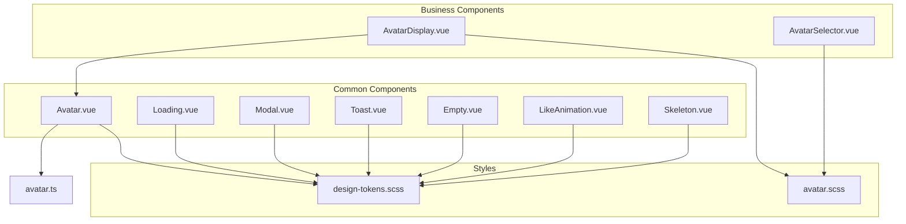
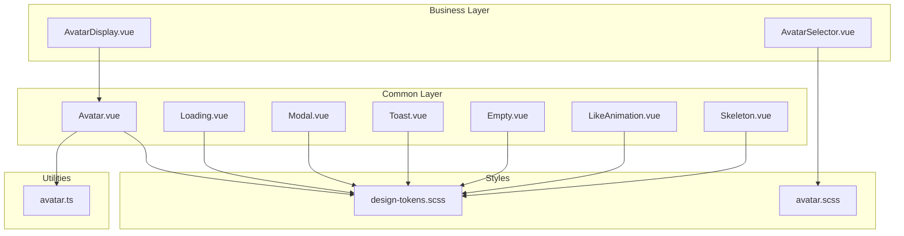
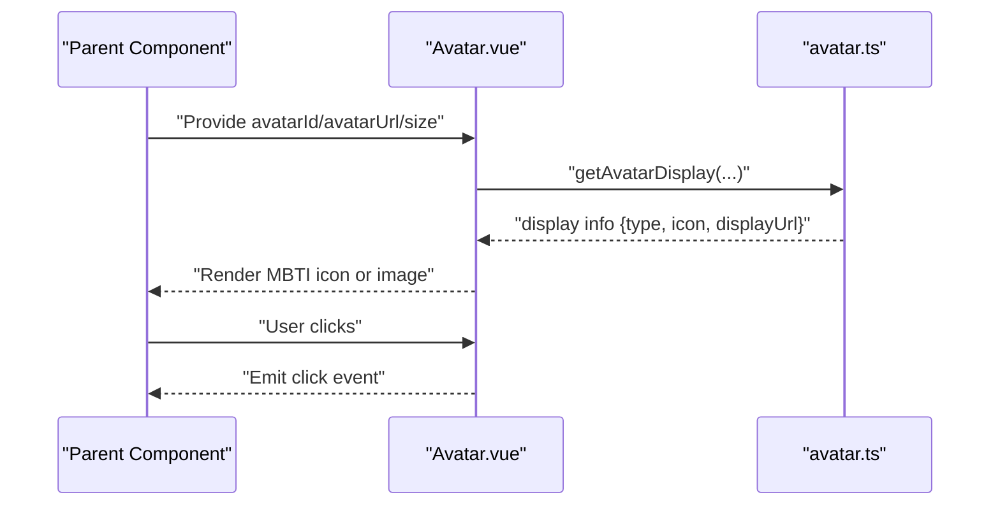
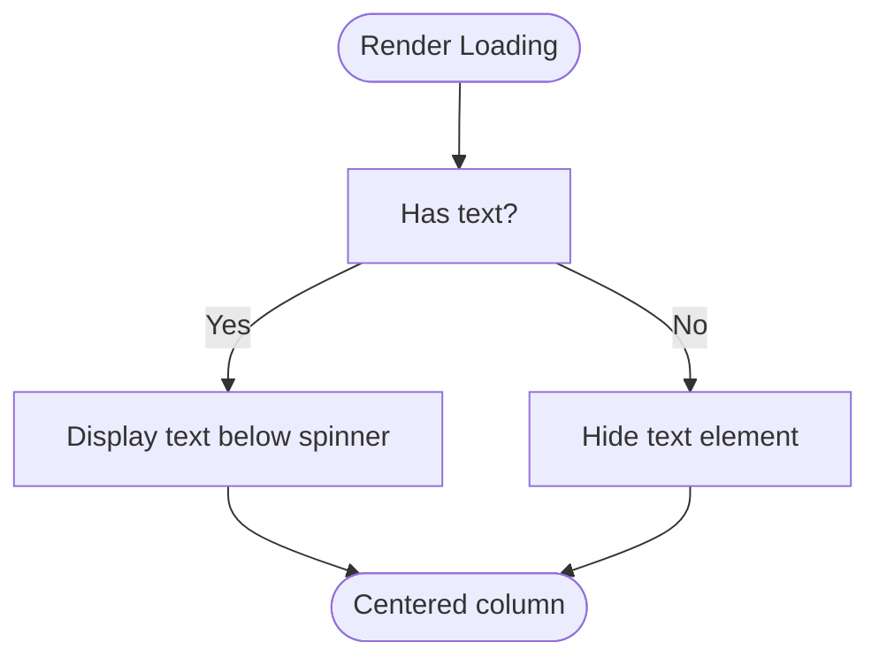
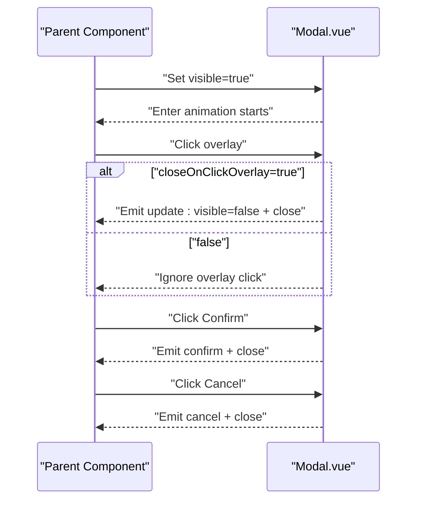
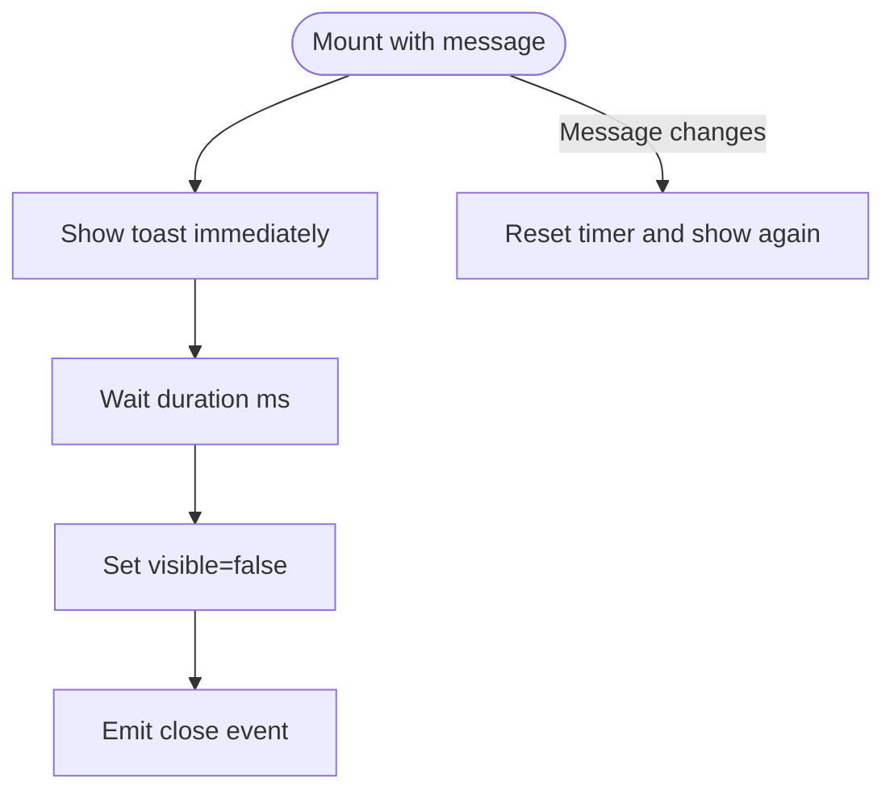
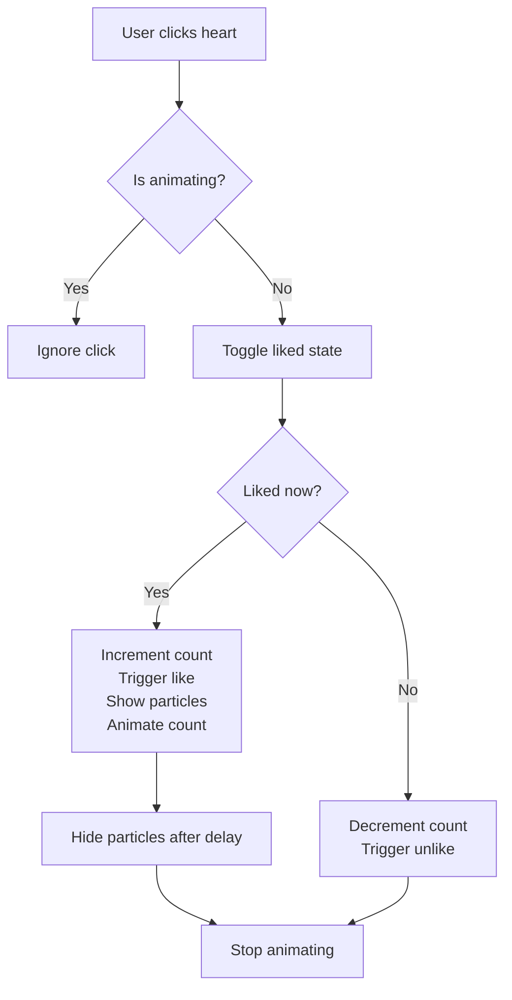
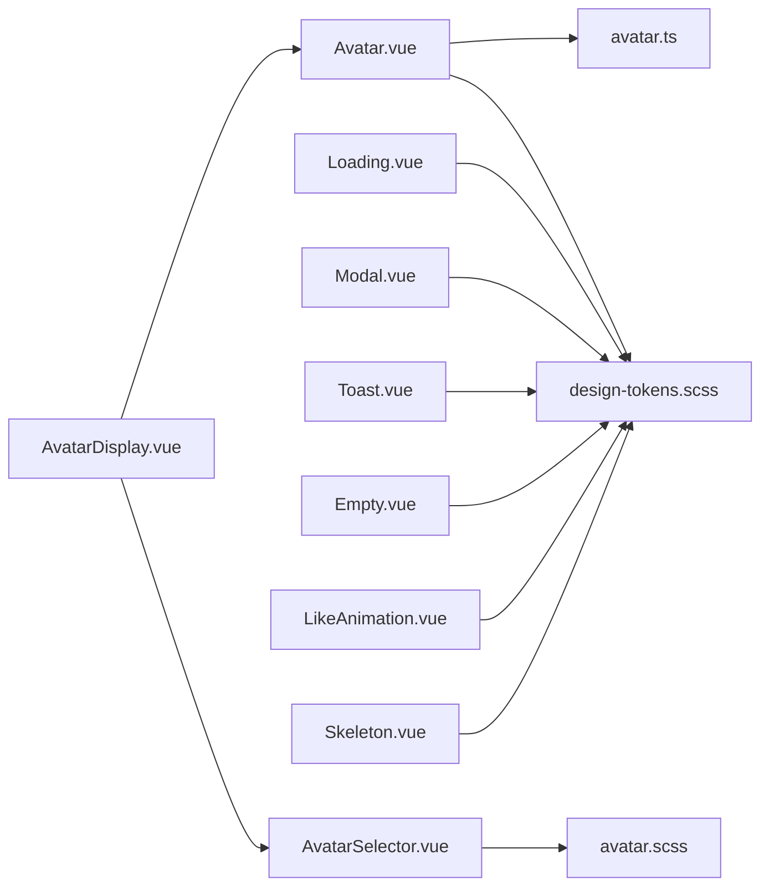

# Common Components

<cite>
**Referenced Files in This Document**
- [Avatar.vue](file://src/components/common/Avatar.vue)
- [Loading.vue](file://src/components/common/Loading.vue)
- [Modal.vue](file://src/components/common/Modal.vue)
- [Toast.vue](file://src/components/common/Toast.vue)
- [Empty.vue](file://src/components/common/Empty.vue)
- [LikeAnimation.vue](file://src/components/common/LikeAnimation.vue)
- [Skeleton.vue](file://src/components/common/Skeleton.vue)
- [avatar.ts](file://src/utils/avatar.ts)
- [design-tokens.scss](file://src/assets/styles/design-tokens.scss)
- [avatar.scss](file://src/assets/styles/avatar.scss)
- [AvatarDisplay.vue](file://src/components/business/AvatarDisplay.vue)
- [AvatarSelector.vue](file://src/components/business/AvatarSelector.vue)
- [BaseCard.vue](file://src/pages/tabbar/home/components/BaseCard.vue)
- [BilibiliComment.vue](file://src/components/business/BilibiliComment.vue)
- [PostCard.vue](file://src/components/business/PostCard.vue)
- [message.vue](file://src/pages/tabbar/message.vue)
- [user/detail.vue](file://src/pages/user/detail.vue)
- [square.vue](file://src/pages/tabbar/square.vue)
- [chat/list.vue](file://src/pages/chat/list.vue)
</cite>

## Table of Contents
1. [Introduction](#introduction)
2. [Project Structure](#project-structure)
3. [Core Components](#core-components)
4. [Architecture Overview](#architecture-overview)
5. [Detailed Component Analysis](#detailed-component-analysis)
6. [Dependency Analysis](#dependency-analysis)
7. [Performance Considerations](#performance-considerations)
8. [Troubleshooting Guide](#troubleshooting-guide)
9. [Conclusion](#conclusion)
10. [Appendices](#appendices)

## Introduction
This document describes the common utility components used across the WeTogether platform. It focuses on foundational components that appear frequently in the UI: Avatar for user profile display, Loading for async operation feedback, Modal for dialog interfaces, Toast for notifications, Empty for empty state handling, LikeAnimation for engagement feedback, and Skeleton for loading placeholders. For each component, we explain visual design, behavior, accessibility considerations, cross-platform compatibility, props, events, styling customization, and integration patterns. We also provide usage examples, best practices, and guidelines for consistency.

## Project Structure
The common components live under src/components/common and are complemented by shared styles and utilities. Business components that integrate these common components (such as AvatarDisplay and AvatarSelector) reside under src/components/business. Styles are centralized in src/assets/styles, including design tokens and avatar-specific SCSS.

**Diagram sources**
- [Avatar.vue:1-95](file://src/components/common/Avatar.vue#L1-L95)
- [Loading.vue:1-46](file://src/components/common/Loading.vue#L1-L46)
- [Modal.vue:1-236](file://src/components/common/Modal.vue#L1-L236)
- [Toast.vue:1-139](file://src/components/common/Toast.vue#L1-L139)
- [Empty.vue:1-34](file://src/components/common/Empty.vue#L1-L34)
- [LikeAnimation.vue:1-236](file://src/components/common/LikeAnimation.vue#L1-L236)
- [Skeleton.vue:1-169](file://src/components/common/Skeleton.vue#L1-L169)
- [avatar.ts:1-93](file://src/utils/avatar.ts#L1-L93)
- [design-tokens.scss:1-240](file://src/assets/styles/design-tokens.scss#L1-L240)
- [avatar.scss:1-753](file://src/assets/styles/avatar.scss#L1-L753)
- [AvatarDisplay.vue:1-87](file://src/components/business/AvatarDisplay.vue#L1-L87)
- [AvatarSelector.vue:1-286](file://src/components/business/AvatarSelector.vue#L1-L286)

**Section sources**
- [Avatar.vue:1-95](file://src/components/common/Avatar.vue#L1-L95)
- [Loading.vue:1-46](file://src/components/common/Loading.vue#L1-L46)
- [Modal.vue:1-236](file://src/components/common/Modal.vue#L1-L236)
- [Toast.vue:1-139](file://src/components/common/Toast.vue#L1-L139)
- [Empty.vue:1-34](file://src/components/common/Empty.vue#L1-L34)
- [LikeAnimation.vue:1-236](file://src/components/common/LikeAnimation.vue#L1-L236)
- [Skeleton.vue:1-169](file://src/components/common/Skeleton.vue#L1-L169)
- [avatar.ts:1-93](file://src/utils/avatar.ts#L1-L93)
- [design-tokens.scss:1-240](file://src/assets/styles/design-tokens.scss#L1-L240)
- [avatar.scss:1-753](file://src/assets/styles/avatar.scss#L1-L753)
- [AvatarDisplay.vue:1-87](file://src/components/business/AvatarDisplay.vue#L1-L87)
- [AvatarSelector.vue:1-286](file://src/components/business/AvatarSelector.vue#L1-L286)

## Core Components
This section summarizes each component’s purpose, props/events, styling hooks, and integration patterns.

- Avatar
  - Purpose: Render user avatar with fallback to MBTI preset or custom URL.
  - Props: avatarId, avatarUrl, size ('small' | 'medium' | 'large').
  - Event: click.
  - Behavior: Computes display based on utility, supports click propagation.
  - Integration: Used widely in PostCard, BilibiliComment, Message page, User Detail.
  - Accessibility: No explicit ARIA attributes; ensure parent context provides labeling if needed.
  - Cross-platform: Uses uni-app view/image; tested on H5 and mini-program targets.

- Loading
  - Purpose: Provide spinner and optional text during async operations.
  - Props: text (optional).
  - Behavior: Centered column layout with spinning animation.
  - Integration: Used in friend lists and square feed.

- Modal
  - Purpose: Dialog overlay with header, body, footer, and optional close button.
  - Props: visible, title, content, showClose, showFooter, showCancel, confirmText, cancelText, closeOnClickOverlay.
  - Events: update:visible, confirm, cancel, close.
  - Behavior: Fade-in + slide-up entrance; optional bounce on open; overlay click handling.
  - Styling: Uses design tokens for spacing, colors, radii, z-index.

- Toast
  - Purpose: Notification overlay with type, icon, and positioning.
  - Props: message, type ('success' | 'error' | 'warning' | 'info' | 'default'), duration, position ('top' | 'center' | 'bottom'), showIcon.
  - Event: close.
  - Behavior: Auto-dismiss after duration; re-triggers on message change.

- Empty
  - Purpose: Empty state placeholder with icon and optional action slot.
  - Props: text (optional).
  - Behavior: Centered column with subdued appearance.

- LikeAnimation
  - Purpose: Animated heart with particle burst and numeric counter.
  - Props: liked (boolean), count (number), showCount (boolean).
  - Events: like, unlike.
  - Behavior: Toggle liked state, animate bounce/icon scaling, emit events, manage particle effects and count increase animation.

- Skeleton
  - Purpose: Shimmer placeholders for avatar, image, text, and card layouts.
  - Props: type ('avatar' | 'image' | 'text' | 'card'), width, height, animated, showImage.
  - Behavior: Animated shimmer via pseudo-element gradient movement; card variant composes header/content/image.

**Section sources**
- [Avatar.vue:17-42](file://src/components/common/Avatar.vue#L17-L42)
- [Loading.vue:8-12](file://src/components/common/Loading.vue#L8-L12)
- [Modal.vue:29-94](file://src/components/common/Modal.vue#L29-L94)
- [Toast.vue:15-52](file://src/components/common/Toast.vue#L15-L52)
- [Empty.vue:9-13](file://src/components/common/Empty.vue#L9-L13)
- [LikeAnimation.vue:27-100](file://src/components/common/LikeAnimation.vue#L27-L100)
- [Skeleton.vue:49-82](file://src/components/common/Skeleton.vue#L49-L82)

## Architecture Overview
The common components are designed to be reusable and self-contained. They rely on shared design tokens and SCSS mixins for consistent spacing, typography, and colors. Business components (e.g., AvatarDisplay, AvatarSelector) orchestrate common components and state management.

**Diagram sources**
- [AvatarDisplay.vue:1-87](file://src/components/business/AvatarDisplay.vue#L1-L87)
- [AvatarSelector.vue:1-286](file://src/components/business/AvatarSelector.vue#L1-L286)
- [Avatar.vue:1-95](file://src/components/common/Avatar.vue#L1-L95)
- [Loading.vue:1-46](file://src/components/common/Loading.vue#L1-L46)
- [Modal.vue:1-236](file://src/components/common/Modal.vue#L1-L236)
- [Toast.vue:1-139](file://src/components/common/Toast.vue#L1-L139)
- [Empty.vue:1-34](file://src/components/common/Empty.vue#L1-L34)
- [LikeAnimation.vue:1-236](file://src/components/common/LikeAnimation.vue#L1-L236)
- [Skeleton.vue:1-169](file://src/components/common/Skeleton.vue#L1-L169)
- [avatar.ts:1-93](file://src/utils/avatar.ts#L1-L93)
- [design-tokens.scss:1-240](file://src/assets/styles/design-tokens.scss#L1-L240)
- [avatar.scss:1-753](file://src/assets/styles/avatar.scss#L1-L753)

## Detailed Component Analysis

### Avatar
- Visual design: Circular container with either a gradient MBTI icon or a custom avatar image; size variants small/medium/large.
- Behavioral patterns: Computed display selection via utility; emits click event; click handled by parent.
- Accessibility: No ARIA roles; ensure surrounding context labels the avatar if used alone.
- Cross-platform: Uses uni-app view/image; compatible with H5 and mini-program environments.
- Props and events:
  - Props: avatarId?, avatarUrl?, size?
  - Emits: click
- Styling customization: Size classes and SCSS define dimensions and typography scales.
- Integration patterns: Imported by PostCard, BilibiliComment, Message page, and User Detail.

**Diagram sources**
- [Avatar.vue:17-42](file://src/components/common/Avatar.vue#L17-L42)
- [avatar.ts:53-92](file://src/utils/avatar.ts#L53-L92)

**Section sources**
- [Avatar.vue:1-95](file://src/components/common/Avatar.vue#L1-L95)
- [avatar.ts:1-93](file://src/utils/avatar.ts#L1-L93)
- [avatar.scss:1-753](file://src/assets/styles/avatar.scss#L1-L753)

### Loading
- Visual design: Circular spinner with subtle blue accent and centered text label.
- Behavioral patterns: Column-centered layout; spinner rotates indefinitely.
- Props and events: text optional; no emitted events.
- Styling customization: Uses design tokens for spacing and color.

**Diagram sources**
- [Loading.vue:1-46](file://src/components/common/Loading.vue#L1-L46)

**Section sources**
- [Loading.vue:1-46](file://src/components/common/Loading.vue#L1-L46)
- [design-tokens.scss:1-240](file://src/assets/styles/design-tokens.scss#L1-L240)

### Modal
- Visual design: Fullscreen overlay with modal container, header/title/close, body, and footer with confirm/cancel buttons.
- Behavioral patterns: Entrance animations (fade-in, slide-up, optional bounce); overlay click-to-close configurable; emits update:visible, confirm, cancel, close.
- Props and events:
  - Props: visible, title, content, showClose, showFooter, showCancel, confirmText, cancelText, closeOnClickOverlay
  - Emits: update:visible, confirm, cancel, close
- Styling customization: Uses design tokens for z-index, radius, paddings, colors, and animations.

**Diagram sources**
- [Modal.vue:29-94](file://src/components/common/Modal.vue#L29-L94)

**Section sources**
- [Modal.vue:1-236](file://src/components/common/Modal.vue#L1-L236)
- [design-tokens.scss:1-240](file://src/assets/styles/design-tokens.scss#L1-L240)

### Toast
- Visual design: Fixed-positioned toast with optional icon and backdrop blur; supports top/center/bottom positions.
- Behavioral patterns: Auto-dismiss after duration; re-triggers on message change; emits close.
- Props and events:
  - Props: message, type, duration, position, showIcon
  - Emits: close
- Styling customization: Uses design tokens for background, radius, spacing, and animations.

**Diagram sources**
- [Toast.vue:15-52](file://src/components/common/Toast.vue#L15-L52)

**Section sources**
- [Toast.vue:1-139](file://src/components/common/Toast.vue#L1-L139)
- [design-tokens.scss:1-240](file://src/assets/styles/design-tokens.scss#L1-L240)

### Empty
- Visual design: Centered column with large empty icon and muted text; optional action slot.
- Props and events: text optional; no emitted events.
- Styling customization: Uses design tokens for spacing and color.

**Section sources**
- [Empty.vue:1-34](file://src/components/common/Empty.vue#L1-L34)
- [design-tokens.scss:1-240](file://src/assets/styles/design-tokens.scss#L1-L240)

### LikeAnimation
- Visual design: Heart icon with liked/unliked states, bounce and scale animations, floating particles, and animated count.
- Behavioral patterns: Prevents concurrent animations; toggles liked state; increments/decrements count; triggers like/unlike events; manages particle and count animations.
- Props and events:
  - Props: liked, count, showCount
  - Emits: like, unlike
- Styling customization: Uses design tokens for spacing, colors, and animations.

**Diagram sources**
- [LikeAnimation.vue:27-100](file://src/components/common/LikeAnimation.vue#L27-L100)

**Section sources**
- [LikeAnimation.vue:1-236](file://src/components/common/LikeAnimation.vue#L1-L236)
- [design-tokens.scss:1-240](file://src/assets/styles/design-tokens.scss#L1-L240)

### Skeleton
- Visual design: Shimmering placeholders for avatar, image, text, and card; optional image within card.
- Behavioral patterns: Animated shimmer via pseudo-element; configurable dimensions and types.
- Props and events: type, width, height, animated, showImage; no emitted events.
- Styling customization: Uses design tokens for backgrounds, radii, and spacing.

**Section sources**
- [Skeleton.vue:1-169](file://src/components/common/Skeleton.vue#L1-L169)
- [design-tokens.scss:1-240](file://src/assets/styles/design-tokens.scss#L1-L240)

## Dependency Analysis
Common components depend on shared design tokens and SCSS mixins. Avatar depends on avatar utility for display resolution. Business components integrate common components and state management.

**Diagram sources**
- [Avatar.vue:1-95](file://src/components/common/Avatar.vue#L1-L95)
- [avatar.ts:1-93](file://src/utils/avatar.ts#L1-L93)
- [design-tokens.scss:1-240](file://src/assets/styles/design-tokens.scss#L1-L240)
- [AvatarDisplay.vue:1-87](file://src/components/business/AvatarDisplay.vue#L1-L87)
- [AvatarSelector.vue:1-286](file://src/components/business/AvatarSelector.vue#L1-L286)
- [avatar.scss:1-753](file://src/assets/styles/avatar.scss#L1-L753)

**Section sources**
- [Avatar.vue:1-95](file://src/components/common/Avatar.vue#L1-L95)
- [avatar.ts:1-93](file://src/utils/avatar.ts#L1-L93)
- [design-tokens.scss:1-240](file://src/assets/styles/design-tokens.scss#L1-L240)
- [AvatarDisplay.vue:1-87](file://src/components/business/AvatarDisplay.vue#L1-L87)
- [AvatarSelector.vue:1-286](file://src/components/business/AvatarSelector.vue#L1-L286)
- [avatar.scss:1-753](file://src/assets/styles/avatar.scss#L1-L753)

## Performance Considerations
- Minimize reflows: Prefer CSS transforms for animations (already used in Modal, Toast, LikeAnimation).
- Avoid layout thrashing: Batch DOM updates when toggling visibility (Modal and Toast already use single reactive flags).
- Efficient placeholders: Skeleton uses pseudo-element shimmer; keep animated off for heavy lists if needed.
- Image sizing: Avatar uses aspectFill; ensure appropriate sizes to reduce decoding cost.
- Debounce frequent updates: For Toast, changing message resets timers; avoid rapid updates in loops.

[No sources needed since this section provides general guidance]

## Troubleshooting Guide
- Avatar not displaying:
  - Verify avatarId range and avatarUrl availability; fallback defaults to a static default avatar.
  - Ensure proper mode on image tag for avatar rendering.
- Modal not closing:
  - Check closeOnClickOverlay and overlay click handler; ensure update:visible is bound.
- Toast not hiding:
  - Confirm duration > 0; message changes reset timer; ensure not continuously updating message.
- LikeAnimation stuck:
  - Animation guard prevents concurrent toggles; ensure no rapid successive clicks.
- Skeleton not animating:
  - animated flag must be true; ensure pseudo-element styles are applied.

**Section sources**
- [Avatar.vue:1-95](file://src/components/common/Avatar.vue#L1-L95)
- [Modal.vue:74-94](file://src/components/common/Modal.vue#L74-L94)
- [Toast.vue:39-52](file://src/components/common/Toast.vue#L39-L52)
- [LikeAnimation.vue:68-100](file://src/components/common/LikeAnimation.vue#L68-L100)
- [Skeleton.vue:87-112](file://src/components/common/Skeleton.vue#L87-L112)

## Conclusion
These common components form the backbone of WeTogether’s UI consistency and user experience. They are designed to be self-contained, customizable via shared design tokens, and easily integrated across business components. Following the usage patterns and best practices outlined here ensures predictable behavior, strong accessibility, and efficient rendering across platforms.

[No sources needed since this section summarizes without analyzing specific files]

## Appendices

### Usage Examples and Integration Patterns
- Avatar in PostCard and BilibiliComment:
  - Import Avatar and pass avatarId/avatarUrl/size; handle click to navigate to user detail.
- AvatarDisplay and AvatarSelector:
  - Use AvatarDisplay to render current avatar; emit select to open AvatarSelector; confirm saves selection to store.
- Loading and Empty:
  - Wrap async lists with Loading; switch to Empty when no items.
- Modal:
  - Bind visible to a reactive flag; listen to confirm/cancel/close to drive actions.
- Toast:
  - Trigger on success/error outcomes; configure type and position for emphasis.
- LikeAnimation:
  - Integrate with like/unlike handlers; optionally show count; ensure animations are not stacked.
- Skeleton:
  - Place before async data loads; choose type and dimensions matching target layout.

**Section sources**
- [PostCard.vue](file://src/components/business/PostCard.vue#L99)
- [BilibiliComment.vue](file://src/components/business/BilibiliComment.vue#L163)
- [AvatarDisplay.vue:1-87](file://src/components/business/AvatarDisplay.vue#L1-L87)
- [AvatarSelector.vue:1-286](file://src/components/business/AvatarSelector.vue#L1-L286)
- [message.vue:48-49](file://src/pages/tabbar/message.vue#L48-L49)
- [user/detail.vue:99-100](file://src/pages/user/detail.vue#L99-L100)
- [square.vue:76-78](file://src/pages/tabbar/square.vue#L76-L78)
- [chat/list.vue:62-310](file://src/pages/chat/list.vue#L62-L310)