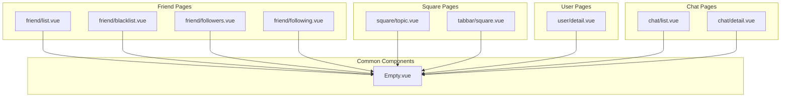
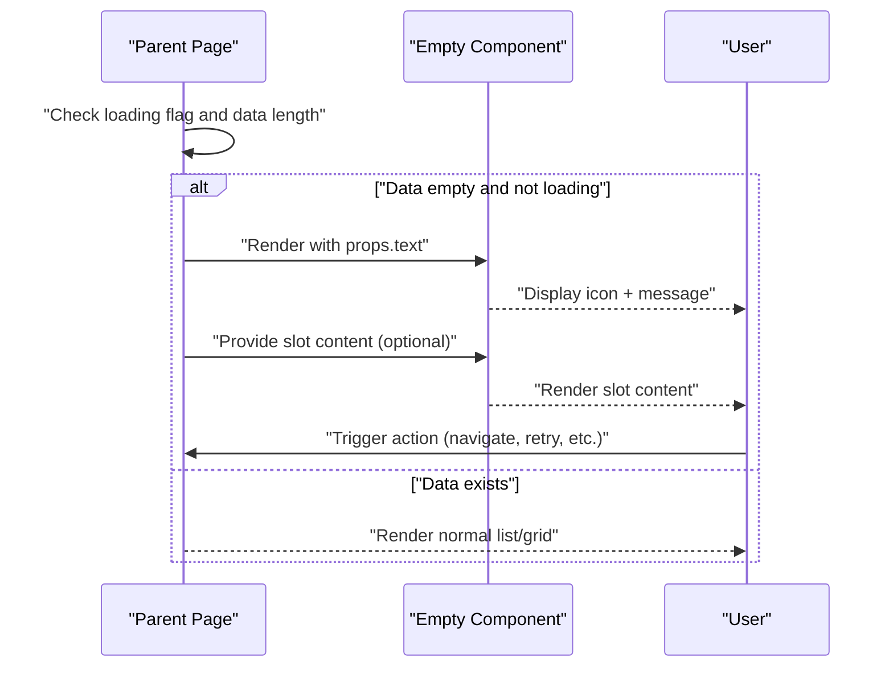
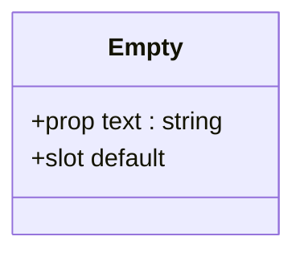
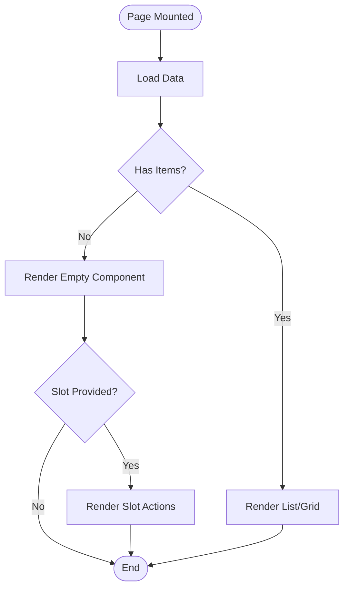
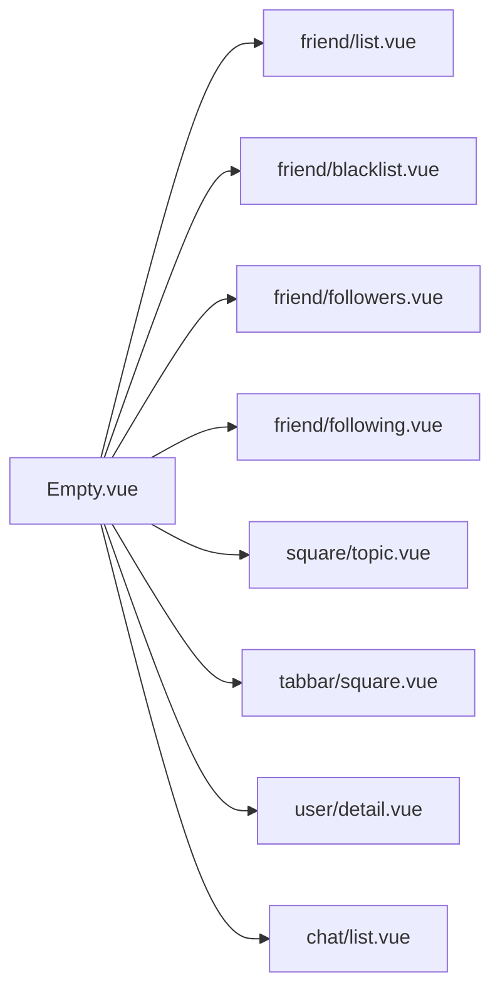

# Empty Component

<cite>
**Referenced Files in This Document**
- [Empty.vue](file://src/components/common/Empty.vue)
- [list.vue](file://src/pages/friend/list.vue)
- [blacklist.vue](file://src/pages/friend/blacklist.vue)
- [followers.vue](file://src/pages/friend/followers.vue)
- [following.vue](file://src/pages/friend/following.vue)
- [topic.vue](file://src/pages/square/topic.vue)
- [message.vue](file://src/pages/tabbar/message.vue)
- [square.vue](file://src/pages/tabbar/square.vue)
- [detail.vue](file://src/pages/user/detail.vue)
- [list.vue](file://src/pages/chat/list.vue)
</cite>

## Table of Contents
1. [Introduction](#introduction)
2. [Project Structure](#project-structure)
3. [Core Components](#core-components)
4. [Architecture Overview](#architecture-overview)
5. [Detailed Component Analysis](#detailed-component-analysis)
6. [Dependency Analysis](#dependency-analysis)
7. [Performance Considerations](#performance-considerations)
8. [Troubleshooting Guide](#troubleshooting-guide)
9. [Conclusion](#conclusion)

## Introduction
The Empty component is a lightweight, reusable UI element designed to present friendly, non-blocking empty states across the application. It standardizes how the app communicates absence of data (e.g., no friends, no messages, no posts) while maintaining consistent visual rhythm and accessibility. The component renders an icon, a concise message, and supports optional interactive content via slots, enabling call-to-action buttons or guidance links to encourage user engagement.

## Project Structure
The Empty component resides under the common components directory and is imported and used across multiple pages to handle empty scenarios in lists, search results, and feature sections.

**Diagram sources**
- [Empty.vue:1-34](file://src/components/common/Empty.vue#L1-L34)
- [list.vue:20-30](file://src/pages/friend/list.vue#L20-L30)
- [blacklist.vue:31-33](file://src/pages/friend/blacklist.vue#L31-L33)
- [followers.vue:19-21](file://src/pages/friend/followers.vue#L19-L21)
- [following.vue:19-21](file://src/pages/friend/following.vue#L19-L21)
- [topic.vue:131-146](file://src/pages/square/topic.vue#L131-L146)
- [square.vue:63-68](file://src/pages/tabbar/square.vue#L63-L68)
- [detail.vue:84-90](file://src/pages/user/detail.vue#L84-L90)
- [list.vue:49-54](file://src/pages/chat/list.vue#L49-L54)

**Section sources**
- [Empty.vue:1-34](file://src/components/common/Empty.vue#L1-L34)
- [list.vue:1-184](file://src/pages/friend/list.vue#L1-L184)
- [blacklist.vue:1-261](file://src/pages/friend/blacklist.vue#L1-L261)
- [followers.vue:1-178](file://src/pages/friend/followers.vue#L1-L178)
- [following.vue:1-160](file://src/pages/friend/following.vue#L1-L160)
- [topic.vue:1-755](file://src/pages/square/topic.vue#L1-L755)
- [square.vue:1-393](file://src/pages/tabbar/square.vue#L1-L393)
- [detail.vue:1-569](file://src/pages/user/detail.vue#L1-L569)
- [list.vue:1-311](file://src/pages/chat/list.vue#L1-L311)

## Core Components
- Empty.vue: Minimal Vue SFC that renders a centered layout with an icon, a text message, and a default slot for optional actions. It accepts a single prop for the message text and applies a consistent visual style.

Key characteristics:
- Props: text (optional)
- Slots: default slot for custom actions/buttons
- Visual design: centered column layout, muted icon and text, subtle spacing and sizing

Usage pattern across pages:
- Conditionally render Empty when data arrays are empty and loading is false
- Pass localized text messages appropriate to the context
- Optionally provide call-to-action buttons inside the slot

**Section sources**
- [Empty.vue:1-34](file://src/components/common/Empty.vue#L1-L34)

## Architecture Overview
The Empty component follows a unidirectional data flow pattern:
- Parent pages manage state (loading flags, data arrays)
- When data length equals zero and loading is false, the Empty component is rendered
- Optional children (buttons, links) are projected via the default slot to guide user actions

**Diagram sources**
- [Empty.vue:1-34](file://src/components/common/Empty.vue#L1-L34)
- [list.vue:20-21](file://src/pages/friend/list.vue#L20-L21)
- [message.vue:38-40](file://src/pages/tabbar/message.vue#L38-L40)
- [topic.vue:131-132](file://src/pages/square/topic.vue#L131-L132)

## Detailed Component Analysis

### Empty.vue Implementation
- Template: Container with icon, text, and default slot
- Script: Defines a single optional prop for the message text
- Styles: Flex-centered layout, responsive sizing, muted colors, and spacing

**Diagram sources**
- [Empty.vue:9-12](file://src/components/common/Empty.vue#L9-L12)

**Section sources**
- [Empty.vue:1-34](file://src/components/common/Empty.vue#L1-L34)

### Integration Patterns Across Pages
- Friend list: Renders Empty when friend list is empty after loading completes
- Followers/Following: Renders Empty when follower/following lists are empty
- Blacklist: Renders Empty when blacklist is empty
- Square topic: Renders Empty when topic posts are absent
- Square feed: Renders Empty when posts list is empty
- User detail: Renders Empty when user posts are absent
- Chat list: Renders Empty when conversations list is empty

**Diagram sources**
- [list.vue:20-21](file://src/pages/friend/list.vue#L20-L21)
- [followers.vue:19-20](file://src/pages/friend/followers.vue#L19-L20)
- [following.vue:19-20](file://src/pages/friend/following.vue#L19-L20)
- [blacklist.vue:31-32](file://src/pages/friend/blacklist.vue#L31-L32)
- [topic.vue:131-132](file://src/pages/square/topic.vue#L131-L132)
- [square.vue:63-67](file://src/pages/tabbar/square.vue#L63-L67)
- [detail.vue:84-89](file://src/pages/user/detail.vue#L84-L89)
- [list.vue:49-53](file://src/pages/chat/list.vue#L49-L53)

**Section sources**
- [list.vue:1-184](file://src/pages/friend/list.vue#L1-L184)
- [blacklist.vue:1-261](file://src/pages/friend/blacklist.vue#L1-L261)
- [followers.vue:1-178](file://src/pages/friend/followers.vue#L1-L178)
- [following.vue:1-160](file://src/pages/friend/following.vue#L1-L160)
- [topic.vue:1-755](file://src/pages/square/topic.vue#L1-L755)
- [message.vue:1-293](file://src/pages/tabbar/message.vue#L1-L293)
- [square.vue:1-393](file://src/pages/tabbar/square.vue#L1-L393)
- [detail.vue:1-569](file://src/pages/user/detail.vue#L1-L569)
- [list.vue:1-311](file://src/pages/chat/list.vue#L1-L311)

### Usage Examples

- Empty search results
  - Pattern: Render Empty when search results array length is 0 and loading is false
  - Example references:
    - [topic.vue:131-132](file://src/pages/square/topic.vue#L131-L132)
    - [square.vue:63-67](file://src/pages/tabbar/square.vue#L63-L67)

- Empty friend lists
  - Pattern: Render Empty when friend list is empty after loading
  - Example references:
    - [list.vue:20-21](file://src/pages/friend/list.vue#L20-L21)

- Empty message threads
  - Pattern: Render Empty when conversations list is empty
  - Example references:
    - [list.vue:49-53](file://src/pages/chat/list.vue#L49-L53)

- Feature setup prompts
  - Pattern: Provide call-to-action buttons inside the Empty slot to guide users to create content or connect with others
  - Example references:
    - [message.vue:38-40](file://src/pages/tabbar/message.vue#L38-L40)

**Section sources**
- [topic.vue:120-146](file://src/pages/square/topic.vue#L120-L146)
- [square.vue:63-68](file://src/pages/tabbar/square.vue#L63-L68)
- [list.vue:20-21](file://src/pages/friend/list.vue#L20-L21)
- [list.vue:49-54](file://src/pages/chat/list.vue#L49-L54)
- [message.vue:38-40](file://src/pages/tabbar/message.vue#L38-L40)

### Prop Configurations and Customization
- text: Optional message displayed below the icon
- default slot: Optional content for call-to-action buttons or guidance links

Integration examples:
- Passing localized text for different contexts
- Injecting buttons (e.g., "Go to square", "Publish post") inside the slot to drive engagement

**Section sources**
- [Empty.vue:9-12](file://src/components/common/Empty.vue#L9-L12)
- [message.vue:38-40](file://src/pages/tabbar/message.vue#L38-L40)

### Accessibility and Internationalization
- Accessibility
  - Uses semantic text nodes for screen readers
  - Maintains readable contrast and font sizes
  - Centered layout ensures consistent focus and navigation behavior

- Internationalization
  - Text content is passed as props, allowing localization per locale
  - No hardcoded English strings in the Empty component itself

**Section sources**
- [Empty.vue:23-32](file://src/components/common/Empty.vue#L23-L32)
- [topic.vue:131-146](file://src/pages/square/topic.vue#L131-L146)
- [message.vue:38-40](file://src/pages/tabbar/message.vue#L38-L40)

### Best Practices for Empty States
- Keep messages concise and actionable
- Provide clear next steps via the default slot
- Match the surrounding UI tone and spacing
- Avoid overwhelming users; maintain a friendly, non-threatening presentation
- Use icons sparingly and consistently across the app

[No sources needed since this section provides general guidance]

## Dependency Analysis
The Empty component is a leaf UI component with minimal dependencies. It is consumed by multiple pages across different feature areas, ensuring consistent empty-state UX.

**Diagram sources**
- [Empty.vue:1-34](file://src/components/common/Empty.vue#L1-L34)
- [list.vue:20-30](file://src/pages/friend/list.vue#L20-L30)
- [blacklist.vue:31-33](file://src/pages/friend/blacklist.vue#L31-L33)
- [followers.vue:19-21](file://src/pages/friend/followers.vue#L19-L21)
- [following.vue:19-21](file://src/pages/friend/following.vue#L19-L21)
- [topic.vue:131-146](file://src/pages/square/topic.vue#L131-L146)
- [square.vue:63-68](file://src/pages/tabbar/square.vue#L63-L68)
- [detail.vue:84-90](file://src/pages/user/detail.vue#L84-L90)
- [list.vue:49-54](file://src/pages/chat/list.vue#L49-L54)

**Section sources**
- [Empty.vue:1-34](file://src/components/common/Empty.vue#L1-L34)
- [list.vue:1-184](file://src/pages/friend/list.vue#L1-L184)
- [blacklist.vue:1-261](file://src/pages/friend/blacklist.vue#L1-L261)
- [followers.vue:1-178](file://src/pages/friend/followers.vue#L1-L178)
- [following.vue:1-160](file://src/pages/friend/following.vue#L1-L160)
- [topic.vue:1-755](file://src/pages/square/topic.vue#L1-L755)
- [square.vue:1-393](file://src/pages/tabbar/square.vue#L1-L393)
- [detail.vue:1-569](file://src/pages/user/detail.vue#L1-L569)
- [list.vue:1-311](file://src/pages/chat/list.vue#L1-L311)

## Performance Considerations
- Rendering cost: Minimal DOM footprint; ideal for repeated use in lists
- Conditional rendering: Ensure Empty is only shown when loading is false and data length is zero to avoid flicker
- Slot content: Keep slot content lightweight to prevent layout thrashing in long lists

[No sources needed since this section provides general guidance]

## Troubleshooting Guide
- Empty appears during initial load
  - Cause: Empty is rendered when loading is false and data length is zero
  - Fix: Ensure loading flags are set appropriately before checking data length

- Empty does not appear when expected
  - Cause: Incorrect condition logic or missing imports
  - Fix: Verify the condition checks and import statements for Empty

- Slot content not visible
  - Cause: Missing default slot usage in parent page
  - Fix: Wrap desired actions inside the Empty component tag

**Section sources**
- [list.vue:20-21](file://src/pages/friend/list.vue#L20-L21)
- [blacklist.vue:31-33](file://src/pages/friend/blacklist.vue#L31-L33)
- [followers.vue:19-20](file://src/pages/friend/followers.vue#L19-L20)
- [following.vue:19-20](file://src/pages/friend/following.vue#L19-L20)
- [topic.vue:131-132](file://src/pages/square/topic.vue#L131-L132)
- [square.vue:63-67](file://src/pages/tabbar/square.vue#L63-L67)
- [detail.vue:84-89](file://src/pages/user/detail.vue#L84-L89)
- [list.vue:49-53](file://src/pages/chat/list.vue#L49-L53)

## Conclusion
The Empty component provides a consistent, accessible, and extensible way to communicate empty states across the application. By centralizing the visual presentation and allowing contextual customization via props and slots, it improves maintainability and user experience. Adopting the recommended patterns and best practices ensures empty states remain helpful, non-intrusive, and aligned with the app’s design language.