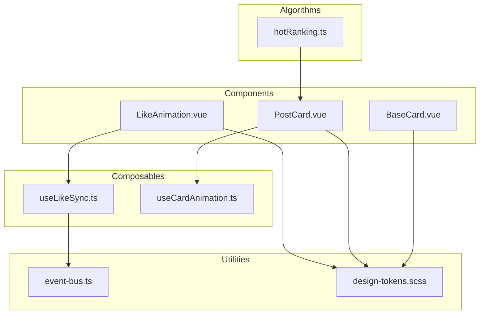
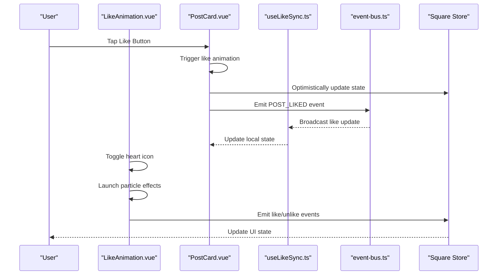
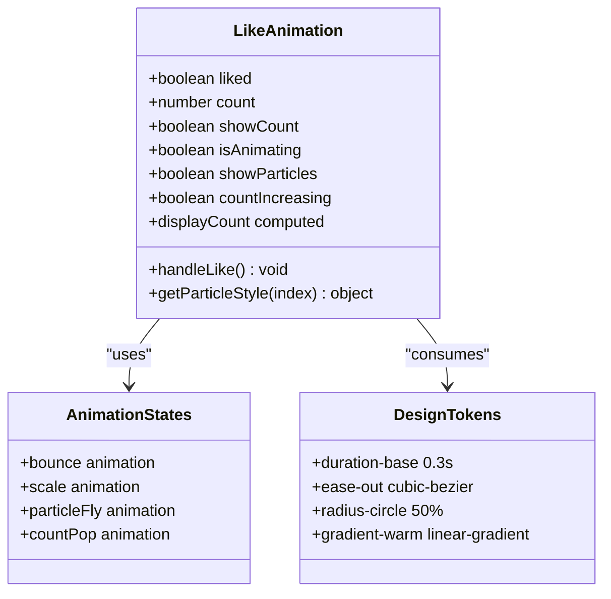
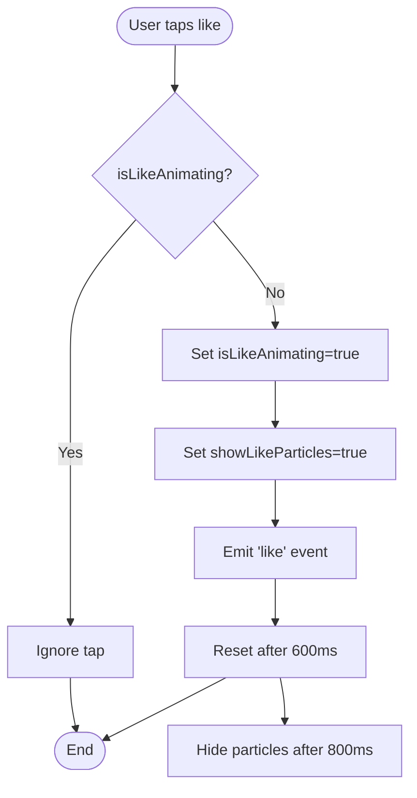
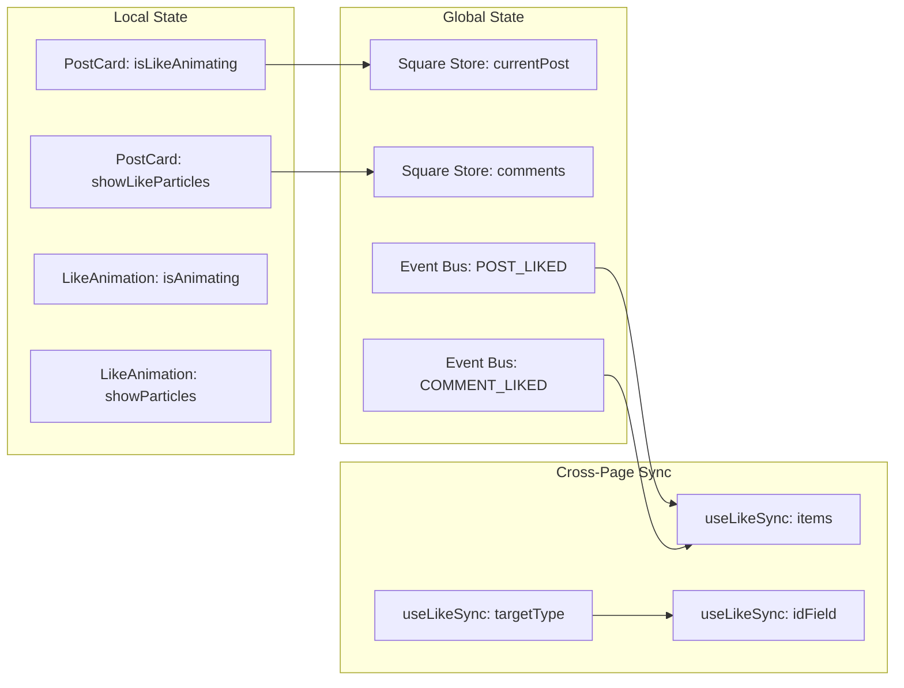
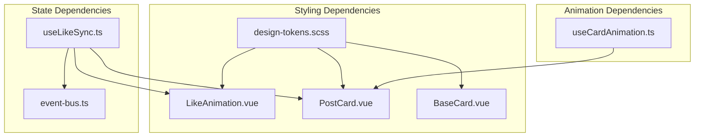

# Like Animation Component

<cite>
**Referenced Files in This Document**
- [LikeAnimation.vue](file://src/components/common/LikeAnimation.vue)
- [PostCard.vue](file://src/components/business/PostCard.vue)
- [useLikeSync.ts](file://src/composables/useLikeSync.ts)
- [event-bus.ts](file://src/utils/event-bus.ts)
- [design-tokens.scss](file://src/assets/styles/design-tokens.scss)
- [useCardAnimation.ts](file://src/pages/tabbar/home/composables/useCardAnimation.ts)
- [BaseCard.vue](file://src/pages/tabbar/home/components/BaseCard.vue)
- [hotRanking.ts](file://src/pages/tabbar/home/algorithms/hotRanking.ts)
</cite>

## Table of Contents
1. [Introduction](#introduction)
2. [Project Structure](#project-structure)
3. [Core Components](#core-components)
4. [Architecture Overview](#architecture-overview)
5. [Detailed Component Analysis](#detailed-component-analysis)
6. [Dependency Analysis](#dependency-analysis)
7. [Performance Considerations](#performance-considerations)
8. [Troubleshooting Guide](#troubleshooting-guide)
9. [Conclusion](#conclusion)
10. [Appendices](#appendices)

## Introduction
This document provides comprehensive documentation for the Like Animation component, focusing on visual feedback mechanisms for user engagement actions. It covers animation effects, timing, styling customization, performance optimization, integration with social interaction features, state management patterns, accessibility considerations, and practical usage examples across the application.

## Project Structure
The Like Animation functionality spans several components and utilities:
- A dedicated Like Animation component for standalone use
- Integration within PostCard for social interactions
- A composable for animation orchestration
- A global event bus for cross-page synchronization
- Design tokens for consistent styling and timing
- BaseCard integration for recommendation cards



**Diagram sources**
- [LikeAnimation.vue:1-236](file://src/components/common/LikeAnimation.vue#L1-L236)
- [PostCard.vue:1-628](file://src/components/business/PostCard.vue#L1-L628)
- [BaseCard.vue:1-314](file://src/pages/tabbar/home/components/BaseCard.vue#L1-L314)
- [useLikeSync.ts:1-49](file://src/composables/useLikeSync.ts#L1-L49)
- [useCardAnimation.ts:1-375](file://src/pages/tabbar/home/composables/useCardAnimation.ts#L1-L375)
- [event-bus.ts:1-49](file://src/utils/event-bus.ts#L1-L49)
- [design-tokens.scss:1-240](file://src/assets/styles/design-tokens.scss#L1-L240)
- [hotRanking.ts:1-173](file://src/pages/tabbar/home/algorithms/hotRanking.ts#L1-L173)

**Section sources**
- [LikeAnimation.vue:1-236](file://src/components/common/LikeAnimation.vue#L1-L236)
- [PostCard.vue:1-628](file://src/components/business/PostCard.vue#L1-L628)
- [useLikeSync.ts:1-49](file://src/composables/useLikeSync.ts#L1-L49)
- [useCardAnimation.ts:1-375](file://src/pages/tabbar/home/composables/useCardAnimation.ts#L1-L375)
- [event-bus.ts:1-49](file://src/utils/event-bus.ts#L1-L49)
- [design-tokens.scss:1-240](file://src/assets/styles/design-tokens.scss#L1-L240)
- [hotRanking.ts:1-173](file://src/pages/tabbar/home/algorithms/hotRanking.ts#L1-L173)

## Core Components
This section documents the primary components involved in the like animation system.

### LikeAnimation.vue
A standalone component providing:
- Toggleable heart icon with visual feedback
- Particle explosion effect around the icon
- Animated like count display with thousand-unit formatting
- Smooth bounce and scaling animations
- Active-state press-down effect

Key features:
- Props: liked, count, showCount
- Emits: like, unlike
- Reactive state for animation flags and particle visibility
- Computed displayCount with "w" suffix for thousands

**Section sources**
- [LikeAnimation.vue:27-115](file://src/components/common/LikeAnimation.vue#L27-L115)

### PostCard.vue
Integrates like functionality within social posts:
- Heart icon with beat and pop animations
- Particle burst effect synchronized with heart animation
- Count change bounce animation
- Optimistic UI updates with rollback on failure
- Event emission for external synchronization

**Section sources**
- [PostCard.vue:48-178](file://src/components/business/PostCard.vue#L48-L178)
- [PostCard.vue:409-521](file://src/components/business/PostCard.vue#L409-L521)

### useLikeSync.ts
Provides cross-page synchronization of like states:
- Listens to global POST_LIKED and COMMENT_LIKED events
- Updates local item state based on targetId and targetType
- Supports configurable idField for different data structures

**Section sources**
- [useLikeSync.ts:16-48](file://src/composables/useLikeSync.ts#L16-L48)

### useCardAnimation.ts
Animation orchestration composable:
- Provides triggerLike, cancelLike, and state management
- Handles particle effects and timing
- Used by recommendation card system for consistent animations

**Section sources**
- [useCardAnimation.ts:59-99](file://src/pages/tabbar/home/composables/useCardAnimation.ts#L59-L99)

### BaseCard.vue
Integration point for recommendation cards:
- Exposes like, skip, and detail action slots
- Provides gradient backgrounds and consistent styling
- Works with useCardAnimation for unified UX

**Section sources**
- [BaseCard.vue:57-124](file://src/pages/tabbar/home/components/BaseCard.vue#L57-L124)

## Architecture Overview
The like animation system follows a layered architecture with clear separation of concerns:



**Diagram sources**
- [PostCard.vue:162-178](file://src/components/business/PostCard.vue#L162-L178)
- [useLikeSync.ts:25-37](file://src/composables/useLikeSync.ts#L25-L37)
- [event-bus.ts:26-31](file://src/utils/event-bus.ts#L26-L31)

The architecture ensures:
- Local-first optimistic updates for immediate feedback
- Global synchronization for cross-page consistency
- Modular animation components for reusability
- Consistent design tokens for visual coherence

## Detailed Component Analysis

### LikeAnimation Component Analysis
The LikeAnimation component implements a comprehensive visual feedback system:



**Diagram sources**
- [LikeAnimation.vue:27-115](file://src/components/common/LikeAnimation.vue#L27-L115)
- [design-tokens.scss:106-117](file://src/assets/styles/design-tokens.scss#L106-L117)

Key animation timings:
- Icon bounce: 0.3s ease-out
- Heart scale: 0.3s ease-out
- Particle fly: 0.8s ease-out
- Count pop: 0.3s ease-out
- Press-down: 0.15s ease-out

Visual effects:
- Drop shadow for liked state
- Gradient particle colors
- Responsive scaling with rpx units
- CSS transforms for smooth performance

**Section sources**
- [LikeAnimation.vue:189-234](file://src/components/common/LikeAnimation.vue#L189-L234)
- [design-tokens.scss:106-117](file://src/assets/styles/design-tokens.scss#L106-L117)

### PostCard Integration Analysis
The PostCard component demonstrates real-world integration patterns:



**Diagram sources**
- [PostCard.vue:162-178](file://src/components/business/PostCard.vue#L162-L178)

Integration features:
- Optimistic UI updates before API completion
- Rollback on failure with error handling
- Cross-component communication via events
- Consistent animation timing across components

**Section sources**
- [PostCard.vue:162-178](file://src/components/business/PostCard.vue#L162-L178)
- [PostCard.vue:409-521](file://src/components/business/PostCard.vue#L409-L521)

### State Management Patterns
The system employs multiple state management approaches:



**Diagram sources**
- [PostCard.vue:119-121](file://src/components/business/PostCard.vue#L119-L121)
- [useLikeSync.ts:16-22](file://src/composables/useLikeSync.ts#L16-L22)

**Section sources**
- [useLikeSync.ts:25-37](file://src/composables/useLikeSync.ts#L25-L37)
- [event-bus.ts:41-48](file://src/utils/event-bus.ts#L41-L48)

## Dependency Analysis
The like animation system exhibits well-structured dependencies:



**Diagram sources**
- [design-tokens.scss:1-240](file://src/assets/styles/design-tokens.scss#L1-L240)
- [LikeAnimation.vue:117-187](file://src/components/common/LikeAnimation.vue#L117-L187)
- [PostCard.vue:292-474](file://src/components/business/PostCard.vue#L292-L474)
- [BaseCard.vue:126-313](file://src/pages/tabbar/home/components/BaseCard.vue#L126-L313)
- [useCardAnimation.ts:59-99](file://src/pages/tabbar/home/composables/useCardAnimation.ts#L59-L99)
- [useLikeSync.ts:16-48](file://src/composables/useLikeSync.ts#L16-L48)
- [event-bus.ts:6-36](file://src/utils/event-bus.ts#L6-L36)

Key dependency characteristics:
- Low coupling between components through shared design tokens
- Event-driven communication for cross-component coordination
- Composable-based animation orchestration
- Centralized event bus for global state synchronization

**Section sources**
- [design-tokens.scss:106-117](file://src/assets/styles/design-tokens.scss#L106-L117)
- [event-bus.ts:41-48](file://src/utils/event-bus.ts#L41-L48)

## Performance Considerations
The animation system implements several performance optimization strategies:

### Hardware Acceleration
- Uses transform and opacity for GPU-accelerated animations
- Avoids layout-affecting properties during animations
- Leverages CSS animations for smooth 60fps performance

### Memory Management
- Cleanup of timeouts and intervals after animation completion
- Proper cleanup of event listeners in composable lifecycle hooks
- Efficient particle rendering with minimal DOM nodes

### Timing Optimization
- Consistent animation durations using design tokens
- Staggered particle animations with calculated delays
- Debounced animation triggers to prevent race conditions

### Accessibility Considerations
- Reduced motion support through animation state checks
- Alternative interaction methods via programmatic APIs
- Focus management for keyboard navigation
- Sufficient color contrast for visual feedback

**Section sources**
- [LikeAnimation.vue:135-156](file://src/components/common/LikeAnimation.vue#L135-L156)
- [PostCard.vue:433-441](file://src/components/business/PostCard.vue#L433-L441)
- [useCardAnimation.ts:67-83](file://src/pages/tabbar/home/composables/useCardAnimation.ts#L67-L83)

## Troubleshooting Guide
Common issues and solutions for the like animation system:

### Animation Not Triggering
- Verify animation state flags are properly reset
- Check for conflicting animation timers
- Ensure event handlers aren't blocked by parent components

### Particle Effects Not Visible
- Confirm particle container positioning
- Verify CSS transform properties are applied
- Check animation duration and delay calculations

### State Synchronization Issues
- Validate event bus registration and cleanup
- Ensure targetId matching logic is correct
- Verify targetType filtering works as expected

### Performance Degradation
- Monitor animation queue length
- Check for memory leaks in timeout/cleanup
- Optimize particle count for mobile devices

**Section sources**
- [LikeAnimation.vue:68-100](file://src/components/common/LikeAnimation.vue#L68-L100)
- [useLikeSync.ts:39-47](file://src/composables/useLikeSync.ts#L39-L47)
- [PostCard.vue:162-178](file://src/components/business/PostCard.vue#L162-L178)

## Conclusion
The Like Animation component provides a robust, performant, and accessible solution for visual feedback in social interaction scenarios. Its modular design enables reuse across different contexts while maintaining consistent user experience. The integration with global state management and event-driven architecture ensures scalability and maintainability. The implementation demonstrates best practices in animation performance, accessibility, and user experience design.

## Appendices

### Usage Examples

#### Basic Like Button
```vue
<template>
  <LikeAnimation 
    :liked="post.isLiked"
    :count="post.likeCount"
    :show-count="true"
    @like="handleLike"
    @unlike="handleUnlike"
  />
</template>
```

#### Heart Animation Integration
```vue
<template>
  <view class="action-item" @click.stop="handleLike">
    <text :class="['icon', 'like-icon', { liked: post.isLiked }]">
      {{ post.isLiked ? '❤️' : '🤍' }}
    </text>
    <view v-if="showLikeParticles" class="like-particles">
      <view v-for="i in 6" :key="i" class="particle" :style="getParticleStyle(i)" />
    </view>
  </view>
</template>
```

#### Engagement Feedback System
```typescript
const handleLike = async () => {
  const originalState = { 
    isLiked: post.isLiked, 
    likeCount: post.likeCount 
  };
  
  // Optimistic update
  post.isLiked = !post.isLiked;
  post.likeCount += post.isLiked ? 1 : -1;
  
  try {
    await api.toggleLike(targetId);
  } catch (error) {
    // Rollback on failure
    Object.assign(post, originalState);
    throw error;
  }
};
```

### Animation Configuration Reference
- **Icon Bounce**: 0.3s ease-out
- **Heart Scale**: 0.3s ease-out  
- **Particle Fly**: 0.8s ease-out
- **Count Pop**: 0.3s ease-out
- **Press Down**: 0.15s ease-out

### Design Token Usage
- **Duration**: $duration-base (0.3s) for most interactions
- **Timing Functions**: $ease-out for natural feel
- **Colors**: $gradient-warm for particle effects
- **Spacing**: Consistent rpx units for responsive design