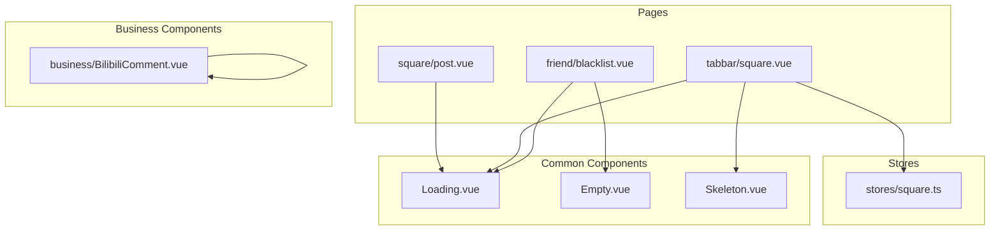
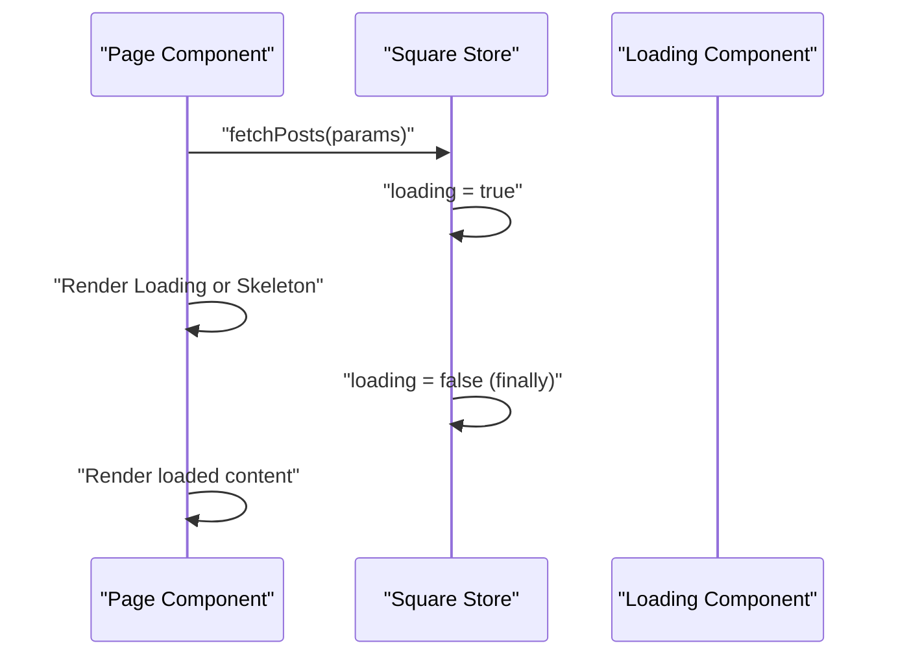
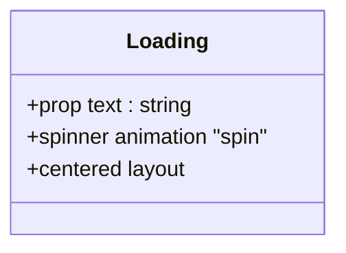
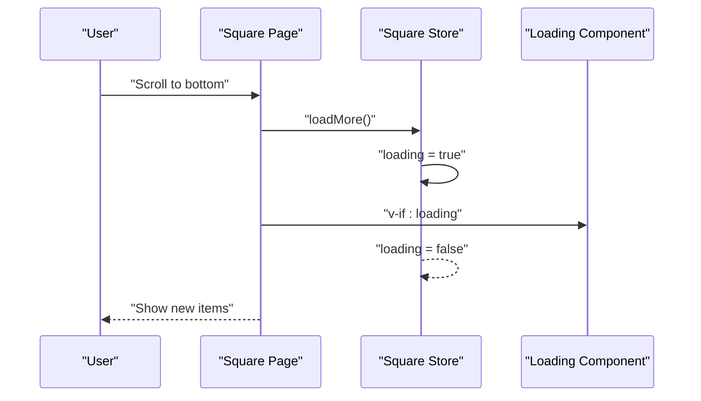
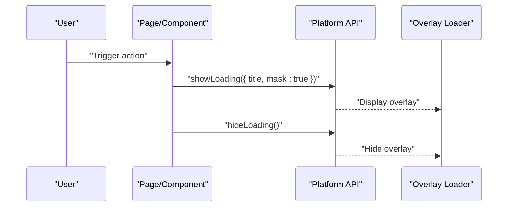
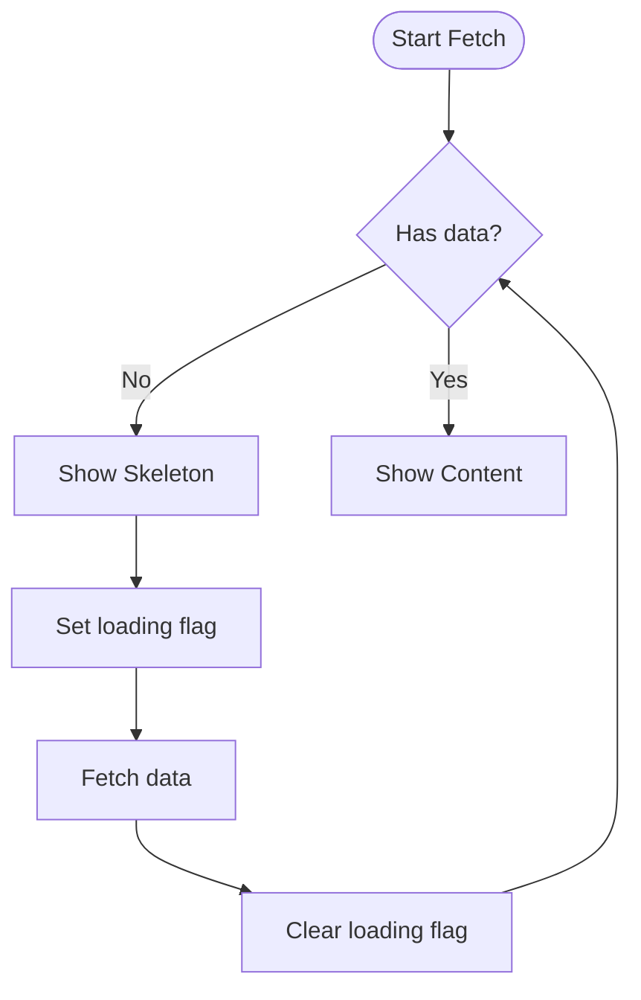
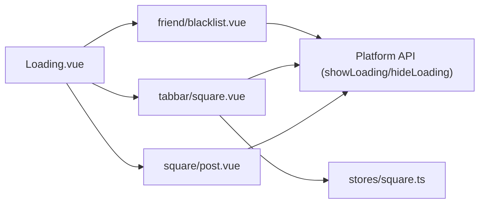

# Loading Component

<cite>
**Referenced Files in This Document**
- [Loading.vue](file://src/components/common/Loading.vue)
- [blacklist.vue](file://src/pages/friend/blacklist.vue)
- [square.vue](file://src/pages/tabbar/square.vue)
- [post.vue](file://src/pages/square/post.vue)
- [BilibiliComment.vue](file://src/components/business/BilibiliComment.vue)
- [square.ts](file://src/stores/square.ts)
- [design-tokens.scss](file://src/assets/styles/design-tokens.scss)
- [Empty.vue](file://src/components/common/Empty.vue)
- [Skeleton.vue](file://src/components/common/Skeleton.vue)
</cite>

## Table of Contents
1. [Introduction](#introduction)
2. [Project Structure](#project-structure)
3. [Core Components](#core-components)
4. [Architecture Overview](#architecture-overview)
5. [Detailed Component Analysis](#detailed-component-analysis)
6. [Dependency Analysis](#dependency-analysis)
7. [Performance Considerations](#performance-considerations)
8. [Troubleshooting Guide](#troubleshooting-guide)
9. [Conclusion](#conclusion)

## Introduction
This document provides comprehensive documentation for the Loading component used to deliver visual feedback during asynchronous operations. It covers the component's visual design, animation behavior, sizing, color schemes, and practical usage patterns across the application. It also explains different loading states (inline indicators, full-screen overlays via platform APIs, and skeleton placeholders), prop configurations, accessibility considerations, and performance best practices.

## Project Structure
The Loading component resides under the common components and is used across multiple pages and business components. The primary usage patterns include:
- Inline loading indicator inside lists and detail views
- Full-screen overlay loading via platform APIs during long-running operations
- Skeleton placeholders during initial data fetches

**Diagram sources**
- [Loading.vue](file://src/components/common/Loading.vue)
- [blacklist.vue](file://src/pages/friend/blacklist.vue)
- [square.vue](file://src/pages/tabbar/square.vue)
- [post.vue](file://src/pages/square/post.vue)
- [BilibiliComment.vue](file://src/components/business/BilibiliComment.vue)
- [square.ts](file://src/stores/square.ts)
- [Empty.vue](file://src/components/common/Empty.vue)
- [Skeleton.vue](file://src/components/common/Skeleton.vue)

**Section sources**
- [Loading.vue](file://src/components/common/Loading.vue)
- [blacklist.vue](file://src/pages/friend/blacklist.vue)
- [square.vue](file://src/pages/tabbar/square.vue)
- [post.vue](file://src/pages/square/post.vue)
- [BilibiliComment.vue](file://src/components/business/BilibiliComment.vue)
- [square.ts](file://src/stores/square.ts)
- [Empty.vue](file://src/components/common/Empty.vue)
- [Skeleton.vue](file://src/components/common/Skeleton.vue)

## Core Components
The Loading component is a minimal, reusable indicator that renders a centered spinner and optional text. It is used in three primary contexts:
- Inline loading within scrollable lists and detail views
- Full-screen overlay loading via platform APIs during long operations
- Combined with skeleton placeholders for initial data fetches

Key characteristics:
- Spinner animation: a rotating circle with a top-colored border
- Text label: optional, configurable via props
- Layout: centered column layout suitable for small inline displays

Usage examples:
- Inline indicator in the square feed while loading more items
- Inline indicator in post detail while loading content
- Full-screen overlay during friend operations and comment actions

**Section sources**
- [Loading.vue](file://src/components/common/Loading.vue)
- [square.vue](file://src/pages/tabbar/square.vue)
- [post.vue](file://src/pages/square/post.vue)
- [blacklist.vue](file://src/pages/friend/blacklist.vue)
- [BilibiliComment.vue](file://src/components/business/BilibiliComment.vue)

## Architecture Overview
The Loading component integrates with page-level logic and stores to coordinate loading states. The typical flow is:
- Page triggers asynchronous operations
- Store loading flags are set accordingly
- UI conditionally renders Loading or Skeleton placeholders
- On completion, loading flags are cleared and UI updates

**Diagram sources**
- [square.vue](file://src/pages/tabbar/square.vue)
- [square.ts](file://src/stores/square.ts)
- [Loading.vue](file://src/components/common/Loading.vue)

## Detailed Component Analysis

### Loading Component Implementation
The Loading component defines a single prop for the text label and renders a spinner with a subtle animation. The spinner uses a bordered circle with a top-colored arc to indicate progress.

**Diagram sources**
- [Loading.vue](file://src/components/common/Loading.vue)

**Section sources**
- [Loading.vue](file://src/components/common/Loading.vue)

### Inline Loading States
Inline loading appears in two primary scenarios:
- Loading more items in the square feed
- Loading post detail content

**Diagram sources**
- [square.vue](file://src/pages/tabbar/square.vue)
- [square.ts](file://src/stores/square.ts)
- [Loading.vue](file://src/components/common/Loading.vue)

**Section sources**
- [square.vue](file://src/pages/tabbar/square.vue)
- [post.vue](file://src/pages/square/post.vue)
- [Loading.vue](file://src/components/common/Loading.vue)

### Full-Screen Overlay Loading States
For long-running operations, the application uses platform APIs to show a full-screen overlay with a masked loading indicator. Examples include:
- Removing a user from the blacklist
- Deleting a comment
- Uploading files

**Diagram sources**
- [blacklist.vue](file://src/pages/friend/blacklist.vue)
- [BilibiliComment.vue](file://src/components/business/BilibiliComment.vue)

**Section sources**
- [blacklist.vue](file://src/pages/friend/blacklist.vue)
- [BilibiliComment.vue](file://src/components/business/BilibiliComment.vue)

### Combined with Skeleton and Empty States
Initial data fetches often combine skeleton placeholders with inline loading indicators:
- Skeleton cards while fetching the first batch of posts
- Empty state component when no data is available after loading completes

**Diagram sources**
- [square.vue](file://src/pages/tabbar/square.vue)
- [square.ts](file://src/stores/square.ts)
- [Skeleton.vue](file://src/components/common/Skeleton.vue)
- [Empty.vue](file://src/components/common/Empty.vue)

**Section sources**
- [square.vue](file://src/pages/tabbar/square.vue)
- [square.ts](file://src/stores/square.ts)
- [Skeleton.vue](file://src/components/common/Skeleton.vue)
- [Empty.vue](file://src/components/common/Empty.vue)

## Dependency Analysis
The Loading component is a leaf-level UI element with no internal dependencies. Its usage depends on:
- Page-level reactive state (e.g., loading flags)
- Store-level loading flags for coordinated UI updates
- Platform APIs for full-screen overlays

**Diagram sources**
- [Loading.vue](file://src/components/common/Loading.vue)
- [blacklist.vue](file://src/pages/friend/blacklist.vue)
- [square.vue](file://src/pages/tabbar/square.vue)
- [post.vue](file://src/pages/square/post.vue)
- [square.ts](file://src/stores/square.ts)

**Section sources**
- [Loading.vue](file://src/components/common/Loading.vue)
- [blacklist.vue](file://src/pages/friend/blacklist.vue)
- [square.vue](file://src/pages/tabbar/square.vue)
- [post.vue](file://src/pages/square/post.vue)
- [square.ts](file://src/stores/square.ts)

## Performance Considerations
- Prefer inline Loading for short operations to avoid overlay overhead
- Use full-screen overlays only for long-running tasks to prevent UI jank
- Combine Loading with Skeleton for initial fetches to reduce perceived latency
- Avoid frequent re-renders by gating Loading with store-level flags
- Keep spinner animation lightweight; avoid heavy transforms or excessive repaints

[No sources needed since this section provides general guidance]

## Troubleshooting Guide
Common issues and resolutions:
- Loading indicator not hiding: ensure store flags are reset in finally blocks
- Overlays not dismissing: verify hide calls are executed regardless of errors
- Stuttering during long operations: consider switching from inline to overlay loading
- Accessibility concerns: provide meaningful text labels and ensure focus states remain usable

**Section sources**
- [square.vue](file://src/pages/tabbar/square.vue)
- [blacklist.vue](file://src/pages/friend/blacklist.vue)
- [BilibiliComment.vue](file://src/components/business/BilibiliComment.vue)

## Conclusion
The Loading component offers a simple yet effective way to communicate ongoing operations. By combining inline indicators, full-screen overlays, and skeleton placeholders, the application delivers a responsive and accessible user experience. Following the recommended patterns ensures optimal performance and clarity during asynchronous operations.