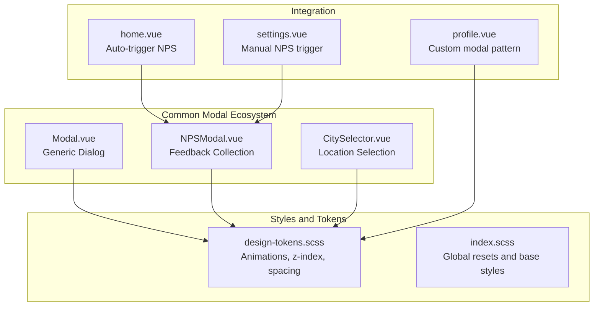
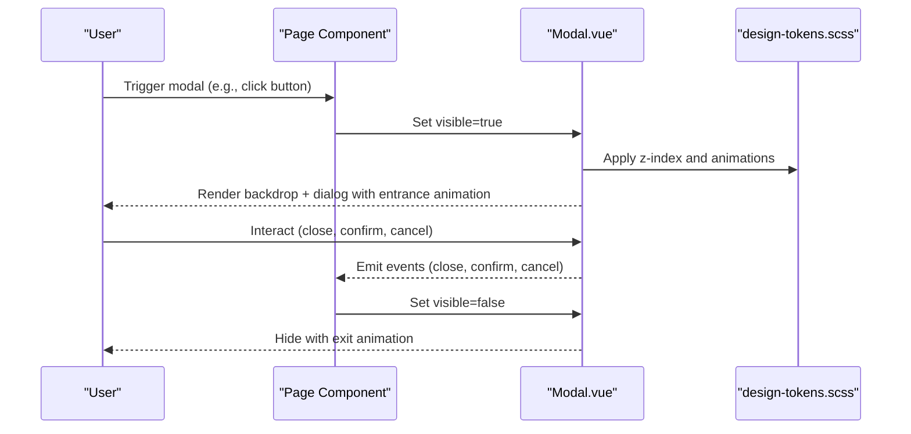
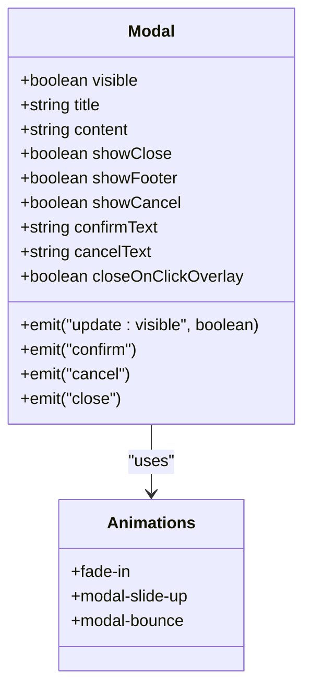
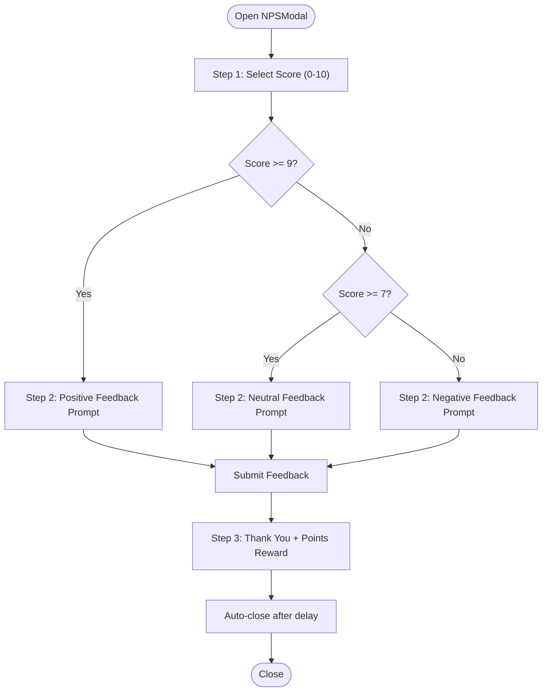
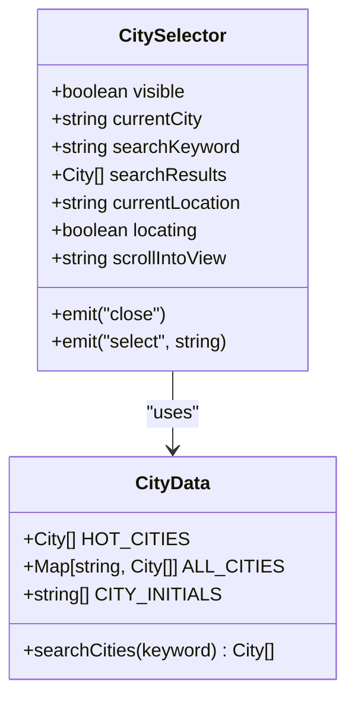
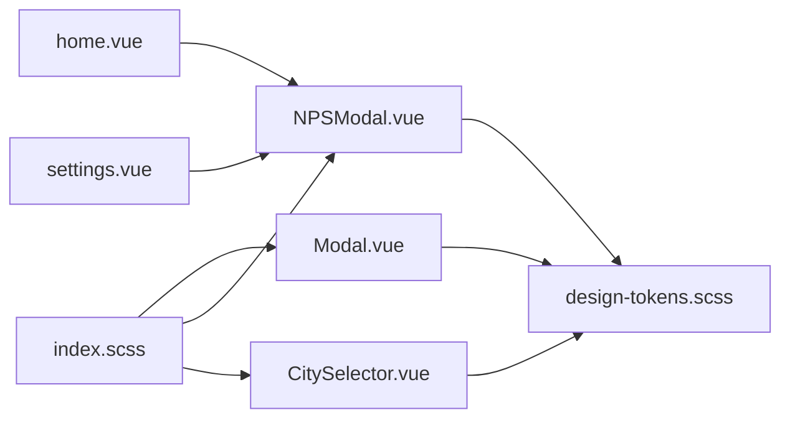

# Modal Component

<cite>
**Referenced Files in This Document**
- [Modal.vue](file://src/components/common/Modal.vue)
- [NPSModal.vue](file://src/components/business/NPSModal.vue)
- [CitySelector.vue](file://src/components/business/CitySelector.vue)
- [design-tokens.scss](file://src/assets/styles/design-tokens.scss)
- [index.scss](file://src/assets/styles/index.scss)
- [useNPS.ts](file://src/composables/useNPS.ts)
- [home.vue](file://src/pages/tabbar/home.vue)
- [settings.vue](file://src/pages/user/settings.vue)
- [profile.vue](file://src/pages/user/profile.vue)
</cite>

## Table of Contents
1. [Introduction](#introduction)
2. [Project Structure](#project-structure)
3. [Core Components](#core-components)
4. [Architecture Overview](#architecture-overview)
5. [Detailed Component Analysis](#detailed-component-analysis)
6. [Dependency Analysis](#dependency-analysis)
7. [Performance Considerations](#performance-considerations)
8. [Accessibility Features](#accessibility-features)
9. [Responsive Design and Cross-Platform Compatibility](#responsive-design-and-cross-platform-compatibility)
10. [Usage Examples](#usage-examples)
11. [Troubleshooting Guide](#troubleshooting-guide)
12. [Conclusion](#conclusion)

## Introduction
This document provides comprehensive documentation for the Modal component ecosystem used to display dialog interfaces and overlay content across the application. It covers the common Modal component, specialized modals like NPSModal and CitySelector, visual appearance, backdrop behavior, animation transitions, prop configurations, event handling, accessibility features, responsive design, and cross-platform compatibility considerations.

## Project Structure
The Modal ecosystem consists of:
- A reusable common Modal component for generic dialogs
- Specialized modals built on similar patterns:
  - NPSModal for feedback collection
  - CitySelector for location selection
- Shared design tokens and global styles that unify animations and z-index stacking

**Diagram sources**
- [Modal.vue:1-236](file://src/components/common/Modal.vue#L1-L236)
- [NPSModal.vue:1-550](file://src/components/business/NPSModal.vue#L1-L550)
- [CitySelector.vue:1-521](file://src/components/business/CitySelector.vue#L1-L521)
- [design-tokens.scss:106-128](file://src/assets/styles/design-tokens.scss#L106-L128)
- [index.scss:1-39](file://src/assets/styles/index.scss#L1-L39)
- [home.vue](file://src/pages/tabbar/home.vue)
- [settings.vue](file://src/pages/user/settings.vue)
- [profile.vue:517-572](file://src/pages/user/profile.vue#L517-L572)

**Section sources**
- [Modal.vue:1-236](file://src/components/common/Modal.vue#L1-L236)
- [NPSModal.vue:1-550](file://src/components/business/NPSModal.vue#L1-L550)
- [CitySelector.vue:1-521](file://src/components/business/CitySelector.vue#L1-L521)
- [design-tokens.scss:106-128](file://src/assets/styles/design-tokens.scss#L106-L128)
- [index.scss:1-39](file://src/assets/styles/index.scss#L1-L39)

## Core Components
- Modal.vue: A lightweight, configurable dialog with header, body, footer, and backdrop behavior. Supports controlled visibility, optional close button, footer actions, and overlay click-to-close.
- NPSModal.vue: A multi-step feedback modal with scoring, dynamic prompts, tag selection, and submission handling.
- CitySelector.vue: A bottom-sheet style modal for city selection with search, location detection, and alphabetical indexing.

Key capabilities:
- Backdrop overlay with configurable click-to-close behavior
- Smooth entrance animations (fade-in, slide-up, bounce)
- Footer action buttons with confirm/cancel/close events
- Responsive sizing using rpx units and max-height constraints

**Section sources**
- [Modal.vue:1-236](file://src/components/common/Modal.vue#L1-L236)
- [NPSModal.vue:1-550](file://src/components/business/NPSModal.vue#L1-L550)
- [CitySelector.vue:1-521](file://src/components/business/CitySelector.vue#L1-L521)

## Architecture Overview
The Modal ecosystem follows a layered approach:
- Common Modal provides the base dialog structure and behavior
- Specialized modals extend the pattern with domain-specific UI and logic
- Shared design tokens define animations, z-index, and spacing
- Integration pages trigger modals via composables or direct state management

**Diagram sources**
- [Modal.vue:29-94](file://src/components/common/Modal.vue#L29-L94)
- [design-tokens.scss:106-128](file://src/assets/styles/design-tokens.scss#L106-L128)

**Section sources**
- [Modal.vue:29-94](file://src/components/common/Modal.vue#L29-L94)
- [design-tokens.scss:106-128](file://src/assets/styles/design-tokens.scss#L106-L128)

## Detailed Component Analysis

### Modal.vue Analysis
The common Modal component encapsulates:
- Props: visible, title, content, showClose, showFooter, showCancel, confirmText, cancelText, closeOnClickOverlay
- Events: update:visible, confirm, cancel, close
- Animation: fade-in for backdrop, slide-up for container, bounce on first open
- Backdrop behavior: click-to-close when enabled

**Diagram sources**
- [Modal.vue:32-58](file://src/components/common/Modal.vue#L32-L58)
- [Modal.vue:199-234](file://src/components/common/Modal.vue#L199-L234)

**Section sources**
- [Modal.vue:32-94](file://src/components/common/Modal.vue#L32-L94)
- [Modal.vue:96-234](file://src/components/common/Modal.vue#L96-L234)

### NPSModal.vue Analysis
NPSModal implements a three-step feedback flow:
- Step 1: Score selection (0–10) with dynamic labels
- Step 2: Feedback text input with character count and tag selection
- Step 3: Thank-you screen with points reward and auto-close

**Diagram sources**
- [NPSModal.vue:4-104](file://src/components/business/NPSModal.vue#L4-L104)
- [NPSModal.vue:243-294](file://src/components/business/NPSModal.vue#L243-L294)

**Section sources**
- [NPSModal.vue:4-104](file://src/components/business/NPSModal.vue#L4-L104)
- [NPSModal.vue:243-313](file://src/components/business/NPSModal.vue#L243-L313)

### CitySelector.vue Analysis
CitySelector provides a bottom-sheet modal for city selection:
- Header with title and close button
- Search box with live filtering
- Current location section with re-try capability
- Popular cities grid
- Alphabetical grouping with index bar
- Scroll-to-initial support

**Diagram sources**
- [CitySelector.vue:124-137](file://src/components/business/CitySelector.vue#L124-L137)
- [CitySelector.vue:118-123](file://src/components/business/CitySelector.vue#L118-L123)

**Section sources**
- [CitySelector.vue:1-521](file://src/components/business/CitySelector.vue#L1-L521)

## Dependency Analysis
- Modal.vue depends on design-tokens.scss for animations and z-index
- NPSModal.vue and CitySelector.vue also depend on design-tokens.scss for consistent animations and layout
- Integration pages (home.vue, settings.vue) import and use NPSModal via composables
- Global styles in index.scss normalize base element behavior

**Diagram sources**
- [Modal.vue:96-124](file://src/components/common/Modal.vue#L96-L124)
- [NPSModal.vue:316-337](file://src/components/business/NPSModal.vue#L316-L337)
- [CitySelector.vue:266-297](file://src/components/business/CitySelector.vue#L266-L297)
- [design-tokens.scss:106-128](file://src/assets/styles/design-tokens.scss#L106-L128)
- [index.scss:1-39](file://src/assets/styles/index.scss#L1-L39)

**Section sources**
- [Modal.vue:96-124](file://src/components/common/Modal.vue#L96-L124)
- [NPSModal.vue:316-337](file://src/components/business/NPSModal.vue#L316-L337)
- [CitySelector.vue:266-297](file://src/components/business/CitySelector.vue#L266-L297)
- [design-tokens.scss:106-128](file://src/assets/styles/design-tokens.scss#L106-L128)
- [index.scss:1-39](file://src/assets/styles/index.scss#L1-L39)

## Performance Considerations
- Animation durations and easing are centralized in design-tokens.scss, enabling consistent performance tuning across modals.
- Entrance animations use CSS keyframes rather than heavy JavaScript libraries, minimizing layout thrashing.
- Max-height constraints prevent excessive DOM growth; scrollable areas are isolated within modal bodies.
- For NPSModal, submission uses async API calls with loading states to avoid blocking UI.

[No sources needed since this section provides general guidance]

## Accessibility Features
Current implementation highlights:
- Focus management: No explicit focus trapping or focus restoration is implemented in the common Modal. Consider adding focus trap and return focus on close for WCAG compliance.
- Keyboard navigation: No dedicated keyboard handlers are present. Adding Escape-to-close would improve keyboard accessibility.
- ARIA attributes: No aria-modal or role attributes are set. Adding aria-modal="true" and aria-labelledby/aria-describedby would enhance assistive technology support.
- Screen reader announcements: No explicit announcements for open/close states. Consider ARIA live regions for dynamic updates.

Recommendations:
- Add a focus trap on open and restore focus on close
- Implement Escape key handler for close
- Add aria-modal, aria-labelledby, and aria-describedby attributes
- Announce modal open/close via ARIA live regions

[No sources needed since this section provides general guidance]

## Responsive Design and Cross-Platform Compatibility
- Units: Uses rpx throughout for consistent scaling across devices.
- Sizing: Modal widths use fixed rpx values; max-height constraints ensure content remains usable on small screens.
- Animations: Centralized timing and easing in design-tokens.scss ensure smooth performance on lower-end devices.
- Platform considerations: The project targets uni-app environments; ensure testing on iOS and Android devices for consistent behavior.

**Section sources**
- [design-tokens.scss:106-128](file://src/assets/styles/design-tokens.scss#L106-L128)
- [Modal.vue:114-115](file://src/components/common/Modal.vue#L114-L115)
- [NPSModal.vue:331-335](file://src/components/business/NPSModal.vue#L331-L335)
- [CitySelector.vue:289-291](file://src/components/business/CitySelector.vue#L289-L291)

## Usage Examples

### Confirmation Dialogs
- Use the common Modal with showFooter and showCancel enabled to present confirm/cancel choices.
- Bind visible to a local state and listen for confirm/cancel events to perform actions.

**Section sources**
- [Modal.vue:32-58](file://src/components/common/Modal.vue#L32-L58)
- [Modal.vue:74-87](file://src/components/common/Modal.vue#L74-L87)

### Form Modals
- Use the common Modal body slot to render form controls.
- Control visibility via a reactive flag and handle submit via confirm event.

**Section sources**
- [Modal.vue:11-15](file://src/components/common/Modal.vue#L11-L15)
- [Modal.vue:79-82](file://src/components/common/Modal.vue#L79-L82)

### Content Previews
- Use the common Modal body slot to display preview content.
- Optionally hide footer actions for read-only previews.

**Section sources**
- [Modal.vue:11-15](file://src/components/common/Modal.vue#L11-L15)
- [Modal.vue:17-24](file://src/components/common/Modal.vue#L17-L24)

### Settings Panels
- Build a settings panel inside the common Modal body.
- Use showClose to allow dismissal and close event to persist changes.

**Section sources**
- [Modal.vue:4-8](file://src/components/common/Modal.vue#L4-L8)
- [Modal.vue:74-77](file://src/components/common/Modal.vue#L74-L77)

### NPS Feedback Flow
- Integrate NPSModal via composables in home.vue or settings.vue.
- Use manualTrigger for user-initiated feedback and automatic triggers based on scenes.

**Section sources**
- [useNPS.ts:13-77](file://src/composables/useNPS.ts#L13-L77)
- [home.vue](file://src/pages/tabbar/home.vue)
- [settings.vue:164-188](file://src/pages/user/settings.vue#L164-L188)

### City Selector Modal
- Display CitySelector as a bottom sheet with search and location features.
- Handle select and close events to update user preferences.

**Section sources**
- [CitySelector.vue:1-116](file://src/components/business/CitySelector.vue#L1-L116)
- [CitySelector.vue:203-229](file://src/components/business/CitySelector.vue#L203-L229)

## Troubleshooting Guide
- Modal does not close on overlay click:
  - Verify closeOnClickOverlay prop is true and overlay click handler is active.
- Animation not playing:
  - Ensure design-tokens.scss is imported and animation keyframes are defined.
- Content overflow issues:
  - Confirm max-height constraints and scrollable containers are applied.
- NPS submission errors:
  - Check network requests and error messages emitted during submission.

**Section sources**
- [Modal.vue:89-93](file://src/components/common/Modal.vue#L89-L93)
- [design-tokens.scss:106-128](file://src/assets/styles/design-tokens.scss#L106-L128)
- [NPSModal.vue:243-294](file://src/components/business/NPSModal.vue#L243-L294)

## Conclusion
The Modal component ecosystem provides a flexible, animated, and responsive foundation for overlay content. The common Modal offers a minimal, extensible base, while specialized modals like NPSModal and CitySelector demonstrate practical implementations. For production readiness, prioritize accessibility enhancements (focus trap, keyboard handling, ARIA attributes) and ensure consistent animation performance across platforms.