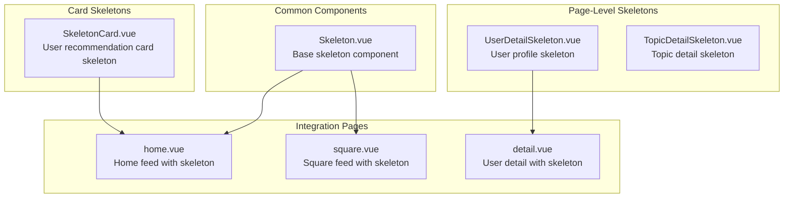
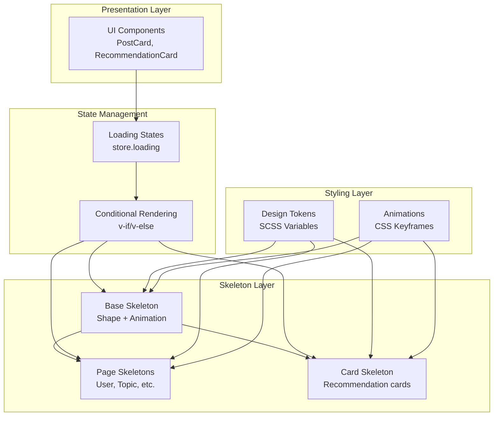
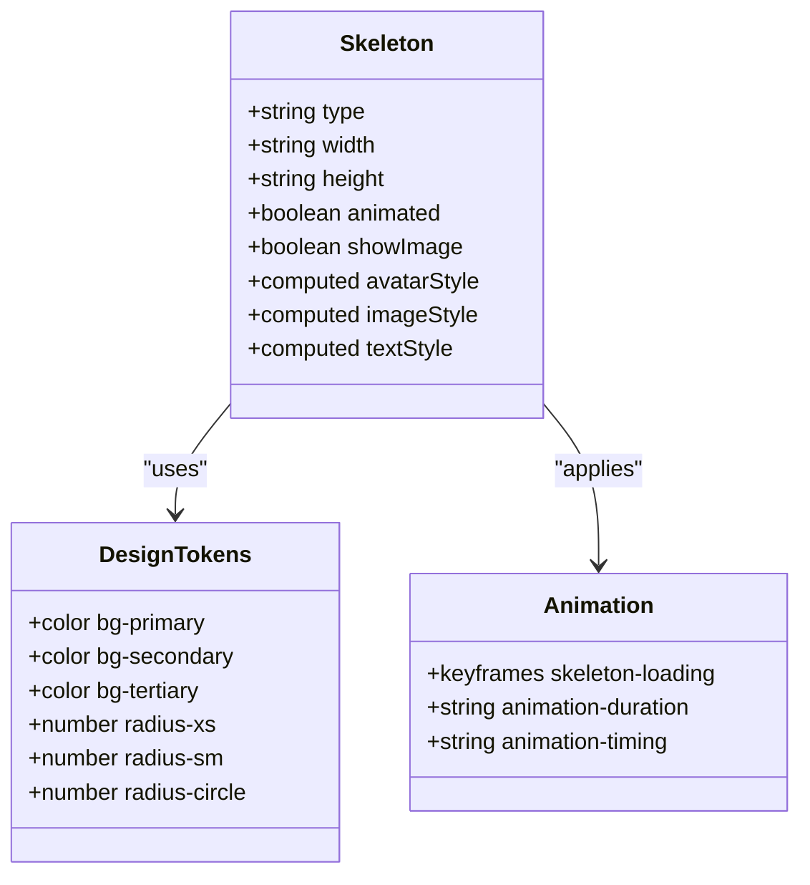
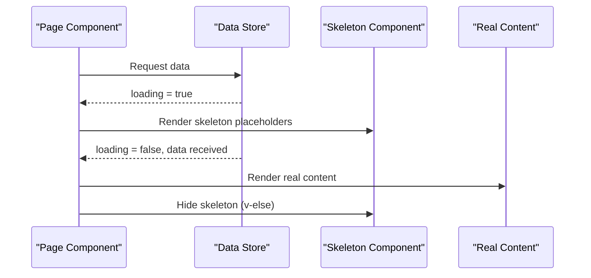
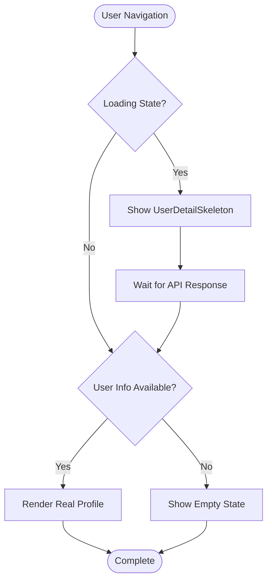
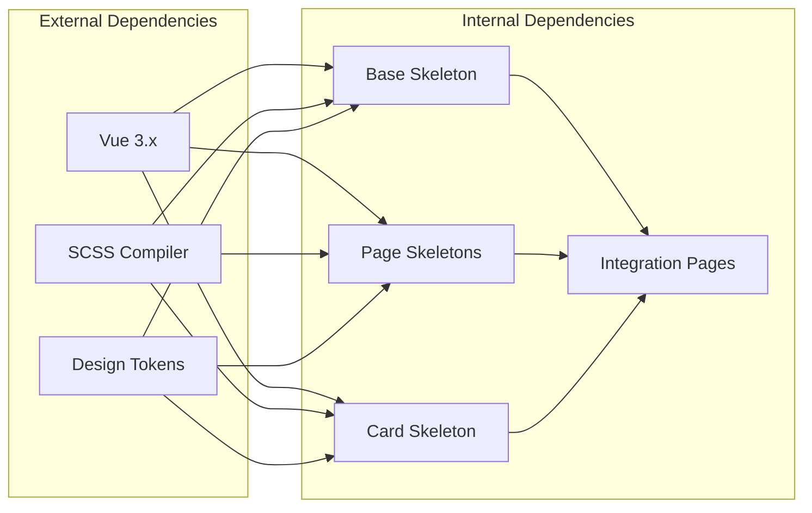

# Skeleton Component

<cite>
**Referenced Files in This Document**
- [Skeleton.vue](file://src/components/common/Skeleton.vue)
- [design-tokens.scss](file://src/assets/styles/design-tokens.scss)
- [square.vue](file://src/pages/tabbar/square.vue)
- [home.vue](file://src/pages/tabbar/home.vue)
- [detail.vue](file://src/pages/user/detail.vue)
- [SkeletonCard.vue](file://src/pages/tabbar/home/components/SkeletonCard.vue)
- [UserDetailSkeleton.vue](file://src/pages/user/components/UserDetailSkeleton.vue)
- [TopicDetailSkeleton.vue](file://src/pages/square/components/TopicDetailSkeleton.vue)
</cite>

## Table of Contents
1. [Introduction](#introduction)
2. [Project Structure](#project-structure)
3. [Core Components](#core-components)
4. [Architecture Overview](#architecture-overview)
5. [Detailed Component Analysis](#detailed-component-analysis)
6. [Dependency Analysis](#dependency-analysis)
7. [Performance Considerations](#performance-considerations)
8. [Troubleshooting Guide](#troubleshooting-guide)
9. [Conclusion](#conclusion)

## Introduction
The Skeleton component provides placeholder loading states that improve perceived performance by showing realistic content structure while data loads. It offers gradient animations, shape variations, and content layout placeholders to maintain visual continuity during asynchronous operations. This documentation covers the component's visual design, prop configurations, integration patterns, usage examples, accessibility considerations, and performance benefits.

## Project Structure
The Skeleton ecosystem consists of:
- A reusable base component for individual placeholders
- Page-level skeleton templates for complex layouts
- Card-specific skeletons for user profiles and content feeds

**Diagram sources**
- [Skeleton.vue:1-169](file://src/components/common/Skeleton.vue#L1-L169)
- [UserDetailSkeleton.vue:1-216](file://src/pages/user/components/UserDetailSkeleton.vue#L1-L216)
- [TopicDetailSkeleton.vue:1-182](file://src/pages/square/components/TopicDetailSkeleton.vue#L1-L182)
- [SkeletonCard.vue:1-162](file://src/pages/tabbar/home/components/SkeletonCard.vue#L1-L162)
- [home.vue:1-489](file://src/pages/tabbar/home.vue#L1-L489)
- [square.vue:1-393](file://src/pages/tabbar/square.vue#L1-L393)
- [detail.vue:1-569](file://src/pages/user/detail.vue#L1-L569)

**Section sources**
- [Skeleton.vue:1-169](file://src/components/common/Skeleton.vue#L1-L169)
- [UserDetailSkeleton.vue:1-216](file://src/pages/user/components/UserDetailSkeleton.vue#L1-L216)
- [TopicDetailSkeleton.vue:1-182](file://src/pages/square/components/TopicDetailSkeleton.vue#L1-L182)
- [SkeletonCard.vue:1-162](file://src/pages/tabbar/home/components/SkeletonCard.vue#L1-L162)
- [home.vue:1-489](file://src/pages/tabbar/home.vue#L1-L489)
- [square.vue:1-393](file://src/pages/tabbar/square.vue#L1-L393)
- [detail.vue:1-569](file://src/pages/user/detail.vue#L1-L569)

## Core Components
The Skeleton component system includes three primary implementations:

### Base Skeleton Component
The core Skeleton component provides four shape types with configurable dimensions and animation states.

**Key Features:**
- Shape variations: avatar, image, text, card
- Configurable width and height
- Animated gradient effect
- Conditional image display for card type

**Props Configuration:**
- `type`: 'avatar' | 'image' | 'text' | 'card' (default: 'text')
- `width`: string (default: '100%')
- `height`: string (default: '28rpx')
- `animated`: boolean (default: true)
- `showImage`: boolean (default: true) - card type only

**Visual Design Elements:**
- Gradient animation: 90-degree linear gradient with transparent to white transition
- Background colors: $bg-tertiary for skeleton backgrounds
- Border radius tokens: $radius-xs, $radius-sm, $radius-circle
- Animation duration: 1.5 seconds infinite loop

**Section sources**
- [Skeleton.vue:52-82](file://src/components/common/Skeleton.vue#L52-L82)
- [Skeleton.vue:84-168](file://src/components/common/Skeleton.vue#L84-L168)

### Page-Level Skeleton Templates
Specialized skeleton templates for complex layouts:

**UserDetailSkeleton.vue:**
- Complete user profile skeleton with avatar, stats, actions, and post lists
- Grid-based photo gallery placeholders
- Consistent spacing and typography scales

**TopicDetailSkeleton.vue:**
- Topic header with cover image, title, description, and statistics
- Action buttons and dynamic post list
- Responsive grid layout for image thumbnails

**Section sources**
- [UserDetailSkeleton.vue:1-216](file://src/pages/user/components/UserDetailSkeleton.vue#L1-L216)
- [TopicDetailSkeleton.vue:1-182](file://src/pages/square/components/TopicDetailSkeleton.vue#L1-L182)

### Card Skeleton Component
A specialized card skeleton for recommendation feeds:

**Features:**
- Header with avatar and user info
- Bio, tags, and photo grid placeholders
- Configurable visibility of optional sections
- Unified shimmer animation

**Props Configuration:**
- `showBio`: boolean (default: true)
- `showTags`: boolean (default: true)
- `showPhotos`: boolean (default: true)

**Section sources**
- [SkeletonCard.vue:27-39](file://src/pages/tabbar/home/components/SkeletonCard.vue#L27-L39)
- [SkeletonCard.vue:41-162](file://src/pages/tabbar/home/components/SkeletonCard.vue#L41-L162)

## Architecture Overview
The Skeleton system follows a layered architecture with clear separation between base components and specialized templates.

**Diagram sources**
- [Skeleton.vue:1-169](file://src/components/common/Skeleton.vue#L1-L169)
- [UserDetailSkeleton.vue:1-216](file://src/pages/user/components/UserDetailSkeleton.vue#L1-L216)
- [TopicDetailSkeleton.vue:1-182](file://src/pages/square/components/TopicDetailSkeleton.vue#L1-L182)
- [SkeletonCard.vue:1-162](file://src/pages/tabbar/home/components/SkeletonCard.vue#L1-L162)
- [home.vue:39-42](file://src/pages/tabbar/home.vue#L39-L42)
- [square.vue:29-38](file://src/pages/tabbar/square.vue#L29-L38)

## Detailed Component Analysis

### Base Skeleton Component Implementation
The base Skeleton component uses Vue's composition API with computed styles and conditional rendering.

**Diagram sources**
- [Skeleton.vue:49-82](file://src/components/common/Skeleton.vue#L49-L82)
- [design-tokens.scss:26-96](file://src/assets/styles/design-tokens.scss#L26-L96)

**Implementation Details:**
- Uses `withDefaults` for prop initialization
- Computed styles for responsive sizing
- Conditional rendering based on type prop
- SCSS modular design with design tokens

**Section sources**
- [Skeleton.vue:49-82](file://src/components/common/Skeleton.vue#L49-L82)
- [design-tokens.scss:26-96](file://src/assets/styles/design-tokens.scss#L26-L96)

### Integration Patterns

#### Feed Loading States
The home and square pages demonstrate skeleton integration for infinite scrolling feeds.

**Diagram sources**
- [home.vue:39-42](file://src/pages/tabbar/home.vue#L39-L42)
- [square.vue:29-38](file://src/pages/tabbar/square.vue#L29-L38)

**Integration Points:**
- Conditional rendering based on loading states
- Skeleton count matching expected content length
- Smooth transition from skeleton to real content

**Section sources**
- [home.vue:39-42](file://src/pages/tabbar/home.vue#L39-L42)
- [square.vue:29-38](file://src/pages/tabbar/square.vue#L29-L38)

#### Profile Loading States
User detail pages use specialized skeleton templates for complete profile loading.

**Diagram sources**
- [detail.vue:3-4](file://src/pages/user/detail.vue#L3-L4)

**Section sources**
- [detail.vue:3-4](file://src/pages/user/detail.vue#L3-L4)

### Visual Design System
The skeleton components leverage a comprehensive design token system for consistent styling.

**Color System:**
- `$bg-tertiary`: Primary skeleton background (#f0f0f0)
- `$bg-primary`: Card backgrounds (#ffffff)
- `$bg-secondary`: Secondary containers (#f8f8f8)

**Typography Scale:**
- Font sizes: 20rpx (xs) to 48rpx (xxl)
- Line heights: 1.2 to 1.8 for different contexts

**Spacing System:**
- Base units: 8rpx to 40rpx increments
- Margins and paddings scaled accordingly

**Border Radius Scale:**
- xs: 4rpx, sm: 8rpx, base: 12rpx, circle: 50%

**Section sources**
- [design-tokens.scss:26-96](file://src/assets/styles/design-tokens.scss#L26-L96)

## Dependency Analysis
The Skeleton system has minimal external dependencies and follows a unidirectional data flow.

**Diagram sources**
- [Skeleton.vue:1-169](file://src/components/common/Skeleton.vue#L1-L169)
- [UserDetailSkeleton.vue:1-216](file://src/pages/user/components/UserDetailSkeleton.vue#L1-L216)
- [TopicDetailSkeleton.vue:1-182](file://src/pages/square/components/TopicDetailSkeleton.vue#L1-L182)
- [SkeletonCard.vue:1-162](file://src/pages/tabbar/home/components/SkeletonCard.vue#L1-L162)

**Key Dependencies:**
- Vue 3.x Composition API for reactive props and computed values
- SCSS for modular styling and design token integration
- Design tokens for consistent visual system

**Section sources**
- [Skeleton.vue:1-169](file://src/components/common/Skeleton.vue#L1-L169)
- [design-tokens.scss:1-240](file://src/assets/styles/design-tokens.scss#L1-L240)

## Performance Considerations
Skeleton loading provides significant performance benefits over traditional spinners:

### Perceived Performance Benefits
- **Visual Continuity**: Maintains layout structure while data loads
- **Reduced Cognitive Load**: Users understand content expectations
- **Better User Experience**: Less anxiety compared to blank screens
- **Faster Task Completion**: Users perceive faster interactions

### Technical Optimizations
- **Minimal DOM Overhead**: Simple div structures with CSS animations
- **Efficient Animations**: Hardware-accelerated CSS transforms
- **Memory Efficient**: No complex state management required
- **Network Friendly**: Lightweight implementation reduces bundle size

### Animation Performance
The gradient animation uses CSS transforms which are GPU-accelerated:
- Transform-based movement (left property)
- Linear gradient backgrounds
- Infinite animation loops with 1.5-second duration
- Hardware acceleration for smooth 60fps performance

## Troubleshooting Guide

### Common Issues and Solutions

**Issue: Skeleton not animating**
- Verify `animated` prop is set to `true`
- Check CSS keyframe availability
- Ensure parent container has proper positioning context

**Issue: Incorrect sizing**
- Validate width/height prop formats (rpx units)
- Check for conflicting CSS overrides
- Verify responsive behavior on different screen sizes

**Issue: Layout shifts when content loads**
- Ensure skeleton dimensions match expected content
- Use consistent spacing tokens throughout
- Implement proper container padding/margins

**Issue: Animation performance problems**
- Limit concurrent skeleton instances
- Use CSS hardware acceleration
- Avoid excessive DOM manipulation during loading

### Best Practices Checklist
- ✅ Use appropriate skeleton shapes for content types
- ✅ Maintain consistent spacing and typography scales
- ✅ Ensure accessibility compliance (contrast ratios)
- ✅ Test on various device sizes and orientations
- ✅ Monitor performance impact on low-end devices

**Section sources**
- [Skeleton.vue:87-121](file://src/components/common/Skeleton.vue#L87-L121)

## Conclusion
The Skeleton component system provides a comprehensive solution for creating engaging loading states that enhance user experience and perceived performance. Through its modular design, consistent visual language, and seamless integration patterns, it delivers professional-grade loading experiences across the application. The combination of base components, specialized templates, and thoughtful integration patterns ensures developers can implement effective loading states quickly while maintaining design consistency and performance standards.

The system's strength lies in its balance between flexibility and consistency—providing enough customization options for different use cases while maintaining a unified design language that reinforces brand identity and improves user comprehension during data loading phases.