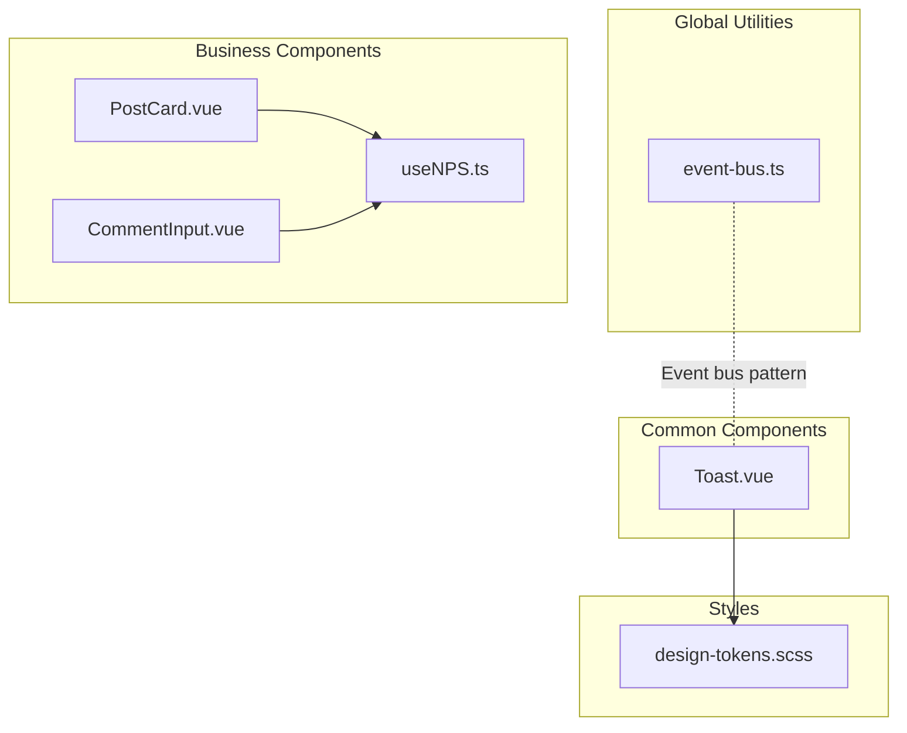
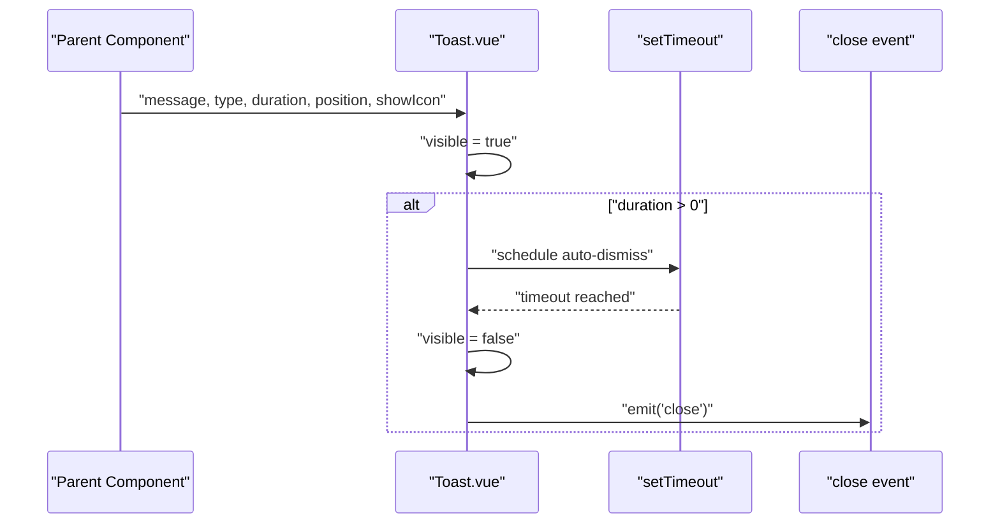
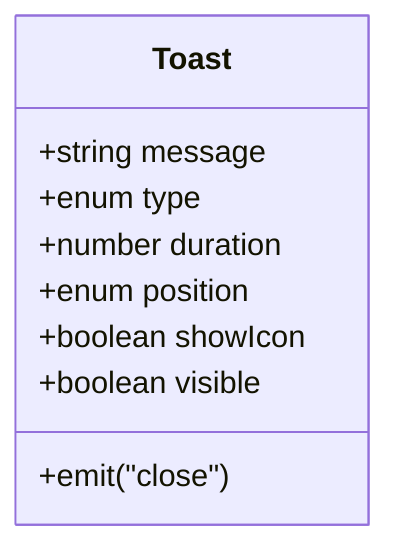
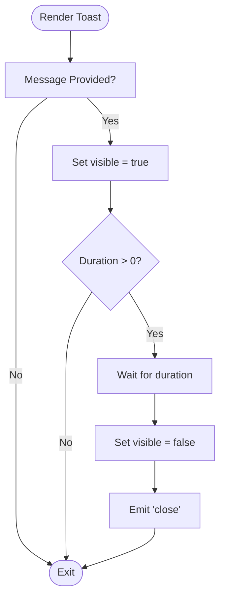
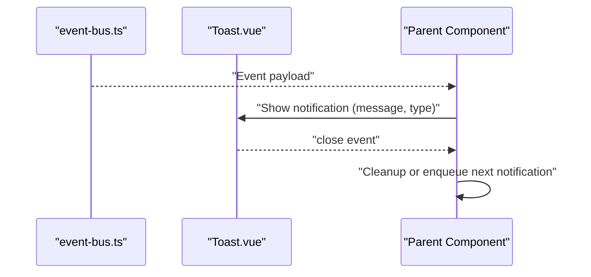
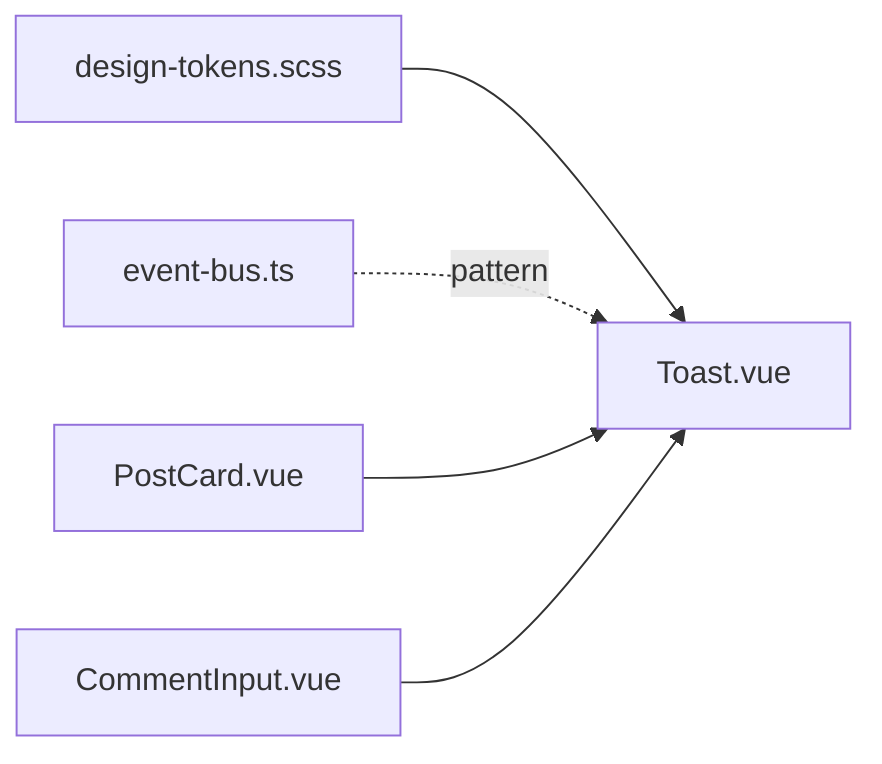

# Toast Component

<cite>
**Referenced Files in This Document**
- [Toast.vue](file://src/components/common/Toast.vue)
- [design-tokens.scss](file://src/assets/styles/design-tokens.scss)
- [event-bus.ts](file://src/utils/event-bus.ts)
- [PostCard.vue](file://src/components/business/PostCard.vue)
- [CommentInput.vue](file://src/components/business/CommentInput.vue)
- [useNPS.ts](file://src/composables/useNPS.ts)
</cite>

## Table of Contents
1. [Introduction](#introduction)
2. [Project Structure](#project-structure)
3. [Core Components](#core-components)
4. [Architecture Overview](#architecture-overview)
5. [Detailed Component Analysis](#detailed-component-analysis)
6. [Dependency Analysis](#dependency-analysis)
7. [Performance Considerations](#performance-considerations)
8. [Troubleshooting Guide](#troubleshooting-guide)
9. [Conclusion](#conclusion)
10. [Appendices](#appendices)

## Introduction
This document describes the Toast component used to display transient notifications and feedback messages. It covers visual presentation, positioning options, animation effects, prop configurations for message types, duration settings, and positioning controls. It also explains integration patterns with the global notification system and event handling, along with usage examples and best practices for accessibility, frequency, clarity, and user experience.

## Project Structure
The Toast component is implemented as a Vue Single File Component located under the common components folder. It relies on shared design tokens for consistent spacing, typography, and z-index values. Several business components demonstrate usage of platform-native toast APIs alongside the custom Toast component.

**Diagram sources**
- [Toast.vue:1-139](file://src/components/common/Toast.vue#L1-L139)
- [design-tokens.scss:119-128](file://src/assets/styles/design-tokens.scss#L119-L128)
- [event-bus.ts:1-49](file://src/utils/event-bus.ts#L1-L49)
- [PostCard.vue:268-289](file://src/components/business/PostCard.vue#L268-L289)
- [CommentInput.vue:60-73](file://src/components/business/CommentInput.vue#L60-L73)
- [useNPS.ts:1-145](file://src/composables/useNPS.ts#L1-L145)

**Section sources**
- [Toast.vue:1-139](file://src/components/common/Toast.vue#L1-L139)
- [design-tokens.scss:119-128](file://src/assets/styles/design-tokens.scss#L119-L128)

## Core Components
- Toast.vue: A reusable, animated notification component supporting message types, positioning, and optional icons. It auto-dismisses after a configurable duration and emits a close event.
- design-tokens.scss: Shared design tokens including z-index values and durations used by the Toast component.
- event-bus.ts: A global event bus used across the application for cross-component communication; while Toast does not depend on it, it demonstrates a pattern for centralized event coordination.
- Business components: Examples of native toast usage via platform APIs and composables that coordinate feedback and user actions.

Key capabilities:
- Message types: success, error, warning, info, default
- Positioning: top, center, bottom
- Duration control: milliseconds; zero disables auto-dismiss
- Icon toggle: optional icons per message type
- Animation: fade-in with scaling
- Accessibility: relies on screen readers for text content; consider ARIA attributes for dynamic updates

**Section sources**
- [Toast.vue:18-31](file://src/components/common/Toast.vue#L18-L31)
- [design-tokens.scss:106-117](file://src/assets/styles/design-tokens.scss#L106-L117)
- [event-bus.ts:1-49](file://src/utils/event-bus.ts#L1-L49)
- [PostCard.vue:268-289](file://src/components/business/PostCard.vue#L268-L289)
- [CommentInput.vue:60-73](file://src/components/business/CommentInput.vue#L60-L73)
- [useNPS.ts:59-66](file://src/composables/useNPS.ts#L59-L66)

## Architecture Overview
The Toast component is self-contained and reactive. It watches for message changes, triggers visibility, applies animations, and optionally auto-dismisses after a duration. It integrates with the global z-index stack and design tokens for consistent visuals.

**Diagram sources**
- [Toast.vue:39-51](file://src/components/common/Toast.vue#L39-L51)

## Detailed Component Analysis

### Toast.vue
- Props and defaults:
  - message: string
  - type: 'success' | 'error' | 'warning' | 'info' | 'default'
  - duration: number (ms); default 2000
  - position: 'top' | 'center' | 'bottom'; default 'center'
  - showIcon: boolean; default true
- Behavior:
  - Auto-dismiss after duration if greater than zero
  - Emits a close event upon dismissal
  - Uses watchers to react to message changes
- Styles:
  - Fixed container with z-index aligned to design tokens
  - Position variants: top, center, bottom
  - Type-specific backgrounds
  - Optional icon layout with gap
  - Fade-in/scale animation keyed by design tokens

**Diagram sources**
- [Toast.vue:18-35](file://src/components/common/Toast.vue#L18-L35)

**Section sources**
- [Toast.vue:1-139](file://src/components/common/Toast.vue#L1-L139)
- [design-tokens.scss:106-117](file://src/assets/styles/design-tokens.scss#L106-L117)

### Positioning and Animation Effects
- Positioning:
  - top: positioned near the top viewport
  - center: centered both vertically and horizontally
  - bottom: positioned near the bottom viewport
- Animation:
  - Fade-in with slight scale-up from 0.8 to 1.0
  - Duration and easing derived from design tokens

**Diagram sources**
- [Toast.vue:39-51](file://src/components/common/Toast.vue#L39-L51)

**Section sources**
- [Toast.vue:57-76](file://src/components/common/Toast.vue#L57-L76)
- [Toast.vue:128-137](file://src/components/common/Toast.vue#L128-L137)

### Integration Patterns and Event Handling
- Close event:
  - Toast emits a close event when it dismisses, enabling parent components to clean up state or queue subsequent notifications.
- Global event bus:
  - While Toast itself does not depend on the event bus, the project includes a global event bus utility that can be used to coordinate notifications across the app.
- Native toast usage:
  - Several business components use platform-native toast APIs for quick feedback (e.g., success confirmations, validation messages). These complement the custom Toast component for different scenarios.

**Diagram sources**
- [event-bus.ts:26-31](file://src/utils/event-bus.ts#L26-L31)
- [Toast.vue:33-35](file://src/components/common/Toast.vue#L33-L35)

**Section sources**
- [Toast.vue:33-35](file://src/components/common/Toast.vue#L33-L35)
- [event-bus.ts:1-49](file://src/utils/event-bus.ts#L1-L49)

### Usage Examples
- Success confirmation:
  - After a successful action, display a success toast with a short duration.
  - Example reference: [CommentInput.vue:60-73](file://src/components/business/CommentInput.vue#L60-L73)
- Error message:
  - On validation or API errors, show an error toast with a concise message.
  - Example reference: [PostCard.vue:268-289](file://src/components/business/PostCard.vue#L268-L289)
- Loading notifications:
  - For long-running operations, consider a persistent indicator or a temporary loading toast; ensure the UX avoids overwhelming the user.
- User feedback responses:
  - Use the close event to coordinate follow-up actions after dismissal.

**Section sources**
- [CommentInput.vue:60-73](file://src/components/business/CommentInput.vue#L60-L73)
- [PostCard.vue:268-289](file://src/components/business/PostCard.vue#L268-L289)
- [Toast.vue:33-35](file://src/components/common/Toast.vue#L33-L35)

## Dependency Analysis
- Internal dependencies:
  - Toast depends on design tokens for z-index and animation timing/easing.
- External integration points:
  - Parent components manage lifecycle and queue multiple toasts.
  - Event bus can be used to coordinate notifications across modules.

**Diagram sources**
- [design-tokens.scss:106-117](file://src/assets/styles/design-tokens.scss#L106-L117)
- [Toast.vue:1-139](file://src/components/common/Toast.vue#L1-L139)
- [event-bus.ts:1-49](file://src/utils/event-bus.ts#L1-L49)
- [PostCard.vue:268-289](file://src/components/business/PostCard.vue#L268-L289)
- [CommentInput.vue:60-73](file://src/components/business/CommentInput.vue#L60-L73)

**Section sources**
- [design-tokens.scss:106-117](file://src/assets/styles/design-tokens.scss#L106-L117)
- [Toast.vue:1-139](file://src/components/common/Toast.vue#L1-L139)
- [event-bus.ts:1-49](file://src/utils/event-bus.ts#L1-L49)

## Performance Considerations
- Duration tuning:
  - Keep default durations reasonable to avoid blocking user interactions; adjust based on message length and importance.
- Rendering cost:
  - Toast is lightweight; however, avoid flooding the screen with rapid successive toasts.
- Animation cost:
  - The fade-in/scale animation uses minimal transforms; keep durations short for frequent notifications.

## Troubleshooting Guide
- Toast not appearing:
  - Ensure message is provided and visible is toggled; verify watcher triggers on message change.
- Toast not dismissing:
  - Confirm duration is greater than zero; otherwise, it will remain visible until manually handled.
- Positioning issues:
  - Verify position prop values and container styles; top/bottom positions rely on viewport offsets.
- Event handling:
  - Subscribe to the close event to reset state or queue the next notification.

**Section sources**
- [Toast.vue:39-51](file://src/components/common/Toast.vue#L39-L51)
- [Toast.vue:57-76](file://src/components/common/Toast.vue#L57-L76)
- [Toast.vue:33-35](file://src/components/common/Toast.vue#L33-L35)

## Conclusion
The Toast component provides a flexible, animated, and accessible way to deliver transient feedback. Its props enable clear communication of outcomes, while its integration patterns support both local and global notification strategies. Pair it with thoughtful duration and frequency choices to enhance user experience without overwhelming users.

## Appendices

### Prop Reference
- message: string — Text content of the toast
- type: 'success' | 'error' | 'warning' | 'info' | 'default' — Visual and semantic category
- duration: number (ms) — Auto-dismiss delay; zero disables auto-dismiss
- position: 'top' | 'center' | 'bottom' — Vertical placement
- showIcon: boolean — Whether to render an icon matching the type

**Section sources**
- [Toast.vue:18-31](file://src/components/common/Toast.vue#L18-L31)

### Accessibility Notes
- Screen reader compatibility:
  - Toast displays text content suitable for screen readers; ensure messages are concise and meaningful.
- Dynamic updates:
  - When queuing multiple toasts, consider ARIA live regions or announce messages programmatically to assist users.
- Timing:
  - Respect user preferences and cognitive load; avoid excessive or rapid notifications.

### Best Practices
- Frequency:
  - Limit the number of concurrent toasts; queue or debounce notifications.
- Clarity:
  - Keep messages short, actionable, and outcome-focused.
- Experience:
  - Prefer success/error toasts for immediate feedback; reserve persistent indicators for ongoing operations.
- Integration:
  - Use the close event to coordinate dismissal and follow-up actions; leverage the event bus for cross-module coordination when appropriate.