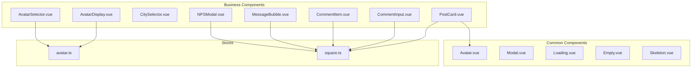
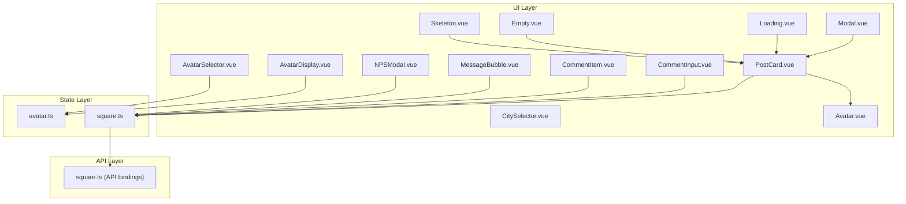
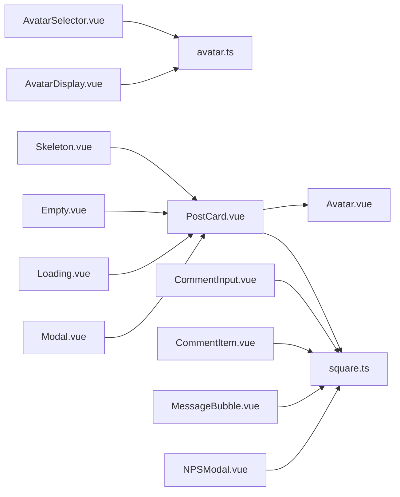
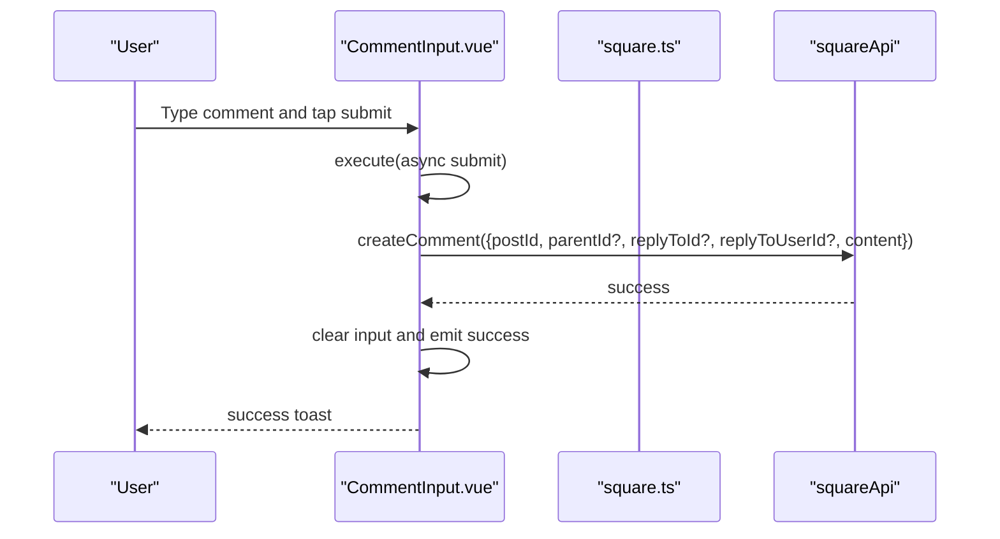
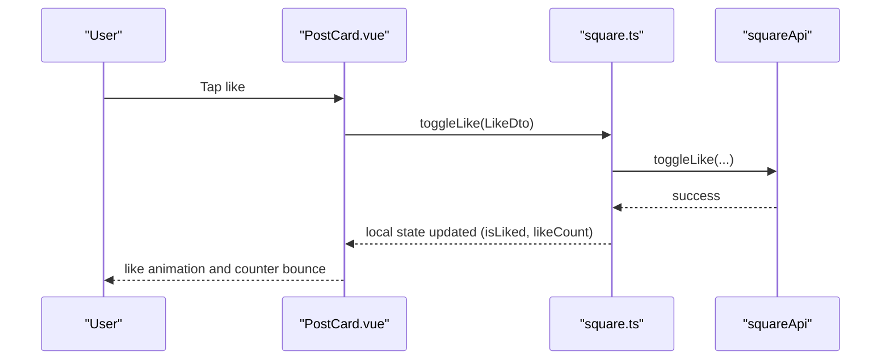

# Component Library

<cite>
**Referenced Files in This Document**
- [AvatarDisplay.vue](file://src/components/business/AvatarDisplay.vue)
- [AvatarSelector.vue](file://src/components/business/AvatarSelector.vue)
- [CitySelector.vue](file://src/components/business/CitySelector.vue)
- [CommentInput.vue](file://src/components/business/CommentInput.vue)
- [CommentItem.vue](file://src/components/business/CommentItem.vue)
- [MessageBubble.vue](file://src/components/business/MessageBubble.vue)
- [NPSModal.vue](file://src/components/business/NPSModal.vue)
- [PostCard.vue](file://src/components/business/PostCard.vue)
- [Avatar.vue](file://src/components/common/Avatar.vue)
- [Empty.vue](file://src/components/common/Empty.vue)
- [Loading.vue](file://src/components/common/Loading.vue)
- [Modal.vue](file://src/components/common/Modal.vue)
- [Skeleton.vue](file://src/components/common/Skeleton.vue)
- [avatar.ts](file://src/stores/avatar.ts)
- [square.ts](file://src/stores/square.ts)
</cite>

## Table of Contents
1. [Introduction](#introduction)
2. [Project Structure](#project-structure)
3. [Core Components](#core-components)
4. [Architecture Overview](#architecture-overview)
5. [Detailed Component Analysis](#detailed-component-analysis)
6. [Dependency Analysis](#dependency-analysis)
7. [Performance Considerations](#performance-considerations)
8. [Troubleshooting Guide](#troubleshooting-guide)
9. [Conclusion](#conclusion)
10. [Appendices](#appendices)

## Introduction
This document describes the reusable component library for the WeTogether platform. It organizes components by business and common categories, detailing visual appearance, behavior, user interaction patterns, props/events/slots, customization options, composition patterns, and integrations with Pinia stores. It also provides guidance on responsive design, accessibility, cross-platform compatibility, styling and theming, performance optimization, lifecycle management, and practical usage examples via file references.

## Project Structure
The component library is split into two primary folders:
- Business components: Feature-specific UI building blocks (e.g., avatar selection, city selector, post cards, messaging bubbles, NPS feedback).
- Common components: Generic UI primitives (e.g., Avatar, Modal, Loading, Empty, Skeleton).

**Diagram sources**
- [AvatarDisplay.vue:1-87](file://src/components/business/AvatarDisplay.vue#L1-L87)
- [AvatarSelector.vue:1-286](file://src/components/business/AvatarSelector.vue#L1-L286)
- [CitySelector.vue:1-515](file://src/components/business/CitySelector.vue#L1-L515)
- [CommentInput.vue:1-123](file://src/components/business/CommentInput.vue#L1-L123)
- [CommentItem.vue:1-187](file://src/components/business/CommentItem.vue#L1-L187)
- [MessageBubble.vue:1-309](file://src/components/business/MessageBubble.vue#L1-L309)
- [NPSModal.vue:1-550](file://src/components/business/NPSModal.vue#L1-L550)
- [PostCard.vue:1-628](file://src/components/business/PostCard.vue#L1-L628)
- [Avatar.vue:1-95](file://src/components/common/Avatar.vue#L1-L95)
- [Modal.vue:1-236](file://src/components/common/Modal.vue#L1-L236)
- [Loading.vue:1-46](file://src/components/common/Loading.vue#L1-L46)
- [Empty.vue:1-34](file://src/components/common/Empty.vue#L1-L34)
- [Skeleton.vue:1-169](file://src/components/common/Skeleton.vue#L1-L169)
- [avatar.ts:1-52](file://src/stores/avatar.ts#L1-L52)
- [square.ts:1-152](file://src/stores/square.ts#L1-L152)

**Section sources**
- [AvatarDisplay.vue:1-87](file://src/components/business/AvatarDisplay.vue#L1-L87)
- [AvatarSelector.vue:1-286](file://src/components/business/AvatarSelector.vue#L1-L286)
- [CitySelector.vue:1-515](file://src/components/business/CitySelector.vue#L1-L515)
- [CommentInput.vue:1-123](file://src/components/business/CommentInput.vue#L1-L123)
- [CommentItem.vue:1-187](file://src/components/business/CommentItem.vue#L1-L187)
- [MessageBubble.vue:1-309](file://src/components/business/MessageBubble.vue#L1-L309)
- [NPSModal.vue:1-550](file://src/components/business/NPSModal.vue#L1-L550)
- [PostCard.vue:1-628](file://src/components/business/PostCard.vue#L1-L628)
- [Avatar.vue:1-95](file://src/components/common/Avatar.vue#L1-L95)
- [Modal.vue:1-236](file://src/components/common/Modal.vue#L1-L236)
- [Loading.vue:1-46](file://src/components/common/Loading.vue#L1-L46)
- [Empty.vue:1-34](file://src/components/common/Empty.vue#L1-L34)
- [Skeleton.vue:1-169](file://src/components/common/Skeleton.vue#L1-L169)
- [avatar.ts:1-52](file://src/stores/avatar.ts#L1-L52)
- [square.ts:1-152](file://src/stores/square.ts#L1-L152)

## Core Components
This section summarizes the reusable components and their roles.

- Business components
  - AvatarDisplay: Presents the currently selected avatar with an overlay affordance to open the selector.
  - AvatarSelector: Modal for choosing preset or custom avatars, with preview and confirmation.
  - CitySelector: Modal for selecting a city with search, geolocation, and alphabetical index.
  - CommentInput: Text input with debounced submission for posting comments.
  - CommentItem: Renders a comment with nested replies, expand/collapse, and pagination.
  - MessageBubble: Chat message item with sender/receiver differentiation, status indicators, and retry.
  - NPSModal: Multi-step feedback flow (rating → feedback → thanks) with dynamic content and rewards.
  - PostCard: Social post card with images, likes, comments, shares, and reporting actions.

- Common components
  - Avatar: Generic avatar display supporting preset and custom URLs with size variants.
  - Modal: Reusable modal container with header, body, footer, and optional close button.
  - Loading: Spinner with optional label.
  - Empty: Placeholder with icon and optional slot.
  - Skeleton: Skeleton loaders for avatars, images, text, and cards.

**Section sources**
- [AvatarDisplay.vue:1-87](file://src/components/business/AvatarDisplay.vue#L1-L87)
- [AvatarSelector.vue:1-286](file://src/components/business/AvatarSelector.vue#L1-L286)
- [CitySelector.vue:1-515](file://src/components/business/CitySelector.vue#L1-L515)
- [CommentInput.vue:1-123](file://src/components/business/CommentInput.vue#L1-L123)
- [CommentItem.vue:1-187](file://src/components/business/CommentItem.vue#L1-L187)
- [MessageBubble.vue:1-309](file://src/components/business/MessageBubble.vue#L1-L309)
- [NPSModal.vue:1-550](file://src/components/business/NPSModal.vue#L1-L550)
- [PostCard.vue:1-628](file://src/components/business/PostCard.vue#L1-L628)
- [Avatar.vue:1-95](file://src/components/common/Avatar.vue#L1-L95)
- [Modal.vue:1-236](file://src/components/common/Modal.vue#L1-L236)
- [Loading.vue:1-46](file://src/components/common/Loading.vue#L1-L46)
- [Empty.vue:1-34](file://src/components/common/Empty.vue#L1-L34)
- [Skeleton.vue:1-169](file://src/components/common/Skeleton.vue#L1-L169)

## Architecture Overview
The component library integrates tightly with Pinia stores for state and API interactions. Business components often depend on shared stores (e.g., avatar and square) and utility helpers. Common components are intentionally generic and composable across business features.

**Diagram sources**
- [PostCard.vue:1-628](file://src/components/business/PostCard.vue#L1-L628)
- [CommentInput.vue:1-123](file://src/components/business/CommentInput.vue#L1-L123)
- [CommentItem.vue:1-187](file://src/components/business/CommentItem.vue#L1-L187)
- [MessageBubble.vue:1-309](file://src/components/business/MessageBubble.vue#L1-L309)
- [NPSModal.vue:1-550](file://src/components/business/NPSModal.vue#L1-L550)
- [CitySelector.vue:1-515](file://src/components/business/CitySelector.vue#L1-L515)
- [AvatarDisplay.vue:1-87](file://src/components/business/AvatarDisplay.vue#L1-L87)
- [AvatarSelector.vue:1-286](file://src/components/business/AvatarSelector.vue#L1-L286)
- [Avatar.vue:1-95](file://src/components/common/Avatar.vue#L1-L95)
- [Modal.vue:1-236](file://src/components/common/Modal.vue#L1-L236)
- [Loading.vue:1-46](file://src/components/common/Loading.vue#L1-L46)
- [Empty.vue:1-34](file://src/components/common/Empty.vue#L1-L34)
- [Skeleton.vue:1-169](file://src/components/common/Skeleton.vue#L1-L169)
- [avatar.ts:1-52](file://src/stores/avatar.ts#L1-L52)
- [square.ts:1-152](file://src/stores/square.ts#L1-L152)

## Detailed Component Analysis

### Business Components

#### AvatarDisplay
- Purpose: Display the current avatar and trigger selection.
- Props: None.
- Events: select (no payload).
- Slots: None.
- Behavior:
  - Renders a sprite avatar or a custom image depending on store state.
  - Shows an edit overlay; clicking emits select to parent.
- Composition pattern: Integrates with useAvatarStore to render the selected avatar.
- Accessibility: Uses a clickable container; ensure focus and tap targets meet touch target minimums.
- Styling: Responsive sizing via rpx units; overlay styled with rounded button and shadow.

**Section sources**
- [AvatarDisplay.vue:1-87](file://src/components/business/AvatarDisplay.vue#L1-L87)
- [avatar.ts:1-52](file://src/stores/avatar.ts#L1-L52)

#### AvatarSelector
- Purpose: Modal for choosing a new avatar (preset grid or custom upload).
- Props: None.
- Events: confirm(AvatarOption), cancel().
- Behavior:
  - Tabs switch between preset and custom.
  - Preset grid renders 49 placeholders; selection stored temporarily.
  - Custom uploads via uni.chooseImage; preview shown; confirm saves to store and emits.
- Validation: Prevents confirm without selection; shows toasts on failure.
- Styling: Modal with tabs, upload area, action buttons; SCSS variables for spacing and colors.

**Section sources**
- [AvatarSelector.vue:1-286](file://src/components/business/AvatarSelector.vue#L1-L286)
- [avatar.ts:1-52](file://src/stores/avatar.ts#L1-L52)

#### CitySelector
- Purpose: Modal for city selection with search, geolocation, and alphabetical index.
- Props:
  - visible: boolean
  - currentCity?: string (default placeholder)
- Events: close(), select(city: string).
- Behavior:
  - Search cities with real-time filtering.
  - Geolocation via uni.getLocation; resolves city via API; shows toast on errors.
  - Alphabetical index scrolls to city groups.
  - Emits select and closes on success; resets on close.
- Accessibility: Ensure keyboard navigation and screen reader-friendly labels for lists.

**Section sources**
- [CitySelector.vue:1-515](file://src/components/business/CitySelector.vue#L1-L515)

#### CommentInput
- Purpose: Lightweight comment composer with debounced submission.
- Props:
  - postId: number
  - replyToComment?: Comment
- Events: success().
- Behavior:
  - Dynamic placeholder based on reply target.
  - Debounced submit via useDebounceButton; calls squareApi.createComment; clears input and emits success.
- UX: Disabled when empty or loading; gradient submit button with pressed state.

**Section sources**
- [CommentInput.vue:1-123](file://src/components/business/CommentInput.vue#L1-L123)
- [square.ts:1-152](file://src/stores/square.ts#L1-L152)

#### CommentItem
- Purpose: Render a single comment with nested replies and pagination.
- Props:
  - comment: Comment
- Events: reply(comment: Comment).
- Behavior:
  - Expands/collapses replies; loads replies lazily with pagination.
  - Computes remaining replies; triggers parent reply handler.
- UX: Shows reply count and toggles; loading states during fetch.

**Section sources**
- [CommentItem.vue:1-187](file://src/components/business/CommentItem.vue#L1-L187)
- [square.ts:1-152](file://src/stores/square.ts#L1-L152)

#### MessageBubble
- Purpose: Chat message item with sender/receiver alignment, avatar, status, and retry.
- Props:
  - message: any
  - showTime?: boolean
- Events: retry(messageId: number).
- Behavior:
  - Determines self vs other via auth store and message sender.
  - Shows sending dots or error indicator; retry emits event.
  - Applies entrance animation on mount.
- Styling: Different styles per side; MBTI-style preset avatar fallback.

**Section sources**
- [MessageBubble.vue:1-309](file://src/components/business/MessageBubble.vue#L1-L309)
- [square.ts:1-152](file://src/stores/square.ts#L1-L152)

#### NPSModal
- Purpose: Multi-step Net Promoter Score feedback flow.
- Props:
  - visible: boolean
  - triggerType?: 'auto' | 'manual'
  - triggerScene?: string
- Events: close(), success(feedback).
- Behavior:
  - Step 1: Score 0–10; step 2: Feedback text and tags (max 3); step 3: Thank you with reward.
  - Dynamic labels and placeholders based on score.
  - Validates minimum length; submits DTO to API; auto-closes after success.
- UX: Animated transitions; disabled states when invalid; toast feedback.

**Section sources**
- [NPSModal.vue:1-550](file://src/components/business/NPSModal.vue#L1-L550)
- [square.ts:1-152](file://src/stores/square.ts#L1-L152)

#### PostCard
- Purpose: Social post card with user info, content, images, actions, and reporting.
- Props:
  - post: any
- Events: click, like, comment, share, report, delete.
- Behavior:
  - Lazy image loading with shimmer placeholders; error handling hides placeholder.
  - Like animation with particles and counters; emits like event.
  - Action sheet for delete/report; report supports free-text modal.
  - Click handlers navigate to user detail and preview images.
- Styling: Grid layout for images; animations for likes; modal overlay for reporting.

**Section sources**
- [PostCard.vue:1-628](file://src/components/business/PostCard.vue#L1-L628)
- [Avatar.vue:1-95](file://src/components/common/Avatar.vue#L1-L95)
- [square.ts:1-152](file://src/stores/square.ts#L1-L152)

### Common Components

#### Avatar
- Purpose: Generic avatar display with size variants and click handler.
- Props:
  - avatarId?: number
  - avatarUrl?: string
  - size?: 'small' | 'medium' | 'large'
- Events: click().
- Behavior:
  - Resolves display via getAvatarDisplay; renders MBTI icon or custom image.
  - Applies size-specific dimensions and styles.
- Composition: Used inside PostCard and MessageBubble.

**Section sources**
- [Avatar.vue:1-95](file://src/components/common/Avatar.vue#L1-L95)

#### Modal
- Purpose: Reusable modal container with optional header, footer, and close button.
- Props:
  - visible: boolean
  - title?: string
  - content?: string
  - showClose?: boolean
  - showFooter?: boolean
  - showCancel?: boolean
  - confirmText?: string
  - cancelText?: string
  - closeOnClickOverlay?: boolean
- Events: update:visible(value), confirm(), cancel(), close().
- Behavior:
  - Watcher triggers entrance animation when visible becomes true.
  - Overlay click optionally closes; emits close and updates binding.

**Section sources**
- [Modal.vue:1-236](file://src/components/common/Modal.vue#L1-L236)

#### Loading
- Purpose: Loading spinner with optional text.
- Props: text?: string.
- Events: None.
- Styling: Centered spinner with animation; light text color.

**Section sources**
- [Loading.vue:1-46](file://src/components/common/Loading.vue#L1-L46)

#### Empty
- Purpose: Empty state placeholder with icon and optional slot.
- Props: text?: string.
- Events: None.
- Styling: Centered layout with subdued icon and text.

**Section sources**
- [Empty.vue:1-34](file://src/components/common/Empty.vue#L1-L34)

#### Skeleton
- Purpose: Skeleton loaders for common UI shapes.
- Props:
  - type?: 'avatar' | 'image' | 'text' | 'card'
  - width?: string
  - height?: string
  - animated?: boolean
  - showImage?: boolean
- Events: None.
- Behavior:
  - Animated shimmer effect when animated is true.
  - Card type composes avatar, text, and optional image rows.

**Section sources**
- [Skeleton.vue:1-169](file://src/components/common/Skeleton.vue#L1-L169)

## Dependency Analysis
- Business components depend on:
  - Pinia stores (avatar.ts, square.ts) for state and API interactions.
  - Utility helpers (formatTime, getAvatarDisplay).
  - UniApp APIs (uni.chooseImage, uni.getLocation, uni.showToast, uni.showModal, uni.showActionSheet, uni.previewImage).
- Common components are decoupled and used across business components.

**Diagram sources**
- [AvatarDisplay.vue:1-87](file://src/components/business/AvatarDisplay.vue#L1-L87)
- [AvatarSelector.vue:1-286](file://src/components/business/AvatarSelector.vue#L1-L286)
- [PostCard.vue:1-628](file://src/components/business/PostCard.vue#L1-L628)
- [CommentInput.vue:1-123](file://src/components/business/CommentInput.vue#L1-L123)
- [CommentItem.vue:1-187](file://src/components/business/CommentItem.vue#L1-L187)
- [MessageBubble.vue:1-309](file://src/components/business/MessageBubble.vue#L1-L309)
- [NPSModal.vue:1-550](file://src/components/business/NPSModal.vue#L1-L550)
- [Avatar.vue:1-95](file://src/components/common/Avatar.vue#L1-L95)
- [Modal.vue:1-236](file://src/components/common/Modal.vue#L1-L236)
- [Loading.vue:1-46](file://src/components/common/Loading.vue#L1-L46)
- [Empty.vue:1-34](file://src/components/common/Empty.vue#L1-L34)
- [Skeleton.vue:1-169](file://src/components/common/Skeleton.vue#L1-L169)
- [avatar.ts:1-52](file://src/stores/avatar.ts#L1-L52)
- [square.ts:1-152](file://src/stores/square.ts#L1-L152)

**Section sources**
- [avatar.ts:1-52](file://src/stores/avatar.ts#L1-L52)
- [square.ts:1-152](file://src/stores/square.ts#L1-L152)

## Performance Considerations
- Virtualization and pagination: Use virtualized lists or pagination for long comment threads and post feeds.
- Lazy loading: Already implemented for images in PostCard; continue applying to grids and lists.
- Debouncing: CommentInput uses a debounced submit to reduce API calls.
- Animations: Keep animations lightweight; disable where unnecessary on low-end devices.
- Event bus: Square store emits events for global updates; avoid excessive listeners.
- Storage persistence: Avatar store persists across sessions; avoid heavy writes.

[No sources needed since this section provides general guidance]

## Troubleshooting Guide
- Avatar selection not updating:
  - Verify setSelectedAvatar is called and store persists.
  - Check getAvatarDisplay resolution in AvatarSelector and AvatarDisplay.
- City selection fails:
  - Inspect uni.getLocation permissions and error messages; ensure API call succeeds.
- Comment submission blocked:
  - Confirm debounce state and placeholder logic; check network connectivity.
- Reply loading issues:
  - Ensure pagination params and API response shape match expectations.
- Message status icons:
  - Validate message.status values and retry event emission.

**Section sources**
- [AvatarSelector.vue:134-152](file://src/components/business/AvatarSelector.vue#L134-L152)
- [CitySelector.vue:164-201](file://src/components/business/CitySelector.vue#L164-L201)
- [CommentInput.vue:53-73](file://src/components/business/CommentInput.vue#L53-L73)
- [CommentItem.vue:77-101](file://src/components/business/CommentItem.vue#L77-L101)
- [MessageBubble.vue:112-114](file://src/components/business/MessageBubble.vue#L112-L114)

## Conclusion
The WeTogether component library emphasizes composability, clear separation of concerns, and robust integrations with Pinia and UniApp APIs. Business components encapsulate feature-specific logic while common components provide reusable primitives. Following the guidelines herein ensures consistent UX, maintainable code, and strong performance across platforms.

[No sources needed since this section summarizes without analyzing specific files]

## Appendices

### Usage Examples (by file reference)
- Open AvatarSelector from AvatarDisplay:
  - Parent listens to select event and opens the modal.
  - Reference: [AvatarDisplay.vue:30-41](file://src/components/business/AvatarDisplay.vue#L30-L41), [AvatarSelector.vue:67-71](file://src/components/business/AvatarSelector.vue#L67-L71)
- Submit a comment:
  - Bind postId and optional replyToComment; listen to success.
  - Reference: [CommentInput.vue:25-33](file://src/components/business/CommentInput.vue#L25-L33), [square.ts:61-74](file://src/stores/square.ts#L61-L74)
- Render a post with images and actions:
  - Pass post object; handle emitted actions.
  - Reference: [PostCard.vue:102-113](file://src/components/business/PostCard.vue#L102-L113), [Avatar.vue:17-41](file://src/components/common/Avatar.vue#L17-L41)
- Show a modal with custom footer:
  - Control visible via v-model and handle confirm/cancel.
  - Reference: [Modal.vue:32-58](file://src/components/common/Modal.vue#L32-L58)
- Display skeleton placeholders:
  - Choose type and animate as needed.
  - Reference: [Skeleton.vue:52-66](file://src/components/common/Skeleton.vue#L52-L66)

### API Workflows

#### Comment Submission Flow

**Diagram sources**
- [CommentInput.vue:53-73](file://src/components/business/CommentInput.vue#L53-L73)
- [square.ts:61-74](file://src/stores/square.ts#L61-L74)

#### Toggle Like Flow

**Diagram sources**
- [PostCard.vue:162-178](file://src/components/business/PostCard.vue#L162-L178)
- [square.ts:95-128](file://src/stores/square.ts#L95-L128)

### Component Lifecycle Management
- AvatarDisplay and AvatarSelector rely on store state; ensure cleanup of temporary selections on cancel/close.
- PostCard manages image loading lifecycles; handle errors gracefully.
- MessageBubble applies enter animations on mount; ensure minimal work in mounted hook.

**Section sources**
- [AvatarDisplay.vue:39-41](file://src/components/business/AvatarDisplay.vue#L39-L41)
- [AvatarSelector.vue:150-152](file://src/components/business/AvatarSelector.vue#L150-L152)
- [PostCard.vue:154-160](file://src/components/business/PostCard.vue#L154-L160)
- [MessageBubble.vue:106-110](file://src/components/business/MessageBubble.vue#L106-L110)

### Styling, Theming, and Accessibility
- Use SCSS variables and design tokens for consistent spacing, colors, and typography.
- Ensure sufficient contrast and touch targets; add ARIA attributes where appropriate.
- Test responsive layouts across device widths; verify animations do not exceed 60fps.

[No sources needed since this section provides general guidance]