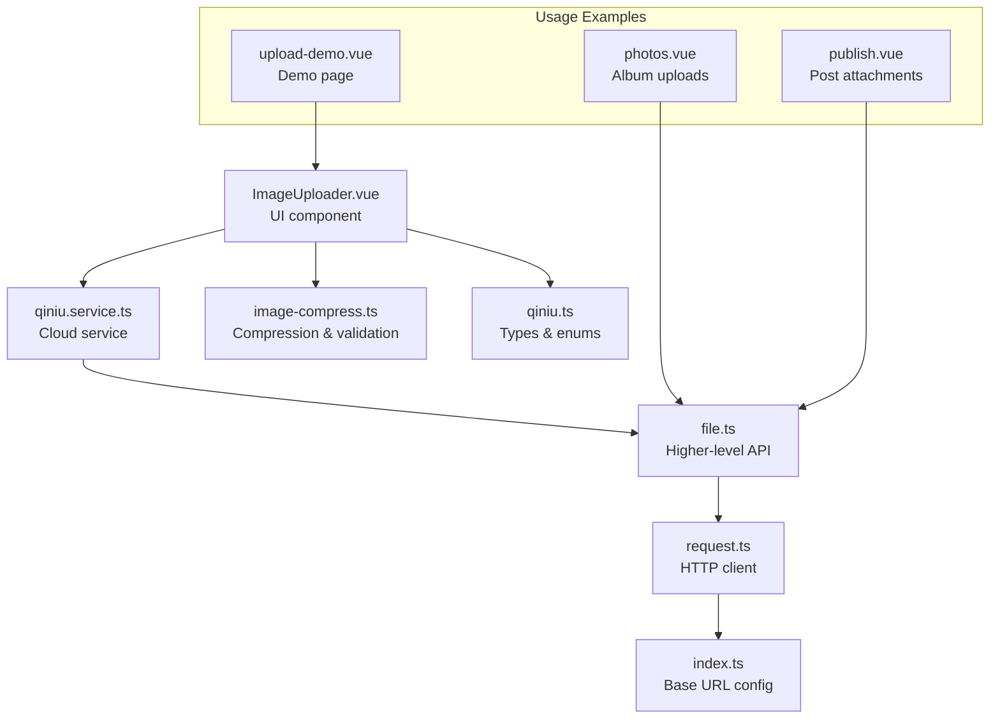
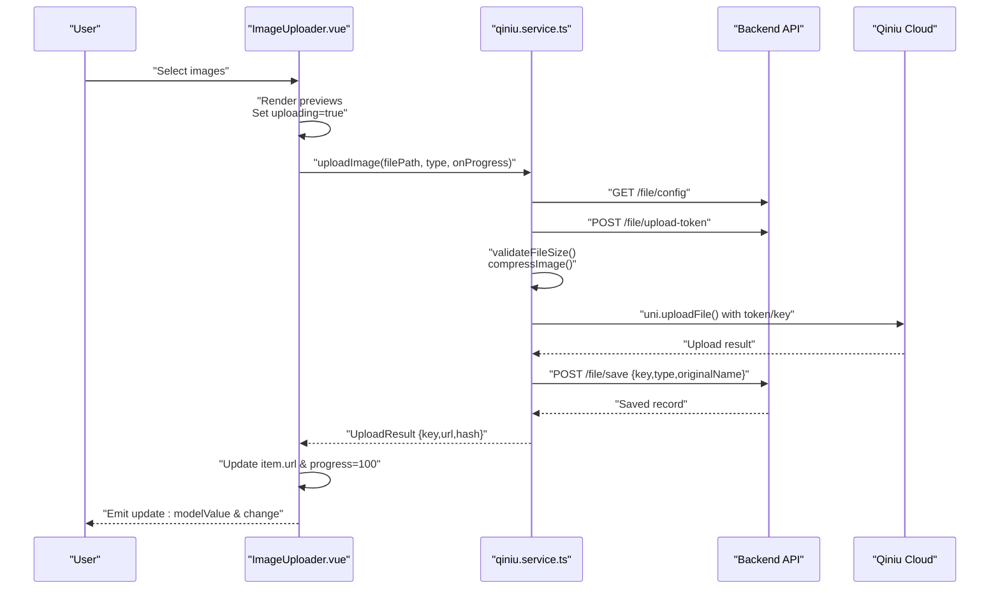
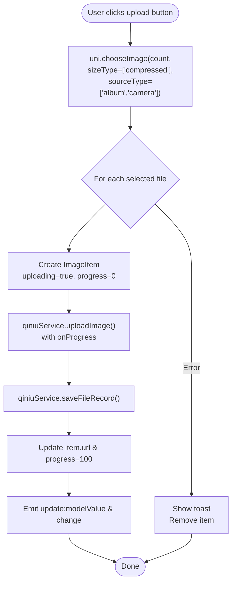
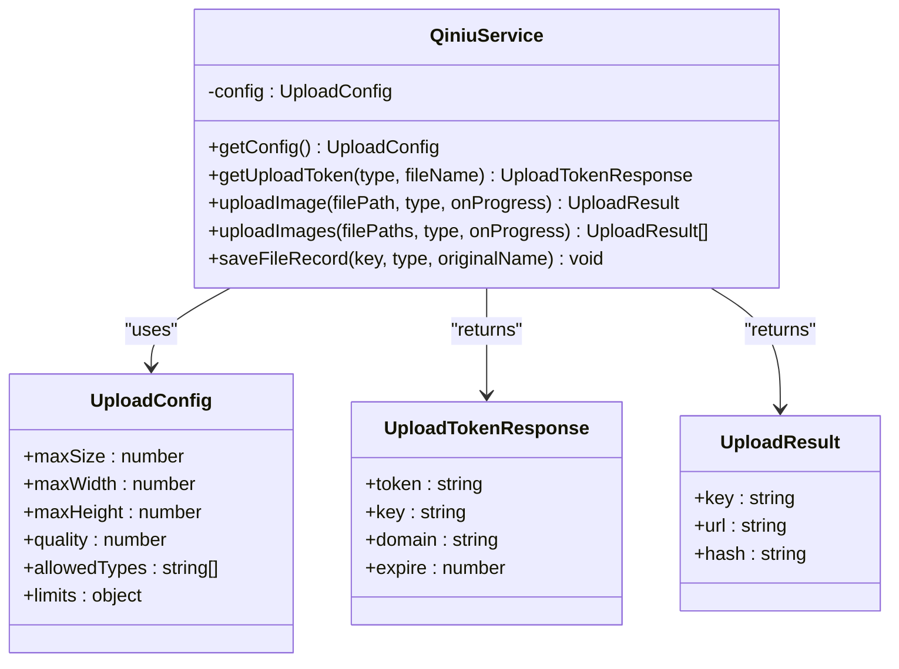
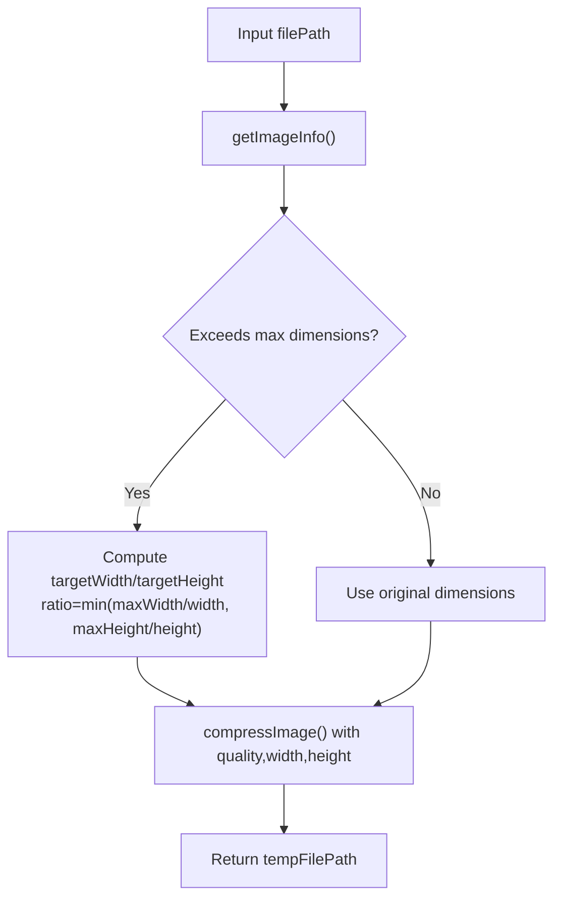
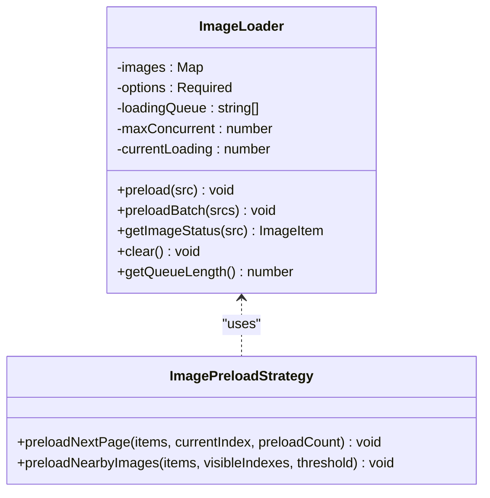
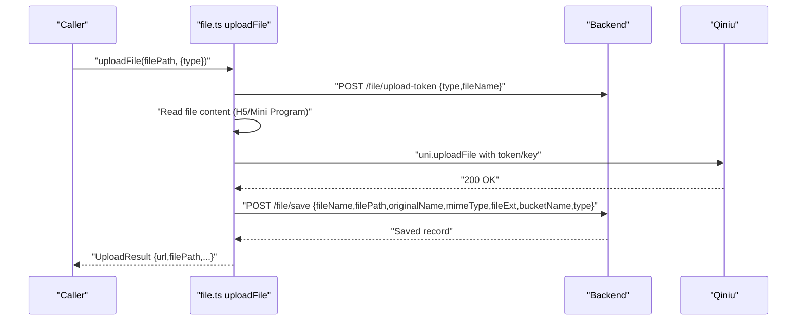
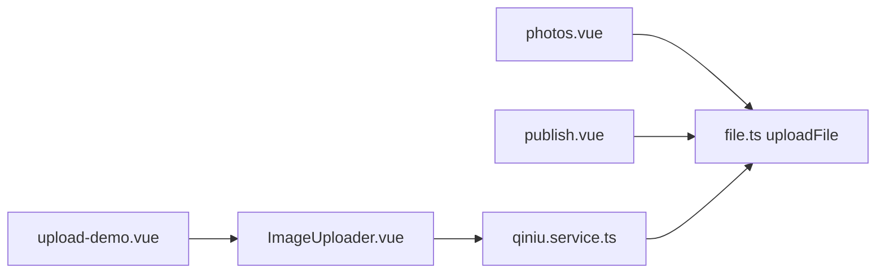
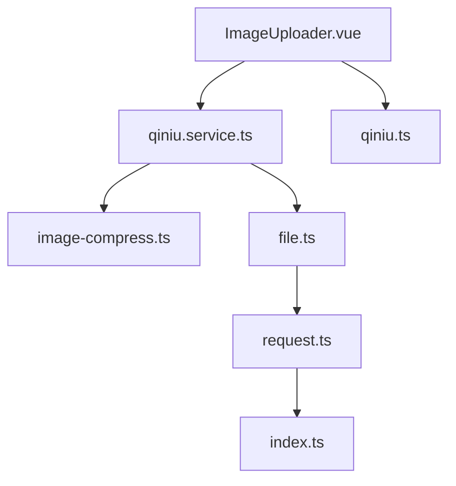

# Specialized Components

<cite>
**Referenced Files in This Document**
- [ImageUploader.vue](file://src/components/ImageUploader.vue)
- [qiniu.service.ts](file://src/services/qiniu.service.ts)
- [image-compress.ts](file://src/utils/image-compress.ts)
- [imageLoader.ts](file://src/utils/imageLoader.ts)
- [file.ts](file://src/api/modules/file.ts)
- [upload-demo.vue](file://src/pages/examples/upload-demo.vue)
- [photos.vue](file://src/pages/profile/photos.vue)
- [publish.vue](file://src/pages/square/publish.vue)
- [qiniu.ts](file://src/types/qiniu.ts)
- [request.ts](file://src/api/request.ts)
- [index.ts](file://src/config/index.ts)
</cite>

## Table of Contents
1. [Introduction](#introduction)
2. [Project Structure](#project-structure)
3. [Core Components](#core-components)
4. [Architecture Overview](#architecture-overview)
5. [Detailed Component Analysis](#detailed-component-analysis)
6. [Dependency Analysis](#dependency-analysis)
7. [Performance Considerations](#performance-considerations)
8. [Troubleshooting Guide](#troubleshooting-guide)
9. [Conclusion](#conclusion)
10. [Appendices](#appendices)

## Introduction
This document focuses on specialized components that handle complex media upload workflows in the WeTogether platform. The primary emphasis is on the ImageUploader component, which orchestrates media selection, compression, preview rendering, progress tracking, and integration with cloud storage via Qiniu. It also covers supporting utilities for image compression, file validation, and lazy/preloading strategies for optimal user experience during large file operations.

## Project Structure
The upload-related functionality spans several layers:
- UI component layer: ImageUploader.vue renders the upload interface and manages local previews and progress.
- Service layer: qiniu.service.ts encapsulates cloud upload logic, token retrieval, and file record saving.
- Utility layer: image-compress.ts provides compression and validation helpers; imageLoader.ts offers preloading and progressive loading strategies.
- API layer: file.ts defines higher-level upload APIs and integrates with backend endpoints.
- Example and usage pages: upload-demo.vue demonstrates typical configurations; photos.vue and publish.vue show real-world integrations.

**Diagram sources**
- [ImageUploader.vue:1-242](file://src/components/ImageUploader.vue#L1-L242)
- [qiniu.service.ts:1-126](file://src/services/qiniu.service.ts#L1-L126)
- [image-compress.ts:1-87](file://src/utils/image-compress.ts#L1-L87)
- [file.ts:1-335](file://src/api/modules/file.ts#L1-L335)
- [request.ts:1-228](file://src/api/request.ts#L1-L228)
- [index.ts:1-11](file://src/config/index.ts#L1-L11)
- [upload-demo.vue:1-100](file://src/pages/examples/upload-demo.vue#L1-L100)
- [photos.vue:1-505](file://src/pages/profile/photos.vue#L1-L505)
- [publish.vue:1-239](file://src/pages/square/publish.vue#L1-L239)

**Section sources**
- [ImageUploader.vue:1-242](file://src/components/ImageUploader.vue#L1-L242)
- [qiniu.service.ts:1-126](file://src/services/qiniu.service.ts#L1-L126)
- [image-compress.ts:1-87](file://src/utils/image-compress.ts#L1-L87)
- [file.ts:1-335](file://src/api/modules/file.ts#L1-L335)
- [upload-demo.vue:1-100](file://src/pages/examples/upload-demo.vue#L1-L100)
- [photos.vue:1-505](file://src/pages/profile/photos.vue#L1-L505)
- [publish.vue:1-239](file://src/pages/square/publish.vue#L1-L239)

## Core Components
- ImageUploader.vue: A Vue component that allows selecting multiple images, displays previews, shows per-file progress, and emits updates to parent components. It integrates with qiniu.service.ts for compression, upload, and record saving.
- qiniu.service.ts: Provides upload configuration retrieval, token acquisition, image compression, and upload orchestration to Qiniu. It also persists file records after successful uploads.
- image-compress.ts: Offers compression helpers and file size validation to enforce client-side constraints before upload.
- file.ts: Higher-level file APIs for direct uploads (including avatar-specific flows) and token management.
- imageLoader.ts: Preloading and progressive image loading utilities to improve perceived performance and UX.

**Section sources**
- [ImageUploader.vue:32-152](file://src/components/ImageUploader.vue#L32-L152)
- [qiniu.service.ts:12-126](file://src/services/qiniu.service.ts#L12-L126)
- [image-compress.ts:10-87](file://src/utils/image-compress.ts#L10-L87)
- [file.ts:90-230](file://src/api/modules/file.ts#L90-L230)
- [imageLoader.ts:26-177](file://src/utils/imageLoader.ts#L26-L177)

## Architecture Overview
The upload pipeline follows a layered approach:
- UI triggers image selection and renders previews with progress overlays.
- Compression and validation occur locally before upload.
- Cloud upload uses Qiniu SDK with tokens fetched from backend.
- After successful upload, a file record is saved to backend.
- Parent components receive updated URLs via emitted events.

**Diagram sources**
- [ImageUploader.vue:78-131](file://src/components/ImageUploader.vue#L78-L131)
- [qiniu.service.ts:42-87](file://src/services/qiniu.service.ts#L42-L87)
- [qiniu.service.ts:112-122](file://src/services/qiniu.service.ts#L112-L122)

## Detailed Component Analysis

### ImageUploader Component
- Responsibilities:
  - Image selection via uni.chooseImage with constraints (compressed, album/camera).
  - Local preview rendering with delete confirmation modal.
  - Per-item progress overlay synchronized with onProgress callbacks.
  - Emitting modelValue and change events upon successful uploads.
- Key behaviors:
  - Initializes internal imageList from modelValue.
  - Limits uploads based on maxCount prop.
  - Integrates with qiniuService.uploadImage and qiniuService.saveFileRecord.
  - Handles errors by removing failed items and showing toast notifications.

**Diagram sources**
- [ImageUploader.vue:78-131](file://src/components/ImageUploader.vue#L78-L131)
- [qiniu.service.ts:42-87](file://src/services/qiniu.service.ts#L42-L87)
- [qiniu.service.ts:112-122](file://src/services/qiniu.service.ts#L112-L122)

**Section sources**
- [ImageUploader.vue:37-152](file://src/components/ImageUploader.vue#L37-L152)

### Qiniu Service Layer
- Responsibilities:
  - Fetches upload configuration (max size, dimensions, quality).
  - Validates file size and compresses images before upload.
  - Manages upload tokens via backend endpoints.
  - Performs uni.uploadFile to Qiniu and saves file records.
- Notable features:
  - Batch upload support with per-item progress callbacks.
  - Centralized error handling and result normalization.

**Diagram sources**
- [qiniu.service.ts:12-126](file://src/services/qiniu.service.ts#L12-L126)
- [qiniu.ts:15-37](file://src/types/qiniu.ts#L15-L37)

**Section sources**
- [qiniu.service.ts:12-126](file://src/services/qiniu.service.ts#L12-L126)
- [qiniu.ts:15-37](file://src/types/qiniu.ts#L15-L37)

### Image Compression Utilities
- Features:
  - compressImage(filePath, options) with configurable maxWidth, maxHeight, quality.
  - compressImages(filePaths, options) for batch processing.
  - validateFileSize(filePath, maxSize) and getFileSize(filePath).
- Integration:
  - Used by qiniu.service.ts to enforce client-side constraints before upload.

**Diagram sources**
- [image-compress.ts:10-49](file://src/utils/image-compress.ts#L10-L49)

**Section sources**
- [image-compress.ts:10-87](file://src/utils/image-compress.ts#L10-L87)

### Image Preloading and Progressive Loading
- ImageLoader:
  - Preloads images with retry logic and queue management.
  - Supports batch preloading and global loader singleton.
- ProgressiveImage:
  - Loads a low-quality placeholder first, then replaces with high-quality image.
- Strategies:
  - ImagePreloadStrategy preloads near-visible items to reduce perceived latency.

**Diagram sources**
- [imageLoader.ts:26-177](file://src/utils/imageLoader.ts#L26-L177)
- [imageLoader.ts:289-353](file://src/utils/imageLoader.ts#L289-L353)

**Section sources**
- [imageLoader.ts:26-177](file://src/utils/imageLoader.ts#L26-L177)
- [imageLoader.ts:258-284](file://src/utils/imageLoader.ts#L258-L284)
- [imageLoader.ts:289-353](file://src/utils/imageLoader.ts#L289-L353)

### Higher-Level File APIs
- uploadFile(filePath, options):
  - Handles platform detection (H5 vs Mini Program), reads file content appropriately, obtains upload token, uploads to Qiniu, and saves file record.
- uploadAvatar(filePath):
  - Dedicated avatar upload with backend integration for avatar assignment.
- getUploadToken/saveFileRecord:
  - Backend endpoints for token and record persistence.

**Diagram sources**
- [file.ts:90-230](file://src/api/modules/file.ts#L90-L230)

**Section sources**
- [file.ts:90-230](file://src/api/modules/file.ts#L90-L230)
- [file.ts:280-322](file://src/api/modules/file.ts#L280-L322)

### Usage Examples and Integration Patterns
- upload-demo.vue:
  - Demonstrates ImageUploader with different UploadType values and tips for various scenarios (square posts, album, avatar, certificates).
- photos.vue:
  - Album photo management with upload flow using fileApi.uploadFile and album type.
- publish.vue:
  - Post publishing with optional single image attachment using fileApi.uploadFile mapped to square type.

**Diagram sources**
- [upload-demo.vue:4-41](file://src/pages/examples/upload-demo.vue#L4-L41)
- [photos.vue:134-179](file://src/pages/profile/photos.vue#L134-L179)
- [publish.vue:55-134](file://src/pages/square/publish.vue#L55-L134)
- [file.ts:90-230](file://src/api/modules/file.ts#L90-L230)

**Section sources**
- [upload-demo.vue:4-41](file://src/pages/examples/upload-demo.vue#L4-L41)
- [photos.vue:134-179](file://src/pages/profile/photos.vue#L134-L179)
- [publish.vue:55-134](file://src/pages/square/publish.vue#L55-L134)

## Dependency Analysis
- Internal dependencies:
  - ImageUploader.vue depends on qiniu.service.ts and qiniu.ts types.
  - qiniu.service.ts depends on image-compress.ts and file.ts for token and record operations.
  - file.ts depends on request.ts for HTTP requests and index.ts for base URL configuration.
- External dependencies:
  - Qiniu JavaScript SDK for upload operations.
  - uni APIs for cross-platform image selection, compression, and upload.

**Diagram sources**
- [ImageUploader.vue:34-35](file://src/components/ImageUploader.vue#L34-L35)
- [qiniu.service.ts:1-10](file://src/services/qiniu.service.ts#L1-L10)
- [file.ts:1-3](file://src/api/modules/file.ts#L1-L3)
- [request.ts:1-2](file://src/api/request.ts#L1-L2)
- [index.ts:1-5](file://src/config/index.ts#L1-L5)

**Section sources**
- [ImageUploader.vue:34-35](file://src/components/ImageUploader.vue#L34-L35)
- [qiniu.service.ts:1-10](file://src/services/qiniu.service.ts#L1-L10)
- [file.ts:1-3](file://src/api/modules/file.ts#L1-L3)
- [request.ts:1-2](file://src/api/request.ts#L1-L2)
- [index.ts:1-5](file://src/config/index.ts#L1-L5)

## Performance Considerations
- Compression and validation:
  - Enforce size and dimension limits client-side to reduce upload time and cost.
  - Use batch compression where appropriate to minimize repeated conversions.
- Upload strategies:
  - Prefer uni.uploadFile with tokens for efficient streaming uploads.
  - Limit concurrent uploads to avoid overwhelming device resources and network.
- Preloading and progressive loading:
  - Use ImageLoader to manage concurrent loads and retries.
  - Apply progressive loading to improve perceived performance for large images.
- Memory management:
  - Avoid retaining large image buffers unnecessarily; rely on temporary file paths returned by compression APIs.
  - Clear loaders and queues when leaving screens to prevent leaks.

[No sources needed since this section provides general guidance]

## Troubleshooting Guide
- Common issues and remedies:
  - Upload fails due to size limit: Verify maxSize in upload configuration and ensure validateFileSize is applied before upload.
  - Network errors: Inspect request.ts error handling and token refresh logic; ensure proper Authorization headers.
  - Progress not updating: Confirm onProgress callback is passed through to qiniuService.uploadImage and that ImageUploader updates item.progress accordingly.
  - Token errors: Ensure getUploadToken returns valid token and key; confirm backend endpoints are reachable.
  - File record not saved: Check saveFileRecord endpoint and payload correctness.

**Section sources**
- [qiniu.service.ts:49-52](file://src/services/qiniu.service.ts#L49-L52)
- [request.ts:100-147](file://src/api/request.ts#L100-L147)
- [ImageUploader.vue:100-107](file://src/components/ImageUploader.vue#L100-L107)
- [qiniu.service.ts:112-122](file://src/services/qiniu.service.ts#L112-L122)

## Conclusion
The ImageUploader component, backed by qiniu.service.ts and supporting utilities, provides a robust, user-friendly solution for media uploads across the WeTogether platform. Its integration with compression, validation, progress tracking, and cloud storage ensures reliable performance and a smooth user experience. The included examples demonstrate practical usage patterns for profile photos, post attachments, and bulk processing, while the preloading utilities help maintain responsiveness during large file operations.

[No sources needed since this section summarizes without analyzing specific files]

## Appendices

### Configuration Options Reference
- UploadType enum:
  - square, avatar, certificate, album.
- UploadConfig:
  - maxSize, maxWidth, maxHeight, quality, allowedTypes, limits.square, limits.album.
- ImageUploader props:
  - modelValue: string[] (initial URLs), maxCount: number (default 9), uploadType: UploadType, tip?: string.

**Section sources**
- [qiniu.ts:1-6](file://src/types/qiniu.ts#L1-L6)
- [qiniu.ts:15-25](file://src/types/qiniu.ts#L15-L25)
- [ImageUploader.vue:37-52](file://src/components/ImageUploader.vue#L37-L52)

### Implementation Examples Index
- Profile picture uploads:
  - Use ImageUploader with UploadType.AVATAR and maxCount=1.
- Post media attachments:
  - Use ImageUploader with UploadType.SQUARE and maxCount=1; alternatively, use fileApi.uploadFile in publish.vue.
- Bulk image processing:
  - Use qiniu.service.ts.uploadImages for sequential uploads with per-item progress callbacks.

**Section sources**
- [upload-demo.vue:24-30](file://src/pages/examples/upload-demo.vue#L24-L30)
- [publish.vue:97-106](file://src/pages/square/publish.vue#L97-L106)
- [qiniu.service.ts:89-110](file://src/services/qiniu.service.ts#L89-L110)