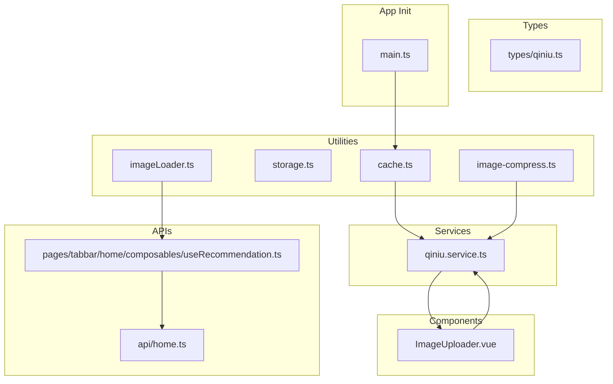
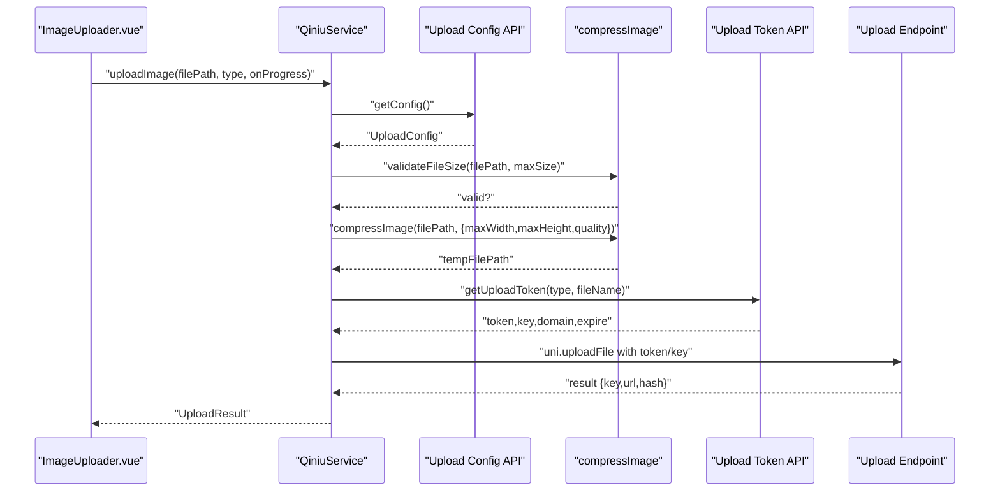
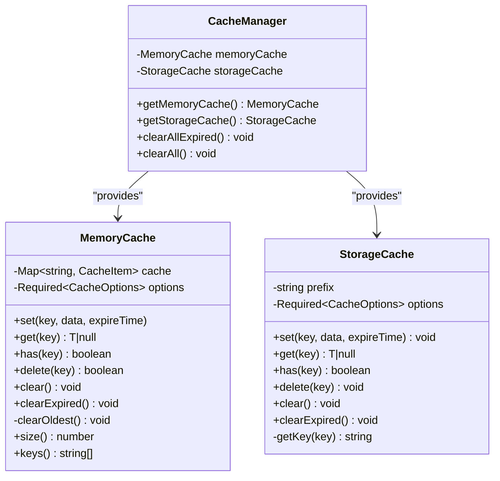
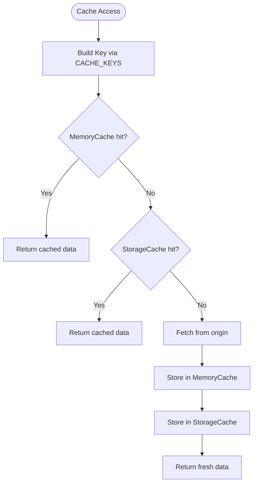
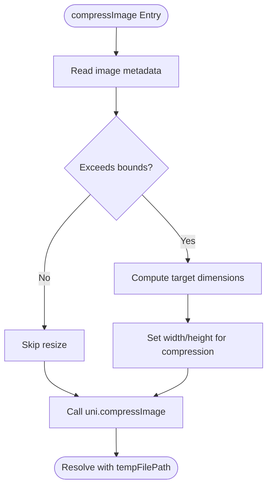
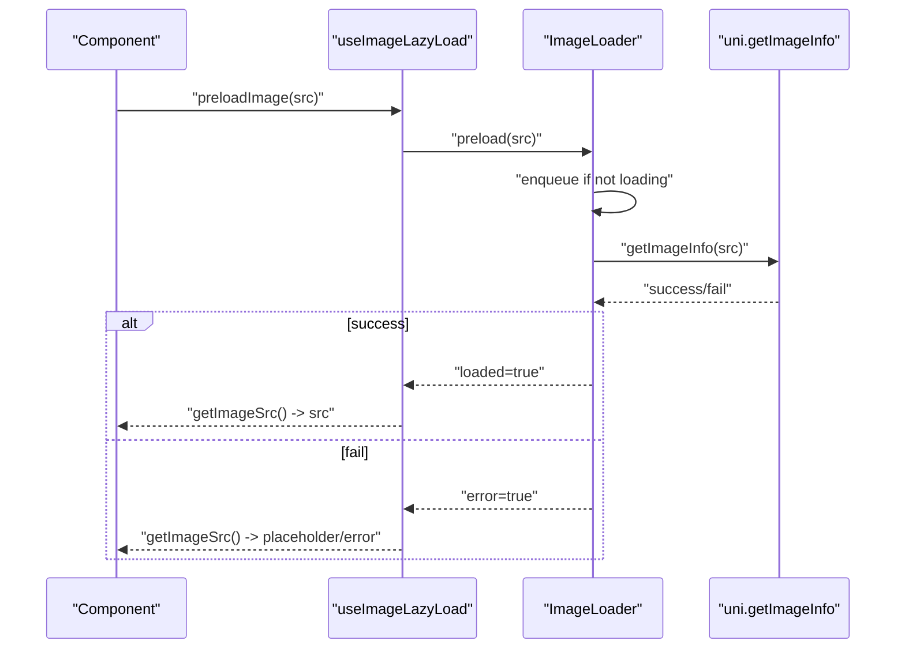
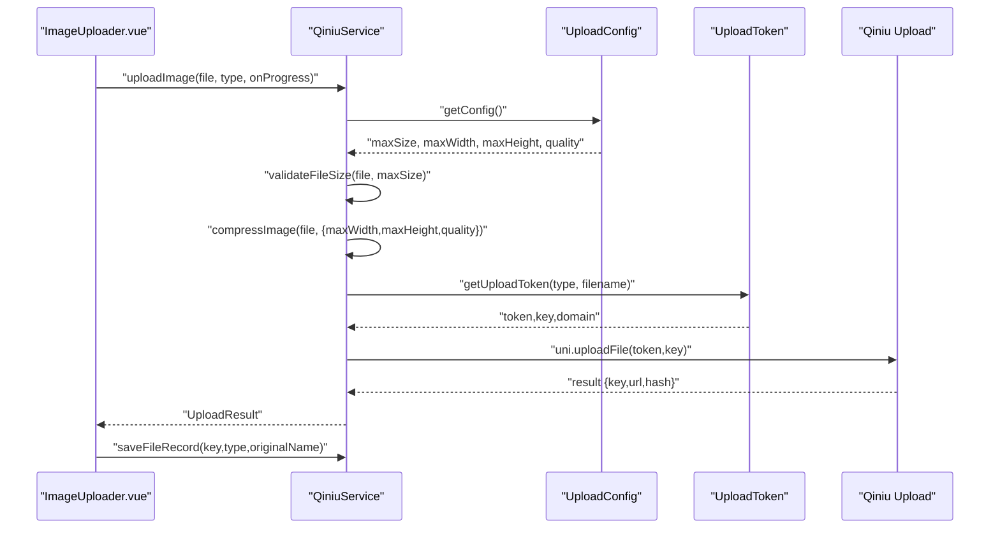
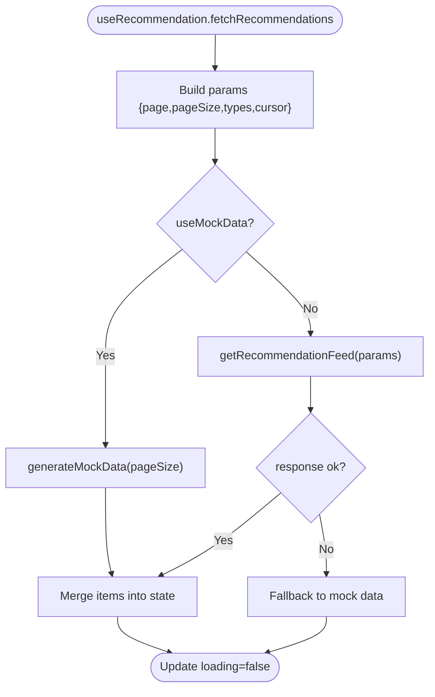
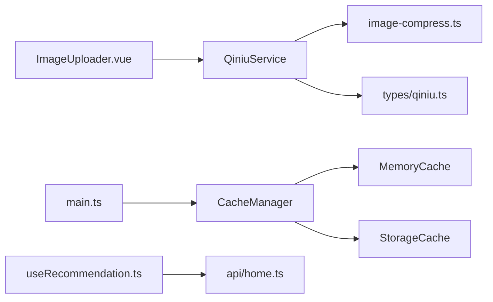

# Cache & Storage Utilities

<cite>
**Referenced Files in This Document**
- [cache.ts](file://src/utils/cache.ts)
- [storage.ts](file://src/utils/storage.ts)
- [image-compress.ts](file://src/utils/image-compress.ts)
- [imageLoader.ts](file://src/utils/imageLoader.ts)
- [qiniu.service.ts](file://src/services/qiniu.service.ts)
- [ImageUploader.vue](file://src/components/ImageUploader.vue)
- [qiniu.ts](file://src/types/qiniu.ts)
- [home.ts](file://src/api/home.ts)
- [useRecommendation.ts](file://src/pages/tabbar/home/composables/useRecommendation.ts)
- [main.ts](file://src/main.ts)
</cite>

## Table of Contents
1. [Introduction](#introduction)
2. [Project Structure](#project-structure)
3. [Core Components](#core-components)
4. [Architecture Overview](#architecture-overview)
5. [Detailed Component Analysis](#detailed-component-analysis)
6. [Dependency Analysis](#dependency-analysis)
7. [Performance Considerations](#performance-considerations)
8. [Troubleshooting Guide](#troubleshooting-guide)
9. [Conclusion](#conclusion)
10. [Appendices](#appendices)

## Introduction
This document explains the cache and storage utilities in the WeTogether platform, focusing on:
- Caching mechanisms for performance optimization
- Data persistence strategies and memory management
- Image compression utility for optimizing media uploads and reducing bandwidth
- Caching policies, expiration strategies, and invalidation mechanisms
- Implementation examples for different cache scenarios, compression configurations, and storage optimization techniques
- Performance benchmarks, memory usage patterns, and platform-specific storage limitations

## Project Structure
The cache and storage utilities are implemented under the src/utils directory and integrated with services and components:
- Cache and storage managers: src/utils/cache.ts, src/utils/storage.ts
- Image compression and lazy/preload utilities: src/utils/image-compress.ts, src/utils/imageLoader.ts
- Upload pipeline integrating compression and persistence: src/services/qiniu.service.ts, src/components/ImageUploader.vue
- Types for upload configuration and results: src/types/qiniu.ts
- Recommendation system composables and APIs: src/pages/tabbar/home/composables/useRecommendation.ts, src/api/home.ts
- Pinia initialization for persisted state: src/main.ts

**Diagram sources**
- [cache.ts:1-359](file://src/utils/cache.ts#L1-L359)
- [storage.ts:1-26](file://src/utils/storage.ts#L1-L26)
- [image-compress.ts:1-87](file://src/utils/image-compress.ts#L1-L87)
- [imageLoader.ts:1-354](file://src/utils/imageLoader.ts#L1-L354)
- [qiniu.service.ts:1-126](file://src/services/qiniu.service.ts#L1-L126)
- [ImageUploader.vue:1-242](file://src/components/ImageUploader.vue#L1-L242)
- [home.ts:1-198](file://src/api/home.ts#L1-L198)
- [useRecommendation.ts:1-202](file://src/pages/tabbar/home/composables/useRecommendation.ts#L1-L202)
- [qiniu.ts:1-38](file://src/types/qiniu.ts#L1-L38)
- [main.ts:1-18](file://src/main.ts#L1-L18)

**Section sources**
- [cache.ts:1-359](file://src/utils/cache.ts#L1-L359)
- [storage.ts:1-26](file://src/utils/storage.ts#L1-L26)
- [image-compress.ts:1-87](file://src/utils/image-compress.ts#L1-L87)
- [imageLoader.ts:1-354](file://src/utils/imageLoader.ts#L1-L354)
- [qiniu.service.ts:1-126](file://src/services/qiniu.service.ts#L1-L126)
- [ImageUploader.vue:1-242](file://src/components/ImageUploader.vue#L1-L242)
- [home.ts:1-198](file://src/api/home.ts#L1-L198)
- [useRecommendation.ts:1-202](file://src/pages/tabbar/home/composables/useRecommendation.ts#L1-L202)
- [qiniu.ts:1-38](file://src/types/qiniu.ts#L1-L38)
- [main.ts:1-18](file://src/main.ts#L1-L18)

## Core Components
- MemoryCache: In-memory cache with LRU-like eviction and per-item TTL.
- StorageCache: Persistent cache backed by uni storage with TTL and prefix-based key management.
- CacheManager: Singleton factory providing shared instances of MemoryCache and StorageCache, plus global cleanup helpers.
- CACHE_KEYS and CACHE_EXPIRE_TIME: Centralized cache key naming and TTL constants.
- storage: Lightweight wrapper around uni storage for generic key-value persistence.
- Image compression: Compression and validation utilities for media uploads.
- ImageLoader: Lazy/preload manager with retry, queueing, and concurrency control.
- QiniuService: Orchestrates upload configuration retrieval, compression, token acquisition, and upload to cloud storage.
- ImageUploader: UI component that integrates compression and upload flow with progress reporting.

**Section sources**
- [cache.ts:20-139](file://src/utils/cache.ts#L20-L139)
- [cache.ts:144-268](file://src/utils/cache.ts#L144-L268)
- [cache.ts:273-318](file://src/utils/cache.ts#L273-L318)
- [cache.ts:323-359](file://src/utils/cache.ts#L323-L359)
- [storage.ts:1-26](file://src/utils/storage.ts#L1-L26)
- [image-compress.ts:10-87](file://src/utils/image-compress.ts#L10-L87)
- [imageLoader.ts:26-177](file://src/utils/imageLoader.ts#L26-L177)
- [qiniu.service.ts:12-126](file://src/services/qiniu.service.ts#L12-L126)
- [ImageUploader.vue:32-153](file://src/components/ImageUploader.vue#L32-L153)

## Architecture Overview
The cache and storage utilities integrate with the upload pipeline and recommendation system as follows:
- CacheManager provides shared caches for memory and persistent storage.
- QiniuService retrieves upload configuration, validates sizes, compresses images, obtains tokens, and performs uploads.
- ImageUploader coordinates user interactions, triggers compression via QiniuService, and updates UI with progress.
- Recommendation composables consume APIs and can leverage cache keys/constants for future integration.

**Diagram sources**
- [qiniu.service.ts:42-87](file://src/services/qiniu.service.ts#L42-L87)
- [image-compress.ts:10-49](file://src/utils/image-compress.ts#L10-L49)
- [ImageUploader.vue:97-114](file://src/components/ImageUploader.vue#L97-L114)
- [qiniu.ts:15-25](file://src/types/qiniu.ts#L15-L25)

## Detailed Component Analysis

### MemoryCache and StorageCache
- MemoryCache
  - Stores items in a Map with timestamp and TTL.
  - On insert, enforces maxSize by evicting the oldest item when capacity is reached.
  - On get, checks TTL and deletes expired entries transparently.
  - Provides clearExpired, clear, delete, has, and size utilities.
- StorageCache
  - Persists items using uni.setStorageSync with JSON serialization.
  - Uses a configurable prefix to namespace keys.
  - Implements TTL checks on get and clearExpired scanning storage keys.
  - Supports bulk clearing and deletion by key.

**Diagram sources**
- [cache.ts:20-139](file://src/utils/cache.ts#L20-L139)
- [cache.ts:144-268](file://src/utils/cache.ts#L144-L268)
- [cache.ts:273-318](file://src/utils/cache.ts#L273-L318)

**Section sources**
- [cache.ts:20-139](file://src/utils/cache.ts#L20-L139)
- [cache.ts:144-268](file://src/utils/cache.ts#L144-L268)
- [cache.ts:273-318](file://src/utils/cache.ts#L273-L318)

### Cache Keys and Expiration Policies
- CACHE_KEYS defines typed cache key factories for recommendation feed, banners, topics, user info, interests, location, and recommendation config.
- CACHE_EXPIRE_TIME defines TTL constants for each cache category in milliseconds.
- CacheManager exposes centralized clearAllExpired and clearAll for maintenance.

**Diagram sources**
- [cache.ts:323-359](file://src/utils/cache.ts#L323-L359)
- [cache.ts:273-318](file://src/utils/cache.ts#L273-L318)

**Section sources**
- [cache.ts:323-359](file://src/utils/cache.ts#L323-L359)
- [cache.ts:273-318](file://src/utils/cache.ts#L273-L318)

### Image Compression Utility
- compressImage: Computes target dimensions based on maxWidth/maxHeight, then compresses via uni.compressImage.
- compressImages: Batch compression using Promise.all.
- getFileSize and validateFileSize: Size validation against UploadConfig.maxSize.

**Diagram sources**
- [image-compress.ts:10-49](file://src/utils/image-compress.ts#L10-L49)

**Section sources**
- [image-compress.ts:10-87](file://src/utils/image-compress.ts#L10-L87)

### Image Loader and Preload Strategies
- ImageLoader: Manages a loading queue with maxConcurrent limit, retry logic, and status tracking per image.
- useImageLazyLoad: Composable exposing preloadImage, preloadImages, and getImageSrc with placeholder/error fallbacks.
- useProgressiveImage: Loads a low-quality image first, then replaces with high-quality after preloading.
- ImagePreloadStrategy: Preloads images near the viewport or next page to reduce perceived latency.

**Diagram sources**
- [imageLoader.ts:197-246](file://src/utils/imageLoader.ts#L197-L246)
- [imageLoader.ts:26-177](file://src/utils/imageLoader.ts#L26-L177)

**Section sources**
- [imageLoader.ts:26-177](file://src/utils/imageLoader.ts#L26-L177)
- [imageLoader.ts:197-246](file://src/utils/imageLoader.ts#L197-L246)
- [imageLoader.ts:289-353](file://src/utils/imageLoader.ts#L289-L353)

### Upload Pipeline with Compression and Persistence
- QiniuService:
  - getConfig: Retrieves upload configuration (max size, dimensions, quality).
  - validateFileSize: Ensures file size compliance.
  - compressImage: Applies compression using UploadConfig.
  - getUploadToken: Obtains token/key/domain from backend.
  - uploadImage: Performs uni.uploadFile and resolves UploadResult.
  - uploadImages: Sequentially uploads multiple files.
  - saveFileRecord: Persists file record on success.
- ImageUploader:
  - Integrates uni.chooseImage, calls qiniuService.uploadImage, updates progress, and emits change events.

**Diagram sources**
- [qiniu.service.ts:42-122](file://src/services/qiniu.service.ts#L42-L122)
- [ImageUploader.vue:97-114](file://src/components/ImageUploader.vue#L97-L114)
- [qiniu.ts:15-25](file://src/types/qiniu.ts#L15-L25)

**Section sources**
- [qiniu.service.ts:12-126](file://src/services/qiniu.service.ts#L12-L126)
- [ImageUploader.vue:32-153](file://src/components/ImageUploader.vue#L32-L153)
- [qiniu.ts:1-38](file://src/types/qiniu.ts#L1-L38)

### Recommendation System Integration
- useRecommendation composable fetches recommendation data and manages pagination/cursor.
- home.ts defines API endpoints for recommendation feed, banners, topics, user interests, location, and config.
- While the home module is currently stubbed, the composable is ready to integrate cache keys/constants when backend endpoints are live.

**Diagram sources**
- [useRecommendation.ts:32-82](file://src/pages/tabbar/home/composables/useRecommendation.ts#L32-L82)
- [home.ts:71-78](file://src/api/home.ts#L71-L78)

**Section sources**
- [useRecommendation.ts:1-202](file://src/pages/tabbar/home/composables/useRecommendation.ts#L1-L202)
- [home.ts:1-198](file://src/api/home.ts#L1-L198)

## Dependency Analysis
- CacheManager depends on MemoryCache and StorageCache singletons.
- QiniuService depends on image-compress utilities and UploadConfig types.
- ImageUploader depends on QiniuService and emits events for parent components.
- Pinia initialization supports persisted state; cache utilities complement it for transient and persistent data.

**Diagram sources**
- [cache.ts:273-318](file://src/utils/cache.ts#L273-L318)
- [qiniu.service.ts:12-126](file://src/services/qiniu.service.ts#L12-L126)
- [ImageUploader.vue:32-153](file://src/components/ImageUploader.vue#L32-L153)
- [useRecommendation.ts:1-202](file://src/pages/tabbar/home/composables/useRecommendation.ts#L1-L202)
- [home.ts:1-198](file://src/api/home.ts#L1-L198)
- [main.ts:1-18](file://src/main.ts#L1-L18)

**Section sources**
- [cache.ts:273-318](file://src/utils/cache.ts#L273-L318)
- [qiniu.service.ts:12-126](file://src/services/qiniu.service.ts#L12-L126)
- [ImageUploader.vue:32-153](file://src/components/ImageUploader.vue#L32-L153)
- [useRecommendation.ts:1-202](file://src/pages/tabbar/home/composables/useRecommendation.ts#L1-L202)
- [home.ts:1-198](file://src/api/home.ts#L1-L198)
- [main.ts:1-18](file://src/main.ts#L1-L18)

## Performance Considerations
- MemoryCache
  - O(1) average-time operations for set/get/delete via Map.
  - clearOldest scans all entries to evict the oldest; complexity O(n). Consider periodic cleanup or a doubly-linked list for frequent eviction.
  - maxSize defaults to 100; adjust based on memory budget and typical payload sizes.
- StorageCache
  - JSON serialization overhead per item; keep payloads compact.
  - clearExpired iterates all keys with prefix; consider partitioning keys or TTL-aware indexing if storage grows large.
- Image compression
  - Compression quality and target dimensions directly impact CPU usage and bandwidth. Tune UploadConfig.quality and UploadConfig.maxWidth/Height for device capabilities.
  - validateFileSize prevents oversized uploads; combine with server-side limits.
- ImageLoader
  - maxConcurrent defaults to 3; tune based on network conditions and device performance.
  - Retry logic with retryDelay mitigates transient failures; avoid excessive retryTimes to prevent resource thrash.
- Recommendation system
  - Virtualization and lazy loading reduce DOM and image load pressure.
  - Preload strategies minimize perceived latency; balance preloadCount/threshold with memory/network budgets.

[No sources needed since this section provides general guidance]

## Troubleshooting Guide
- Cache errors
  - MemoryCache.get returns null on miss/expiry; ensure callers handle null gracefully.
  - StorageCache catches exceptions during set/get/remove/clear; inspect console logs for underlying storage errors.
  - Use CacheManager.clearAllExpired to proactively remove stale entries.
- Upload failures
  - validateFileSize throws if file exceeds maxSize; surface user-friendly messages.
  - QiniuService.getUploadToken and uni.uploadFile may fail; handle rejection and retry with exponential backoff if needed.
  - ImageUploader removes failed items and shows toast; confirm network connectivity and token validity.
- Image loading issues
  - useImageLazyLoad.getImageSrc falls back to placeholder/errorImage; verify placeholder URLs and errorImage availability.
  - ImageLoader maintains internal status; use getImageStatus for diagnostics.

**Section sources**
- [cache.ts:94-105](file://src/utils/cache.ts#L94-L105)
- [cache.ts:183-204](file://src/utils/cache.ts#L183-L204)
- [qiniu.service.ts:49-52](file://src/services/qiniu.service.ts#L49-L52)
- [ImageUploader.vue:116-128](file://src/components/ImageUploader.vue#L116-L128)
- [imageLoader.ts:159-161](file://src/utils/imageLoader.ts#L159-L161)

## Conclusion
The WeTogether platform employs a layered cache strategy combining in-memory and persistent caches with explicit TTLs and eviction policies. The upload pipeline integrates compression and validation to optimize bandwidth and storage costs. Image loading utilities mitigate perceived latency through preloading and progressive loading. These utilities provide a robust foundation for performance optimization and scalable data persistence.

[No sources needed since this section summarizes without analyzing specific files]

## Appendices

### Implementation Examples

- Using MemoryCache and StorageCache
  - Set and get with custom TTL: [cache.ts:35-48](file://src/utils/cache.ts#L35-L48), [cache.ts:166-178](file://src/utils/cache.ts#L166-L178)
  - Check existence and delete: [cache.ts:73-82](file://src/utils/cache.ts#L73-L82), [cache.ts:216-222](file://src/utils/cache.ts#L216-L222)
  - Clear expired and all: [cache.ts:306-317](file://src/utils/cache.ts#L306-L317)

- Applying cache keys and TTL constants
  - Recommendation feed key: [cache.ts:325](file://src/utils/cache.ts#L325)
  - TTL constant: [cache.ts:345](file://src/utils/cache.ts#L345)

- Image compression configuration
  - Single image compression: [image-compress.ts:10-49](file://src/utils/image-compress.ts#L10-L49)
  - Batch compression: [image-compress.ts:54-60](file://src/utils/image-compress.ts#L54-L60)
  - File size validation: [image-compress.ts:80-87](file://src/utils/image-compress.ts#L80-L87)

- Upload pipeline integration
  - Upload with compression and token: [qiniu.service.ts:42-87](file://src/services/qiniu.service.ts#L42-L87)
  - UI component progress and success handling: [ImageUploader.vue:97-114](file://src/components/ImageUploader.vue#L97-L114)

- Image loading strategies
  - Lazy loading with placeholders: [imageLoader.ts:197-246](file://src/utils/imageLoader.ts#L197-L246)
  - Preload next page images: [imageLoader.ts:302-322](file://src/utils/imageLoader.ts#L302-L322)
  - Preload nearby images: [imageLoader.ts:330-352](file://src/utils/imageLoader.ts#L330-L352)

- Platform-specific storage limitations
  - uni storage operations are used for persistence; monitor quota and handle exceptions during set/get/remove/clear. See [storage.ts:11-25](file://src/utils/storage.ts#L11-L25) and [cache.ts:173-177](file://src/utils/cache.ts#L173-L177).

**Section sources**
- [cache.ts:35-48](file://src/utils/cache.ts#L35-L48)
- [cache.ts:166-178](file://src/utils/cache.ts#L166-L178)
- [cache.ts:73-82](file://src/utils/cache.ts#L73-L82)
- [cache.ts:216-222](file://src/utils/cache.ts#L216-L222)
- [cache.ts:306-317](file://src/utils/cache.ts#L306-L317)
- [cache.ts:325](file://src/utils/cache.ts#L325)
- [cache.ts:345](file://src/utils/cache.ts#L345)
- [image-compress.ts:10-49](file://src/utils/image-compress.ts#L10-L49)
- [image-compress.ts:54-60](file://src/utils/image-compress.ts#L54-L60)
- [image-compress.ts:80-87](file://src/utils/image-compress.ts#L80-L87)
- [qiniu.service.ts:42-87](file://src/services/qiniu.service.ts#L42-L87)
- [ImageUploader.vue:97-114](file://src/components/ImageUploader.vue#L97-L114)
- [imageLoader.ts:197-246](file://src/utils/imageLoader.ts#L197-L246)
- [imageLoader.ts:302-322](file://src/utils/imageLoader.ts#L302-L322)
- [imageLoader.ts:330-352](file://src/utils/imageLoader.ts#L330-L352)
- [storage.ts:11-25](file://src/utils/storage.ts#L11-L25)
- [cache.ts:173-177](file://src/utils/cache.ts#L173-L177)