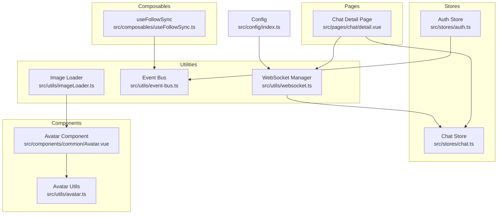
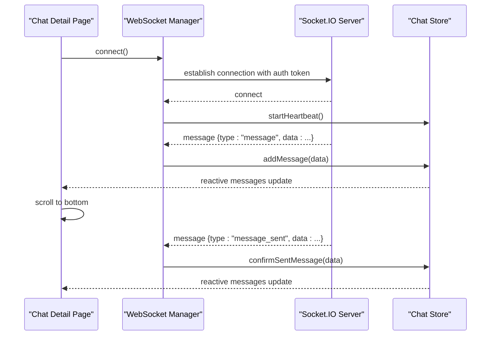
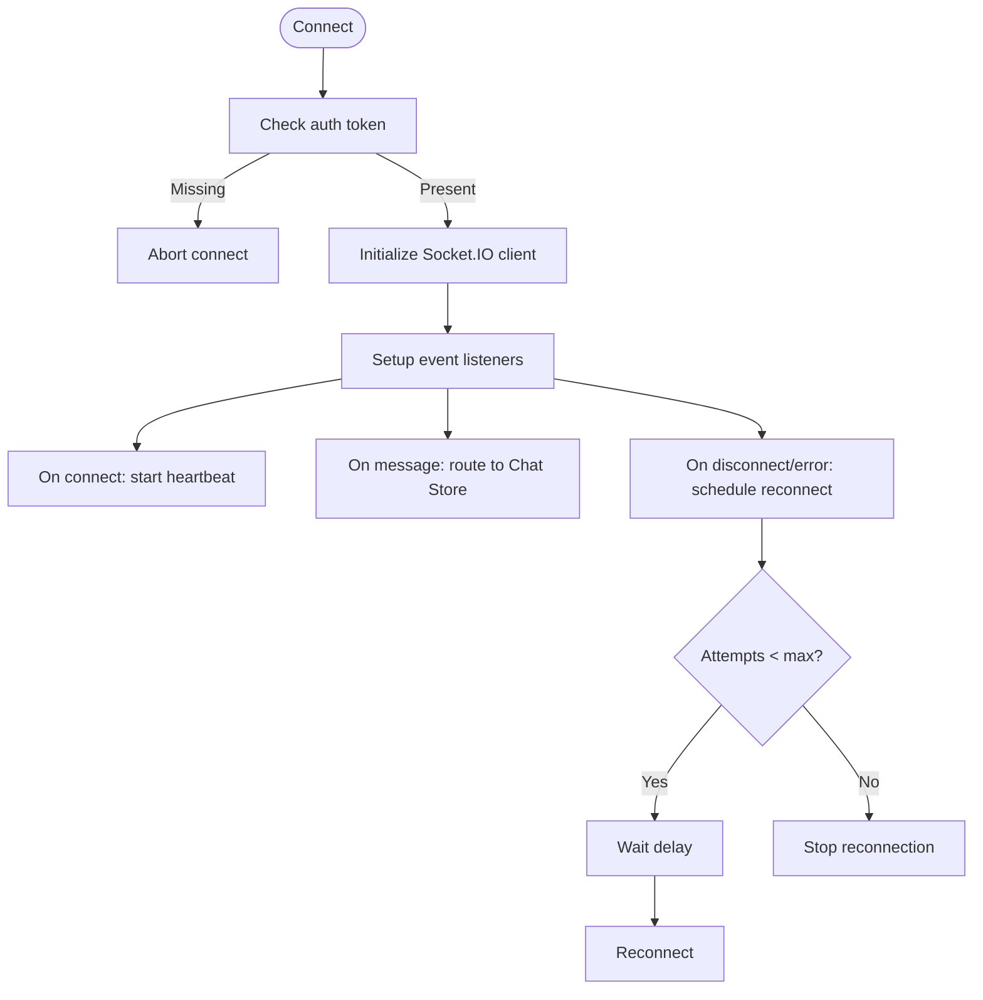
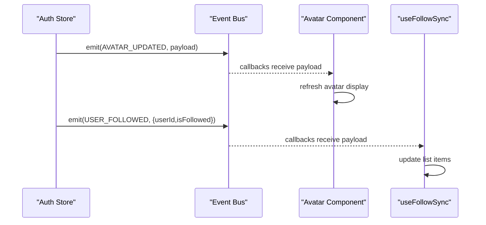
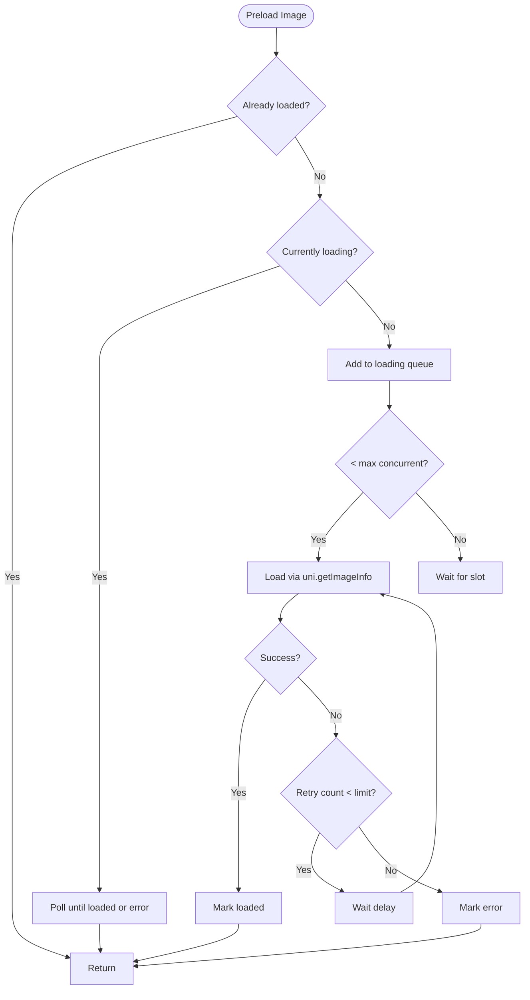
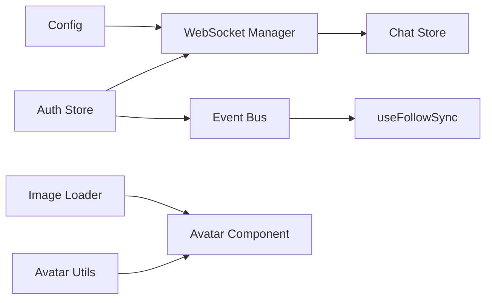

# Communication Utilities

<cite>
**Referenced Files in This Document**
- [websocket.ts](file://src/utils/websocket.ts)
- [event-bus.ts](file://src/utils/event-bus.ts)
- [imageLoader.ts](file://src/utils/imageLoader.ts)
- [index.ts](file://src/utils/index.ts)
- [config/index.ts](file://src/config/index.ts)
- [chat.ts](file://src/stores/chat.ts)
- [auth.ts](file://src/stores/auth.ts)
- [detail.vue](file://src/pages/chat/detail.vue)
- [useFollowSync.ts](file://src/composables/useFollowSync.ts)
- [Avatar.vue](file://src/components/common/Avatar.vue)
- [avatar.ts](file://src/utils/avatar.ts)
</cite>

## Table of Contents
1. [Introduction](#introduction)
2. [Project Structure](#project-structure)
3. [Core Components](#core-components)
4. [Architecture Overview](#architecture-overview)
5. [Detailed Component Analysis](#detailed-component-analysis)
6. [Dependency Analysis](#dependency-analysis)
7. [Performance Considerations](#performance-considerations)
8. [Troubleshooting Guide](#troubleshooting-guide)
9. [Conclusion](#conclusion)

## Introduction
This document explains the communication utilities that power real-time and media experiences in the WeTogether platform. It covers:
- WebSocket utility for real-time bidirectional messaging and connection resilience
- Event bus for decoupled component communication
- Image loader for optimized media loading with preloading, retries, and progressive loading

It details connection management, message handling, error recovery, event-driven patterns, serialization considerations, and performance optimizations. Practical examples show how to implement real-time chat, subscribe to events, and optimize image loading across the app.

## Project Structure
The communication utilities live under src/utils and integrate with stores, pages, composables, and components:
- WebSocket manager connects via Socket.IO and handles heartbeats and reconnections
- Event bus enables cross-component communication without tight coupling
- Image loader provides lazy/preload strategies and progressive loading

**Diagram sources**
- [websocket.ts:1-171](file://src/utils/websocket.ts#L1-L171)
- [event-bus.ts:1-49](file://src/utils/event-bus.ts#L1-L49)
- [imageLoader.ts:1-354](file://src/utils/imageLoader.ts#L1-L354)
- [chat.ts:1-234](file://src/stores/chat.ts#L1-L234)
- [auth.ts:1-137](file://src/stores/auth.ts#L1-L137)
- [detail.vue:90-289](file://src/pages/chat/detail.vue#L90-L289)
- [useFollowSync.ts:1-57](file://src/composables/useFollowSync.ts#L1-L57)
- [Avatar.vue:1-95](file://src/components/common/Avatar.vue#L1-L95)
- [avatar.ts:1-93](file://src/utils/avatar.ts#L1-L93)
- [config/index.ts:1-11](file://src/config/index.ts#L1-L11)

**Section sources**
- [websocket.ts:1-171](file://src/utils/websocket.ts#L1-L171)
- [event-bus.ts:1-49](file://src/utils/event-bus.ts#L1-L49)
- [imageLoader.ts:1-354](file://src/utils/imageLoader.ts#L1-L354)
- [config/index.ts:1-11](file://src/config/index.ts#L1-L11)

## Core Components
- WebSocket Manager: Establishes and maintains a Socket.IO connection, manages heartbeats, handles reconnection attempts, and routes incoming messages to the chat store.
- Event Bus: A lightweight pub/sub mechanism enabling cross-component updates (e.g., avatar changes, follow actions).
- Image Loader: Provides concurrent preloading, retry logic, progressive loading, and strategies for preloading near or upcoming images.

Key integration points:
- Chat page initializes the WebSocket connection and reacts to message updates.
- Auth store emits avatar-related events consumed by components and composables.
- Image loader integrates with components to improve perceived performance and reduce jank.

**Section sources**
- [websocket.ts:6-171](file://src/utils/websocket.ts#L6-L171)
- [event-bus.ts:6-49](file://src/utils/event-bus.ts#L6-L49)
- [imageLoader.ts:26-177](file://src/utils/imageLoader.ts#L26-L177)
- [detail.vue:90-148](file://src/pages/chat/detail.vue#L90-L148)
- [auth.ts:79-117](file://src/stores/auth.ts#L79-L117)

## Architecture Overview
The system follows an event-driven architecture:
- Real-time: WebSocket Manager listens for server events and dispatches to the Chat Store
- Component communication: Event Bus decouples components and stores
- Media: Image Loader optimizes rendering and reduces layout shifts

**Diagram sources**
- [websocket.ts:15-111](file://src/utils/websocket.ts#L15-L111)
- [chat.ts:100-210](file://src/stores/chat.ts#L100-L210)
- [detail.vue:90-148](file://src/pages/chat/detail.vue#L90-L148)

## Detailed Component Analysis

### WebSocket Utility
Responsibilities:
- Connect via Socket.IO with token-based auth and polling fallback
- Manage connection lifecycle: connect, disconnect, heartbeat, and reconnection
- Route server messages to the Chat Store for UI updates

Connection management:
- Uses API configuration for base URL and WebSocket path
- Enforces single connection state and guards against redundant connections
- Emits ping/pong heartbeats to keep the channel alive

Message handling:
- Supports structured messages with type/data and legacy direct message objects
- De-duplicates messages and updates conversation unread counts
- Optimistically renders outgoing messages and replaces them upon server confirmation

Recovery and resilience:
- Automatic reconnection with capped attempts and delays
- Heartbeat stops on disconnect and restarts after reconnect
- Graceful handling of connect_error and disconnect events

**Diagram sources**
- [websocket.ts:15-141](file://src/utils/websocket.ts#L15-L141)

**Section sources**
- [websocket.ts:15-171](file://src/utils/websocket.ts#L15-L171)
- [config/index.ts:1-11](file://src/config/index.ts#L1-11)
- [chat.ts:100-210](file://src/stores/chat.ts#L100-L210)

### Event Bus
Responsibilities:
- Subscribe and unsubscribe to named events
- Emit events to all registered callbacks
- Clear all subscriptions

Usage patterns:
- Auth store emits avatar updates after profile changes
- Composables like useFollowSync listen for follow/unfollow events and update lists reactively

**Diagram sources**
- [auth.ts:79-117](file://src/stores/auth.ts#L79-L117)
- [event-bus.ts:6-36](file://src/utils/event-bus.ts#L6-L36)
- [useFollowSync.ts:13-56](file://src/composables/useFollowSync.ts#L13-L56)
- [Avatar.vue:17-42](file://src/components/common/Avatar.vue#L17-L42)

**Section sources**
- [event-bus.ts:6-49](file://src/utils/event-bus.ts#L6-L49)
- [auth.ts:79-117](file://src/stores/auth.ts#L79-L117)
- [useFollowSync.ts:13-56](file://src/composables/useFollowSync.ts#L13-L56)
- [Avatar.vue:17-42](file://src/components/common/Avatar.vue#L17-L42)

### Image Loader
Responsibilities:
- Preload images with concurrency limits and retry logic
- Provide status-aware image selection (placeholder, error fallback)
- Support progressive loading (low-quality then high-quality)
- Offer strategies to preload images near the viewport or upcoming pages

Concurrency and retries:
- Limits concurrent loads to avoid overwhelming the runtime
- Retries on failure with exponential backoff-like delays
- Caches statuses per URL to avoid repeated work

Progressive loading:
- Renders a low-quality preview immediately, then swaps to high-quality after preload

Preload strategies:
- Preload next page’s images
- Preload images around currently visible items

**Diagram sources**
- [imageLoader.ts:50-154](file://src/utils/imageLoader.ts#L50-L154)

**Section sources**
- [imageLoader.ts:26-177](file://src/utils/imageLoader.ts#L26-L177)
- [imageLoader.ts:197-246](file://src/utils/imageLoader.ts#L197-L246)
- [imageLoader.ts:258-284](file://src/utils/imageLoader.ts#L258-L284)
- [imageLoader.ts:289-353](file://src/utils/imageLoader.ts#L289-L353)

## Dependency Analysis
- WebSocket Manager depends on:
  - Config for endpoint URLs
  - Auth Store for token retrieval
  - Chat Store for message routing
- Chat Store depends on:
  - Auth Store for user identity
  - API module for persistence
- Event Bus is used by:
  - Auth Store for avatar updates
  - Composables for cross-page synchronization
- Image Loader integrates with:
  - Components for rendering
  - Strategies for prefetching

**Diagram sources**
- [config/index.ts:1-11](file://src/config/index.ts#L1-L11)
- [websocket.ts:23-24](file://src/utils/websocket.ts#L23-L24)
- [chat.ts:100-210](file://src/stores/chat.ts#L100-L210)
- [auth.ts:79-117](file://src/stores/auth.ts#L79-L117)
- [useFollowSync.ts:13-56](file://src/composables/useFollowSync.ts#L13-L56)
- [imageLoader.ts:26-177](file://src/utils/imageLoader.ts#L26-L177)
- [Avatar.vue:17-42](file://src/components/common/Avatar.vue#L17-L42)
- [avatar.ts:53-92](file://src/utils/avatar.ts#L53-L92)

**Section sources**
- [index.ts:1-5](file://src/utils/index.ts#L1-L5)
- [websocket.ts:1-4](file://src/utils/websocket.ts#L1-L4)
- [chat.ts:1-6](file://src/stores/chat.ts#L1-L6)
- [auth.ts:1-7](file://src/stores/auth.ts#L1-L7)

## Performance Considerations
- WebSocket
  - Heartbeat keeps the connection warm and detects liveness
  - Reconnection attempts are capped to prevent resource exhaustion
  - Polling transport fallback ensures connectivity across networks
- Event Bus
  - Minimal coupling reduces cascade updates and improves maintainability
- Image Loader
  - Concurrency limit prevents thrashing the runtime
  - Retry with backoff avoids thundering herds on transient failures
  - Progressive loading improves perceived performance
  - Preload strategies anticipate user navigation to minimize stalls

[No sources needed since this section provides general guidance]

## Troubleshooting Guide
Common issues and remedies:
- WebSocket not connecting
  - Verify token availability in storage or Auth Store
  - Confirm wsURL in Config matches backend deployment
  - Check network policies allowing WebSocket and polling
- Messages not appearing
  - Ensure Chat Store receives and de-duplicates messages
  - Confirm current chat context matches the message participants
- Reconnection loops
  - Inspect reconnect attempts and delays; adjust max attempts if needed
  - Validate server-side keepalive and heartbeat handling
- Image flicker or reloads
  - Use Image Loader’s status-aware selection to avoid empty renders
  - Apply progressive loading for large images
  - Preload images near the viewport to smooth transitions

**Section sources**
- [websocket.ts:28-32](file://src/utils/websocket.ts#L28-L32)
- [websocket.ts:128-141](file://src/utils/websocket.ts#L128-L141)
- [chat.ts:117-158](file://src/stores/chat.ts#L117-L158)
- [imageLoader.ts:218-239](file://src/utils/imageLoader.ts#L218-L239)
- [imageLoader.ts:258-284](file://src/utils/imageLoader.ts#L258-L284)

## Conclusion
The WeTogether platform leverages a robust set of communication utilities:
- WebSocket Manager delivers reliable real-time messaging with resilient connection handling
- Event Bus enables scalable, decoupled component interactions
- Image Loader optimizes media delivery with concurrency control, retries, and progressive rendering

These utilities collectively support responsive UIs, smooth user experiences, and maintainable architecture across the platform.