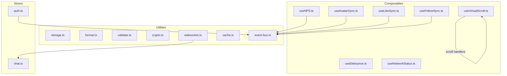
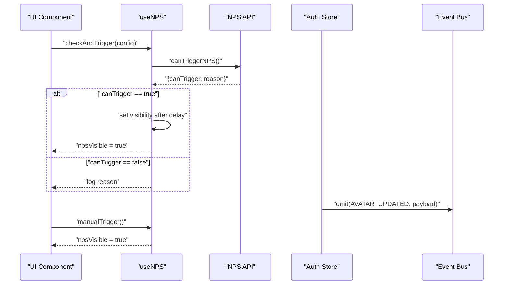
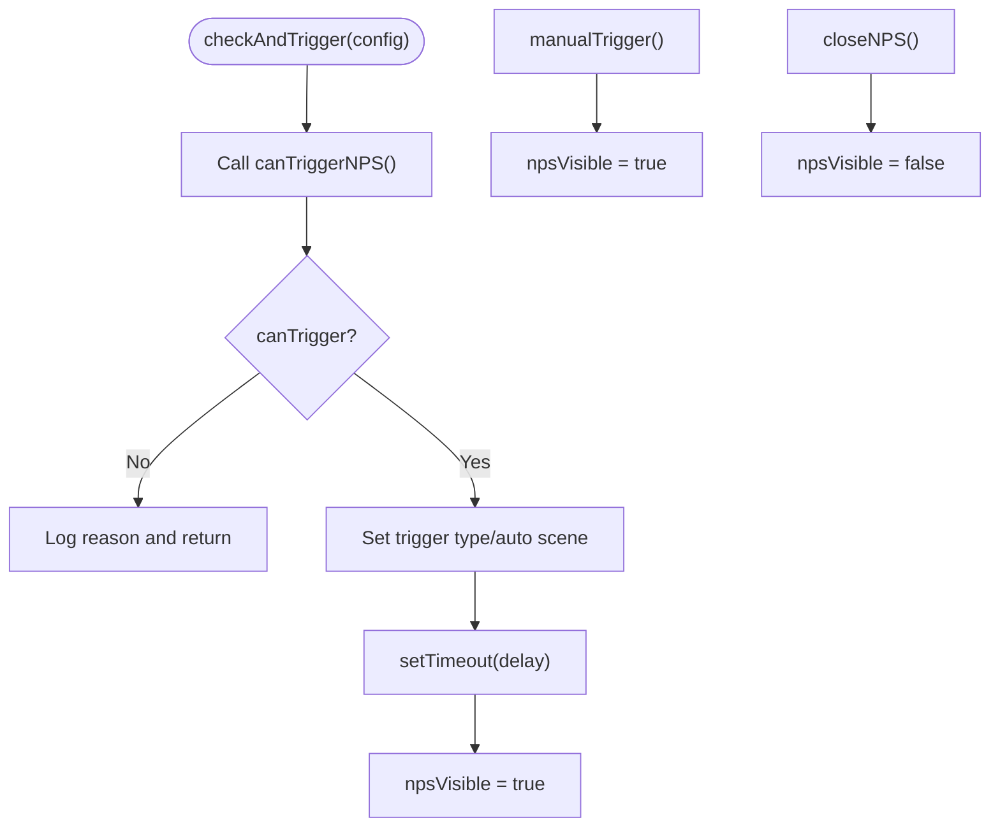
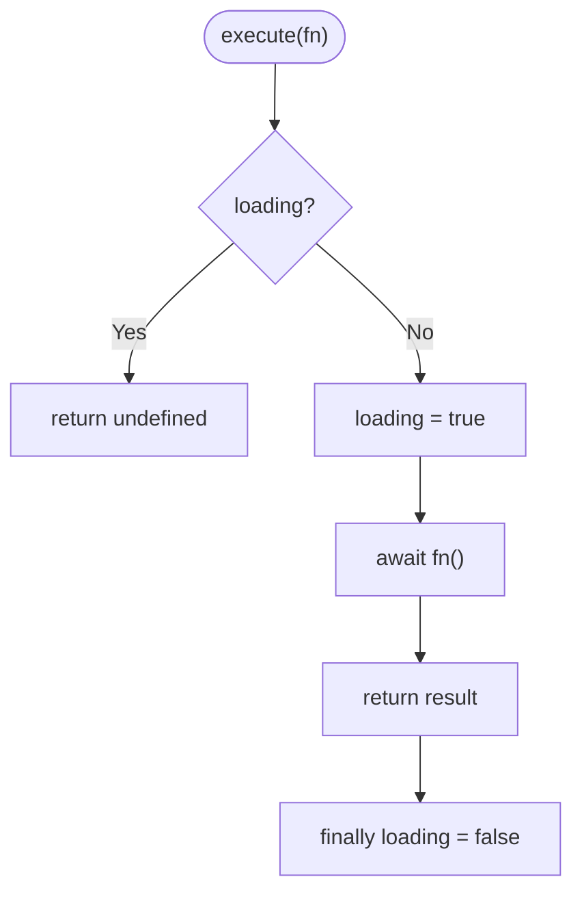
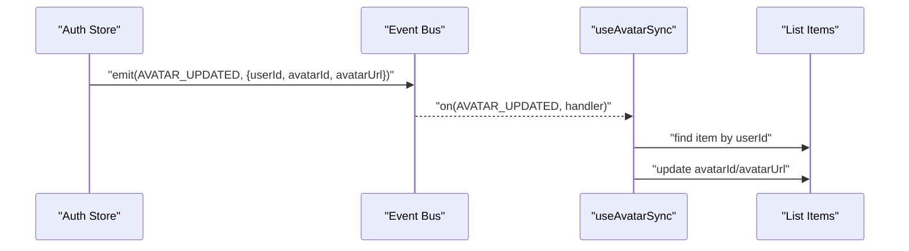
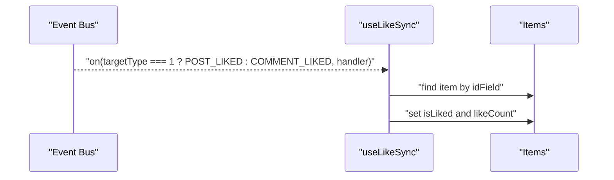
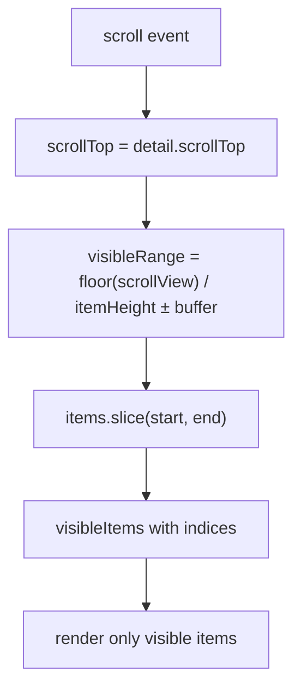
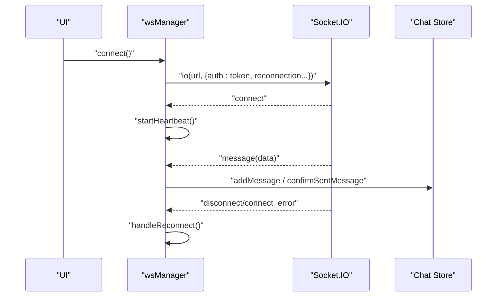
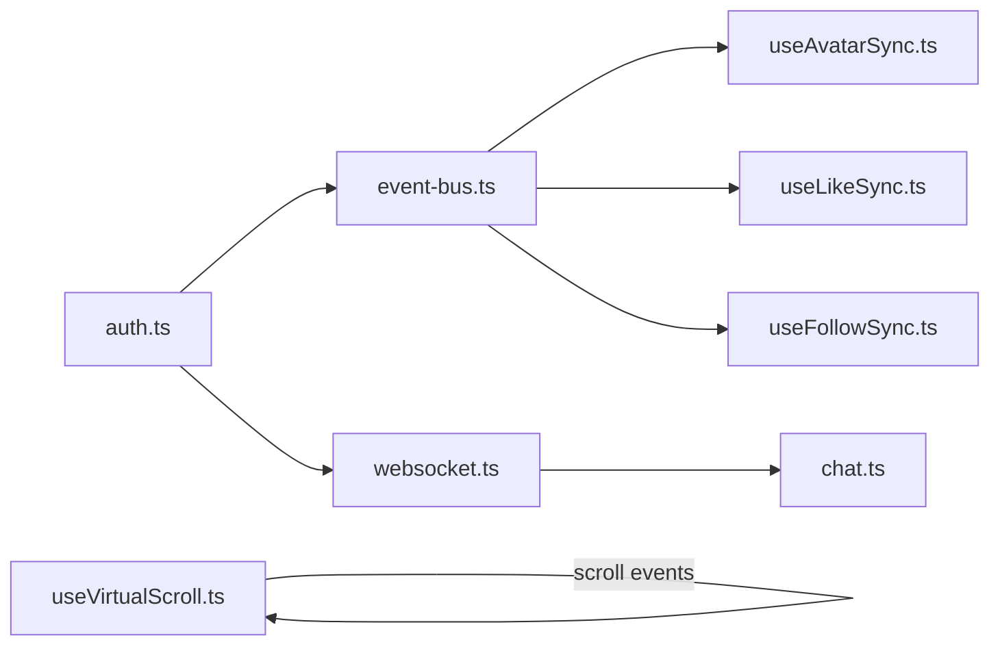

# Composables & Utilities

<cite>
**Referenced Files in This Document**
- [useNPS.ts](file://src/composables/useNPS.ts)
- [useDebounce.ts](file://src/composables/useDebounce.ts)
- [useAvatarSync.ts](file://src/composables/useAvatarSync.ts)
- [useLikeSync.ts](file://src/composables/useLikeSync.ts)
- [useFollowSync.ts](file://src/composables/useFollowSync.ts)
- [useNetworkStatus.ts](file://src/composables/useNetworkStatus.ts)
- [useVirtualScroll.ts](file://src/composables/useVirtualScroll.ts)
- [storage.ts](file://src/utils/storage.ts)
- [format.ts](file://src/utils/format.ts)
- [validate.ts](file://src/utils/validate.ts)
- [crypto.ts](file://src/utils/crypto.ts)
- [websocket.ts](file://src/utils/websocket.ts)
- [cache.ts](file://src/utils/cache.ts)
- [event-bus.ts](file://src/utils/event-bus.ts)
- [auth.ts](file://src/stores/auth.ts)
- [chat.ts](file://src/stores/chat.ts)
</cite>

## Table of Contents
1. [Introduction](#introduction)
2. [Project Structure](#project-structure)
3. [Core Components](#core-components)
4. [Architecture Overview](#architecture-overview)
5. [Detailed Component Analysis](#detailed-component-analysis)
6. [Dependency Analysis](#dependency-analysis)
7. [Performance Considerations](#performance-considerations)
8. [Troubleshooting Guide](#troubleshooting-guide)
9. [Conclusion](#conclusion)
10. [Appendices](#appendices)

## Introduction
This document provides comprehensive documentation for the WeTogether platform’s reusable composables and utilities. It covers:
- NPS tracking composables and triggers
- Debounce utilities for safe, rate-limited actions
- Avatar, like, and follow synchronization via event bus
- Network status monitoring with toast feedback
- Virtual scrolling for large lists (fixed and dynamic heights)
- Storage management, data formatting, validation, cryptography, and WebSocket handling
- Patterns, parameters, return values, usage examples, and best practices
- Performance, memory, and cross-platform compatibility guidance

## Project Structure
The relevant code is organized into:
- Composables under src/composables for reactive, reusable logic
- Utilities under src/utils for storage, formatting, validation, cryptography, caching, and WebSocket
- Stores under src/stores for global state (auth, chat, etc.)
- Event bus under src/utils/event-bus.ts for inter-component communication

**Diagram sources**
- [useNPS.ts:13-77](file://src/composables/useNPS.ts#L13-L77)
- [useDebounce.ts:18-45](file://src/composables/useDebounce.ts#L18-L45)
- [useAvatarSync.ts:9-71](file://src/composables/useAvatarSync.ts#L9-L71)
- [useLikeSync.ts:16-48](file://src/composables/useLikeSync.ts#L16-L48)
- [useFollowSync.ts:13-56](file://src/composables/useFollowSync.ts#L13-L56)
- [useNetworkStatus.ts:3-61](file://src/composables/useNetworkStatus.ts#L3-L61)
- [useVirtualScroll.ts:15-79](file://src/composables/useVirtualScroll.ts#L15-L79)
- [storage.ts:1-26](file://src/utils/storage.ts#L1-L26)
- [format.ts:1-38](file://src/utils/format.ts#L1-L38)
- [validate.ts:1-15](file://src/utils/validate.ts#L1-L15)
- [crypto.ts:8-17](file://src/utils/crypto.ts#L8-L17)
- [websocket.ts:6-171](file://src/utils/websocket.ts#L6-L171)
- [cache.ts:20-318](file://src/utils/cache.ts#L20-L318)
- [event-bus.ts:6-49](file://src/utils/event-bus.ts#L6-L49)
- [auth.ts:79-117](file://src/stores/auth.ts#L79-L117)
- [chat.ts:100-210](file://src/stores/chat.ts#L100-L210)

**Section sources**
- [useNPS.ts:13-145](file://src/composables/useNPS.ts#L13-L145)
- [useDebounce.ts:18-153](file://src/composables/useDebounce.ts#L18-L153)
- [useAvatarSync.ts:9-71](file://src/composables/useAvatarSync.ts#L9-L71)
- [useLikeSync.ts:16-48](file://src/composables/useLikeSync.ts#L16-L48)
- [useFollowSync.ts:13-56](file://src/composables/useFollowSync.ts#L13-L56)
- [useNetworkStatus.ts:3-61](file://src/composables/useNetworkStatus.ts#L3-L61)
- [useVirtualScroll.ts:15-246](file://src/composables/useVirtualScroll.ts#L15-L246)
- [storage.ts:1-26](file://src/utils/storage.ts#L1-L26)
- [format.ts:1-38](file://src/utils/format.ts#L1-L38)
- [validate.ts:1-15](file://src/utils/validate.ts#L1-L15)
- [crypto.ts:8-17](file://src/utils/crypto.ts#L8-L17)
- [websocket.ts:6-171](file://src/utils/websocket.ts#L6-L171)
- [cache.ts:20-359](file://src/utils/cache.ts#L20-L359)
- [event-bus.ts:6-49](file://src/utils/event-bus.ts#L6-L49)
- [auth.ts:79-117](file://src/stores/auth.ts#L79-L117)
- [chat.ts:100-210](file://src/stores/chat.ts#L100-L210)

## Core Components
This section summarizes each composable/utility and its primary responsibilities.

- useNPS
  - Purpose: Check eligibility and show NPS modal with auto/manual triggers and delayed display.
  - Key exports: refs for visibility and trigger metadata, plus trigger/close/success helpers.
  - Triggers: periodic, after registration, after first post, after adding friends, after active week.
- useDebounce
  - Purpose: Prevent duplicate submissions and manage loading states.
  - Variants: basic, button text switching, countdown with cooldown.
- useAvatarSync
  - Purpose: Synchronize avatar updates across lists via event bus.
  - Options: customize field names and nested user object support.
- useLikeSync
  - Purpose: Keep like state consistent across views for posts or comments.
- useFollowSync
  - Purpose: Keep follow state consistent across views for user profiles.
- useNetworkStatus
  - Purpose: Monitor online/offline state, network type, and guard actions.
- useVirtualScroll
  - Purpose: Render only visible items for large lists; fixed-height and dynamic-height variants.
  - Helpers: measure item height and scroll-to-index utilities.

**Section sources**
- [useNPS.ts:13-145](file://src/composables/useNPS.ts#L13-L145)
- [useDebounce.ts:18-153](file://src/composables/useDebounce.ts#L18-L153)
- [useAvatarSync.ts:9-71](file://src/composables/useAvatarSync.ts#L9-L71)
- [useLikeSync.ts:16-48](file://src/composables/useLikeSync.ts#L16-L48)
- [useFollowSync.ts:13-56](file://src/composables/useFollowSync.ts#L13-L56)
- [useNetworkStatus.ts:3-61](file://src/composables/useNetworkStatus.ts#L3-L61)
- [useVirtualScroll.ts:15-246](file://src/composables/useVirtualScroll.ts#L15-L246)

## Architecture Overview
The composables integrate with utilities and stores to form a cohesive reactive ecosystem:
- Event-driven updates: Avatar/Like/Follow sync rely on a central event bus.
- Global state: Auth and Chat stores coordinate with event bus and WebSocket manager.
- UI performance: Virtual scroll reduces DOM workloads.
- Reliability: Debounce utilities prevent redundant operations; network status guards actions.

**Diagram sources**
- [useNPS.ts:18-76](file://src/composables/useNPS.ts#L18-L76)
- [auth.ts:82-87](file://src/stores/auth.ts#L82-L87)
- [event-bus.ts:26-31](file://src/utils/event-bus.ts#L26-L31)

## Detailed Component Analysis

### useNPS
- Parameters
  - config: NPSTriggerConfig with scene and optional delay.
- Returns
  - Reactive refs: npsVisible, npsTriggerType, npsTriggerScene.
  - Methods: checkAndTrigger, manualTrigger, closeNPS, onNPSSuccess.
- Implementation highlights
  - Asks backend whether NPS can be shown; if eligible, sets visibility after a configurable delay.
  - Supports manual override and centralized success feedback.
- Usage patterns
  - Call periodic checks on home page load.
  - Trigger after specific user actions (register, first post, add friend, weekly activity).
- Best practices
  - Use delay to avoid interrupting user flow.
  - Respect reasons returned by backend to avoid repeated prompts.

**Diagram sources**
- [useNPS.ts:18-54](file://src/composables/useNPS.ts#L18-L54)

**Section sources**
- [useNPS.ts:4-145](file://src/composables/useNPS.ts#L4-L145)

### useDebounce
- Parameters
  - Basic: none; returns loading and execute.
  - Button variant: defaultText, loadingText.
  - Countdown variant: countdown seconds, defaultText.
- Returns
  - Basic: { loading, execute }.
  - Button: { loading, buttonText, execute }.
  - Countdown: { loading, counting, remainingTime, buttonText, canExecute, execute }.
- Implementation highlights
  - execute prevents concurrent runs; countdown variant manages a cooldown timer.
- Usage patterns
  - Wrap submit/send actions; disable buttons while loading; show countdown after success.

**Diagram sources**
- [useDebounce.ts:26-39](file://src/composables/useDebounce.ts#L26-L39)

**Section sources**
- [useDebounce.ts:18-153](file://src/composables/useDebounce.ts#L18-L153)

### useAvatarSync
- Parameters
  - dataList: reactive array or object with list property.
  - options: userIdField, avatarIdField, avatarUrlField, nestedUserField.
- Returns
  - Method handleAvatarUpdate and lifecycle bindings.
- Implementation highlights
  - Listens to AVATAR_UPDATED; updates matching items by userId; supports nested user objects.
- Usage patterns
  - Apply to user lists, post feeds, or comment lists to keep avatars fresh.

**Diagram sources**
- [auth.ts:82-87](file://src/stores/auth.ts#L82-L87)
- [event-bus.ts:41-48](file://src/utils/event-bus.ts#L41-L48)
- [useAvatarSync.ts:27-58](file://src/composables/useAvatarSync.ts#L27-L58)

**Section sources**
- [useAvatarSync.ts:9-71](file://src/composables/useAvatarSync.ts#L9-L71)

### useLikeSync
- Parameters
  - items: reactive list or paginated object.
  - options: targetType (1=post, 2=comment), idField.
- Returns
  - Registers/unregisters listeners on mount/unmount.
- Implementation highlights
  - Filters by targetType and updates isLiked and likeCount for matching items.

**Diagram sources**
- [event-bus.ts:44-45](file://src/utils/event-bus.ts#L44-L45)
- [useLikeSync.ts:25-37](file://src/composables/useLikeSync.ts#L25-L37)

**Section sources**
- [useLikeSync.ts:16-48](file://src/composables/useLikeSync.ts#L16-L48)

### useFollowSync
- Parameters
  - items: reactive list or paginated object.
  - options: userIdField, nestedUserField.
- Returns
  - Registers/unregisters USER_FOLLOWED/USER_UNFOLLOWED listeners.
- Implementation highlights
  - Updates isFollowed on matching items, supporting nested user objects.

**Section sources**
- [useFollowSync.ts:13-56](file://src/composables/useFollowSync.ts#L13-L56)

### useNetworkStatus
- Parameters
  - None.
- Returns
  - isOnline, networkType, checkBeforeAction(actionName).
- Implementation highlights
  - Uses uni.getNetworkType and uni.onNetworkStatusChange; shows toasts on change; guards actions.

**Section sources**
- [useNetworkStatus.ts:3-61](file://src/composables/useNetworkStatus.ts#L3-L61)

### useVirtualScroll
- Fixed-height variant
  - Parameters: items (Ref<T[]>), options.itemHeight, bufferSize, containerHeight.
  - Returns: visibleItems, totalHeight, offsetY, handleScroll, visibleRange.
  - Notes: measures container height after mount; computes visible range based on scrollTop and buffer.
- Dynamic-height variant
  - Parameters: items (Ref<T[]>), options.estimatedItemHeight, bufferSize, containerHeight.
  - Returns: same as fixed-height plus updateItemHeight.
  - Notes: maintains itemHeights and itemOffsets maps; binary search to locate start index.
- Helpers
  - createVirtualScrollHelpers: measureItemHeight, scrollToIndex.

**Diagram sources**
- [useVirtualScroll.ts:52-43](file://src/composables/useVirtualScroll.ts#L52-L43)

**Section sources**
- [useVirtualScroll.ts:15-246](file://src/composables/useVirtualScroll.ts#L15-L246)

### Storage Management
- storage.get/set/remove/clear
  - Wraps uni.get/set/remove/clearStorageSync with JSON serialization/deserialization.
  - Robust against parse errors.

**Section sources**
- [storage.ts:1-26](file://src/utils/storage.ts#L1-L26)

### Data Formatting
- formatTime: human-friendly time display (today/yesterday/local weekday/short date).
- formatRelativeTime: relative time via dayjs.
- formatDateTime/formatDate: ISO-like or date-only strings.

**Section sources**
- [format.ts:8-38](file://src/utils/format.ts#L8-L38)

### Validation
- validateMobile, validatePassword, validateCode, validateNickname
  - Regex-based validations for mobile, password length, 6-digit code, nickname length.

**Section sources**
- [validate.ts:1-15](file://src/utils/validate.ts#L1-L15)

### Cryptography
- CryptoUtil.encryptPassword
  - SHA256 hashing for password pre-hashing before transport.

**Section sources**
- [crypto.ts:8-17](file://src/utils/crypto.ts#L8-L17)

### WebSocket Handling
- WebSocketManager
  - Connects via Socket.IO with token auth, automatic reconnection, heartbeat ping/pong, and robust error handling.
  - Handles incoming messages and dispatches to chat store for optimistic UI updates.
- Usage
  - Import wsManager and call connect/disconnect; use send(event, data) to emit.

**Diagram sources**
- [websocket.ts:15-171](file://src/utils/websocket.ts#L15-L171)
- [chat.ts:100-210](file://src/stores/chat.ts#L100-L210)

**Section sources**
- [websocket.ts:6-171](file://src/utils/websocket.ts#L6-L171)

### Caching Utilities
- MemoryCache
  - In-memory LRU-like cache with expiration and max size.
- StorageCache
  - Persistent cache using uni storage with prefix and expiration.
- CacheManager
  - Singleton accessors for memory and storage caches; clearExpired and clearAll.
- Constants
  - CACHE_KEYS and CACHE_EXPIRE_TIME for standardized cache keys and TTLs.

**Section sources**
- [cache.ts:20-359](file://src/utils/cache.ts#L20-L359)

## Dependency Analysis
- Event-driven synchronization
  - useAvatarSync, useLikeSync, useFollowSync depend on event-bus EVENTS and emit from auth store.
- WebSocket and chat
  - wsManager depends on auth token and emits to chat store.
- Virtual scroll
  - Purely UI; depends on container queries and scroll events.

**Diagram sources**
- [auth.ts:82-87](file://src/stores/auth.ts#L82-L87)
- [event-bus.ts:41-48](file://src/utils/event-bus.ts#L41-L48)
- [useAvatarSync.ts:60-66](file://src/composables/useAvatarSync.ts#L60-L66)
- [useLikeSync.ts:39-42](file://src/composables/useLikeSync.ts#L39-L42)
- [useFollowSync.ts:47-50](file://src/composables/useFollowSync.ts#L47-L50)
- [websocket.ts:23-24](file://src/utils/websocket.ts#L23-L24)
- [chat.ts:100-210](file://src/stores/chat.ts#L100-L210)
- [useVirtualScroll.ts:59-70](file://src/composables/useVirtualScroll.ts#L59-L70)

**Section sources**
- [auth.ts:79-117](file://src/stores/auth.ts#L79-L117)
- [event-bus.ts:6-49](file://src/utils/event-bus.ts#L6-L49)
- [useAvatarSync.ts:9-71](file://src/composables/useAvatarSync.ts#L9-L71)
- [useLikeSync.ts:16-48](file://src/composables/useLikeSync.ts#L16-L48)
- [useFollowSync.ts:13-56](file://src/composables/useFollowSync.ts#L13-L56)
- [websocket.ts:6-171](file://src/utils/websocket.ts#L6-L171)
- [chat.ts:100-210](file://src/stores/chat.ts#L100-L210)
- [useVirtualScroll.ts:15-79](file://src/composables/useVirtualScroll.ts#L15-L79)

## Performance Considerations
- Virtual scrolling
  - Prefer fixed-height variant for large lists when possible; dynamic variant adds O(n) offset computation overhead.
  - Tune bufferSize to balance rendering smoothness vs. memory usage.
- Debounce
  - Use countdown variant for rate-limited actions (e.g., sending verification codes) to reduce server load.
- Event-driven updates
  - Limit listener registrations; ensure cleanup on unmount to avoid memory leaks.
- Caching
  - Use MemoryCache for short-lived UI data; StorageCache for persisted data with appropriate TTLs.
- Network checks
  - Use checkBeforeAction to prevent unnecessary requests when offline.

[No sources needed since this section provides general guidance]

## Troubleshooting Guide
- NPS does not appear
  - Verify backend response and reason logging; ensure delay is sufficient and visibility is toggled.
- Avatar/Like/Follow not updating
  - Confirm event bus listeners are registered and payload matches userId/id fields.
- Network toast spam
  - Ensure checkBeforeAction is called before actions; avoid repeated checks.
- WebSocket not connecting
  - Confirm token availability; inspect connect_error logs; verify reconnection attempts.
- Virtual scroll flicker or misalignment
  - Ensure container has a measured height; verify item heights match computed offsets.

**Section sources**
- [useNPS.ts:35-37](file://src/composables/useNPS.ts#L35-L37)
- [useAvatarSync.ts:60-66](file://src/composables/useAvatarSync.ts#L60-L66)
- [useLikeSync.ts:39-42](file://src/composables/useLikeSync.ts#L39-L42)
- [useFollowSync.ts:47-50](file://src/composables/useFollowSync.ts#L47-L50)
- [useNetworkStatus.ts:35-45](file://src/composables/useNetworkStatus.ts#L35-L45)
- [websocket.ts:28-32](file://src/utils/websocket.ts#L28-L32)
- [useVirtualScroll.ts:59-70](file://src/composables/useVirtualScroll.ts#L59-L70)

## Conclusion
These composables and utilities provide a robust foundation for building responsive, reliable, and scalable features in the WeTogether platform. By leveraging event-driven updates, virtual scrolling, debounced actions, and structured caching, developers can deliver smooth user experiences while maintaining clean separation of concerns.

[No sources needed since this section summarizes without analyzing specific files]

## Appendices

### Creating Custom Composables and Extending Utilities
- Follow Vue’s composable pattern: expose reactive refs and functions; manage lifecycle with onMounted/onUnmounted.
- Encapsulate cross-cutting concerns (debounce, network checks, virtual scroll) into reusable units.
- Use Pinia stores for global state and emit events via EventBus for decoupled updates.
- Add TypeScript interfaces for options and payloads to improve developer experience.
- Keep utilities pure where possible; delegate side effects (network, storage) to dedicated modules.

[No sources needed since this section provides general guidance]

### Cross-Platform Compatibility
- Uni-app APIs (uni.getNetworkType, uni.onNetworkStatusChange, uni.createSelectorQuery, uni.pageScrollTo) are used consistently; ensure platform-specific behavior is tested.
- WebSocket uses Socket.IO client; verify transport compatibility across environments.
- Virtual scroll relies on selector queries and scroll events; test on various screen sizes and devices.

[No sources needed since this section provides general guidance]