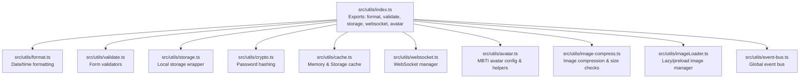
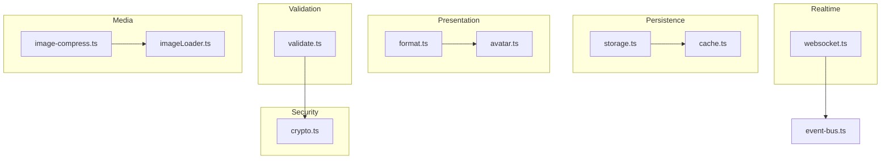
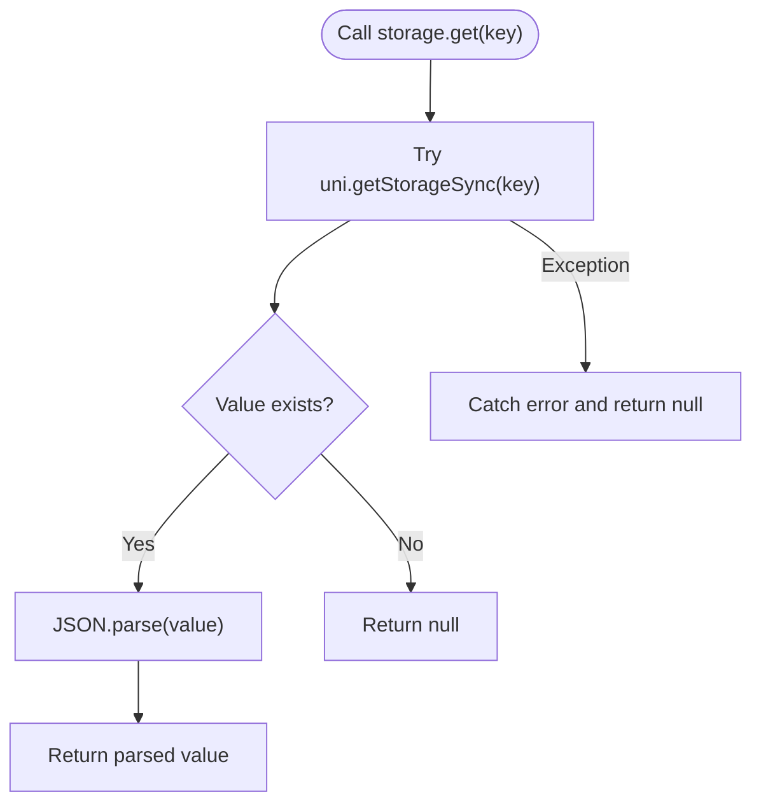
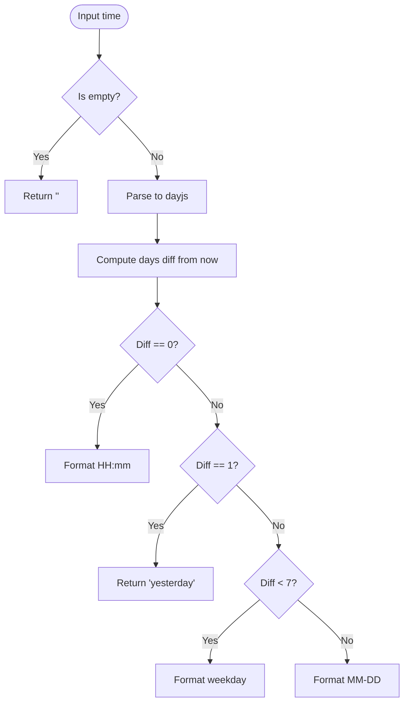
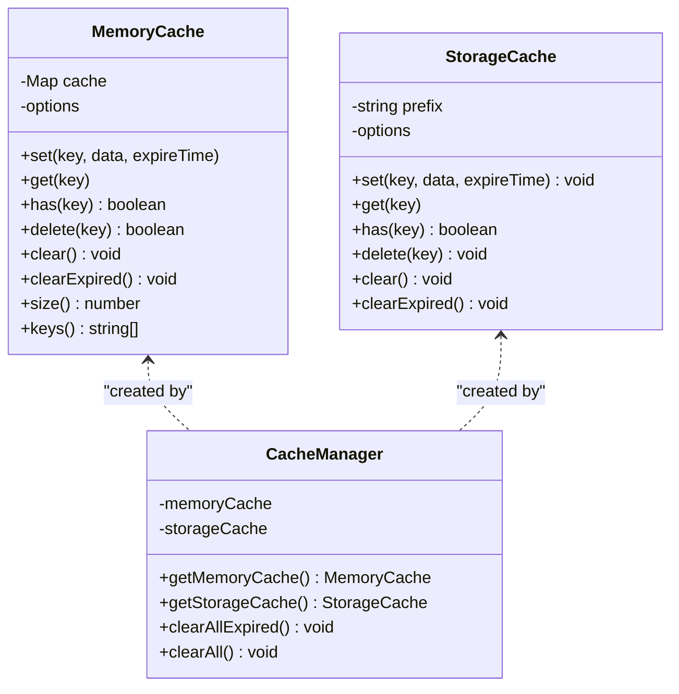
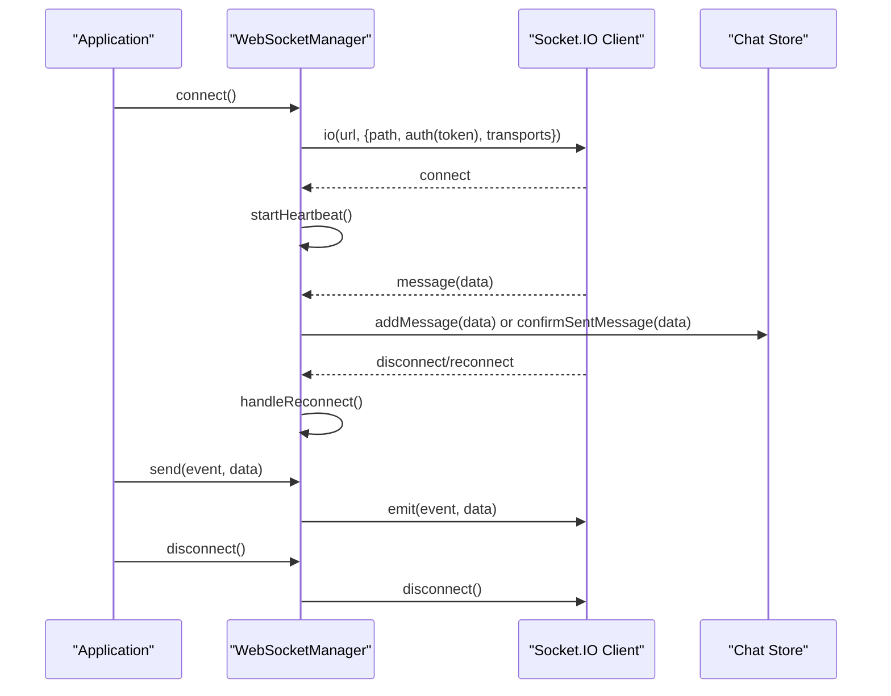
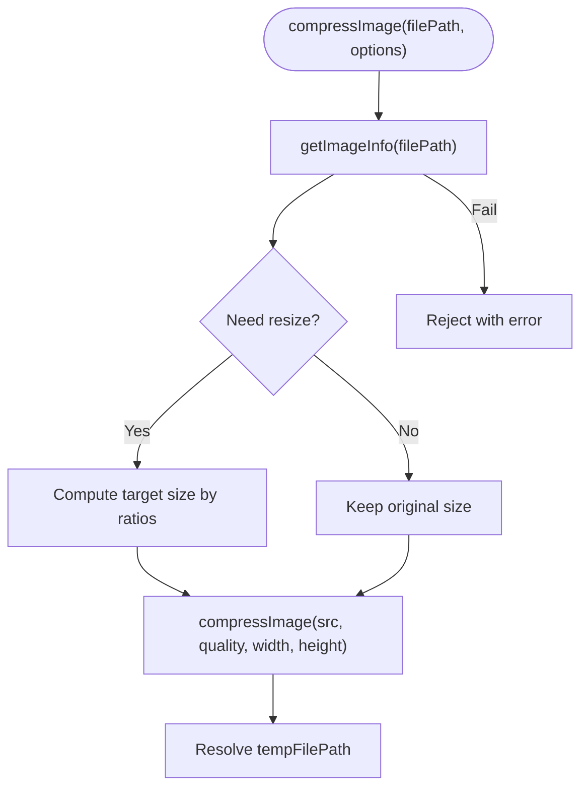
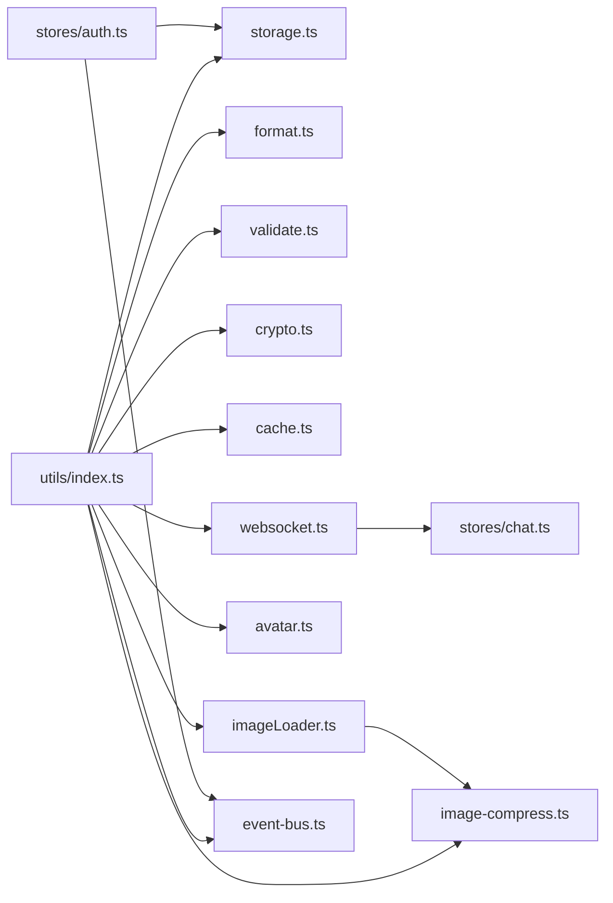

# Data Processing Utilities

<cite>
**Referenced Files in This Document**
- [src/utils/index.ts](file://src/utils/index.ts)
- [src/utils/storage.ts](file://src/utils/storage.ts)
- [src/utils/format.ts](file://src/utils/format.ts)
- [src/utils/validate.ts](file://src/utils/validate.ts)
- [src/utils/crypto.ts](file://src/utils/crypto.ts)
- [src/utils/cache.ts](file://src/utils/cache.ts)
- [src/utils/websocket.ts](file://src/utils/websocket.ts)
- [src/utils/avatar.ts](file://src/utils/avatar.ts)
- [src/utils/image-compress.ts](file://src/utils/image-compress.ts)
- [src/utils/imageLoader.ts](file://src/utils/imageLoader.ts)
- [src/utils/event-bus.ts](file://src/utils/event-bus.ts)
- [src/stores/auth.ts](file://src/stores/auth.ts)
</cite>

## Table of Contents
1. [Introduction](#introduction)
2. [Project Structure](#project-structure)
3. [Core Components](#core-components)
4. [Architecture Overview](#architecture-overview)
5. [Detailed Component Analysis](#detailed-component-analysis)
6. [Dependency Analysis](#dependency-analysis)
7. [Performance Considerations](#performance-considerations)
8. [Troubleshooting Guide](#troubleshooting-guide)
9. [Conclusion](#conclusion)
10. [Appendices](#appendices)

## Introduction
This document describes the data processing utilities in the WeTogether platform. It focuses on:
- Local storage utility for cross-platform persistence
- Formatting utilities for dates, times, and content display
- Validation utilities for form inputs and data integrity
- Cryptographic utilities for secure password handling
- Additional caching, image compression, lazy loading, and event bus utilities
It explains API patterns, data transformation methods, platform-specific implementations (UniApp), integration with components and services, and provides practical examples, error handling strategies, and performance considerations.

## Project Structure
The data processing utilities live under the src/utils/ directory and are exported via a central index file. They integrate with Pinia stores and other parts of the application.

**Diagram sources**
- [src/utils/index.ts:1-5](file://src/utils/index.ts#L1-L5)
- [src/utils/format.ts:1-38](file://src/utils/format.ts#L1-L38)
- [src/utils/validate.ts:1-15](file://src/utils/validate.ts#L1-L15)
- [src/utils/storage.ts:1-26](file://src/utils/storage.ts#L1-L26)
- [src/utils/crypto.ts:1-18](file://src/utils/crypto.ts#L1-L18)
- [src/utils/cache.ts:1-359](file://src/utils/cache.ts#L1-L359)
- [src/utils/websocket.ts:1-171](file://src/utils/websocket.ts#L1-L171)
- [src/utils/avatar.ts:1-93](file://src/utils/avatar.ts#L1-L93)
- [src/utils/image-compress.ts:1-87](file://src/utils/image-compress.ts#L1-L87)
- [src/utils/imageLoader.ts:1-354](file://src/utils/imageLoader.ts#L1-L354)
- [src/utils/event-bus.ts:1-49](file://src/utils/event-bus.ts#L1-L49)

**Section sources**
- [src/utils/index.ts:1-5](file://src/utils/index.ts#L1-L5)

## Core Components
- Local storage wrapper: Provides typed get/set/remove/clear with JSON serialization and error-safe parsing.
- Formatting utilities: Human-friendly time display, relative time, and standardized date/time formatting.
- Validation utilities: Mobile phone, password, verification code, and nickname validation.
- Cryptographic utilities: Password hashing using SHA-256 for transport to backend.
- Caching utilities: Memory cache and persistent storage cache with expiration and LRU-like eviction.
- WebSocket manager: Connection lifecycle, reconnection, heartbeat, and message routing.
- Avatar utilities: MBTI avatar configuration and display resolution logic.
- Image compression and loader: Compression, batch compression, size validation, and lazy/preload image management.
- Event bus: Global event dispatch for avatar/profile updates and social actions.

**Section sources**
- [src/utils/storage.ts:1-26](file://src/utils/storage.ts#L1-L26)
- [src/utils/format.ts:1-38](file://src/utils/format.ts#L1-L38)
- [src/utils/validate.ts:1-15](file://src/utils/validate.ts#L1-L15)
- [src/utils/crypto.ts:1-18](file://src/utils/crypto.ts#L1-L18)
- [src/utils/cache.ts:1-359](file://src/utils/cache.ts#L1-L359)
- [src/utils/websocket.ts:1-171](file://src/utils/websocket.ts#L1-L171)
- [src/utils/avatar.ts:1-93](file://src/utils/avatar.ts#L1-L93)
- [src/utils/image-compress.ts:1-87](file://src/utils/image-compress.ts#L1-L87)
- [src/utils/imageLoader.ts:1-354](file://src/utils/imageLoader.ts#L1-L354)
- [src/utils/event-bus.ts:1-49](file://src/utils/event-bus.ts#L1-L49)

## Architecture Overview
The utilities are designed around a small set of cohesive concerns:
- Data persistence: storage.ts wraps UniApp storage APIs
- Presentation formatting: format.ts uses dayjs for locale-aware formatting
- Input validation: validate.ts enforces simple regex and length rules
- Security: crypto.ts hashes passwords before transmission
- Caching: cache.ts provides in-memory and persisted caches with TTL
- Real-time messaging: websocket.ts manages connections and heartbeats
- Media: image-compress.ts and imageLoader.ts optimize image delivery
- Cross-module communication: event-bus.ts decouples components

**Diagram sources**
- [src/utils/storage.ts:1-26](file://src/utils/storage.ts#L1-L26)
- [src/utils/cache.ts:1-359](file://src/utils/cache.ts#L1-L359)
- [src/utils/format.ts:1-38](file://src/utils/format.ts#L1-L38)
- [src/utils/avatar.ts:1-93](file://src/utils/avatar.ts#L1-L93)
- [src/utils/validate.ts:1-15](file://src/utils/validate.ts#L1-L15)
- [src/utils/crypto.ts:1-18](file://src/utils/crypto.ts#L1-L18)
- [src/utils/websocket.ts:1-171](file://src/utils/websocket.ts#L1-L171)
- [src/utils/image-compress.ts:1-87](file://src/utils/image-compress.ts#L1-L87)
- [src/utils/imageLoader.ts:1-354](file://src/utils/imageLoader.ts#L1-L354)
- [src/utils/event-bus.ts:1-49](file://src/utils/event-bus.ts#L1-L49)

## Detailed Component Analysis

### Local Storage Utility
Purpose:
- Provide a safe, typed wrapper around UniApp storage APIs
- Serialize/deserialize values and handle errors gracefully

Key behaviors:
- get parses JSON and returns null on failure
- set serializes values and logs errors
- remove and clear operate on storage keys

Integration pattern:
- Used by stores to persist tokens, refresh tokens, and user info

**Diagram sources**
- [src/utils/storage.ts:2-8](file://src/utils/storage.ts#L2-L8)

**Section sources**
- [src/utils/storage.ts:1-26](file://src/utils/storage.ts#L1-L26)
- [src/stores/auth.ts:24-26](file://src/stores/auth.ts#L24-L26)

### Formatting Utilities
Purpose:
- Convert timestamps into human-friendly strings
- Provide standardized date/time formatting

Functions:
- formatTime: Today/yesterday/local day/short date
- formatRelativeTime: Relative time using dayjs
- formatDateTime: Standardized datetime
- formatDate: Standardized date

Platform note:
- Uses dayjs with relativeTime plugin and zh-cn locale

**Diagram sources**
- [src/utils/format.ts:8-23](file://src/utils/format.ts#L8-L23)

**Section sources**
- [src/utils/format.ts:1-38](file://src/utils/format.ts#L1-L38)

### Validation Utilities
Purpose:
- Enforce basic input constraints for forms

Validators:
- Mobile phone number format
- Password length range
- Verification code format (6 digits)
- Nickname length range

Usage:
- Call from forms and API DTOs before submission

**Section sources**
- [src/utils/validate.ts:1-15](file://src/utils/validate.ts#L1-L15)

### Cryptographic Utilities
Purpose:
- Securely hash passwords on the client before sending to backend
- Backend applies PBKDF2 for final storage

Implementation:
- Static method to compute SHA-256 digest of plaintext password

Security note:
- Transport encryption (HTTPS/TLS) is still required for secure transmission

**Section sources**
- [src/utils/crypto.ts:1-18](file://src/utils/crypto.ts#L1-L18)

### Caching Utilities
Purpose:
- Reduce network requests and improve perceived performance
- Separate in-memory cache for volatile data and persisted cache for offline resilience

Components:
- MemoryCache: in-memory cache with TTL and LRU-like eviction
- StorageCache: persisted cache using UniApp storage with TTL and prefixing
- CacheManager: factory to create and manage instances
- CACHE_KEYS and CACHE_EXPIRE_TIME: constants for cache naming and TTL

**Diagram sources**
- [src/utils/cache.ts:20-139](file://src/utils/cache.ts#L20-L139)
- [src/utils/cache.ts:144-268](file://src/utils/cache.ts#L144-L268)
- [src/utils/cache.ts:273-318](file://src/utils/cache.ts#L273-L318)

**Section sources**
- [src/utils/cache.ts:1-359](file://src/utils/cache.ts#L1-L359)

### WebSocket Manager
Purpose:
- Manage real-time communication with the server
- Handle connection lifecycle, reconnection, and heartbeat

Key behaviors:
- Connect with token from auth store or storage
- Listen for connect/disconnect/connect_error
- Emit ping periodically and handle pong
- Route messages to chat store
- Reconnect with capped attempts

**Diagram sources**
- [src/utils/websocket.ts:15-53](file://src/utils/websocket.ts#L15-L53)
- [src/utils/websocket.ts:55-91](file://src/utils/websocket.ts#L55-L91)
- [src/utils/websocket.ts:93-111](file://src/utils/websocket.ts#L93-L111)
- [src/utils/websocket.ts:128-141](file://src/utils/websocket.ts#L128-L141)
- [src/utils/websocket.ts:143-150](file://src/utils/websocket.ts#L143-L150)
- [src/utils/websocket.ts:152-167](file://src/utils/websocket.ts#L152-L167)

**Section sources**
- [src/utils/websocket.ts:1-171](file://src/utils/websocket.ts#L1-L171)

### Avatar Utilities
Purpose:
- Provide MBTI avatar configurations and helpers to resolve display URLs

Capabilities:
- MBTI_AVATARS: list of preset avatars
- getMbtiAvatarById/getMbtiAvatarByType: lookup by id/type
- getAvatarDisplay: resolve display URL preferring custom avatar, then MBTI preset, otherwise default

**Section sources**
- [src/utils/avatar.ts:1-93](file://src/utils/avatar.ts#L1-L93)

### Image Compression and Loader
Purpose:
- Optimize image payload sizes and improve loading performance

Compression:
- compressImage: resize and compress single image
- compressImages: batch compression
- getFileSize: get file size in bytes
- validateFileSize: enforce max size

Image Loader:
- ImageLoader: queue-based loading with concurrency limit, retries, placeholders, and error handling
- useImageLazyLoad: composable to preload and select image sources
- useProgressiveImage: progressive loading with low/high quality variants
- ImagePreloadStrategy: preloads images near viewport or next page

**Diagram sources**
- [src/utils/image-compress.ts:10-49](file://src/utils/image-compress.ts#L10-L49)

**Section sources**
- [src/utils/image-compress.ts:1-87](file://src/utils/image-compress.ts#L1-L87)
- [src/utils/imageLoader.ts:26-177](file://src/utils/imageLoader.ts#L26-L177)
- [src/utils/imageLoader.ts:197-246](file://src/utils/imageLoader.ts#L197-L246)
- [src/utils/imageLoader.ts:258-284](file://src/utils/imageLoader.ts#L258-L284)
- [src/utils/imageLoader.ts:289-353](file://src/utils/imageLoader.ts#L289-L353)

### Event Bus
Purpose:
- Decouple components and services via a global event bus

Features:
- on/off/emit/clear
- EVENTS constants for avatar/profile/social updates

Integration:
- Auth store emits avatar updates after login/register/update

**Section sources**
- [src/utils/event-bus.ts:1-49](file://src/utils/event-bus.ts#L1-L49)
- [src/stores/auth.ts:82-87](file://src/stores/auth.ts#L82-L87)
- [src/stores/auth.ts:105-110](file://src/stores/auth.ts#L105-L110)

## Dependency Analysis
- Central export: src/utils/index.ts re-exports all utilities for convenient imports
- Stores depend on storage.ts for persistence and event-bus.ts for cross-component updates
- WebSocket manager depends on auth store and chat store for routing messages
- Image loader integrates with image-compress for optimized assets
- Cache utilities are independent but can be used by services to reduce network load

**Diagram sources**
- [src/utils/index.ts:1-5](file://src/utils/index.ts#L1-L5)
- [src/utils/storage.ts:1-26](file://src/utils/storage.ts#L1-L26)
- [src/utils/format.ts:1-38](file://src/utils/format.ts#L1-L38)
- [src/utils/validate.ts:1-15](file://src/utils/validate.ts#L1-L15)
- [src/utils/crypto.ts:1-18](file://src/utils/crypto.ts#L1-L18)
- [src/utils/cache.ts:1-359](file://src/utils/cache.ts#L1-L359)
- [src/utils/websocket.ts:1-171](file://src/utils/websocket.ts#L1-L171)
- [src/utils/avatar.ts:1-93](file://src/utils/avatar.ts#L1-L93)
- [src/utils/image-compress.ts:1-87](file://src/utils/image-compress.ts#L1-L87)
- [src/utils/imageLoader.ts:1-354](file://src/utils/imageLoader.ts#L1-L354)
- [src/utils/event-bus.ts:1-49](file://src/utils/event-bus.ts#L1-L49)
- [src/stores/auth.ts:1-137](file://src/stores/auth.ts#L1-L137)

**Section sources**
- [src/utils/index.ts:1-5](file://src/utils/index.ts#L1-L5)

## Performance Considerations
- Prefer MemoryCache for frequently accessed, short-lived data; use StorageCache for offline persistence
- Tune CacheManager options (expireTime, maxSize) per data sensitivity and size
- Use ImageLoader’s concurrency limits and retry policy to avoid overwhelming the device
- Batch operations (compressImages, preloadBatch) to reduce overhead
- Use progressive image loading to improve perceived performance
- Avoid heavy synchronous operations in UI rendering; delegate to utilities and composables

## Troubleshooting Guide
Common issues and resolutions:
- Storage failures:
  - Symptom: get returns null unexpectedly
  - Resolution: Verify key existence and JSON validity; inspect exceptions in set
- WebSocket not connecting:
  - Symptom: Immediate disconnect or no messages
  - Resolution: Ensure token availability; check connect_error logs; verify server path and wsURL
- Image loading errors:
  - Symptom: Placeholder remains or error image shows
  - Resolution: Confirm network accessibility; adjust retryTimes/retryDelay; validate URLs
- Cache not evicting:
  - Symptom: Cache grows beyond expectations
  - Resolution: Adjust maxSize and expireTime; call clearExpired periodically
- Avatar not updating:
  - Symptom: UI shows old avatar after change
  - Resolution: Ensure eventBus emits AVATAR_UPDATED and subscribers react

**Section sources**
- [src/utils/storage.ts:6-8](file://src/utils/storage.ts#L6-L8)
- [src/utils/websocket.ts:28-32](file://src/utils/websocket.ts#L28-L32)
- [src/utils/websocket.ts:85-90](file://src/utils/websocket.ts#L85-L90)
- [src/utils/imageLoader.ts:139-153](file://src/utils/imageLoader.ts#L139-L153)
- [src/utils/cache.ts:94-104](file://src/utils/cache.ts#L94-L104)
- [src/utils/event-bus.ts:40-48](file://src/utils/event-bus.ts#L40-L48)
- [src/stores/auth.ts:82-87](file://src/stores/auth.ts#L82-L87)

## Conclusion
The WeTogether platform’s data processing utilities provide a robust foundation for persistence, formatting, validation, security, caching, real-time messaging, media optimization, and decoupled communication. By leveraging these utilities consistently, developers can build reliable, performant, and maintainable features across platforms.

## Appendices

### Practical Examples and Patterns
- Persisting auth state:
  - On login/register, store token and user info using storage.ts
  - On logout, remove stored entries
  - Reference: [src/stores/auth.ts:18-52](file://src/stores/auth.ts#L18-L52)
- Formatting timestamps:
  - Use formatTime for feed timestamps; formatRelativeTime for recent activity
  - Reference: [src/utils/format.ts:8-28](file://src/utils/format.ts#L8-L28)
- Validating inputs:
  - Apply validateMobile/validatePassword before API calls
  - Reference: [src/utils/validate.ts:1-15](file://src/utils/validate.ts#L1-L15)
- Securing passwords:
  - Hash with CryptoUtil.encryptPassword before sending to backend
  - Reference: [src/utils/crypto.ts:14-16](file://src/utils/crypto.ts#L14-L16)
- Caching data:
  - Use CacheManager.getMemoryCache()/getStorageCache() with CACHE_KEYS and CACHE_EXPIRE_TIME
  - Reference: [src/utils/cache.ts:273-318](file://src/utils/cache.ts#L273-L318), [src/utils/cache.ts:323-358](file://src/utils/cache.ts#L323-L358)
- Real-time messaging:
  - Initialize wsManager and route messages to chat store
  - Reference: [src/utils/websocket.ts:15-53](file://src/utils/websocket.ts#L15-L53), [src/utils/websocket.ts:93-111](file://src/utils/websocket.ts#L93-L111)
- Optimizing images:
  - Compress uploads and preload thumbnails
  - Reference: [src/utils/image-compress.ts:10-49](file://src/utils/image-compress.ts#L10-L49), [src/utils/imageLoader.ts:50-86](file://src/utils/imageLoader.ts#L50-L86)
- Avatar display:
  - Resolve display URL using getAvatarDisplay
  - Reference: [src/utils/avatar.ts:53-92](file://src/utils/avatar.ts#L53-L92)

### Extension Guidelines
- Adding new validators:
  - Define a new validator in validate.ts and export it via utils/index.ts
- Adding new formatters:
  - Add a new function in format.ts and export it via utils/index.ts
- Extending cache:
  - Introduce new CACHE_KEYS and CACHE_EXPIRE_TIME entries
  - Use CacheManager to access appropriate cache instance
- Adding cryptographic operations:
  - Extend crypto.ts with new static methods and export via utils/index.ts
- Integrating with stores:
  - Use storage.ts for persistence and event-bus.ts for cross-component signals
- Real-time extensions:
  - Extend WebSocketManager to support new events and routes