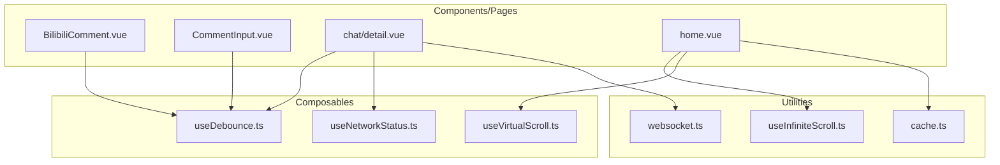
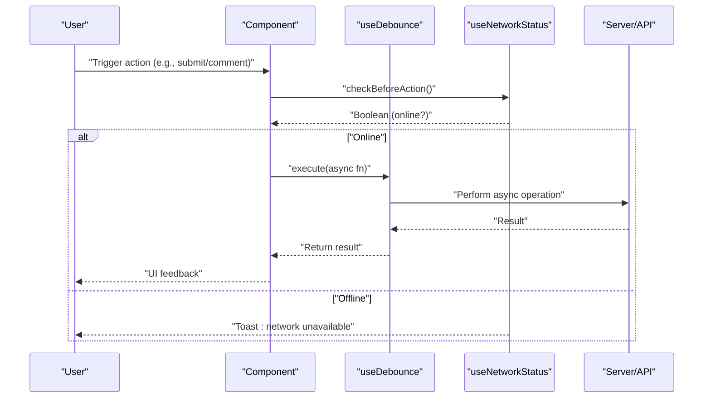
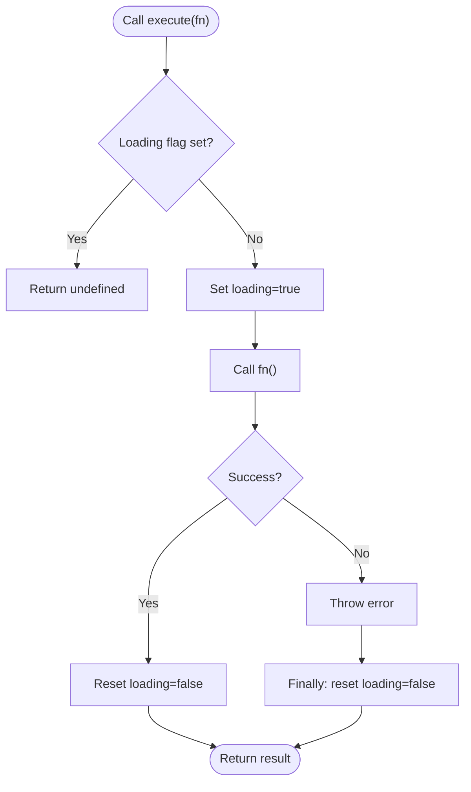
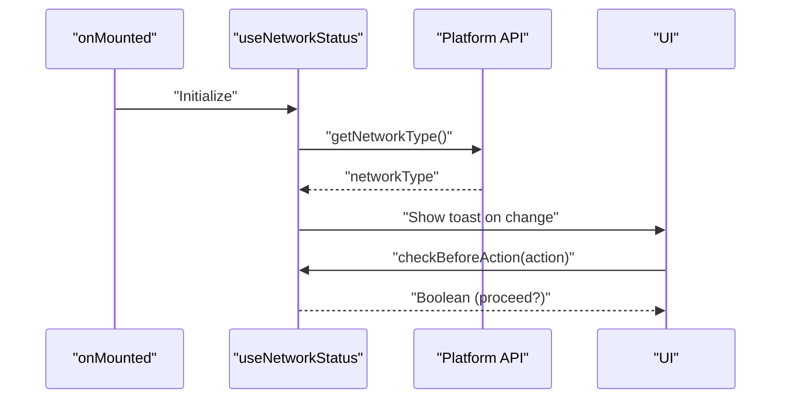
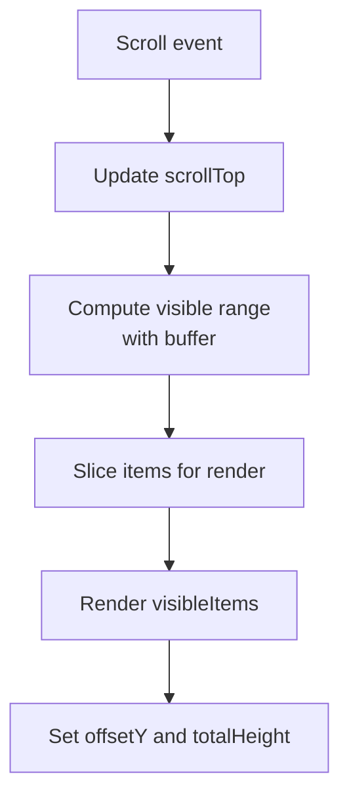
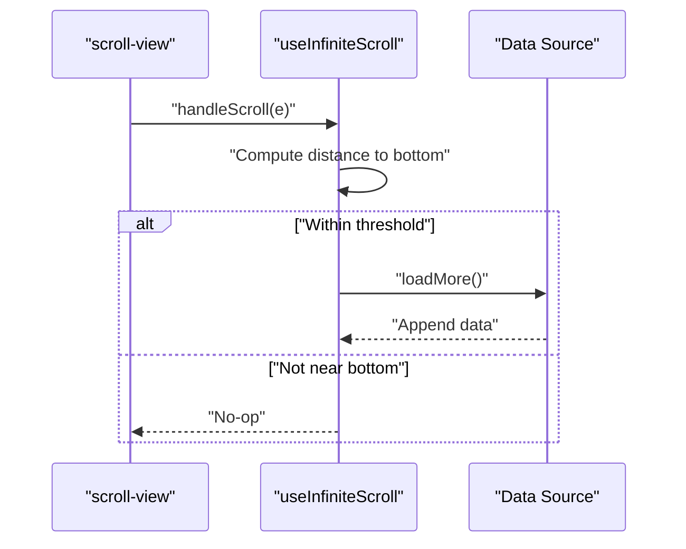
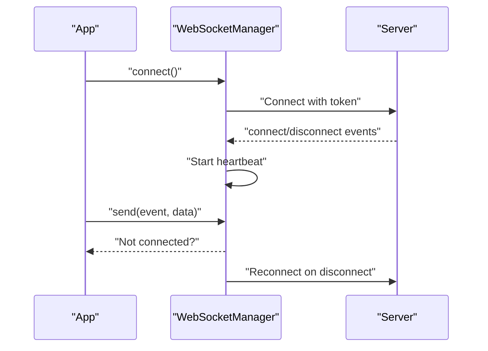
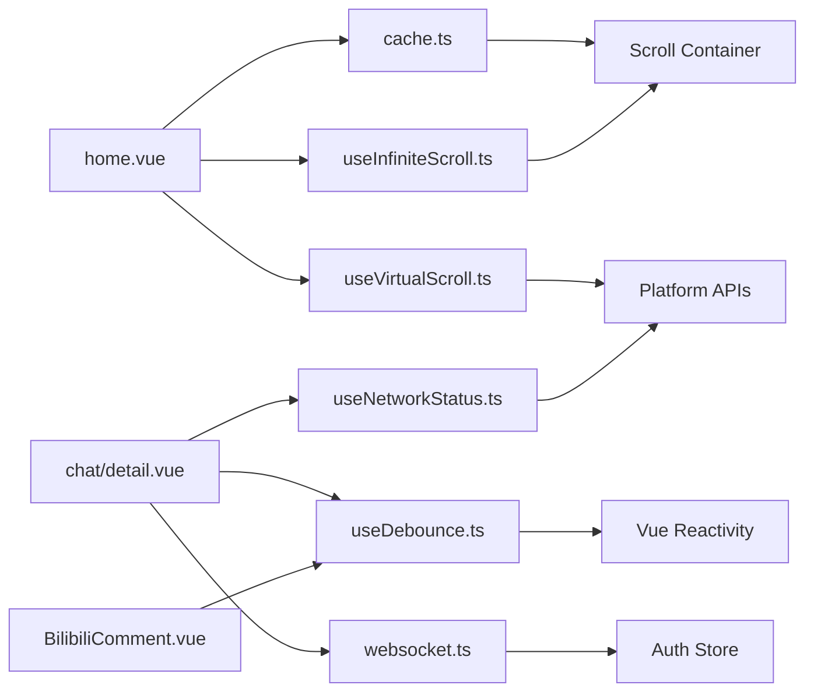

# Performance & Network Utilities

<cite>
**Referenced Files in This Document**
- [useDebounce.ts](file://src/composables/useDebounce.ts)
- [useNetworkStatus.ts](file://src/composables/useNetworkStatus.ts)
- [useVirtualScroll.ts](file://src/composables/useVirtualScroll.ts)
- [debounce-refactor.md](file://docs/debounce-refactor.md)
- [send-button-optimization.md](file://docs/send-button-optimization.md)
- [BilibiliComment.vue](file://src/components/business/BilibiliComment.vue)
- [CommentInput.vue](file://src/components/business/CommentInput.vue)
- [chat/detail.vue](file://src/pages/chat/detail.vue)
- [home.vue](file://src/pages/tabbar/home.vue)
- [useInfiniteScroll.ts](file://src/pages/tabbar/home/composables/useInfiniteScroll.ts)
- [cache.ts](file://src/utils/cache.ts)
- [websocket.ts](file://src/utils/websocket.ts)
</cite>

## Table of Contents
1. [Introduction](#introduction)
2. [Project Structure](#project-structure)
3. [Core Components](#core-components)
4. [Architecture Overview](#architecture-overview)
5. [Detailed Component Analysis](#detailed-component-analysis)
6. [Dependency Analysis](#dependency-analysis)
7. [Performance Considerations](#performance-considerations)
8. [Troubleshooting Guide](#troubleshooting-guide)
9. [Conclusion](#conclusion)
10. [Appendices](#appendices)

## Introduction
This document focuses on performance optimization and network utilities in the WeTogether platform. It covers three key areas:
- Debouncing composable for input optimization and API call reduction
- Network status monitoring for connectivity awareness
- Virtual scrolling for efficient large dataset rendering

It explains implementation strategies, timing considerations, platform-specific optimizations, usage patterns across forms, infinite lists, and real-time features, along with cross-platform compatibility and fallback strategies.

## Project Structure
The performance utilities are implemented as Vue 3 Composition API composables and integrated into platform components and pages. The relevant modules are organized as follows:
- Composables: debouncing, network status, and virtual scrolling
- Component integrations: comment input, chat detail, and recommendation feed
- Supporting utilities: caching and WebSocket manager

**Diagram sources**
- [useDebounce.ts:1-153](file://src/composables/useDebounce.ts#L1-L153)
- [useNetworkStatus.ts:1-62](file://src/composables/useNetworkStatus.ts#L1-L62)
- [useVirtualScroll.ts:1-246](file://src/composables/useVirtualScroll.ts#L1-L246)
- [BilibiliComment.vue:158-444](file://src/components/business/BilibiliComment.vue#L158-L444)
- [CommentInput.vue:1-123](file://src/components/business/CommentInput.vue#L1-L123)
- [chat/detail.vue:50-171](file://src/pages/chat/detail.vue#L50-L171)
- [home.vue:129-438](file://src/pages/tabbar/home.vue#L129-L438)
- [useInfiniteScroll.ts:1-71](file://src/pages/tabbar/home/composables/useInfiniteScroll.ts#L1-L71)
- [cache.ts:1-358](file://src/utils/cache.ts#L1-L358)
- [websocket.ts:1-170](file://src/utils/websocket.ts#L1-L170)

**Section sources**
- [useDebounce.ts:1-153](file://src/composables/useDebounce.ts#L1-L153)
- [useNetworkStatus.ts:1-62](file://src/composables/useNetworkStatus.ts#L1-L62)
- [useVirtualScroll.ts:1-246](file://src/composables/useVirtualScroll.ts#L1-L246)
- [BilibiliComment.vue:158-444](file://src/components/business/BilibiliComment.vue#L158-L444)
- [CommentInput.vue:1-123](file://src/components/business/CommentInput.vue#L1-L123)
- [chat/detail.vue:50-171](file://src/pages/chat/detail.vue#L50-L171)
- [home.vue:129-438](file://src/pages/tabbar/home.vue#L129-L438)
- [useInfiniteScroll.ts:1-71](file://src/pages/tabbar/home/composables/useInfiniteScroll.ts#L1-L71)
- [cache.ts:1-358](file://src/utils/cache.ts#L1-L358)
- [websocket.ts:1-170](file://src/utils/websocket.ts#L1-L170)

## Core Components
- Debouncing composable: Provides unified loading state, prevents duplicate submissions, and supports button text switching and countdown modes.
- Network status composable: Monitors connectivity via platform APIs, exposes online/offline state, and provides pre-action checks.
- Virtual scrolling composable: Renders only visible items in large lists, supporting fixed and dynamic heights with buffer zones.

**Section sources**
- [useDebounce.ts:18-45](file://src/composables/useDebounce.ts#L18-L45)
- [useDebounce.ts:63-73](file://src/composables/useDebounce.ts#L63-L73)
- [useDebounce.ts:98-151](file://src/composables/useDebounce.ts#L98-L151)
- [useNetworkStatus.ts:3-61](file://src/composables/useNetworkStatus.ts#L3-L61)
- [useVirtualScroll.ts:15-79](file://src/composables/useVirtualScroll.ts#L15-L79)
- [useVirtualScroll.ts:91-211](file://src/composables/useVirtualScroll.ts#L91-L211)

## Architecture Overview
The platform integrates performance utilities across UI components and pages:
- Forms and messaging leverage debouncing to reduce redundant API calls and improve UX.
- Infinite scrolling and caching optimize data fetching and rendering.
- Real-time features use WebSocket with heartbeat and reconnection strategies.
- Network awareness ensures actions are gated appropriately when offline.

**Diagram sources**
- [useDebounce.ts:26-39](file://src/composables/useDebounce.ts#L26-L39)
- [useNetworkStatus.ts:35-45](file://src/composables/useNetworkStatus.ts#L35-L45)
- [BilibiliComment.vue:241-283](file://src/components/business/BilibiliComment.vue#L241-L283)
- [chat/detail.vue:131-148](file://src/pages/chat/detail.vue#L131-L148)

## Detailed Component Analysis

### Debouncing Composable
The debouncing composable offers three variants:
- Basic debouncer: manages a single loading flag and prevents concurrent executions.
- Button variant: adds automatic button text switching based on loading state.
- Countdown variant: adds cooldown behavior after successful operations.

Implementation highlights:
- Prevents duplicate submissions by guarding on a loading flag.
- Uses a finally block to reset loading state regardless of outcome.
- Supports countdown timers and button text updates for verification flows.

Usage patterns:
- Forms: wrap submission handlers to avoid double taps.
- Messaging: debounce send actions to prevent duplicate messages.
- Verification: enforce cooldowns after sending codes.

**Diagram sources**
- [useDebounce.ts:26-39](file://src/composables/useDebounce.ts#L26-L39)
- [useDebounce.ts:124-141](file://src/composables/useDebounce.ts#L124-L141)

**Section sources**
- [useDebounce.ts:18-45](file://src/composables/useDebounce.ts#L18-L45)
- [useDebounce.ts:63-73](file://src/composables/useDebounce.ts#L63-L73)
- [useDebounce.ts:98-151](file://src/composables/useDebounce.ts#L98-L151)
- [debounce-refactor.md:47-159](file://docs/debounce-refactor.md#L47-L159)
- [send-button-optimization.md:27-62](file://docs/send-button-optimization.md#L27-L62)

### Network Status Monitoring
The network status composable:
- Initializes connectivity state using platform APIs.
- Subscribes to network change events and updates reactive state.
- Provides a pre-action checker to guard operations when offline.
- Displays toast notifications on connectivity changes.

Integration examples:
- Comments and messaging pages check connectivity before sending.
- Offline UX: immediate user feedback when attempting actions.

**Diagram sources**
- [useNetworkStatus.ts:7-33](file://src/composables/useNetworkStatus.ts#L7-L33)
- [useNetworkStatus.ts:47-54](file://src/composables/useNetworkStatus.ts#L47-L54)
- [BilibiliComment.vue:241-243](file://src/components/business/BilibiliComment.vue#L241-L243)
- [chat/detail.vue:131-133](file://src/pages/chat/detail.vue#L131-L133)

**Section sources**
- [useNetworkStatus.ts:3-61](file://src/composables/useNetworkStatus.ts#L3-L61)
- [BilibiliComment.vue:179-180](file://src/components/business/BilibiliComment.vue#L179-L180)
- [chat/detail.vue:61-62](file://src/pages/chat/detail.vue#L61-L62)

### Virtual Scrolling
Virtual scrolling renders only visible items to minimize DOM nodes and improve performance:
- Fixed-height mode: computes visible range based on item height and buffer size.
- Dynamic-height mode: tracks item heights and offsets for variable heights.
- Helpers: measure item height and scroll to index with optional animation.

**Diagram sources**
- [useVirtualScroll.ts:24-56](file://src/composables/useVirtualScroll.ts#L24-L56)
- [useVirtualScroll.ts:144-158](file://src/composables/useVirtualScroll.ts#L144-L158)
- [useVirtualScroll.ts:216-245](file://src/composables/useVirtualScroll.ts#L216-L245)

**Section sources**
- [useVirtualScroll.ts:15-79](file://src/composables/useVirtualScroll.ts#L15-L79)
- [useVirtualScroll.ts:91-211](file://src/composables/useVirtualScroll.ts#L91-L211)
- [home.vue:129-178](file://src/pages/tabbar/home.vue#L129-L178)

### Infinite Scroll Integration
The infinite scroll composable complements virtual scrolling by:
- Detecting proximity to bottom of scroll container.
- Managing loading and “has more” states.
- Providing refresh and load-more handlers.

**Diagram sources**
- [useInfiniteScroll.ts:17-27](file://src/pages/tabbar/home/composables/useInfiniteScroll.ts#L17-L27)
- [useInfiniteScroll.ts:29-40](file://src/pages/tabbar/home/composables/useInfiniteScroll.ts#L29-L40)
- [home.vue:174-178](file://src/pages/tabbar/home.vue#L174-L178)

**Section sources**
- [useInfiniteScroll.ts:9-70](file://src/pages/tabbar/home/composables/useInfiniteScroll.ts#L9-L70)
- [home.vue:174-178](file://src/pages/tabbar/home.vue#L174-L178)

### Real-Time Features and Connectivity Awareness
Real-time communication uses WebSocket with:
- Automatic reconnection with capped attempts and delays.
- Heartbeat management and event-driven message handling.
- Pre-action checks to ensure connectivity before sending.

**Diagram sources**
- [websocket.ts:15-53](file://src/utils/websocket.ts#L15-L53)
- [websocket.ts:134-141](file://src/utils/websocket.ts#L134-L141)
- [chat/detail.vue:97-101](file://src/pages/chat/detail.vue#L97-L101)

**Section sources**
- [websocket.ts:6-170](file://src/utils/websocket.ts#L6-L170)
- [chat/detail.vue:50-101](file://src/pages/chat/detail.vue#L50-L101)

## Dependency Analysis
- Debouncing depends on Vue reactivity primitives and platform toast APIs.
- Network status depends on platform network APIs and lifecycle hooks.
- Virtual scrolling depends on platform selector queries and scroll events.
- Infinite scroll depends on scroll container geometry and data loading callbacks.
- Real-time features depend on WebSocket manager and authentication state.

**Diagram sources**
- [useDebounce.ts:1-45](file://src/composables/useDebounce.ts#L1-L45)
- [useNetworkStatus.ts:1-62](file://src/composables/useNetworkStatus.ts#L1-L62)
- [useVirtualScroll.ts:1-246](file://src/composables/useVirtualScroll.ts#L1-L246)
- [useInfiniteScroll.ts:1-71](file://src/pages/tabbar/home/composables/useInfiniteScroll.ts#L1-L71)
- [cache.ts:1-358](file://src/utils/cache.ts#L1-L358)
- [home.vue:129-438](file://src/pages/tabbar/home.vue#L129-L438)
- [BilibiliComment.vue:158-444](file://src/components/business/BilibiliComment.vue#L158-L444)
- [chat/detail.vue:50-171](file://src/pages/chat/detail.vue#L50-L171)

**Section sources**
- [useDebounce.ts:1-45](file://src/composables/useDebounce.ts#L1-L45)
- [useNetworkStatus.ts:1-62](file://src/composables/useNetworkStatus.ts#L1-L62)
- [useVirtualScroll.ts:1-246](file://src/composables/useVirtualScroll.ts#L1-L246)
- [useInfiniteScroll.ts:1-71](file://src/pages/tabbar/home/composables/useInfiniteScroll.ts#L1-L71)
- [cache.ts:1-358](file://src/utils/cache.ts#L1-L358)
- [home.vue:129-438](file://src/pages/tabbar/home.vue#L129-L438)
- [BilibiliComment.vue:158-444](file://src/components/business/BilibiliComment.vue#L158-L444)
- [chat/detail.vue:50-171](file://src/pages/chat/detail.vue#L50-L171)

## Performance Considerations
- Debouncing reduces redundant API calls and stabilizes UI state during async operations.
- Virtual scrolling minimizes DOM nodes by rendering only visible items with configurable buffer sizes.
- Infinite scroll defers loading until user approaches the end, reducing initial payload.
- Caching accelerates repeated loads with memory and storage tiers and periodic cleanup.
- Real-time features use heartbeat and exponential backoff to maintain responsiveness.

[No sources needed since this section provides general guidance]

## Troubleshooting Guide
Common issues and resolutions:
- Debouncing not resetting: ensure the finally block executes; verify loading flag resets after errors.
- Network checks failing silently: confirm platform network listeners are registered/unregistered on lifecycle hooks.
- Virtual scroll misalignment: verify container height measurement and buffer size; ensure selector matches the scroll container.
- Infinite scroll triggering too early/late: adjust threshold and ensure scroll container geometry is accurate.
- WebSocket disconnections: confirm token availability and reconnection attempts; monitor heartbeat.

**Section sources**
- [useDebounce.ts:36-39](file://src/composables/useDebounce.ts#L36-L39)
- [useNetworkStatus.ts:47-54](file://src/composables/useNetworkStatus.ts#L47-L54)
- [useVirtualScroll.ts:59-70](file://src/composables/useVirtualScroll.ts#L59-L70)
- [useInfiniteScroll.ts:17-27](file://src/pages/tabbar/home/composables/useInfiniteScroll.ts#L17-L27)
- [websocket.ts:134-141](file://src/utils/websocket.ts#L134-L141)

## Conclusion
The WeTogether platform leverages composable-based utilities to deliver robust performance and connectivity-aware experiences:
- Debouncing streamlines user interactions and API usage.
- Network status monitoring improves resilience and user feedback.
- Virtual scrolling and infinite scroll enable smooth rendering of large datasets.
- Caching and WebSocket management support scalable data and real-time features.

These utilities are designed for cross-platform compatibility and include fallback strategies to ensure consistent behavior across environments.

[No sources needed since this section summarizes without analyzing specific files]

## Appendices

### Usage Patterns and Examples
- Forms: Wrap submit handlers with the button variant to switch text and disable during loading.
- Infinite lists: Combine virtual scrolling with infinite scroll to render large feeds efficiently.
- Real-time features: Gate actions with network checks and rely on WebSocket manager for reliable delivery.

**Section sources**
- [BilibiliComment.vue:179-180](file://src/components/business/BilibiliComment.vue#L179-L180)
- [CommentInput.vue:36-73](file://src/components/business/CommentInput.vue#L36-L73)
- [chat/detail.vue:61-62](file://src/pages/chat/detail.vue#L61-L62)
- [home.vue:174-178](file://src/pages/tabbar/home.vue#L174-L178)

### Cross-Platform Compatibility and Fallbacks
- Platform APIs: Network status and selector queries are used conditionally; ensure fallbacks when unavailable.
- Virtual scroll: Buffer zones and default container heights mitigate missing measurements.
- Debouncing: Loading flags provide deterministic UI state even if async operations fail.
- WebSocket: Reconnection and heartbeat ensure continuity; token presence is validated before connecting.

**Section sources**
- [useNetworkStatus.ts:7-14](file://src/composables/useNetworkStatus.ts#L7-L14)
- [useVirtualScroll.ts:61-70](file://src/composables/useVirtualScroll.ts#L61-L70)
- [useDebounce.ts:26-39](file://src/composables/useDebounce.ts#L26-L39)
- [websocket.ts:23-32](file://src/utils/websocket.ts#L23-L32)