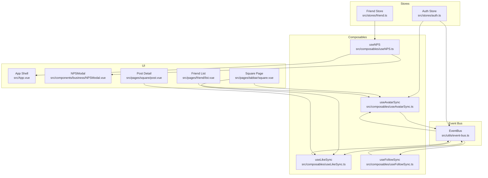
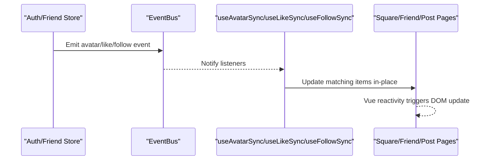
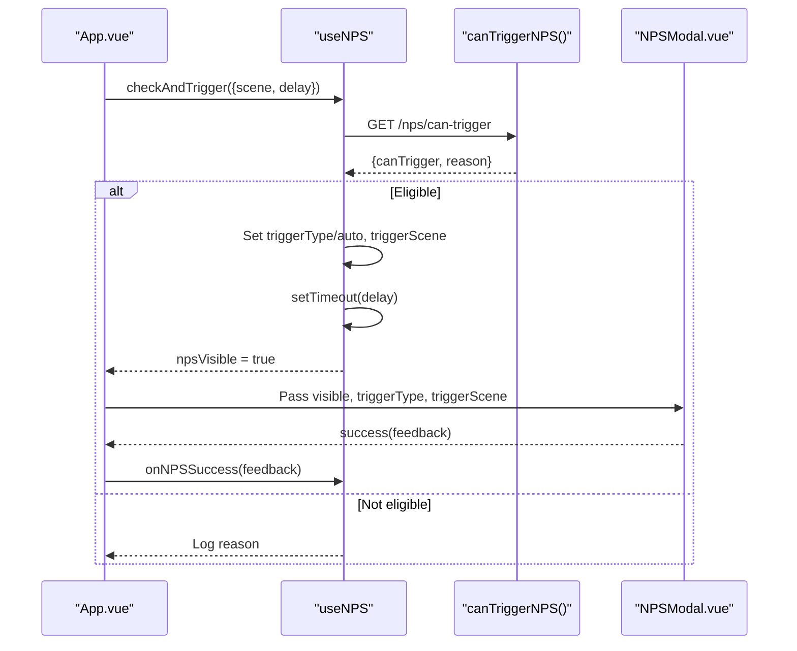
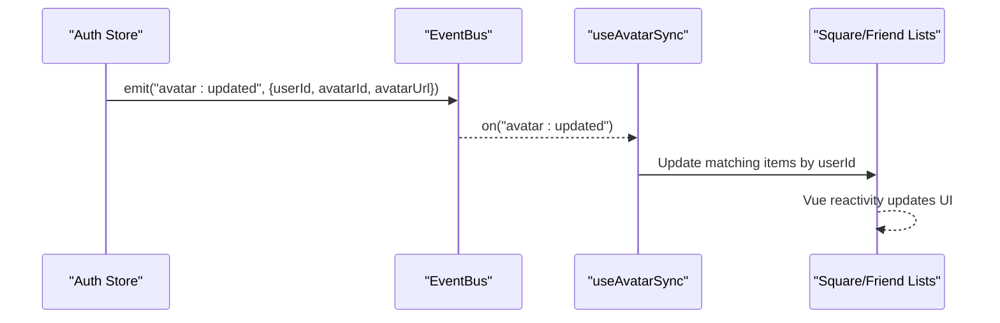
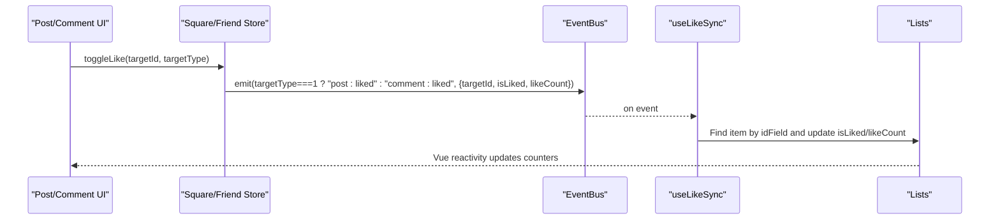
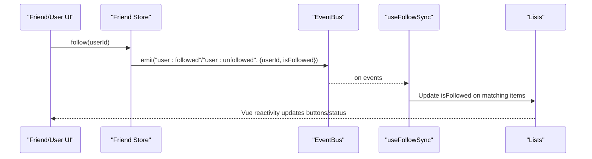
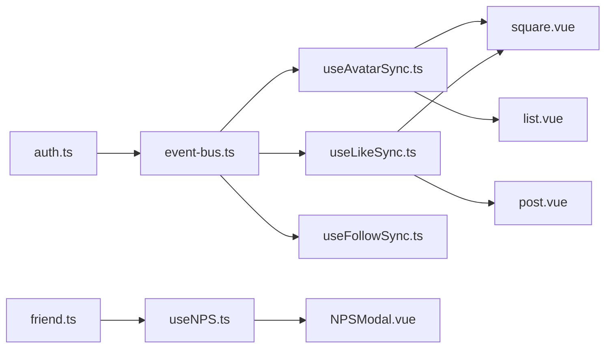

# State Management Composables

<cite>
**Referenced Files in This Document**
- [useNPS.ts](file://src/composables/useNPS.ts)
- [useAvatarSync.ts](file://src/composables/useAvatarSync.ts)
- [useLikeSync.ts](file://src/composables/useLikeSync.ts)
- [useFollowSync.ts](file://src/composables/useFollowSync.ts)
- [event-bus.ts](file://src/utils/event-bus.ts)
- [auth.ts](file://src/stores/auth.ts)
- [friend.ts](file://src/stores/friend.ts)
- [nps.ts](file://src/api/nps.ts)
- [NPSModal.vue](file://src/components/business/NPSModal.vue)
- [App.vue](file://src/App.vue)
- [square.vue](file://src/pages/tabbar/square.vue)
- [post.vue](file://src/pages/square/post.vue)
- [list.vue](file://src/pages/friend/list.vue)
- [avatar-sync-solution.md](file://docs/fix-deploy/avatar-sync-solution.md)
- [nps-frontend-guide.md](file://docs/nps-frontend-guide.md)
</cite>

## Table of Contents
1. [Introduction](#introduction)
2. [Project Structure](#project-structure)
3. [Core Components](#core-components)
4. [Architecture Overview](#architecture-overview)
5. [Detailed Component Analysis](#detailed-component-analysis)
6. [Dependency Analysis](#dependency-analysis)
7. [Performance Considerations](#performance-considerations)
8. [Troubleshooting Guide](#troubleshooting-guide)
9. [Conclusion](#conclusion)
10. [Appendices](#appendices)

## Introduction
This document provides comprehensive documentation for the state management composables that power reactive, cross-component synchronization in the WeTogether platform. It focuses on:
- NPS tracking composable for customer satisfaction metrics
- Avatar synchronization for real-time profile updates
- Like synchronization for social interactions
- Follow synchronization for relationship management

It explains reactive state patterns, data flow mechanisms, and integration with Pinia stores. The guide includes composable APIs, parameters, return values, lifecycle management, practical integration examples, and strategies for performance optimization, memory management, and error handling.

## Project Structure
The state management composables are implemented as lightweight, reusable hooks that coordinate with Pinia stores and a global event bus. They enable seamless synchronization across pages and components without tightly coupling UI logic to backend APIs.

**Diagram sources**
- [useNPS.ts:13-77](file://src/composables/useNPS.ts#L13-L77)
- [useAvatarSync.ts:9-71](file://src/composables/useAvatarSync.ts#L9-L71)
- [useLikeSync.ts:16-48](file://src/composables/useLikeSync.ts#L16-L48)
- [useFollowSync.ts:13-56](file://src/composables/useFollowSync.ts#L13-L56)
- [event-bus.ts:6-48](file://src/utils/event-bus.ts#L6-L48)
- [auth.ts:79-117](file://src/stores/auth.ts#L79-L117)
- [friend.ts:29-35](file://src/stores/friend.ts#L29-L35)
- [App.vue:1-37](file://src/App.vue#L1-L37)
- [NPSModal.vue:1-314](file://src/components/business/NPSModal.vue#L1-L314)
- [square.vue:80-90](file://src/pages/tabbar/square.vue#L80-L90)
- [post.vue:44-46](file://src/pages/square/post.vue#L44-L46)
- [list.vue:37-42](file://src/pages/friend/list.vue#L37-L42)

**Section sources**
- [useNPS.ts:1-145](file://src/composables/useNPS.ts#L1-L145)
- [useAvatarSync.ts:1-72](file://src/composables/useAvatarSync.ts#L1-L72)
- [useLikeSync.ts:1-49](file://src/composables/useLikeSync.ts#L1-L49)
- [useFollowSync.ts:1-57](file://src/composables/useFollowSync.ts#L1-L57)
- [event-bus.ts:1-49](file://src/utils/event-bus.ts#L1-L49)
- [auth.ts:1-137](file://src/stores/auth.ts#L1-L137)
- [friend.ts:1-70](file://src/stores/friend.ts#L1-L70)
- [App.vue:1-55](file://src/App.vue#L1-L55)
- [NPSModal.vue:1-550](file://src/components/business/NPSModal.vue#L1-L550)
- [square.vue:1-200](file://src/pages/tabbar/square.vue#L1-L200)
- [post.vue:44-99](file://src/pages/square/post.vue#L44-L99)
- [list.vue:1-184](file://src/pages/friend/list.vue#L1-L184)

## Core Components
This section summarizes the four core composables and their roles in the platform’s reactive state ecosystem.

- NPS Tracking Composable
  - Purpose: Determine eligibility and present NPS feedback modal; support manual and automatic triggers.
  - Reactive state: Visibility flag, trigger type, and trigger scene.
  - Integration: Emits success events to parent components and integrates with the NPS modal component.

- Avatar Synchronization Composable
  - Purpose: Keep user avatars consistent across lists by listening to global avatar update events.
  - Reactive state: None; operates via event-driven updates.
  - Integration: Works with Pinia stores and supports nested or flat user structures.

- Like Synchronization Composable
  - Purpose: Synchronize like/unlike actions across posts and comments.
  - Reactive state: None; updates items in place.
  - Integration: Listens to post/comment like events and updates matching items.

- Follow Synchronization Composable
  - Purpose: Synchronize follow/unfollow actions across user-related lists.
  - Reactive state: None; updates items in place.
  - Integration: Listens to follow/unfollow events and updates matching user entries.

**Section sources**
- [useNPS.ts:13-77](file://src/composables/useNPS.ts#L13-L77)
- [useAvatarSync.ts:9-71](file://src/composables/useAvatarSync.ts#L9-L71)
- [useLikeSync.ts:16-48](file://src/composables/useLikeSync.ts#L16-L48)
- [useFollowSync.ts:13-56](file://src/composables/useFollowSync.ts#L13-L56)

## Architecture Overview
The architecture leverages a unidirectional data flow pattern:
- Stores manage persistent state and business logic.
- Composables expose reactive signals and lifecycle-managed listeners.
- A global event bus decouples components and enables cross-page synchronization.
- UI components bind to composables and stores, rendering reactive updates.

**Diagram sources**
- [auth.ts:82-87](file://src/stores/auth.ts#L82-L87)
- [event-bus.ts:26-31](file://src/utils/event-bus.ts#L26-L31)
- [useAvatarSync.ts:31-58](file://src/composables/useAvatarSync.ts#L31-L58)
- [useLikeSync.ts:25-37](file://src/composables/useLikeSync.ts#L25-L37)
- [useFollowSync.ts:22-45](file://src/composables/useFollowSync.ts#L22-L45)

## Detailed Component Analysis

### NPS Tracking Composable
- Purpose: Centralized logic for NPS eligibility checks, delayed presentation, manual override, and success handling.
- Reactive state:
  - npsVisible: Controls modal visibility.
  - npsTriggerType: Indicates whether triggered automatically or manually.
  - npsTriggerScene: Captures the scenario that initiated the trigger.
- Public API:
  - checkAndTrigger(config): Checks eligibility and schedules modal display after a configurable delay.
  - manualTrigger(): Forces immediate display with manual trigger metadata.
  - closeNPS(): Hides the modal.
  - onNPSSuccess(feedback): Handles successful submission and optional downstream actions.
- Trigger scenes:
  - After registration, after first post, after adding a friend, after active week, periodic intervals, and manual.
- Integration:
  - Used in App shell to render the NPS modal globally.
  - The modal component handles multi-step UX and submits feedback to the backend.

**Diagram sources**
- [App.vue:7-36](file://src/App.vue#L7-L36)
- [useNPS.ts:18-38](file://src/composables/useNPS.ts#L18-L38)
- [nps.ts:33-35](file://src/api/nps.ts#L33-L35)
- [NPSModal.vue:125-128](file://src/components/business/NPSModal.vue#L125-L128)

**Section sources**
- [useNPS.ts:13-77](file://src/composables/useNPS.ts#L13-L77)
- [nps.ts:1-43](file://src/api/nps.ts#L1-L43)
- [NPSModal.vue:1-314](file://src/components/business/NPSModal.vue#L1-L314)
- [App.vue:1-37](file://src/App.vue#L1-L37)

### Avatar Synchronization Composable
- Purpose: Keep user avatars consistent across lists by reacting to global avatar updates.
- Reactive state: None; relies on event-driven updates.
- Options:
  - userIdField: Field name for user ID (default: "userId").
  - avatarIdField: Field name for avatar ID (default: "avatarId").
  - avatarUrlField: Field name for avatar URL (default: "avatarUrl").
  - nestedUserField: Nested user object field (default: "user"); set to undefined for flat structures.
- Behavior:
  - On mount, subscribes to the avatar update event.
  - On unmount, unsubscribes to prevent leaks.
  - Iterates list items and updates matching entries based on user ID.
- Integration:
  - Auth store emits avatar update events upon profile changes.
  - Pages subscribe via useAvatarSync with appropriate options for their data shape.

**Diagram sources**
- [auth.ts:82-87](file://src/stores/auth.ts#L82-L87)
- [event-bus.ts:41-48](file://src/utils/event-bus.ts#L41-L48)
- [useAvatarSync.ts:31-58](file://src/composables/useAvatarSync.ts#L31-L58)

**Section sources**
- [useAvatarSync.ts:9-71](file://src/composables/useAvatarSync.ts#L9-L71)
- [auth.ts:79-117](file://src/stores/auth.ts#L79-L117)
- [avatar-sync-solution.md:1-159](file://docs/fix-deploy/avatar-sync-solution.md#L1-L159)

### Like Synchronization Composable
- Purpose: Synchronize like/unlike actions across posts and comments.
- Options:
  - targetType: 1 for posts, 2 for comments.
  - idField: Field name for the target ID (default: "id").
- Behavior:
  - Subscribes to post or comment like events depending on targetType.
  - Finds matching item by ID and updates isLiked and likeCount atomically.
- Integration:
  - Pages pass reactive lists (arrays or objects with a list property).
  - Optimistic UI updates are recommended in conjunction with this hook.

**Diagram sources**
- [useLikeSync.ts:25-37](file://src/composables/useLikeSync.ts#L25-L37)
- [event-bus.ts:44-47](file://src/utils/event-bus.ts#L44-L47)
- [post.vue:72-99](file://src/pages/square/post.vue#L72-L99)

**Section sources**
- [useLikeSync.ts:16-48](file://src/composables/useLikeSync.ts#L16-L48)
- [post.vue:44-99](file://src/pages/square/post.vue#L44-L99)

### Follow Synchronization Composable
- Purpose: Synchronize follow/unfollow actions across user-related lists.
- Options:
  - userIdField: Field name for user ID (default: "userId").
  - nestedUserField: Nested user object field (e.g., "user"); set to undefined for flat structures.
- Behavior:
  - Subscribes to user followed/unfollowed events.
  - Updates isFollowed on matching items based on user ID resolution.
- Integration:
  - Pages pass reactive lists and configure fields according to data shape.

**Diagram sources**
- [useFollowSync.ts:22-45](file://src/composables/useFollowSync.ts#L22-L45)
- [event-bus.ts:46-47](file://src/utils/event-bus.ts#L46-L47)
- [friend.ts:29-35](file://src/stores/friend.ts#L29-L35)

**Section sources**
- [useFollowSync.ts:13-56](file://src/composables/useFollowSync.ts#L13-L56)
- [friend.ts:29-35](file://src/stores/friend.ts#L29-L35)

## Dependency Analysis
The composables depend on a small set of shared primitives:
- Global event bus for cross-component communication.
- Pinia stores for state and side effects.
- UI components for rendering and user interaction.

**Diagram sources**
- [event-bus.ts:6-48](file://src/utils/event-bus.ts#L6-L48)
- [auth.ts:79-117](file://src/stores/auth.ts#L79-L117)
- [friend.ts:29-35](file://src/stores/friend.ts#L29-L35)
- [useNPS.ts:105-111](file://src/composables/useNPS.ts#L105-L111)
- [NPSModal.vue:1-314](file://src/components/business/NPSModal.vue#L1-L314)
- [square.vue:80-90](file://src/pages/tabbar/square.vue#L80-L90)
- [post.vue:44-46](file://src/pages/square/post.vue#L44-L46)
- [list.vue:37-42](file://src/pages/friend/list.vue#L37-L42)

**Section sources**
- [event-bus.ts:1-49](file://src/utils/event-bus.ts#L1-L49)
- [auth.ts:1-137](file://src/stores/auth.ts#L1-L137)
- [friend.ts:1-70](file://src/stores/friend.ts#L1-L70)
- [useNPS.ts:1-145](file://src/composables/useNPS.ts#L1-L145)
- [NPSModal.vue:1-550](file://src/components/business/NPSModal.vue#L1-L550)
- [square.vue:1-200](file://src/pages/tabbar/square.vue#L1-L200)
- [post.vue:44-99](file://src/pages/square/post.vue#L44-L99)
- [list.vue:1-184](file://src/pages/friend/list.vue#L1-L184)

## Performance Considerations
- Event-driven updates minimize redundant network requests and keep UI responsive.
- Prefer optimistic UI updates in conjunction with composables to reduce perceived latency.
- Use targeted list subscriptions (only subscribe where needed) to avoid unnecessary work.
- Avoid deep watchers; rely on reactive refs and event-driven updates.
- Debounce or throttle frequent UI interactions when integrating with external APIs.
- Clean up listeners on component unmount to prevent memory leaks.

[No sources needed since this section provides general guidance]

## Troubleshooting Guide
Common issues and resolutions:
- NPS modal not appearing
  - Verify eligibility checks and that the modal receives the visibility prop.
  - Confirm the App shell renders the modal and passes trigger metadata.
- Avatar not updating across lists
  - Ensure the auth store emits avatar update events after profile changes.
  - Confirm pages call useAvatarSync with correct field mappings for their data structures.
- Like/follow actions not reflected in other views
  - Verify the correct event names are emitted and subscribed to.
  - Ensure items are identified by the configured ID fields.
- Memory leaks or excessive updates
  - Confirm composables are mounted/unmounted with components.
  - Limit subscription scope to relevant lists.

**Section sources**
- [useNPS.ts:18-38](file://src/composables/useNPS.ts#L18-L38)
- [auth.ts:82-87](file://src/stores/auth.ts#L82-L87)
- [useAvatarSync.ts:60-66](file://src/composables/useAvatarSync.ts#L60-L66)
- [useLikeSync.ts:39-47](file://src/composables/useLikeSync.ts#L39-L47)
- [useFollowSync.ts:47-55](file://src/composables/useFollowSync.ts#L47-L55)

## Conclusion
The WeTogether platform’s state management composables provide a clean, scalable foundation for reactive, cross-component synchronization. By leveraging Pinia stores, a global event bus, and composable hooks, the system achieves:
- Decoupled UI updates
- Consistent user experiences across pages
- Maintainable and testable logic

Adopting the patterns documented here ensures predictable behavior, efficient performance, and robust error handling.

[No sources needed since this section summarizes without analyzing specific files]

## Appendices

### Practical Integration Examples
- NPS integration in App shell
  - Render the NPS modal globally and pass reactive visibility and trigger metadata.
  - Reference: [App.vue:28-36](file://src/App.vue#L28-L36), [useNPS.ts:13-77](file://src/composables/useNPS.ts#L13-L77), [NPSModal.vue:1-314](file://src/components/business/NPSModal.vue#L1-L314)
- Square page avatar and like sync
  - Subscribe to avatar and post-like events for the posts list.
  - Reference: [square.vue:80-90](file://src/pages/tabbar/square.vue#L80-L90), [useAvatarSync.ts:9-71](file://src/composables/useAvatarSync.ts#L9-L71), [useLikeSync.ts:16-48](file://src/composables/useLikeSync.ts#L16-L48)
- Post detail like sync
  - Subscribe to comment-like events for the comments list.
  - Reference: [post.vue:44-46](file://src/pages/square/post.vue#L44-L46), [useLikeSync.ts:16-48](file://src/composables/useLikeSync.ts#L16-L48)
- Friend list avatar sync
  - Configure nested user field mapping for friend list data.
  - Reference: [list.vue:37-42](file://src/pages/friend/list.vue#L37-L42), [useAvatarSync.ts:9-71](file://src/composables/useAvatarSync.ts#L9-L71)

**Section sources**
- [App.vue:28-36](file://src/App.vue#L28-L36)
- [square.vue:80-90](file://src/pages/tabbar/square.vue#L80-L90)
- [post.vue:44-46](file://src/pages/square/post.vue#L44-L46)
- [list.vue:37-42](file://src/pages/friend/list.vue#L37-L42)
- [useNPS.ts:13-77](file://src/composables/useNPS.ts#L13-L77)
- [useAvatarSync.ts:9-71](file://src/composables/useAvatarSync.ts#L9-L71)
- [useLikeSync.ts:16-48](file://src/composables/useLikeSync.ts#L16-L48)

### Edge Cases and Best Practices
- Data shape variations
  - Use nestedUserField for nested user objects; omit for flat structures.
  - Adjust userIdField and idField to match backend schemas.
- Event naming consistency
  - Ensure event bus constants are aligned across stores and composables.
- UI responsiveness
  - Combine composables with optimistic UI updates for immediate feedback.
- Documentation references
  - See the internal documentation for detailed usage and testing guidance.
  - References: [avatar-sync-solution.md:1-159](file://docs/fix-deploy/avatar-sync-solution.md#L1-L159), [nps-frontend-guide.md:1-190](file://docs/nps-frontend-guide.md#L1-L190)

**Section sources**
- [avatar-sync-solution.md:1-159](file://docs/fix-deploy/avatar-sync-solution.md#L1-L159)
- [nps-frontend-guide.md:1-190](file://docs/nps-frontend-guide.md#L1-L190)