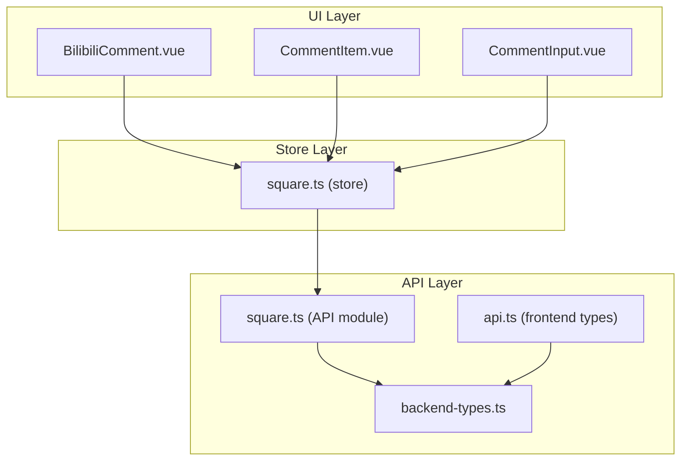
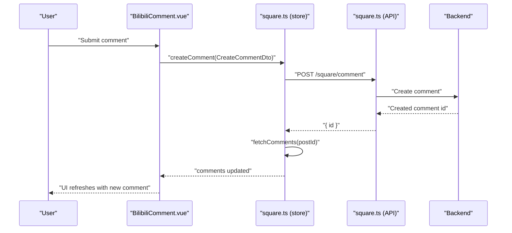
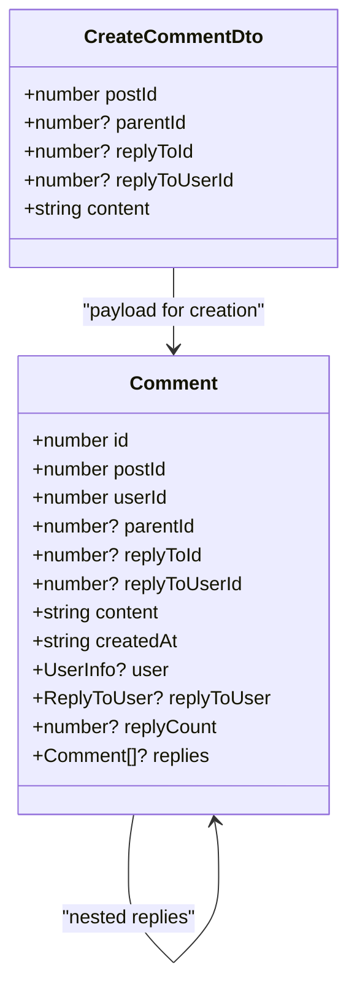
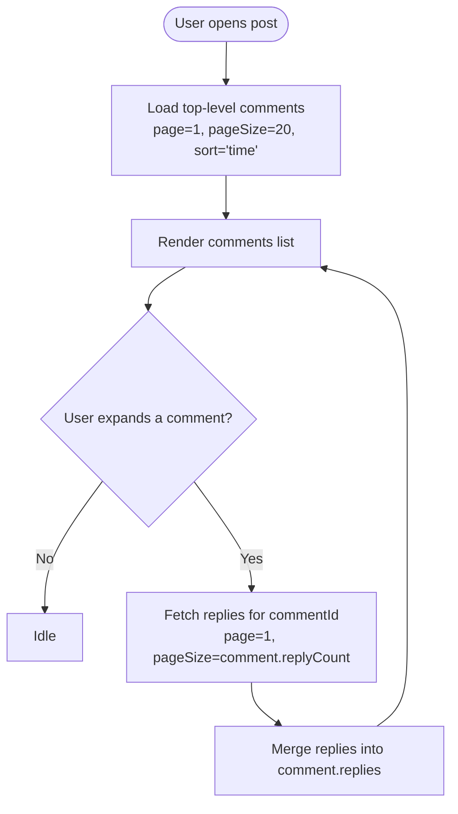
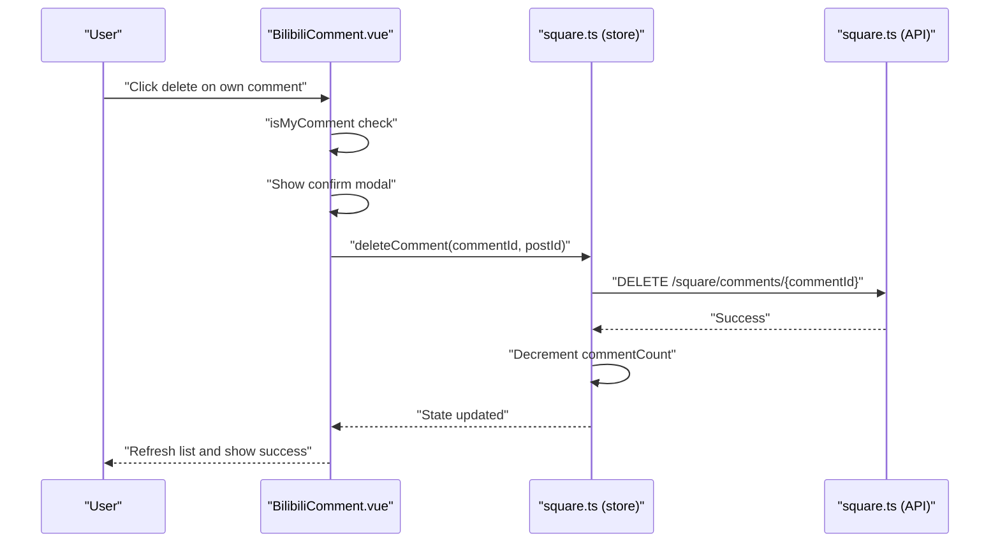
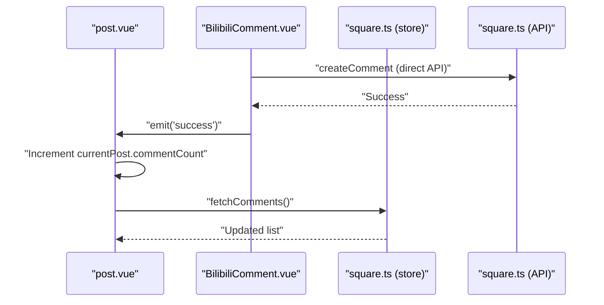
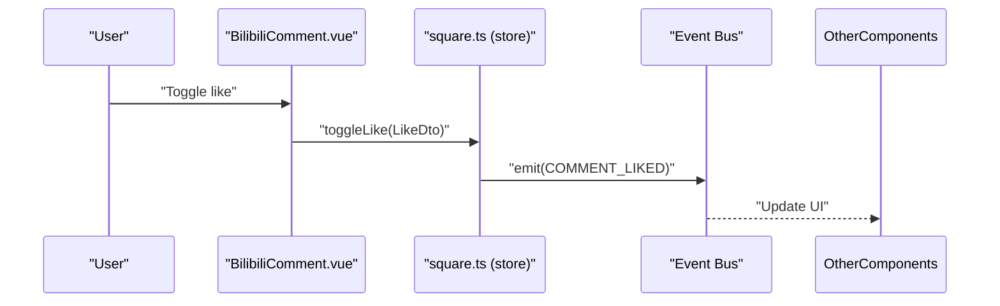
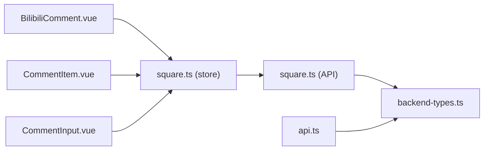

# Comment System

<cite>
**Referenced Files in This Document**
- [BilibiliComment.vue](file://src/components/business/BilibiliComment.vue)
- [CommentItem.vue](file://src/components/business/CommentItem.vue)
- [CommentInput.vue](file://src/components/business/CommentInput.vue)
- [square.ts](file://src/stores/square.ts)
- [square.ts](file://src/api/modules/square.ts)
- [backend-types.ts](file://src/types/api/backend-types.ts)
- [api.ts](file://src/types/api.ts)
- [comment-count-sync.md](file://docs/fix-deploy/comment-count-sync.md)
</cite>

## Table of Contents
1. [Introduction](#introduction)
2. [Project Structure](#project-structure)
3. [Core Components](#core-components)
4. [Architecture Overview](#architecture-overview)
5. [Detailed Component Analysis](#detailed-component-analysis)
6. [Dependency Analysis](#dependency-analysis)
7. [Performance Considerations](#performance-considerations)
8. [Troubleshooting Guide](#troubleshooting-guide)
9. [Conclusion](#conclusion)

## Introduction
This document provides comprehensive documentation for the comment system functionality. It covers the hierarchical comment structure with parent-child relationships and reply chains, the CreateCommentDto interface supporting nested comments and reply-to-user functionality, comment retrieval with pagination and sorting, recursive reply loading, permission checks for deletion, optimistic updates, and integration points for notifications and moderation. It also outlines real-time update considerations and spam prevention measures.

## Project Structure
The comment system spans three layers:
- UI components: render and manage user interactions for comments and replies
- Store module: orchestrates API calls, pagination, sorting, and optimistic updates
- API module and backend types: define DTOs, endpoints, and response structures

**Diagram sources**
- [BilibiliComment.vue:158-444](file://src/components/business/BilibiliComment.vue#L158-L444)
- [CommentItem.vue:47-111](file://src/components/business/CommentItem.vue#L47-L111)
- [CommentInput.vue:20-74](file://src/components/business/CommentInput.vue#L20-L74)
- [square.ts:13-151](file://src/stores/square.ts#L13-L151)
- [square.ts:43-97](file://src/api/modules/square.ts#L43-L97)
- [backend-types.ts:472-485](file://src/types/api/backend-types.ts#L472-L485)
- [api.ts:57-73](file://src/types/api.ts#L57-L73)

**Section sources**
- [BilibiliComment.vue:158-444](file://src/components/business/BilibiliComment.vue#L158-L444)
- [CommentItem.vue:47-111](file://src/components/business/CommentItem.vue#L47-L111)
- [CommentInput.vue:20-74](file://src/components/business/CommentInput.vue#L20-L74)
- [square.ts:13-151](file://src/stores/square.ts#L13-L151)
- [square.ts:43-97](file://src/api/modules/square.ts#L43-L97)
- [backend-types.ts:472-485](file://src/types/api/backend-types.ts#L472-L485)
- [api.ts:57-73](file://src/types/api.ts#L57-L73)

## Core Components
- BilibiliComment.vue: Full-featured comment list with nested replies, pagination, sorting, reply chaining, likes, and deletion controls
- CommentItem.vue: Recursive rendering of comments and replies with lazy-loading of replies
- CommentInput.vue: Lightweight input for posting comments and replies
- square.ts (store): Centralized state for posts, comments, pagination, optimistic updates, and event emission
- square.ts (API): Typed API client for comments, replies, likes, and reports
- backend-types.ts: Backend DTOs and frontend types for CreateCommentDto and Comment model
- api.ts: Frontend type definitions for Comment and related structures

**Section sources**
- [BilibiliComment.vue:158-444](file://src/components/business/BilibiliComment.vue#L158-L444)
- [CommentItem.vue:47-111](file://src/components/business/CommentItem.vue#L47-L111)
- [CommentInput.vue:20-74](file://src/components/business/CommentInput.vue#L20-L74)
- [square.ts:13-151](file://src/stores/square.ts#L13-L151)
- [square.ts:43-97](file://src/api/modules/square.ts#L43-L97)
- [backend-types.ts:472-485](file://src/types/api/backend-types.ts#L472-L485)
- [api.ts:57-73](file://src/types/api.ts#L57-L73)

## Architecture Overview
The comment system follows a unidirectional data flow:
- UI triggers actions via components
- Store executes API requests and updates local state
- UI re-renders based on reactive state
- Optional events propagate to other parts of the app

**Diagram sources**
- [BilibiliComment.vue:240-283](file://src/components/business/BilibiliComment.vue#L240-L283)
- [square.ts:61-74](file://src/stores/square.ts#L61-L74)
- [square.ts:56-57](file://src/api/modules/square.ts#L56-L57)

**Section sources**
- [BilibiliComment.vue:240-283](file://src/components/business/BilibiliComment.vue#L240-L283)
- [square.ts:61-74](file://src/stores/square.ts#L61-L74)
- [square.ts:56-57](file://src/api/modules/square.ts#L56-L57)

## Detailed Component Analysis

### Hierarchical Comment Structure and Reply Chains
- Parent-child relationships are modeled via parentId on comments
- Reply-to-user references are supported via replyToId and replyToUserId
- Replies are loaded lazily per comment when the user expands the thread
- Recursive rendering supports arbitrary nesting levels

**Diagram sources**
- [api.ts:57-73](file://src/types/api.ts#L57-L73)
- [backend-types.ts:472-485](file://src/types/api/backend-types.ts#L472-L485)

**Section sources**
- [api.ts:57-73](file://src/types/api.ts#L57-L73)
- [backend-types.ts:472-485](file://src/types/api/backend-types.ts#L472-L485)

### CreateCommentDto and Nested Comment Support
- Fields: postId, optional parentId, optional replyToId, optional replyToUserId, content
- Supports direct replies to a top-level comment or nested replies to child replies
- replyToUser metadata is included in the returned Comment model for display

Implementation highlights:
- BilibiliComment.vue constructs CreateCommentDto based on current reply context
- CommentInput.vue builds the payload for inline reply scenarios
- Store’s createComment triggers a refetch and optimistic comment count increments

**Section sources**
- [square.ts:18-24](file://src/api/modules/square.ts#L18-L24)
- [BilibiliComment.vue:246-266](file://src/components/business/BilibiliComment.vue#L246-L266)
- [CommentInput.vue:53-67](file://src/components/business/CommentInput.vue#L53-L67)
- [square.ts:61-74](file://src/stores/square.ts#L61-L74)

### Comment Retrieval: Pagination, Sorting, and Recursive Loading
- Pagination: fetchComments accepts page and pageSize parameters
- Sorting: sort parameter supports 'time' and 'hot'
- Recursive reply loading: expand a comment to load all replies up to replyCount

**Diagram sources**
- [BilibiliComment.vue:211-238](file://src/components/business/BilibiliComment.vue#L211-L238)
- [BilibiliComment.vue:301-338](file://src/components/business/BilibiliComment.vue#L301-L338)
- [square.ts:62-74](file://src/api/modules/square.ts#L62-L74)

**Section sources**
- [BilibiliComment.vue:211-238](file://src/components/business/BilibiliComment.vue#L211-L238)
- [BilibiliComment.vue:301-338](file://src/components/business/BilibiliComment.vue#L301-L338)
- [square.ts:62-74](file://src/api/modules/square.ts#L62-L74)

### Deletion Permissions and Soft Delete Mechanisms
- Permission check: isMyComment allows deletion if the current user is the author or the post author
- Hard delete: deleteComment endpoint removes the comment immediately
- Optimistic decrement: Store reduces commentCount locally after delete
- UI feedback: modal confirmation and toast messages

**Diagram sources**
- [BilibiliComment.vue:387-423](file://src/components/business/BilibiliComment.vue#L387-L423)
- [square.ts:76-88](file://src/stores/square.ts#L76-L88)
- [square.ts:59-60](file://src/api/modules/square.ts#L59-L60)

**Section sources**
- [BilibiliComment.vue:204-209](file://src/components/business/BilibiliComment.vue#L204-L209)
- [BilibiliComment.vue:387-423](file://src/components/business/BilibiliComment.vue#L387-L423)
- [square.ts:76-88](file://src/stores/square.ts#L76-L88)
- [square.ts:59-60](file://src/api/modules/square.ts#L59-L60)

### Optimistic Updates and Comment Count Synchronization
- Optimistic increment: Store increases commentCount upon successful createComment
- UI refresh: fetchComments replaces or appends comments depending on pagination reset
- Manual sync note: Direct API calls bypass Store’s optimistic update; manual counter adjustments are needed in pages

**Diagram sources**
- [comment-count-sync.md:114-132](file://docs/fix-deploy/comment-count-sync.md#L114-L132)
- [square.ts:61-74](file://src/stores/square.ts#L61-L74)

**Section sources**
- [comment-count-sync.md:81-132](file://docs/fix-deploy/comment-count-sync.md#L81-L132)
- [square.ts:61-74](file://src/stores/square.ts#L61-L74)

### Real-Time Updates and Notification Integration
- Event bus: Store emits COMMENT_LIKED and POST_LIKED events on like toggles
- UI reacts to events to update counters and state without polling
- Notifications: Integrate with messaging/notification systems by listening to emitted events

**Diagram sources**
- [square.ts:95-128](file://src/stores/square.ts#L95-L128)

**Section sources**
- [square.ts:95-128](file://src/stores/square.ts#L95-L128)

### Examples and Best Practices

- Implementing comment threading:
  - Use parentId to attach replies to top-level comments
  - Use replyToId and replyToUserId to indicate reply targets
  - Expand comments to load replies dynamically

- Mention notifications:
  - On reply submission, include replyToUserId in CreateCommentDto
  - Emit a notification event when replyToUser is set
  - UI can highlight mentions and trigger badge updates

- Comment moderation:
  - Use report endpoint with ReportDto to flag inappropriate content
  - Admin backend routes exist for managing reported content

- Spam prevention:
  - Enforce content length limits (e.g., max 500 characters)
  - Rate limiting on submissions at the UI level (debounce buttons)
  - Backend-side validation and filtering should be enforced server-side

**Section sources**
- [square.ts:31-35](file://src/api/modules/square.ts#L31-L35)
- [BilibiliComment.vue:200-202](file://src/components/business/BilibiliComment.vue#L200-L202)
- [CommentInput.vue:53-67](file://src/components/business/CommentInput.vue#L53-L67)

## Dependency Analysis
The comment system exhibits clear separation of concerns:
- UI components depend on Store for state and API for data
- Store encapsulates API calls and event emission
- API module depends on backend DTOs for typing and request/response shapes
- Types define the contract between frontend and backend

**Diagram sources**
- [BilibiliComment.vue:158-178](file://src/components/business/BilibiliComment.vue#L158-L178)
- [CommentItem.vue:47-56](file://src/components/business/CommentItem.vue#L47-L56)
- [CommentInput.vue:20-33](file://src/components/business/CommentInput.vue#L20-L33)
- [square.ts:13-151](file://src/stores/square.ts#L13-L151)
- [square.ts:43-97](file://src/api/modules/square.ts#L43-L97)
- [backend-types.ts:472-485](file://src/types/api/backend-types.ts#L472-L485)
- [api.ts:57-73](file://src/types/api.ts#L57-L73)

**Section sources**
- [BilibiliComment.vue:158-178](file://src/components/business/BilibiliComment.vue#L158-L178)
- [CommentItem.vue:47-56](file://src/components/business/CommentItem.vue#L47-L56)
- [CommentInput.vue:20-33](file://src/components/business/CommentInput.vue#L20-L33)
- [square.ts:13-151](file://src/stores/square.ts#L13-L151)
- [square.ts:43-97](file://src/api/modules/square.ts#L43-L97)
- [backend-types.ts:472-485](file://src/types/api/backend-types.ts#L472-L485)
- [api.ts:57-73](file://src/types/api.ts#L57-L73)

## Performance Considerations
- Lazy loading of replies: Only fetch replies when a user expands a comment to reduce initial payload size
- Pagination: Keep pageSize reasonable (e.g., 20) and append for infinite scroll
- Optimistic updates: Improve perceived performance by updating UI immediately and reconciling with server response
- Debouncing: Use debounced button states to prevent rapid repeated submissions
- Virtualization: For very long threads, consider virtual scrolling to limit DOM nodes

## Troubleshooting Guide
- Comments not appearing after submission:
  - Ensure createComment is called and fetchComments is invoked afterward
  - Verify optimistic commentCount increments in Store

- Reply count mismatch:
  - Confirm replyCount reflects actual replies and that replies are fetched when expanding
  - Check that UI respects replyCount to avoid unnecessary loads

- Deletion not reflected:
  - Confirm isMyComment permission logic and that deleteComment decrements commentCount
  - Ensure UI refreshes the comment list after deletion

- Manual API calls bypassing Store:
  - Increment/decrement commentCount manually in pages as documented
  - Re-fetch comments to synchronize with backend

**Section sources**
- [comment-count-sync.md:177-261](file://docs/fix-deploy/comment-count-sync.md#L177-L261)
- [BilibiliComment.vue:387-423](file://src/components/business/BilibiliComment.vue#L387-L423)
- [square.ts:76-88](file://src/stores/square.ts#L76-L88)

## Conclusion
The comment system provides a robust, hierarchical structure with nested replies, flexible pagination and sorting, and optimistic updates. It integrates with a store-driven architecture and exposes typed DTOs for backend compatibility. Deletion permissions are enforced at the UI level, and event emissions enable real-time-like updates. For production readiness, complement frontend safeguards with backend validation and consider integrating notification and moderation workflows.