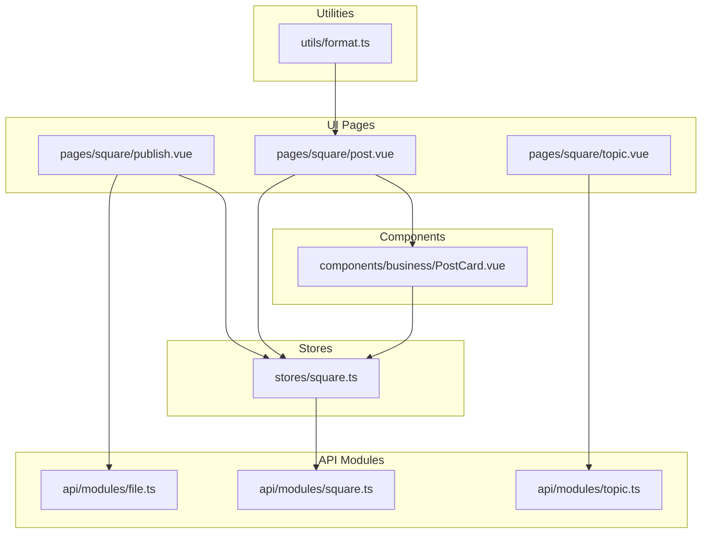
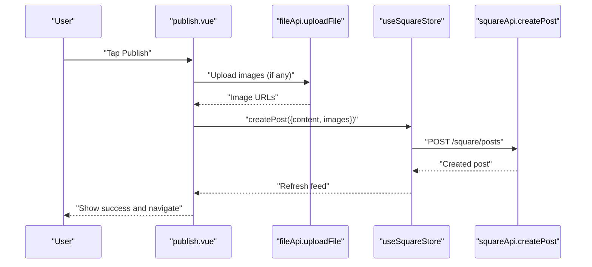
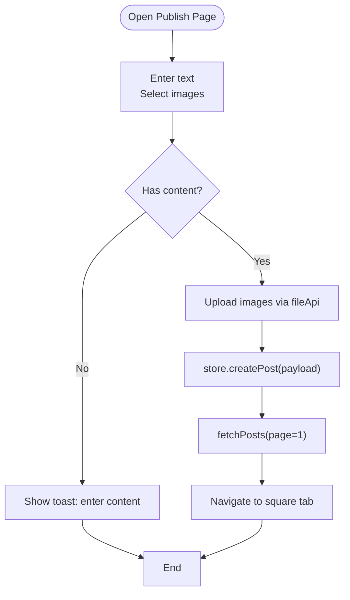
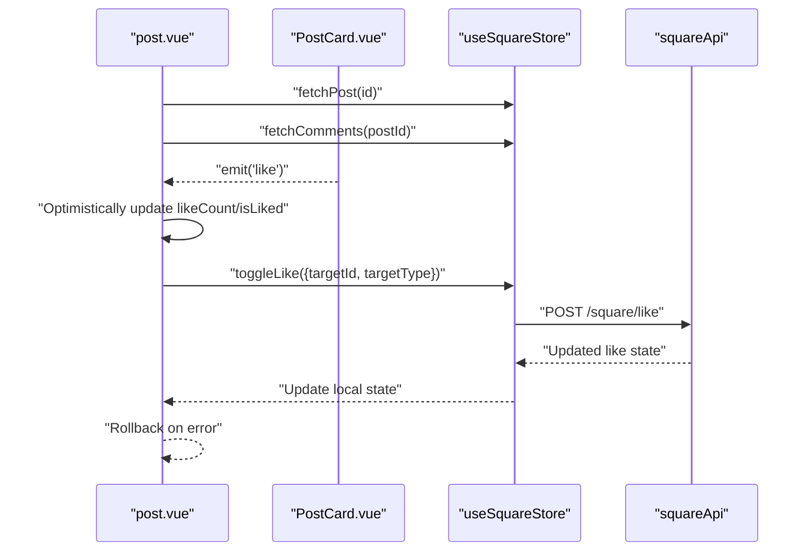
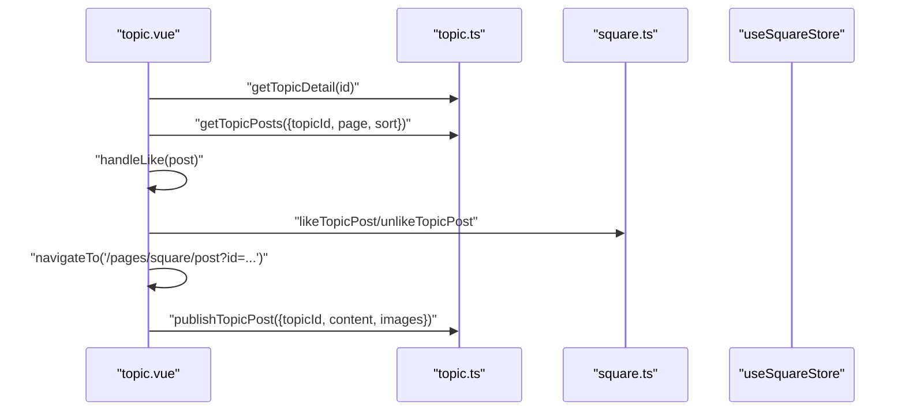
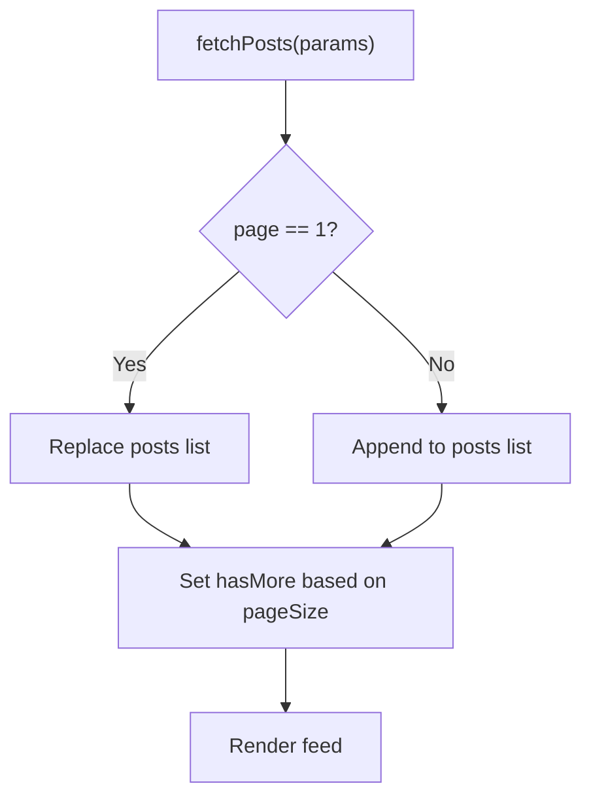
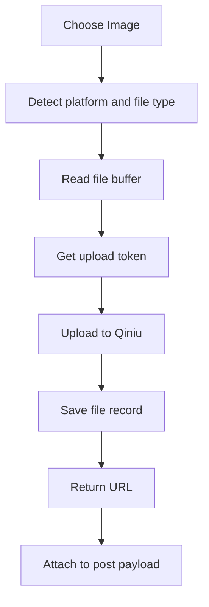
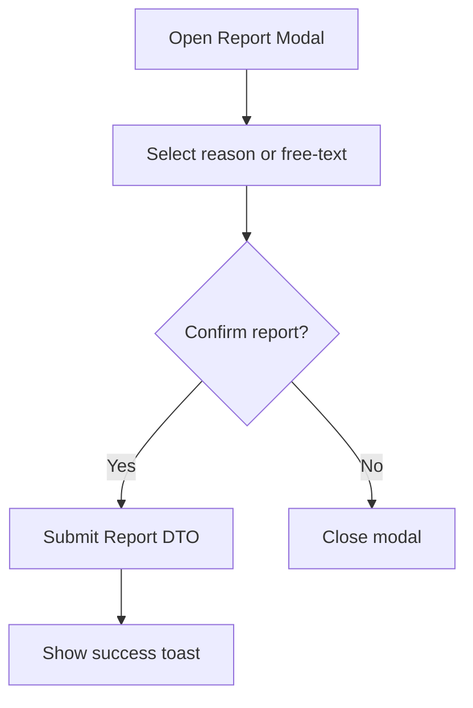
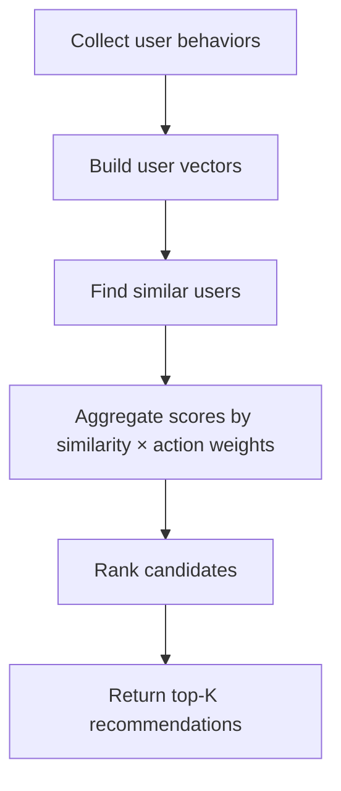
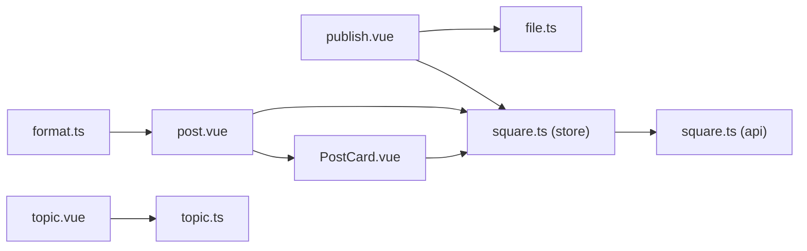

# Content Management

<cite>
**Referenced Files in This Document**
- [publish.vue](file://src/pages/square/publish.vue)
- [post.vue](file://src/pages/square/post.vue)
- [square.ts](file://src/stores/square.ts)
- [square.ts](file://src/api/modules/square.ts)
- [PostCard.vue](file://src/components/business/PostCard.vue)
- [topic.ts](file://src/api/modules/topic.ts)
- [topic.vue](file://src/pages/square/topic.vue)
- [backend-types.ts](file://src/types/api/backend-types.ts)
- [enums.ts](file://src/types/enums.ts)
- [file.ts](file://src/api/modules/file.ts)
- [format.ts](file://src/utils/format.ts)
- [collaborative.ts](file://src/pages/tabbar/home/algorithms/collaborative.ts)
</cite>

## Table of Contents
1. [Introduction](#introduction)
2. [Project Structure](#project-structure)
3. [Core Components](#core-components)
4. [Architecture Overview](#architecture-overview)
5. [Detailed Component Analysis](#detailed-component-analysis)
6. [Dependency Analysis](#dependency-analysis)
7. [Performance Considerations](#performance-considerations)
8. [Troubleshooting Guide](#troubleshooting-guide)
9. [Conclusion](#conclusion)
10. [Appendices](#appendices)

## Introduction
This document describes the content management system for the WeTogether platform’s community square. It covers post creation and publishing, content types (text and media), user interactions (likes, comments, shares), state management for feeds and trending content, the topic system for categorization and discovery, and practical guidance for moderation, reporting, analytics, content formatting, media handling, and recommendation integration.

## Project Structure
The content system spans UI pages, business components, Pinia stores, API modules, and shared utilities:
- Pages: Square feed, post detail, and topic-centric views
- Components: Reusable PostCard and comment input
- Stores: Centralized state for posts, comments, and likes
- APIs: Square and topic endpoints, plus file upload service
- Utilities: Time formatting helpers

**Diagram sources**
- [publish.vue:1-239](file://src/pages/square/publish.vue#L1-L239)
- [post.vue:1-318](file://src/pages/square/post.vue#L1-L318)
- [topic.vue:1-755](file://src/pages/square/topic.vue#L1-L755)
- [PostCard.vue:1-628](file://src/components/business/PostCard.vue#L1-L628)
- [square.ts:1-152](file://src/stores/square.ts#L1-L152)
- [square.ts:1-98](file://src/api/modules/square.ts#L1-L98)
- [topic.ts:1-167](file://src/api/modules/topic.ts#L1-L167)
- [file.ts:1-335](file://src/api/modules/file.ts#L1-L335)
- [format.ts:1-38](file://src/utils/format.ts#L1-L38)

**Section sources**
- [publish.vue:1-239](file://src/pages/square/publish.vue#L1-L239)
- [post.vue:1-318](file://src/pages/square/post.vue#L1-L318)
- [topic.vue:1-755](file://src/pages/square/topic.vue#L1-L755)
- [PostCard.vue:1-628](file://src/components/business/PostCard.vue#L1-L628)
- [square.ts:1-152](file://src/stores/square.ts#L1-L152)
- [square.ts:1-98](file://src/api/modules/square.ts#L1-L98)
- [topic.ts:1-167](file://src/api/modules/topic.ts#L1-L167)
- [file.ts:1-335](file://src/api/modules/file.ts#L1-L335)
- [format.ts:1-38](file://src/utils/format.ts#L1-L38)

## Core Components
- Post creation and publishing:
  - Text input with character limits
  - Media selection and upload via file API
  - Optimistic updates and navigation after success
- Post detail and interactions:
  - PostCard rendering with images, likes, comments, and actions
  - Like toggling with optimistic UI updates and event bus notifications
  - Reporting and deletion flows
  - Comments section with nested replies and counters
- Topic system:
  - Topic detail with stats, cover carousel, join/leave
  - Topic-specific posts feed with tabs (latest/hot)
  - Publishing within topics mapped to square posts with topic association
- State management:
  - Square store manages posts, current post, comments, pagination flags, and likes
  - Event bus emits like events for cross-component synchronization
- File/media handling:
  - Upload token retrieval, multi-platform file reading, and Qiniu upload
  - Image preview and placeholder handling
- Formatting and UX:
  - Relative time formatting for posts and comments
  - Action sheets for share, report, and delete

**Section sources**
- [publish.vue:40-135](file://src/pages/square/publish.vue#L40-L135)
- [PostCard.vue:96-290](file://src/components/business/PostCard.vue#L96-L290)
- [post.vue:32-175](file://src/pages/square/post.vue#L32-L175)
- [square.ts:13-151](file://src/stores/square.ts#L13-L151)
- [topic.vue:149-501](file://src/pages/square/topic.vue#L149-L501)
- [file.ts:90-230](file://src/api/modules/file.ts#L90-L230)
- [format.ts:8-38](file://src/utils/format.ts#L8-L38)

## Architecture Overview
The content system follows a unidirectional data flow:
- UI triggers actions (publish, like, comment, share, report)
- Store orchestrates API calls and updates local state
- Components render based on store state and react to events
- File API handles media uploads to cloud storage

**Diagram sources**
- [publish.vue:84-134](file://src/pages/square/publish.vue#L84-L134)
- [file.ts:90-230](file://src/api/modules/file.ts#L90-L230)
- [square.ts:44-45](file://src/api/modules/square.ts#L44-L45)
- [square.ts:42-44](file://src/stores/square.ts#L42-L44)

## Detailed Component Analysis

### Post Creation and Publishing
- Text posts:
  - Character limit enforced in UI; empty content prevented before submission
- Media uploads:
  - Choose images from album/camera; supports H5 tempFiles/base64 fallback
  - Upload to cloud via file API; collect URLs for post payload
- Publishing:
  - Call store to create post; refresh feed; navigate to square tab
  - Trigger NPS after first post

**Diagram sources**
- [publish.vue:55-134](file://src/pages/square/publish.vue#L55-L134)

**Section sources**
- [publish.vue:40-135](file://src/pages/square/publish.vue#L40-L135)
- [file.ts:90-230](file://src/api/modules/file.ts#L90-L230)
- [square.ts:42-44](file://src/stores/square.ts#L42-L44)

### Post Detail, Likes, Comments, Shares, and Reporting
- Post detail loads post and comments concurrently
- Like toggling:
  - Optimistic UI update
  - Call server endpoint; rollback on failure
  - Emit events for cross-component sync
- Comments:
  - Create and delete update counters and lists
  - Nested replies supported via dedicated endpoint
- Reporting:
  - Modal-driven input with character limits
  - Submit report DTO to backend
- Sharing:
  - Action sheet with platform-specific flows

**Diagram sources**
- [post.vue:51-99](file://src/pages/square/post.vue#L51-L99)
- [PostCard.vue:162-178](file://src/components/business/PostCard.vue#L162-L178)
- [square.ts:95-128](file://src/stores/square.ts#L95-L128)
- [square.ts:86-87](file://src/api/modules/square.ts#L86-L87)

**Section sources**
- [post.vue:32-175](file://src/pages/square/post.vue#L32-L175)
- [PostCard.vue:96-290](file://src/components/business/PostCard.vue#L96-L290)
- [square.ts:52-88](file://src/stores/square.ts#L52-L88)
- [square.ts:56-96](file://src/api/modules/square.ts#L56-L96)

### Topic System for Categorization and Discovery
- Topic detail:
  - Cover carousel, stats, join/leave toggle with optimistic updates
- Topic posts:
  - Tabs for latest/hot sorting
  - Infinite scroll with abort controller to cancel stale requests
  - Like/unlike mapped to square endpoints
- Publishing within topics:
  - Navigate to publish page with topic context
  - Backend creates a square post with topic association

**Diagram sources**
- [topic.vue:209-311](file://src/pages/square/topic.vue#L209-L311)
- [topic.ts:63-110](file://src/api/modules/topic.ts#L63-L110)
- [square.ts:89-93](file://src/api/modules/square.ts#L89-L93)

**Section sources**
- [topic.vue:149-501](file://src/pages/square/topic.vue#L149-L501)
- [topic.ts:1-167](file://src/api/modules/topic.ts#L1-L167)

### State Management for Feeds, User Posts, and Trending
- Square store:
  - Feed pagination with hasMore flag
  - Current post and comments lists
  - Toggle like updates both post and comment items
  - Event emission for external listeners
- Trending:
  - Sorting by hot/latest in feed and topic posts
  - Hot scores present in backend post model

**Diagram sources**
- [square.ts:20-35](file://src/stores/square.ts#L20-L35)

**Section sources**
- [square.ts:13-151](file://src/stores/square.ts#L13-L151)
- [backend-types.ts:429-459](file://src/types/api/backend-types.ts#L429-L459)

### Content Types and Media Handling
- Supported content:
  - Text posts with optional image attachments
  - Topic-associated posts
- Media pipeline:
  - Detect platform (H5 vs UniApp)
  - Resolve file buffer from blob/data URL/temp path
  - Obtain upload token and upload to Qiniu
  - Save file record and return URL for rendering

**Diagram sources**
- [file.ts:112-230](file://src/api/modules/file.ts#L112-L230)

**Section sources**
- [publish.vue:55-107](file://src/pages/square/publish.vue#L55-L107)
- [file.ts:90-230](file://src/api/modules/file.ts#L90-L230)

### Content Moderation and Reporting
- Reporting:
  - Modal with predefined reasons and free-text input
  - DTO includes reason and optional description
- Backend types:
  - ReportReason and PostReport structures
- Deletion:
  - Own posts can be deleted from detail or card actions

**Diagram sources**
- [PostCard.vue:226-289](file://src/components/business/PostCard.vue#L226-L289)
- [post.vue:134-154](file://src/pages/square/post.vue#L134-L154)
- [backend-types.ts:509-535](file://src/types/api/backend-types.ts#L509-L535)

**Section sources**
- [PostCard.vue:68-92](file://src/components/business/PostCard.vue#L68-L92)
- [post.vue:134-154](file://src/pages/square/post.vue#L134-L154)
- [backend-types.ts:48-51](file://src/types/api/backend-types.ts#L48-L51)
- [backend-types.ts:509-535](file://src/types/api/backend-types.ts#L509-L535)

### Content Analytics and Recommendations
- Analytics:
  - Backend exposes viewCount, likeCount, commentCount, shareCount, and hotScore per post
  - Use hotScore and counts for ranking and discovery
- Recommendations:
  - Collaborative filtering computes user vectors and similarity
  - Scoring aggregates similar-user preferences weighted by action type
  - Mix strategy combines multiple algorithms and applies diversity and cold-start handling

**Diagram sources**
- [collaborative.ts:36-221](file://src/pages/tabbar/home/algorithms/collaborative.ts#L36-L221)

**Section sources**
- [backend-types.ts:449-459](file://src/types/api/backend-types.ts#L449-L459)
- [collaborative.ts:22-28](file://src/pages/tabbar/home/algorithms/collaborative.ts#L22-L28)
- [collaborative.ts:170-221](file://src/pages/tabbar/home/algorithms/collaborative.ts#L170-L221)

## Dependency Analysis
- UI depends on:
  - PostCard for rendering and actions
  - Square store for state and API orchestration
  - File API for media uploads
- Store depends on:
  - Square API module for CRUD and interactions
  - Event bus for cross-component updates
- Topic page depends on:
  - Topic API for detail and posts
  - Square API for likes and publishing
- Utilities:
  - format.ts for relative time display

**Diagram sources**
- [publish.vue:42-44](file://src/pages/square/publish.vue#L42-L44)
- [post.vue:34-40](file://src/pages/square/post.vue#L34-L40)
- [PostCard.vue:99-100](file://src/components/business/PostCard.vue#L99-L100)
- [square.ts:1-13](file://src/stores/square.ts#L1-L13)
- [square.ts:1-11](file://src/api/modules/square.ts#L1-L11)
- [topic.ts:1-167](file://src/api/modules/topic.ts#L1-L167)
- [format.ts:1-38](file://src/utils/format.ts#L1-L38)

**Section sources**
- [square.ts:1-13](file://src/stores/square.ts#L1-L13)
- [square.ts:1-11](file://src/api/modules/square.ts#L1-L11)
- [topic.ts:1-167](file://src/api/modules/topic.ts#L1-L167)
- [file.ts:1-335](file://src/api/modules/file.ts#L1-L335)

## Performance Considerations
- Optimize rendering:
  - Lazy-load images in PostCard and hide placeholders after load
  - Grid layout for media thumbnails
- Network efficiency:
  - AbortController to cancel stale topic post requests during rapid tab switching or refresh
  - Paginate feeds and topic posts with hasMore checks
- UI responsiveness:
  - Optimistic updates for likes and joins with rollback on failure
  - Debounce or batch UI updates when toggling multiple interactions

**Section sources**
- [PostCard.vue:154-160](file://src/components/business/PostCard.vue#L154-L160)
- [topic.vue:240-311](file://src/pages/square/topic.vue#L240-L311)
- [square.ts:95-128](file://src/stores/square.ts#L95-L128)

## Troubleshooting Guide
- Publish failures:
  - Verify content presence and network connectivity
  - Inspect upload errors and show user-friendly messages
- Like toggling:
  - On server error, revert optimistic UI and notify user
- Topic operations:
  - Handle 404/403 gracefully; inform user about invalid topic or access restrictions
- Image previews:
  - Ensure image URLs are valid and accessible

**Section sources**
- [publish.vue:124-133](file://src/pages/square/publish.vue#L124-L133)
- [post.vue:89-98](file://src/pages/square/post.vue#L89-L98)
- [topic.vue:214-238](file://src/pages/square/topic.vue#L214-L238)

## Conclusion
The WeTogether content management system integrates a robust UI for creating and interacting with posts, a reliable store-driven state model, and a flexible topic-based discovery mechanism. With built-in moderation and reporting, media handling via cloud storage, and recommendation-ready metrics, the platform supports scalable community engagement while maintaining responsive UX and clear operational controls.

## Appendices

### API Endpoints Summary
- Square posts
  - POST /square/posts (create)
  - GET /square/posts (list)
  - GET /square/posts/:id (detail)
  - DELETE /square/posts/:id (delete)
- Comments
  - POST /square/comment (create)
  - DELETE /square/comments/:id (delete)
  - GET /square/posts/:postId/comments (list)
  - GET /square/comments/:id/replies (replies)
- Interactions
  - POST /square/like (toggle like)
  - POST /square/posts/:postId/like (like)
  - DELETE /square/posts/:postId/like (unlike)
- Reporting
  - POST /square/report (report)
- Topics
  - GET /topics/:id (detail)
  - GET /topics/:id/posts (posts)
  - POST /topics/:id/follow (join)
  - DELETE /topics/:id/follow (leave)
  - POST /square/posts (publish topic post)
  - GET /topics/search (search)
  - GET /topics/hot (hot topics)

**Section sources**
- [square.ts:44-96](file://src/api/modules/square.ts#L44-L96)
- [topic.ts:63-166](file://src/api/modules/topic.ts#L63-L166)

### Content Types and Enumerations
- PostStatus: normal, deleted, violation
- ReportReason: pornography, violence, ad, fraud, other
- LikeTargetType: post, comment
- FileUploadType: square, avatar, certificate, album

**Section sources**
- [backend-types.ts:37-51](file://src/types/api/backend-types.ts#L37-L51)
- [enums.ts:18-24](file://src/types/enums.ts#L18-L24)
- [backend-types.ts:77-79](file://src/types/api/backend-types.ts#L77-L79)