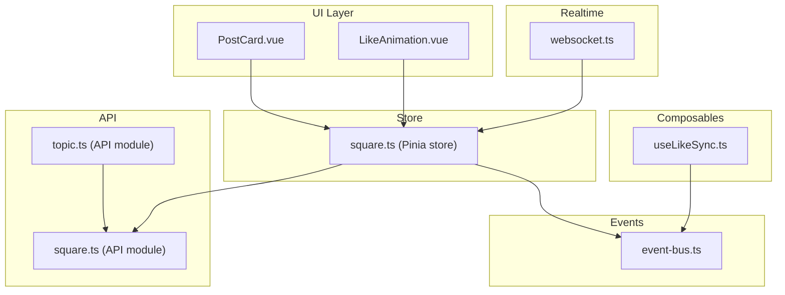
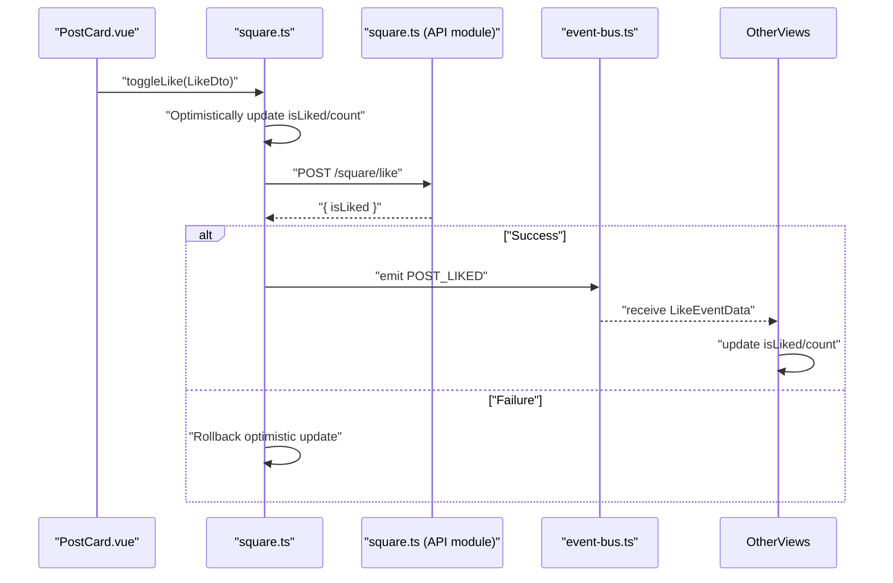
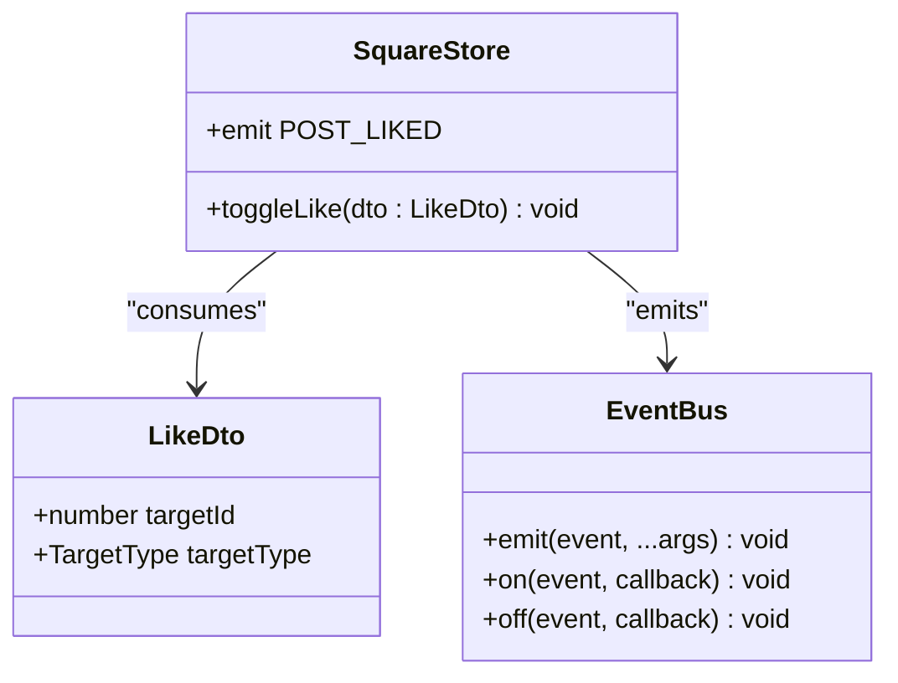
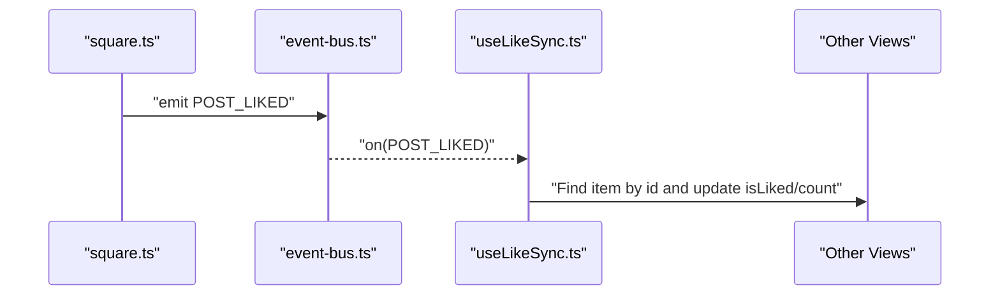
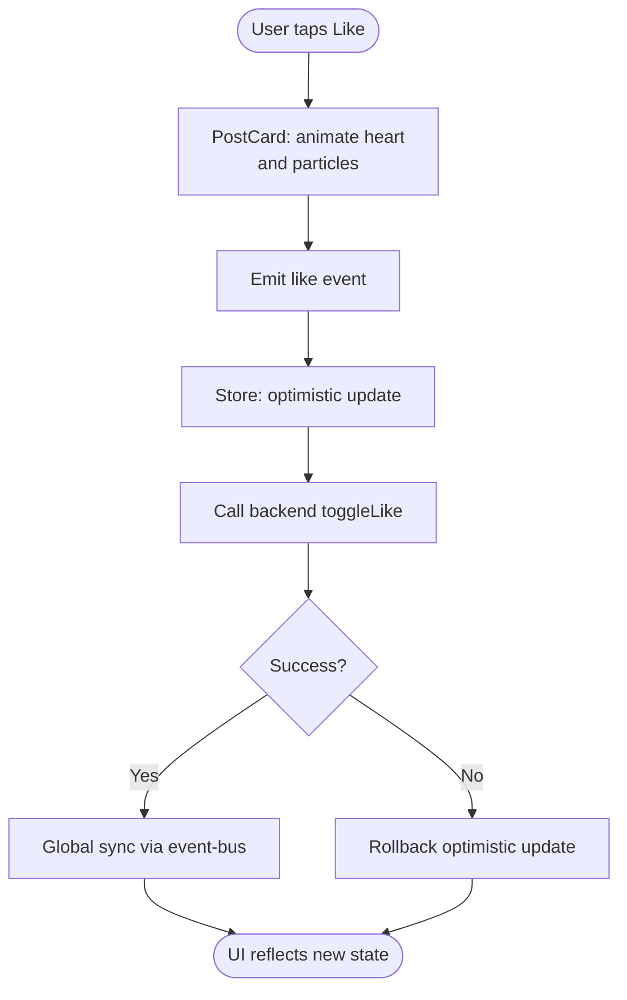
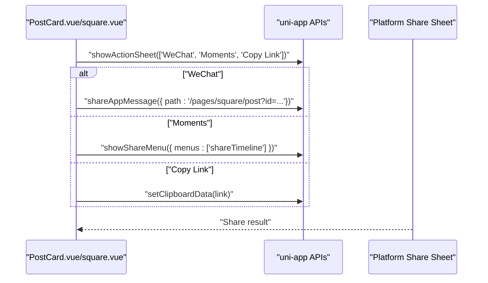
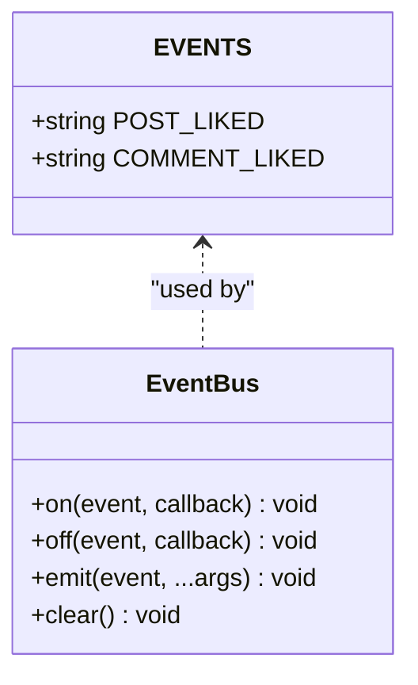
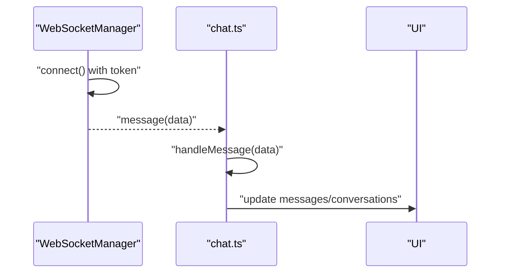
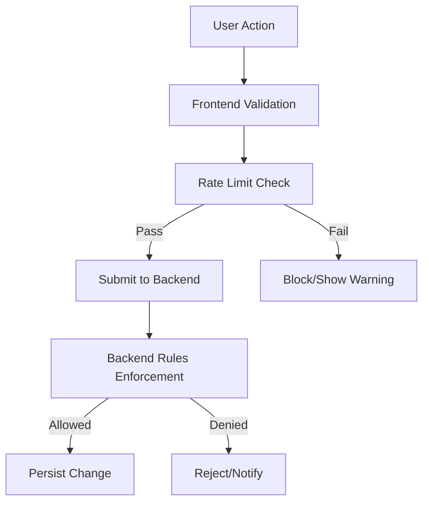
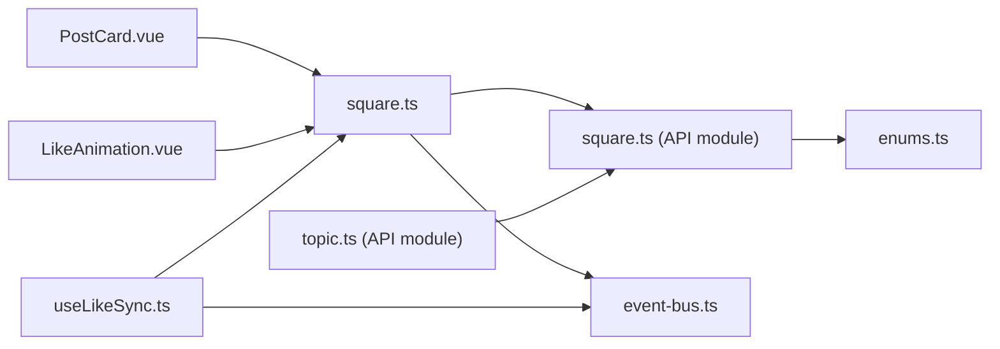

# Interaction Mechanics

<cite>
**Referenced Files in This Document**
- [LikeAnimation.vue](file://src/components/common/LikeAnimation.vue)
- [PostCard.vue](file://src/components/business/PostCard.vue)
- [useLikeSync.ts](file://src/composables/useLikeSync.ts)
- [event-bus.ts](file://src/utils/event-bus.ts)
- [square.ts](file://src/stores/square.ts)
- [square.vue](file://src/pages/tabbar/square.vue)
- [square.ts (API module)](file://src/api/modules/square.ts)
- [enums.ts](file://src/types/enums.ts)
- [topic.ts](file://src/api/modules/topic.ts)
- [websocket.ts](file://src/utils/websocket.ts)
- [chat.ts](file://src/stores/chat.ts)
- [nps-implementation.md](file://docs/nps-implementation.md)
- [nps-final-report.md](file://docs/nps-final-report.md)
</cite>

## Table of Contents
1. [Introduction](#introduction)
2. [Project Structure](#project-structure)
3. [Core Components](#core-components)
4. [Architecture Overview](#architecture-overview)
5. [Detailed Component Analysis](#detailed-component-analysis)
6. [Dependency Analysis](#dependency-analysis)
7. [Performance Considerations](#performance-considerations)
8. [Troubleshooting Guide](#troubleshooting-guide)
9. [Conclusion](#conclusion)
10. [Appendices](#appendices)

## Introduction
This document explains the interaction mechanics for likes, shares, and user engagement features across the frontend. It covers:
- The LikeDto interface and real-time like synchronization across multiple devices
- Interaction event system, animation triggers, and user feedback mechanisms
- Share functionality with platform-specific integrations and deep linking
- Examples of implementing engagement analytics, streak tracking, and social proof displays
- Anti-spam measures, rate limiting, and interaction validation
- Cross-component communication for real-time updates and state synchronization

## Project Structure
The interaction mechanics span several layers:
- UI components for likes and shares
- Composables for cross-page synchronization
- Store for optimistic updates and event emission
- API module for backend interactions
- Global event bus for cross-instance updates
- Optional WebSocket infrastructure for real-time server events

**Diagram sources**
- [PostCard.vue:1-628](file://src/components/business/PostCard.vue#L1-L628)
- [LikeAnimation.vue:1-236](file://src/components/common/LikeAnimation.vue#L1-L236)
- [useLikeSync.ts:1-49](file://src/composables/useLikeSync.ts#L1-L49)
- [square.ts:1-152](file://src/stores/square.ts#L1-L152)
- [square.ts (API module):1-98](file://src/api/modules/square.ts#L1-L98)
- [topic.ts:1-167](file://src/api/modules/topic.ts#L1-L167)
- [event-bus.ts:1-49](file://src/utils/event-bus.ts#L1-L49)
- [websocket.ts:1-170](file://src/utils/websocket.ts#L1-L170)

**Section sources**
- [PostCard.vue:1-628](file://src/components/business/PostCard.vue#L1-L628)
- [LikeAnimation.vue:1-236](file://src/components/common/LikeAnimation.vue#L1-L236)
- [useLikeSync.ts:1-49](file://src/composables/useLikeSync.ts#L1-L49)
- [square.ts:1-152](file://src/stores/square.ts#L1-L152)
- [square.ts (API module):1-98](file://src/api/modules/square.ts#L1-L98)
- [topic.ts:1-167](file://src/api/modules/topic.ts#L1-L167)
- [event-bus.ts:1-49](file://src/utils/event-bus.ts#L1-L49)
- [websocket.ts:1-170](file://src/utils/websocket.ts#L1-L170)

## Core Components
- LikeDto interface: Defines the payload for toggling likes on posts and comments.
- PostCard: Renders a post card with like/share/comment actions, animations, and feedback.
- LikeAnimation: A reusable component for animated heart icons with particle effects and numeric counters.
- useLikeSync: Synchronizes like state across multiple pages via a global event bus.
- square store: Manages optimistic UI updates, emits events, and coordinates with the backend.
- event-bus: Centralized pub/sub for cross-instance updates.
- square API module: Exposes endpoints for creating posts, fetching comments, toggling likes, and reporting.
- topic API module: Provides topic-related endpoints including like toggles for topic posts.

**Section sources**
- [square.ts (API module):26-35](file://src/api/modules/square.ts#L26-L35)
- [PostCard.vue:48-66](file://src/components/business/PostCard.vue#L48-L66)
- [LikeAnimation.vue:30-58](file://src/components/common/LikeAnimation.vue#L30-L58)
- [useLikeSync.ts:5-10](file://src/composables/useLikeSync.ts#L5-L10)
- [square.ts:95-128](file://src/stores/square.ts#L95-L128)
- [event-bus.ts:40-48](file://src/utils/event-bus.ts#L40-L48)
- [topic.ts:134-145](file://src/api/modules/topic.ts#L134-L145)

## Architecture Overview
The interaction flow for likes follows an optimistic UI pattern:
- UI triggers a like action
- Store optimistically updates local state
- Store calls backend to persist the change
- On success, store emits a global like event
- Other views subscribe to the event and update their state accordingly

**Diagram sources**
- [PostCard.vue:162-185](file://src/components/business/PostCard.vue#L162-L185)
- [square.ts:95-128](file://src/stores/square.ts#L95-L128)
- [square.ts (API module):86-87](file://src/api/modules/square.ts#L86-L87)
- [event-bus.ts:26-31](file://src/utils/event-bus.ts#L26-L31)

**Section sources**
- [PostCard.vue:162-185](file://src/components/business/PostCard.vue#L162-L185)
- [square.ts:95-128](file://src/stores/square.ts#L95-L128)
- [square.ts (API module):86-87](file://src/api/modules/square.ts#L86-L87)
- [event-bus.ts:26-31](file://src/utils/event-bus.ts#L26-L31)

## Detailed Component Analysis

### LikeDto Interface and Toggle Flow
- LikeDto defines targetId and targetType for likes.
- The store’s toggleLike method persists the change and emits a global event.
- The event carries targetId, targetType, isLiked, and likeCount for synchronization.

**Diagram sources**
- [square.ts (API module):26-29](file://src/api/modules/square.ts#L26-L29)
- [square.ts:95-128](file://src/stores/square.ts#L95-L128)
- [event-bus.ts:26-31](file://src/utils/event-bus.ts#L26-L31)

**Section sources**
- [square.ts (API module):26-29](file://src/api/modules/square.ts#L26-L29)
- [square.ts:95-128](file://src/stores/square.ts#L95-L128)
- [enums.ts:13-16](file://src/types/enums.ts#L13-L16)

### Real-time Like Synchronization Across Devices
- useLikeSync listens for POST_LIKED/COMMENT_LIKED events and updates matching items by id.
- It supports both arrays and objects with a list property, and allows custom idField.
- This enables real-time updates across multiple pages and instances.

**Diagram sources**
- [useLikeSync.ts:25-37](file://src/composables/useLikeSync.ts#L25-L37)
- [event-bus.ts:39-48](file://src/utils/event-bus.ts#L39-L48)
- [square.ts:105-112](file://src/stores/square.ts#L105-L112)

**Section sources**
- [useLikeSync.ts:16-48](file://src/composables/useLikeSync.ts#L16-L48)
- [square.ts:105-112](file://src/stores/square.ts#L105-L112)

### Animation Triggers and User Feedback
- PostCard triggers a local animation on like clicks and emits a like event.
- LikeAnimation encapsulates heart bounce, scaling, particle bursts, and numeric counter changes.
- Both components provide immediate visual feedback while the backend operation resolves.

**Diagram sources**
- [PostCard.vue:162-178](file://src/components/business/PostCard.vue#L162-L178)
- [LikeAnimation.vue:68-100](file://src/components/common/LikeAnimation.vue#L68-L100)
- [square.ts:95-128](file://src/stores/square.ts#L95-L128)

**Section sources**
- [PostCard.vue:162-178](file://src/components/business/PostCard.vue#L162-L178)
- [LikeAnimation.vue:68-100](file://src/components/common/LikeAnimation.vue#L68-L100)
- [square.ts:95-128](file://src/stores/square.ts#L95-L128)

### Share Functionality and Deep Linking
- Share actions are handled in the square page and PostCard.
- Platform-specific sharing uses uni-app APIs:
  - WeChat mini-program share via uni.shareAppMessage and uni.showShareMenu
  - Copy link to clipboard with uni.setClipboardData
- Deep links navigate to post detail pages with query parameters.

**Diagram sources**
- [PostCard.vue:184-186](file://src/components/business/PostCard.vue#L184-L186)
- [square.vue:193-284](file://src/pages/tabbar/square.vue#L193-L284)

**Section sources**
- [PostCard.vue:184-186](file://src/components/business/PostCard.vue#L184-L186)
- [square.vue:193-284](file://src/pages/tabbar/square.vue#L193-L284)

### Interaction Event System and Cross-Component Communication
- EVENTS defines constants for post/comment likes and other user actions.
- event-bus provides on/off/emit/clear for decoupled communication.
- square store emits events after successful toggles, enabling real-time updates.

**Diagram sources**
- [event-bus.ts:40-48](file://src/utils/event-bus.ts#L40-L48)
- [event-bus.ts:6-36](file://src/utils/event-bus.ts#L6-L36)

**Section sources**
- [event-bus.ts:40-48](file://src/utils/event-bus.ts#L40-L48)
- [square.ts:105-112](file://src/stores/square.ts#L105-L112)

### Real-Time Updates via WebSocket
- WebSocketManager connects to the backend with token auth and handles connect/disconnect/receive.
- The chat store demonstrates receiving and processing server messages, deduplication, and optimistic updates.
- While the like system primarily uses HTTP, WebSocket can complement real-time notifications.

**Diagram sources**
- [websocket.ts:15-91](file://src/utils/websocket.ts#L15-L91)
- [chat.ts:31-66](file://src/stores/chat.ts#L31-L66)

**Section sources**
- [websocket.ts:15-91](file://src/utils/websocket.ts#L15-L91)
- [chat.ts:31-66](file://src/stores/chat.ts#L31-L66)

### Engagement Analytics, Streak Tracking, and Social Proof
- Engagement analytics can be derived from:
  - Like counts per post
  - Comment counts per post
  - Share counts per post (available in topic post model)
- Streak tracking can be implemented by:
  - Recording daily active dates per user
  - Computing consecutive day sequences
  - Triggering UI badges or cards for milestones
- Social proof displays:
  - Show “X liked this” and “Y others are viewing”
  - Display recent likers avatars or names

Note: These are conceptual extensions based on existing data models and UI patterns.

[No sources needed since this section doesn't analyze specific files]

### Anti-Spam Measures, Rate Limiting, and Validation
- Frontend validation:
  - Debounce rapid clicks
  - Disable buttons during network requests
  - Validate input lengths (e.g., report reasons)
- Backend controls:
  - Frequency caps (e.g., NPS rules)
  - Scene-based delays (e.g., after first post, after add friend)
  - User eligibility checks (e.g., registration days)

**Section sources**
- [nps-implementation.md:69-86](file://docs/nps-implementation.md#L69-L86)
- [nps-final-report.md:215-293](file://docs/nps-final-report.md#L215-L293)

## Dependency Analysis
Key dependencies and coupling:
- PostCard depends on store for state and emits user actions.
- square store depends on API module and event-bus.
- useLikeSync depends on event-bus and square store state.
- enums.ts centralizes TargetType used by LikeDto.

**Diagram sources**
- [PostCard.vue:102-113](file://src/components/business/PostCard.vue#L102-L113)
- [square.ts:134-150](file://src/stores/square.ts#L134-L150)
- [square.ts (API module):1-16](file://src/api/modules/square.ts#L1-L16)
- [useLikeSync.ts:3-4](file://src/composables/useLikeSync.ts#L3-L4)
- [enums.ts:13-16](file://src/types/enums.ts#L13-L16)
- [topic.ts:134-145](file://src/api/modules/topic.ts#L134-L145)

**Section sources**
- [PostCard.vue:102-113](file://src/components/business/PostCard.vue#L102-L113)
- [square.ts:134-150](file://src/stores/square.ts#L134-L150)
- [square.ts (API module):1-16](file://src/api/modules/square.ts#L1-L16)
- [useLikeSync.ts:3-4](file://src/composables/useLikeSync.ts#L3-L4)
- [enums.ts:13-16](file://src/types/enums.ts#L13-L16)
- [topic.ts:134-145](file://src/api/modules/topic.ts#L134-L145)

## Performance Considerations
- Prefer optimistic UI updates to reduce perceived latency.
- Debounce frequent interactions (e.g., rapid likes) to avoid excessive network calls.
- Virtualize long lists to minimize DOM overhead.
- Use shallow refs and computed properties to limit reactivity work.
- Cache frequently accessed data (e.g., user info) to reduce redundant requests.

[No sources needed since this section provides general guidance]

## Troubleshooting Guide
Common issues and resolutions:
- Like state not updating across pages:
  - Ensure useLikeSync is mounted and listening for the correct event type.
  - Verify targetId matches and idField is configured correctly.
- Duplicate or stale likes after rollback:
  - Confirm optimistic rollback occurs on failure and UI reflects original state.
- Share not working on non-WeChat platforms:
  - Check platform guards and show appropriate toasts.
- WebSocket disconnections:
  - Inspect connection lifecycle and reconnection attempts; ensure token availability.

**Section sources**
- [useLikeSync.ts:25-37](file://src/composables/useLikeSync.ts#L25-L37)
- [square.ts:175-184](file://src/stores/square.ts#L175-L184)
- [square.vue:193-284](file://src/pages/tabbar/square.vue#L193-L284)
- [websocket.ts:78-91](file://src/utils/websocket.ts#L78-L91)

## Conclusion
The interaction mechanics combine optimistic UI updates, a robust event bus for cross-component synchronization, and platform-aware sharing. By leveraging LikeDto, event emissions, and composable synchronization hooks, the system delivers responsive and consistent user experiences. Extending these patterns with backend-driven rate limits and analytics enables scalable engagement features.

[No sources needed since this section summarizes without analyzing specific files]

## Appendices

### Example: Implementing Engagement Analytics
- Track per-post metrics: likes, comments, shares
- Aggregate daily activity to compute streaks
- Surface social proof (recent likers, trending topics)

[No sources needed since this section provides general guidance]