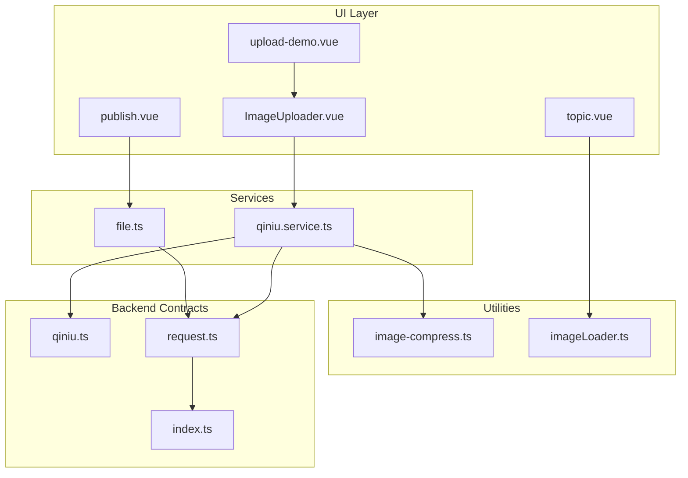
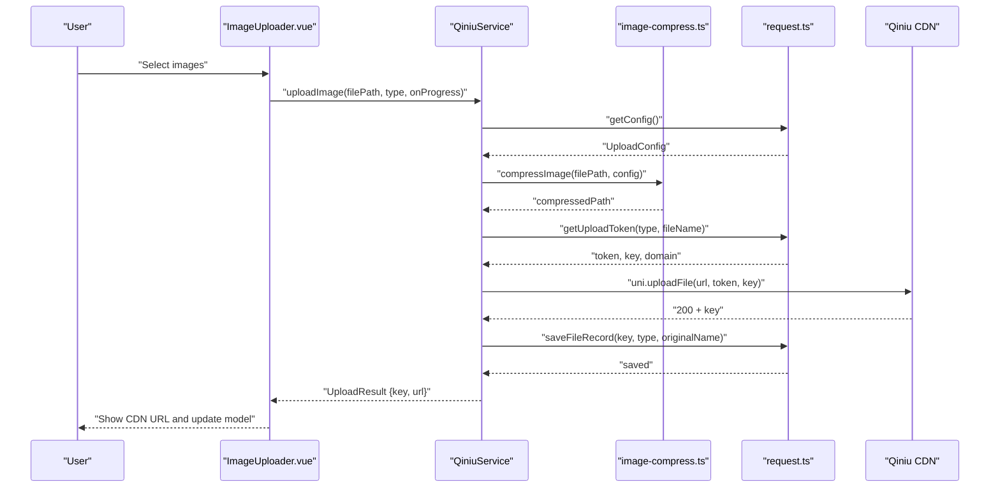
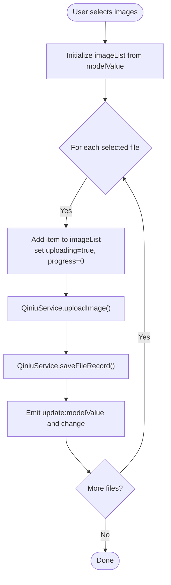
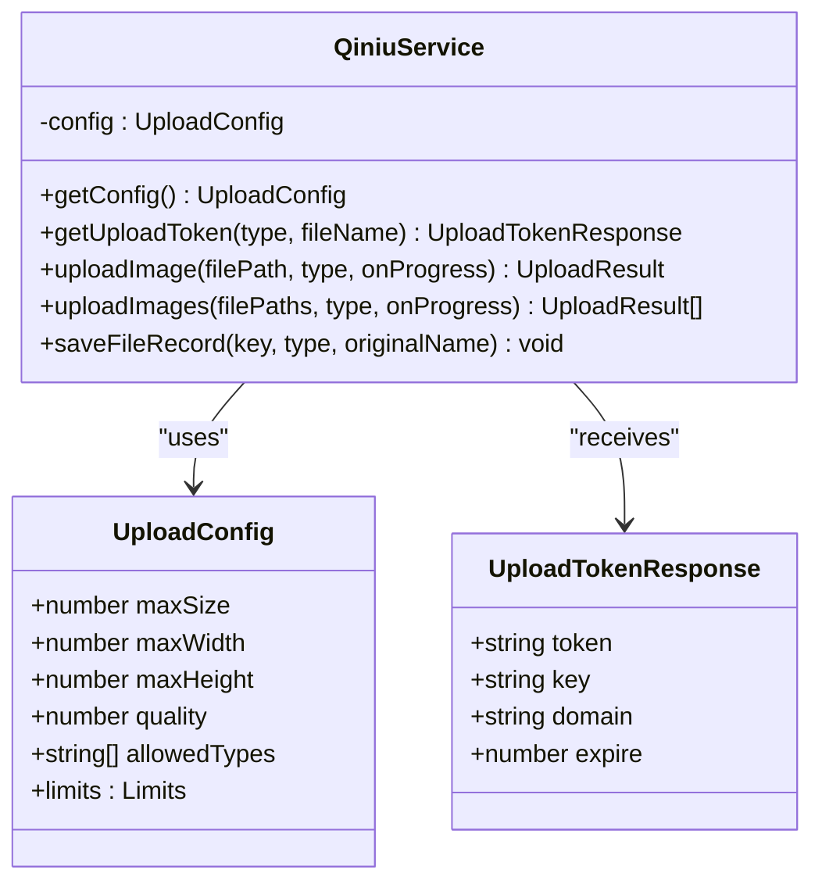
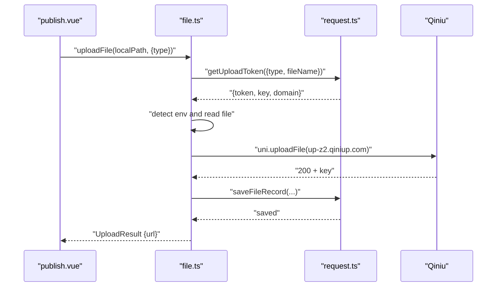
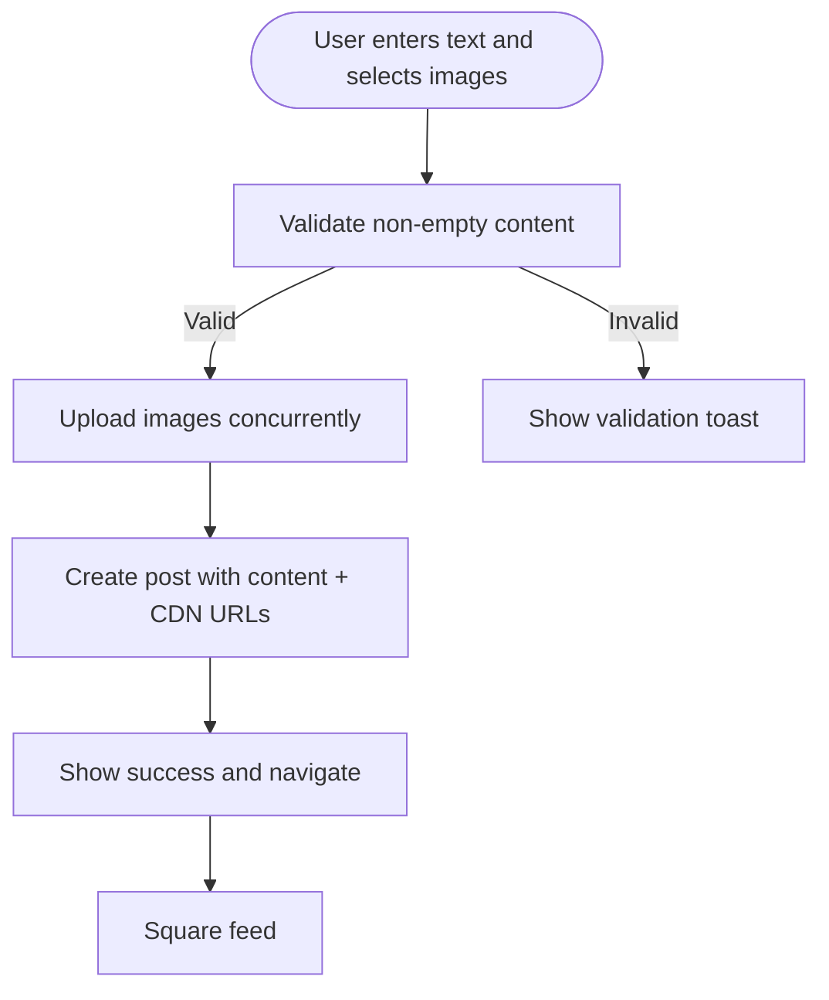
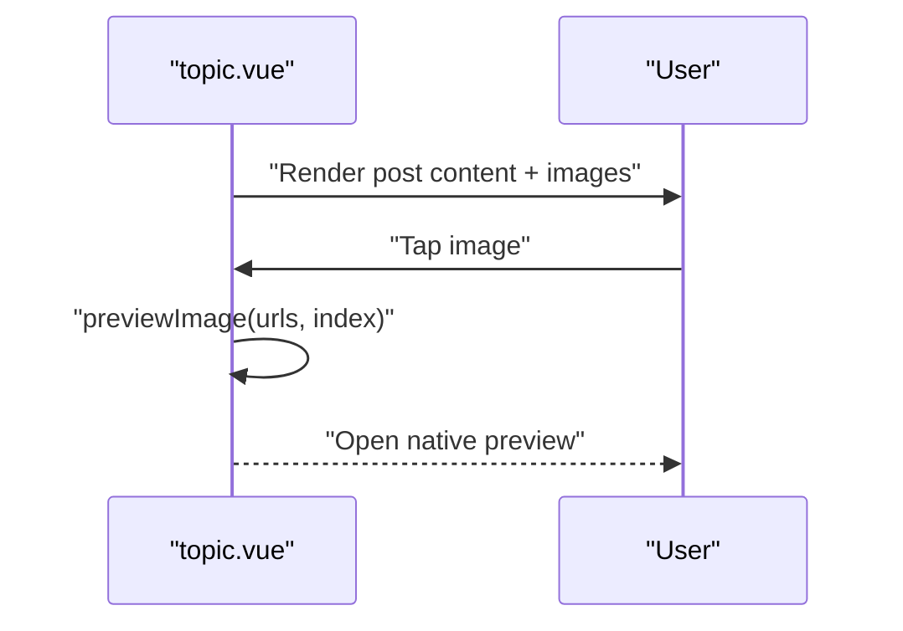
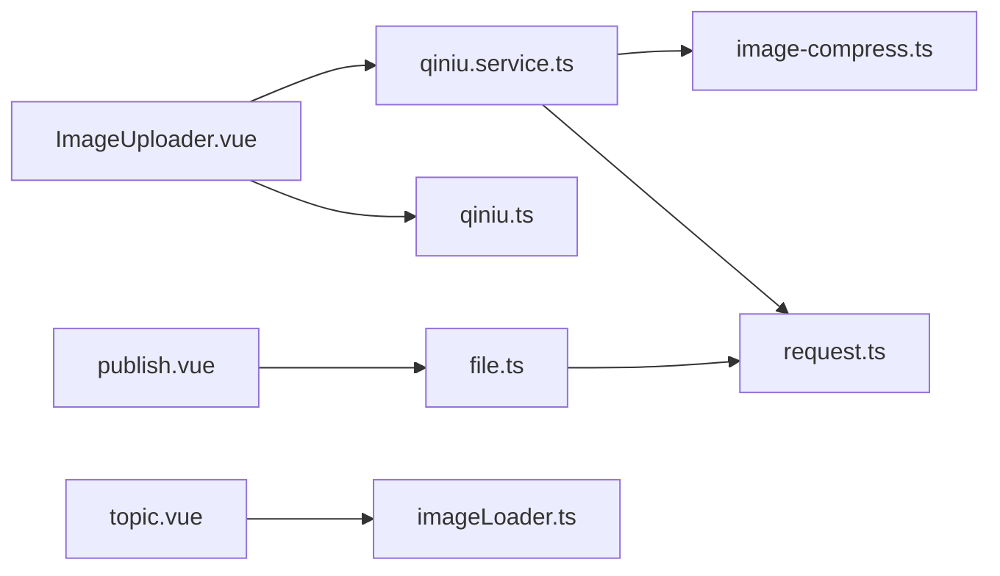
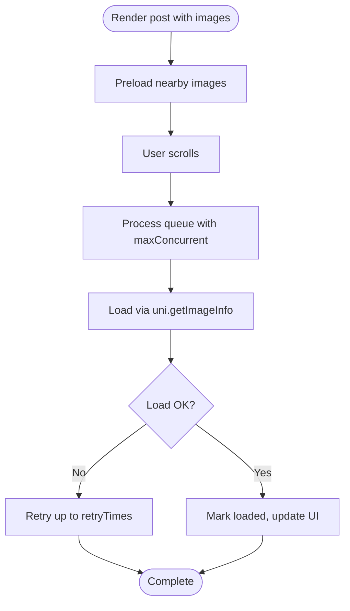

# Media & Content Handling

<cite>
**Referenced Files in This Document**
- [ImageUploader.vue](file://src/components/ImageUploader.vue)
- [qiniu.service.ts](file://src/services/qiniu.service.ts)
- [image-compress.ts](file://src/utils/image-compress.ts)
- [upload-demo.vue](file://src/pages/examples/upload-demo.vue)
- [file.ts](file://src/api/modules/file.ts)
- [qiniu.ts](file://src/types/qiniu.ts)
- [imageLoader.ts](file://src/utils/imageLoader.ts)
- [publish.vue](file://src/pages/square/publish.vue)
- [topic.vue](file://src/pages/square/topic.vue)
- [square.ts](file://src/stores/square.ts)
- [request.ts](file://src/api/request.ts)
- [index.ts](file://src/config/index.ts)
</cite>

## Table of Contents
1. [Introduction](#introduction)
2. [Project Structure](#project-structure)
3. [Core Components](#core-components)
4. [Architecture Overview](#architecture-overview)
5. [Detailed Component Analysis](#detailed-component-analysis)
6. [Dependency Analysis](#dependency-analysis)
7. [Performance Considerations](#performance-considerations)
8. [Security and Content Filtering](#security-and-content-filtering)
9. [Content Delivery and Lazy Loading](#content-delivery-and-lazy-loading)
10. [Troubleshooting Guide](#troubleshooting-guide)
11. [Conclusion](#conclusion)

## Introduction
This document explains the media and content handling capabilities of the platform, focusing on:
- Image upload workflow with compression, resizing, and CDN integration via Qiniu
- Supported formats, size limits, and quality optimization
- Mixed-media content creation (text + images) and embedded link rendering
- Practical examples for drag-and-drop selection, preview generation, and batch processing
- Security measures, virus scanning, and inappropriate content filtering
- Content delivery optimization and lazy loading strategies

## Project Structure
The media and content handling spans several layers:
- UI components for image selection and previews
- Services for Qiniu integration and compression
- Utilities for image optimization and lazy/preload strategies
- API modules for backend coordination
- Store and page logic for publishing and displaying mixed-media posts

**Diagram sources**
- [ImageUploader.vue:1-242](file://src/components/ImageUploader.vue#L1-L242)
- [qiniu.service.ts:1-126](file://src/services/qiniu.service.ts#L1-L126)
- [image-compress.ts:1-87](file://src/utils/image-compress.ts#L1-L87)
- [publish.vue:1-239](file://src/pages/square/publish.vue#L1-L239)
- [topic.vue:97-110](file://src/pages/square/topic.vue#L97-L110)
- [upload-demo.vue:1-100](file://src/pages/examples/upload-demo.vue#L1-L100)
- [file.ts:1-335](file://src/api/modules/file.ts#L1-L335)
- [qiniu.ts:1-38](file://src/types/qiniu.ts#L1-L38)
- [imageLoader.ts:1-354](file://src/utils/imageLoader.ts#L1-L354)
- [request.ts:1-228](file://src/api/request.ts#L1-L228)
- [index.ts:1-11](file://src/config/index.ts#L1-L11)

**Section sources**
- [ImageUploader.vue:1-242](file://src/components/ImageUploader.vue#L1-L242)
- [qiniu.service.ts:1-126](file://src/services/qiniu.service.ts#L1-L126)
- [image-compress.ts:1-87](file://src/utils/image-compress.ts#L1-L87)
- [publish.vue:1-239](file://src/pages/square/publish.vue#L1-L239)
- [topic.vue:97-110](file://src/pages/square/topic.vue#L97-L110)
- [upload-demo.vue:1-100](file://src/pages/examples/upload-demo.vue#L1-L100)
- [file.ts:1-335](file://src/api/modules/file.ts#L1-L335)
- [qiniu.ts:1-38](file://src/types/qiniu.ts#L1-L38)
- [imageLoader.ts:1-354](file://src/utils/imageLoader.ts#L1-L354)
- [request.ts:1-228](file://src/api/request.ts#L1-L228)
- [index.ts:1-11](file://src/config/index.ts#L1-L11)

## Core Components
- ImageUploader: A reusable component enabling multi-image selection, per-image progress, and CDN upload via Qiniu.
- QiniuService: Orchestrates upload configuration retrieval, token acquisition, compression/resizing, and upload to Qiniu.
- Image compression utilities: Provide single and batch compression with configurable max dimensions and quality.
- File API module: Handles generic file upload to Qiniu, including environment detection and record saving.
- ImageLoader: Provides lazy/preload strategies, progressive loading, and robust retry logic.
- Publishing flow: Supports mixed-media posts (text + images) with batch upload and CDN URL resolution.

**Section sources**
- [ImageUploader.vue:32-153](file://src/components/ImageUploader.vue#L32-L153)
- [qiniu.service.ts:12-123](file://src/services/qiniu.service.ts#L12-L123)
- [image-compress.ts:10-86](file://src/utils/image-compress.ts#L10-L86)
- [file.ts:90-230](file://src/api/modules/file.ts#L90-L230)
- [imageLoader.ts:26-177](file://src/utils/imageLoader.ts#L26-L177)
- [publish.vue:40-134](file://src/pages/square/publish.vue#L40-L134)

## Architecture Overview
The media pipeline integrates frontend selection, client-side optimization, and backend orchestration:

**Diagram sources**
- [ImageUploader.vue:78-131](file://src/components/ImageUploader.vue#L78-L131)
- [qiniu.service.ts:42-87](file://src/services/qiniu.service.ts#L42-L87)
- [image-compress.ts:10-49](file://src/utils/image-compress.ts#L10-L49)
- [file.ts:259-262](file://src/api/modules/file.ts#L259-L262)
- [request.ts:20-27](file://src/api/request.ts#L20-L27)

## Detailed Component Analysis

### ImageUploader Component
- Purpose: Multi-image selection with progress, deletion, and CDN upload.
- Features:
  - Choose from album or camera with pre-selection of up to maxCount images.
  - Per-image progress via onProgress callback.
  - Real-time model updates and change events.
  - Immediate compression and upload to Qiniu.
  - Backend record saving after successful upload.

**Diagram sources**
- [ImageUploader.vue:64-152](file://src/components/ImageUploader.vue#L64-L152)
- [qiniu.service.ts:42-122](file://src/services/qiniu.service.ts#L42-L122)

**Section sources**
- [ImageUploader.vue:32-153](file://src/components/ImageUploader.vue#L32-L153)

### QiniuService and Compression
- Configuration retrieval: Fetches maxSize, maxWidth, maxHeight, quality, allowedTypes, and limits from backend.
- Token management: Requests upload tokens with type and filename.
- Compression and resizing: Uses client-side compression with configurable max dimensions and quality.
- Batch upload: Iterative upload with per-file progress callbacks.
- Record saving: Persists file metadata to backend after upload.

**Diagram sources**
- [qiniu.service.ts:12-123](file://src/services/qiniu.service.ts#L12-L123)
- [qiniu.ts:15-25](file://src/types/qiniu.ts#L15-L25)
- [qiniu.ts:8-13](file://src/types/qiniu.ts#L8-L13)

**Section sources**
- [qiniu.service.ts:12-123](file://src/services/qiniu.service.ts#L12-L123)
- [image-compress.ts:10-49](file://src/utils/image-compress.ts#L10-L49)
- [qiniu.ts:1-38](file://src/types/qiniu.ts#L1-L38)

### Generic File Upload API (Alternative Path)
- Supports environment-aware file reading (mini-program vs H5).
- Detects MIME type and extension, constructs upload payload, and saves records.
- Returns full CDN URL after successful upload.

**Diagram sources**
- [publish.vue:95-107](file://src/pages/square/publish.vue#L95-L107)
- [file.ts:90-230](file://src/api/modules/file.ts#L90-L230)
- [request.ts:20-27](file://src/api/request.ts#L20-L27)

**Section sources**
- [file.ts:90-230](file://src/api/modules/file.ts#L90-L230)

### Mixed-Media Post Creation
- Text content with character count and length limit.
- Image gallery with add/remove actions and grid layout.
- Batch upload using Promise.all for concurrent uploads.
- Post creation dispatches to store and navigates to feed.

**Diagram sources**
- [publish.vue:84-134](file://src/pages/square/publish.vue#L84-L134)

**Section sources**
- [publish.vue:40-134](file://src/pages/square/publish.vue#L40-L134)
- [square.ts:42-45](file://src/stores/square.ts#L42-L45)

### Preview Generation and Display
- Post detail displays images with click-to-preview support.
- Grid layout for up to nine images per post.

**Diagram sources**
- [topic.vue:97-110](file://src/pages/square/topic.vue#L97-L110)

**Section sources**
- [topic.vue:97-110](file://src/pages/square/topic.vue#L97-L110)

### Drag-and-Drop Uploads and Batch Processing
- The demo page showcases multiple upload scenarios with different max counts and tips.
- Batch processing is supported via looped uploads or Promise-based concurrency in the publishing flow.

Implementation references:
- [upload-demo.vue:5-41](file://src/pages/examples/upload-demo.vue#L5-L41)
- [publish.vue:95-107](file://src/pages/square/publish.vue#L95-L107)

**Section sources**
- [upload-demo.vue:1-100](file://src/pages/examples/upload-demo.vue#L1-L100)
- [publish.vue:95-107](file://src/pages/square/publish.vue#L95-L107)

## Dependency Analysis
- UI depends on QiniuService for uploads and on ImageLoader for display optimization.
- QiniuService depends on request.ts for backend communication and image-compress.ts for optimization.
- File API module encapsulates environment-specific file handling and integrates with Qiniu.
- Store coordinates post creation and updates.

**Diagram sources**
- [ImageUploader.vue:34-35](file://src/components/ImageUploader.vue#L34-L35)
- [qiniu.service.ts:2-3](file://src/services/qiniu.service.ts#L2-L3)
- [image-compress.ts:1-4](file://src/utils/image-compress.ts#L1-L4)
- [file.ts:1-3](file://src/api/modules/file.ts#L1-L3)
- [request.ts:1-3](file://src/api/request.ts#L1-L3)
- [imageLoader.ts:1-6](file://src/utils/imageLoader.ts#L1-L6)

**Section sources**
- [ImageUploader.vue:32-153](file://src/components/ImageUploader.vue#L32-L153)
- [qiniu.service.ts:12-123](file://src/services/qiniu.service.ts#L12-L123)
- [file.ts:1-335](file://src/api/modules/file.ts#L1-L335)
- [request.ts:1-228](file://src/api/request.ts#L1-L228)
- [imageLoader.ts:1-354](file://src/utils/imageLoader.ts#L1-L354)

## Performance Considerations
- Client-side compression reduces payload size and speeds up upload times.
- Batch uploads leverage Promise-based concurrency to minimize latency.
- ImageLoader throttles concurrent loads and retries failed requests to improve perceived performance.
- Environment-aware file reading avoids unnecessary conversions and improves reliability.

[No sources needed since this section provides general guidance]

## Security and Content Filtering
- File size validation prevents oversized uploads.
- Allowed types and MIME detection help constrain accepted formats.
- Token-based uploads ensure server-side authorization and key generation.
- Backend record saving enables audit trails and content governance.

Recommended enhancements (conceptual):
- Integrate virus scanning and content moderation APIs at upload completion.
- Apply server-side filters for explicit content and enforce policy compliance.
- Enforce rate limiting and IP checks to prevent abuse.

**Section sources**
- [image-compress.ts:80-86](file://src/utils/image-compress.ts#L80-L86)
- [file.ts:51-60](file://src/api/modules/file.ts#L51-L60)
- [qiniu.service.ts:29-40](file://src/services/qiniu.service.ts#L29-L40)

## Content Delivery and Lazy Loading
- ImageLoader provides:
  - Preloading and batch preloading for improved UX.
  - Lazy loading with placeholders and error fallbacks.
  - Retry logic with configurable attempts and delays.
  - Progressive image loading for smooth transitions.
- Strategies:
  - Preload next page images around visible indices.
  - Preload nearby images within a configurable threshold.

**Diagram sources**
- [imageLoader.ts:91-154](file://src/utils/imageLoader.ts#L91-L154)
- [imageLoader.ts:302-352](file://src/utils/imageLoader.ts#L302-L352)

**Section sources**
- [imageLoader.ts:26-177](file://src/utils/imageLoader.ts#L26-L177)
- [imageLoader.ts:197-246](file://src/utils/imageLoader.ts#L197-L246)
- [imageLoader.ts:258-284](file://src/utils/imageLoader.ts#L258-L284)

## Troubleshooting Guide
Common issues and resolutions:
- Upload fails with “file size exceeds limit”:
  - Verify maxSize configuration and local validation.
  - Reference: [qiniu.service.ts:49-52](file://src/services/qiniu.service.ts#L49-L52), [image-compress.ts:80-86](file://src/utils/image-compress.ts#L80-L86)
- Progress not updating:
  - Ensure onProgress callback is passed and invoked during upload.
  - Reference: [ImageUploader.vue:100-103](file://src/components/ImageUploader.vue#L100-L103)
- Images not appearing after upload:
  - Confirm saveFileRecord succeeds and URL is constructed from domain + key.
  - Reference: [qiniu.service.ts:72-86](file://src/services/qiniu.service.ts#L72-L86)
- H5 vs Mini Program file handling:
  - Use appropriate file path/data URL/blob handling logic.
  - Reference: [file.ts:118-159](file://src/api/modules/file.ts#L118-L159)
- Token errors:
  - Validate token expiration and backend availability.
  - Reference: [request.ts:100-147](file://src/api/request.ts#L100-L147)

**Section sources**
- [qiniu.service.ts:49-52](file://src/services/qiniu.service.ts#L49-L52)
- [image-compress.ts:80-86](file://src/utils/image-compress.ts#L80-L86)
- [ImageUploader.vue:100-103](file://src/components/ImageUploader.vue#L100-L103)
- [qiniu.service.ts:72-86](file://src/services/qiniu.service.ts#L72-L86)
- [file.ts:118-159](file://src/api/modules/file.ts#L118-L159)
- [request.ts:100-147](file://src/api/request.ts#L100-L147)

## Conclusion
The platform provides a robust, client-optimized media pipeline:
- Seamless image selection with progress and previews
- Client-side compression and resizing for performance
- Secure, token-based uploads to Qiniu with backend record keeping
- Mixed-media post composition with batch upload and CDN delivery
- Advanced image loading strategies for responsive, efficient rendering

Future enhancements should focus on integrating security scanning and content moderation to complement the existing upload safeguards.