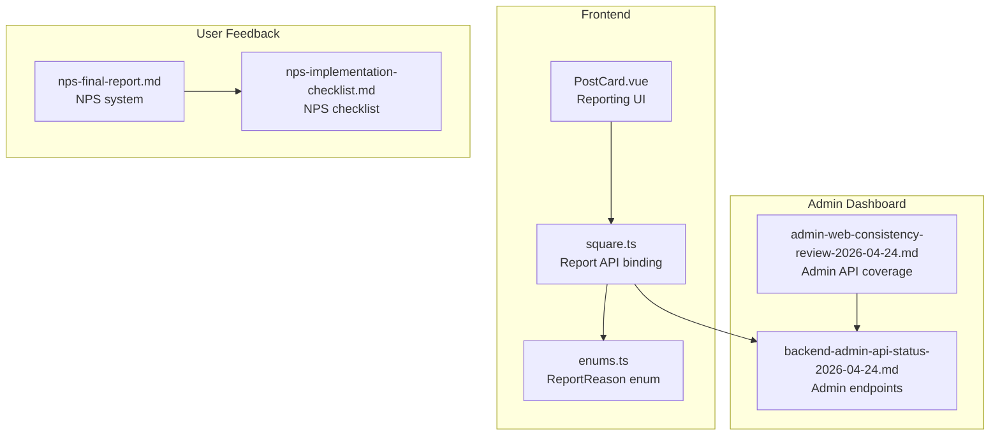
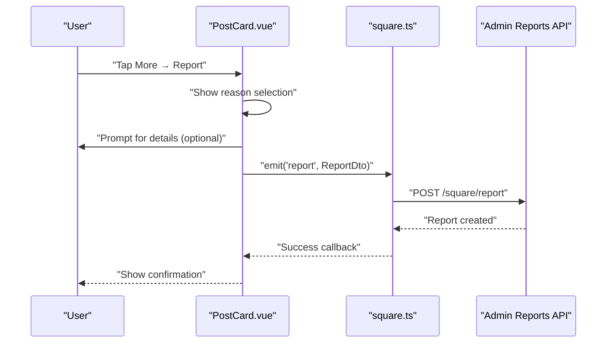
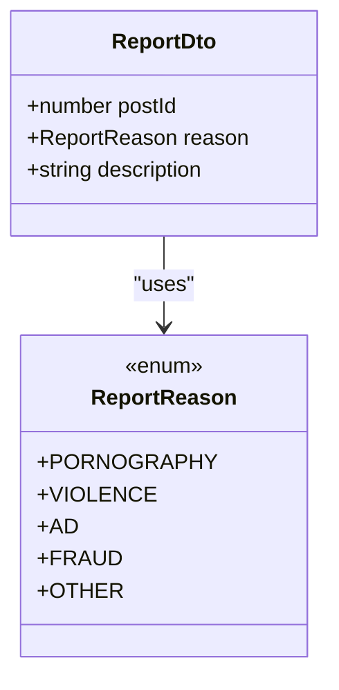
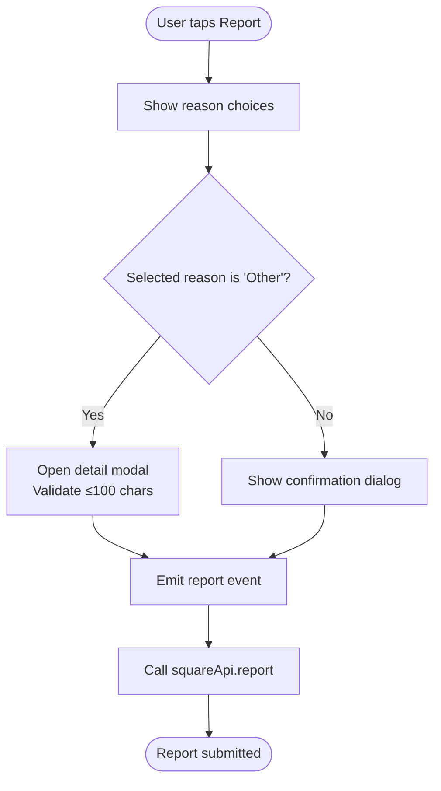
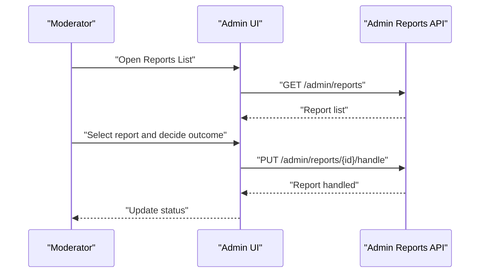
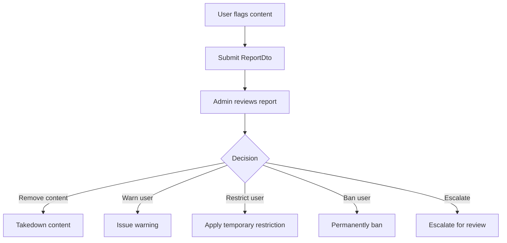
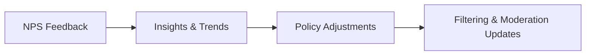
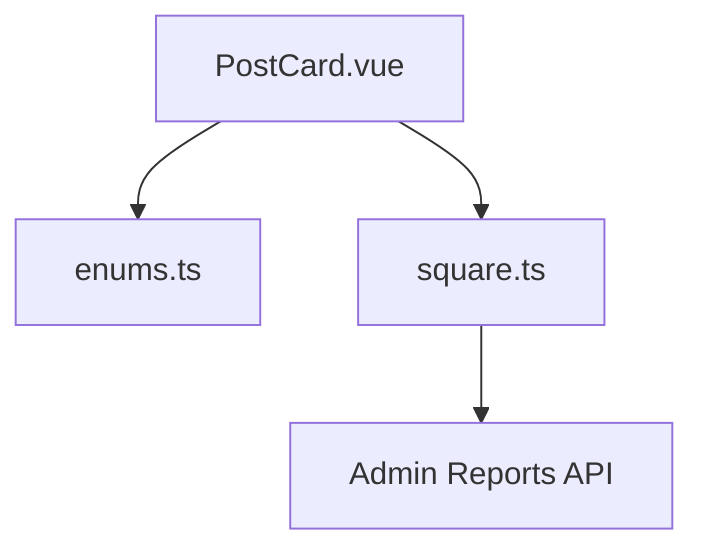

# Moderation & Reporting

<cite>
**Referenced Files in This Document**
- [PostCard.vue](file://src/components/business/PostCard.vue)
- [square.ts](file://src/api/modules/square.ts)
- [enums.ts](file://src/types/enums.ts)
- [admin-web-consistency-review-2026-04-24.md](file://docs/refactry/admin-web-consistency-review-2026-04-24.md)
- [backend-admin-api-status-2026-04-24.md](file://docs/refactry/backend-admin-api-status-2026-04-24.md)
- [nps-final-report.md](file://docs/nps-final-report.md)
- [nps-implementation-checklist.md](file://docs/nps-implementation-checklist.md)
</cite>

## Table of Contents
1. [Introduction](#introduction)
2. [Project Structure](#project-structure)
3. [Core Components](#core-components)
4. [Architecture Overview](#architecture-overview)
5. [Detailed Component Analysis](#detailed-component-analysis)
6. [Dependency Analysis](#dependency-analysis)
7. [Performance Considerations](#performance-considerations)
8. [Troubleshooting Guide](#troubleshooting-guide)
9. [Conclusion](#conclusion)
10. [Appendices](#appendices)

## Introduction
This document describes the content moderation and reporting systems implemented in the frontend and integrated with the backend administration APIs. It focuses on:
- The ReportDto interface and reason categories
- Automated content filtering and manual review workflows
- Community moderation tools and user feedback integration via NPS
- Examples of content flagging, temporary restrictions, and permanent bans
- Moderation dashboard functionality, appeal processes, and administrative controls
- False report prevention, moderator training, and policy enforcement consistency

## Project Structure
The moderation and reporting capabilities span three primary areas:
- Frontend user actions and reporting UI
- Frontend DTOs and API bindings for reporting
- Backend admin APIs for moderation management

**Diagram sources**
- [PostCard.vue:195-255](file://src/components/business/PostCard.vue#L195-L255)
- [square.ts:31-35](file://src/api/modules/square.ts#L31-L35)
- [enums.ts:18-24](file://src/types/enums.ts#L18-L24)
- [admin-web-consistency-review-2026-04-24.md:71-81](file://docs/refactry/admin-web-consistency-review-2026-04-24.md#L71-L81)
- [backend-admin-api-status-2026-04-24.md:35-37](file://docs/refactry/backend-admin-api-status-2026-04-24.md#L35-L37)
- [nps-final-report.md:1-325](file://docs/nps-final-report.md#L1-L325)
- [nps-implementation-checklist.md:1-184](file://docs/nps-implementation-checklist.md#L1-L184)

**Section sources**
- [PostCard.vue:195-255](file://src/components/business/PostCard.vue#L195-L255)
- [square.ts:31-35](file://src/api/modules/square.ts#L31-L35)
- [enums.ts:18-24](file://src/types/enums.ts#L18-L24)
- [admin-web-consistency-review-2026-04-24.md:71-81](file://docs/refactry/admin-web-consistency-review-2026-04-24.md#L71-L81)
- [backend-admin-api-status-2026-04-24.md:35-37](file://docs/refactry/backend-admin-api-status-2026-04-24.md#L35-L37)
- [nps-final-report.md:1-325](file://docs/nps-final-report.md#L1-L325)
- [nps-implementation-checklist.md:1-184](file://docs/nps-implementation-checklist.md#L1-L184)

## Core Components
- ReportDto interface: Defines the payload shape for reporting posts, including reason and optional description.
- ReportReason enum: Standardized categories for reports.
- Reporting UI in PostCard.vue: Provides action sheet and modal for selecting reasons and entering details.
- Admin APIs: Provide listing and handling of reports for moderation.

**Section sources**
- [square.ts:31-35](file://src/api/modules/square.ts#L31-L35)
- [enums.ts:18-24](file://src/types/enums.ts#L18-L24)
- [PostCard.vue:226-289](file://src/components/business/PostCard.vue#L226-L289)
- [admin-web-consistency-review-2026-04-24.md:71-81](file://docs/refactry/admin-web-consistency-review-2026-04-24.md#L71-L81)

## Architecture Overview
The reporting flow connects user actions to backend moderation endpoints. The frontend emits a report event with structured data, which is sent to the server for review and action.

**Diagram sources**
- [PostCard.vue:226-289](file://src/components/business/PostCard.vue#L226-L289)
- [square.ts:95-96](file://src/api/modules/square.ts#L95-L96)
- [backend-admin-api-status-2026-04-24.md:35-37](file://docs/refactry/backend-admin-api-status-2026-04-24.md#L35-L37)

## Detailed Component Analysis

### ReportDto Interface and Reason Categories
- Purpose: Encapsulates the minimal required information to file a report against a post.
- Fields:
  - postId: identifies the target content
  - reason: standardized category from ReportReason
  - description: optional free-form explanation (supports up to 100 characters in UI)
- Reason categories:
  - PORNOGRAPHY
  - VIOLENCE
  - AD
  - FRAUD
  - OTHER

**Diagram sources**
- [square.ts:31-35](file://src/api/modules/square.ts#L31-L35)
- [enums.ts:18-24](file://src/types/enums.ts#L18-L24)

**Section sources**
- [square.ts:31-35](file://src/api/modules/square.ts#L31-L35)
- [enums.ts:18-24](file://src/types/enums.ts#L18-L24)
- [PostCard.vue:226-289](file://src/components/business/PostCard.vue#L226-L289)

### Reporting Mechanism Integration
- UI flow:
  - Action sheet presents predefined reasons
  - Selecting "Other" opens a modal for free-text input (with length validation)
  - Confirmation dialog precedes submission
- Event emission:
  - The component emits a report event carrying the structured data
- API binding:
  - squareApi.report sends ReportDto to /square/report

**Diagram sources**
- [PostCard.vue:226-289](file://src/components/business/PostCard.vue#L226-L289)
- [square.ts:95-96](file://src/api/modules/square.ts#L95-L96)

**Section sources**
- [PostCard.vue:226-289](file://src/components/business/PostCard.vue#L226-L289)
- [square.ts:95-96](file://src/api/modules/square.ts#L95-L96)

### Manual Review and Escalation Workflows
- Admin endpoints:
  - GET /admin/reports: list reports for review
  - PUT /admin/reports/{id}/handle: process a report (e.g., content takedown, warnings, restrictions)
- Coverage:
  - The admin web consistency review confirms these endpoints are implemented and aligned with frontend services.

**Diagram sources**
- [admin-web-consistency-review-2026-04-24.md:71-81](file://docs/refactry/admin-web-consistency-review-2026-04-24.md#L71-L81)
- [backend-admin-api-status-2026-04-24.md:35-37](file://docs/refactry/backend-admin-api-status-2026-04-24.md#L35-L37)

**Section sources**
- [admin-web-consistency-review-2026-04-24.md:71-81](file://docs/refactry/admin-web-consistency-review-2026-04-24.md#L71-L81)
- [backend-admin-api-status-2026-04-24.md:35-37](file://docs/refactry/backend-admin-api-status-2026-04-24.md#L35-L37)

### Community Moderation Tools
- Content flagging:
  - Implemented via PostCard.vue action sheet and modal
  - Emits structured ReportDto for backend processing
- Temporary restrictions and permanent bans:
  - Admin API supports handling reports; moderation outcomes (restrictions/bans) are applied server-side upon report handling
- Appeal processes:
  - Not explicitly documented in the reviewed materials; can be modeled as part of report handling workflows (e.g., escalate to higher authority, reopen decisions)

**Diagram sources**
- [PostCard.vue:226-289](file://src/components/business/PostCard.vue#L226-L289)
- [square.ts:31-35](file://src/api/modules/square.ts#L31-L35)
- [backend-admin-api-status-2026-04-24.md:35-37](file://docs/refactry/backend-admin-api-status-2026-04-24.md#L35-L37)

**Section sources**
- [PostCard.vue:226-289](file://src/components/business/PostCard.vue#L226-L289)
- [square.ts:31-35](file://src/api/modules/square.ts#L31-L35)
- [backend-admin-api-status-2026-04-24.md:35-37](file://docs/refactry/backend-admin-api-status-2026-04-24.md#L35-L37)

### Automated Content Filtering
- Not present in the reviewed frontend code; potential integration points:
  - Pre-filtering reasons in PostCard.vue could be extended to include auto-detection hints
  - Backend services can enforce policy rules and pre-classify reports for faster triage

[No sources needed since this section provides general guidance]

### User Feedback Systems and NPS Integration
- NPS system:
  - Implemented end-to-end with trigger logic, classification, priority calculation, and statistics
  - Includes anti-disturb safeguards and reward mechanisms
- Integration with moderation:
  - NPS feedback can inform policy adjustments and highlight recurring issues
  - Moderation dashboards can correlate NPS trends with content violations

**Diagram sources**
- [nps-final-report.md:1-325](file://docs/nps-final-report.md#L1-L325)
- [nps-implementation-checklist.md:1-184](file://docs/nps-implementation-checklist.md#L1-L184)

**Section sources**
- [nps-final-report.md:1-325](file://docs/nps-final-report.md#L1-L325)
- [nps-implementation-checklist.md:1-184](file://docs/nps-implementation-checklist.md#L1-L184)

### Examples: Implementing Actions
- Content flagging:
  - Use PostCard.vue action sheet and modal to collect reason and description
  - Emit report event with ReportDto
- Temporary restrictions:
  - Admin handles report and applies time-bound restrictions
- Permanent bans:
  - Admin handles report and applies permanent user ban

**Section sources**
- [PostCard.vue:226-289](file://src/components/business/PostCard.vue#L226-L289)
- [square.ts:31-35](file://src/api/modules/square.ts#L31-L35)
- [backend-admin-api-status-2026-04-24.md:35-37](file://docs/refactry/backend-admin-api-status-2026-04-24.md#L35-L37)

### Moderation Dashboard Functionality
- Admin endpoints support:
  - Listing reports
  - Handling reports
- Additional admin modules identified for completeness:
  - Topic management
  - Chat management (requires sensitive word configuration and message viewing)
  - Location statistics
  - Logs management

**Section sources**
- [admin-web-consistency-review-2026-04-24.md:71-81](file://docs/refactry/admin-web-consistency-review-2026-04-24.md#L71-L81)
- [backend-admin-api-status-2026-04-24.md:114-149](file://docs/refactry/backend-admin-api-status-2026-04-24.md#L114-L149)

### Administrative Controls
- User status controls:
  - UserStatus enum includes NORMAL, MUTED, BANNED
- Post status controls:
  - PostStatus enum includes NORMAL, DELETED, VIOLATION
- These statuses can be updated during moderation actions

**Section sources**
- [enums.ts:26-36](file://src/types/enums.ts#L26-L36)

## Dependency Analysis
- Frontend dependencies:
  - PostCard.vue depends on ReportReason enum and squareApi.report
  - squareApi.report depends on ReportDto and backend endpoints
- Admin dependencies:
  - Admin UI relies on admin endpoints for listing and handling reports

**Diagram sources**
- [PostCard.vue:226-289](file://src/components/business/PostCard.vue#L226-L289)
- [enums.ts:18-24](file://src/types/enums.ts#L18-L24)
- [square.ts:31-35](file://src/api/modules/square.ts#L31-L35)
- [backend-admin-api-status-2026-04-24.md:35-37](file://docs/refactry/backend-admin-api-status-2026-04-24.md#L35-L37)

**Section sources**
- [PostCard.vue:226-289](file://src/components/business/PostCard.vue#L226-L289)
- [square.ts:31-35](file://src/api/modules/square.ts#L31-L35)
- [enums.ts:18-24](file://src/types/enums.ts#L18-L24)
- [backend-admin-api-status-2026-04-24.md:35-37](file://docs/refactry/backend-admin-api-status-2026-04-24.md#L35-L37)

## Performance Considerations
- Minimize payload size by sending concise descriptions
- Debounce rapid successive reports per user to prevent spam
- Cache frequently accessed moderation metadata in the admin UI
- Use pagination for report lists and statistics

[No sources needed since this section provides general guidance]

## Troubleshooting Guide
- Reporting UI issues:
  - Ensure the action sheet reason mapping matches ReportReason values
  - Validate description length constraints before submission
- API connectivity:
  - Confirm /square/report endpoint availability and authentication
  - Verify admin endpoints for listing and handling reports
- Anti-spam measures:
  - Implement rate limiting and user reputation checks
- False report prevention:
  - Add confirmation steps and require minimum description length
  - Monitor repeated reports from single users and escalate flagged cases

**Section sources**
- [PostCard.vue:226-289](file://src/components/business/PostCard.vue#L226-L289)
- [square.ts:95-96](file://src/api/modules/square.ts#L95-L96)
- [backend-admin-api-status-2026-04-24.md:35-37](file://docs/refactry/backend-admin-api-status-2026-04-24.md#L35-L37)

## Conclusion
The frontend provides a robust reporting UI with structured reasons and optional details, while the backend exposes admin endpoints for reviewing and handling reports. Integrating NPS feedback can guide policy updates and improve moderation effectiveness. To strengthen the system, consider adding admin modules for topics, chat, locations, and logs, along with enhanced anti-abuse measures and moderator training frameworks.

[No sources needed since this section summarizes without analyzing specific files]

## Appendices

### Appendix A: ReportReason Enum Values
- PORNOGRAPHY
- VIOLENCE
- AD
- FRAUD
- OTHER

**Section sources**
- [enums.ts:18-24](file://src/types/enums.ts#L18-L24)

### Appendix B: Admin Endpoint Summary
- GET /admin/reports: list reports
- PUT /admin/reports/{id}/handle: handle a report

**Section sources**
- [admin-web-consistency-review-2026-04-24.md:71-81](file://docs/refactry/admin-web-consistency-review-2026-04-24.md#L71-L81)
- [backend-admin-api-status-2026-04-24.md:35-37](file://docs/refactry/backend-admin-api-status-2026-04-24.md#L35-L37)