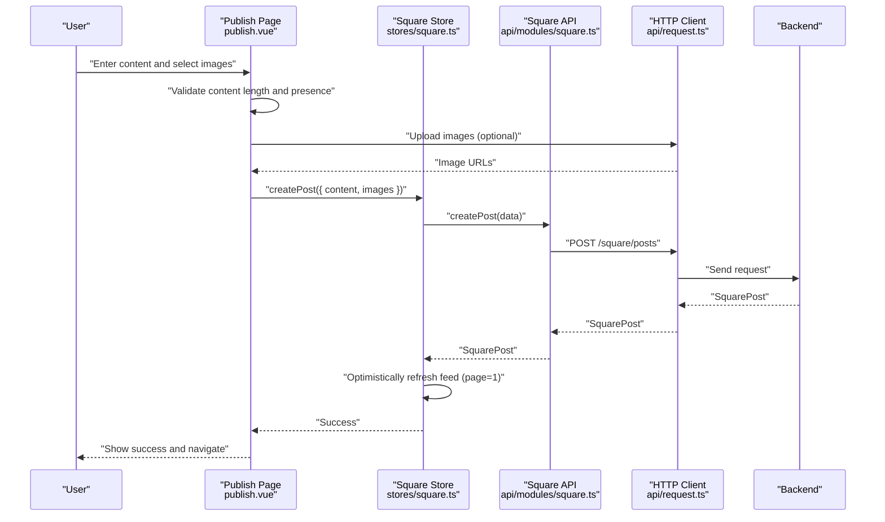
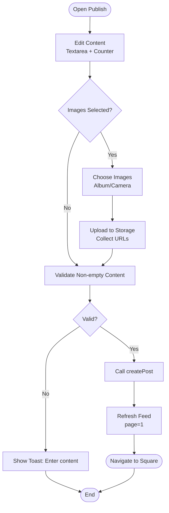
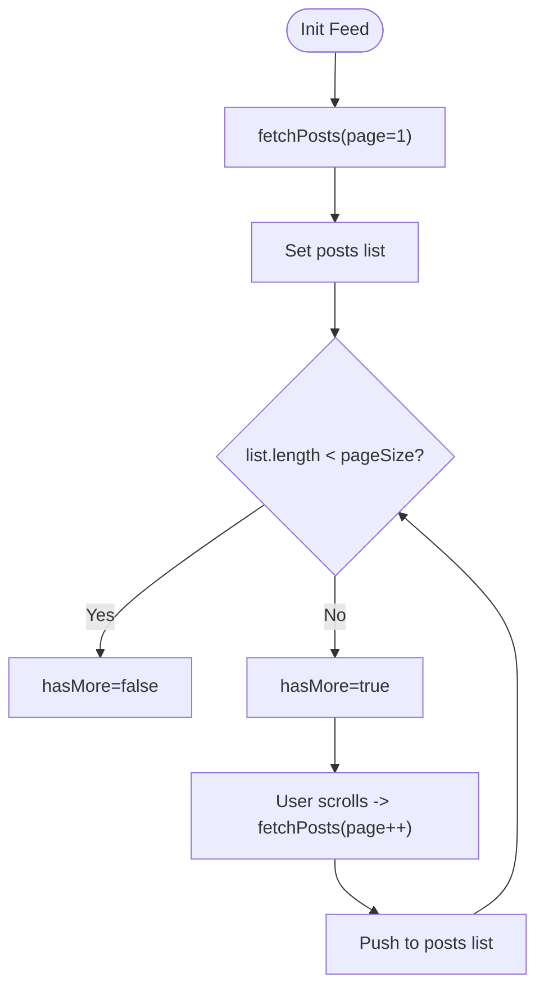
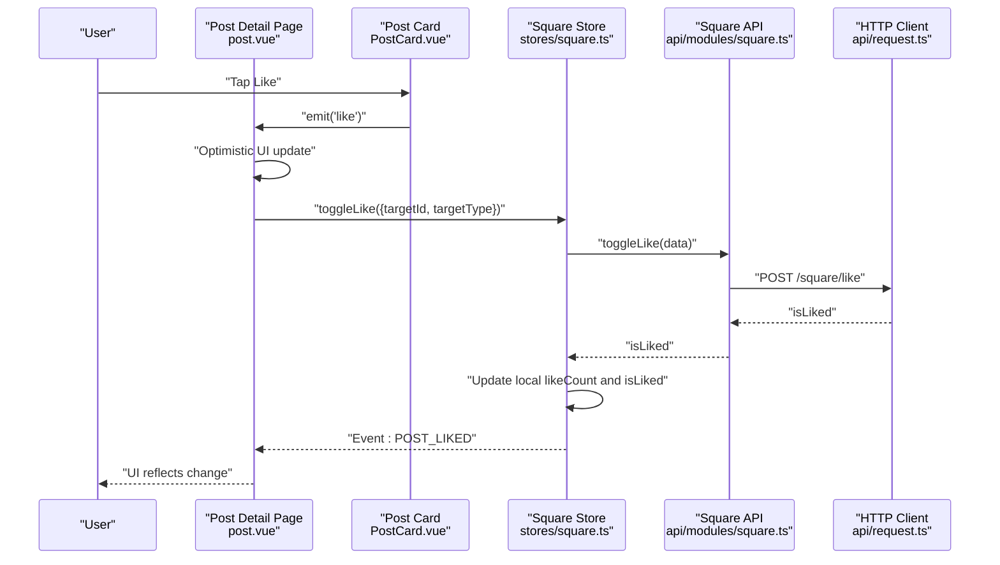
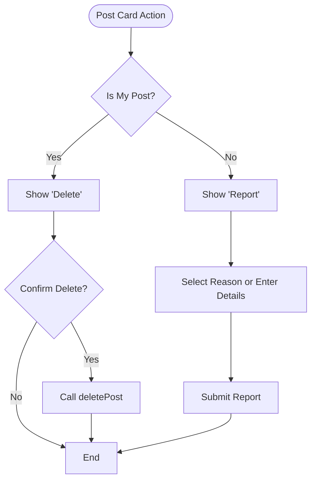
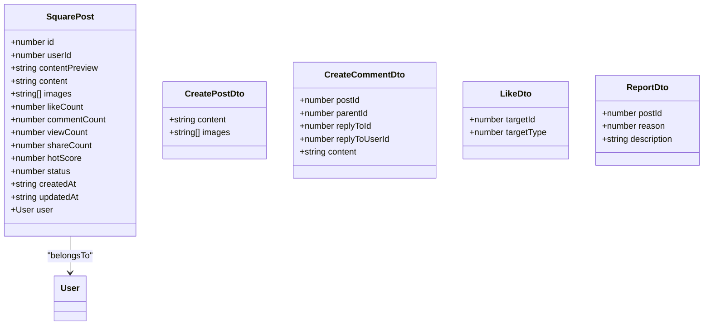
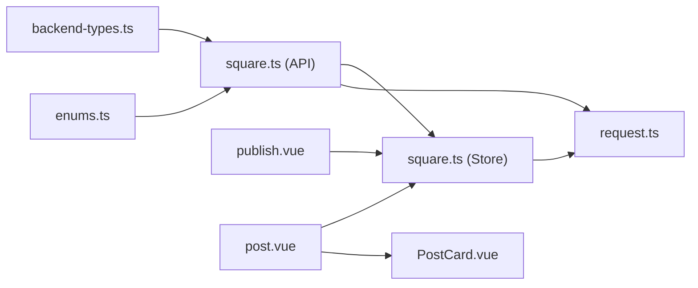

# Post System

<cite>
**Referenced Files in This Document**
- [square.ts](file://src/api/modules/square.ts)
- [backend-types.ts](file://src/types/api/backend-types.ts)
- [backend-api.ts](file://src/types/api/backend-api.ts)
- [enums.ts](file://src/types/enums.ts)
- [square.ts](file://src/stores/square.ts)
- [publish.vue](file://src/pages/square/publish.vue)
- [post.vue](file://src/pages/square/post.vue)
- [PostCard.vue](file://src/components/business/PostCard.vue)
- [request.ts](file://src/api/request.ts)
- [format.ts](file://src/utils/format.ts)
</cite>

## Table of Contents
1. [Introduction](#introduction)
2. [Project Structure](#project-structure)
3. [Core Components](#core-components)
4. [Architecture Overview](#architecture-overview)
5. [Detailed Component Analysis](#detailed-component-analysis)
6. [Dependency Analysis](#dependency-analysis)
7. [Performance Considerations](#performance-considerations)
8. [Troubleshooting Guide](#troubleshooting-guide)
9. [Conclusion](#conclusion)

## Introduction
This document describes the post system component responsible for creating, managing, and displaying posts on the platform. It covers the complete lifecycle from content creation and validation, to media attachment handling, publishing workflows, retrieval mechanisms, sorting and pagination, state management, and moderation controls. It also documents the CreatePostDto interface and SquarePost API responses, and explains how real-time-like updates are achieved via optimistic UI and event bus synchronization.

## Project Structure
The post system spans several layers:
- API module that defines typed DTOs and HTTP endpoints for posts and comments
- Store that manages local state, pagination, and optimistic updates
- Pages that orchestrate user actions (publishing, viewing post details)
- Components that render posts and handle user interactions (likes, reports, deletes)
- Utilities for HTTP requests, time formatting, and image preview

```mermaid
graph TB
subgraph "UI Layer"
Publish["Publish Page<br/>publish.vue"]
PostDetail["Post Detail Page<br/>post.vue"]
PostCard["Post Card Component<br/>PostCard.vue"]
end
subgraph "State Layer"
Store["Square Store<br/>stores/square.ts"]
end
subgraph "API Layer"
SquareAPI["Square API Module<br/>api/modules/square.ts"]
Request["HTTP Client<br/>api/request.ts"]
end
subgraph "Types"
Types["Backend Types<br/>types/api/backend-types.ts"]
Enums["Enums<br/>types/enums.ts"]
end
Publish --> Store
PostDetail --> Store
PostCard --> Store
Store --> SquareAPI
SquareAPI --> Request
SquareAPI --> Types
SquareAPI --> Enums
PostDetail --> PostCard
```

**Diagram sources**
- [publish.vue:1-239](file://src/pages/square/publish.vue#L1-L239)
- [post.vue:1-318](file://src/pages/square/post.vue#L1-L318)
- [PostCard.vue:1-628](file://src/components/business/PostCard.vue#L1-L628)
- [square.ts:1-152](file://src/stores/square.ts#L1-L152)
- [square.ts:1-98](file://src/api/modules/square.ts#L1-L98)
- [request.ts:1-228](file://src/api/request.ts#L1-L228)
- [backend-types.ts:427-459](file://src/types/api/backend-types.ts#L427-L459)
- [enums.ts:13-24](file://src/types/enums.ts#L13-L24)

**Section sources**
- [square.ts:1-98](file://src/api/modules/square.ts#L1-L98)
- [square.ts:1-152](file://src/stores/square.ts#L1-L152)
- [publish.vue:1-239](file://src/pages/square/publish.vue#L1-L239)
- [post.vue:1-318](file://src/pages/square/post.vue#L1-L318)
- [PostCard.vue:1-628](file://src/components/business/PostCard.vue#L1-L628)
- [backend-types.ts:427-459](file://src/types/api/backend-types.ts#L427-L459)
- [enums.ts:13-24](file://src/types/enums.ts#L13-L24)
- [request.ts:1-228](file://src/api/request.ts#L1-L228)

## Core Components
- Square API module: Defines CreatePostDto, SquarePost, and endpoints for posts, comments, likes, and reporting.
- Square Store: Manages feed state, pagination, optimistic updates, and emits events for real-time-like synchronization.
- Publish Page: Handles rich content editing, character limits, media selection, and uploads.
- Post Detail Page: Renders a single post, manages comments, likes, reports, and deletions.
- Post Card Component: Renders individual posts, handles user actions (like, comment, share, report, delete), and permission-aware actions.
- HTTP Client: Centralized request handling with token management and retry logic.
- Time Formatting Utility: Provides human-friendly timestamps.

**Section sources**
- [square.ts:13-41](file://src/api/modules/square.ts#L13-L41)
- [square.ts:13-151](file://src/stores/square.ts#L13-L151)
- [publish.vue:40-134](file://src/pages/square/publish.vue#L40-L134)
- [post.vue:32-175](file://src/pages/square/post.vue#L32-L175)
- [PostCard.vue:96-290](file://src/components/business/PostCard.vue#L96-L290)
- [request.ts:75-225](file://src/api/request.ts#L75-L225)
- [format.ts:8-23](file://src/utils/format.ts#L8-L23)

## Architecture Overview
The post system follows a layered architecture:
- UI pages trigger actions that update the store
- The store calls the Square API module
- The Square API module uses the HTTP client to communicate with backend endpoints
- Backend types define the shape of SquarePost and DTOs
- The store performs optimistic updates and emits events for cross-component synchronization



**Diagram sources**
- [publish.vue:84-134](file://src/pages/square/publish.vue#L84-L134)
- [square.ts:42-45](file://src/stores/square.ts#L42-L45)
- [square.ts:44-45](file://src/api/modules/square.ts#L44-L45)
- [request.ts:214-216](file://src/api/request.ts#L214-L216)
- [backend-types.ts:427-459](file://src/types/api/backend-types.ts#L427-L459)

## Detailed Component Analysis

### CreatePostDto and SquarePost API Responses
- CreatePostDto: Carries content and optional images array for post creation.
- SquarePost: Represents a post returned by the backend, including counters, status, and user association.

Implementation highlights:
- DTO definition and endpoint are declared in the Square API module.
- Backend types define SquarePost and CreatePostDto shapes.
- Enumerations define post and report statuses and reasons.

**Section sources**
- [square.ts:13-16](file://src/api/modules/square.ts#L13-L16)
- [backend-types.ts:427-459](file://src/types/api/backend-types.ts#L427-L459)
- [backend-types.ts:461-469](file://src/types/api/backend-types.ts#L461-L469)
- [enums.ts:32-36](file://src/types/enums.ts#L32-L36)
- [enums.ts:18-24](file://src/types/enums.ts#L18-L24)

### Publishing Workflow
- Rich content editing: textarea with character limit and live counter.
- Media attachments: choose images, support H5 tempFiles/base64 fallback, upload via file API, collect URLs.
- Validation: ensure content is present before posting.
- Optimistic UI: after successful post, the store refreshes the feed to include the new post.



**Diagram sources**
- [publish.vue:40-134](file://src/pages/square/publish.vue#L40-L134)
- [square.ts:42-45](file://src/stores/square.ts#L42-L45)

**Section sources**
- [publish.vue:40-134](file://src/pages/square/publish.vue#L40-L134)
- [square.ts:42-45](file://src/stores/square.ts#L42-L45)

### Post Retrieval, Sorting, Pagination, and Infinite Scroll
- Retrieval: getPosts supports page/pageSize and sort options (hot/latest).
- Pagination: hasMore flag indicates whether more results are available; pageSize defaults applied when missing.
- Infinite scroll: the store pushes new items for page > 1, enabling append-style pagination.



**Diagram sources**
- [square.ts:20-35](file://src/stores/square.ts#L20-L35)
- [square.ts:47-48](file://src/api/modules/square.ts#L47-L48)

**Section sources**
- [square.ts:37-41](file://src/api/modules/square.ts#L37-L41)
- [square.ts:20-35](file://src/stores/square.ts#L20-L35)

### Post Detail, Comments, Likes, and Real-time Updates
- Post detail page loads a single post and its comments concurrently.
- Optimistic likes: UI toggles immediately, then syncs with backend; on failure, reverts UI.
- Event bus: emits like events to synchronize other components.
- Comments: create/delete updates comment counts locally and reloads comment list.



**Diagram sources**
- [post.vue:72-99](file://src/pages/square/post.vue#L72-L99)
- [PostCard.vue:162-178](file://src/components/business/PostCard.vue#L162-L178)
- [square.ts:95-128](file://src/stores/square.ts#L95-L128)
- [square.ts:86-87](file://src/api/modules/square.ts#L86-L87)
- [request.ts:214-216](file://src/api/request.ts#L214-L216)

**Section sources**
- [post.vue:32-175](file://src/pages/square/post.vue#L32-L175)
- [PostCard.vue:96-290](file://src/components/business/PostCard.vue#L96-L290)
- [square.ts:95-128](file://src/stores/square.ts#L95-L128)

### Moderation and Content Controls
- Reporting: users can report posts with predefined reasons and optional description; submission triggers backend report endpoint.
- Deletion: PostCard shows action sheet; if post belongs to the user, “Delete” is shown; confirmation triggers delete action.
- Permissions: deletion is restricted to post owners; reporting is available to all users.



**Diagram sources**
- [PostCard.vue:195-224](file://src/components/business/PostCard.vue#L195-L224)
- [PostCard.vue:226-289](file://src/components/business/PostCard.vue#L226-L289)
- [post.vue:156-175](file://src/pages/square/post.vue#L156-L175)

**Section sources**
- [PostCard.vue:195-289](file://src/components/business/PostCard.vue#L195-L289)
- [post.vue:134-175](file://src/pages/square/post.vue#L134-L175)
- [enums.ts:18-24](file://src/types/enums.ts#L18-L24)

### Data Models and DTOs


**Diagram sources**
- [backend-types.ts:427-459](file://src/types/api/backend-types.ts#L427-L459)
- [backend-types.ts:461-469](file://src/types/api/backend-types.ts#L461-L469)
- [backend-types.ts:471-485](file://src/types/api/backend-types.ts#L471-L485)
- [backend-types.ts:487-495](file://src/types/api/backend-types.ts#L487-L495)
- [backend-types.ts:497-507](file://src/types/api/backend-types.ts#L497-L507)

**Section sources**
- [backend-types.ts:427-507](file://src/types/api/backend-types.ts#L427-L507)

## Dependency Analysis
- Square API module depends on:
  - Backend types for DTOs and responses
  - Enums for target types and report reasons
  - HTTP client for network requests
- Square Store depends on:
  - Square API module
  - Event bus for cross-component synchronization
  - Types for strong typing
- UI pages depend on:
  - Square Store for state and actions
  - Components for rendering and user interactions
  - Utilities for formatting and previews



**Diagram sources**
- [square.ts:1-11](file://src/api/modules/square.ts#L1-L11)
- [backend-types.ts:1-9](file://src/types/api/backend-types.ts#L1-L9)
- [enums.ts:13-24](file://src/types/enums.ts#L13-L24)
- [square.ts:1-11](file://src/stores/square.ts#L1-L11)
- [request.ts:1-228](file://src/api/request.ts#L1-L228)
- [publish.vue:40-46](file://src/pages/square/publish.vue#L40-L46)
- [post.vue:32-42](file://src/pages/square/post.vue#L32-L42)
- [PostCard.vue:96-104](file://src/components/business/PostCard.vue#L96-L104)

**Section sources**
- [square.ts:1-11](file://src/api/modules/square.ts#L1-L11)
- [square.ts:1-11](file://src/stores/square.ts#L1-L11)
- [request.ts:1-228](file://src/api/request.ts#L1-L228)

## Performance Considerations
- Optimistic UI reduces perceived latency for likes and post creation; ensure rollback on failure.
- Pagination: avoid loading excessively large page sizes; default to moderate pageSize and rely on hasMore to control loading.
- Image handling: compress images before upload; display placeholders during lazy-load to improve perceived performance.
- Event-driven updates: use event bus selectively to avoid unnecessary re-renders; scope updates to affected components.

## Troubleshooting Guide
- Authentication failures: the HTTP client automatically attempts token refresh on 401; if refresh fails, users are redirected to login. Verify token storage and refresh token availability.
- Network errors: centralized toast notifications indicate request failures; check base URL and timeouts.
- Like toggling: if backend fails, the store reverts optimistic changes; confirm error handling and user feedback.
- Character limits: ensure frontend validation matches backend constraints; display counters to guide users.

**Section sources**
- [request.ts:100-147](file://src/api/request.ts#L100-L147)
- [post.vue:84-98](file://src/pages/square/post.vue#L84-L98)
- [publish.vue:84-91](file://src/pages/square/publish.vue#L84-L91)
- [PostCard.vue:78-85](file://src/components/business/PostCard.vue#L78-L85)

## Conclusion
The post system integrates a clean separation of concerns across UI, state, API, and types. It emphasizes robustness through optimistic UI, strong typing, and centralized HTTP handling. Moderation and permission checks are enforced at the UI level for user experience and at the backend via DTOs and enums. The design supports scalable pagination, efficient media handling, and real-time-like updates through event-driven synchronization.