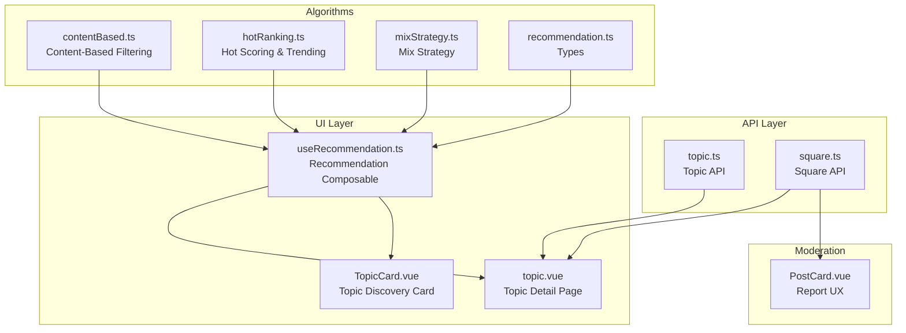
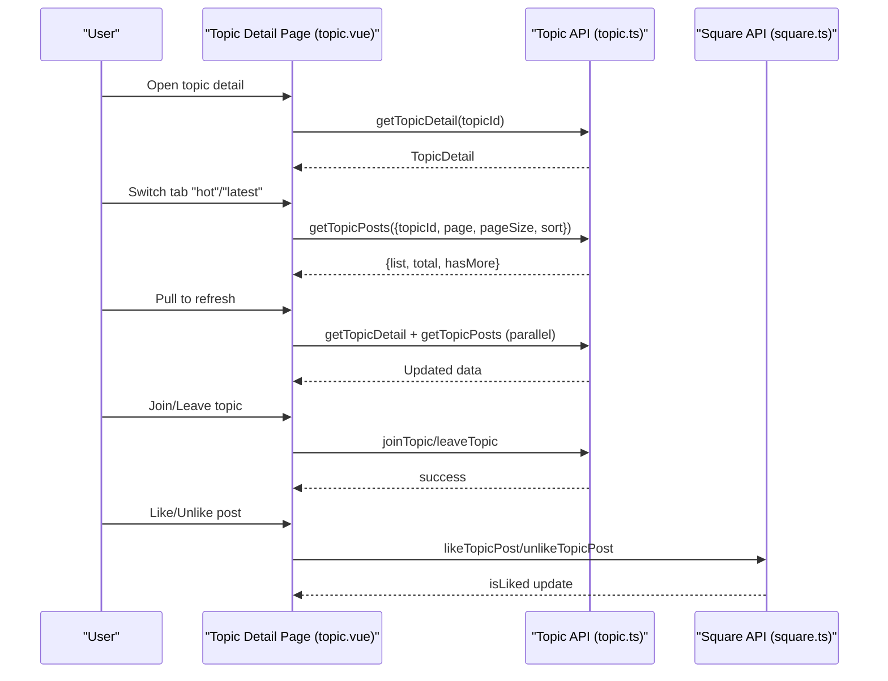
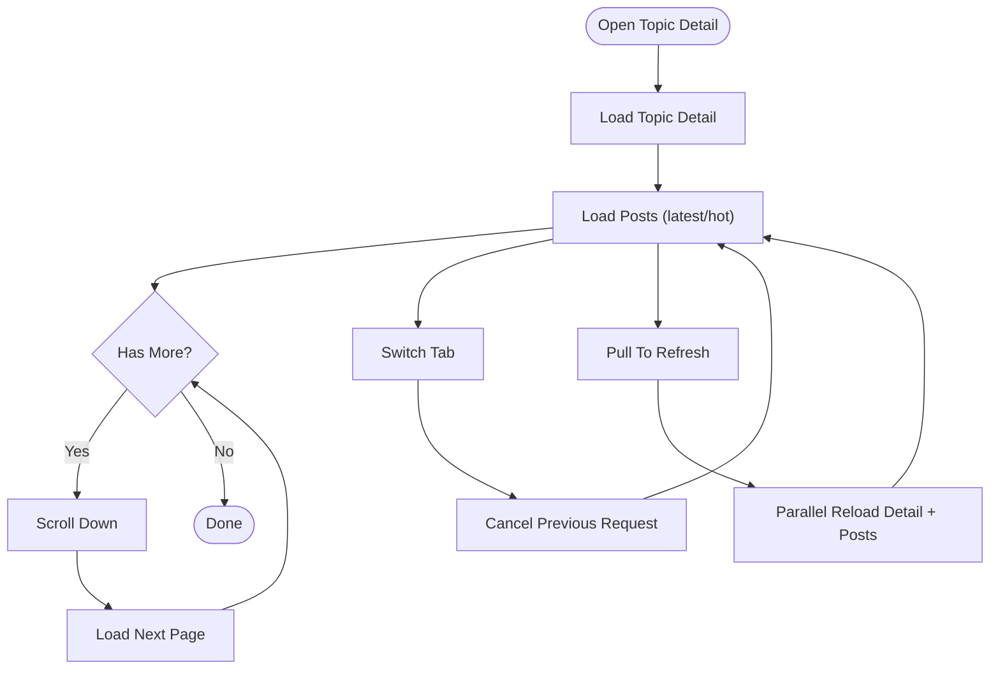
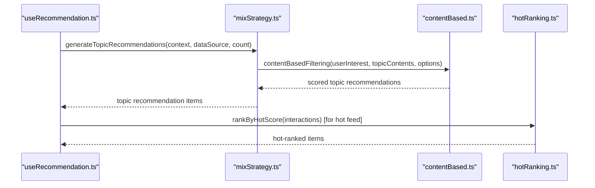
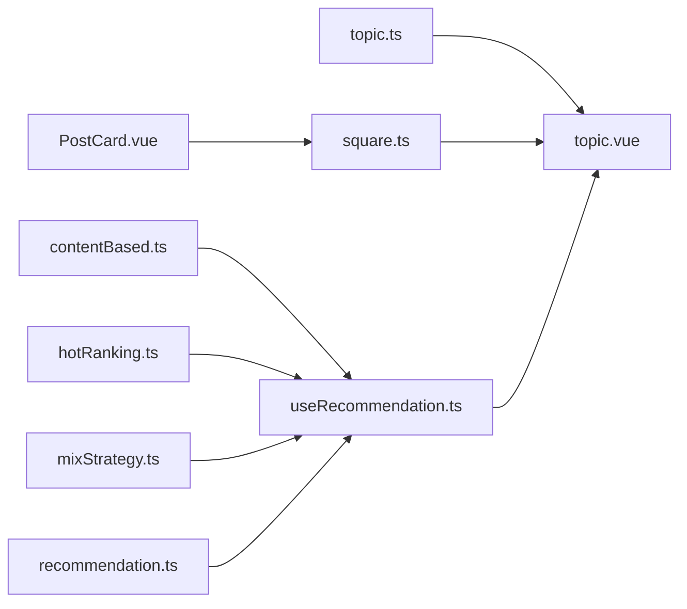

# Topic Management

<cite>
**Referenced Files in This Document**
- [topic.ts](file://src/api/modules/topic.ts)
- [topic.vue](file://src/pages/square/topic.vue)
- [TopicCard.vue](file://src/pages/tabbar/home/components/TopicCard.vue)
- [useRecommendation.ts](file://src/pages/tabbar/home/composables/useRecommendation.ts)
- [contentBased.ts](file://src/pages/tabbar/home/algorithms/contentBased.ts)
- [hotRanking.ts](file://src/pages/tabbar/home/algorithms/hotRanking.ts)
- [mixStrategy.ts](file://src/pages/tabbar/home/algorithms/mixStrategy.ts)
- [recommendation.ts](file://src/pages/tabbar/home/types/recommendation.ts)
- [square.ts](file://src/api/modules/square.ts)
- [PostCard.vue](file://src/components/business/PostCard.vue)
- [topic-optimization-complete.md](file://docs/refactry/topic-optimization-complete.md)
- [backend-admin-api-status-2026-04-24.md](file://docs/refactry/backend-admin-api-status-2026-04-24.md)
- [admin-web-consistency-review-2026-04-24.md](file://docs/refactry/admin-web-consistency-review-2026-04-24.md)
</cite>

## Table of Contents
1. [Introduction](#introduction)
2. [Project Structure](#project-structure)
3. [Core Components](#core-components)
4. [Architecture Overview](#architecture-overview)
5. [Detailed Component Analysis](#detailed-component-analysis)
6. [Dependency Analysis](#dependency-analysis)
7. [Performance Considerations](#performance-considerations)
8. [Troubleshooting Guide](#troubleshooting-guide)
9. [Conclusion](#conclusion)
10. [Appendices](#appendices)

## Introduction
This document describes the topic management system implemented in the frontend codebase. It covers topic creation, categorization, discovery, filtering, trending algorithms, subscriptions, user interest mapping, and recommendation integration. It also outlines search and auto-completion patterns, moderation workflows, analytics and engagement metrics, and enforcement of community guidelines. The goal is to provide a clear understanding of how topics are modeled, fetched, presented, and curated within the application.

## Project Structure
The topic management system spans API modules, page components, recommendation algorithms, and supporting utilities. The most relevant areas include:
- Topic API module for CRUD, search, hot lists, stats, and follow/unfollow
- Topic detail page with dynamic feed, tabs, pagination, and optimistic updates
- Topic card component for discovery and quick actions
- Recommendation composables and algorithms integrating topic content
- Square API for post lifecycle and moderation reporting

**Diagram sources**
- [topic.ts:1-167](file://src/api/modules/topic.ts#L1-L167)
- [topic.vue:149-501](file://src/pages/square/topic.vue#L149-L501)
- [TopicCard.vue:1-190](file://src/pages/tabbar/home/components/TopicCard.vue#L1-L190)
- [useRecommendation.ts:1-202](file://src/pages/tabbar/home/composables/useRecommendation.ts#L1-L202)
- [contentBased.ts:1-297](file://src/pages/tabbar/home/algorithms/contentBased.ts#L1-L297)
- [hotRanking.ts:1-328](file://src/pages/tabbar/home/algorithms/hotRanking.ts#L1-L328)
- [mixStrategy.ts:260-293](file://src/pages/tabbar/home/algorithms/mixStrategy.ts#L260-L293)
- [recommendation.ts:1-119](file://src/pages/tabbar/home/types/recommendation.ts#L1-L119)
- [square.ts:1-98](file://src/api/modules/square.ts#L1-L98)
- [PostCard.vue:226-266](file://src/components/business/PostCard.vue#L226-L266)

**Section sources**
- [topic.ts:1-167](file://src/api/modules/topic.ts#L1-L167)
- [topic.vue:149-501](file://src/pages/square/topic.vue#L149-L501)
- [TopicCard.vue:1-190](file://src/pages/tabbar/home/components/TopicCard.vue#L1-L190)
- [useRecommendation.ts:1-202](file://src/pages/tabbar/home/composables/useRecommendation.ts#L1-L202)
- [contentBased.ts:1-297](file://src/pages/tabbar/home/algorithms/contentBased.ts#L1-L297)
- [hotRanking.ts:1-328](file://src/pages/tabbar/home/algorithms/hotRanking.ts#L1-L328)
- [mixStrategy.ts:260-293](file://src/pages/tabbar/home/algorithms/mixStrategy.ts#L260-L293)
- [recommendation.ts:1-119](file://src/pages/tabbar/home/types/recommendation.ts#L1-L119)
- [square.ts:1-98](file://src/api/modules/square.ts#L1-L98)
- [PostCard.vue:226-266](file://src/components/business/PostCard.vue#L226-L266)

## Core Components
- Topic API module: Provides typed interfaces and functions for topic detail, posts, stats, participants, follow/unfollow, search, and hot topics.
- Topic detail page: Implements tabbed feed (latest/hot), infinite scrolling, pull-to-refresh, optimistic UI updates, and navigation to publish and post detail.
- Topic card: Lightweight discovery component emitting actions for viewing and joining.
- Recommendation composable: Fetches mixed recommendations, supports pagination and cursor-based continuation, and tracks user actions.
- Algorithms: Content-based filtering, hot ranking with time decay and Wilson score, and a mixed strategy combining multiple signals.
- Square API and moderation: Post lifecycle and reporting flow used by topic posts.

**Section sources**
- [topic.ts:1-167](file://src/api/modules/topic.ts#L1-L167)
- [topic.vue:149-501](file://src/pages/square/topic.vue#L149-L501)
- [TopicCard.vue:1-190](file://src/pages/tabbar/home/components/TopicCard.vue#L1-L190)
- [useRecommendation.ts:1-202](file://src/pages/tabbar/home/composables/useRecommendation.ts#L1-L202)
- [contentBased.ts:1-297](file://src/pages/tabbar/home/algorithms/contentBased.ts#L1-L297)
- [hotRanking.ts:1-328](file://src/pages/tabbar/home/algorithms/hotRanking.ts#L1-L328)
- [mixStrategy.ts:260-293](file://src/pages/tabbar/home/algorithms/mixStrategy.ts#L260-L293)
- [square.ts:1-98](file://src/api/modules/square.ts#L1-L98)

## Architecture Overview
The topic management architecture integrates API-driven data fetching, reactive UI updates, and recommendation algorithms. The UI components rely on typed APIs to ensure correctness and maintainability.

**Diagram sources**
- [topic.vue:170-493](file://src/pages/square/topic.vue#L170-L493)
- [topic.ts:63-166](file://src/api/modules/topic.ts#L63-L166)
- [square.ts:89-96](file://src/api/modules/square.ts#L89-L96)

## Detailed Component Analysis

### Topic API Module
- Defines typed models for TopicDetail, TopicPost, TopicStats, TopicParticipant, and related operations.
- Exposes functions for getting topic detail, posts, stats, participants, follow/unfollow, publishing posts via square, and searching and fetching hot topics.

Implementation highlights:
- Pagination and sorting for topic posts.
- Integration with square module for post creation and likes.
- Search and hot topic retrieval.

**Section sources**
- [topic.ts:7-166](file://src/api/modules/topic.ts#L7-L166)

### Topic Detail Page
Responsibilities:
- Load topic metadata and dynamic feed with latest/hot tabs.
- Infinite scroll with AbortController to cancel stale requests during rapid tab switching.
- Pull-to-refresh to refresh both detail and posts.
- Optimistic UI updates for join/leave and like/unlike actions.
- Navigation to publish and post detail.

Key flows:
- Tab change resets pagination and cancels previous requests.
- Refresh triggers parallel reloads of detail and posts.
- Like toggles optimistic update and handles rollback on failure.

**Diagram sources**
- [topic.vue:190-311](file://src/pages/square/topic.vue#L190-L311)
- [topic.vue:462-493](file://src/pages/square/topic.vue#L462-L493)

**Section sources**
- [topic.vue:149-501](file://src/pages/square/topic.vue#L149-L501)
- [topic-optimization-complete.md:18-72](file://docs/refactry/topic-optimization-complete.md#L18-L72)

### Topic Discovery Card
- Minimal card component rendering topic title, stats, optional description, cover images, and action buttons.
- Emits events for view and join actions to parent components.

**Section sources**
- [TopicCard.vue:1-190](file://src/pages/tabbar/home/components/TopicCard.vue#L1-L190)

### Recommendation Integration
The recommendation system integrates topic content into the feed:
- Mixed strategy generates topic recommendations by filtering candidate contents by type 'topic'.
- Content-based filtering computes scores using user interest tags and popularity scores.
- Hot ranking computes time-decayed scores using Wilson confidence and interaction weights.

**Diagram sources**
- [useRecommendation.ts:24-82](file://src/pages/tabbar/home/composables/useRecommendation.ts#L24-L82)
- [mixStrategy.ts:267-293](file://src/pages/tabbar/home/algorithms/mixStrategy.ts#L267-L293)
- [contentBased.ts:259-297](file://src/pages/tabbar/home/algorithms/contentBased.ts#L259-L297)
- [hotRanking.ts:144-173](file://src/pages/tabbar/home/algorithms/hotRanking.ts#L144-L173)

**Section sources**
- [useRecommendation.ts:1-202](file://src/pages/tabbar/home/composables/useRecommendation.ts#L1-L202)
- [mixStrategy.ts:260-293](file://src/pages/tabbar/home/algorithms/mixStrategy.ts#L260-L293)
- [contentBased.ts:1-297](file://src/pages/tabbar/home/algorithms/contentBased.ts#L1-L297)
- [hotRanking.ts:1-328](file://src/pages/tabbar/home/algorithms/hotRanking.ts#L1-L328)
- [recommendation.ts:1-119](file://src/pages/tabbar/home/types/recommendation.ts#L1-L119)

### Topic Subscription System
- Follow/Unfollow toggles optimistic UI updates and handles rollback on failure.
- Topic detail exposes isJoined flag and participantCount for immediate feedback.

**Section sources**
- [topic.ts:86-95](file://src/api/modules/topic.ts#L86-L95)
- [topic.vue:313-349](file://src/pages/square/topic.vue#L313-L349)

### Topic-Based Content Filtering and Discovery
- Search topics by keyword with pagination.
- Retrieve hot topics with pagination.
- Discover topics via TopicCard component and recommendation pipeline.

**Section sources**
- [topic.ts:148-166](file://src/api/modules/topic.ts#L148-L166)
- [TopicCard.vue:1-190](file://src/pages/tabbar/home/components/TopicCard.vue#L1-L190)

### Trending Topic Algorithms
- Hot ranking combines Wilson score, time decay, and interaction bonus.
- Optional trend analysis and stratification by hot/trending/normal/cold.

**Section sources**
- [hotRanking.ts:27-135](file://src/pages/tabbar/home/algorithms/hotRanking.ts#L27-L135)
- [hotRanking.ts:227-282](file://src/pages/tabbar/home/algorithms/hotRanking.ts#L227-L282)

### User Interest Mapping and Recommendations
- Content-based filtering matches user interest tags to topic content tags.
- Diversity adjustment ensures varied recommendations.
- Cold start fallback uses popularity scores.

**Section sources**
- [contentBased.ts:34-70](file://src/pages/tabbar/home/algorithms/contentBased.ts#L34-L70)
- [contentBased.ts:171-226](file://src/pages/tabbar/home/algorithms/contentBased.ts#L171-L226)
- [contentBased.ts:235-250](file://src/pages/tabbar/home/algorithms/contentBased.ts#L235-L250)

### Content Publishing and Moderation Integration
- Publishing posts is routed through square API; topicId is included to associate posts with a topic.
- Reporting posts uses square report endpoint; UI emits report events for handling.

**Section sources**
- [topic.ts:100-110](file://src/api/modules/topic.ts#L100-L110)
- [square.ts:44-97](file://src/api/modules/square.ts#L44-L97)
- [PostCard.vue:226-266](file://src/components/business/PostCard.vue#L226-L266)

### Examples: Implementing Topic Search and Auto-Completion
- Search topics: Use the searchTopics API with keyword, page, and pageSize.
- Auto-completion pattern: Debounced input triggers searchTopics; render suggestions and navigate to topic detail on selection.

Note: The search function exists in the API module; auto-completion UI is not present in the current codebase snapshot.

**Section sources**
- [topic.ts:148-156](file://src/api/modules/topic.ts#L148-L156)

### Examples: Topic Analytics, Engagement Metrics, and Quality Scoring
- Topic statistics include participantCount, postCount, viewCount, and todayPostCount.
- Post-level engagement metrics include likeCount, commentCount, shareCount, and isLiked.
- Quality scoring can leverage hot ranking with Wilson score and time decay.

**Section sources**
- [topic.ts:42-47](file://src/api/modules/topic.ts#L42-L47)
- [topic.ts:23-37](file://src/api/modules/topic.ts#L23-L37)
- [hotRanking.ts:27-135](file://src/pages/tabbar/home/algorithms/hotRanking.ts#L27-L135)

### Examples: Topic Banning, Spam Detection, and Community Guidelines Enforcement
- Current frontend supports reporting posts via square report endpoint.
- Backend admin APIs for topic management are planned but not yet implemented in the current snapshot.

**Section sources**
- [square.ts:95-97](file://src/api/modules/square.ts#L95-L97)
- [backend-admin-api-status-2026-04-24.md:114-136](file://docs/refactry/backend-admin-api-status-2026-04-24.md#L114-L136)
- [admin-web-consistency-review-2026-04-24.md:351-358](file://docs/refactry/admin-web-consistency-review-2026-04-24.md#L351-L358)

## Dependency Analysis
The topic management system exhibits clear separation of concerns:
- API modules encapsulate backend contracts.
- UI components depend on typed APIs and composables.
- Algorithms are reusable and integrated via composables.

**Diagram sources**
- [topic.ts:1-167](file://src/api/modules/topic.ts#L1-L167)
- [topic.vue:149-501](file://src/pages/square/topic.vue#L149-L501)
- [square.ts:1-98](file://src/api/modules/square.ts#L1-L98)
- [useRecommendation.ts:1-202](file://src/pages/tabbar/home/composables/useRecommendation.ts#L1-L202)
- [contentBased.ts:1-297](file://src/pages/tabbar/home/algorithms/contentBased.ts#L1-L297)
- [hotRanking.ts:1-328](file://src/pages/tabbar/home/algorithms/hotRanking.ts#L1-L328)
- [mixStrategy.ts:260-293](file://src/pages/tabbar/home/algorithms/mixStrategy.ts#L260-L293)
- [recommendation.ts:1-119](file://src/pages/tabbar/home/types/recommendation.ts#L1-L119)
- [PostCard.vue:226-266](file://src/components/business/PostCard.vue#L226-L266)

**Section sources**
- [topic.ts:1-167](file://src/api/modules/topic.ts#L1-L167)
- [topic.vue:149-501](file://src/pages/square/topic.vue#L149-L501)
- [square.ts:1-98](file://src/api/modules/square.ts#L1-L98)
- [useRecommendation.ts:1-202](file://src/pages/tabbar/home/composables/useRecommendation.ts#L1-L202)
- [contentBased.ts:1-297](file://src/pages/tabbar/home/algorithms/contentBased.ts#L1-L297)
- [hotRanking.ts:1-328](file://src/pages/tabbar/home/algorithms/hotRanking.ts#L1-L328)
- [mixStrategy.ts:260-293](file://src/pages/tabbar/home/algorithms/mixStrategy.ts#L260-L293)
- [recommendation.ts:1-119](file://src/pages/tabbar/home/types/recommendation.ts#L1-L119)
- [PostCard.vue:226-266](file://src/components/business/PostCard.vue#L226-L266)

## Performance Considerations
- Request cancellation: AbortController prevents race conditions during rapid tab switching and refreshes.
- Optimistic UI: Immediate UI updates reduce perceived latency; rollback on failure maintains consistency.
- Pagination and cursor support: Efficiently loads incremental data and reduces payload sizes.
- Algorithmic efficiency: Content-based filtering and hot ranking use efficient scoring and sorting primitives.

**Section sources**
- [topic.vue:190-311](file://src/pages/square/topic.vue#L190-L311)
- [topic-optimization-complete.md:18-72](file://docs/refactry/topic-optimization-complete.md#L18-L72)
- [useRecommendation.ts:32-82](file://src/pages/tabbar/home/composables/useRecommendation.ts#L32-L82)

## Troubleshooting Guide
Common issues and resolutions:
- Network errors: The topic detail page surfaces specific messages for network failures, timeouts, and HTTP errors (404/403).
- Request cancellation: When switching tabs rapidly, stale requests are aborted; ensure UI reflects cancellation gracefully.
- Join/Leave failures: Optimistic updates are rolled back on error; confirm backend availability and authentication.

**Section sources**
- [topic.vue:214-238](file://src/pages/square/topic.vue#L214-L238)
- [topic.vue:275-305](file://src/pages/square/topic.vue#L275-L305)
- [topic.vue:338-349](file://src/pages/square/topic.vue#L338-L349)

## Conclusion
The topic management system integrates typed APIs, reactive UI, and robust recommendation algorithms. It supports topic discovery, subscription, dynamic feeds, and moderation pathways. While backend admin APIs for topic management are planned, the frontend provides a solid foundation for topic creation, search, trending, and user interest-driven recommendations.

## Appendices

### API Definitions and Types
- TopicDetail, TopicPost, TopicStats, TopicParticipant, and related functions are defined in the topic API module.
- Recommendation types and item shapes are defined for mixed recommendation feeds.

**Section sources**
- [topic.ts:7-166](file://src/api/modules/topic.ts#L7-L166)
- [recommendation.ts:1-119](file://src/pages/tabbar/home/types/recommendation.ts#L1-L119)