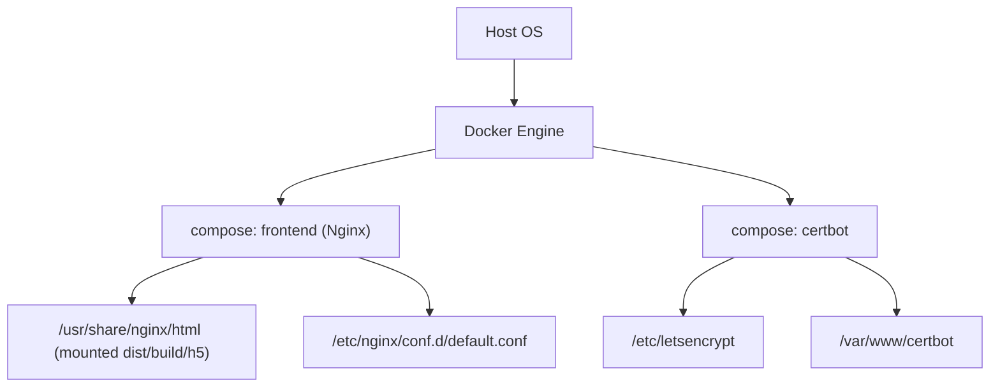
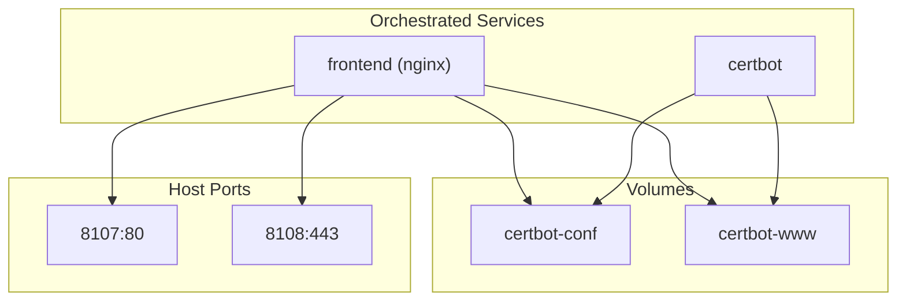
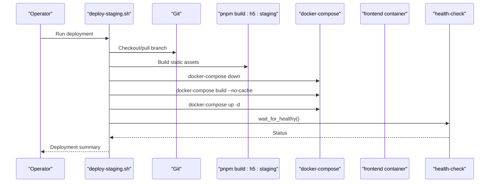
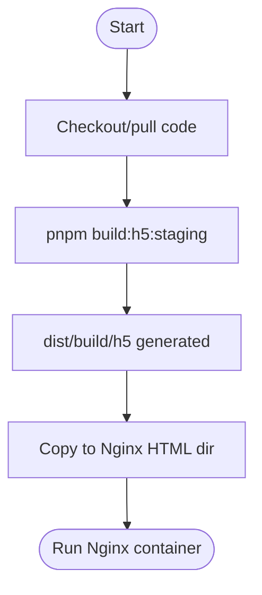
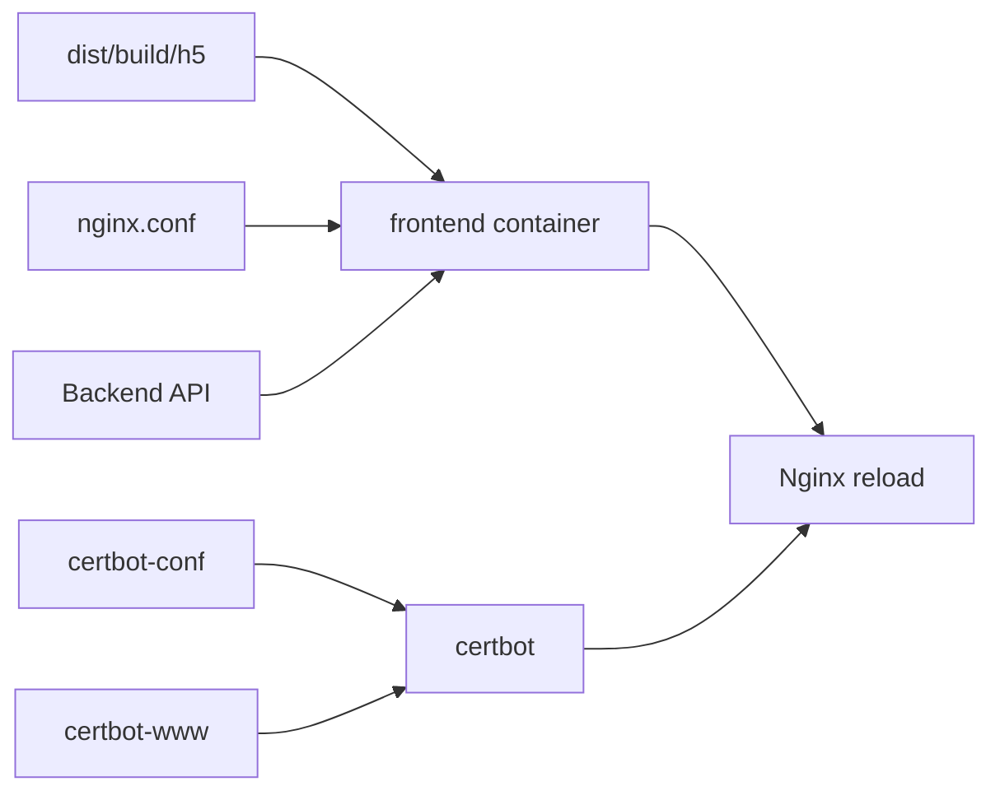

# Containerization & Orchestration

<cite>
**Referenced Files in This Document**
- [Dockerfile](file://linux-190-deploy/Dockerfile)
- [docker-compose.yml](file://linux-190-deploy/docker-compose.yml)
- [nginx.conf](file://linux-190-deploy/nginx.conf)
- [README.md](file://linux-190-deploy/README.md)
- [deploy-staging.sh](file://linux-190-deploy/deploy-staging.sh)
- [01-stop-and-clean.sh](file://linux-190-deploy/01-stop-and-clean.sh)
- [02-start-services.sh](file://linux-190-deploy/02-start-services.sh)
- [04-health-check.sh](file://linux-190-deploy/04-health-check.sh)
- [config.sh](file://linux-190-deploy/config.sh)
- [utils.sh](file://linux-190-deploy/utils.sh)
- [init-letsencrypt.sh](file://linux-190-deploy/init-letsencrypt.sh)
- [setup-https.sh](file://linux-190-deploy/setup-https.sh)
- [package.json](file://package.json)
</cite>

## Table of Contents
1. [Introduction](#introduction)
2. [Project Structure](#project-structure)
3. [Core Components](#core-components)
4. [Architecture Overview](#architecture-overview)
5. [Detailed Component Analysis](#detailed-component-analysis)
6. [Dependency Analysis](#dependency-analysis)
7. [Performance Considerations](#performance-considerations)
8. [Security & Compliance](#security--compliance)
9. [Troubleshooting Guide](#troubleshooting-guide)
10. [Conclusion](#conclusion)
11. [Appendices](#appendices)

## Introduction
This document describes the containerization and orchestration of the WeTogether platform’s frontend staging environment. It covers the Docker container setup, Dockerfile configuration, multi-service orchestration using docker-compose, build and runtime processes, networking and volumes, environment variable management, scaling and health checks, security best practices, and operational troubleshooting. The deployment stack consists of:
- A static Nginx web server serving the uni-app built artifacts
- An automated certificate management service using Certbot
- Automated health checks and lifecycle management via shell scripts

## Project Structure
The containerization assets are primarily located under the linux-190-deploy directory. The frontend build is produced by the uni-app toolchain and placed into dist/build/h5/, which is served by Nginx inside the container.



**Diagram sources**
- [docker-compose.yml:1-40](file://linux-190-deploy/docker-compose.yml#L1-L40)
- [Dockerfile:1-18](file://linux-190-deploy/Dockerfile#L1-L18)
- [nginx.conf:1-168](file://linux-190-deploy/nginx.conf#L1-L168)

**Section sources**
- [README.md:1-443](file://linux-190-deploy/README.md#L1-L443)
- [docker-compose.yml:1-40](file://linux-190-deploy/docker-compose.yml#L1-L40)

## Core Components
- Frontend service (Nginx)
  - Serves the static build from dist/build/h5
  - Provides API and WebSocket proxying to the backend
  - SPA routing support and security headers
- Certbot service
  - Automates ACME challenges and certificate renewal
  - Persists certs and webroot to named volumes
- Orchestrator scripts
  - One-click deployment, stop/clean, start services, and health checks
  - Centralized configuration and reusable utilities

Key runtime characteristics:
- Ports exposed: 8107 (HTTP), 8108 (HTTPS)
- Health check: periodic HTTP GET against root path
- Volumes: certbot-conf, certbot-www for certs and challenge files
- Network: isolated bridge network for services

**Section sources**
- [Dockerfile:1-18](file://linux-190-deploy/Dockerfile#L1-L18)
- [docker-compose.yml:1-40](file://linux-190-deploy/docker-compose.yml#L1-L40)
- [nginx.conf:1-168](file://linux-190-deploy/nginx.conf#L1-L168)
- [deploy-staging.sh:1-126](file://linux-190-deploy/deploy-staging.sh#L1-L126)
- [02-start-services.sh:1-65](file://linux-190-deploy/02-start-services.sh#L1-L65)
- [04-health-check.sh:1-84](file://linux-190-deploy/04-health-check.sh#L1-L84)
- [config.sh:1-30](file://linux-190-deploy/config.sh#L1-L30)

## Architecture Overview
The staging deployment runs two primary containers orchestrated by Docker Compose:
- frontend: Nginx serving the uni-app static site and proxying API/WebSocket traffic
- certbot: ACME client for certificate issuance and renewal



**Diagram sources**
- [docker-compose.yml:1-40](file://linux-190-deploy/docker-compose.yml#L1-L40)
- [nginx.conf:1-168](file://linux-190-deploy/nginx.conf#L1-L168)

## Detailed Component Analysis

### Nginx Frontend Service
Responsibilities:
- Serve static assets from /usr/share/nginx/html
- Proxy API requests to backend service
- Proxy WebSocket connections to backend service
- Enable gzip compression and long-lived caching for static assets
- Support SPA routing via fallback to index.html
- Apply security headers

Build and runtime:
- Build context uses the project root and Dockerfile
- Copies dist/build/h5 into the Nginx HTML directory
- Applies permissions and ownership for safe serving
- Exposes port 80

Health checks:
- Periodic HTTP GET to root path
- Configurable intervals and retries

Networking:
- Bridge network isolation
- Port mapping 8107:80 and 8108:443

Volumes:
- Named volumes for certificate persistence and ACME webroot

**Section sources**
- [Dockerfile:1-18](file://linux-190-deploy/Dockerfile#L1-L18)
- [docker-compose.yml:1-40](file://linux-190-deploy/docker-compose.yml#L1-L40)
- [nginx.conf:1-168](file://linux-190-deploy/nginx.conf#L1-L168)
- [02-start-services.sh:1-65](file://linux-190-deploy/02-start-services.sh#L1-L65)

### Certbot Certificate Management
Responsibilities:
- Issue and renew TLS certificates via ACME
- Serve ACME challenge files from webroot
- Persist certificates and metadata to named volumes

Operational flow:
- Initialization script sets up temporary certificate, requests real certificate, and reloads Nginx
- Compose runs a long-running container that periodically renews certificates

**Section sources**
- [docker-compose.yml:25-31](file://linux-190-deploy/docker-compose.yml#L25-L31)
- [init-letsencrypt.sh:1-85](file://linux-190-deploy/init-letsencrypt.sh#L1-L85)
- [setup-https.sh:1-82](file://linux-190-deploy/setup-https.sh#L1-L82)

### Orchestrator Scripts and Configuration
- deploy-staging.sh: Full pipeline including code checkout, build, stop old containers, build and start new containers, and health verification
- 01-stop-and-clean.sh: Stop/remove containers and optionally remove images
- 02-start-services.sh: Validate build artifacts, build image, start containers, and wait for health
- 04-health-check.sh: Verify container state, health status, port listening, and HTTP/API connectivity
- config.sh: Centralized environment variables for paths, ports, backend URLs, and timeouts
- utils.sh: Shared logging and wait helpers (wait_for_healthy, wait_for_port)



**Diagram sources**
- [deploy-staging.sh:1-126](file://linux-190-deploy/deploy-staging.sh#L1-L126)
- [02-start-services.sh:1-65](file://linux-190-deploy/02-start-services.sh#L1-L65)
- [04-health-check.sh:1-84](file://linux-190-deploy/04-health-check.sh#L1-L84)
- [config.sh:1-30](file://linux-190-deploy/config.sh#L1-L30)

**Section sources**
- [deploy-staging.sh:1-126](file://linux-190-deploy/deploy-staging.sh#L1-L126)
- [01-stop-and-clean.sh:1-56](file://linux-190-deploy/01-stop-and-clean.sh#L1-L56)
- [02-start-services.sh:1-65](file://linux-190-deploy/02-start-services.sh#L1-L65)
- [04-health-check.sh:1-84](file://linux-190-deploy/04-health-check.sh#L1-L84)
- [config.sh:1-30](file://linux-190-deploy/config.sh#L1-L30)
- [utils.sh:1-116](file://linux-190-deploy/utils.sh#L1-L116)

### Build Process and Artifacts
- The frontend is built using the uni-app build command with the staging mode
- Build output is placed under dist/build/h5
- The Dockerfile copies this directory into the Nginx HTML root



**Diagram sources**
- [README.md:108-125](file://linux-190-deploy/README.md#L108-L125)
- [Dockerfile:3-7](file://linux-190-deploy/Dockerfile#L3-L7)
- [package.json:4-12](file://package.json#L4-L12)

**Section sources**
- [README.md:108-125](file://linux-190-deploy/README.md#L108-L125)
- [package.json:4-12](file://package.json#L4-L12)
- [Dockerfile:3-7](file://linux-190-deploy/Dockerfile#L3-L7)

### Networking and Proxying
- API proxy: Requests under /api/ are proxied to the backend service
- WebSocket proxy: Requests under /ws/ are upgraded and proxied
- SPA routing: All unmatched routes fall back to index.html
- Security headers: X-Frame-Options, X-Content-Type-Options, X-XSS-Protection applied
- CORS: Allow-origin and preflight handling configured for development convenience

```mermaid
flowchart TD
Client["Browser"] --> |HTTP(S)| Nginx["Nginx"]
Nginx --> |/api/*| API["Backend API"]
Nginx --> |/ws/*| WS["Backend WebSocket"]
Nginx --> |SPA fallback| HTML["index.html"]
```

**Diagram sources**
- [nginx.conf:29-74](file://linux-190-deploy/nginx.conf#L29-L74)

**Section sources**
- [nginx.conf:29-74](file://linux-190-deploy/nginx.conf#L29-L74)

### Volume Mounting and Persistence
- certbot-conf: Stores certificates and metadata
- certbot-www: Serves ACME challenge files
- These volumes persist across container recreation and enable seamless certificate renewal

**Section sources**
- [docker-compose.yml:37-40](file://linux-190-deploy/docker-compose.yml#L37-L40)

### Environment Variable Management
Centralized configuration is managed in config.sh:
- Paths: PROJECT_ROOT, DEPLOY_DIR
- Container identity: CONTAINER_NAME
- Ports: FRONTEND_PORT, FRONTEND_HTTPS_PORT
- Backend: BACKEND_API_URL
- Git branch: GIT_BRANCH
- Timeouts and automation flags: HEALTH_CHECK_TIMEOUT, AUTO_CONFIRM

These variables are consumed by scripts and compose files to keep deployment settings consistent.

**Section sources**
- [config.sh:1-30](file://linux-190-deploy/config.sh#L1-L30)

### Scaling and Resource Limits
- Current setup: Single replica per service
- Recommendations for production:
  - Scale frontend replicas behind a load balancer
  - Add CPU/memory limits and reservations
  - Configure restart policies and healthchecks with appropriate thresholds
  - Use separate networks per environment

Note: The current compose file does not define explicit resource limits or replica counts.

**Section sources**
- [docker-compose.yml:1-40](file://linux-190-deploy/docker-compose.yml#L1-L40)

## Dependency Analysis
High-level dependencies:
- Frontend service depends on:
  - Built artifacts in dist/build/h5
  - Nginx configuration file
  - Backend API availability for proxying
- Certbot service depends on:
  - Named volumes for persistence
  - Frontend container for Nginx reload after certificate acquisition



**Diagram sources**
- [Dockerfile:3-7](file://linux-190-deploy/Dockerfile#L3-L7)
- [nginx.conf:1-168](file://linux-190-deploy/nginx.conf#L1-L168)
- [docker-compose.yml:25-31](file://linux-190-deploy/docker-compose.yml#L25-L31)

**Section sources**
- [Dockerfile:3-7](file://linux-190-deploy/Dockerfile#L3-L7)
- [nginx.conf:1-168](file://linux-190-deploy/nginx.conf#L1-L168)
- [docker-compose.yml:25-31](file://linux-190-deploy/docker-compose.yml#L25-L31)

## Performance Considerations
- Static delivery: gzip enabled and long cache headers for assets
- SPA routing: try_files fallback reduces server-side routing overhead
- Proxy tuning: configurable timeouts for API and WebSocket paths
- Build optimization: rely on uni-app build modes and asset optimization
- Network: consider enabling HTTP/2 for HTTPS traffic

[No sources needed since this section provides general guidance]

## Security & Compliance
- TLS: Certificates issued and renewed automatically; HTTPS can be enabled via Nginx configuration
- Security headers: applied at the Nginx level
- Least privilege: Nginx runs as non-root user inside the container
- Secrets: none required in the current setup; ensure secrets are managed externally in production
- Image scanning: integrate a scanner in CI/CD to scan base images and application layers
- Vulnerability management: automate base image updates and monitor advisory feeds

[No sources needed since this section provides general guidance]

## Troubleshooting Guide
Common issues and resolutions:
- Container fails to start
  - Check port conflicts and container logs
  - Validate build artifacts exist
  - Inspect Nginx configuration mounted into the container
- Cannot access frontend
  - Verify firewall rules and port listening
  - Test locally via curl
- API connectivity issues
  - Confirm backend service availability
  - Review Nginx proxy configuration
  - Check Nginx error logs
- Certificate problems
  - Ensure ACME challenge path is reachable
  - Re-run initialization script and reload Nginx

Operational commands:
- View logs, restart, stop services
- Health check via dedicated script
- Enter container for interactive inspection

**Section sources**
- [README.md:194-429](file://linux-190-deploy/README.md#L194-L429)
- [04-health-check.sh:1-84](file://linux-190-deploy/04-health-check.sh#L1-L84)
- [02-start-services.sh:1-65](file://linux-190-deploy/02-start-services.sh#L1-L65)
- [01-stop-and-clean.sh:1-56](file://linux-190-deploy/01-stop-and-clean.sh#L1-L56)

## Conclusion
The WeTogether staging deployment leverages a minimal yet robust containerized stack: a single Nginx container serving the uni-app frontend with integrated API/WebSocket proxying and a companion Certbot container for TLS automation. The provided scripts streamline the entire lifecycle from code checkout to health verification. For production, consider adding scaling, resource limits, centralized secrets management, and automated image scanning to meet reliability and security requirements.

[No sources needed since this section summarizes without analyzing specific files]

## Appendices

### Appendix A: Ports and Services
- frontend service
  - Ports: 8107:80, 8108:443
  - Health check: HTTP GET root path
  - Volumes: certbot-conf, certbot-www
- certbot service
  - Entrypoint: periodic renewal loop
  - Volumes: certbot-conf, certbot-www

**Section sources**
- [docker-compose.yml:1-40](file://linux-190-deploy/docker-compose.yml#L1-L40)

### Appendix B: Build and Runtime Commands
- Build frontend: pnpm build:h5:staging
- Deploy: ./deploy-staging.sh
- Start services: ./02-start-services.sh
- Stop and clean: ./01-stop-and-clean.sh
- Health check: ./04-health-check.sh

**Section sources**
- [README.md:53-91](file://linux-190-deploy/README.md#L53-L91)
- [package.json:4-12](file://package.json#L4-L12)