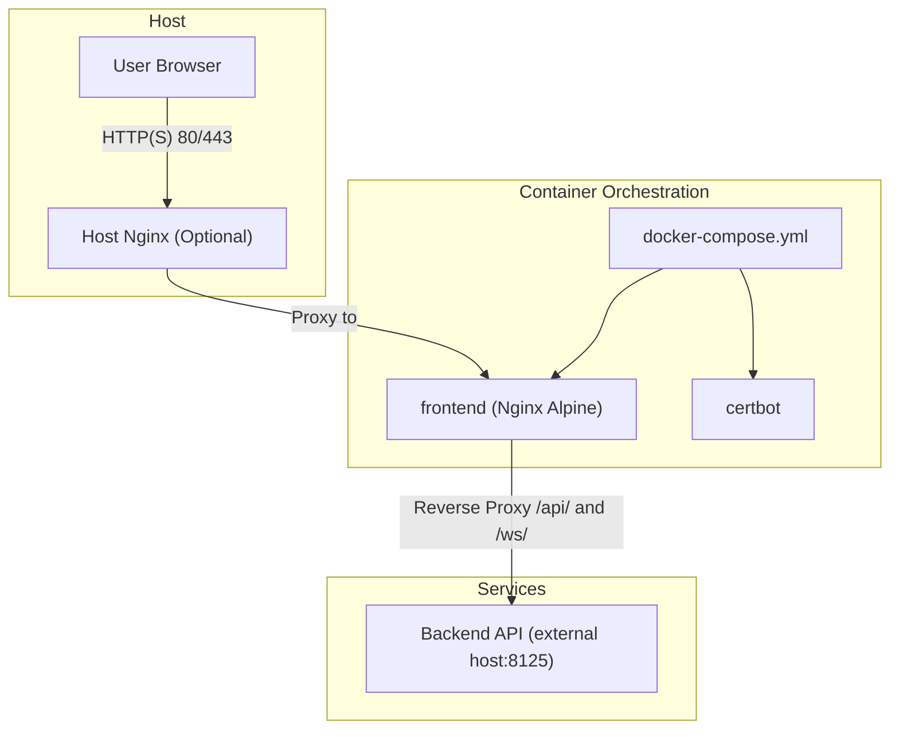
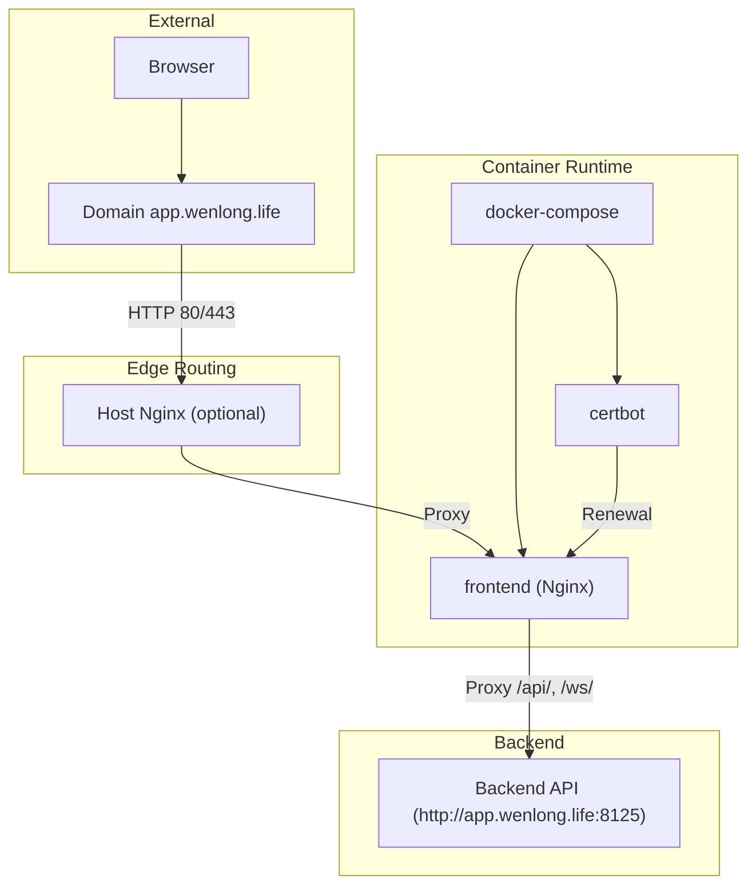
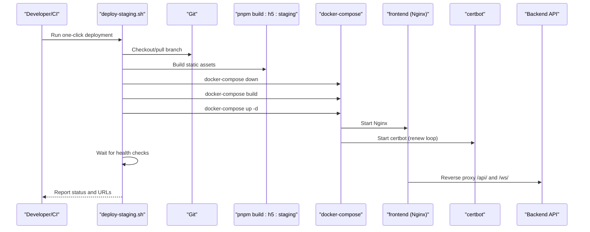
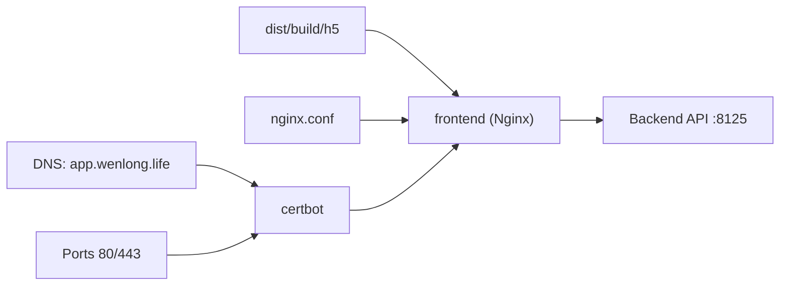

# Deployment & DevOps

<cite>
**Referenced Files in This Document**
- [README.md](file://linux-190-deploy/README.md)
- [QUICKSTART.md](file://linux-190-deploy/QUICKSTART.md)
- [HTTPS-README.md](file://linux-190-deploy/HTTPS-README.md)
- [Dockerfile](file://linux-190-deploy/Dockerfile)
- [docker-compose.yml](file://linux-190-deploy/docker-compose.yml)
- [nginx.conf](file://linux-190-deploy/nginx.conf)
- [app.wenlong.life.nginx.conf](file://linux-190-deploy/app.wenlong.life.nginx.conf)
- [config.sh](file://linux-190-deploy/config.sh)
- [deploy-staging.sh](file://linux-190-deploy/deploy-staging.sh)
- [01-stop-and-clean.sh](file://linux-190-deploy/01-stop-and-clean.sh)
- [02-start-services.sh](file://linux-190-deploy/02-start-services.sh)
- [04-health-check.sh](file://linux-190-deploy/04-health-check.sh)
- [init-letsencrypt.sh](file://linux-190-deploy/init-letsencrypt.sh)
- [setup-https.sh](file://linux-190-deploy/setup-https.sh)
- [test-config.sh](file://linux-190-deploy/test-config.sh)
- [use.txt](file://linux-190-deploy/use.txt)
</cite>

## Table of Contents
1. [Introduction](#introduction)
2. [Project Structure](#project-structure)
3. [Core Components](#core-components)
4. [Architecture Overview](#architecture-overview)
5. [Detailed Component Analysis](#detailed-component-analysis)
6. [Dependency Analysis](#dependency-analysis)
7. [Performance Considerations](#performance-considerations)
8. [Troubleshooting Guide](#troubleshooting-guide)
9. [Conclusion](#conclusion)
10. [Appendices](#appendices)

## Introduction
This document provides comprehensive deployment and DevOps guidance for the WeTogether platform. It covers production deployment using Docker containers and Nginx, CI/CD pipeline setup, automated testing and deployment scripts, SSL/TLS configuration with Certbot and Let’s Encrypt, environment configuration for development, staging, and production, server prerequisites, dependency installation, service orchestration, troubleshooting, log monitoring, performance optimization, security considerations, backup strategies, and disaster recovery procedures.

## Project Structure
The deployment artifacts and automation scripts are centralized under the linux-190-deploy directory. Key elements include:
- Containerization and orchestration via Docker Compose
- Nginx serving static assets and reverse proxying to the backend API and WebSocket endpoints
- HTTPS support with automatic certificate management using Certbot and Let’s Encrypt
- Environment-specific configuration and deployment scripts

**Diagram sources**
- [docker-compose.yml:1-40](file://linux-190-deploy/docker-compose.yml#L1-L40)
- [nginx.conf:1-168](file://linux-190-deploy/nginx.conf#L1-L168)
- [app.wenlong.life.nginx.conf:1-53](file://linux-190-deploy/app.wenlong.life.nginx.conf#L1-L53)

**Section sources**
- [README.md:1-443](file://linux-190-deploy/README.md#L1-L443)
- [QUICKSTART.md:1-101](file://linux-190-deploy/QUICKSTART.md#L1-L101)

## Core Components
- Frontend container (Nginx Alpine) serving built static assets and acting as a reverse proxy
- Certbot container for automated certificate lifecycle management
- Optional host-side Nginx for edge routing and HTTPS termination
- Environment configuration and deployment automation scripts

Key configuration and runtime behaviors:
- Static asset caching and compression
- API and WebSocket proxying with timeouts and headers
- SPA routing fallback to index.html
- Health checks and readiness probes
- Automated certificate renewal and optional staging mode

**Section sources**
- [Dockerfile:1-18](file://linux-190-deploy/Dockerfile#L1-L18)
- [docker-compose.yml:1-40](file://linux-190-deploy/docker-compose.yml#L1-L40)
- [nginx.conf:1-168](file://linux-190-deploy/nginx.conf#L1-L168)
- [config.sh:1-30](file://linux-190-deploy/config.sh#L1-L30)

## Architecture Overview
The platform runs in a containerized environment with Nginx serving static content and proxying API/WebSocket traffic to the backend. HTTPS is managed by Certbot with automatic renewal. An optional host Nginx can terminate TLS and forward to the containerized Nginx.

**Diagram sources**
- [docker-compose.yml:1-40](file://linux-190-deploy/docker-compose.yml#L1-L40)
- [nginx.conf:1-168](file://linux-190-deploy/nginx.conf#L1-L168)
- [app.wenlong.life.nginx.conf:1-53](file://linux-190-deploy/app.wenlong.life.nginx.conf#L1-L53)

## Detailed Component Analysis

### Containerization and Build
- The frontend container is built from an Nginx Alpine base, copies built assets, applies permissions, exposes port 80, and starts Nginx in the foreground.
- The Docker Compose file defines:
  - frontend service with port mapping 8107:80 and 8108:443
  - certbot service for certificate management
  - named volumes for persistent certificate storage
  - health check against localhost

Operational notes:
- The build process expects pre-built static assets in dist/build/h5.
- The container relies on Nginx configuration mounted from the repository.

**Section sources**
- [Dockerfile:1-18](file://linux-190-deploy/Dockerfile#L1-L18)
- [docker-compose.yml:1-40](file://linux-190-deploy/docker-compose.yml#L1-L40)

### Reverse Proxy and Nginx Configuration
Nginx handles:
- Static asset caching and compression
- API proxy to backend (with CORS headers and timeouts)
- WebSocket proxy with upgrade headers
- SPA routing fallback to index.html
- Security headers (X-Frame-Options, X-Content-Type-Options, X-XSS-Protection)
- Optional HTTPS server block with TLS 1.2/1.3, HSTS, and HTTP/2

Host-side Nginx configuration supports:
- ACME challenge path for certificate verification
- Reverse proxy to the containerized Nginx on port 8107

**Section sources**
- [nginx.conf:1-168](file://linux-190-deploy/nginx.conf#L1-L168)
- [app.wenlong.life.nginx.conf:1-53](file://linux-190-deploy/app.wenlong.life.nginx.conf#L1-L53)

### SSL/TLS with Certbot and Let’s Encrypt
- Automatic certificate acquisition and renewal using Certbot
- Two deployment modes:
  - Container-native: certbot container manages certs and reloads Nginx inside the frontend container
  - Host-native: standalone host Nginx with certonly flow and manual enablement of HTTPS block
- Staging mode supported to avoid rate limits during testing
- Certificate storage in named volumes for persistence

**Section sources**
- [init-letsencrypt.sh:1-85](file://linux-190-deploy/init-letsencrypt.sh#L1-L85)
- [setup-https.sh:1-82](file://linux-190-deploy/setup-https.sh#L1-L82)
- [HTTPS-README.md:1-143](file://linux-190-deploy/HTTPS-README.md#L1-L143)
- [docker-compose.yml:25-31](file://linux-190-deploy/docker-compose.yml#L25-L31)

### Environment Configuration
Environment variables define:
- Project root and deployment directory
- Container name and port mappings
- Backend API URL
- Git branch and health check timeout
- Auto-confirm flag for CI/CD automation

These variables are consumed by deployment scripts and compose configuration.

**Section sources**
- [config.sh:1-30](file://linux-190-deploy/config.sh#L1-L30)

### Deployment Scripts
- One-click staging deployment script orchestrates code checkout, build, container cleanup, image build, service startup, and health checks
- Stop-and-clean script removes containers and optionally images
- Start-services script validates build artifacts, builds images, starts services, and performs health checks
- Health-check script verifies container state, health status, port listening, and HTTP/API connectivity
- Configuration test script validates Nginx syntax, compose config, and port availability
- HTTPS setup scripts for host Nginx and containerized certbot flows

**Section sources**
- [deploy-staging.sh:1-126](file://linux-190-deploy/deploy-staging.sh#L1-L126)
- [01-stop-and-clean.sh:1-56](file://linux-190-deploy/01-stop-and-clean.sh#L1-L56)
- [02-start-services.sh:1-65](file://linux-190-deploy/02-start-services.sh#L1-L65)
- [04-health-check.sh:1-84](file://linux-190-deploy/04-health-check.sh#L1-L84)
- [test-config.sh:1-61](file://linux-190-deploy/test-config.sh#L1-L61)
- [use.txt:1-22](file://linux-190-deploy/use.txt#L1-L22)

### CI/CD Pipeline Setup
Recommended pipeline stages:
- Build stage: install dependencies, lint, unit/e2e tests, and build static assets
- Test stage: run automated tests and configuration validation
- Deploy stage: execute the staging deployment script with auto-confirm enabled
- Post-deploy: run health checks and notify stakeholders

Automation hooks:
- Use AUTO_CONFIRM=true for non-interactive CI/CD runs
- Integrate with artifact storage for static assets and logs

**Section sources**
- [deploy-staging.sh:29-37](file://linux-190-deploy/deploy-staging.sh#L29-L37)
- [use.txt:1-22](file://linux-190-deploy/use.txt#L1-L22)

### Service Orchestration
- Docker Compose manages two primary services: frontend and certbot
- Named volumes persist certificates across deployments
- Health checks ensure readiness before considering the service healthy
- Network isolation via a dedicated bridge network

**Section sources**
- [docker-compose.yml:1-40](file://linux-190-deploy/docker-compose.yml#L1-L40)

### API Workflow Sequence (Deployment)

**Diagram sources**
- [deploy-staging.sh:42-92](file://linux-190-deploy/deploy-staging.sh#L42-L92)
- [docker-compose.yml:1-40](file://linux-190-deploy/docker-compose.yml#L1-L40)
- [nginx.conf:29-69](file://linux-190-deploy/nginx.conf#L29-L69)

## Dependency Analysis
- Frontend container depends on:
  - Prebuilt static assets in dist/build/h5
  - Nginx configuration mounted from repository
  - Backend API availability on port 8125
- Certbot depends on:
  - DNS resolution for domain
  - Port 80 accessibility for ACME challenges
  - Persistent volume mounts for certificates

**Diagram sources**
- [Dockerfile:3-7](file://linux-190-deploy/Dockerfile#L3-L7)
- [docker-compose.yml:10-12](file://linux-190-deploy/docker-compose.yml#L10-L12)
- [nginx.conf:1-168](file://linux-190-deploy/nginx.conf#L1-L168)

**Section sources**
- [Dockerfile:1-18](file://linux-190-deploy/Dockerfile#L1-L18)
- [docker-compose.yml:1-40](file://linux-190-deploy/docker-compose.yml#L1-L40)
- [nginx.conf:1-168](file://linux-190-deploy/nginx.conf#L1-L168)

## Performance Considerations
- Enable gzip compression and set long cache TTLs for static assets
- Use HTTP/2 and keep-alive connections for improved latency
- Optimize build outputs (code splitting, tree shaking, minification)
- Monitor Nginx access and error logs for performance bottlenecks
- Scale horizontally by adding more frontend instances behind a load balancer

[No sources needed since this section provides general guidance]

## Troubleshooting Guide

Common issues and resolutions:
- Container fails to start
  - Check port conflicts, missing build artifacts, and Nginx configuration errors
  - Inspect container logs and verify health status
- Cannot access frontend or backend
  - Verify firewall rules and port listening
  - Test local curl requests and backend connectivity
- Blank page or routing issues
  - Confirm SPA fallback to index.html and correct proxy paths
  - Review browser console and Nginx access logs
- SSL/TLS problems
  - Validate DNS resolution and ACME challenge paths
  - Check certbot logs and certificate validity
  - Re-test Nginx configuration syntax

Operational commands:
- View logs, restart services, stop services, and run health checks
- Validate Nginx configuration and docker-compose configuration
- Manually renew certificates and reload Nginx

**Section sources**
- [README.md:194-429](file://linux-190-deploy/README.md#L194-L429)
- [04-health-check.sh:19-72](file://linux-190-deploy/04-health-check.sh#L19-L72)
- [test-config.sh:14-53](file://linux-190-deploy/test-config.sh#L14-L53)
- [init-letsencrypt.sh:89-94](file://linux-190-deploy/init-letsencrypt.sh#L89-L94)

## Conclusion
The WeTogether platform employs a robust, container-first deployment model with Nginx and Certbot for efficient, secure delivery. The provided scripts and configurations streamline development, staging, and production deployments, while HTTPS automation ensures secure communication. Adopting the recommended CI/CD practices, monitoring, and operational procedures will maintain reliability and performance across environments.

[No sources needed since this section summarizes without analyzing specific files]

## Appendices

### Environment Configuration Matrix
- Development: Use local Nginx and backend for rapid iteration; adjust ports and proxy targets accordingly
- Staging: Mirror production with Docker Compose; enable HTTPS with Certbot; validate with health checks
- Production: Harden security headers, enforce HSTS, monitor certificate renewal, and automate rollbacks

[No sources needed since this section provides general guidance]

### Backup and Disaster Recovery
- Back up certificate volumes (named volumes) regularly
- Snapshot container images and configuration files
- Maintain a documented rollback procedure using previous images and persisted volumes
- Automate periodic backups and test restoration procedures

[No sources needed since this section provides general guidance]