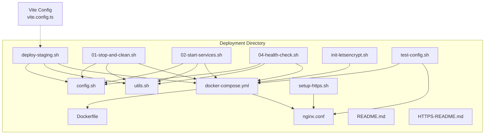
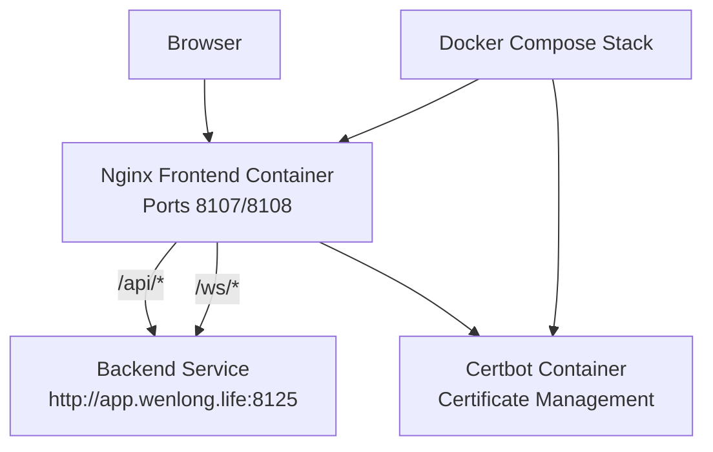
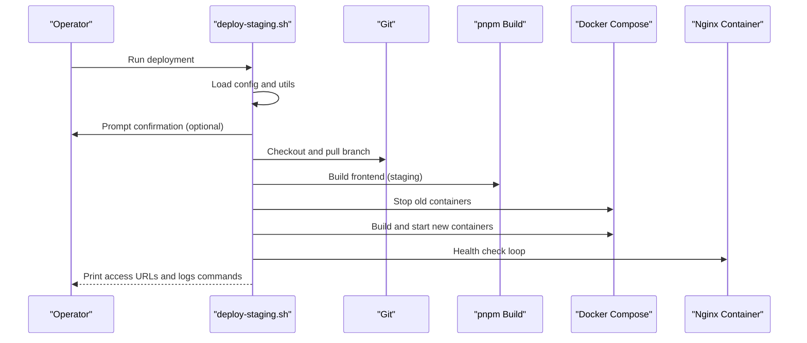
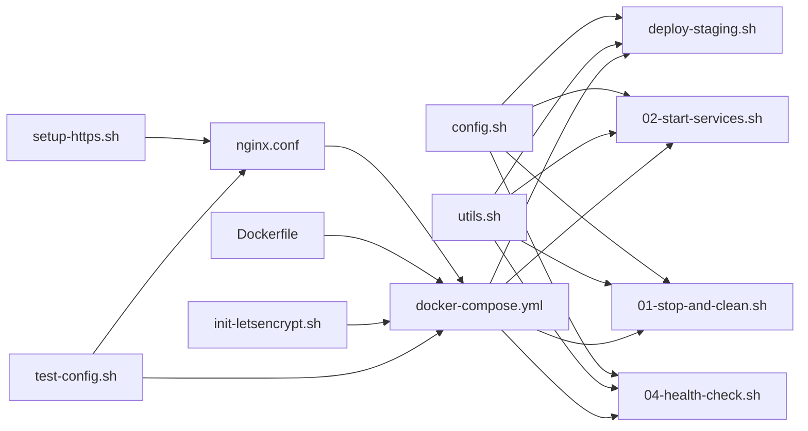
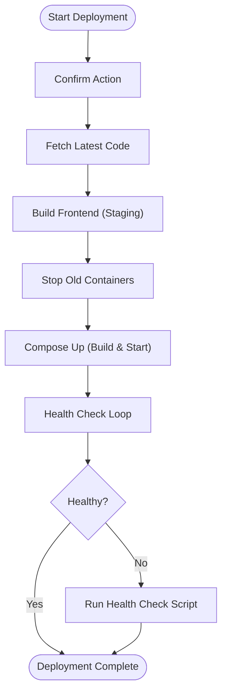

# Environment Management

<cite>
**Referenced Files in This Document**
- [config.sh](file://linux-190-deploy/config.sh)
- [deploy-staging.sh](file://linux-190-deploy/deploy-staging.sh)
- [docker-compose.yml](file://linux-190-deploy/docker-compose.yml)
- [Dockerfile](file://linux-190-deploy/Dockerfile)
- [README.md](file://linux-190-deploy/README.md)
- [utils.sh](file://linux-190-deploy/utils.sh)
- [01-stop-and-clean.sh](file://linux-190-deploy/01-stop-and-clean.sh)
- [02-start-services.sh](file://linux-190-deploy/02-start-services.sh)
- [04-health-check.sh](file://linux-190-deploy/04-health-check.sh)
- [nginx.conf](file://linux-190-deploy/nginx.conf)
- [init-letsencrypt.sh](file://linux-190-deploy/init-letsencrypt.sh)
- [setup-https.sh](file://linux-190-deploy/setup-https.sh)
- [test-config.sh](file://linux-190-deploy/test-config.sh)
- [HTTPS-README.md](file://linux-190-deploy/HTTPS-README.md)
- [vite.config.ts](file://vite.config.ts)
</cite>

## Table of Contents
1. [Introduction](#introduction)
2. [Project Structure](#project-structure)
3. [Core Components](#core-components)
4. [Architecture Overview](#architecture-overview)
5. [Detailed Component Analysis](#detailed-component-analysis)
6. [Dependency Analysis](#dependency-analysis)
7. [Performance Considerations](#performance-considerations)
8. [Troubleshooting Guide](#troubleshooting-guide)
9. [Conclusion](#conclusion)
10. [Appendices](#appendices)

## Introduction
This document describes the environment management system for the WeTogether platform’s frontend, focusing on the staging environment. It explains configuration templates, variable management, deployment scripts, environment-specific settings, service endpoints, deployment automation, rollback procedures, environment switching, validation and testing, configuration drift detection, security and access controls, audit logging, troubleshooting, and performance optimization strategies. The staging environment uses Docker Compose and Nginx to serve the built frontend and proxy API/WebSocket traffic to the backend.

## Project Structure
The environment management is centered around a dedicated deployment directory containing configuration and automation scripts. The staging environment is defined by a set of shell scripts and a Docker Compose stack that runs an Nginx-based frontend container and a Certbot container for HTTPS certificate management.

**Diagram sources**
- [config.sh:1-30](file://linux-190-deploy/config.sh#L1-L30)
- [docker-compose.yml:1-40](file://linux-190-deploy/docker-compose.yml#L1-L40)
- [Dockerfile:1-18](file://linux-190-deploy/Dockerfile#L1-L18)
- [nginx.conf:1-168](file://linux-190-deploy/nginx.conf#L1-L168)
- [utils.sh:1-116](file://linux-190-deploy/utils.sh#L1-L116)
- [deploy-staging.sh:1-126](file://linux-190-deploy/deploy-staging.sh#L1-L126)
- [01-stop-and-clean.sh:1-56](file://linux-190-deploy/01-stop-and-clean.sh#L1-L56)
- [02-start-services.sh:1-65](file://linux-190-deploy/02-start-services.sh#L1-L65)
- [04-health-check.sh:1-84](file://linux-190-deploy/04-health-check.sh#L1-L84)
- [init-letsencrypt.sh:1-85](file://linux-190-deploy/init-letsencrypt.sh#L1-L85)
- [setup-https.sh:1-82](file://linux-190-deploy/setup-https.sh#L1-L82)
- [test-config.sh:1-61](file://linux-190-deploy/test-config.sh#L1-L61)
- [README.md:1-443](file://linux-190-deploy/README.md#L1-L443)
- [HTTPS-README.md:1-143](file://linux-190-deploy/HTTPS-README.md#L1-L143)
- [vite.config.ts:1-49](file://vite.config.ts#L1-L49)

**Section sources**
- [README.md:1-443](file://linux-190-deploy/README.md#L1-L443)
- [HTTPS-README.md:1-143](file://linux-190-deploy/HTTPS-README.md#L1-L143)

## Core Components
- Environment configuration template: centralized via environment variables in a single script.
- Deployment automation: orchestrated by a primary deployment script that coordinates code fetching, building, container lifecycle, and health checks.
- Service endpoints: Nginx proxies API and WebSocket traffic to the backend service.
- HTTPS management: automated certificate acquisition and renewal via Certbot, integrated with Docker Compose.
- Validation and testing: health checks, configuration tests, and manual verification steps.
- Security and access controls: Nginx security headers, CORS configuration, and certificate-based transport security.
- Audit logging: container logs and Nginx access/error logs for operational visibility.

**Section sources**
- [config.sh:1-30](file://linux-190-deploy/config.sh#L1-L30)
- [deploy-staging.sh:1-126](file://linux-190-deploy/deploy-staging.sh#L1-L126)
- [docker-compose.yml:1-40](file://linux-190-deploy/docker-compose.yml#L1-L40)
- [nginx.conf:1-168](file://linux-190-deploy/nginx.conf#L1-L168)
- [init-letsencrypt.sh:1-85](file://linux-190-deploy/init-letsencrypt.sh#L1-L85)
- [04-health-check.sh:1-84](file://linux-190-deploy/04-health-check.sh#L1-L84)
- [test-config.sh:1-61](file://linux-190-deploy/test-config.sh#L1-L61)

## Architecture Overview
The staging environment architecture consists of:
- Frontend service: Nginx serving static assets and proxying API/WebSocket requests.
- Backend service: reachable via the configured backend URL.
- Certificate management: Certbot container handling certificate issuance and renewal.
- Automation: shell scripts orchestrate builds, deployments, and validations.

**Diagram sources**
- [docker-compose.yml:1-40](file://linux-190-deploy/docker-compose.yml#L1-L40)
- [nginx.conf:29-69](file://linux-190-deploy/nginx.conf#L29-L69)
- [config.sh:17-21](file://linux-190-deploy/config.sh#L17-L21)

## Detailed Component Analysis

### Environment Configuration Template
The configuration template centralizes environment variables for paths, container names, ports, backend URLs, Git branch, timeouts, and auto-confirm behavior. These variables are loaded by all deployment and maintenance scripts.

Key responsibilities:
- Define project root and deployment directory.
- Set container name and port mappings.
- Configure backend API URL and Git branch.
- Control health check timeout and CI-friendly auto confirm behavior.

Operational impact:
- Ensures consistent behavior across scripts.
- Enables easy environment switching by editing a single file.

**Section sources**
- [config.sh:1-30](file://linux-190-deploy/config.sh#L1-L30)

### Deployment Scripts

#### Primary Deployment Script
The primary deployment script orchestrates a complete deployment cycle:
- Validates user confirmation (skippable in CI).
- Fetches latest code from the configured Git branch.
- Builds the frontend using the staging build target.
- Stops existing containers and removes volumes.
- Builds and starts new containers.
- Performs health checks and prints access links and next steps.

**Diagram sources**
- [deploy-staging.sh:18-126](file://linux-190-deploy/deploy-staging.sh#L18-L126)
- [config.sh:17-29](file://linux-190-deploy/config.sh#L17-L29)
- [utils.sh:64-89](file://linux-190-deploy/utils.sh#L64-L89)

**Section sources**
- [deploy-staging.sh:1-126](file://linux-190-deploy/deploy-staging.sh#L1-L126)
- [utils.sh:1-116](file://linux-190-deploy/utils.sh#L1-L116)

#### Stop and Clean Script
Purpose:
- Stop and remove containers.
- Optionally remove images.
- Confirm actions unless auto-confirm is enabled.

Behavior:
- Uses Docker Compose to bring the stack down.
- Asks whether to remove images.

**Section sources**
- [01-stop-and-clean.sh:1-56](file://linux-190-deploy/01-stop-and-clean.sh#L1-L56)

#### Start Services Script
Purpose:
- Validate presence of build artifacts.
- Build Docker image and start services.
- Wait for health checks and show container status.

Validation:
- Checks that the staging build output exists before proceeding.

**Section sources**
- [02-start-services.sh:1-65](file://linux-190-deploy/02-start-services.sh#L1-L65)

#### Health Check Script
Purpose:
- Verify container state, health status, port listening, and HTTP/API accessibility.
- Display recent container logs for quick diagnostics.

Checks:
- Container running and healthy.
- Port 8107 listening locally.
- Frontend page responds with HTTP 200.
- Backend API endpoint responds with HTTP 200.

**Section sources**
- [04-health-check.sh:1-84](file://linux-190-deploy/04-health-check.sh#L1-L84)

### Service Endpoints and Proxying
Nginx handles:
- Static asset delivery with caching and compression.
- API proxying to the backend service.
- WebSocket proxying for real-time features.
- SPA routing fallback to index.html.
- Security headers and CORS configuration.

Environment-specific settings:
- Backend base URL is defined in the environment configuration and reflected in the Nginx configuration.
- Ports 8107 (HTTP) and 8108 (HTTPS) are mapped from the host to the frontend container.

**Section sources**
- [nginx.conf:1-168](file://linux-190-deploy/nginx.conf#L1-L168)
- [config.sh:17-21](file://linux-190-deploy/config.sh#L17-L21)
- [docker-compose.yml:10-17](file://linux-190-deploy/docker-compose.yml#L10-L17)

### HTTPS and Certificate Management
Automated certificate lifecycle:
- Initialization script downloads recommended TLS parameters, creates temporary certificates, requests a real certificate via ACME, and reloads Nginx.
- Renewal is handled by a long-running Certbot container that checks and renews certificates periodically.
- A separate script supports installing and enabling HTTPS on a host-managed Nginx.

Security posture:
- Automatic HTTPS enforcement with HSTS header when HTTPS is enabled.
- Recommended TLS protocols and ciphers are applied during initialization.

**Section sources**
- [init-letsencrypt.sh:1-85](file://linux-190-deploy/init-letsencrypt.sh#L1-L85)
- [setup-https.sh:1-82](file://linux-190-deploy/setup-https.sh#L1-L82)
- [HTTPS-README.md:1-143](file://linux-190-deploy/HTTPS-README.md#L1-L143)
- [docker-compose.yml:25-31](file://linux-190-deploy/docker-compose.yml#L25-L31)

### Frontend Build and Environment Variables
The Vite configuration:
- Loads environment variables from the project root.
- Provides a development proxy for API and WebSocket endpoints.
- Exposes a configurable port for local development.

Integration with deployment:
- The staging build target produces static assets consumed by the Nginx container.
- Proxy settings in development differ from runtime proxying handled by Nginx in production.

**Section sources**
- [vite.config.ts:1-49](file://vite.config.ts#L1-L49)

### Environment Switching and Rollback Procedures
Switching environments:
- Modify the environment configuration template to change paths, container names, ports, backend URLs, and Git branch.
- Re-run the deployment scripts to apply changes.

Rollback procedures:
- Stop current services and optionally remove images.
- Re-deploy previous known-good images by checking out a prior commit or tag and re-running the deployment pipeline.

Note: The repository does not include explicit rollback scripts; operators should leverage the stop/clean and deployment scripts for controlled rollbacks.

**Section sources**
- [config.sh:1-30](file://linux-190-deploy/config.sh#L1-L30)
- [01-stop-and-clean.sh:1-56](file://linux-190-deploy/01-stop-and-clean.sh#L1-L56)
- [deploy-staging.sh:1-126](file://linux-190-deploy/deploy-staging.sh#L1-L126)

### Environment Validation and Testing
Pre-deployment validation:
- Test Nginx configuration syntax and Docker Compose configuration correctness.
- Verify port availability on the host.

Post-deployment validation:
- Run the health check script to confirm container status, port listening, HTTP access, and backend connectivity.
- Manually verify endpoints using curl or browser.

Configuration drift detection:
- Compare current Nginx and Docker Compose configurations against the repository baseline.
- Monitor certificate expiration and renewal logs.

**Section sources**
- [test-config.sh:1-61](file://linux-190-deploy/test-config.sh#L1-L61)
- [04-health-check.sh:1-84](file://linux-190-deploy/04-health-check.sh#L1-L84)
- [HTTPS-README.md:64-83](file://linux-190-deploy/HTTPS-README.md#L64-L83)

### Security, Access Controls, and Audit Logging
Security measures:
- Nginx security headers (frame options, content type options, XSS protection).
- CORS configuration for API access.
- HTTPS enforcement with automatic certificate management and HSTS header.

Access controls:
- Restrict SSH and administrative access to deployment hosts.
- Limit write permissions to deployment directories and configuration files.

Audit logging:
- Container logs for the frontend and Certbot services.
- Nginx access and error logs inside the frontend container.

**Section sources**
- [nginx.conf:76-80](file://linux-190-deploy/nginx.conf#L76-L80)
- [nginx.conf:37-47](file://linux-190-deploy/nginx.conf#L37-L47)
- [docker-compose.yml:18-23](file://linux-190-deploy/docker-compose.yml#L18-L23)
- [README.md:321-328](file://linux-190-deploy/README.md#L321-L328)

## Dependency Analysis
The deployment scripts depend on the configuration template and share utility functions. The Docker Compose file defines the frontend and certificate services, while the Nginx configuration governs proxying and security. The initialization script depends on the Docker Compose stack and the Nginx configuration.

**Diagram sources**
- [config.sh:1-30](file://linux-190-deploy/config.sh#L1-L30)
- [utils.sh:1-116](file://linux-190-deploy/utils.sh#L1-L116)
- [deploy-staging.sh:1-126](file://linux-190-deploy/deploy-staging.sh#L1-L126)
- [01-stop-and-clean.sh:1-56](file://linux-190-deploy/01-stop-and-clean.sh#L1-L56)
- [02-start-services.sh:1-65](file://linux-190-deploy/02-start-services.sh#L1-L65)
- [04-health-check.sh:1-84](file://linux-190-deploy/04-health-check.sh#L1-L84)
- [docker-compose.yml:1-40](file://linux-190-deploy/docker-compose.yml#L1-L40)
- [Dockerfile:1-18](file://linux-190-deploy/Dockerfile#L1-L18)
- [nginx.conf:1-168](file://linux-190-deploy/nginx.conf#L1-L168)
- [init-letsencrypt.sh:1-85](file://linux-190-deploy/init-letsencrypt.sh#L1-L85)
- [setup-https.sh:1-82](file://linux-190-deploy/setup-https.sh#L1-L82)
- [test-config.sh:1-61](file://linux-190-deploy/test-config.sh#L1-L61)

**Section sources**
- [README.md:262-318](file://linux-190-deploy/README.md#L262-L318)

## Performance Considerations
- Enable gzip compression and set long cache TTLs for static assets.
- Use keep-alive and HTTP/2 for improved network performance (requires HTTPS).
- Minimize rebuilds by caching Docker layers and avoiding unnecessary image purges.
- Monitor Nginx access logs and container resource usage to identify bottlenecks.

[No sources needed since this section provides general guidance]

## Troubleshooting Guide
Common issues and resolutions:
- Build failures related to external modules: ensure the Vite configuration accounts for external dependencies.
- Container startup failures: inspect container logs, verify port availability, and confirm build artifacts exist.
- API connectivity problems: test backend reachability and review Nginx proxy configuration.
- Firewall and port issues: open required ports and verify listeners.
- Blank pages: check SPA routing fallback and static asset loading.

Diagnostic commands:
- View container logs and status.
- Execute health checks and configuration tests.
- Inspect Nginx access and error logs.

**Section sources**
- [README.md:194-260](file://linux-190-deploy/README.md#L194-L260)
- [README.md:393-429](file://linux-190-deploy/README.md#L393-L429)
- [04-health-check.sh:1-84](file://linux-190-deploy/04-health-check.sh#L1-L84)
- [test-config.sh:1-61](file://linux-190-deploy/test-config.sh#L1-L61)

## Conclusion
The WeTogether staging environment is managed through a cohesive set of configuration and automation scripts. Centralized environment variables enable straightforward environment switching, while Docker Compose and Nginx provide reliable service delivery with automated HTTPS. Health checks, configuration tests, and robust logging support continuous validation and troubleshooting. By following the documented procedures and leveraging the included scripts, teams can confidently deploy, validate, and operate the staging environment.

[No sources needed since this section summarizes without analyzing specific files]

## Appendices

### Appendix A: Environment Variable Reference
- Project root and deployment directory paths.
- Container name and port mappings.
- Backend API URL and Git branch.
- Health check timeout and auto-confirm flag.

**Section sources**
- [config.sh:7-29](file://linux-190-deploy/config.sh#L7-L29)

### Appendix B: Deployment Flowchart

**Diagram sources**
- [deploy-staging.sh:18-126](file://linux-190-deploy/deploy-staging.sh#L18-L126)
- [utils.sh:64-89](file://linux-190-deploy/utils.sh#L64-L89)