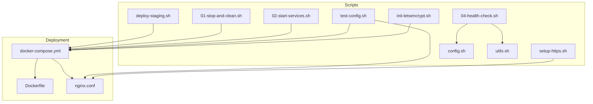
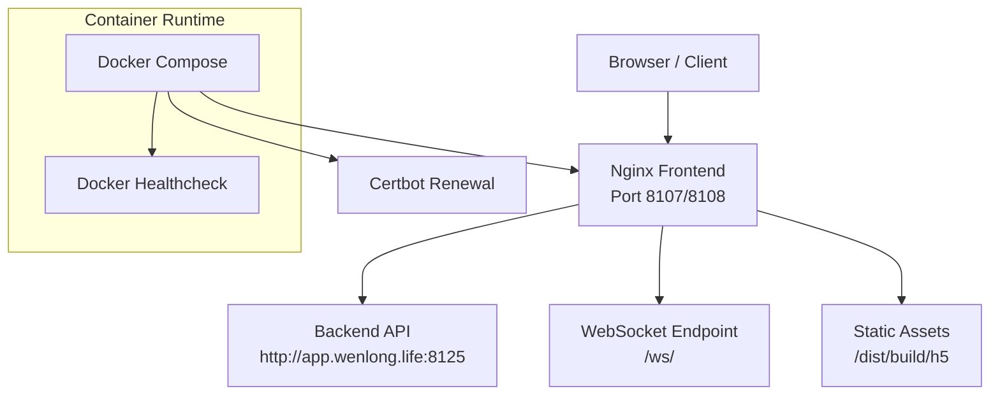
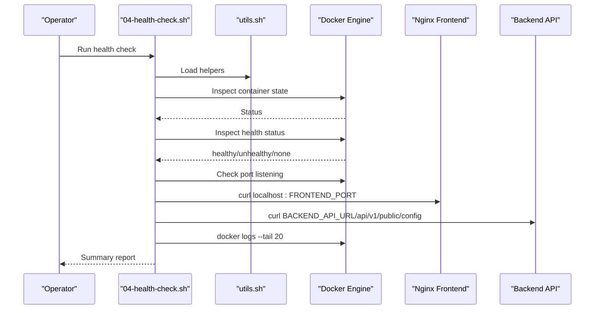
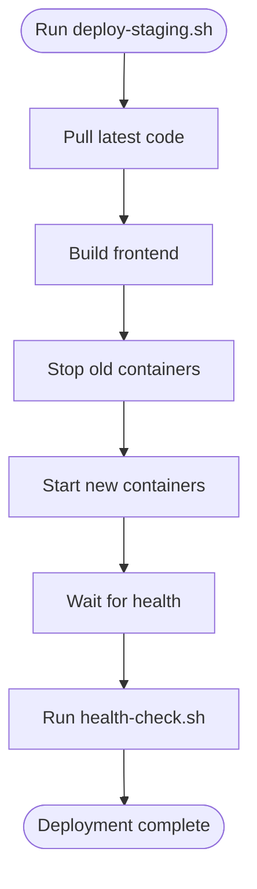
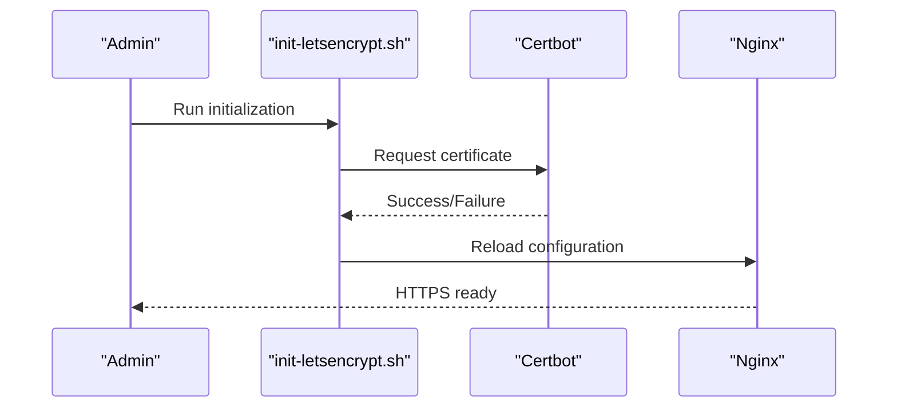
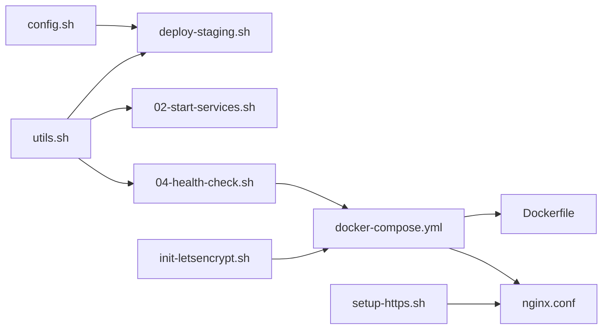
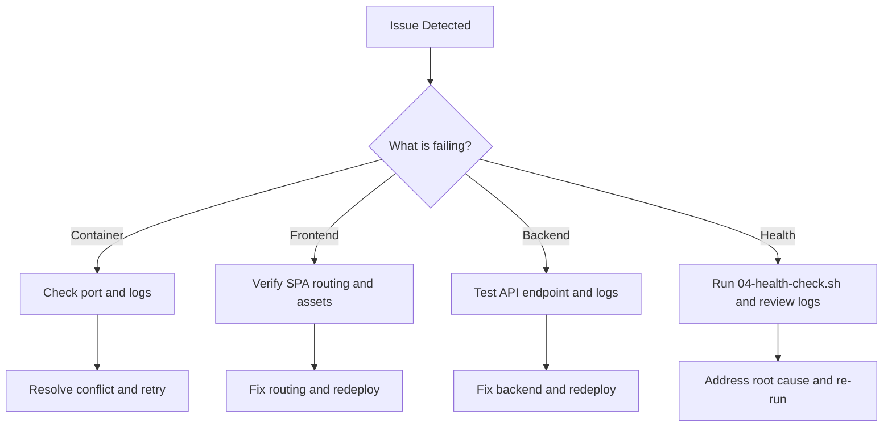

# Monitoring & Logging

<cite>
**Referenced Files in This Document**
- [README.md](file://linux-190-deploy/README.md)
- [QUICKSTART.md](file://linux-190-deploy/QUICKSTART.md)
- [deploy-staging.sh](file://linux-190-deploy/deploy-staging.sh)
- [01-stop-and-clean.sh](file://linux-190-deploy/01-stop-and-clean.sh)
- [02-start-services.sh](file://linux-190-deploy/02-start-services.sh)
- [04-health-check.sh](file://linux-190-deploy/04-health-check.sh)
- [docker-compose.yml](file://linux-190-deploy/docker-compose.yml)
- [Dockerfile](file://linux-190-deploy/Dockerfile)
- [nginx.conf](file://linux-190-deploy/nginx.conf)
- [config.sh](file://linux-190-deploy/config.sh)
- [utils.sh](file://linux-190-deploy/utils.sh)
- [test-config.sh](file://linux-190-deploy/test-config.sh)
- [setup-https.sh](file://linux-190-deploy/setup-https.sh)
- [init-letsencrypt.sh](file://linux-190-deploy/init-letsencrypt.sh)
</cite>

## Table of Contents
1. [Introduction](#introduction)
2. [Project Structure](#project-structure)
3. [Core Components](#core-components)
4. [Architecture Overview](#architecture-overview)
5. [Detailed Component Analysis](#detailed-component-analysis)
6. [Dependency Analysis](#dependency-analysis)
7. [Performance Considerations](#performance-considerations)
8. [Troubleshooting Guide](#troubleshooting-guide)
9. [Conclusion](#conclusion)
10. [Appendices](#appendices)

## Introduction
This document provides comprehensive monitoring and logging guidance for the WeTogether platform deployment. It explains the current health checks, service monitoring, and alerting mechanisms implemented via shell scripts and Docker Compose. It also documents logging configuration, log aggregation, and log analysis approaches, along with performance monitoring, metrics collection, and dashboard setup recommendations. Practical examples of monitoring script implementation, log parsing, and automated alerting are included, alongside log rotation, retention policies, and compliance considerations. Finally, troubleshooting guides address monitoring issues, performance bottlenecks, and system diagnostics.

## Project Structure
The monitoring and logging infrastructure is primarily implemented in the linux-190-deploy directory. Key elements include:
- Deployment orchestration via Docker Compose
- Health checks and startup scripts
- Nginx reverse proxy configuration for API and WebSocket traffic
- HTTPS initialization and renewal automation
- Configuration and utility scripts for consistent operations

**Diagram sources**
- [docker-compose.yml:1-40](file://linux-190-deploy/docker-compose.yml#L1-L40)
- [Dockerfile:1-18](file://linux-190-deploy/Dockerfile#L1-L18)
- [nginx.conf:1-168](file://linux-190-deploy/nginx.conf#L1-L168)
- [deploy-staging.sh:1-126](file://linux-190-deploy/deploy-staging.sh#L1-L126)
- [01-stop-and-clean.sh:1-56](file://linux-190-deploy/01-stop-and-clean.sh#L1-L56)
- [02-start-services.sh:1-65](file://linux-190-deploy/02-start-services.sh#L1-L65)
- [04-health-check.sh:1-84](file://linux-190-deploy/04-health-check.sh#L1-L84)
- [test-config.sh:1-61](file://linux-190-deploy/test-config.sh#L1-L61)
- [setup-https.sh:1-82](file://linux-190-deploy/setup-https.sh#L1-L82)
- [init-letsencrypt.sh:1-85](file://linux-190-deploy/init-letsencrypt.sh#L1-L85)
- [config.sh:1-30](file://linux-190-deploy/config.sh#L1-L30)
- [utils.sh:1-116](file://linux-190-deploy/utils.sh#L1-L116)

**Section sources**
- [README.md:1-443](file://linux-190-deploy/README.md#L1-L443)
- [QUICKSTART.md:1-101](file://linux-190-deploy/QUICKSTART.md#L1-L101)

## Core Components
- Docker Compose orchestration defines the frontend service with health checks, port mappings, and volume mounts for certificate persistence.
- Shell scripts encapsulate deployment, startup, cleanup, and health verification routines.
- Nginx configuration handles static serving, API proxying, WebSocket upgrades, SPA routing, and security headers.
- HTTPS automation integrates Certbot for certificate issuance and renewal.

Key capabilities:
- Automated health checks via Docker healthcheck and manual verification scripts
- Real-time log viewing and container lifecycle management
- Proxy configuration for API and WebSocket traffic with timeouts and CORS support
- HTTPS setup and renewal automation

**Section sources**
- [docker-compose.yml:1-40](file://linux-190-deploy/docker-compose.yml#L1-L40)
- [deploy-staging.sh:1-126](file://linux-190-deploy/deploy-staging.sh#L1-L126)
- [02-start-services.sh:1-65](file://linux-190-deploy/02-start-services.sh#L1-L65)
- [04-health-check.sh:1-84](file://linux-190-deploy/04-health-check.sh#L1-L84)
- [nginx.conf:1-168](file://linux-190-deploy/nginx.conf#L1-L168)
- [init-letsencrypt.sh:1-85](file://linux-190-deploy/init-letsencrypt.sh#L1-L85)

## Architecture Overview
The deployment architecture centers on a single Nginx-based frontend container exposing HTTP and HTTPS ports, proxying API and WebSocket traffic to the backend service. Docker Compose manages container lifecycle and health checks, while shell scripts automate deployment and verification.

**Diagram sources**
- [docker-compose.yml:1-40](file://linux-190-deploy/docker-compose.yml#L1-L40)
- [nginx.conf:29-74](file://linux-190-deploy/nginx.conf#L29-L74)
- [init-letsencrypt.sh:1-85](file://linux-190-deploy/init-letsencrypt.sh#L1-L85)

## Detailed Component Analysis

### Health Checks and Service Monitoring
Health checks are implemented at two levels:
- Docker healthcheck embedded in the compose configuration
- Manual verification via a dedicated health-check script

Operational behavior:
- Verifies container existence and health status
- Confirms port availability
- Tests HTTP access to the frontend and backend connectivity
- Displays recent container logs for quick diagnostics

**Diagram sources**
- [04-health-check.sh:1-84](file://linux-190-deploy/04-health-check.sh#L1-L84)
- [utils.sh:64-89](file://linux-190-deploy/utils.sh#L64-L89)
- [docker-compose.yml:18-23](file://linux-190-deploy/docker-compose.yml#L18-L23)

**Section sources**
- [04-health-check.sh:1-84](file://linux-190-deploy/04-health-check.sh#L1-L84)
- [utils.sh:64-89](file://linux-190-deploy/utils.sh#L64-L89)
- [docker-compose.yml:18-23](file://linux-190-deploy/docker-compose.yml#L18-L23)

### Logging Configuration and Aggregation
Current logging setup:
- Nginx access and error logs are written inside the container filesystem under standard locations
- Container logs are retrieved via Docker CLI commands
- No centralized log aggregation or structured logging pipeline is configured in the repository

Recommended practices:
- Enable JSON logging driver for containers to standardize log ingestion
- Mount persistent volumes for Nginx logs to facilitate external collection
- Integrate a log shipper (e.g., Fluent Bit/Fluentd) to forward logs to a SIEM or log analytics platform
- Define log rotation policies at the host level using logrotate or container logging drivers’ built-in rotation

**Section sources**
- [nginx.conf:1-168](file://linux-190-deploy/nginx.conf#L1-L168)
- [README.md:321-328](file://linux-190-deploy/README.md#L321-L328)

### Log Parsing and Analysis Tools
- Use standard Unix tools (grep, awk, cut) combined with Docker log streams for ad-hoc analysis
- For structured analysis, integrate a log collector and analyzer (e.g., ELK stack or Loki/Grafana)
- Parse Nginx access logs to derive metrics such as response codes, latency, and endpoint hit rates

Example tasks:
- Extract 5xx errors from access logs
- Compute average response time per endpoint
- Correlate backend API errors with frontend access logs

**Section sources**
- [README.md:321-328](file://linux-190-deploy/README.md#L321-L328)

### Performance Monitoring, Metrics Collection, and Dashboards
- The repository does not define native metrics endpoints or dashboards
- Recommended approach:
  - Expose Prometheus-compatible metrics from the backend service
  - Add a metrics endpoint to the frontend if needed (e.g., via a lightweight exporter)
  - Set up Prometheus for scraping and Grafana for dashboards
  - Monitor CPU, memory, network, disk, and application-specific KPIs

Note: The frontend currently proxies requests to the backend; ensure the backend exposes metrics for end-to-end visibility.

**Section sources**
- [src/types/api/backend-api.ts:632-640](file://src/types/api/backend-api.ts#L632-L640)

### Automated Alerting
- Implement alerts based on:
  - Container health status transitions
  - HTTP error rate thresholds (e.g., >5% 5xx over 5 minutes)
  - Latency SLO breaches (e.g., p95 > 2s)
  - Certificate expiry warnings (e.g., <7 days)
- Use Prometheus Alertmanager or similar to route notifications to Slack, PagerDuty, or email

**Section sources**
- [docker-compose.yml:18-23](file://linux-190-deploy/docker-compose.yml#L18-L23)
- [init-letsencrypt.sh:31-34](file://linux-190-deploy/init-letsencrypt.sh#L31-L34)

### Log Rotation, Retention, and Compliance
- Host-level rotation:
  - Configure logrotate for Docker and Nginx log files
  - Enforce retention periods (e.g., 90–180 days) and archive policies
- Container logging driver rotation:
  - Use the json-file driver with max-size and max-file limits
- Compliance:
  - Anonymize PII in logs where possible
  - Restrict access to log systems and enable audit trails
  - Ensure retention aligns with legal and internal policies

**Section sources**
- [README.md:321-328](file://linux-190-deploy/README.md#L321-L328)

### Monitoring Script Implementation Examples
- Deployment automation:
  - One-click deployment script orchestrates code pull, build, container lifecycle, and health verification
  - Provides clear status messages and next steps
- Startup and cleanup:
  - Start script validates build artifacts, builds images, starts containers, and waits for health
  - Stop and clean script removes containers and optionally images with prompts

**Diagram sources**
- [deploy-staging.sh:42-98](file://linux-190-deploy/deploy-staging.sh#L42-L98)
- [02-start-services.sh:35-49](file://linux-190-deploy/02-start-services.sh#L35-L49)
- [04-health-check.sh:52-67](file://linux-190-deploy/04-health-check.sh#L52-L67)

**Section sources**
- [deploy-staging.sh:1-126](file://linux-190-deploy/deploy-staging.sh#L1-L126)
- [02-start-services.sh:1-65](file://linux-190-deploy/02-start-services.sh#L1-L65)
- [01-stop-and-clean.sh:1-56](file://linux-190-deploy/01-stop-and-clean.sh#L1-L56)

### HTTPS and Security Headers Monitoring
- HTTPS initialization script automates certificate issuance and renewal
- Nginx configuration includes security headers and CORS handling
- Monitor certificate expiry and renewal events to prevent outages

**Diagram sources**
- [init-letsencrypt.sh:60-78](file://linux-190-deploy/init-letsencrypt.sh#L60-L78)
- [setup-https.sh:41-62](file://linux-190-deploy/setup-https.sh#L41-L62)
- [nginx.conf:76-80](file://linux-190-deploy/nginx.conf#L76-L80)

**Section sources**
- [init-letsencrypt.sh:1-85](file://linux-190-deploy/init-letsencrypt.sh#L1-L85)
- [setup-https.sh:1-82](file://linux-190-deploy/setup-https.sh#L1-L82)
- [nginx.conf:76-80](file://linux-190-deploy/nginx.conf#L76-L80)

## Dependency Analysis
The deployment relies on the following relationships:
- Scripts depend on configuration and utility libraries for consistent behavior
- Docker Compose depends on the Dockerfile and Nginx configuration
- Health checks depend on Docker runtime and curl availability
- HTTPS depends on Certbot and Nginx configuration

**Diagram sources**
- [config.sh:1-30](file://linux-190-deploy/config.sh#L1-L30)
- [deploy-staging.sh:9-12](file://linux-190-deploy/deploy-staging.sh#L9-L12)
- [utils.sh:1-116](file://linux-190-deploy/utils.sh#L1-L116)
- [02-start-services.sh:9-12](file://linux-190-deploy/02-start-services.sh#L9-L12)
- [04-health-check.sh:9-12](file://linux-190-deploy/04-health-check.sh#L9-L12)
- [docker-compose.yml:1-40](file://linux-190-deploy/docker-compose.yml#L1-L40)
- [Dockerfile:1-18](file://linux-190-deploy/Dockerfile#L1-L18)
- [nginx.conf:1-168](file://linux-190-deploy/nginx.conf#L1-L168)
- [init-letsencrypt.sh:1-85](file://linux-190-deploy/init-letsencrypt.sh#L1-L85)
- [setup-https.sh:1-82](file://linux-190-deploy/setup-https.sh#L1-L82)

**Section sources**
- [config.sh:1-30](file://linux-190-deploy/config.sh#L1-L30)
- [utils.sh:1-116](file://linux-190-deploy/utils.sh#L1-L116)
- [docker-compose.yml:1-40](file://linux-190-deploy/docker-compose.yml#L1-L40)

## Performance Considerations
- Nginx configuration enables gzip compression and long cache headers for static assets to reduce bandwidth and improve perceived performance
- Proxy timeouts are set for API and WebSocket connections; tune these based on observed latency and backend SLAs
- Consider enabling HTTP/2 for HTTPS traffic and optimizing keep-alive settings
- Monitor container resource usage and scale horizontally if needed

**Section sources**
- [nginx.conf:17-27](file://linux-190-deploy/nginx.conf#L17-L27)
- [nginx.conf:48-52](file://linux-190-deploy/nginx.conf#L48-L52)
- [nginx.conf:134-138](file://linux-190-deploy/nginx.conf#L134-L138)

## Troubleshooting Guide
Common scenarios and remedies:
- Container fails to start
  - Check port conflicts and firewall rules
  - Review container logs and Nginx error logs
- Frontend blank page
  - Validate SPA routing and static asset presence
  - Confirm API proxy configuration and backend connectivity
- Backend API unresponsive
  - Test backend endpoint directly
  - Inspect Nginx access and error logs
- Health check failures
  - Use the health-check script to diagnose container, port, and HTTP/API statuses
  - Inspect recent logs for errors

**Diagram sources**
- [README.md:393-429](file://linux-190-deploy/README.md#L393-L429)
- [04-health-check.sh:19-72](file://linux-190-deploy/04-health-check.sh#L19-L72)

**Section sources**
- [README.md:194-260](file://linux-190-deploy/README.md#L194-L260)
- [README.md:393-429](file://linux-190-deploy/README.md#L393-L429)
- [04-health-check.sh:19-72](file://linux-190-deploy/04-health-check.sh#L19-L72)

## Conclusion
The WeTogether platform deployment provides a solid foundation for monitoring and logging through Docker Compose, shell scripts, and Nginx configuration. Current capabilities include automated health checks, real-time log access, and HTTPS automation. To achieve comprehensive observability, integrate centralized log aggregation, metrics collection, and alerting. Apply log rotation and retention policies aligned with compliance needs, and continuously monitor performance to maintain reliability and responsiveness.

## Appendices

### Appendix A: Useful Commands
- View live logs: docker logs together-frontend-staging -f
- Restart services: docker-compose restart
- Stop services: docker-compose stop
- Health check: ./04-health-check.sh
- Test Nginx config: ./test-config.sh

**Section sources**
- [README.md:321-340](file://linux-190-deploy/README.md#L321-L340)
- [QUICKSTART.md:68-83](file://linux-190-deploy/QUICKSTART.md#L68-L83)
- [test-config.sh:14-22](file://linux-190-deploy/test-config.sh#L14-L22)