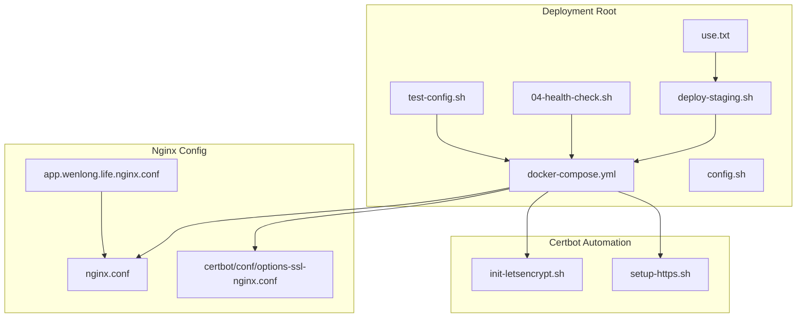
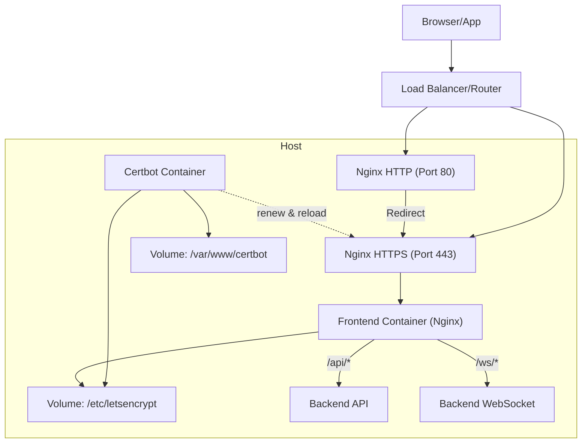
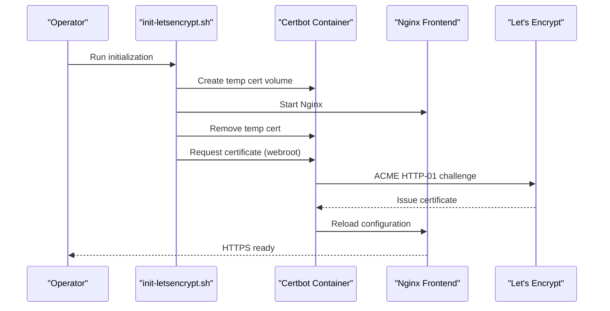
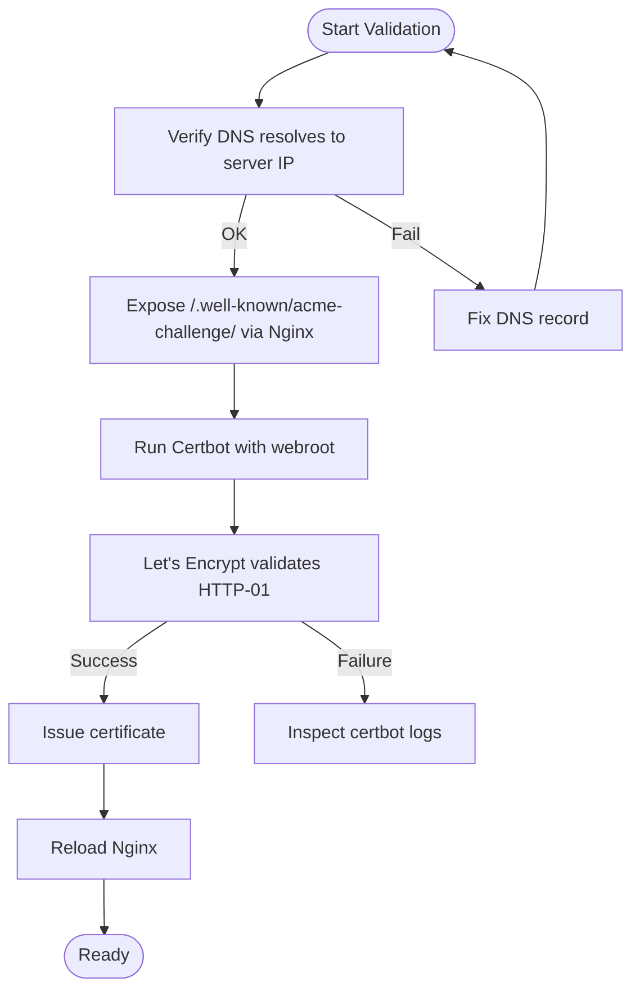
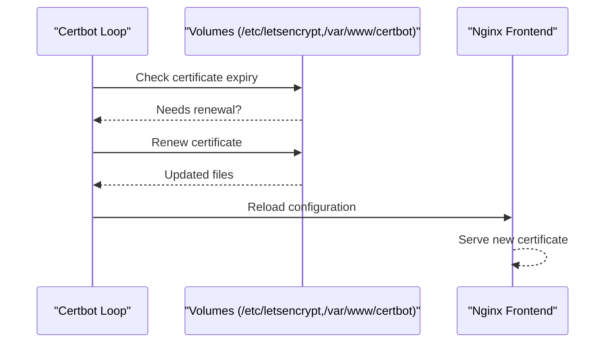
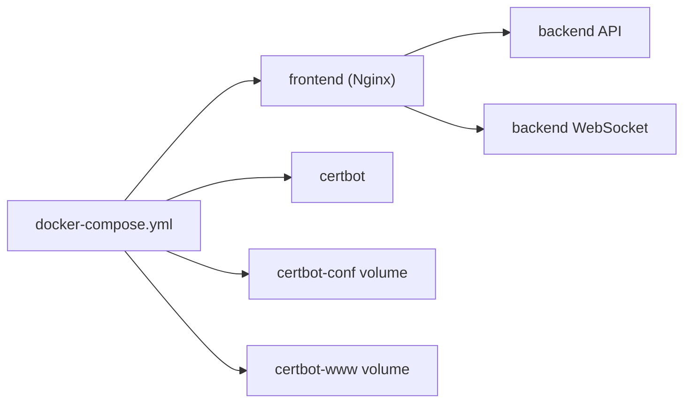

# SSL/TLS Certificates

<cite>
**Referenced Files in This Document**
- [README.md](file://linux-190-deploy/README.md)
- [HTTPS-README.md](file://linux-190-deploy/HTTPS-README.md)
- [init-letsencrypt.sh](file://linux-190-deploy/init-letsencrypt.sh)
- [setup-https.sh](file://linux-190-deploy/setup-https.sh)
- [app.wenlong.life.nginx.conf](file://linux-190-deploy/app.wenlong.life.nginx.conf)
- [nginx.conf](file://linux-190-deploy/nginx.conf)
- [options-ssl-nginx.conf](file://linux-190-deploy/certbot/conf/options-ssl-nginx.conf)
- [docker-compose.yml](file://linux-190-deploy/docker-compose.yml)
- [config.sh](file://linux-190-deploy/config.sh)
- [test-config.sh](file://linux-190-deploy/test-config.sh)
- [use.txt](file://linux-190-deploy/use.txt)
- [deploy-staging.sh](file://linux-190-deploy/deploy-staging.sh)
- [04-health-check.sh](file://linux-190-deploy/04-health-check.sh)
</cite>

## Table of Contents
1. [Introduction](#introduction)
2. [Project Structure](#project-structure)
3. [Core Components](#core-components)
4. [Architecture Overview](#architecture-overview)
5. [Detailed Component Analysis](#detailed-component-analysis)
6. [Dependency Analysis](#dependency-analysis)
7. [Performance Considerations](#performance-considerations)
8. [Troubleshooting Guide](#troubleshooting-guide)
9. [Conclusion](#conclusion)
10. [Appendices](#appendices)

## Introduction
This document provides comprehensive SSL/TLS certificate management for the WeTogether platform. It explains how the platform provisions and renews certificates using Certbot and Let's Encrypt, how DNS verification is handled, and how the system is configured for HTTPS. It also covers SSL configuration options, cipher suites, and security protocols, along with practical troubleshooting, monitoring, expiration alerts, backups, and security best practices aligned with compliance requirements.

## Project Structure
The SSL/TLS configuration is centered in the linux-190-deploy directory. Key files include:
- Certificate automation and renewal orchestration via Docker Compose and Certbot
- Nginx configurations for HTTP and HTTPS
- Scripts for initialization, testing, and deployment
- Environment configuration and operational scripts

**Diagram sources**
- [docker-compose.yml:1-40](file://linux-190-deploy/docker-compose.yml#L1-L40)
- [config.sh:1-30](file://linux-190-deploy/config.sh#L1-L30)
- [deploy-staging.sh:1-126](file://linux-190-deploy/deploy-staging.sh#L1-L126)
- [04-health-check.sh:1-84](file://linux-190-deploy/04-health-check.sh#L1-L84)
- [test-config.sh:1-61](file://linux-190-deploy/test-config.sh#L1-L61)
- [use.txt:1-22](file://linux-190-deploy/use.txt#L1-L22)
- [nginx.conf:1-168](file://linux-190-deploy/nginx.conf#L1-L168)
- [app.wenlong.life.nginx.conf:1-53](file://linux-190-deploy/app.wenlong.life.nginx.conf#L1-L53)
- [options-ssl-nginx.conf:1-15](file://linux-190-deploy/certbot/conf/options-ssl-nginx.conf#L1-L15)
- [init-letsencrypt.sh:1-85](file://linux-190-deploy/init-letsencrypt.sh#L1-L85)
- [setup-https.sh:1-82](file://linux-190-deploy/setup-https.sh#L1-L82)

**Section sources**
- [README.md:1-443](file://linux-190-deploy/README.md#L1-L443)
- [HTTPS-README.md:1-143](file://linux-190-deploy/HTTPS-README.md#L1-L143)
- [docker-compose.yml:1-40](file://linux-190-deploy/docker-compose.yml#L1-L40)
- [config.sh:1-30](file://linux-190-deploy/config.sh#L1-L30)

## Core Components
- Certbot service with scheduled renewal loop
- Nginx HTTP server for ACME challenge validation and temporary access
- Nginx HTTPS server (commented by default) for production TLS termination
- Initialization script to bootstrap certificates and reload Nginx
- Deployment and health-check scripts for operational assurance

Key capabilities:
- Automatic certificate provisioning and renewal via Certbot
- ACME HTTP-01 validation through the /.well-known/acme-challenge/ path
- TLS 1.2/1.3 support and Mozilla recommended cipher suites
- HSTS header and other security headers
- Port mapping for HTTP (80) and HTTPS (443) behind Nginx

**Section sources**
- [init-letsencrypt.sh:1-85](file://linux-190-deploy/init-letsencrypt.sh#L1-L85)
- [setup-https.sh:1-82](file://linux-190-deploy/setup-https.sh#L1-L82)
- [nginx.conf:1-168](file://linux-190-deploy/nginx.conf#L1-L168)
- [app.wenlong.life.nginx.conf:1-53](file://linux-190-deploy/app.wenlong.life.nginx.conf#L1-L53)
- [options-ssl-nginx.conf:1-15](file://linux-190-deploy/certbot/conf/options-ssl-nginx.conf#L1-L15)
- [docker-compose.yml:1-40](file://linux-190-deploy/docker-compose.yml#L1-L40)

## Architecture Overview
The HTTPS architecture combines a reverse proxy (Nginx) with a certificate automation service (Certbot). Nginx handles HTTP/HTTPS traffic and forwards API/WebSocket requests to backend services. Certbot manages certificate acquisition and renewal, storing keys in persistent volumes and reloading Nginx when changes occur.

**Diagram sources**
- [docker-compose.yml:1-40](file://linux-190-deploy/docker-compose.yml#L1-L40)
- [nginx.conf:1-168](file://linux-190-deploy/nginx.conf#L1-L168)
- [app.wenlong.life.nginx.conf:1-53](file://linux-190-deploy/app.wenlong.life.nginx.conf#L1-L53)
- [init-letsencrypt.sh:1-85](file://linux-190-deploy/init-letsencrypt.sh#L1-L85)

## Detailed Component Analysis

### Automatic Certificate Provisioning and Renewal
- Provisioning flow:
  - Download Mozilla-recommended TLS parameters and Diffie-Hellman parameters
  - Create a temporary self-signed certificate to satisfy initial Nginx startup
  - Start Nginx and remove temporary certificate
  - Request a real certificate from Let's Encrypt using webroot validation
  - Reload Nginx to pick up new certificate
- Renewal flow:
  - A long-running Certbot container executes periodic renewal checks
  - On successful renewal, the container triggers Nginx reload

**Diagram sources**
- [init-letsencrypt.sh:1-85](file://linux-190-deploy/init-letsencrypt.sh#L1-L85)
- [docker-compose.yml:25-31](file://linux-190-deploy/docker-compose.yml#L25-L31)

**Section sources**
- [init-letsencrypt.sh:1-85](file://linux-190-deploy/init-letsencrypt.sh#L1-L85)
- [docker-compose.yml:25-31](file://linux-190-deploy/docker-compose.yml#L25-L31)
- [HTTPS-README.md:64-74](file://linux-190-deploy/HTTPS-README.md#L64-L74)

### DNS Verification Setup
- The deployment supports ACME HTTP-01 validation via the /.well-known/acme-challenge/ path served by Nginx.
- Ensure the domain resolves to the server’s public IP address before requesting certificates.
- The host-based Nginx configuration demonstrates the ACME challenge location block and reverse proxy to the frontend container.

**Diagram sources**
- [app.wenlong.life.nginx.conf:5-8](file://linux-190-deploy/app.wenlong.life.nginx.conf#L5-L8)
- [nginx.conf:10-15](file://linux-190-deploy/nginx.conf#L10-L15)
- [setup-https.sh:43-47](file://linux-190-deploy/setup-https.sh#L43-L47)

**Section sources**
- [app.wenlong.life.nginx.conf:5-8](file://linux-190-deploy/app.wenlong.life.nginx.conf#L5-L8)
- [nginx.conf:10-15](file://linux-190-deploy/nginx.conf#L10-L15)
- [setup-https.sh:43-47](file://linux-190-deploy/setup-https.sh#L43-L47)

### Automated Certificate Management
- Persistent volumes store certificates and challenges:
  - /etc/letsencrypt for live certificates and renewal configs
  - /var/www/certbot for ACME challenge files
- Renewal cadence:
  - Certbot runs a continuous loop sleeping 12 hours between checks
- Manual renewal:
  - Trigger renewal and reload via docker-compose commands

**Diagram sources**
- [docker-compose.yml:31-31](file://linux-190-deploy/docker-compose.yml#L31-L31)
- [use.txt:18-20](file://linux-190-deploy/use.txt#L18-L20)

**Section sources**
- [docker-compose.yml:14-31](file://linux-190-deploy/docker-compose.yml#L14-L31)
- [use.txt:18-20](file://linux-190-deploy/use.txt#L18-L20)

### SSL Configuration Options, Cipher Suites, and Security Protocols
- TLS versions: TLS 1.2 and TLS 1.3
- Cipher suites: Mozilla-recommended modern suites
- Session caching and timeouts: configured via options-ssl-nginx.conf
- Additional security headers:
  - X-Frame-Options, X-Content-Type-Options, X-XSS-Protection
  - Strict-Transport-Security (when HTTPS is enabled)

Note: The HTTPS server block is commented by default and must be enabled after obtaining a certificate.

**Section sources**
- [options-ssl-nginx.conf:11-14](file://linux-190-deploy/certbot/conf/options-ssl-nginx.conf#L11-L14)
- [nginx.conf:76-80](file://linux-190-deploy/nginx.conf#L76-L80)
- [nginx.conf:162-166](file://linux-190-deploy/nginx.conf#L162-L166)
- [app.wenlong.life.nginx.conf:30-34](file://linux-190-deploy/app.wenlong.life.nginx.conf#L30-L34)

### Certificate Monitoring, Expiration Alerts, and Backups
- Monitoring:
  - View current certificates: docker-compose run --rm certbot certificates
  - Inspect logs: docker-compose logs certbot
- Expiration alerts:
  - Set up external monitoring to check certificate expiry dates
  - Integrate with alerting systems to notify before expiry windows
- Backups:
  - Back up the certbot volumes regularly to secure storage
  - Store private keys separately from public certs and enforce access controls

**Section sources**
- [HTTPS-README.md:104-108](file://linux-190-deploy/HTTPS-README.md#L104-L108)
- [use.txt:16-16](file://linux-190-deploy/use.txt#L16-L16)

### Manual Certificate Management Examples
- Initialize certificates:
  - Edit email and domain in init-letsencrypt.sh
  - Run the initialization script
- Re-enable HTTPS:
  - Uncomment the HTTPS server block in nginx.conf
  - Reload Nginx
- Force renewal:
  - docker-compose run --rm certbot renew
  - docker exec <frontend_container> nginx -s reload

**Section sources**
- [init-letsencrypt.sh:25-25](file://linux-190-deploy/init-letsencrypt.sh#L25-L25)
- [init-letsencrypt.sh:67-73](file://linux-190-deploy/init-letsencrypt.sh#L67-L73)
- [nginx.conf:82-167](file://linux-190-deploy/nginx.conf#L82-L167)
- [use.txt:18-20](file://linux-190-deploy/use.txt#L18-L20)

## Dependency Analysis
The deployment depends on:
- Docker Compose to orchestrate frontend and certbot containers
- Nginx for TLS termination, reverse proxy, and ACME validation
- Persistent volumes for certificate storage and ACME challenges
- Environment configuration for ports and backend URLs

**Diagram sources**
- [docker-compose.yml:1-40](file://linux-190-deploy/docker-compose.yml#L1-L40)

**Section sources**
- [docker-compose.yml:1-40](file://linux-190-deploy/docker-compose.yml#L1-L40)
- [config.sh:17-20](file://linux-190-deploy/config.sh#L17-L20)

## Performance Considerations
- Enable HTTP/2 for improved connection reuse and latency reduction (requires HTTPS)
- Use gzip compression and appropriate cache headers for static assets
- Keep TLS parameters updated and monitor session reuse metrics
- Ensure sufficient disk space for certificate volumes and logs retention

[No sources needed since this section provides general guidance]

## Troubleshooting Guide
Common issues and resolutions:
- Certificate request fails:
  - Verify domain resolution and firewall open ports 80/443
  - Review certbot logs for detailed failure reasons
- Nginx configuration errors:
  - Test configuration syntax before reload
- Viewing certificate info:
  - List installed certificates via certbot command
- Health checks:
  - Use the health-check script to validate container and port availability

Operational scripts:
- Deploy and initialize: deploy-staging.sh and init-letsencrypt.sh
- Health verification: 04-health-check.sh
- Configuration validation: test-config.sh

**Section sources**
- [HTTPS-README.md:85-108](file://linux-190-deploy/HTTPS-README.md#L85-L108)
- [04-health-check.sh:19-67](file://linux-190-deploy/04-health-check.sh#L19-L67)
- [test-config.sh:14-42](file://linux-190-deploy/test-config.sh#L14-L42)
- [deploy-staging.sh:118-121](file://linux-190-deploy/deploy-staging.sh#L118-L121)

## Conclusion
The WeTogether platform employs a robust, automated approach to SSL/TLS certificate management using Certbot and Let's Encrypt. The setup ensures secure HTTPS delivery with modern TLS parameters, reliable renewal, and operational tooling for validation and troubleshooting. By following the documented procedures and best practices, teams can maintain a secure, compliant, and resilient certificate lifecycle.

[No sources needed since this section summarizes without analyzing specific files]

## Appendices

### Appendix A: End-to-End HTTPS Enablement Checklist
- Prepare domain DNS and firewall
- Initialize certificates with init-letsencrypt.sh
- Enable HTTPS server block in nginx.conf
- Reload Nginx and verify connectivity
- Configure monitoring and backups

**Section sources**
- [init-letsencrypt.sh:25-73](file://linux-190-deploy/init-letsencrypt.sh#L25-L73)
- [nginx.conf:82-167](file://linux-190-deploy/nginx.conf#L82-L167)
- [HTTPS-README.md:57-63](file://linux-190-deploy/HTTPS-README.md#L57-L63)