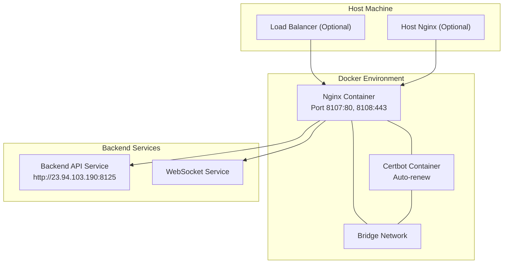
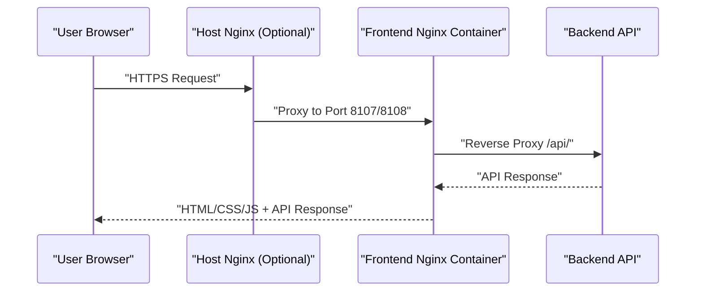
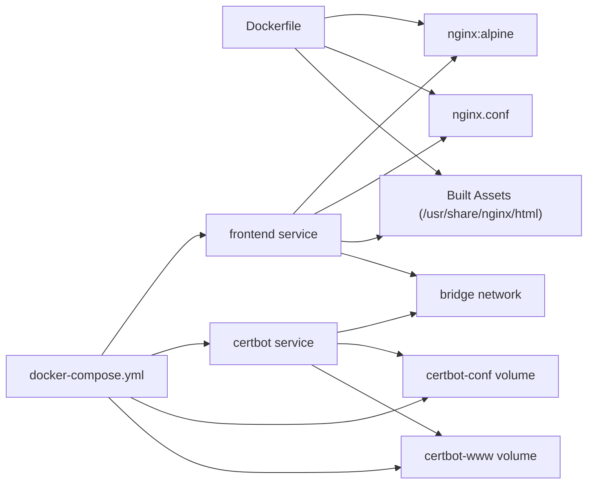

# Server Configuration & Setup

<cite>
**Referenced Files in This Document**
- [nginx.conf](file://linux-190-deploy/nginx.conf)
- [app.wenlong.life.nginx.conf](file://linux-190-deploy/app.wenlong.life.nginx.conf)
- [docker-compose.yml](file://linux-190-deploy/docker-compose.yml)
- [Dockerfile](file://linux-190-deploy/Dockerfile)
- [README.md](file://linux-190-deploy/README.md)
- [QUICKSTART.md](file://linux-190-deploy/QUICKSTART.md)
- [HTTPS-README.md](file://linux-190-deploy/HTTPS-README.md)
- [init-letsencrypt.sh](file://linux-190-deploy/init-letsencrypt.sh)
- [setup-https.sh](file://linux-190-deploy/setup-https.sh)
- [deploy-staging.sh](file://linux-190-deploy/deploy-staging.sh)
- [config.sh](file://linux-190-deploy/config.sh)
- [utils.sh](file://linux-190-deploy/utils.sh)
- [04-health-check.sh](file://linux-190-deploy/04-health-check.sh)
- [test-config.sh](file://linux-190-deploy/test-config.sh)
- [use.txt](file://linux-190-deploy/use.txt)
</cite>

## Table of Contents
1. [Introduction](#introduction)
2. [Project Structure](#project-structure)
3. [Core Components](#core-components)
4. [Architecture Overview](#architecture-overview)
5. [Detailed Component Analysis](#detailed-component-analysis)
6. [Dependency Analysis](#dependency-analysis)
7. [Performance Considerations](#performance-considerations)
8. [Troubleshooting Guide](#troubleshooting-guide)
9. [Conclusion](#conclusion)
10. [Appendices](#appendices)

## Introduction
This document provides comprehensive server configuration and setup guidance for deploying the WeTogether platform using Nginx, Docker, and optional HTTPS via Let's Encrypt. It covers virtual host configuration, reverse proxy settings, SSL/TLS certificate management, HTTP/HTTPS redirection, security headers, load balancing and caching strategies, gzip compression, monitoring, log rotation, performance tuning, and troubleshooting.

## Project Structure
The deployment leverages a Dockerized Nginx container serving static frontend assets and acting as a reverse proxy to backend APIs and WebSocket endpoints. Optional HTTPS is supported through a dedicated Nginx configuration for host-based deployments and automated certificate management via Certbot.

**Diagram sources**
- [docker-compose.yml:1-40](file://linux-190-deploy/docker-compose.yml#L1-L40)
- [Dockerfile:1-18](file://linux-190-deploy/Dockerfile#L1-L18)
- [nginx.conf:1-168](file://linux-190-deploy/nginx.conf#L1-L168)
- [app.wenlong.life.nginx.conf:1-53](file://linux-190-deploy/app.wenlong.life.nginx.conf#L1-L53)

**Section sources**
- [README.md:13-30](file://linux-190-deploy/README.md#L13-L30)
- [docker-compose.yml:1-40](file://linux-190-deploy/docker-compose.yml#L1-L40)
- [Dockerfile:1-18](file://linux-190-deploy/Dockerfile#L1-L18)

## Core Components
- Nginx static hosting and reverse proxy for uni-app frontend
- Backend API and WebSocket proxying
- HTTPS support with Let's Encrypt automation
- Health checks and monitoring hooks
- Deployment orchestration via Docker Compose

Key responsibilities:
- Serve built frontend assets from the Nginx HTML root
- Proxy API requests to backend service
- Support SPA routing fallback to index.html
- Apply security headers and gzip compression
- Manage SSL/TLS termination and HSTS header

**Section sources**
- [nginx.conf:1-168](file://linux-190-deploy/nginx.conf#L1-L168)
- [README.md:353-375](file://linux-190-deploy/README.md#L353-L375)

## Architecture Overview
The platform uses a container-first approach with Nginx as the edge server. For HTTPS, either:
- A host-based Nginx handles TLS and proxies to the Docker Nginx container, or
- The Docker Nginx container manages TLS with Certbot auto-renewal.

**Diagram sources**
- [docker-compose.yml:10-12](file://linux-190-deploy/docker-compose.yml#L10-L12)
- [nginx.conf:29-52](file://linux-190-deploy/nginx.conf#L29-L52)
- [app.wenlong.life.nginx.conf:10-17](file://linux-190-deploy/app.wenlong.life.nginx.conf#L10-L17)

## Detailed Component Analysis

### Nginx Virtual Hosts and Reverse Proxy
- HTTP virtual host listens on port 80 with:
  - Let's Encrypt ACME challenge path
  - Gzip compression enabled
  - Static asset caching for long-lived resources
  - API proxy to backend service with forwarded headers
  - SPA fallback to index.html
  - Security headers applied
- HTTPS virtual host (commented in configuration) demonstrates:
  - TLS 1.2/1.3 protocols and cipher suite
  - Session cache and timeout
  - HSTS header for HTTPS enforcement

Important proxy headers:
- Host, X-Real-IP, X-Forwarded-For, X-Forwarded-Proto

SPA routing:
- try_files directive ensures deep links resolve to index.html

Security headers:
- X-Frame-Options, X-Content-Type-Options, X-XSS-Protection
- HSTS header included in HTTPS block

**Section sources**
- [nginx.conf:1-80](file://linux-190-deploy/nginx.conf#L1-L80)
- [nginx.conf:82-168](file://linux-190-deploy/nginx.conf#L82-L168)

### Host-Based Nginx for HTTPS
- Dedicated host Nginx configuration supports:
  - ACME challenge path
  - Reverse proxy to Docker Nginx container
  - Optional HTTPS block with TLS parameters and HSTS

Use-case:
- When the host runs its own Nginx and proxies to the Docker container on port 8107/8108.

**Section sources**
- [app.wenlong.life.nginx.conf:1-53](file://linux-190-deploy/app.wenlong.life.nginx.conf#L1-L53)

### Docker Orchestration and Health Checks
- Docker Compose defines:
  - Frontend Nginx service with port mappings 8107:80 and 8108:443
  - Certbot service for automatic certificate renewal
  - Shared volumes for certificates and ACME webroot
  - Health check polling the localhost endpoint
- Build process:
  - Alpine Nginx base image
  - Copy built frontend assets and Nginx config
  - Set permissions and expose port 80

Deployment scripts:
- One-click deployment orchestrates code checkout, build, container lifecycle, and health verification
- Health check script validates container status, port listening, HTTP access, and backend connectivity

**Section sources**
- [docker-compose.yml:1-40](file://linux-190-deploy/docker-compose.yml#L1-L40)
- [Dockerfile:1-18](file://linux-190-deploy/Dockerfile#L1-L18)
- [deploy-staging.sh:1-126](file://linux-190-deploy/deploy-staging.sh#L1-L126)
- [04-health-check.sh:1-84](file://linux-190-deploy/04-health-check.sh#L1-L84)

### HTTPS and Certificate Management
- Automated flow:
  - Download recommended TLS parameters
  - Create temporary self-signed certificate
  - Start Nginx and request real certificate from Let's Encrypt
  - Reload Nginx and schedule periodic renewal
- Optional host-based setup:
  - Install site-specific configuration
  - Test and reload Nginx
  - Enable HTTPS block and reload

Certificate storage:
- Certificates persisted in named volumes under certbot directories

**Section sources**
- [init-letsencrypt.sh:1-85](file://linux-190-deploy/init-letsencrypt.sh#L1-L85)
- [setup-https.sh:1-82](file://linux-190-deploy/setup-https.sh#L1-L82)
- [docker-compose.yml:13-15](file://linux-190-deploy/docker-compose.yml#L13-L15)

### Load Balancing and Caching Strategies
- Load balancing:
  - Multiple Nginx containers behind a single host Nginx or cloud load balancer
  - Ensure sticky sessions if required by WebSocket connections
- Caching:
  - Long-term cache headers for static assets (immutable)
  - Gzip compression for text-based assets
  - Consider CDN for global distribution

Note: The provided configuration demonstrates caching and gzip; load balancing requires additional upstream definitions and reverse proxy adjustments.

**Section sources**
- [nginx.conf:23-27](file://linux-190-deploy/nginx.conf#L23-L27)
- [nginx.conf:18-21](file://linux-190-deploy/nginx.conf#L18-L21)

### Gzip Compression and Security Headers
- Gzip:
  - Enabled with minimum length threshold and targeted MIME types
- Security headers:
  - Frame options, content type options, XSS protection
  - HSTS header in HTTPS block

**Section sources**
- [nginx.conf:17-21](file://linux-190-deploy/nginx.conf#L17-L21)
- [nginx.conf:76-80](file://linux-190-deploy/nginx.conf#L76-L80)
- [nginx.conf:162-166](file://linux-190-deploy/nginx.conf#L162-L166)

### WebSocket Proxying
- Dedicated location block for WebSocket endpoints
- Upgrades connection and forwards required headers
- Extended timeouts suitable for long-lived connections

**Section sources**
- [nginx.conf:54-69](file://linux-190-deploy/nginx.conf#L54-L69)

## Dependency Analysis

**Diagram sources**
- [Dockerfile:1-18](file://linux-190-deploy/Dockerfile#L1-L18)
- [docker-compose.yml:1-40](file://linux-190-deploy/docker-compose.yml#L1-L40)

**Section sources**
- [Dockerfile:1-18](file://linux-190-deploy/Dockerfile#L1-L18)
- [docker-compose.yml:1-40](file://linux-190-deploy/docker-compose.yml#L1-L40)

## Performance Considerations
- Static delivery:
  - Serve built assets from Nginx with long cache headers
  - Enable gzip for text-based assets
- Network:
  - Prefer HTTP/2 over HTTP/1.1 for multiplexed connections
  - Keep-alive and connection reuse
- Backend:
  - Tune proxy timeouts and consider keepalive upstreams
- Observability:
  - Monitor response times, error rates, and backend latency
  - Use access logs and metrics aggregation

[No sources needed since this section provides general guidance]

## Troubleshooting Guide
Common issues and resolutions:
- Container fails to start:
  - Check port 8107 availability and Docker logs
  - Verify build artifacts exist and Nginx config is valid
- Cannot reach frontend:
  - Confirm firewall allows inbound traffic on configured ports
  - Validate health check results and container status
- API connectivity problems:
  - Test backend endpoint directly
  - Inspect Nginx proxy headers and backend address
- HTTPS certificate issues:
  - Validate domain DNS resolution and port 80/443 accessibility
  - Review Certbot logs and certificate status
- Configuration errors:
  - Validate Nginx syntax inside the container
  - Use provided test scripts to pre-validate configuration

Operational commands:
- View logs, restart services, and run health checks
- Manually trigger certificate renewal if needed

**Section sources**
- [README.md:194-260](file://linux-190-deploy/README.md#L194-L260)
- [README.md:393-429](file://linux-190-deploy/README.md#L393-L429)
- [04-health-check.sh:1-84](file://linux-190-deploy/04-health-check.sh#L1-L84)
- [test-config.sh:1-61](file://linux-190-deploy/test-config.sh#L1-L61)

## Conclusion
The WeTogether platform deployment centers on a robust Nginx container with integrated reverse proxying, SPA routing, and optional HTTPS managed by Certbot. The provided Docker Compose setup simplifies orchestration, while scripts streamline deployment, health checks, and troubleshooting. For production, augment with load balancing, CDN caching, and comprehensive monitoring.

[No sources needed since this section summarizes without analyzing specific files]

## Appendices

### System Requirements and Prerequisites
- Operating system: Linux with Docker and Docker Compose installed
- Ports: 8107 (HTTP), 8108 (HTTPS), and 80/443 (optional host Nginx)
- Tools: curl, netstat, systemd (for host Nginx), ufw (firewall)

**Section sources**
- [README.md:30-51](file://linux-190-deploy/README.md#L30-L51)
- [QUICKSTART.md:59-66](file://linux-190-deploy/QUICKSTART.md#L59-L66)

### Server Requirements and OS Dependencies
- Docker Engine and Docker Compose
- Node.js and pnpm for building the frontend
- Git for code checkout
- Optional: systemd-managed Nginx for host-based HTTPS

**Section sources**
- [README.md:30-37](file://linux-190-deploy/README.md#L30-L37)
- [QUICKSTART.md:1-101](file://linux-190-deploy/QUICKSTART.md#L1-L101)

### SSL/TLS Certificate Configuration
- Automated certificate acquisition and renewal via Certbot
- Recommended TLS parameters and DH params downloaded during initialization
- Temporary self-signed certificate used during initial setup
- Manual renewal and certificate inspection commands

**Section sources**
- [init-letsencrypt.sh:27-34](file://linux-190-deploy/init-letsencrypt.sh#L27-L34)
- [init-letsencrypt.sh:60-79](file://linux-190-deploy/init-letsencrypt.sh#L60-L79)
- [HTTPS-README.md:64-74](file://linux-190-deploy/HTTPS-README.md#L64-L74)

### HTTP/HTTPS Redirection and Security Headers
- HTTP to HTTPS redirection handled by host Nginx configuration
- Security headers applied at the Nginx level
- HSTS header included in HTTPS block

**Section sources**
- [app.wenlong.life.nginx.conf:20-52](file://linux-190-deploy/app.wenlong.life.nginx.conf#L20-L52)
- [nginx.conf:76-80](file://linux-190-deploy/nginx.conf#L76-L80)
- [nginx.conf:162-166](file://linux-190-deploy/nginx.conf#L162-L166)

### Load Balancing, Caching, and Gzip Compression
- Load balancing: configure upstream servers and proxy pass directives
- Caching: long cache headers for static assets
- Gzip: enabled for text-based content types

Note: Adjustments to upstream and cache policies are required for production-scale deployments.

**Section sources**
- [nginx.conf:23-27](file://linux-190-deploy/nginx.conf#L23-L27)
- [nginx.conf:17-21](file://linux-190-deploy/nginx.conf#L17-L21)

### Server Monitoring, Log Rotation, and Performance Tuning
- Health checks via Docker healthcheck and custom scripts
- Access and error logs available inside the Nginx container
- Performance tuning recommendations:
  - Enable HTTP/2 for HTTPS
  - Optimize worker processes and connections
  - Use CDN and caching strategies

**Section sources**
- [docker-compose.yml:18-23](file://linux-190-deploy/docker-compose.yml#L18-L23)
- [04-health-check.sh:70-73](file://linux-190-deploy/04-health-check.sh#L70-L73)
- [README.md:376-392](file://linux-190-deploy/README.md#L376-L392)

### Security Hardening Procedures
- Restrict TLS protocols and ciphers
- Enforce HSTS and security headers
- Limit exposed ports and disable unnecessary services
- Regularly update Docker images and monitor certificate expiration

**Section sources**
- [nginx.conf:92-97](file://linux-190-deploy/nginx.conf#L92-L97)
- [HTTPS-README.md:123-129](file://linux-190-deploy/HTTPS-README.md#L123-L129)

### Deployment and Maintenance Scripts
- One-click deployment, health checks, configuration testing, and HTTPS setup
- Utility functions for logging and waiting on readiness

**Section sources**
- [deploy-staging.sh:1-126](file://linux-190-deploy/deploy-staging.sh#L1-L126)
- [04-health-check.sh:1-84](file://linux-190-deploy/04-health-check.sh#L1-L84)
- [test-config.sh:1-61](file://linux-190-deploy/test-config.sh#L1-L61)
- [setup-https.sh:1-82](file://linux-190-deploy/setup-https.sh#L1-L82)
- [utils.sh:1-116](file://linux-190-deploy/utils.sh#L1-L116)