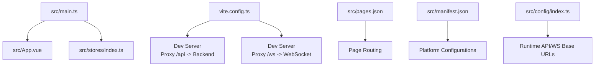

# Getting Started

<cite>
**Referenced Files in This Document**
- [package.json](file://package.json)
- [vite.config.ts](file://vite.config.ts)
- [tsconfig.json](file://tsconfig.json)
- [src/main.ts](file://src/main.ts)
- [src/App.vue](file://src/App.vue)
- [src/manifest.json](file://src/manifest.json)
- [src/pages.json](file://src/pages.json)
- [src/config/index.ts](file://src/config/index.ts)
- [linux-190-deploy/README.md](file://linux-190-deploy/README.md)
- [linux-190-deploy/QUICKSTART.md](file://linux-190-deploy/QUICKSTART.md)
- [linux-190-deploy/docker-compose.yml](file://linux-190-deploy/docker-compose.yml)
- [linux-190-deploy/Dockerfile](file://linux-190-deploy/Dockerfile)
</cite>

## Table of Contents
1. [Introduction](#introduction)
2. [Prerequisites and System Requirements](#prerequisites-and-system-requirements)
3. [Installation and Setup](#installation-and-setup)
4. [Development Environment Setup](#development-environment-setup)
5. [Running the Development Server](#running-the-development-server)
6. [Project Structure Overview](#project-structure-overview)
7. [Key Configuration Files](#key-configuration-files)
8. [Build and Deployment](#build-and-deployment)
9. [Quick Start Workflows](#quick-start-workflows)
10. [Debugging Techniques](#debugging-techniques)
11. [Troubleshooting Guide](#troubleshooting-guide)
12. [Conclusion](#conclusion)

## Introduction
This guide helps you set up and run the WeTogether project locally and deploy it to staging. It covers installing dependencies with pnpm, configuring the development environment for H5 and WeChat Mini Program targets, understanding the project structure, building for different environments, and deploying via Docker and Nginx. It also provides quick start workflows and debugging tips.

## Prerequisites and System Requirements
- Operating systems: macOS, Linux, Windows (WSL recommended for Windows)
- Node.js: 18+ (as required by the deployment documentation)
- Package manager: pnpm (required for this project)
- Git: for cloning and updating the repository
- Docker and Docker Compose: for local deployment and staging

These requirements are validated by the deployment documentation.

**Section sources**
- [linux-190-deploy/README.md:30-51](file://linux-190-deploy/README.md#L30-L51)

## Installation and Setup
1. Install pnpm globally if not already installed.
2. Clone the repository and navigate to the project root.
3. Install dependencies using pnpm:
   - Run: pnpm install
4. Verify installation:
   - Confirm Node.js and pnpm versions as per the deployment documentation.

Notes:
- The project uses pnpm for dependency management and includes a lock file.
- The scripts in package.json rely on the uni CLI, which is included as a dependency.

**Section sources**
- [package.json:1-100](file://package.json#L1-L100)
- [linux-190-deploy/README.md:30-51](file://linux-190-deploy/README.md#L30-L51)

## Development Environment Setup
The project supports multiple targets via the uni-app CLI. You can develop for:
- H5 (web)
- WeChat Mini Program (and other mini-program targets)

Target-specific setup steps:
- H5
  - Use the H5 development script to run the Vite-based dev server.
  - The Vite configuration defines a proxy for API and WebSocket traffic.
- WeChat Mini Program
  - Use the uni CLI with the WeChat Mini Program platform flag to preview in the official IDE.

Environment variables:
- Configure Vite environment variables to adjust the dev server port and API/WebSocket base URLs.
- The runtime configuration reads from import.meta.env and falls back to localhost defaults.

**Section sources**
- [vite.config.ts:27-47](file://vite.config.ts#L27-L47)
- [src/config/index.ts:1-11](file://src/config/index.ts#L1-L11)
- [package.json:4-44](file://package.json#L4-L44)

## Running the Development Server
Available npm scripts (via uni CLI):
- H5 development modes:
  - dev:h5, dev:h5:dev, dev:h5:staging, dev:h5:prod
- H5 SSR development:
  - dev:h5:ssr
- Mini Program targets (preview in respective IDEs):
  - dev:mp-weixin, dev:mp-alipay, dev:mp-baidu, dev:mp-toutiao, dev:mp-qq, dev:mp-jd, dev:mp-kuaishou, dev:mp-lark, dev:mp-harmony, dev:mp-xhs
  - Also supported: quickapp-webview variants

How to run:
- Choose a script from the package.json scripts section and execute it with pnpm.
- Example: pnpm dev:h5
- The Vite dev server starts with the configured port and proxies API and WebSocket requests.

Port and proxy behavior:
- Dev server port is configurable via Vite environment variables.
- Requests to /api are proxied to the configured backend base URL.
- WebSocket requests to /ws are proxied accordingly.

**Section sources**
- [package.json:4-44](file://package.json#L4-L44)
- [vite.config.ts:27-47](file://vite.config.ts#L27-L47)

## Project Structure Overview
High-level layout:
- src: Application source code (pages, components, stores, composables, services, assets, types)
- vite.config.ts: Vite configuration (plugins, proxy, server, build options)
- tsconfig.json: TypeScript compiler options and path aliases
- src/main.ts: App bootstrap and Pinia initialization
- src/App.vue: Global lifecycle hooks and styles
- src/manifest.json: uni-app app configuration (platform-specific settings)
- src/pages.json: Page routing and tabBar configuration
- linux-190-deploy: Docker and Nginx deployment artifacts for staging

**Diagram sources**
- [src/main.ts:1-18](file://src/main.ts#L1-L18)
- [src/App.vue:1-103](file://src/App.vue#L1-L103)
- [vite.config.ts:1-49](file://vite.config.ts#L1-L49)
- [src/pages.json:1-253](file://src/pages.json#L1-L253)
- [src/manifest.json:1-48](file://src/manifest.json#L1-L48)
- [src/config/index.ts:1-11](file://src/config/index.ts#L1-L11)

**Section sources**
- [src/main.ts:1-18](file://src/main.ts#L1-L18)
- [src/App.vue:1-103](file://src/App.vue#L1-L103)
- [src/pages.json:1-253](file://src/pages.json#L1-L253)
- [src/manifest.json:1-48](file://src/manifest.json#L1-L48)
- [vite.config.ts:1-49](file://vite.config.ts#L1-L49)
- [tsconfig.json:1-14](file://tsconfig.json#L1-L14)

## Key Configuration Files
- vite.config.ts
  - Defines Vite plugin chain (uni), SCSS options, dependency optimization, CommonJS inclusion, and dev server proxy rules for API and WebSocket.
- tsconfig.json
  - Extends the Vue TS base, enables source maps, sets baseUrl and path aliases, and includes type definitions for uni-app.
- src/main.ts
  - Creates the Vue app, initializes Pinia with persisted state, and exposes the app instance.
- src/App.vue
  - Registers global lifecycle hooks and applies global styles.
- src/manifest.json
  - uni-app app metadata and platform-specific configurations (e.g., WeChat Mini Program appid placeholder).
- src/pages.json
  - Declares pages, navigation bar titles, tabBar entries, and global navigation styles.
- src/config/index.ts
  - Exposes runtime configuration for API base URL, WS URL, and app base URL, reading from environment variables with sensible defaults.

**Section sources**
- [vite.config.ts:1-49](file://vite.config.ts#L1-L49)
- [tsconfig.json:1-14](file://tsconfig.json#L1-L14)
- [src/main.ts:1-18](file://src/main.ts#L1-L18)
- [src/App.vue:1-103](file://src/App.vue#L1-L103)
- [src/manifest.json:1-48](file://src/manifest.json#L1-L48)
- [src/pages.json:1-253](file://src/pages.json#L1-L253)
- [src/config/index.ts:1-11](file://src/config/index.ts#L1-L11)

## Build and Deployment
Build commands:
- H5 builds:
  - build:h5, build:h5:dev, build:h5:staging, build:h5:prod
  - These generate static assets under dist/build/h5/

Deployment to staging:
- One-click deployment script:
  - ./deploy-staging.sh (from linux-190-deploy/)
- Or manual steps:
  - Pull code, build with pnpm build:h5:staging, stop old containers, start new containers, health check

Docker and Nginx:
- Docker Compose service “frontend” builds from the provided Dockerfile, serves static files from dist/build/h5, and exposes ports 80 and 443.
- Health checks are configured to verify HTTP availability.

Nginx configuration:
- The Dockerfile copies a custom nginx.conf into the container.
- Typical behaviors include SPA routing fallback to index.html, gzip compression, caching for static assets, and proxying /api to the backend.

**Section sources**
- [package.json:10-12](file://package.json#L10-L12)
- [linux-190-deploy/README.md:53-91](file://linux-190-deploy/README.md#L53-L91)
- [linux-190-deploy/QUICKSTART.md:1-101](file://linux-190-deploy/QUICKSTART.md#L1-L101)
- [linux-190-deploy/docker-compose.yml:1-40](file://linux-190-deploy/docker-compose.yml#L1-L40)
- [linux-190-deploy/Dockerfile:1-18](file://linux-190-deploy/Dockerfile#L1-L18)

## Quick Start Workflows
- Local H5 development
  - pnpm dev:h5
  - Open http://localhost:{port} (default port is configurable via environment variables)
- Mini Program preview
  - pnpm dev:mp-weixin
  - Open the WeChat Mini Program IDE and preview using the uni CLI
- Staging deployment
  - pnpm build:h5:staging
  - cd linux-190-deploy && ./deploy-staging.sh

Common tasks:
- Change API base URL for local backend by setting VITE_APP_API_BASE_URL
- Adjust dev server port via VITE_APP_PORT

**Section sources**
- [package.json:4-44](file://package.json#L4-L44)
- [vite.config.ts:27-47](file://vite.config.ts#L27-L47)
- [linux-190-deploy/README.md:53-91](file://linux-190-deploy/README.md#L53-L91)

## Debugging Techniques
- Browser DevTools
  - Inspect network requests to /api and /ws; confirm proxy behavior and backend connectivity.
- Console logs
  - App lifecycle logs and auth initialization logs appear during launch.
- Docker logs
  - Tail logs for the frontend container to diagnose serving or proxy issues.
- Health checks
  - Use the provided health check script to verify container status and port availability.

**Section sources**
- [src/App.vue:9-25](file://src/App.vue#L9-L25)
- [vite.config.ts:27-47](file://vite.config.ts#L27-L47)
- [linux-190-deploy/README.md:293-300](file://linux-190-deploy/README.md#L293-L300)

## Troubleshooting Guide
- Build fails with crypto-js module error
  - The Vite configuration includes workarounds to handle this module; rebuild after ensuring dependencies are installed.
- Container startup fails
  - Check port 80/8107 availability, ensure build artifacts exist, and review Nginx configuration inside the container.
- Cannot reach backend API
  - Verify backend service availability and Nginx proxy configuration.
- Firewall blocks access
  - Allow inbound traffic on the frontend port (8107) and reload firewall rules.
- Blank page after deployment
  - Review browser console, container logs, and Nginx access/error logs; confirm SPA fallback is working.

**Section sources**
- [linux-190-deploy/README.md:194-260](file://linux-190-deploy/README.md#L194-L260)
- [linux-190-deploy/README.md:393-429](file://linux-190-deploy/README.md#L393-L429)

## Conclusion
You now have the essentials to install dependencies with pnpm, run the development server for H5 and Mini Programs, understand the project structure, configure environment variables, build for staging, and deploy with Docker and Nginx. Use the provided scripts and configuration files to streamline your workflow and troubleshoot common issues efficiently.