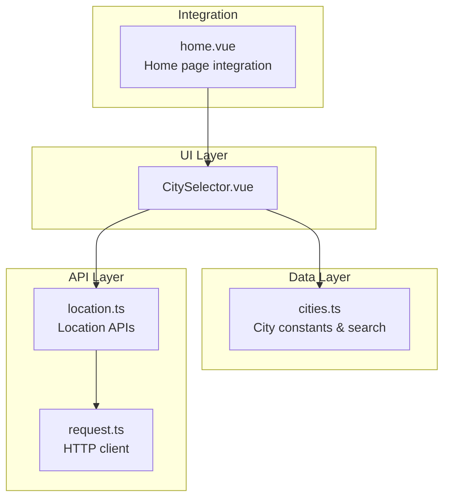
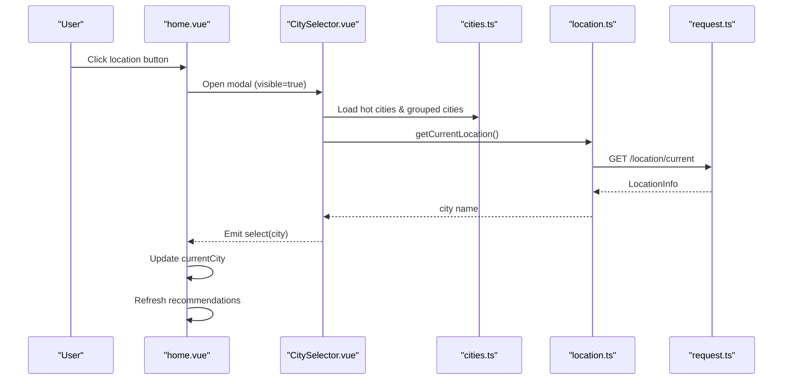
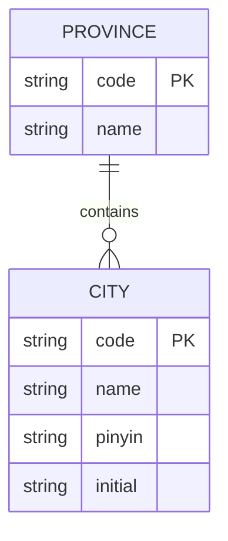
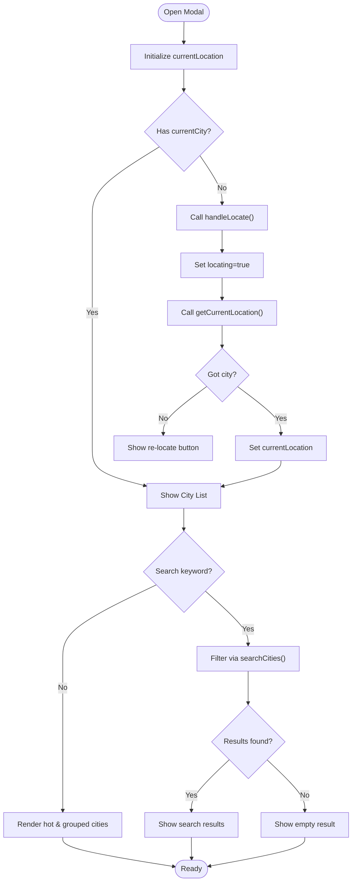
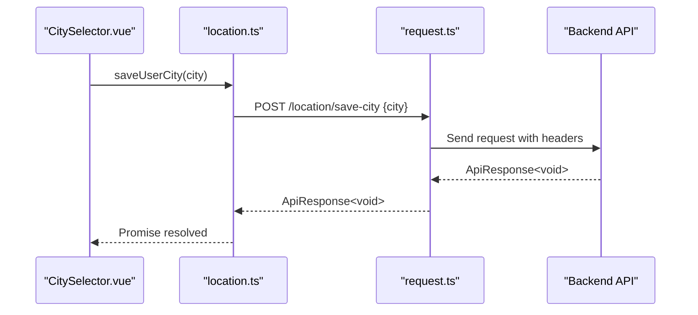
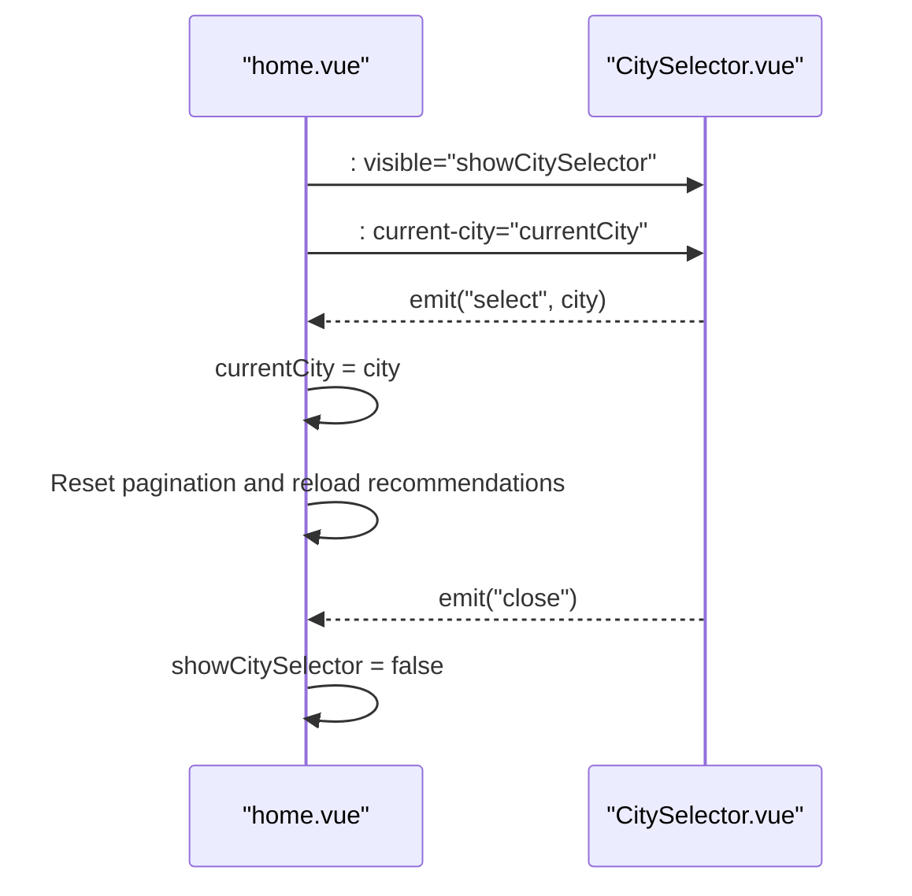
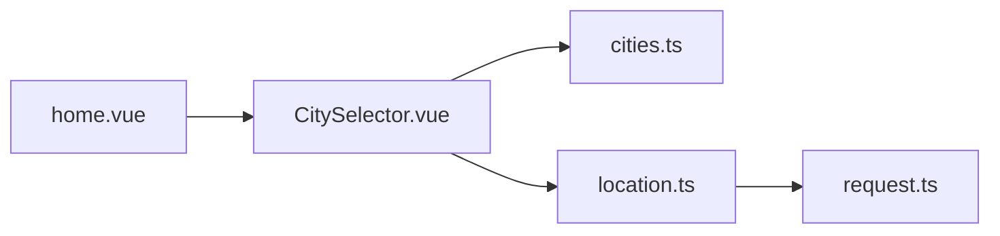

# City Selection

<cite>
**Referenced Files in This Document**
- [CitySelector.vue](file://src/components/business/CitySelector.vue)
- [cities.ts](file://src/constants/cities.ts)
- [location.ts](file://src/api/modules/location.ts)
- [home.vue](file://src/pages/tabbar/home.vue)
- [request.ts](file://src/api/request.ts)
- [storage.ts](file://src/utils/storage.ts)
- [city-selector-development.md](file://docs/refactry/city-selector-development.md)
</cite>

## Table of Contents
1. [Introduction](#introduction)
2. [Project Structure](#project-structure)
3. [Core Components](#core-components)
4. [Architecture Overview](#architecture-overview)
5. [Detailed Component Analysis](#detailed-component-analysis)
6. [Dependency Analysis](#dependency-analysis)
7. [Performance Considerations](#performance-considerations)
8. [Troubleshooting Guide](#troubleshooting-guide)
9. [Conclusion](#conclusion)

## Introduction
This document provides a comprehensive guide to the city selection feature, focusing on the CitySelector component implementation. It covers the dropdown interface, city list management, user interaction patterns, city data structure, constant definitions, loading and filtering mechanisms, and the saveUserCity and getUserCity API endpoints for persisting user location preferences. It also includes examples of component usage, event handling, integration with the location service, city validation, default selection logic, and fallback mechanisms when city data is unavailable.

## Project Structure
The city selection feature spans several modules:
- Component layer: CitySelector.vue provides the interactive UI for city selection.
- Data layer: cities.ts defines the city data structure and constants.
- API layer: location.ts exposes endpoints for location services and user city persistence.
- Integration layer: home.vue integrates the CitySelector component into the application flow.
- Infrastructure: request.ts manages HTTP requests and error handling; storage.ts provides local storage utilities.



**Diagram sources**
- [CitySelector.vue:118-258](file://src/components/business/CitySelector.vue#L118-L258)
- [cities.ts:8-185](file://src/constants/cities.ts#L8-L185)
- [location.ts:1-45](file://src/api/modules/location.ts#L1-L45)
- [request.ts:1-228](file://src/api/request.ts#L1-L228)
- [home.vue:119-126](file://src/pages/tabbar/home.vue#L119-L126)

**Section sources**
- [CitySelector.vue:1-116](file://src/components/business/CitySelector.vue#L1-L116)
- [cities.ts:1-186](file://src/constants/cities.ts#L1-L186)
- [location.ts:1-45](file://src/api/modules/location.ts#L1-L45)
- [home.vue:119-126](file://src/pages/tabbar/home.vue#L119-L126)

## Core Components
- CitySelector.vue: Implements the modal-based city selection interface with search, current location detection, hot cities, alphabetical grouping, and index bar navigation.
- cities.ts: Defines the City interface, hot cities, grouped cities by initial letter, and utility functions for searching and retrieving city names.
- location.ts: Exposes API functions for getting current location, saving user city, and retrieving user city preference.
- home.vue: Integrates the CitySelector component and handles city change events to refresh content.

Key responsibilities:
- CitySelector.vue manages UI state, user interactions, and emits events for parent components.
- cities.ts centralizes city data and search logic.
- location.ts abstracts network calls for location services.
- home.vue orchestrates the city selection flow and updates application state.

**Section sources**
- [CitySelector.vue:118-258](file://src/components/business/CitySelector.vue#L118-L258)
- [cities.ts:8-185](file://src/constants/cities.ts#L8-L185)
- [location.ts:19-45](file://src/api/modules/location.ts#L19-L45)
- [home.vue:286-311](file://src/pages/tabbar/home.vue#L286-L311)

## Architecture Overview
The city selection feature follows a layered architecture:
- UI: CitySelector.vue renders the modal and handles user interactions.
- Data: cities.ts provides city data and search capabilities.
- Services: location.ts encapsulates location-related API calls.
- Networking: request.ts standardizes HTTP requests and error handling.
- Integration: home.vue coordinates the component lifecycle and reacts to city changes.



**Diagram sources**
- [CitySelector.vue:164-223](file://src/components/business/CitySelector.vue#L164-L223)
- [cities.ts:27-133](file://src/constants/cities.ts#L27-L133)
- [location.ts:19-21](file://src/api/modules/location.ts#L19-L21)
- [request.ts:210-212](file://src/api/request.ts#L210-L212)
- [home.vue:286-311](file://src/pages/tabbar/home.vue#L286-L311)

## Detailed Component Analysis

### CitySelector Component
The CitySelector component provides a modal interface for selecting a city. It supports:
- Current location detection with feedback and re-try capability.
- Search by Chinese characters, Pinyin, or initial letter.
- Hot cities grid layout.
- Alphabetical grouping of all cities with an index bar for fast navigation.
- Saving the selected city via the saveUserCity API and emitting a select event.

```mermaid
classDiagram
class CitySelector {
+boolean visible
+string currentCity
+string searchKeyword
+City[] searchResults
+string currentLocation
+boolean locating
+string scrollIntoView
+openModal()
+handleSearch()
+clearSearch()
+handleLocate()
+selectCity(cityName)
+scrollToInitial(initial)
+handleClose()
}
class CitiesModule {
+City[] HOT_CITIES
+Record~string,City[]~ ALL_CITIES
+string[] CITY_INITIALS
+searchCities(keyword) City[]
+getCityNameByCode(code) string
}
class LocationAPI {
+getCurrentLocation() ApiResponse~LocationInfo~
+getCityByCoordinates(params) ApiResponse~LocationInfo~
+saveUserCity(city) ApiResponse~void~
+getUserCity() ApiResponse~{city}~
}
CitySelector --> CitiesModule : "uses constants & search"
CitySelector --> LocationAPI : "calls APIs"
```

**Diagram sources**
- [CitySelector.vue:118-258](file://src/components/business/CitySelector.vue#L118-L258)
- [cities.ts:8-185](file://src/constants/cities.ts#L8-L185)
- [location.ts:19-45](file://src/api/modules/location.ts#L19-L45)

**Section sources**
- [CitySelector.vue:1-116](file://src/components/business/CitySelector.vue#L1-L116)
- [CitySelector.vue:118-258](file://src/components/business/CitySelector.vue#L118-L258)

#### Dropdown Interface and Interaction Patterns
- Modal overlay and close behavior: clicking the overlay or close icon triggers the close event and resets search state.
- Search box: two-way binding on searchKeyword triggers real-time filtering via searchCities.
- Current location section: shows "locating" state, displays detected city, or offers a "re-locate" action.
- Index bar: scrolls to the corresponding city group when an initial letter is tapped.
- Event emission: emits "close" and "select" events for parent component handling.

**Section sources**
- [CitySelector.vue:2-116](file://src/components/business/CitySelector.vue#L2-L116)
- [CitySelector.vue:149-236](file://src/components/business/CitySelector.vue#L149-L236)

#### City List Management
- Hot cities: rendered in a 3-column grid for quick selection.
- Alphabetical groups: cities are grouped by initial letter and displayed under titled sections.
- Index bar: lists initials aligned vertically for fast navigation to city groups.

**Section sources**
- [CitySelector.vue:61-113](file://src/components/business/CitySelector.vue#L61-L113)
- [cities.ts:27-133](file://src/constants/cities.ts#L27-L133)

#### User Interaction Patterns
- Tap a city item to select it.
- Tap the current location item to confirm detected city.
- Use the index bar to jump to a specific letter group.
- Clear search input to return to the city list.

**Section sources**
- [CitySelector.vue:44-113](file://src/components/business/CitySelector.vue#L44-L113)

### City Data Structure and Constants
The city data model consists of:
- City interface: code, name, pinyin, initial.
- Province interface: code, name, cities array.
- HOT_CITIES: predefined popular cities.
- ALL_CITIES: grouped cities by initial letter.
- CITY_INITIALS: sorted list of initial letters derived from ALL_CITIES keys.
- Utility functions:
  - searchCities(keyword): searches hot cities and grouped cities by name, pinyin, or initial.
  - getCityNameByCode(code): retrieves city name by code with a fallback.



**Diagram sources**
- [cities.ts:8-22](file://src/constants/cities.ts#L8-L22)

**Section sources**
- [cities.ts:8-22](file://src/constants/cities.ts#L8-L22)
- [cities.ts:27-133](file://src/constants/cities.ts#L27-L133)
- [cities.ts:138-185](file://src/constants/cities.ts#L138-L185)

### Loading and Filtering Mechanisms
- Initial loading: on modal open, if currentCity prop is not set or equals the default "定位中...", the component attempts to locate the user.
- Search filtering: searchCities performs case-insensitive matching against name, pinyin, and initial letter, avoiding duplicates across hot and grouped lists.
- Scroll-to-initial: uses scroll-into-view to jump to the target city group.



**Diagram sources**
- [CitySelector.vue:238-252](file://src/components/business/CitySelector.vue#L238-L252)
- [CitySelector.vue:164-201](file://src/components/business/CitySelector.vue#L164-L201)
- [CitySelector.vue:149-156](file://src/components/business/CitySelector.vue#L149-L156)
- [cities.ts:138-170](file://src/constants/cities.ts#L138-L170)

**Section sources**
- [CitySelector.vue:238-252](file://src/components/business/CitySelector.vue#L238-L252)
- [CitySelector.vue:164-201](file://src/components/business/CitySelector.vue#L164-L201)
- [CitySelector.vue:149-156](file://src/components/business/CitySelector.vue#L149-L156)
- [cities.ts:138-170](file://src/constants/cities.ts#L138-L170)

### saveUserCity and getUserCity API Endpoints
The location module exposes:
- getCurrentLocation(): GET /location/current
- getCityByCoordinates(params): POST /location/geocode
- saveUserCity(city): POST /location/save-city
- getUserCity(): GET /location/user-city

These endpoints integrate with the shared request client, which handles headers, timeouts, and token refresh logic.



**Diagram sources**
- [location.ts:36-38](file://src/api/modules/location.ts#L36-L38)
- [request.ts:75-208](file://src/api/request.ts#L75-L208)

**Section sources**
- [location.ts:19-45](file://src/api/modules/location.ts#L19-L45)
- [request.ts:15-24](file://src/api/request.ts#L15-L24)
- [request.ts:210-216](file://src/api/request.ts#L210-L216)

### Component Usage and Integration
- Integration in home.vue: The CitySelector component is conditionally rendered and controlled by showCitySelector and currentCity reactive state. It listens for select events to update the current city and refreshes recommendations.
- Event handling: The component emits "close" and "select" events; the parent handles these to manage visibility and state transitions.



**Diagram sources**
- [home.vue:119-126](file://src/pages/tabbar/home.vue#L119-L126)
- [home.vue:286-311](file://src/pages/tabbar/home.vue#L286-L311)
- [CitySelector.vue:134-137](file://src/components/business/CitySelector.vue#L134-L137)

**Section sources**
- [home.vue:119-126](file://src/pages/tabbar/home.vue#L119-L126)
- [home.vue:286-311](file://src/pages/tabbar/home.vue#L286-L311)
- [CitySelector.vue:134-137](file://src/components/business/CitySelector.vue#L134-L137)

### City Validation, Default Selection Logic, and Fallbacks
- Default selection: The component initializes currentLocation based on props; if not provided or equals the default "定位中...", it attempts to locate the user automatically.
- City validation: The search algorithm ensures uniqueness across hot and grouped lists and supports multiple matching criteria (name, pinyin, initial).
- Fallback mechanisms:
  - If location fails, the component shows a "re-locate" option and displays user-friendly error messages for permission denials or timeouts.
  - If search yields no results, the component shows an empty state message.
  - If city data is missing, getCityNameByCode returns a safe fallback string.

**Section sources**
- [CitySelector.vue:238-252](file://src/components/business/CitySelector.vue#L238-L252)
- [CitySelector.vue:182-201](file://src/components/business/CitySelector.vue#L182-L201)
- [CitySelector.vue:159-162](file://src/components/business/CitySelector.vue#L159-L162)
- [cities.ts:175-185](file://src/constants/cities.ts#L175-L185)

## Dependency Analysis
The CitySelector component depends on:
- cities.ts for city data and search logic.
- location.ts for location services and user city persistence.
- request.ts for standardized HTTP communication.
- home.vue for integration and state management.



**Diagram sources**
- [CitySelector.vue:118-122](file://src/components/business/CitySelector.vue#L118-L122)
- [cities.ts:120-121](file://src/constants/cities.ts#L120-L121)
- [location.ts:1-2](file://src/api/modules/location.ts#L1-L2)
- [request.ts:1-2](file://src/api/request.ts#L1-L2)
- [home.vue](file://src/pages/tabbar/home.vue#L142)

**Section sources**
- [CitySelector.vue:118-122](file://src/components/business/CitySelector.vue#L118-L122)
- [home.vue](file://src/pages/tabbar/home.vue#L142)

## Performance Considerations
- Efficient search: searchCities performs linear scans over hot and grouped lists; consider memoization or indexed search structures for larger datasets.
- Rendering optimization: Using v-for with stable keys and scroll-into-view minimizes DOM churn during navigation.
- Network efficiency: Consolidate location requests and reuse cached results where appropriate.
- UI responsiveness: Debounce search input to reduce frequent filtering operations.

## Troubleshooting Guide
Common issues and resolutions:
- Location permission denied: The component detects permission denials and prompts the user to grant location access.
- Location timeout: Displays a timeout message and allows re-try.
- Network errors: The request client handles 401 unauthorized by refreshing tokens and retrying; other failures show user-friendly messages.
- Empty search results: The component displays a message indicating no matching cities were found.
- City not found: getCityNameByCode returns a safe fallback string.

**Section sources**
- [CitySelector.vue:182-201](file://src/components/business/CitySelector.vue#L182-L201)
- [request.ts:100-147](file://src/api/request.ts#L100-L147)
- [cities.ts:175-185](file://src/constants/cities.ts#L175-L185)

## Conclusion
The city selection feature delivers a robust, user-friendly experience with intelligent location detection, efficient search, and seamless integration into the application flow. The layered architecture ensures maintainability and scalability, while the component-driven design promotes reusability across the platform.