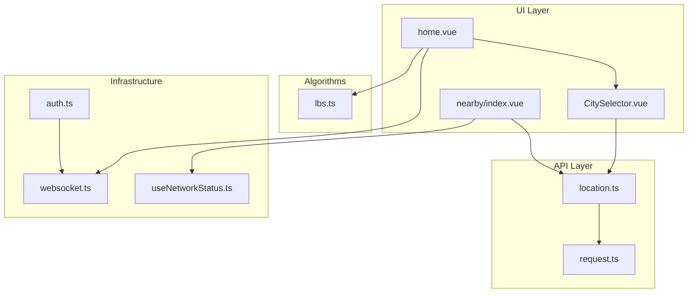
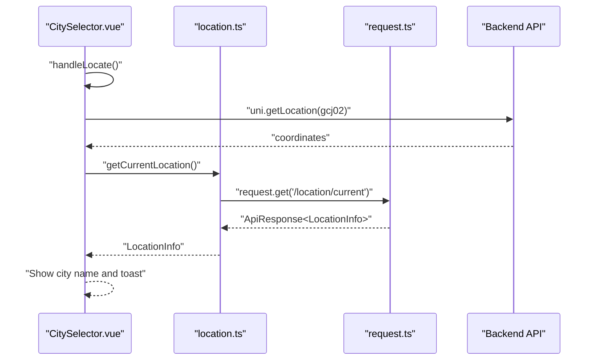
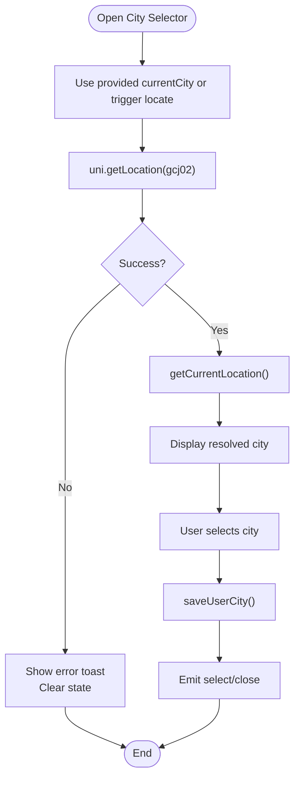
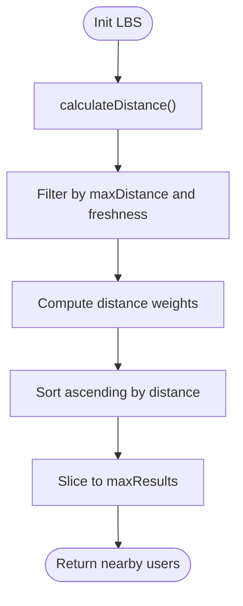
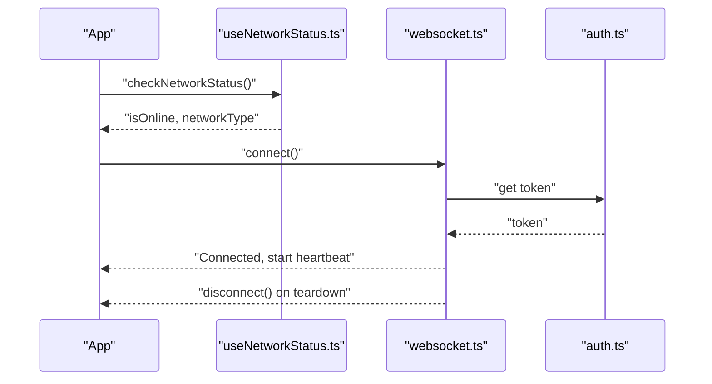
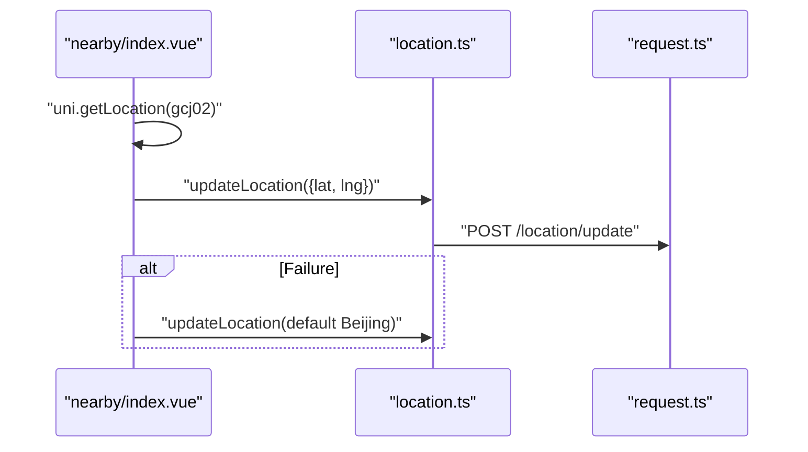
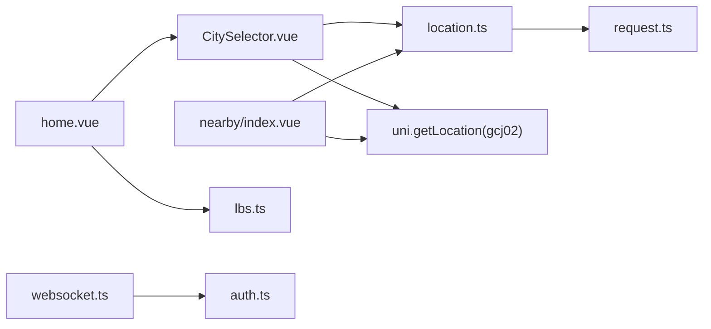

# Geolocation Management

<cite>
**Referenced Files in This Document**
- [location.ts](file://src/api/modules/location.ts)
- [CitySelector.vue](file://src/components/business/CitySelector.vue)
- [cities.ts](file://src/constants/cities.ts)
- [lbs.ts](file://src/pages/tabbar/home/algorithms/lbs.ts)
- [index.vue](file://src/pages/nearby/index.vue)
- [home.vue](file://src/pages/tabbar/home.vue)
- [websocket.ts](file://src/utils/websocket.ts)
- [useNetworkStatus.ts](file://src/composables/useNetworkStatus.ts)
- [request.ts](file://src/api/request.ts)
- [auth.ts](file://src/stores/auth.ts)
</cite>

## Table of Contents
1. [Introduction](#introduction)
2. [Project Structure](#project-structure)
3. [Core Components](#core-components)
4. [Architecture Overview](#architecture-overview)
5. [Detailed Component Analysis](#detailed-component-analysis)
6. [Dependency Analysis](#dependency-analysis)
7. [Performance Considerations](#performance-considerations)
8. [Troubleshooting Guide](#troubleshooting-guide)
9. [Conclusion](#conclusion)

## Introduction
This document describes the geolocation management system, covering current location detection, coordinate-based city lookup, and location persistence. It details the APIs for getting the current location and resolving a city from coordinates, explains permission handling and fallbacks when GPS is unavailable, outlines accuracy considerations, and documents integration with WebSocket for real-time updates and network status monitoring. Practical examples demonstrate error handling, battery optimization techniques, and privacy controls for location data management.

## Project Structure
The geolocation system spans several modules:
- API module for location services
- UI components for city selection and nearby discovery
- Algorithms for LBS-based recommendations
- Network and WebSocket utilities
- Authentication and persistence stores



**Diagram sources**
- [CitySelector.vue:118-258](file://src/components/business/CitySelector.vue#L118-L258)
- [home.vue:129-439](file://src/pages/tabbar/home.vue#L129-L439)
- [index.vue:213-278](file://src/pages/nearby/index.vue#L213-L278)
- [location.ts:1-79](file://src/api/modules/location.ts#L1-L79)
- [request.ts:1-228](file://src/api/request.ts#L1-L228)
- [lbs.ts:1-196](file://src/pages/tabbar/home/algorithms/lbs.ts#L1-L196)
- [websocket.ts:1-171](file://src/utils/websocket.ts#L1-L171)
- [useNetworkStatus.ts:1-62](file://src/composables/useNetworkStatus.ts#L1-L62)
- [auth.ts:1-137](file://src/stores/auth.ts#L1-L137)

**Section sources**
- [location.ts:1-79](file://src/api/modules/location.ts#L1-L79)
- [CitySelector.vue:118-258](file://src/components/business/CitySelector.vue#L118-L258)
- [lbs.ts:1-196](file://src/pages/tabbar/home/algorithms/lbs.ts#L1-L196)
- [index.vue:213-278](file://src/pages/nearby/index.vue#L213-L278)
- [home.vue:129-439](file://src/pages/tabbar/home.vue#L129-L439)
- [websocket.ts:1-171](file://src/utils/websocket.ts#L1-L171)
- [useNetworkStatus.ts:1-62](file://src/composables/useNetworkStatus.ts#L1-L62)
- [request.ts:1-228](file://src/api/request.ts#L1-L228)
- [auth.ts:1-137](file://src/stores/auth.ts#L1-L137)

## Core Components
- Location API module: Provides typed functions for current location retrieval, reverse geocoding via coordinates, saving user-selected city, fetching saved city, and setting location visibility.
- City selector component: Orchestrates user-initiated location detection, displays current city, supports search and selection, and persists user choice.
- LBS algorithms: Computes distances, filters nearby users, and constructs bounding boxes for efficient queries.
- Network and WebSocket utilities: Monitor connectivity and maintain persistent connections for real-time updates.
- Authentication and persistence: Manage tokens and session state used by WebSocket and API requests.

Key API functions:
- getCurrentLocation(): Fetches the user’s current location from the server.
- getCityByCoordinates({ latitude, longitude }): Resolves city information from coordinates.
- updateLocation(params): Persists the user’s coordinates and optional city metadata.
- saveUserCity(cityId): Saves the user’s chosen city.
- getUserCity(): Retrieves the previously saved city.
- setLocationVisibility(isVisible): Controls whether location is publicly visible.

**Section sources**
- [location.ts:32-78](file://src/api/modules/location.ts#L32-L78)
- [CitySelector.vue:164-223](file://src/components/business/CitySelector.vue#L164-L223)
- [lbs.ts:39-176](file://src/pages/tabbar/home/algorithms/lbs.ts#L39-L176)
- [websocket.ts:15-91](file://src/utils/websocket.ts#L15-L91)
- [useNetworkStatus.ts:7-45](file://src/composables/useNetworkStatus.ts#L7-L45)
- [request.ts:10-24](file://src/api/request.ts#L10-L24)

## Architecture Overview
The system integrates client-side location detection with server-side geocoding and persistence, while supporting real-time updates via WebSocket and robust network monitoring.



**Diagram sources**
- [CitySelector.vue:164-201](file://src/components/business/CitySelector.vue#L164-L201)
- [location.ts:40-42](file://src/api/modules/location.ts#L40-L42)
- [request.ts:210-212](file://src/api/request.ts#L210-L212)

**Section sources**
- [CitySelector.vue:164-201](file://src/components/business/CitySelector.vue#L164-L201)
- [location.ts:40-42](file://src/api/modules/location.ts#L40-L42)
- [request.ts:75-208](file://src/api/request.ts#L75-L208)

## Detailed Component Analysis

### Location API Module
The location module defines:
- LocationInfo and UpdateLocationParams interfaces for consistent data exchange.
- Functions for updating location, retrieving current location, reverse geocoding, saving and retrieving user city, and toggling visibility.

Parameter specifications:
- getCurrentLocation(): No parameters; returns LocationInfo.
- getCityByCoordinates({ latitude, longitude }): Coordinates must be numeric; returns LocationInfo.
- updateLocation(params): Accepts latitude, longitude, and optional city/province/district/address.
- saveUserCity(cityId): Numeric city identifier.
- getUserCity(): Returns an object containing the selected city string.
- setLocationVisibility(isVisible): Accepts a numeric visibility flag.

Response handling:
- All functions return a Promise wrapping ApiResponse<T>.
- The request layer validates HTTP status and response code, displaying user-friendly messages and rejecting on failure.

```mermaid
classDiagram
class LocationAPI {
+getCurrentLocation() ApiResponse~LocationInfo~
+getCityByCoordinates(params) ApiResponse~LocationInfo~
+updateLocation(params) ApiResponse~LocationInfo~
+saveUserCity(cityId) ApiResponse~void~
+getUserCity() ApiResponse~{city}~
+setLocationVisibility(isVisible) ApiResponse~void~
}
class RequestLayer {
+get(url, data) ApiResponse
+post(url, data) ApiResponse
+put(url, data) ApiResponse
}
LocationAPI --> RequestLayer : "uses"
```

**Diagram sources**
- [location.ts:7-78](file://src/api/modules/location.ts#L7-L78)
- [request.ts:210-224](file://src/api/request.ts#L210-L224)

**Section sources**
- [location.ts:7-78](file://src/api/modules/location.ts#L7-L78)
- [request.ts:75-208](file://src/api/request.ts#L75-L208)

### City Selector Component
Responsibilities:
- Trigger device location acquisition using gcj02 coordinates.
- Call getCurrentLocation() to resolve city name.
- Present search, hot cities, and alphabetical lists.
- Persist user city selection via saveUserCity() and notify parent.

Error handling:
- Catches authorization denial and timeout errors, showing appropriate toasts.
- Clears locating state and resets UI after completion.



**Diagram sources**
- [CitySelector.vue:164-223](file://src/components/business/CitySelector.vue#L164-L223)
- [location.ts:40-42](file://src/api/modules/location.ts#L40-L42)
- [location.ts:60-62](file://src/api/modules/location.ts#L60-L62)

**Section sources**
- [CitySelector.vue:164-223](file://src/components/business/CitySelector.vue#L164-L223)
- [location.ts:40-42](file://src/api/modules/location.ts#L40-L42)
- [location.ts:60-62](file://src/api/modules/location.ts#L60-L62)

### LBS Algorithms for Recommendations
Capabilities:
- Distance calculation using the haversine formula.
- Nearby user filtering by distance, freshness threshold, and result limits.
- Geofence checks and bounding box computation for efficient database queries.

Accuracy considerations:
- Uses WGS84 mean radius and radians conversion.
- Freshness threshold prevents recommending stale locations.
- Optional exclusion set avoids self-recommendation.



**Diagram sources**
- [lbs.ts:39-158](file://src/pages/tabbar/home/algorithms/lbs.ts#L39-L158)

**Section sources**
- [lbs.ts:39-176](file://src/pages/tabbar/home/algorithms/lbs.ts#L39-L176)

### Network Status Monitoring and WebSocket Integration
Network monitoring:
- useNetworkStatus tracks online/offline state and network type.
- Provides a guard to prevent actions when offline.

WebSocket:
- wsManager connects with token-based auth, automatic reconnection, and heartbeat pings.
- Handles connect/disconnect events, message routing, and graceful shutdown.



**Diagram sources**
- [useNetworkStatus.ts:7-61](file://src/composables/useNetworkStatus.ts#L7-L61)
- [websocket.ts:15-91](file://src/utils/websocket.ts#L15-L91)
- [auth.ts:12-26](file://src/stores/auth.ts#L12-L26)

**Section sources**
- [useNetworkStatus.ts:7-61](file://src/composables/useNetworkStatus.ts#L7-L61)
- [websocket.ts:15-91](file://src/utils/websocket.ts#L15-L91)
- [auth.ts:12-26](file://src/stores/auth.ts#L12-L26)

### Nearby Discovery and Location Persistence
Nearby page:
- Acquires device location using gcj02 coordinates.
- Updates server with latest coordinates via updateLocation().
- Falls back to a default city (Beijing) on failure and notifies the user.

Home page:
- Integrates city selection and triggers recommendation refresh upon city change.



**Diagram sources**
- [index.vue:213-244](file://src/pages/nearby/index.vue#L213-L244)
- [location.ts:32-34](file://src/api/modules/location.ts#L32-L34)
- [request.ts:214-216](file://src/api/request.ts#L214-L216)

**Section sources**
- [index.vue:213-244](file://src/pages/nearby/index.vue#L213-L244)
- [location.ts:32-34](file://src/api/modules/location.ts#L32-L34)
- [home.vue:302-311](file://src/pages/tabbar/home.vue#L302-L311)

## Dependency Analysis
- CitySelector depends on:
  - Location API for current location and city saving
  - UniApp device location API for gcj02 coordinates
- LBS algorithms depend on:
  - Location data structures and time-based freshness logic
- Nearby page depends on:
  - Device location API and Location API for persistence
- WebSocket depends on:
  - Authentication store for token retrieval and lifecycle hooks
- Request layer centralizes:
  - Header injection, token refresh, and unified error handling



**Diagram sources**
- [CitySelector.vue:118-122](file://src/components/business/CitySelector.vue#L118-L122)
- [index.vue:213-224](file://src/pages/nearby/index.vue#L213-L224)
- [home.vue:120-125](file://src/pages/tabbar/home.vue#L120-L125)
- [lbs.ts:6-15](file://src/pages/tabbar/home/algorithms/lbs.ts#L6-L15)
- [websocket.ts:23-24](file://src/utils/websocket.ts#L23-L24)
- [auth.ts:12-26](file://src/stores/auth.ts#L12-L26)
- [location.ts:1-2](file://src/api/modules/location.ts#L1-L2)
- [request.ts:15-24](file://src/api/request.ts#L15-L24)

**Section sources**
- [CitySelector.vue:118-122](file://src/components/business/CitySelector.vue#L118-L122)
- [index.vue:213-224](file://src/pages/nearby/index.vue#L213-L224)
- [home.vue:120-125](file://src/pages/tabbar/home.vue#L120-L125)
- [lbs.ts:6-15](file://src/pages/tabbar/home/algorithms/lbs.ts#L6-L15)
- [websocket.ts:23-24](file://src/utils/websocket.ts#L23-L24)
- [auth.ts:12-26](file://src/stores/auth.ts#L12-L26)
- [location.ts:1-2](file://src/api/modules/location.ts#L1-L2)
- [request.ts:15-24](file://src/api/request.ts#L15-L24)

## Performance Considerations
- Minimize repeated location requests:
  - Cache current city and coordinates locally; reuse until user initiates a refresh.
  - Debounce city search input to reduce API calls.
- Optimize reverse geocoding:
  - Batch updates and avoid frequent getCurrentLocation() calls.
  - Use bounding box pre-filtering in LBS to limit database scans.
- Network efficiency:
  - Use useNetworkStatus.checkBeforeAction() to avoid redundant offline operations.
  - Leverage WebSocket heartbeats to detect and recover from disconnections proactively.
- Battery optimization:
  - Prefer lower frequency updates for background location.
  - Avoid continuous polling; use event-driven updates (e.g., city change) to trigger recomputation.

[No sources needed since this section provides general guidance]

## Troubleshooting Guide
Common issues and resolutions:
- Permission denied:
  - Symptom: Authorization denial toast and empty current location.
  - Action: Prompt user to enable location permissions; fall back to default city and persist coordinates.
- Timeout or GPS unavailable:
  - Symptom: Timeout toast and default city fallback.
  - Action: Retry once, then persist default coordinates; inform user.
- Network disconnected:
  - Symptom: Offline toast and blocked actions.
  - Action: Prevent operations; notify user; resume when online.
- WebSocket disconnect:
  - Symptom: Disconnection events and reconnection attempts.
  - Action: Verify token validity; ensure heartbeat runs; log reconnection attempts.

Examples:
- City selector error handling:
  - Detects authorization denial and timeout; shows appropriate toasts; clears state.
- Nearby page error handling:
  - On failure, persists default Beijing coordinates and shows a toast.
- Network guard:
  - Prevents actions when offline; shows contextual toasts.

**Section sources**
- [CitySelector.vue:182-200](file://src/components/business/CitySelector.vue#L182-L200)
- [index.vue:225-244](file://src/pages/nearby/index.vue#L225-L244)
- [useNetworkStatus.ts:35-45](file://src/composables/useNetworkStatus.ts#L35-L45)
- [websocket.ts:78-91](file://src/utils/websocket.ts#L78-L91)

## Conclusion
The geolocation system combines device location acquisition, server-side reverse geocoding, and persistence to deliver a seamless city selection experience. Robust error handling ensures graceful degradation when GPS is unavailable, while network monitoring and WebSocket integration support real-time updates. By applying caching, debouncing, and event-driven updates, the system balances accuracy, performance, and battery life. Privacy controls allow users to manage location visibility, ensuring compliance with user preferences.