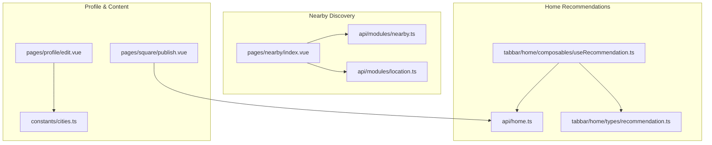
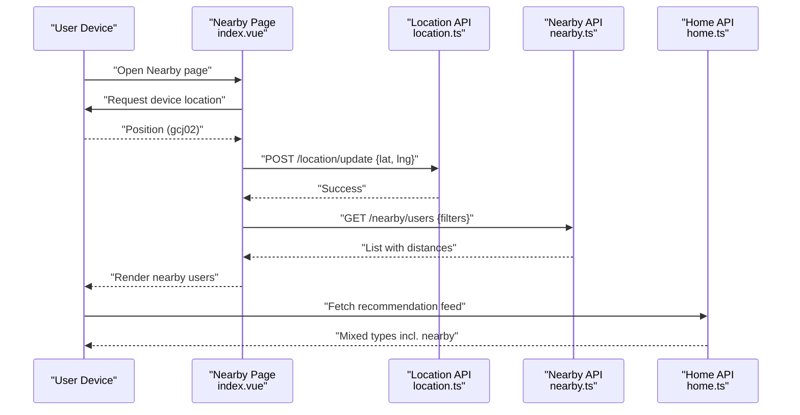
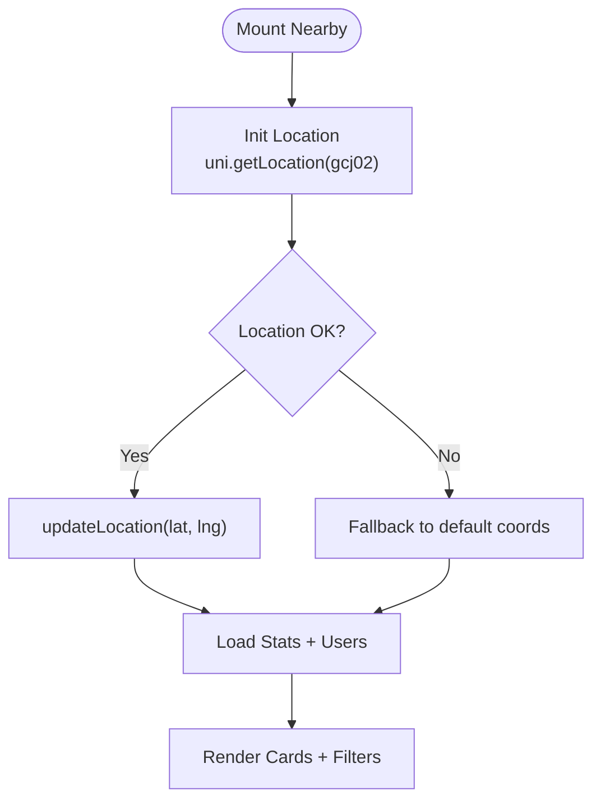
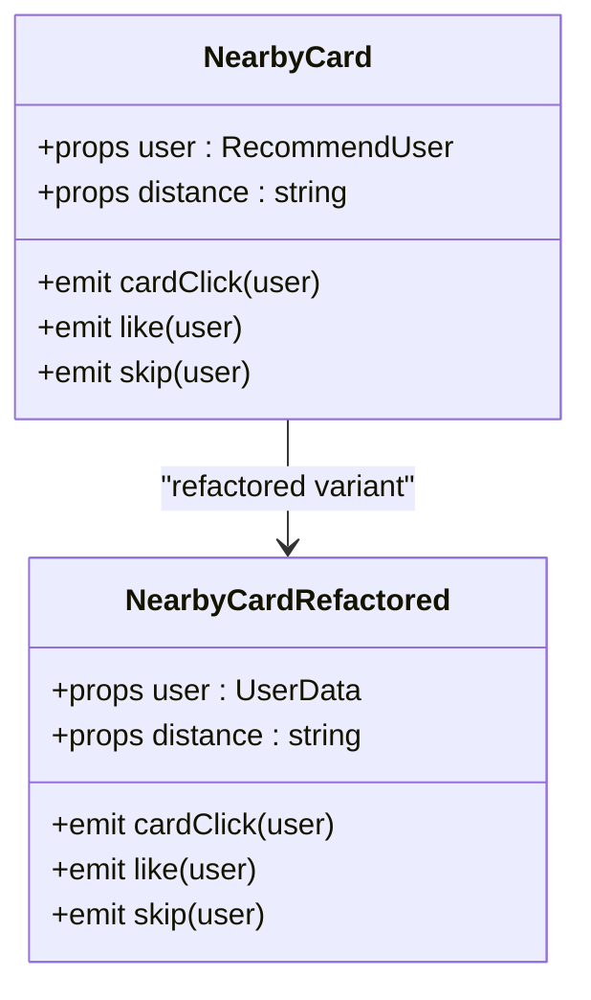
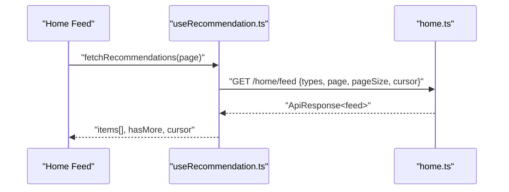
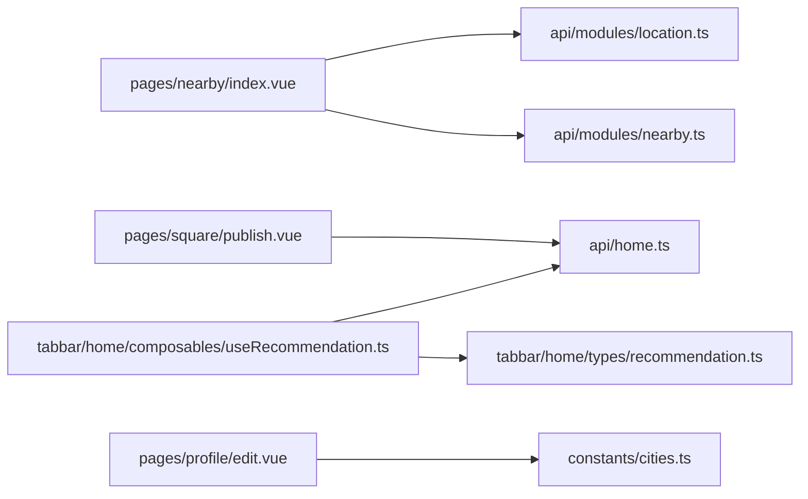

# Location Integration

<cite>
**Referenced Files in This Document**
- [location.ts](file://src/api/modules/location.ts)
- [nearby.ts](file://src/api/modules/nearby.ts)
- [index.vue](file://src/pages/nearby/index.vue)
- [NearbyCard.vue](file://src/pages/tabbar/home/components/NearbyCard.vue)
- [NearbyCard.refactored.vue](file://src/pages/tabbar/home/components/NearbyCard.refactored.vue)
- [useRecommendation.ts](file://src/pages/tabbar/home/composables/useRecommendation.ts)
- [recommendation.ts](file://src/pages/tabbar/home/types/recommendation.ts)
- [cities.ts](file://src/constants/cities.ts)
- [publish.vue](file://src/pages/square/publish.vue)
- [edit.vue](file://src/pages/profile/edit.vue)
- [home.ts](file://src/api/home.ts)
</cite>

## Table of Contents
1. [Introduction](#introduction)
2. [Project Structure](#project-structure)
3. [Core Components](#core-components)
4. [Architecture Overview](#architecture-overview)
5. [Detailed Component Analysis](#detailed-component-analysis)
6. [Dependency Analysis](#dependency-analysis)
7. [Performance Considerations](#performance-considerations)
8. [Troubleshooting Guide](#troubleshooting-guide)
9. [Privacy and Security Considerations](#privacy-and-security-considerations)
10. [Conclusion](#conclusion)

## Introduction
This document explains how location integrates across the platform, covering:
- Authentication and consent for location access
- Content feed location filtering and LBS-based recommendations
- How location data is stored and shared across features
- Practical examples of location-based filtering, user preferences, and cross-feature data sharing
- Privacy and security considerations for location data

It focuses on the frontend implementation and APIs that enable location-aware experiences such as nearby discovery and localized recommendations.

## Project Structure
Location integration spans several areas:
- API modules for location and nearby users
- Near-me discovery page and cards
- Home recommendation composable and types
- City constants and selection utilities
- Square post creation form
- Profile editing page



**Diagram sources**
- [index.vue:140-417](file://src/pages/nearby/index.vue#L140-L417)
- [nearby.ts:1-82](file://src/api/modules/nearby.ts#L1-L82)
- [location.ts:1-79](file://src/api/modules/location.ts#L1-L79)
- [useRecommendation.ts:1-202](file://src/pages/tabbar/home/composables/useRecommendation.ts#L1-L202)
- [recommendation.ts:1-119](file://src/pages/tabbar/home/types/recommendation.ts#L1-L119)
- [home.ts:1-195](file://src/api/home.ts#L1-L195)
- [edit.vue:1-567](file://src/pages/profile/edit.vue#L1-L567)
- [publish.vue:1-239](file://src/pages/square/publish.vue#L1-L239)
- [cities.ts:1-186](file://src/constants/cities.ts#L1-L186)

**Section sources**
- [index.vue:140-417](file://src/pages/nearby/index.vue#L140-L417)
- [nearby.ts:1-82](file://src/api/modules/nearby.ts#L1-L82)
- [location.ts:1-79](file://src/api/modules/location.ts#L1-L79)
- [useRecommendation.ts:1-202](file://src/pages/tabbar/home/composables/useRecommendation.ts#L1-L202)
- [recommendation.ts:1-119](file://src/pages/tabbar/home/types/recommendation.ts#L1-L119)
- [home.ts:1-195](file://src/api/home.ts#L1-L195)
- [edit.vue:1-567](file://src/pages/profile/edit.vue#L1-L567)
- [publish.vue:1-239](file://src/pages/square/publish.vue#L1-L239)
- [cities.ts:1-186](file://src/constants/cities.ts#L1-L186)

## Core Components
- Location API module defines typed requests for updating location, fetching current location, reverse geocoding, saving user city, visibility control, and retrieving saved city.
- Nearby API module defines user profiles with distance metadata and filters for nearby discovery.
- Nearby page initializes device location, updates server-side location, and loads nearby users with filters.
- Home recommendation composable supports mixed recommendation types including “nearby” entries.
- City constants provide searchable city lists and helpers for city selection.
- Profile and Square pages integrate with recommendation and location APIs to enrich user experience.

**Section sources**
- [location.ts:1-79](file://src/api/modules/location.ts#L1-L79)
- [nearby.ts:1-82](file://src/api/modules/nearby.ts#L1-L82)
- [index.vue:202-244](file://src/pages/nearby/index.vue#L202-L244)
- [useRecommendation.ts:14-82](file://src/pages/tabbar/home/composables/useRecommendation.ts#L14-L82)
- [recommendation.ts:58-81](file://src/pages/tabbar/home/types/recommendation.ts#L58-L81)
- [cities.ts:27-186](file://src/constants/cities.ts#L27-L186)
- [home.ts:137-162](file://src/api/home.ts#L137-L162)

## Architecture Overview
The location-aware flow connects device location, server-side persistence, and recommendation/content systems.



**Diagram sources**
- [index.vue:214-244](file://src/pages/nearby/index.vue#L214-L244)
- [location.ts:32-42](file://src/api/modules/location.ts#L32-L42)
- [nearby.ts:41-49](file://src/api/modules/nearby.ts#L41-L49)
- [home.ts:68-75](file://src/api/home.ts#L68-L75)

## Detailed Component Analysis

### Location API Module
Defines typed interfaces and functions for:
- Updating user location with lat/lng and optional city/province/district/address
- Fetching current location
- Reverse geocoding coordinates to city info
- Saving user-selected city and retrieving it
- Setting location visibility
- Getting user location via home API

```mermaid
classDiagram
class LocationAPI {
+updateLocation(params) ApiResponse~LocationInfo~
+getCurrentLocation() ApiResponse~LocationInfo~
+getCityByCoordinates(params) ApiResponse~LocationInfo~
+saveUserCity(cityId) ApiResponse~void~
+getUserCity() ApiResponse~{city}~
+setLocationVisibility(isVisible) ApiResponse~void~
}
class HomeAPI {
+getUserLocation() ApiResponse~{lat, lng, city, updateTime}~
+updateUserLocation(loc) ApiResponse~void~
}
LocationAPI --> HomeAPI : "uses for user location"
```

**Diagram sources**
- [location.ts:32-79](file://src/api/modules/location.ts#L32-L79)
- [home.ts:140-162](file://src/api/home.ts#L140-L162)

**Section sources**
- [location.ts:7-79](file://src/api/modules/location.ts#L7-L79)
- [home.ts:137-162](file://src/api/home.ts#L137-L162)

### Nearby Discovery Page
Responsibilities:
- Initialize location via uni.getLocation (gcj02)
- On success, call updateLocation; on failure, fallback to default coordinates and notify user
- Load nearby users with configurable filters (distance, gender, pagination)
- Display stats and user cards with distance and online status
- Support greeting and visit recording



**Diagram sources**
- [index.vue:202-244](file://src/pages/nearby/index.vue#L202-L244)
- [index.vue:257-298](file://src/pages/nearby/index.vue#L257-L298)

**Section sources**
- [index.vue:202-244](file://src/pages/nearby/index.vue#L202-L244)
- [index.vue:257-298](file://src/pages/nearby/index.vue#L257-L298)
- [nearby.ts:28-49](file://src/api/modules/nearby.ts#L28-L49)

### Nearby Card Components
Two variants:
- Legacy card with inline template and styles
- Refactored card using BaseCard with a badge for “nearby distance”

Both expose events for user interactions (like/skip/card click) and render user info, city, and distance.



**Diagram sources**
- [NearbyCard.vue:50-74](file://src/pages/tabbar/home/components/NearbyCard.vue#L50-L74)
- [NearbyCard.refactored.vue:19-43](file://src/pages/tabbar/home/components/NearbyCard.refactored.vue#L19-L43)

**Section sources**
- [NearbyCard.vue:1-234](file://src/pages/tabbar/home/components/NearbyCard.vue#L1-L234)
- [NearbyCard.refactored.vue:1-56](file://src/pages/tabbar/home/components/NearbyCard.refactored.vue#L1-L56)

### Home Recommendation Composable and Types
- Provides a composable to fetch mixed recommendation feeds (personalized, hot, nearby, topic, new)
- Supports pagination and cursor-based continuation
- Emits actions for analytics/tracking
- Defines types for recommendation items, including nearby entries with distance



**Diagram sources**
- [useRecommendation.ts:32-82](file://src/pages/tabbar/home/composables/useRecommendation.ts#L32-L82)
- [home.ts:68-75](file://src/api/home.ts#L68-L75)

**Section sources**
- [useRecommendation.ts:14-82](file://src/pages/tabbar/home/composables/useRecommendation.ts#L14-L82)
- [recommendation.ts:58-81](file://src/pages/tabbar/home/types/recommendation.ts#L58-L81)
- [home.ts:68-75](file://src/api/home.ts#L68-L75)

### City Constants and Selection
- Provides hot cities and grouped city lists by initial letter
- Offers searchCities and getCityNameByCode helpers
- Used by profile and potentially location preference flows

**Section sources**
- [cities.ts:27-186](file://src/constants/cities.ts#L27-L186)

### Post Creation and Location Tags
- Square publish page allows creating posts with content and images
- While the publish form itself does not currently attach location tags, the underlying store and APIs support integrating location metadata in future enhancements

**Section sources**
- [publish.vue:84-134](file://src/pages/square/publish.vue#L84-L134)
- [home.ts:1-195](file://src/api/home.ts#L1-L195)

### Profile Editing and Preferences
- Profile edit page aggregates completeness metrics and navigation to sections like interests, photos, and mate preferences
- Mate preferences and city selection can incorporate location-aware settings

**Section sources**
- [edit.vue:234-275](file://src/pages/profile/edit.vue#L234-L275)
- [cities.ts:27-186](file://src/constants/cities.ts#L27-L186)

## Dependency Analysis
Key dependencies and interactions:
- Nearby page depends on Location API for updating position and on Nearby API for fetching users
- Home recommendation composable depends on Home API for mixed feed retrieval
- Nearby card components depend on recommendation types for rendering nearby entries
- City constants support city selection flows used in profile and preferences



**Diagram sources**
- [index.vue:140-144](file://src/pages/nearby/index.vue#L140-L144)
- [location.ts:1-79](file://src/api/modules/location.ts#L1-L79)
- [nearby.ts:1-82](file://src/api/modules/nearby.ts#L1-L82)
- [useRecommendation.ts:1-202](file://src/pages/tabbar/home/composables/useRecommendation.ts#L1-L202)
- [recommendation.ts:1-119](file://src/pages/tabbar/home/types/recommendation.ts#L1-L119)
- [home.ts:1-195](file://src/api/home.ts#L1-L195)
- [edit.vue:1-567](file://src/pages/profile/edit.vue#L1-L567)
- [publish.vue:1-239](file://src/pages/square/publish.vue#L1-L239)
- [cities.ts:1-186](file://src/constants/cities.ts#L1-L186)

**Section sources**
- [index.vue:140-144](file://src/pages/nearby/index.vue#L140-L144)
- [useRecommendation.ts:1-202](file://src/pages/tabbar/home/composables/useRecommendation.ts#L1-L202)
- [recommendation.ts:1-119](file://src/pages/tabbar/home/types/recommendation.ts#L1-L119)
- [home.ts:1-195](file://src/api/home.ts#L1-L195)
- [edit.vue:1-567](file://src/pages/profile/edit.vue#L1-L567)
- [publish.vue:1-239](file://src/pages/square/publish.vue#L1-L239)
- [cities.ts:1-186](file://src/constants/cities.ts#L1-L186)

## Performance Considerations
- Minimize redundant location updates by caching the last known position and only refreshing when needed.
- Batch nearby queries with appropriate page sizes and avoid frequent network calls during rapid filter changes.
- Defer heavy computations until after successful location initialization to prevent unnecessary work.
- Use virtualized lists for long recommendation feeds to reduce DOM overhead.

## Troubleshooting Guide
Common issues and remedies:
- Location permission denied
  - Symptom: Toast indicates authorization denial; fallback to default coordinates.
  - Action: Prompt user to enable location permissions in system settings.
- Network errors while loading nearby users
  - Symptom: Error toast and retry attempts.
  - Action: Verify network connectivity and backend availability; consider exponential backoff.
- No nearby users found
  - Symptom: Empty state with suggestion to adjust filters.
  - Action: Increase distance range or broaden gender/age filters.

**Section sources**
- [index.vue:225-244](file://src/pages/nearby/index.vue#L225-L244)
- [index.vue:282-298](file://src/pages/nearby/index.vue#L282-L298)

## Privacy and Security Considerations
- Consent and transparency
  - Request location access explicitly and explain why it is needed (e.g., nearby discovery).
  - Provide a clear way to revoke or adjust location visibility via dedicated APIs.
- Data minimization
  - Only collect and transmit necessary precision (e.g., city-level when coarse-grained discovery suffices).
- Visibility controls
  - Expose a visibility toggle so users can hide their precise location from others.
- Secure storage and transmission
  - Ensure location updates and retrievals are sent over secure channels.
- Cross-feature sharing
  - Share location data across features only with explicit user consent and minimal scope.
- City selection
  - Allow users to pick a city for profile visibility without exposing exact coordinates.

**Section sources**
- [location.ts:76-79](file://src/api/modules/location.ts#L76-L79)
- [home.ts:137-162](file://src/api/home.ts#L137-L162)
- [edit.vue:1-567](file://src/pages/profile/edit.vue#L1-L567)
- [cities.ts:27-186](file://src/constants/cities.ts#L27-L186)

## Conclusion
Location integration is centered around reliable device location acquisition, server-side persistence, and targeted discovery. The Nearby page and Home recommendation system demonstrate practical use cases for proximity-based content and social discovery. By combining robust privacy controls, clear consent flows, and efficient data handling, the platform can deliver relevant, local-first experiences while respecting user preferences and security.