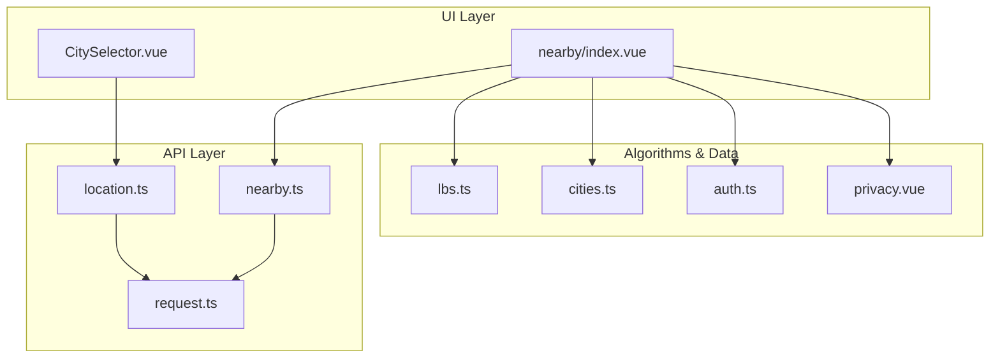
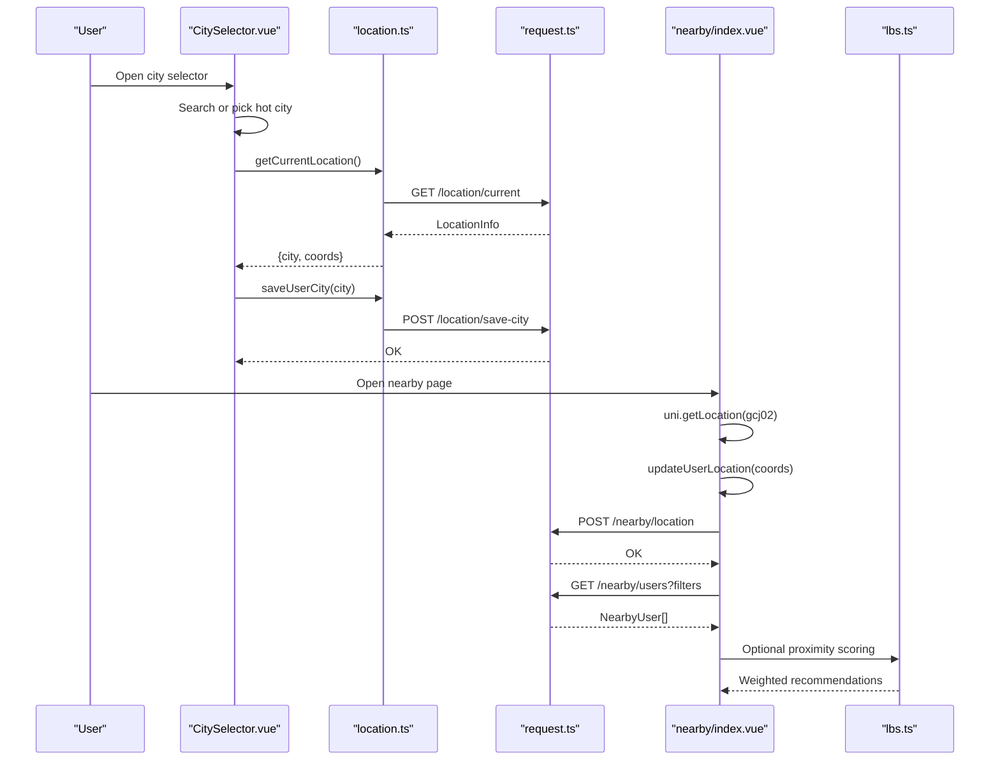
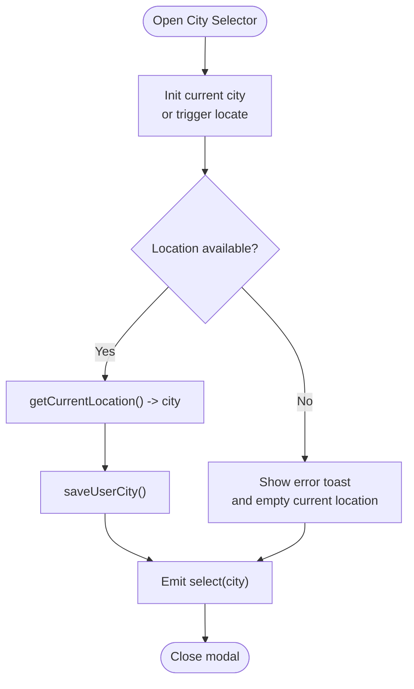
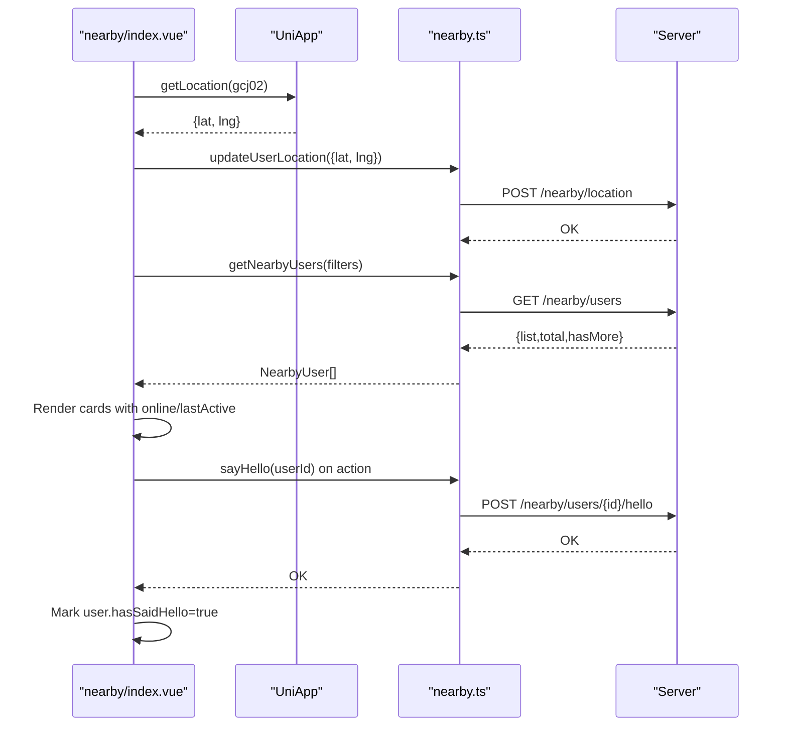
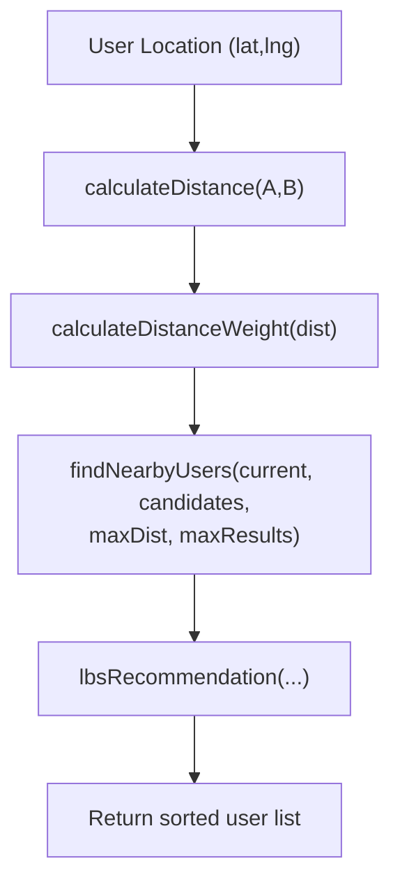
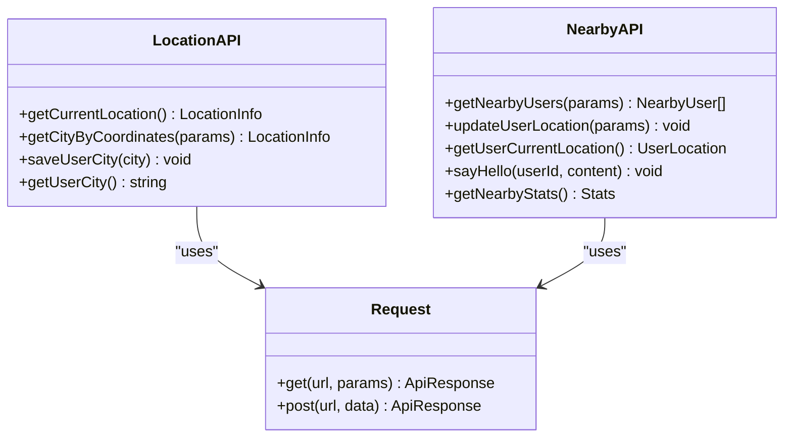
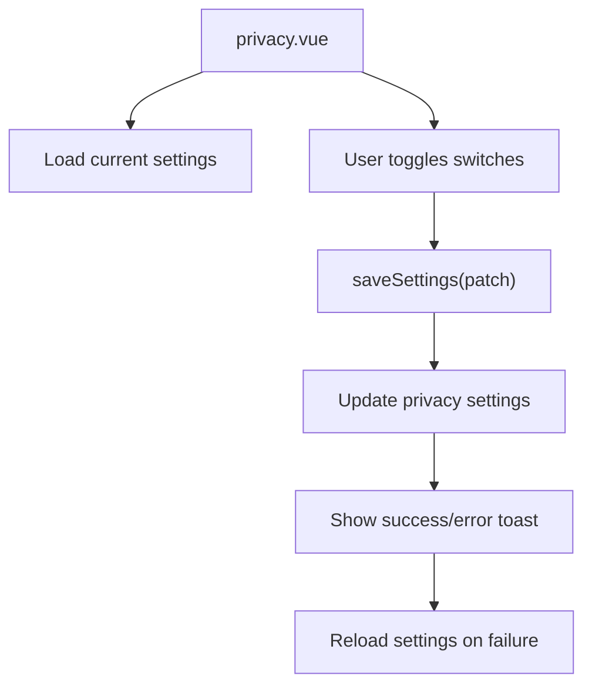
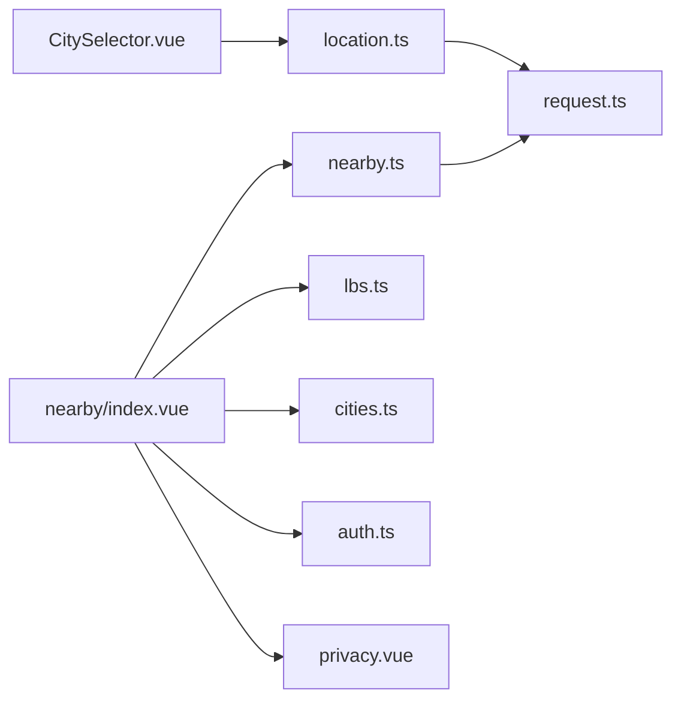

# Location Services

<cite>
**Referenced Files in This Document**
- [location.ts](file://src/api/modules/location.ts)
- [nearby.ts](file://src/api/modules/nearby.ts)
- [CitySelector.vue](file://src/components/business/CitySelector.vue)
- [cities.ts](file://src/constants/cities.ts)
- [index.vue](file://src/pages/nearby/index.vue)
- [lbs.ts](file://src/pages/tabbar/home/algorithms/lbs.ts)
- [useRecommendation.ts](file://src/pages/tabbar/home/composables/useRecommendation.ts)
- [request.ts](file://src/api/request.ts)
- [storage.ts](file://src/utils/storage.ts)
- [auth.ts](file://src/stores/auth.ts)
- [privacy.vue](file://src/pages/profile/privacy.vue)
- [settings.vue](file://src/pages/user/settings.vue)
</cite>

## Table of Contents
1. [Introduction](#introduction)
2. [Project Structure](#project-structure)
3. [Core Components](#core-components)
4. [Architecture Overview](#architecture-overview)
5. [Detailed Component Analysis](#detailed-component-analysis)
6. [Dependency Analysis](#dependency-analysis)
7. [Performance Considerations](#performance-considerations)
8. [Troubleshooting Guide](#troubleshooting-guide)
9. [Conclusion](#conclusion)

## Introduction
This document explains the WeTogether platform’s location services, focusing on city selection, nearby user discovery, and location-based content. It covers the city selector component, location data management, API endpoints for location services and nearby queries, state management for user locations and preferences, proximity calculations, and integration with recommendations. It also provides guidance on permissions, fallback mechanisms, privacy controls, accuracy, battery optimization, and recommendation integration.

## Project Structure
The location services span three layers:
- API module: location and nearby endpoints
- UI components: city selector and nearby users page
- Algorithms and composables: proximity math and recommendation integration

**Diagram sources**
- [CitySelector.vue:1-515](file://src/components/business/CitySelector.vue#L1-L515)
- [index.vue:1-762](file://src/pages/nearby/index.vue#L1-L762)
- [location.ts:1-46](file://src/api/modules/location.ts#L1-L46)
- [nearby.ts:1-96](file://src/api/modules/nearby.ts#L1-L96)
- [lbs.ts:1-381](file://src/pages/tabbar/home/algorithms/lbs.ts#L1-L381)
- [cities.ts:1-186](file://src/constants/cities.ts#L1-L186)
- [auth.ts:1-137](file://src/stores/auth.ts#L1-L137)
- [privacy.vue:1-305](file://src/pages/profile/privacy.vue#L1-L305)

**Section sources**
- [CitySelector.vue:1-515](file://src/components/business/CitySelector.vue#L1-L515)
- [index.vue:1-762](file://src/pages/nearby/index.vue#L1-L762)
- [location.ts:1-46](file://src/api/modules/location.ts#L1-L46)
- [nearby.ts:1-96](file://src/api/modules/nearby.ts#L1-L96)
- [lbs.ts:1-381](file://src/pages/tabbar/home/algorithms/lbs.ts#L1-L381)
- [cities.ts:1-186](file://src/constants/cities.ts#L1-L186)
- [auth.ts:1-137](file://src/stores/auth.ts#L1-L137)
- [privacy.vue:1-305](file://src/pages/profile/privacy.vue#L1-L305)

## Core Components
- City Selector: interactive modal for city selection, search, and current-location detection
- Nearby Users Page: lists users near the current location with filters, online indicators, and greeting actions
- Location APIs: current location retrieval, reverse geocoding, saving/restoring user city
- Proximity Algorithms: distance calculation, weighting, and grid-based indexing
- Recommendation Integration: LBS proximity integrated into recommendation feed composition

Key capabilities:
- City selection with search and hot cities
- Runtime location permission handling and fallbacks
- Distance filtering and sorting by proximity or activity
- Online/offline and last-active indicators
- Privacy controls for who sees personal info

**Section sources**
- [CitySelector.vue:118-258](file://src/components/business/CitySelector.vue#L118-L258)
- [index.vue:162-467](file://src/pages/nearby/index.vue#L162-L467)
- [location.ts:7-45](file://src/api/modules/location.ts#L7-L45)
- [nearby.ts:7-95](file://src/api/modules/nearby.ts#L7-L95)
- [lbs.ts:39-158](file://src/pages/tabbar/home/algorithms/lbs.ts#L39-L158)

## Architecture Overview
High-level flow for city selection and nearby discovery:

**Diagram sources**
- [CitySelector.vue:164-223](file://src/components/business/CitySelector.vue#L164-L223)
- [location.ts:19-45](file://src/api/modules/location.ts#L19-L45)
- [index.vue:250-281](file://src/pages/nearby/index.vue#L250-L281)
- [nearby.ts:41-73](file://src/api/modules/nearby.ts#L41-L73)
- [lbs.ts:357-380](file://src/pages/tabbar/home/algorithms/lbs.ts#L357-L380)

## Detailed Component Analysis

### City Selector Component
Responsibilities:
- Present hot cities and searchable city list
- Detect current location via native API and reverse geocode to city
- Save user-selected city to backend
- Provide keyboard navigation and quick jump by initial letter

Implementation highlights:
- Uses UniApp location API with gcj02 coordinates
- Handles permission denial and timeout gracefully
- Emits events for parent components to react to selections
- Integrates with city constants for search and grouping

**Diagram sources**
- [CitySelector.vue:164-223](file://src/components/business/CitySelector.vue#L164-L223)
- [location.ts:19-45](file://src/api/modules/location.ts#L19-L45)

**Section sources**
- [CitySelector.vue:118-258](file://src/components/business/CitySelector.vue#L118-L258)
- [cities.ts:138-186](file://src/constants/cities.ts#L138-L186)

### Nearby Users Feature
Responsibilities:
- Fetch nearby users filtered by distance, gender, and activity
- Update user location periodically
- Display online status and last active time
- Allow greeting with immediate UI feedback

Key logic:
- On mount, request device location and push to server
- Apply filters and pagination
- Format distance and last-active timestamps
- Parallelize stats and list loads on filter change

**Diagram sources**
- [index.vue:250-441](file://src/pages/nearby/index.vue#L250-L441)
- [nearby.ts:41-82](file://src/api/modules/nearby.ts#L41-L82)

**Section sources**
- [index.vue:162-467](file://src/pages/nearby/index.vue#L162-L467)
- [nearby.ts:7-95](file://src/api/modules/nearby.ts#L7-L95)

### Proximity Calculations and Recommendations
Capabilities:
- Haversine distance computation between two coordinates
- Distance-based weighting for recommendation blending
- Grid-based spatial indexing for scalable neighbor lookup
- Heatmap generation for density visualization

**Diagram sources**
- [lbs.ts:39-158](file://src/pages/tabbar/home/algorithms/lbs.ts#L39-L158)
- [lbs.ts:357-380](file://src/pages/tabbar/home/algorithms/lbs.ts#L357-L380)

**Section sources**
- [lbs.ts:39-158](file://src/pages/tabbar/home/algorithms/lbs.ts#L39-L158)
- [lbs.ts:250-297](file://src/pages/tabbar/home/algorithms/lbs.ts#L250-L297)

### Location Data Management and State
- Current location is captured via native API and stored in component state
- User location is persisted server-side and retrieved for recommendations
- City preference is saved per user and can be restored later
- Token-refresh flow ensures authenticated requests for protected endpoints

**Diagram sources**
- [location.ts:19-45](file://src/api/modules/location.ts#L19-L45)
- [nearby.ts:41-95](file://src/api/modules/nearby.ts#L41-L95)
- [request.ts:210-224](file://src/api/request.ts#L210-L224)

**Section sources**
- [index.vue:250-281](file://src/pages/nearby/index.vue#L250-L281)
- [location.ts:19-45](file://src/api/modules/location.ts#L19-L45)
- [nearby.ts:41-95](file://src/api/modules/nearby.ts#L41-L95)
- [request.ts:75-208](file://src/api/request.ts#L75-L208)

### Privacy Controls and Preferences
- Privacy settings page allows users to control information visibility and interaction permissions
- Switches enable/disable features like receiving greetings or being discoverable
- Changes are persisted to the backend and reflected immediately in UI

**Diagram sources**
- [privacy.vue:280-291](file://src/pages/profile/privacy.vue#L280-L291)
- [privacy.vue:231-248](file://src/pages/profile/privacy.vue#L231-L248)

**Section sources**
- [privacy.vue:189-228](file://src/pages/profile/privacy.vue#L189-L228)
- [privacy.vue:280-291](file://src/pages/profile/privacy.vue#L280-L291)

## Dependency Analysis
- UI depends on API modules for network operations
- API module depends on shared request client for HTTP transport
- Nearby page integrates with LBS algorithms for proximity scoring
- City selector depends on city constants for search and grouping
- Privacy settings integrate with user settings page

**Diagram sources**
- [CitySelector.vue:122-122](file://src/components/business/CitySelector.vue#L122-L122)
- [index.vue:164-165](file://src/pages/nearby/index.vue#L164-L165)
- [lbs.ts:1-381](file://src/pages/tabbar/home/algorithms/lbs.ts#L1-L381)
- [cities.ts:138-186](file://src/constants/cities.ts#L138-L186)
- [auth.ts:1-137](file://src/stores/auth.ts#L1-L137)
- [privacy.vue:1-305](file://src/pages/profile/privacy.vue#L1-L305)

**Section sources**
- [CitySelector.vue:118-123](file://src/components/business/CitySelector.vue#L118-L123)
- [index.vue:162-165](file://src/pages/nearby/index.vue#L162-L165)
- [lbs.ts:1-381](file://src/pages/tabbar/home/algorithms/lbs.ts#L1-L381)
- [cities.ts:138-186](file://src/constants/cities.ts#L138-L186)
- [auth.ts:1-137](file://src/stores/auth.ts#L1-L137)
- [privacy.vue:1-305](file://src/pages/profile/privacy.vue#L1-L305)

## Performance Considerations
- Minimize repeated location requests; cache current coordinates while session is active
- Use grid-based indexing for large-scale proximity queries to reduce compute
- Debounce search input in city selector to avoid excessive API calls
- Batch UI updates after network responses to prevent layout thrashing
- Prefer lightweight distance formatting and avoid heavy computations on scroll

## Troubleshooting Guide
Common issues and resolutions:
- Location permission denied
  - Trigger explicit prompt and fall back to default coordinates
  - Show user-friendly toast and guide to settings
- Location timeout or failure
  - Retry once, then use default city or previous saved city
  - Log error context for diagnostics
- Network errors
  - Distinguish between network failures and API error codes
  - Provide retry prompts and degrade gracefully
- Token expiration during location-sensitive requests
  - Refresh tokens transparently; reissue pending request

Operational checks:
- Verify API base URL and timeouts
- Confirm storage persistence for tokens and user settings
- Ensure proper error toast messaging and user feedback

**Section sources**
- [CitySelector.vue:182-201](file://src/components/business/CitySelector.vue#L182-L201)
- [index.vue:264-281](file://src/pages/nearby/index.vue#L264-L281)
- [request.ts:100-148](file://src/api/request.ts#L100-L148)
- [privacy.vue:231-248](file://src/pages/profile/privacy.vue#L231-L248)

## Conclusion
WeTogether’s location services combine a robust city selector, precise nearby discovery, and scalable proximity algorithms. The system balances user privacy with discoverability, handles permission and network challenges gracefully, and integrates location-aware recommendations. By following the documented patterns for state management, error handling, and performance, teams can extend and maintain location features effectively.