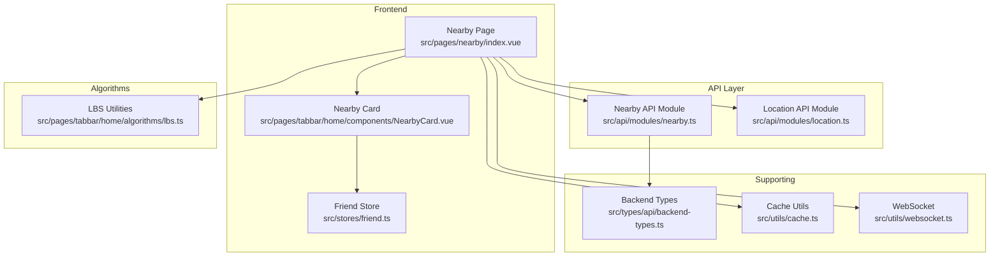
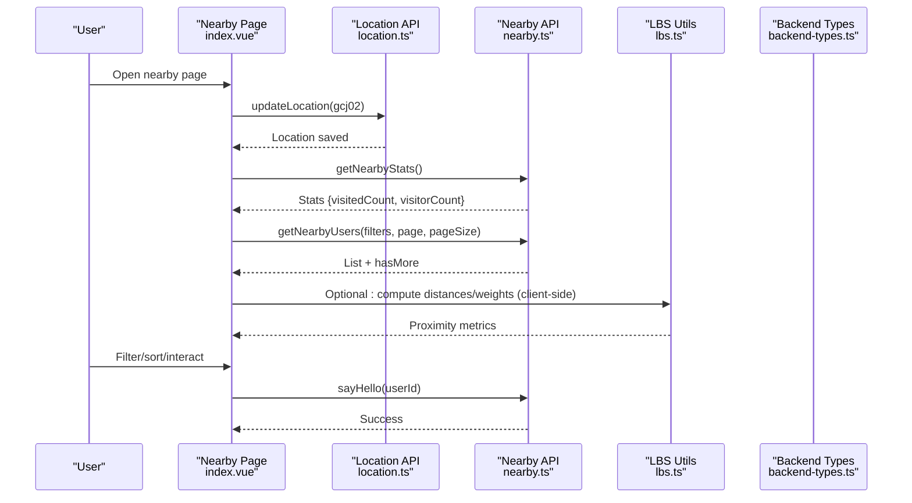
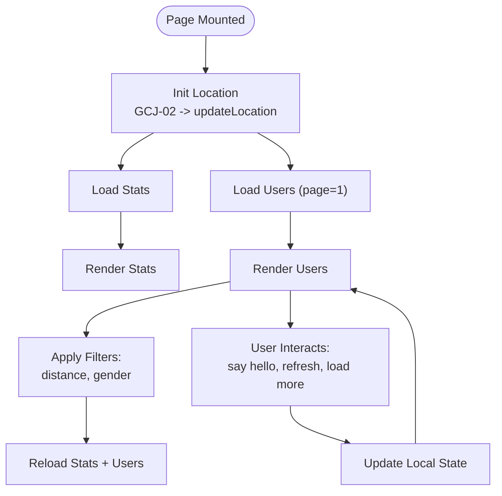
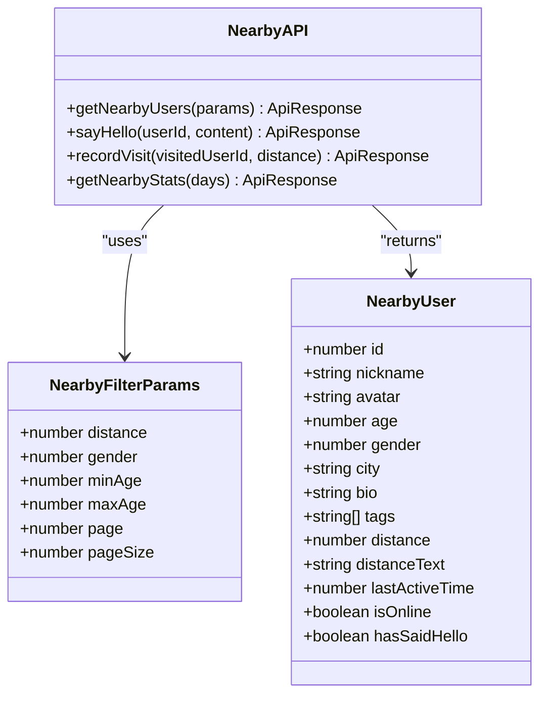
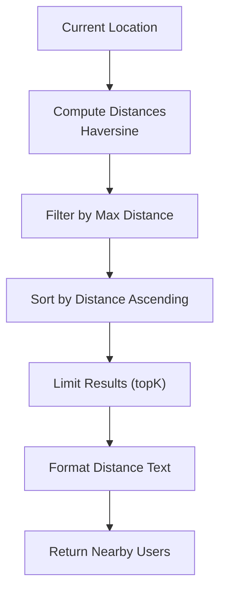
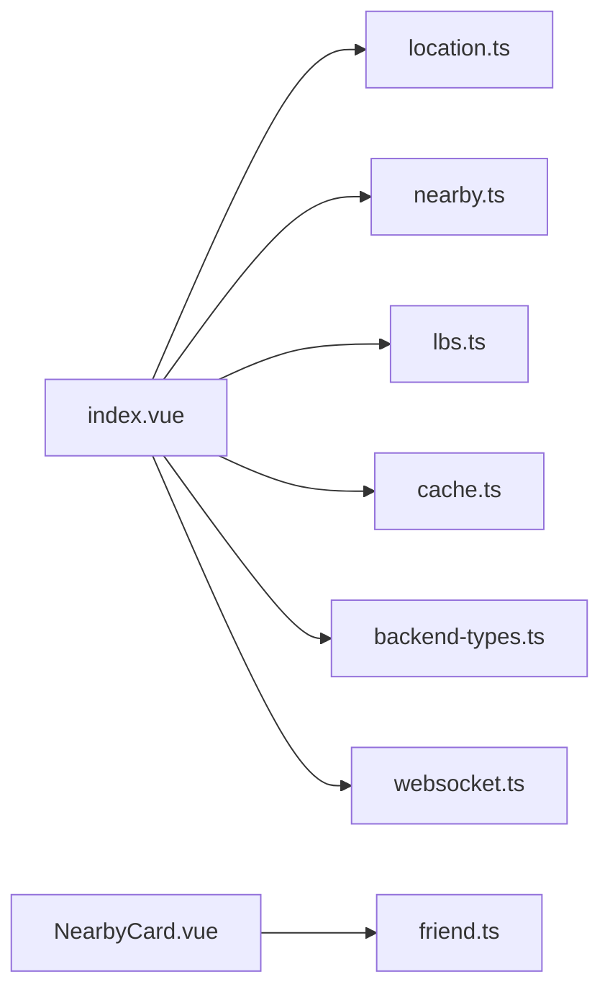

# Nearby Users Discovery

<cite>
**Referenced Files in This Document**
- [index.vue](file://src/pages/nearby/index.vue)
- [nearby.ts](file://src/api/modules/nearby.ts)
- [location.ts](file://src/api/modules/location.ts)
- [lbs.ts](file://src/pages/tabbar/home/algorithms/lbs.ts)
- [backend-types.ts](file://src/types/api/backend-types.ts)
- [cache.ts](file://src/utils/cache.ts)
- [friend.ts](file://src/stores/friend.ts)
- [websocket.ts](file://src/utils/websocket.ts)
- [NearbyCard.vue](file://src/pages/tabbar/home/components/NearbyCard.vue)
- [NearbyCard.refactored.vue](file://src/pages/tabbar/home/components/NearbyCard.refactored.vue)
</cite>

## Table of Contents
1. [Introduction](#introduction)
2. [Project Structure](#project-structure)
3. [Core Components](#core-components)
4. [Architecture Overview](#architecture-overview)
5. [Detailed Component Analysis](#detailed-component-analysis)
6. [Dependency Analysis](#dependency-analysis)
7. [Performance Considerations](#performance-considerations)
8. [Troubleshooting Guide](#troubleshooting-guide)
9. [Conclusion](#conclusion)

## Introduction
This document explains the nearby users discovery system, covering the APIs for fetching nearby users, distance calculation algorithms, filtering criteria, the nearby page implementation, integration with the friend store, and practical examples for proximity-based discovery, distance-based sorting, and real-time updates. It also addresses performance optimization, caching strategies, and location accuracy handling.

## Project Structure
The nearby system spans three main areas:
- Frontend page: renders the nearby UI, handles filters, pagination, and user interactions.
- API module: defines typed requests for nearby users, stats, greetings, and location updates.
- Algorithms: provides distance computation and spatial indexing utilities for proximity-based discovery.

**Diagram sources**
- [index.vue:140-417](file://src/pages/nearby/index.vue#L140-L417)
- [nearby.ts:1-82](file://src/api/modules/nearby.ts#L1-L82)
- [location.ts:1-79](file://src/api/modules/location.ts#L1-L79)
- [lbs.ts:1-380](file://src/pages/tabbar/home/algorithms/lbs.ts#L1-L380)
- [backend-types.ts:1-764](file://src/types/api/backend-types.ts#L1-L764)
- [cache.ts:1-359](file://src/utils/cache.ts#L1-L359)
- [websocket.ts:1-171](file://src/utils/websocket.ts#L1-L171)
- [NearbyCard.vue:1-234](file://src/pages/tabbar/home/components/NearbyCard.vue#L1-L234)
- [friend.ts:1-70](file://src/stores/friend.ts#L1-L70)

**Section sources**
- [index.vue:1-712](file://src/pages/nearby/index.vue#L1-L712)
- [nearby.ts:1-82](file://src/api/modules/nearby.ts#L1-L82)
- [location.ts:1-79](file://src/api/modules/location.ts#L1-L79)
- [lbs.ts:1-380](file://src/pages/tabbar/home/algorithms/lbs.ts#L1-L380)
- [backend-types.ts:1-764](file://src/types/api/backend-types.ts#L1-L764)
- [cache.ts:1-359](file://src/utils/cache.ts#L1-L359)
- [websocket.ts:1-171](file://src/utils/websocket.ts#L1-L171)
- [NearbyCard.vue:1-234](file://src/pages/tabbar/home/components/NearbyCard.vue#L1-L234)
- [friend.ts:1-70](file://src/stores/friend.ts#L1-L70)

## Core Components
- Nearby page controller: orchestrates location initialization, stats and user list loading, filtering, pagination, and user actions.
- Nearby API module: typed endpoints for fetching nearby users, greeting, visiting, and stats.
- Location API module: updates and retrieves user location, city, and visibility.
- LBS utilities: distance calculation, distance weighting, bounding box, grid-based spatial indexing, and recommendation pipeline.
- Backend types: shared response and entity types for nearby users and filters.
- Cache utilities: in-memory and persistent caches for performance.
- Friend store: manages friend-related state and operations (integration point for nearby relationships).
- WebSocket: real-time connectivity for messaging and potential presence updates.

**Section sources**
- [index.vue:140-417](file://src/pages/nearby/index.vue#L140-L417)
- [nearby.ts:1-82](file://src/api/modules/nearby.ts#L1-L82)
- [location.ts:1-79](file://src/api/modules/location.ts#L1-L79)
- [lbs.ts:1-380](file://src/pages/tabbar/home/algorithms/lbs.ts#L1-L380)
- [backend-types.ts:1-764](file://src/types/api/backend-types.ts#L1-L764)
- [cache.ts:1-359](file://src/utils/cache.ts#L1-L359)
- [friend.ts:1-70](file://src/stores/friend.ts#L1-L70)
- [websocket.ts:1-171](file://src/utils/websocket.ts#L1-L171)

## Architecture Overview
The nearby discovery flow integrates frontend UI, typed API calls, spatial algorithms, and optional real-time features.

**Diagram sources**
- [index.vue:202-313](file://src/pages/nearby/index.vue#L202-L313)
- [location.ts:32-34](file://src/api/modules/location.ts#L32-L34)
- [nearby.ts:41-81](file://src/api/modules/nearby.ts#L41-L81)
- [lbs.ts:39-158](file://src/pages/tabbar/home/algorithms/lbs.ts#L39-L158)
- [backend-types.ts:4-9](file://src/types/api/backend-types.ts#L4-L9)

## Detailed Component Analysis

### Nearby Page (index.vue)
Responsibilities:
- Initialize device location via GCJ-02 and persist to server.
- Load stats and user list concurrently.
- Apply filters: distance range and gender.
- Paginate results and refresh on pull-down.
- Render user cards with avatar, online/offline, activity time, distance text, and greeting button.
- Handle greeting action and local state updates.

Key behaviors:
- Location fallback to Beijing coordinates if permission denied or errors occur.
- Parallel loading of stats and user list after filter changes.
- Greeting prevents duplicate sends and updates UI immediately.

**Diagram sources**
- [index.vue:202-313](file://src/pages/nearby/index.vue#L202-L313)
- [index.vue:322-391](file://src/pages/nearby/index.vue#L322-L391)

**Section sources**
- [index.vue:140-417](file://src/pages/nearby/index.vue#L140-L417)

### Nearby API Module (nearby.ts)
Endpoints and types:
- Fetch nearby users: GET /nearby/users with query params for distance, gender, minAge, maxAge, page, pageSize.
- Say hello: POST /nearby/users/:id/hello.
- Record visit: POST /nearby/visit.
- Get stats: GET /nearby/stats.

Data model:
- NearbyUser includes numeric distance (meters) and formatted distanceText, lastActiveTime, isOnline, and optional greeting flag.

**Diagram sources**
- [nearby.ts:7-81](file://src/api/modules/nearby.ts#L7-L81)
- [backend-types.ts:4-9](file://src/types/api/backend-types.ts#L4-L9)

**Section sources**
- [nearby.ts:1-82](file://src/api/modules/nearby.ts#L1-L82)
- [backend-types.ts:1-764](file://src/types/api/backend-types.ts#L1-L764)

### Location API Module (location.ts)
Capabilities:
- Update user location with GCJ-02 coordinates.
- Retrieve current location.
- Geocode coordinates to city info.
- Save user-selected city and visibility controls.

Integration:
- The nearby page calls updateLocation during init and falls back to default coordinates on failure.

**Section sources**
- [location.ts:1-79](file://src/api/modules/location.ts#L1-L79)
- [index.vue:214-244](file://src/pages/nearby/index.vue#L214-L244)

### LBS Distance and Proximity Utilities (lbs.ts)
Algorithms:
- Haversine formula for accurate earth-distance between two lat/lon pairs.
- Distance weighting function for proximity scoring.
- Distance formatting for human-readable strings.
- Bounding box calculation for spatial queries.
- Grid-based spatial indexing to reduce search space.
- Recommendation pipeline combining filters and sorting.

**Diagram sources**
- [lbs.ts:39-158](file://src/pages/tabbar/home/algorithms/lbs.ts#L39-L158)

**Section sources**
- [lbs.ts:1-380](file://src/pages/tabbar/home/algorithms/lbs.ts#L1-L380)

### Nearby Card Components
- NearbyCard.vue: renders a single user card with avatar, name/age, city, bio, photo grid, and action buttons (skip/like).
- NearbyCard.refactored.vue: refactored variant using a base card component with gradient border and simplified props/events.

These components integrate with the friend store for follow/unfollow state synchronization via an event bus hook.

**Section sources**
- [NearbyCard.vue:1-234](file://src/pages/tabbar/home/components/NearbyCard.vue#L1-L234)
- [NearbyCard.refactored.vue:1-56](file://src/pages/tabbar/home/components/NearbyCard.refactored.vue#L1-L56)

### Friend Store Integration
- Provides friend lists, follow/unlock/delete/block operations, and friendship status checks.
- Integrates with event bus to synchronize follow state across lists/cards.

Note: While the nearby page does not directly call friend store methods, the card components and other parts of the app use the friend store for relationship management.

**Section sources**
- [friend.ts:1-70](file://src/stores/friend.ts#L1-L70)

## Dependency Analysis
- The nearby page depends on:
  - Location API for positioning.
  - Nearby API for user discovery and greeting.
  - LBS utilities for client-side distance computations (optional).
  - Cache utilities for performance (optional).
  - WebSocket for real-time features (optional).
  - Backend types for typing.

**Diagram sources**
- [index.vue:140-417](file://src/pages/nearby/index.vue#L140-L417)
- [nearby.ts:1-82](file://src/api/modules/nearby.ts#L1-L82)
- [location.ts:1-79](file://src/api/modules/location.ts#L1-L79)
- [lbs.ts:1-380](file://src/pages/tabbar/home/algorithms/lbs.ts#L1-L380)
- [cache.ts:1-359](file://src/utils/cache.ts#L1-L359)
- [backend-types.ts:1-764](file://src/types/api/backend-types.ts#L1-L764)
- [websocket.ts:1-171](file://src/utils/websocket.ts#L1-L171)
- [NearbyCard.vue:1-234](file://src/pages/tabbar/home/components/NearbyCard.vue#L1-L234)
- [friend.ts:1-70](file://src/stores/friend.ts#L1-L70)

**Section sources**
- [index.vue:140-417](file://src/pages/nearby/index.vue#L140-L417)
- [nearby.ts:1-82](file://src/api/modules/nearby.ts#L1-L82)
- [location.ts:1-79](file://src/api/modules/location.ts#L1-L79)
- [lbs.ts:1-380](file://src/pages/tabbar/home/algorithms/lbs.ts#L1-L380)
- [cache.ts:1-359](file://src/utils/cache.ts#L1-L359)
- [backend-types.ts:1-764](file://src/types/api/backend-types.ts#L1-L764)
- [websocket.ts:1-171](file://src/utils/websocket.ts#L1-L171)
- [NearbyCard.vue:1-234](file://src/pages/tabbar/home/components/NearbyCard.vue#L1-L234)
- [friend.ts:1-70](file://src/stores/friend.ts#L1-L70)

## Performance Considerations
- Client-side vs server-side sorting:
  - The frontend supports distance-based sorting locally; however, the backend endpoint does not accept a sort parameter. Prefer server-side filtering and pagination to minimize payload sizes.
- Pagination:
  - Use page/pageSize consistently to avoid large payloads and enable incremental loading.
- Spatial indexing:
  - Use bounding boxes and grid-based indexing to reduce candidate sets before distance calculations.
- Caching:
  - Cache nearby user lists per page and per filter combination with short TTLs (e.g., minutes) to reduce network calls.
  - Persist frequently accessed metadata (e.g., user avatars) to storage cache for offline resilience.
- Network robustness:
  - Implement retry/backoff for failed requests and show user-friendly messages.
- Rendering:
  - Virtualize long lists and lazy-load images to improve scroll performance.

[No sources needed since this section provides general guidance]

## Troubleshooting Guide
Common issues and resolutions:
- Location permission denied:
  - The page shows a toast and falls back to default coordinates. Ensure the app requests GCJ-02 location and handles denial gracefully.
- Network failures:
  - The page displays contextual toasts for network errors and avoids repeated requests by guarding loading flags.
- Empty results:
  - Suggest adjusting filters (distance/gender) and refreshing.

Operational tips:
- Verify that updateLocation is called before requesting nearby users.
- Confirm that the backend accepts GCJ-02 coordinates and returns distanceText and lastActiveTime as expected.

**Section sources**
- [index.vue:214-244](file://src/pages/nearby/index.vue#L214-L244)
- [index.vue:256-298](file://src/pages/nearby/index.vue#L256-L298)
- [location.ts:32-34](file://src/api/modules/location.ts#L32-L34)

## Conclusion
The nearby users discovery system combines a responsive UI, typed API integrations, and spatial algorithms to deliver proximity-based user discovery. By leveraging server-side filtering, pagination, and optional client-side distance computations, it balances accuracy and performance. Caching and robust error handling further enhance reliability, while integration points with the friend store and WebSocket support future enhancements for social and real-time features.