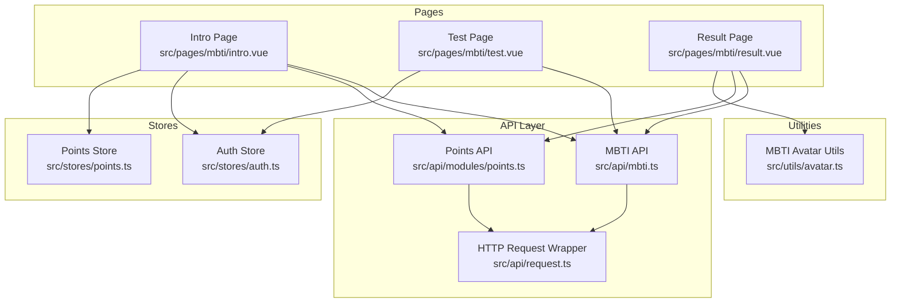
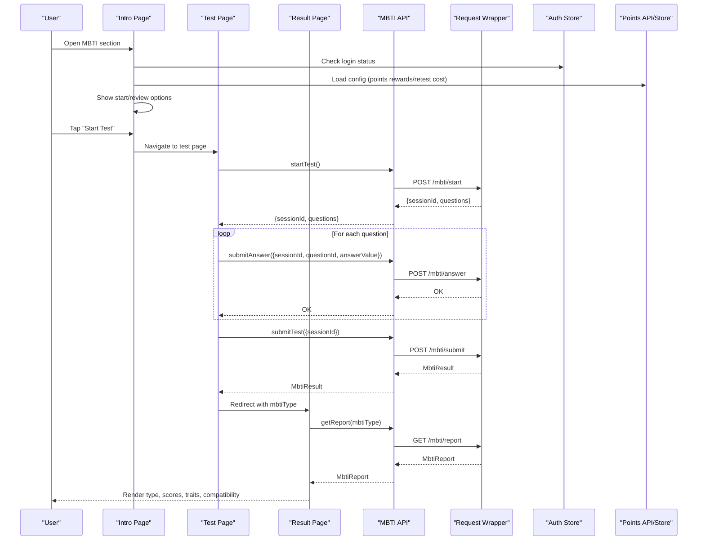
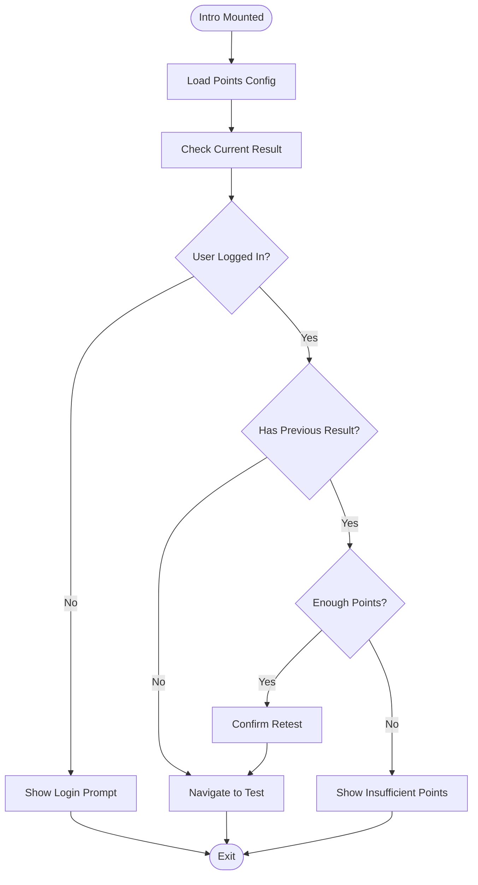
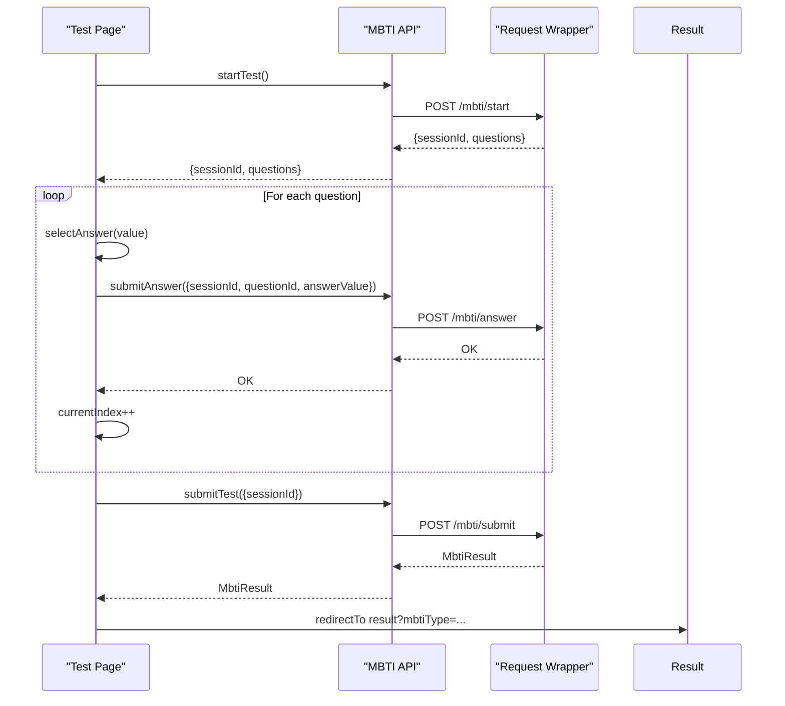
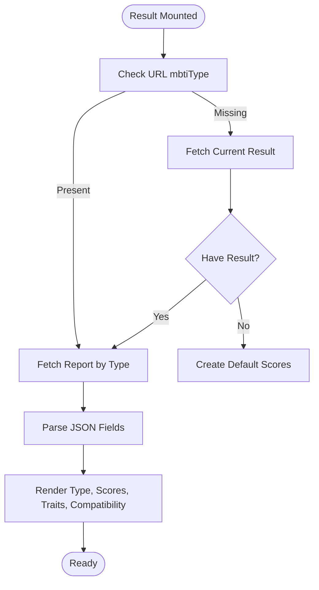
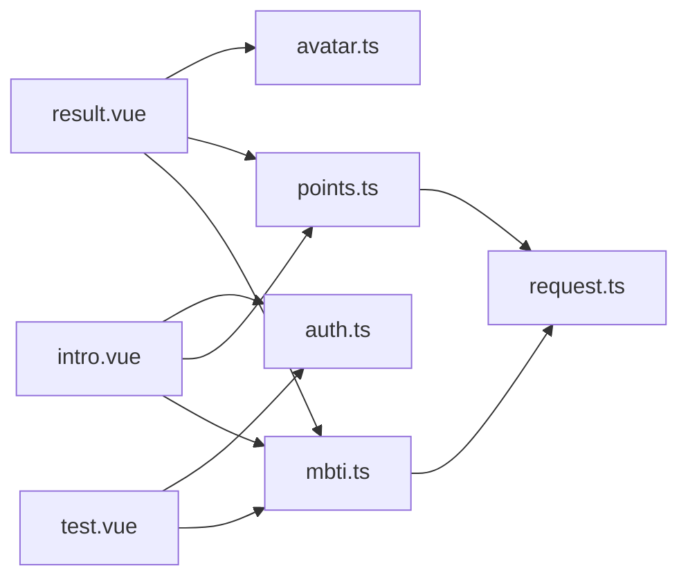

# MBTI Personality Test

<cite>
**Referenced Files in This Document**
- [intro.vue](file://src/pages/mbti/intro.vue)
- [test.vue](file://src/pages/mbti/test.vue)
- [result.vue](file://src/pages/mbti/result.vue)
- [mbti.ts](file://src/api/mbti.ts)
- [request.ts](file://src/api/request.ts)
- [points.ts](file://src/api/modules/points.ts)
- [auth.ts](file://src/stores/auth.ts)
- [points-store.ts](file://src/stores/points.ts)
- [avatar.ts](file://src/utils/avatar.ts)
</cite>

## Table of Contents
1. [Introduction](#introduction)
2. [Project Structure](#project-structure)
3. [Core Components](#core-components)
4. [Architecture Overview](#architecture-overview)
5. [Detailed Component Analysis](#detailed-component-analysis)
6. [Dependency Analysis](#dependency-analysis)
7. [Performance Considerations](#performance-considerations)
8. [Troubleshooting Guide](#troubleshooting-guide)
9. [Conclusion](#conclusion)
10. [Appendices](#appendices)

## Introduction
This document describes the MBTI personality test system implemented in the WeTogether platform. It covers the test introduction page, question presentation, answer collection, result calculation, and result visualization. It also documents state management for test progress, user answers, and final results, along with the test interface components, progress indicators, and result analytics. Finally, it provides examples for test customization, result sharing, and personality insights integration, and addresses test validity, scoring accuracy, and analytics.

## Project Structure
The MBTI system consists of three primary pages and supporting APIs and stores:
- Introduction page: Presents test overview, dimensions, tips, and entry points to start or review results.
- Test page: Loads questions, collects answers, submits answers progressively, and computes final results.
- Result page: Displays MBTI type, description, dimension scores, traits, strengths, weaknesses, careers, compatibility, and sharing actions.

**Diagram sources**
- [intro.vue:1-180](file://src/pages/mbti/intro.vue#L1-L180)
- [test.vue:1-192](file://src/pages/mbti/test.vue#L1-L192)
- [result.vue:1-364](file://src/pages/mbti/result.vue#L1-L364)
- [mbti.ts:1-84](file://src/api/mbti.ts#L1-L84)
- [request.ts:1-228](file://src/api/request.ts#L1-L228)
- [points.ts:1-55](file://src/api/modules/points.ts#L1-L55)
- [auth.ts:1-137](file://src/stores/auth.ts#L1-L137)
- [points-store.ts:1-72](file://src/stores/points.ts#L1-L72)
- [avatar.ts:1-36](file://src/utils/avatar.ts#L1-L36)

**Section sources**
- [intro.vue:1-180](file://src/pages/mbti/intro.vue#L1-L180)
- [test.vue:1-192](file://src/pages/mbti/test.vue#L1-L192)
- [result.vue:1-364](file://src/pages/mbti/result.vue#L1-L364)
- [mbti.ts:1-84](file://src/api/mbti.ts#L1-L84)
- [request.ts:1-228](file://src/api/request.ts#L1-L228)
- [points.ts:1-55](file://src/api/modules/points.ts#L1-L55)
- [auth.ts:1-137](file://src/stores/auth.ts#L1-L137)
- [points-store.ts:1-72](file://src/stores/points.ts#L1-L72)
- [avatar.ts:1-36](file://src/utils/avatar.ts#L1-L36)

## Core Components
- MBTI API module defines typed interfaces for questions, answers, results, and reports, and exposes endpoints for starting tests, submitting answers, submitting tests, retrieving reports, current results, history, and sharing.
- HTTP request wrapper centralizes authentication, token refresh, and error handling.
- Points API and stores manage points configuration, balance, and logs, enabling reward/retest mechanics.
- Auth store manages user session and login state.
- Avatar utilities provide MBTI type-to-avatar mapping for result visualization.

Key responsibilities:
- Question and answer model: MbtiQuestion, MbtiAnswer
- Result model: MbtiResult with four dimension scores
- Report model: MbtiReport with traits, strengths, weaknesses, careers, compatibility, avatarUrl, themeColor
- API surface: startTest, submitAnswer, submitTest, getReport, getCurrentResult, getHistory, shareToSquare

**Section sources**
- [mbti.ts:3-46](file://src/api/mbti.ts#L3-L46)
- [mbti.ts:48-83](file://src/api/mbti.ts#L48-L83)
- [request.ts:15-24](file://src/api/request.ts#L15-L24)
- [request.ts:75-208](file://src/api/request.ts#L75-L208)
- [points.ts:32-54](file://src/api/modules/points.ts#L32-L54)
- [auth.ts:9-137](file://src/stores/auth.ts#L9-L137)
- [avatar.ts:5-36](file://src/utils/avatar.ts#L5-L36)

## Architecture Overview
The MBTI system follows a layered architecture:
- Presentation layer: Vue Single File Components for intro, test, and result pages
- API layer: Typed endpoints for MBTI operations and points configuration
- Data layer: Stores for auth and points, plus utilities for avatar mapping
- Network layer: Centralized request wrapper with token refresh and error handling

**Diagram sources**
- [intro.vue:95-173](file://src/pages/mbti/intro.vue#L95-L173)
- [test.vue:87-191](file://src/pages/mbti/test.vue#L87-L191)
- [result.vue:235-306](file://src/pages/mbti/result.vue#L235-L306)
- [mbti.ts:48-83](file://src/api/mbti.ts#L48-L83)
- [request.ts:75-208](file://src/api/request.ts#L75-L208)
- [auth.ts:16-16](file://src/stores/auth.ts#L16-L16)
- [points.ts:49-54](file://src/api/modules/points.ts#L49-L54)

## Detailed Component Analysis

### Introduction Page (Test Entry)
Responsibilities:
- Display MBTI overview, dimensions, and tips
- Show user points badge when logged in
- Load points configuration for rewards and retest costs
- Check if the user has a current result
- Navigate to test or result pages based on conditions

Key behaviors:
- On mount, fetch points configuration and user balance
- If user has a result, enable “View my result”
- Enforce login requirement for starting tests
- Enforce retest cost check when retesting

**Diagram sources**
- [intro.vue:95-173](file://src/pages/mbti/intro.vue#L95-L173)

**Section sources**
- [intro.vue:81-180](file://src/pages/mbti/intro.vue#L81-L180)
- [points.ts:49-54](file://src/api/modules/points.ts#L49-L54)
- [auth.ts:16-16](file://src/stores/auth.ts#L16-L16)

### Test Page (Question Presentation and Answer Collection)
Responsibilities:
- Initialize test session and load questions
- Present one question at a time with five-point scale options
- Track current index, selected answer, and persisted answers
- Submit answers progressively and compute final result
- Navigate to result page upon completion

State management:
- sessionId: server-assigned session identifier
- questions: loaded question set
- answers: Map of questionId -> answerValue
- currentIndex: current question index
- currentAnswer: selected answer for current question
- isSubmitting: guard against concurrent submissions

Progress indicator:
- Progress bar width and textual counter based on currentIndex and total questions

Answer options:
- Five-point scale mapped to values 1..5 with labels indicating A/B sides

Submission flow:
- Save current answer to answers map
- Submit answer to server
- Advance to next question or submit test on last question

**Diagram sources**
- [test.vue:87-191](file://src/pages/mbti/test.vue#L87-L191)
- [mbti.ts:48-83](file://src/api/mbti.ts#L48-L83)
- [request.ts:75-208](file://src/api/request.ts#L75-L208)

**Section sources**
- [test.vue:52-192](file://src/pages/mbti/test.vue#L52-L192)
- [mbti.ts:3-28](file://src/api/mbti.ts#L3-L28)

### Result Page (Calculation and Visualization)
Responsibilities:
- Load result by URL parameter or current result
- Fetch report for the MBTI type
- Parse JSON-encoded arrays and objects in report
- Render MBTI type, avatar placeholder or image, description, dimension scores, traits, strengths, weaknesses, careers, compatibility, and actions

Dimension score visualization:
- Four score bars for EI, SN, TF, JP
- Positive/negative scores shift fill direction and color
- Center marker indicates neutral midpoint

Actions:
- Share to Square
- Retest (with cost prompt)

**Diagram sources**
- [result.vue:225-306](file://src/pages/mbti/result.vue#L225-L306)

**Section sources**
- [result.vue:215-364](file://src/pages/mbti/result.vue#L215-L364)
- [mbti.ts:30-46](file://src/api/mbti.ts#L30-L46)
- [avatar.ts:5-36](file://src/utils/avatar.ts#L5-L36)

### API and Data Models
Typed interfaces define the contract between frontend and backend:
- MbtiQuestion: id, dimension, direction, content, optionA, optionB
- MbtiAnswer: questionId, answerValue
- MbtiResult: mbtiType, four dimension scores, sessionId, isCurrent, timestamps
- MbtiReport: mbtiType, typeName, description, characteristics[], strengths[], weaknesses[], careers[], relationships, compatibility{best, good, challenging}, avatarUrl, themeColor

Endpoints:
- POST /mbti/start: returns {sessionId, questions}
- POST /mbti/answer: submit single answer
- POST /mbti/submit: finalize test and return MbtiResult
- GET /mbti/report: retrieve report by type
- GET /mbti/current: retrieve current result
- GET /mbti/history: retrieve history
- POST /mbti/share: share result to Square

**Section sources**
- [mbti.ts:3-46](file://src/api/mbti.ts#L3-L46)
- [mbti.ts:48-83](file://src/api/mbti.ts#L48-L83)

### State Management
- Auth store: token, refresh token, user info, login/logout, refresh access token
- Points store: balance, sign status, logs, and methods to fetch and update them
- Points API: getBalance, getConfigList, getSignStatus, getLogs

Integration:
- Intro page reads points configuration and user balance
- Result page triggers share action via points API wrapper

**Section sources**
- [auth.ts:9-137](file://src/stores/auth.ts#L9-L137)
- [points-store.ts:1-72](file://src/stores/points.ts#L1-L72)
- [points.ts:32-54](file://src/api/modules/points.ts#L32-L54)

## Dependency Analysis
The MBTI system exhibits clean separation of concerns:
- Pages depend on API module and stores
- API module depends on request wrapper
- Request wrapper handles authentication and token refresh
- Stores encapsulate state and side effects
- Utilities provide deterministic mappings

**Diagram sources**
- [intro.vue:81-86](file://src/pages/mbti/intro.vue#L81-L86)
- [test.vue:53-54](file://src/pages/mbti/test.vue#L53-L54)
- [result.vue:216-218](file://src/pages/mbti/result.vue#L216-L218)
- [mbti.ts:1-1](file://src/api/mbti.ts#L1-L1)
- [request.ts:1-1](file://src/api/request.ts#L1-L1)
- [points.ts:1-1](file://src/api/modules/points.ts#L1-L1)
- [auth.ts:1-1](file://src/stores/auth.ts#L1-L1)
- [avatar.ts:1-1](file://src/utils/avatar.ts#L1-L1)

**Section sources**
- [intro.vue:81-86](file://src/pages/mbti/intro.vue#L81-L86)
- [test.vue:53-54](file://src/pages/mbti/test.vue#L53-L54)
- [result.vue:216-218](file://src/pages/mbti/result.vue#L216-L218)
- [mbti.ts:1-1](file://src/api/mbti.ts#L1-L1)
- [request.ts:1-1](file://src/api/request.ts#L1-L1)
- [points.ts:1-1](file://src/api/modules/points.ts#L1-L1)
- [auth.ts:1-1](file://src/stores/auth.ts#L1-L1)
- [avatar.ts:1-1](file://src/utils/avatar.ts#L1-L1)

## Performance Considerations
- Progressive submission: Answers are submitted immediately after selection, reducing server load and enabling real-time feedback.
- Local state caching: Answers are cached locally in a Map keyed by questionId, minimizing network round trips.
- Minimal DOM updates: Progress bar and score bars use reactive computed values to update efficiently.
- Image fallback: Avatar placeholders prevent layout shifts and improve perceived performance.
- Token refresh queue: Request wrapper queues requests during token refresh to avoid redundant refresh attempts.

[No sources needed since this section provides general guidance]

## Troubleshooting Guide
Common issues and resolutions:
- Network failures: The request wrapper displays toast messages and rejects promises; ensure network connectivity and token validity.
- Unauthorized access: On 401, the request wrapper refreshes tokens or navigates to login; verify stored tokens.
- Loading errors: Intro and Result pages show modals with error messages; check backend endpoints availability.
- Image loading failures: Result page handles image errors gracefully and shows a toast.

**Section sources**
- [request.ts:175-189](file://src/api/request.ts#L175-L189)
- [request.ts:100-148](file://src/api/request.ts#L100-L148)
- [intro.vue:99-109](file://src/pages/mbti/intro.vue#L99-L109)
- [result.vue:295-306](file://src/pages/mbti/result.vue#L295-L306)

## Conclusion
The MBTI personality test system integrates a clean, modular architecture with strong typing, robust state management, and user-centric UX. It supports progressive answer submission, immediate progress feedback, and comprehensive result visualization with personality insights. The system’s design enables easy extension for customization, analytics, and integrations.

[No sources needed since this section summarizes without analyzing specific files]

## Appendices

### Scoring Methodology and Classification
- Scoring: Each answer contributes to four dimensions (EI, SN, TF, JP). The backend aggregates answers and produces normalized scores per dimension.
- Classification: Final MBTI type is derived from the combination of dimension polarities (e.g., E/I, S/N, T/F, J/P).
- Dimension interpretation: Positive scores favor the right-side trait; negative scores favor the left-side trait; zero indicates neutrality.

Validation and accuracy:
- Ensure consistent answer weighting across questions.
- Normalize scores to comparable scales for fair comparison.
- Provide confidence bands or variance metrics for robust interpretation.

Analytics:
- Track completion rates, average time per question, and retest frequency.
- Analyze distribution of types and dimension scores.
- Monitor engagement with traits, strengths, and compatibility sections.

**Section sources**
- [mbti.ts:17-28](file://src/api/mbti.ts#L17-L28)
- [result.vue:30-107](file://src/pages/mbti/result.vue#L30-L107)

### Test Customization Examples
- Question bank: Extend MbtiQuestion with metadata (category, difficulty) for adaptive testing.
- Weighted scoring: Add weights per question to emphasize dimension relevance.
- Conditional branching: Use question metadata to branch to specialized sub-tests.
- Dynamic options: Allow dynamic option labels based on user profile.

**Section sources**
- [mbti.ts:3-10](file://src/api/mbti.ts#L3-L10)
- [test.vue:63-69](file://src/pages/mbti/test.vue#L63-L69)

### Result Sharing and Insights Integration
- Sharing: Use the share endpoint to publish results to the public square with a success modal and navigation.
- Insights: Integrate compatibility suggestions, career recommendations, and relationship advice from MbtiReport.
- Personalization: Use avatar mapping to render personalized avatars aligned with MBTI themes.

**Section sources**
- [mbti.ts:79-83](file://src/api/mbti.ts#L79-L83)
- [result.vue:308-340](file://src/pages/mbti/result.vue#L308-L340)
- [avatar.ts:5-36](file://src/utils/avatar.ts#L5-L36)