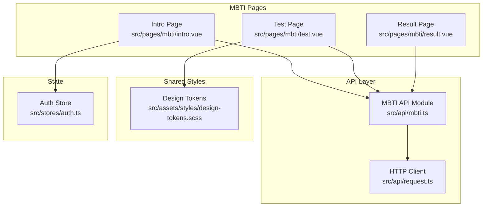
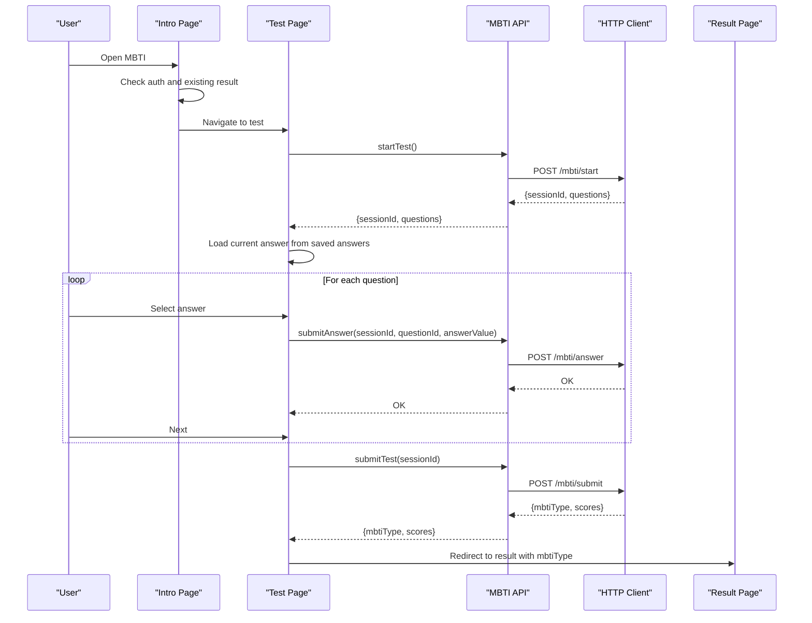
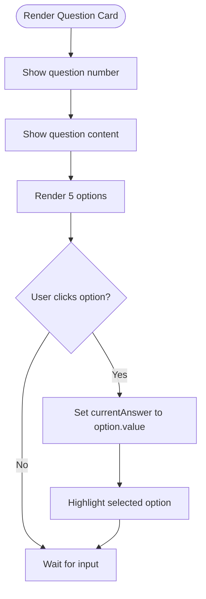
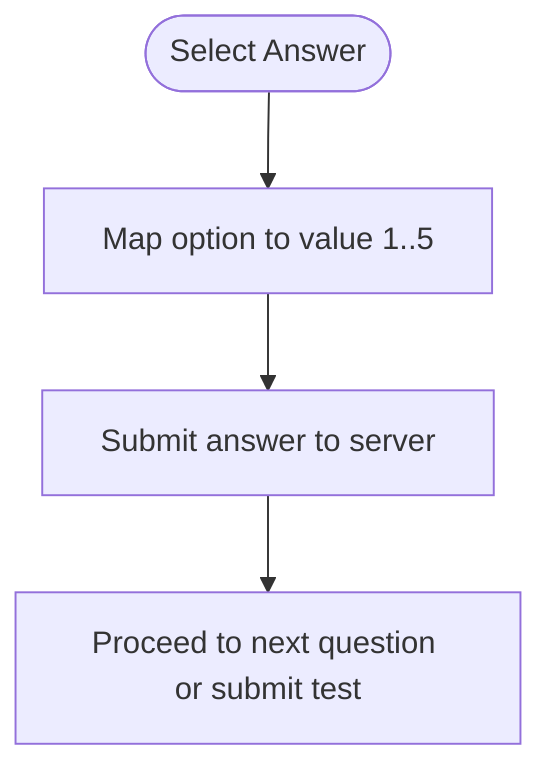
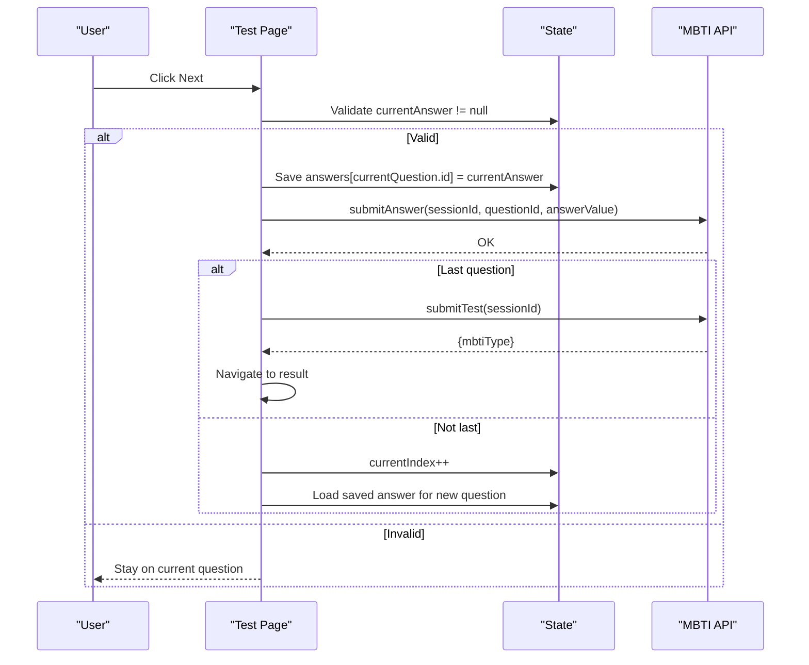
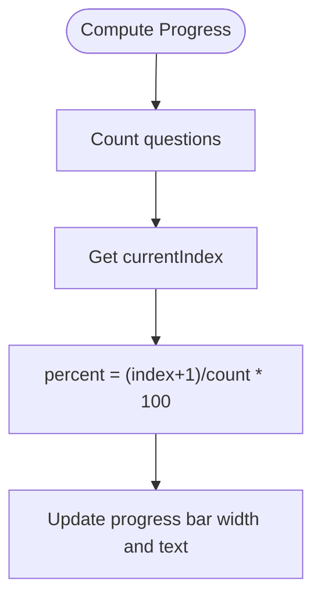
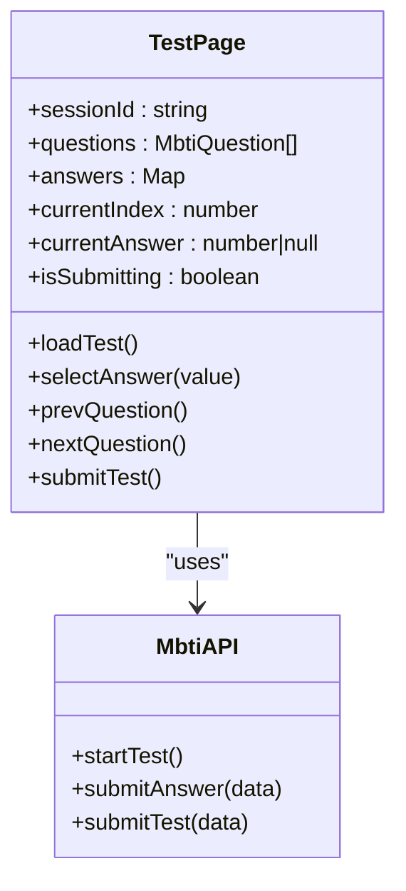
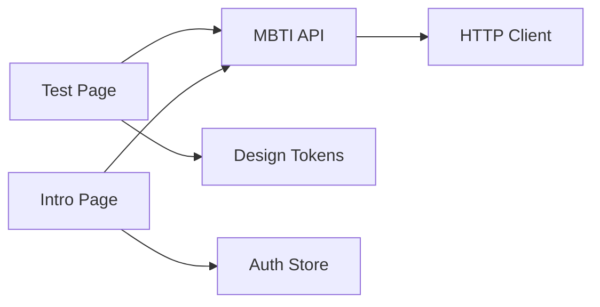

# Question Interface & Navigation

<cite>
**Referenced Files in This Document**
- [test.vue](file://src/pages/mbti/test.vue)
- [mbti.ts](file://src/api/mbti.ts)
- [request.ts](file://src/api/request.ts)
- [design-tokens.scss](file://src/assets/styles/design-tokens.scss)
- [intro.vue](file://src/pages/mbti/intro.vue)
- [result.vue](file://src/pages/mbti/result.vue)
- [auth.ts](file://src/stores/auth.ts)
</cite>

## Table of Contents
1. [Introduction](#introduction)
2. [Project Structure](#project-structure)
3. [Core Components](#core-components)
4. [Architecture Overview](#architecture-overview)
5. [Detailed Component Analysis](#detailed-component-analysis)
6. [Dependency Analysis](#dependency-analysis)
7. [Performance Considerations](#performance-considerations)
8. [Troubleshooting Guide](#troubleshooting-guide)
9. [Conclusion](#conclusion)

## Introduction
This document describes the MBTI question interface and navigation system. It covers the question card component, progress indicators, answer selection interface, five-point Likert scale scoring, navigation controls, state management, responsive design, touch interactions, accessibility considerations, and error handling. It also provides examples for question skipping, answer review, progress saving, and navigation restrictions.

## Project Structure
The MBTI feature spans three pages and a shared API module:
- Intro page: presentation, prerequisites, and entry to the test
- Test page: question card, navigation, and submission
- Result page: scoring visualization and sharing
- API module: typed contracts and HTTP client

**Diagram sources**
- [intro.vue:1-389](file://src/pages/mbti/intro.vue#L1-L389)
- [test.vue:1-349](file://src/pages/mbti/test.vue#L1-L349)
- [result.vue:1-641](file://src/pages/mbti/result.vue#L1-L641)
- [mbti.ts:1-84](file://src/api/mbti.ts#L1-L84)
- [request.ts:1-228](file://src/api/request.ts#L1-L228)
- [design-tokens.scss:1-240](file://src/assets/styles/design-tokens.scss#L1-L240)
- [auth.ts:1-137](file://src/stores/auth.ts#L1-L137)

**Section sources**
- [intro.vue:1-389](file://src/pages/mbti/intro.vue#L1-L389)
- [test.vue:1-349](file://src/pages/mbti/test.vue#L1-L349)
- [result.vue:1-641](file://src/pages/mbti/result.vue#L1-L641)
- [mbti.ts:1-84](file://src/api/mbti.ts#L1-L84)
- [request.ts:1-228](file://src/api/request.ts#L1-L228)
- [design-tokens.scss:1-240](file://src/assets/styles/design-tokens.scss#L1-L240)
- [auth.ts:1-137](file://src/stores/auth.ts#L1-L137)

## Core Components
- Question Card: displays question number, content, and five-option Likert scale answers
- Progress Bar: shows current position and percentage
- Navigation Controls: Previous/Next buttons with validation and dynamic labeling
- Answer Selection: radio-style options with visual feedback
- State Management: session ID, questions, current index, selected answer, and saved answers
- Scoring Model: five-point scale mapped to answer values
- API Contracts: typed question, answer, and result models
- Error Handling: loading states, modals, and toast notifications

**Section sources**
- [test.vue:1-349](file://src/pages/mbti/test.vue#L1-L349)
- [mbti.ts:1-84](file://src/api/mbti.ts#L1-L84)

## Architecture Overview
The test flow begins on the intro page, navigates to the test page, and ends at the result page. The test page loads questions, tracks answers, submits per-answer and final results, and transitions to the result page with a typed MBTI type.

**Diagram sources**
- [intro.vue:129-173](file://src/pages/mbti/intro.vue#L129-L173)
- [test.vue:83-191](file://src/pages/mbti/test.vue#L83-L191)
- [mbti.ts:48-83](file://src/api/mbti.ts#L48-L83)
- [request.ts:75-225](file://src/api/request.ts#L75-L225)
- [result.vue:225-306](file://src/pages/mbti/result.vue#L225-L306)

## Detailed Component Analysis

### Question Card Component
- Displays question number and content
- Renders five answer options in a Likert scale
- Tracks current answer selection and applies selected state
- Uses a radio indicator to reflect selection

Key behaviors:
- Current question computed from current index
- Selected option highlighted with a border and gradient background
- Clicking an option updates the current answer

**Diagram sources**
- [test.vue:8-30](file://src/pages/mbti/test.vue#L8-L30)
- [test.vue:112-114](file://src/pages/mbti/test.vue#L112-L114)

**Section sources**
- [test.vue:8-30](file://src/pages/mbti/test.vue#L8-L30)
- [test.vue:112-114](file://src/pages/mbti/test.vue#L112-L114)

### Five-Point Likert Scale Scoring System
The scoring model uses integer values 1–5 mapped to answer options:
- Value 1: “Very A”
- Value 2: “More A”
- Value 3: “Neutral”
- Value 4: “More B”
- Value 5: “Very B”

These values are submitted per question and later aggregated into MBTI dimensions.

**Diagram sources**
- [test.vue:63-69](file://src/pages/mbti/test.vue#L63-L69)
- [test.vue:131-161](file://src/pages/mbti/test.vue#L131-L161)
- [mbti.ts:12-15](file://src/api/mbti.ts#L12-L15)

**Section sources**
- [test.vue:63-69](file://src/pages/mbti/test.vue#L63-L69)
- [mbti.ts:12-15](file://src/api/mbti.ts#L12-L15)

### Navigation Controls and Validation
- Previous button appears when not on the first question
- Next button is disabled until an answer is selected
- On Next:
  - Save current answer to memory map keyed by question ID
  - Submit answer to server
  - If last question, submit test and navigate to result
  - Otherwise, advance to next question and load saved answer
- On Previous:
  - Save current answer if present
  - Move index backward
  - Load previously saved answer for the new question

**Diagram sources**
- [test.vue:32-48](file://src/pages/mbti/test.vue#L32-L48)
- [test.vue:116-161](file://src/pages/mbti/test.vue#L116-L161)
- [mbti.ts:54-62](file://src/api/mbti.ts#L54-L62)

**Section sources**
- [test.vue:32-48](file://src/pages/mbti/test.vue#L32-L48)
- [test.vue:116-161](file://src/pages/mbti/test.vue#L116-L161)

### Progress Tracking and Indicators
- Progress bar width reflects (currentIndex + 1) / questions.length
- Progress text shows current question number and total count
- Computed progress percent updates reactively

**Diagram sources**
- [test.vue:3-6](file://src/pages/mbti/test.vue#L3-L6)
- [test.vue:75-77](file://src/pages/mbti/test.vue#L75-L77)

**Section sources**
- [test.vue:3-6](file://src/pages/mbti/test.vue#L3-L6)
- [test.vue:75-77](file://src/pages/mbti/test.vue#L75-L77)

### State Management
- Session ID: generated by startTest
- Questions: loaded from startTest
- Answers: Map<number, number> keyed by question ID
- Current index: zero-based pointer to current question
- Current answer: nullable value 1..5
- Submitting flag: prevents concurrent submissions

**Diagram sources**
- [test.vue:56-61](file://src/pages/mbti/test.vue#L56-L61)
- [test.vue:87-191](file://src/pages/mbti/test.vue#L87-L191)
- [mbti.ts:48-83](file://src/api/mbti.ts#L48-L83)

**Section sources**
- [test.vue:56-61](file://src/pages/mbti/test.vue#L56-L61)
- [test.vue:87-191](file://src/pages/mbti/test.vue#L87-L191)
- [mbti.ts:48-83](file://src/api/mbti.ts#L48-L83)

### Responsive Design and Touch Interactions
- Uses rpx units and design tokens for consistent spacing and typography
- Buttons and options use active scaling transforms for tactile feedback
- Progress bar and cards adapt to viewport via container widths and shadows
- Scrollable content areas leverage flexbox and spacing tokens

Key styles and patterns:
- Button heights and active transforms
- Shadow and radius tokens for depth
- Flex utilities for alignment and centering
- Gradient backgrounds for visual emphasis

**Section sources**
- [test.vue:194-347](file://src/pages/mbti/test.vue#L194-L347)
- [design-tokens.scss:1-240](file://src/assets/styles/design-tokens.scss#L1-L240)

### Accessibility Considerations
- Semantic structure with views, texts, and buttons
- Focus and hover states managed via active transforms and borders
- Clear contrast between primary/secondary colors
- Text sizes and weights aligned with design tokens
- No explicit ARIA attributes observed in the tested files

[No sources needed since this section provides general guidance]

### Error Handling
- Network failures: unified toast and modal fallbacks
- Authentication errors: automatic redirect to login
- Submission errors: logged locally; UI remains functional
- Loading states: show/hide loaders during start and submit phases

Examples:
- Start test error: hide loader, show modal, navigate back
- Submit answer error: log and continue
- Submit test error: hide loader, show modal, prevent concurrent submits

**Section sources**
- [test.vue:87-110](file://src/pages/mbti/test.vue#L87-L110)
- [test.vue:140-148](file://src/pages/mbti/test.vue#L140-L148)
- [test.vue:163-191](file://src/pages/mbti/test.vue#L163-L191)
- [request.ts:183-189](file://src/api/request.ts#L183-L189)
- [request.ts:134-147](file://src/api/request.ts#L134-L147)

### Examples and Patterns

#### Implementing Question Skipping
- Current implementation does not support skipping; navigation requires selecting an answer first
- To enable skipping:
  - Allow Next without answer validation
  - Store a sentinel value (e.g., null) in the answers map for skipped questions
  - Modify result computation to treat null as neutral or skip scoring

#### Answer Review
- The current page loads the saved answer for the current question on mount and navigation
- To enhance review:
  - Add a “Review” button that highlights unanswered questions
  - Persist answers immediately on selection to reduce loss risk

#### Progress Saving
- Answers are saved to memory keyed by question ID during navigation
- To persist across sessions:
  - Serialize answers map to storage on each change
  - Restore on mount and merge with loaded questions

#### Navigation Restrictions
- Previous button is conditionally shown only when index > 0
- Next button is disabled until an answer is selected
- These guards prevent invalid transitions and ensure data integrity

**Section sources**
- [test.vue:32-48](file://src/pages/mbti/test.vue#L32-L48)
- [test.vue:116-161](file://src/pages/mbti/test.vue#L116-L161)

## Dependency Analysis
- Test page depends on:
  - MBTI API module for start/answer/submit operations
  - Request client for HTTP transport and token refresh
  - Design tokens for consistent UI
  - Auth store for login checks on entry

**Diagram sources**
- [test.vue:54-55](file://src/pages/mbti/test.vue#L54-L55)
- [mbti.ts:1-84](file://src/api/mbti.ts#L1-L84)
- [request.ts:1-228](file://src/api/request.ts#L1-L228)
- [design-tokens.scss:1-240](file://src/assets/styles/design-tokens.scss#L1-L240)
- [intro.vue:82-85](file://src/pages/mbti/intro.vue#L82-L85)
- [auth.ts:1-137](file://src/stores/auth.ts#L1-L137)

**Section sources**
- [test.vue:54-55](file://src/pages/mbti/test.vue#L54-L55)
- [mbti.ts:1-84](file://src/api/mbti.ts#L1-L84)
- [request.ts:1-228](file://src/api/request.ts#L1-L228)
- [design-tokens.scss:1-240](file://src/assets/styles/design-tokens.scss#L1-L240)
- [intro.vue:82-85](file://src/pages/mbti/intro.vue#L82-L85)
- [auth.ts:1-137](file://src/stores/auth.ts#L1-L137)

## Performance Considerations
- Minimize DOM updates by relying on computed properties for progress and current question
- Debounce or batch answer saves if extending to persistent storage
- Use lightweight transitions and avoid heavy animations on low-end devices
- Preload images on result page and handle fallbacks gracefully

[No sources needed since this section provides general guidance]

## Troubleshooting Guide
Common issues and remedies:
- Network failure during start/submit:
  - Verify connectivity and token validity
  - Retry after showing a user-friendly message
- Authentication expired:
  - Trigger token refresh and retry automatically
  - Fallback to login screen if refresh fails
- Stuck on Next:
  - Ensure answer selection triggers state update
  - Confirm computed isLastQuestion is correct

**Section sources**
- [request.ts:100-147](file://src/api/request.ts#L100-L147)
- [test.vue:131-161](file://src/pages/mbti/test.vue#L131-L161)

## Conclusion
The MBTI question interface and navigation system provides a clean, validated flow with immediate per-question submission and a final result page. The five-point Likert scale is straightforward and extensible. With minor enhancements—optional skipping, persistent answer saving, and richer review capabilities—the system can become more robust and user-friendly while maintaining its responsive and accessible design.