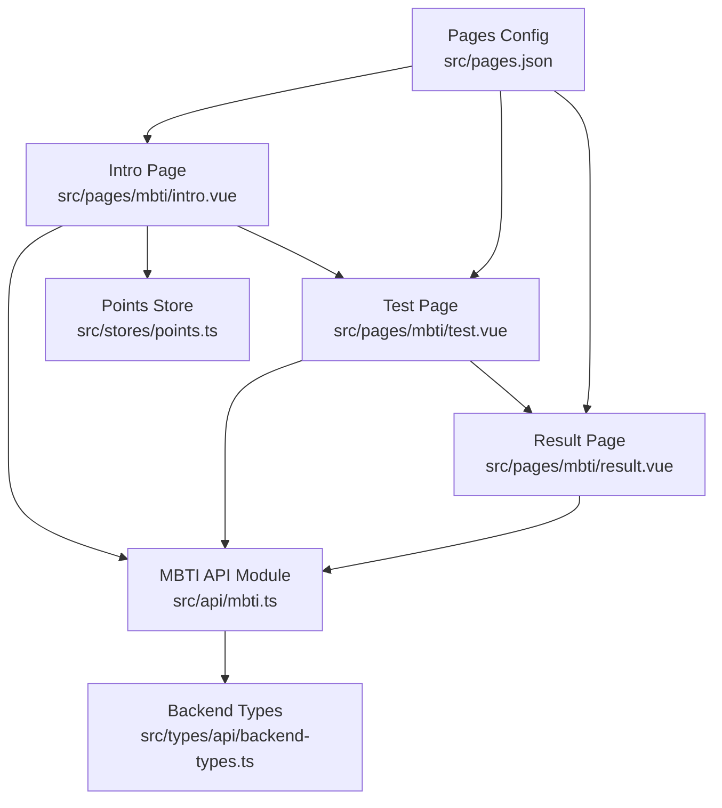
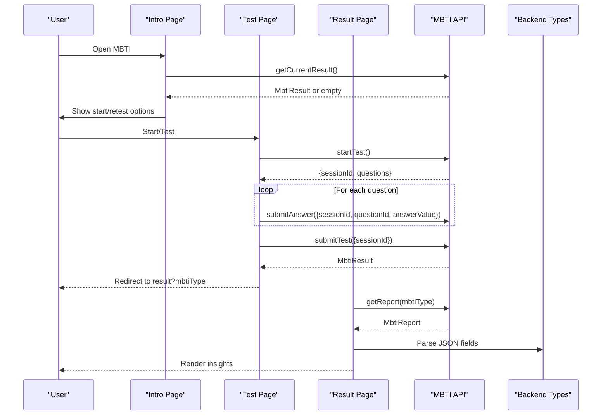
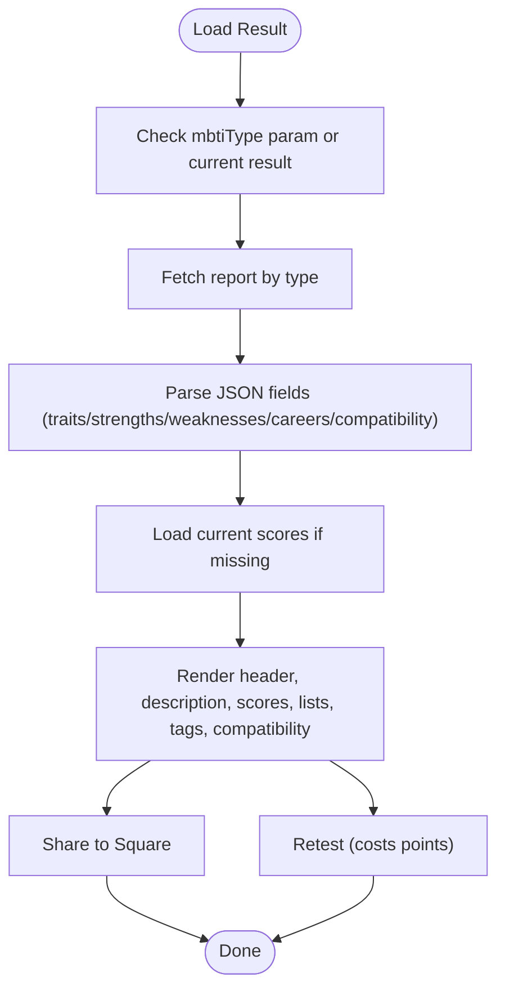
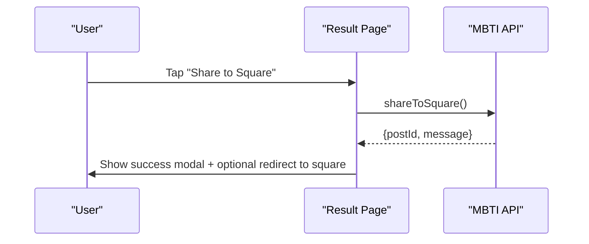
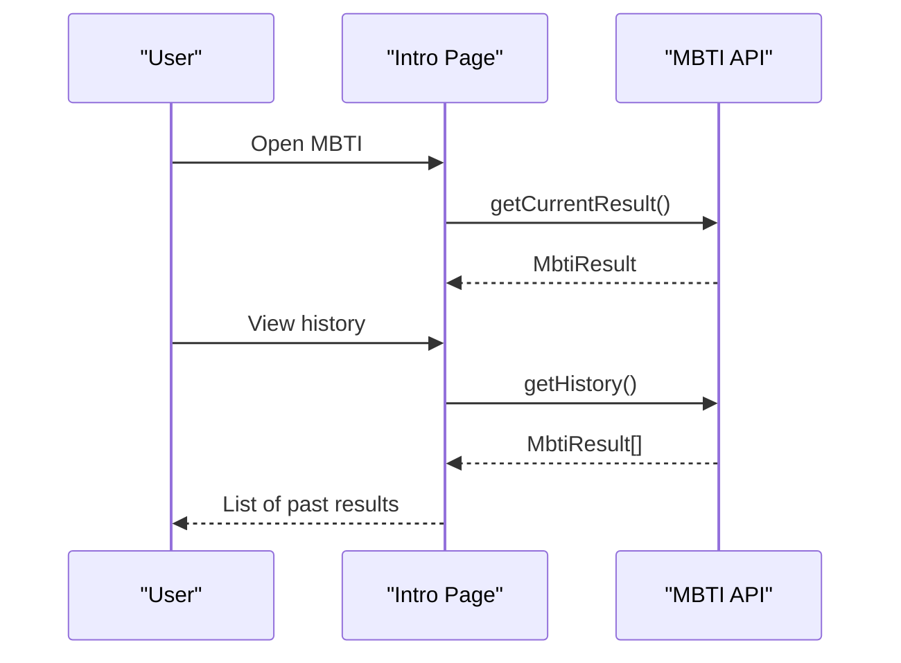
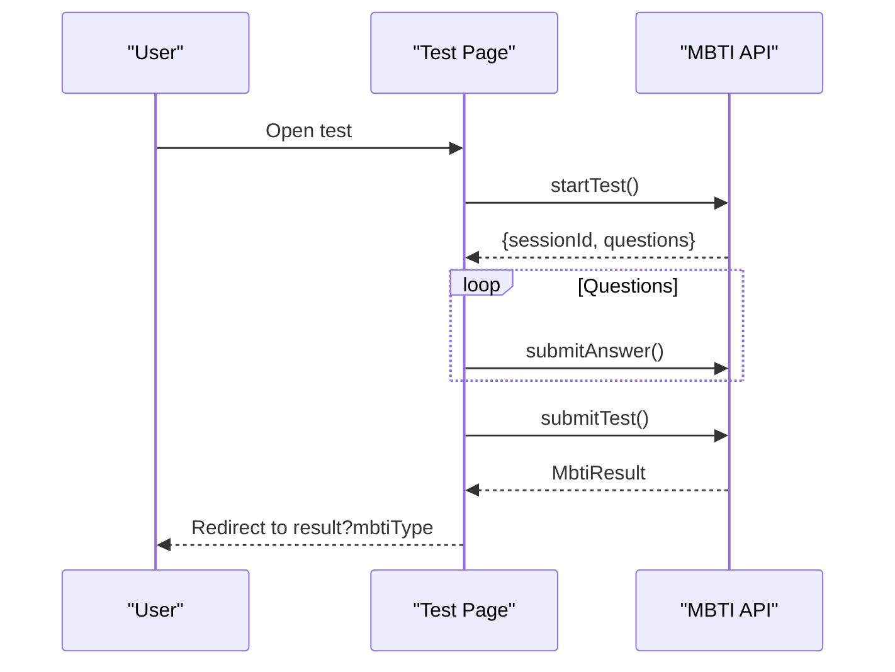
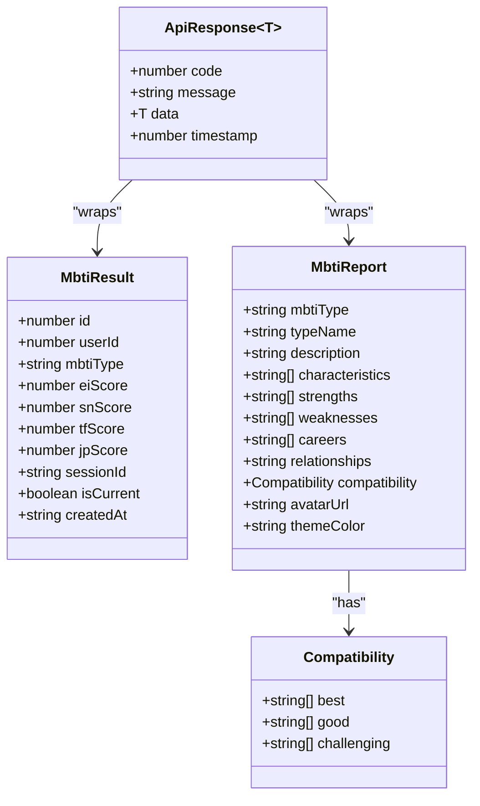
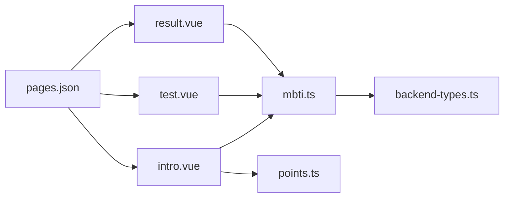

# Result Display & Personality Insights

<cite>
**Referenced Files in This Document**
- [result.vue](file://src/pages/mbti/result.vue)
- [test.vue](file://src/pages/mbti/test.vue)
- [intro.vue](file://src/pages/mbti/intro.vue)
- [mbti.ts](file://src/api/mbti.ts)
- [points.ts](file://src/stores/points.ts)
- [backend-types.ts](file://src/types/api/backend-types.ts)
- [pages.json](file://src/pages.json)
</cite>

## Table of Contents
1. [Introduction](#introduction)
2. [Project Structure](#project-structure)
3. [Core Components](#core-components)
4. [Architecture Overview](#architecture-overview)
5. [Detailed Component Analysis](#detailed-component-analysis)
6. [Dependency Analysis](#dependency-analysis)
7. [Performance Considerations](#performance-considerations)
8. [Troubleshooting Guide](#troubleshooting-guide)
9. [Conclusion](#conclusion)
10. [Appendices](#appendices)

## Introduction
This document describes the MBTI result display and personality insights system. It covers the result page layout, personality type visualization, trait explanations, cognitive function scoring, compatibility matching, sharing to the community, and the underlying APIs and stores that power the experience. It also outlines how to extend the system with personalized insights, interactive elements, and result customization while maintaining a consistent user experience.

## Project Structure
The MBTI feature spans three pages and supporting modules:
- Test flow: intro → test → result
- API module: typed client for MBTI endpoints
- Points store: integral to retest cost and reward UX
- Backend types: shared response and entity types

**Diagram sources**
- [intro.vue:1-389](file://src/pages/mbti/intro.vue#L1-L389)
- [test.vue:1-349](file://src/pages/mbti/test.vue#L1-L349)
- [result.vue:1-641](file://src/pages/mbti/result.vue#L1-L641)
- [mbti.ts:1-84](file://src/api/mbti.ts#L1-L84)
- [points.ts:1-72](file://src/stores/points.ts#L1-L72)
- [backend-types.ts:1-764](file://src/types/api/backend-types.ts#L1-L764)
- [pages.json:148-164](file://src/pages.json#L148-L164)

**Section sources**
- [pages.json:148-164](file://src/pages.json#L148-L164)

## Core Components
- Result page: renders avatar/type header, description, dimensional scores, traits, strengths/weaknesses, careers, relationship advice, compatibility, and actions (share, retest).
- Test page: loads a session, presents questions with five-point scale answers, submits per-answer and final results.
- Intro page: explains MBTI, displays points badge, shows rewards/costs, and routes to test or current result.
- MBTI API module: typed endpoints for start/answer/submit/report/current/history/share.
- Points store: balances and logs for reward/cost mechanics.

**Section sources**
- [result.vue:1-641](file://src/pages/mbti/result.vue#L1-L641)
- [test.vue:1-349](file://src/pages/mbti/test.vue#L1-L349)
- [intro.vue:1-389](file://src/pages/mbti/intro.vue#L1-L389)
- [mbti.ts:1-84](file://src/api/mbti.ts#L1-L84)
- [points.ts:1-72](file://src/stores/points.ts#L1-L72)

## Architecture Overview
The MBTI flow is a client-driven pipeline with server-side orchestration via typed APIs.

**Diagram sources**
- [intro.vue:95-127](file://src/pages/mbti/intro.vue#L95-L127)
- [test.vue:83-191](file://src/pages/mbti/test.vue#L83-L191)
- [result.vue:231-306](file://src/pages/mbti/result.vue#L231-L306)
- [mbti.ts:48-83](file://src/api/mbti.ts#L48-L83)
- [backend-types.ts:1-9](file://src/types/api/backend-types.ts#L1-L9)

## Detailed Component Analysis

### Result Page Layout and Personality Insights
The result page organizes insights into digestible sections:
- Header: avatar placeholder or image, MBTI type, and type name
- Description card: summary personality description
- Scores card: four-dimensional bar charts with centered markers and numeric values
- Traits, strengths, weaknesses: bullet lists
- Careers: tag cloud
- Relationships: advice text
- Compatibility: best/good/challenging matches grouped by label
- Actions: share to square and retest

**Diagram sources**
- [result.vue:231-306](file://src/pages/mbti/result.vue#L231-L306)
- [mbti.ts:64-72](file://src/api/mbti.ts#L64-L72)

**Section sources**
- [result.vue:1-641](file://src/pages/mbti/result.vue#L1-L641)
- [mbti.ts:30-46](file://src/api/mbti.ts#L30-L46)

### Personality Interpretation System
- Strengths and weaknesses: rendered as bullet lists from report fields
- Career suggestions: rendered as tags from report field
- Relationship insights: rendered as a paragraph from report field
- Compatibility: grouped by match quality (best/good/challenging) from report field

These fields are typed and returned from the backend; the frontend parses JSON-encoded arrays and objects when needed.

**Section sources**
- [result.vue:109-201](file://src/pages/mbti/result.vue#L109-L201)
- [mbti.ts:30-46](file://src/api/mbti.ts#L30-L46)

### Sharing Functionality
The result page supports sharing to the community feed:
- Action triggers a share API call
- On success, shows a modal with navigation to the square tab
- On failure, shows an error modal

**Diagram sources**
- [result.vue:308-340](file://src/pages/mbti/result.vue#L308-L340)
- [mbti.ts:79-82](file://src/api/mbti.ts#L79-L82)

**Section sources**
- [result.vue:203-211](file://src/pages/mbti/result.vue#L203-L211)
- [mbti.ts:79-82](file://src/api/mbti.ts#L79-L82)

### Personality Insights Engine (Client-Side Rendering)
The frontend composes insights from:
- MbtiReport: description, characteristics, strengths, weaknesses, careers, relationships, compatibility
- MbtiResult: dimensional scores used for visualization bars

The engine does not compute derived insights; it renders precomputed data. To add custom insights:
- Extend MbtiReport with new fields
- Add new UI sections in the result page
- Optionally compute derived metrics in the backend and expose via API

**Section sources**
- [mbti.ts:30-46](file://src/api/mbti.ts#L30-L46)
- [result.vue:25-201](file://src/pages/mbti/result.vue#L25-L201)

### Result Persistence, History Tracking, and Comparison
- Current result retrieval: getCurrentResult()
- History retrieval: getHistory()
- Comparison: present historical results and allow selection to compare scores and insights

**Diagram sources**
- [intro.vue:110-116](file://src/pages/mbti/intro.vue#L110-L116)
- [mbti.ts:74-77](file://src/api/mbti.ts#L74-L77)

**Section sources**
- [mbti.ts:69-77](file://src/api/mbti.ts#L69-L77)
- [intro.vue:110-116](file://src/pages/mbti/intro.vue#L110-L116)

### Test Flow and Scoring Visualization
The test page:
- Starts a session and loads questions
- Accepts five-point answers per question
- Submits answers incrementally and finalizes on last question
- Redirects to result page with type parameter

The result page:
- Renders dimensional scores as bars with centered markers
- Uses positive/negative score directions to align fill

**Diagram sources**
- [test.vue:83-191](file://src/pages/mbti/test.vue#L83-L191)
- [mbti.ts:49-62](file://src/api/mbti.ts#L49-L62)

**Section sources**
- [test.vue:1-349](file://src/pages/mbti/test.vue#L1-L349)
- [result.vue:30-107](file://src/pages/mbti/result.vue#L30-L107)
- [mbti.ts:17-28](file://src/api/mbti.ts#L17-L28)

### Integration Points and Data Models
- MbtiResult: includes mbtiType and four dimensional scores
- MbtiReport: includes personality description, traits, strengths, weaknesses, careers, relationships, and compatibility groups
- Backend types: ApiResponse wrapper and shared enums/utilities

**Diagram sources**
- [mbti.ts:17-46](file://src/api/mbti.ts#L17-L46)
- [backend-types.ts:1-9](file://src/types/api/backend-types.ts#L1-L9)

**Section sources**
- [mbti.ts:17-46](file://src/api/mbti.ts#L17-L46)
- [backend-types.ts:1-9](file://src/types/api/backend-types.ts#L1-L9)

## Dependency Analysis
- Pages depend on mbti pages configuration
- Result and Intro depend on MBTI API for reports/results
- Intro depends on Points API/store for rewards/costs
- MBTI API depends on backend types for response typing

**Diagram sources**
- [pages.json:148-164](file://src/pages.json#L148-L164)
- [intro.vue:82-85](file://src/pages/mbti/intro.vue#L82-L85)
- [test.vue](file://src/pages/mbti/test.vue#L54)
- [result.vue](file://src/pages/mbti/result.vue#L218)
- [mbti.ts](file://src/api/mbti.ts#L1)
- [points.ts:1-72](file://src/stores/points.ts#L1-L72)
- [backend-types.ts:1-764](file://src/types/api/backend-types.ts#L1-L764)

**Section sources**
- [pages.json:148-164](file://src/pages.json#L148-L164)
- [intro.vue:82-85](file://src/pages/mbti/intro.vue#L82-L85)
- [test.vue](file://src/pages/mbti/test.vue#L54)
- [result.vue](file://src/pages/mbti/result.vue#L218)
- [mbti.ts](file://src/api/mbti.ts#L1)
- [points.ts:1-72](file://src/stores/points.ts#L1-L72)
- [backend-types.ts:1-764](file://src/types/api/backend-types.ts#L1-L764)

## Performance Considerations
- Lazy-load avatar images and handle errors gracefully to avoid blocking rendering.
- Debounce or batch incremental answer submissions during tests to reduce network overhead.
- Cache recent MbtiReport data locally to speed up revisit scenarios.
- Use skeleton placeholders for long-loading sections (description, compatibility).
- Keep JSON parsing minimal and only when needed (already guarded in result page).

## Troubleshooting Guide
Common issues and remedies:
- No current result available: fallback to URL-provided type or prompt retest
- Image load failures: detect via error handler and notify user
- Share failures: show modal with retry suggestion
- Insufficient points for retest: gate UI with computed canRetest and prompt to navigate to points or login

**Section sources**
- [result.vue:242-275](file://src/pages/mbti/result.vue#L242-L275)
- [result.vue:356-363](file://src/pages/mbti/result.vue#L356-L363)
- [result.vue:332-340](file://src/pages/mbti/result.vue#L332-L340)
- [intro.vue:146-167](file://src/pages/mbti/intro.vue#L146-L167)

## Conclusion
The MBTI result display system is a cohesive client-driven pipeline that renders personality insights from typed backend responses. It provides a clean, modular structure for displaying personality type visualization, traits, strengths/weaknesses, careers, relationship advice, and compatibility. The sharing and retest flows integrate with points mechanics to encourage engagement. Extending the system involves adding new report fields, UI sections, and optionally enhancing backend-derived insights.

## Appendices

### Implementing Personalized Insights
- Add new MbtiReport fields for derived insights (e.g., growth themes)
- Extend result page with new cards and sections
- Keep JSON parsing explicit and guarded to prevent runtime errors

**Section sources**
- [mbti.ts:30-46](file://src/api/mbti.ts#L30-L46)
- [result.vue:277-292](file://src/pages/mbti/result.vue#L277-L292)

### Adding Interactive Elements
- Enable score tooltips on dimensional bars
- Add “Compare with previous” toggles using history data
- Provide “Export/share result” via platform share APIs

**Section sources**
- [mbti.ts:74-77](file://src/api/mbti.ts#L74-L77)
- [result.vue:30-107](file://src/pages/mbti/result.vue#L30-L107)

### Creating Shareable Result Cards
- Use shareToSquare() to publish a post referencing the result
- Provide optional preview text and metadata from MbtiReport
- Link to the square tab for discovery

**Section sources**
- [mbti.ts:79-82](file://src/api/mbti.ts#L79-L82)
- [result.vue:308-340](file://src/pages/mbti/result.vue#L308-L340)

### Insight Generation Algorithms and User Engagement
- Algorithmic ideas (conceptual):
  - Compute trait density from characteristics array
  - Weight careers by strength/compatibility scores
  - Suggest relationship strategies based on compatibility groups
- Engagement features:
  - Points rewards for completing tests
  - Re-test costs to encourage reflection
  - Social proof via shared results

[No sources needed since this section provides general guidance]