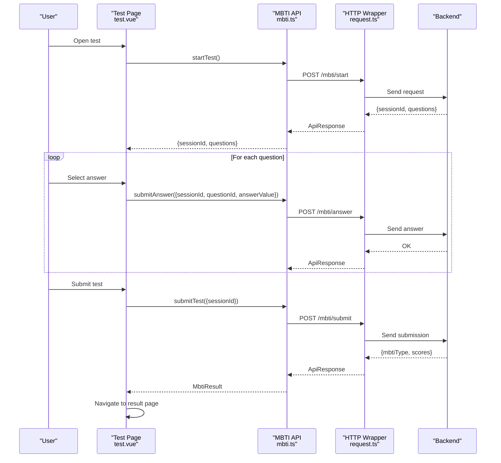
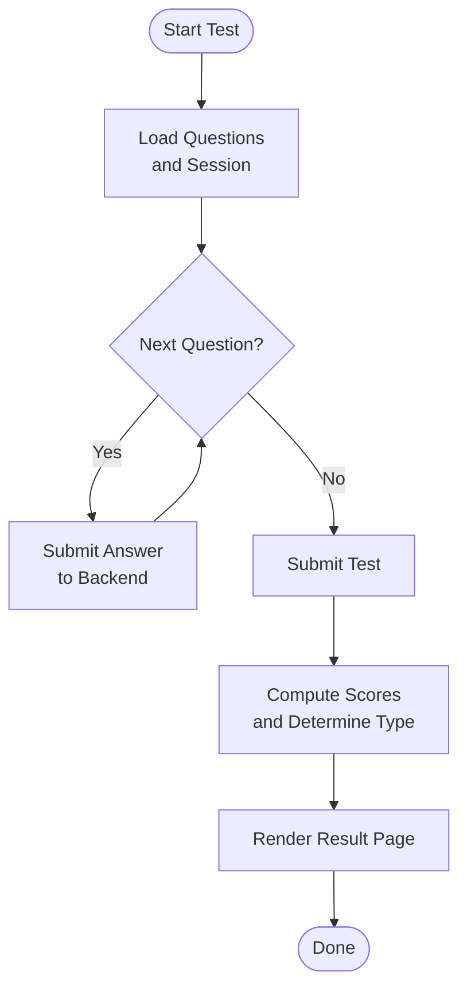
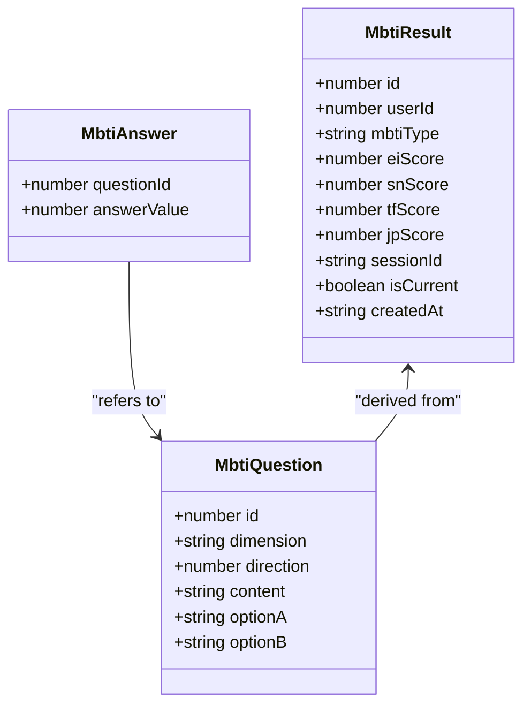
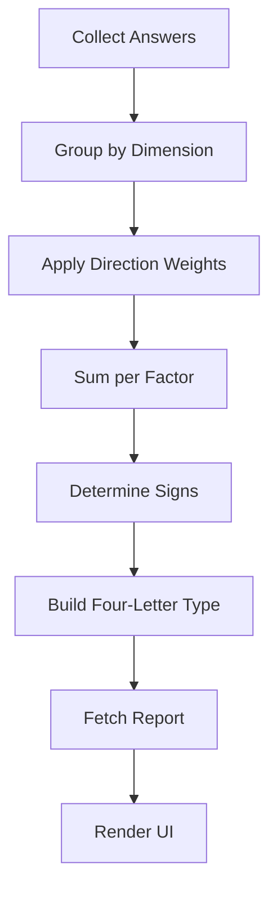
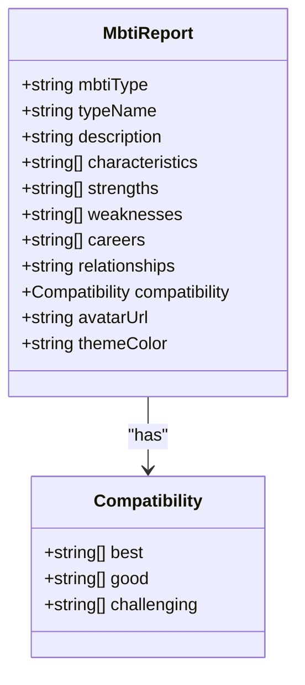
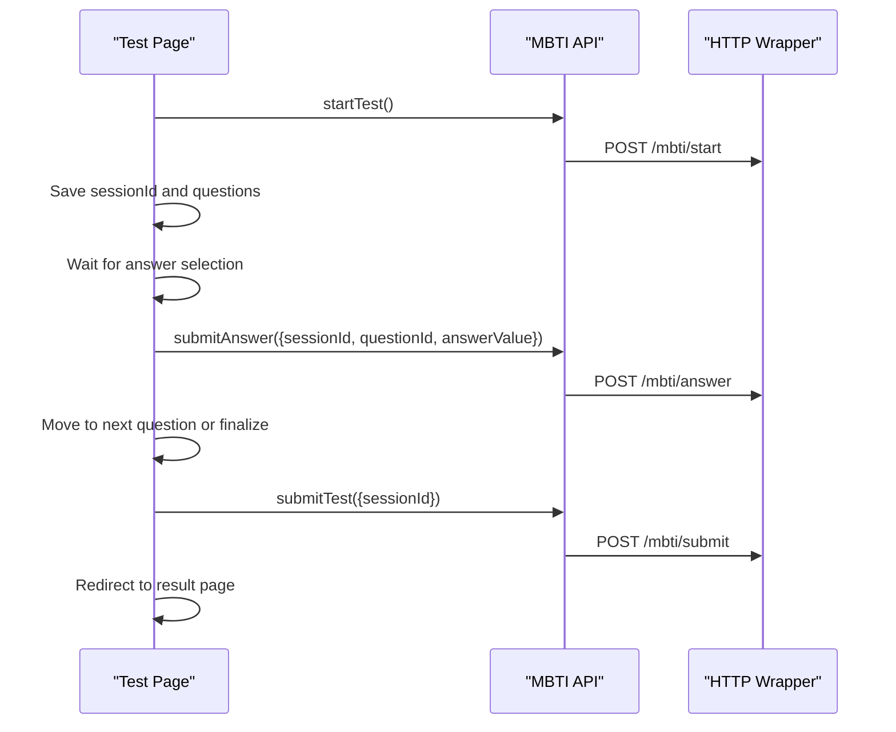
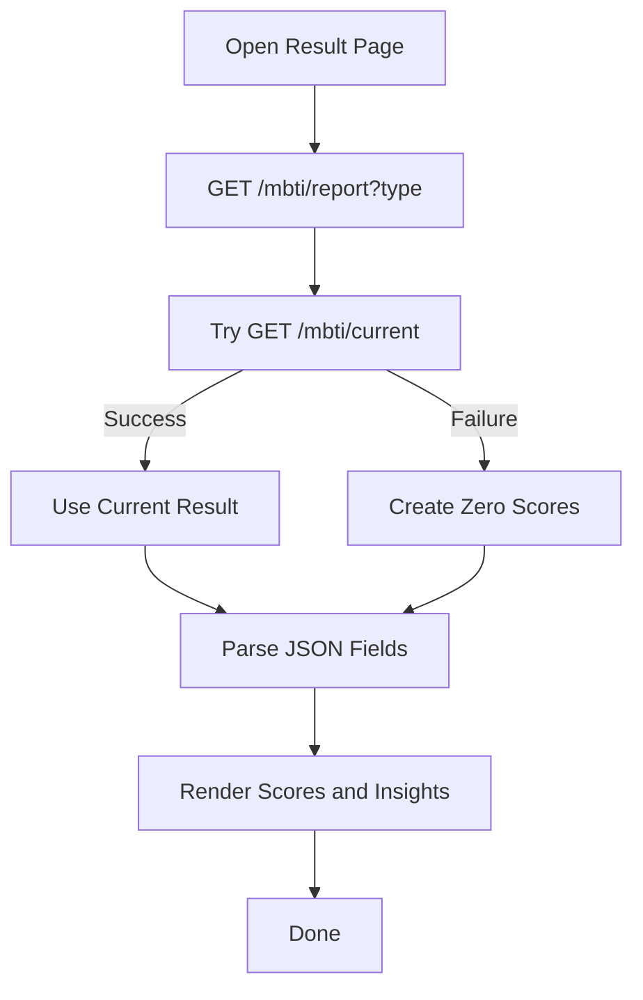
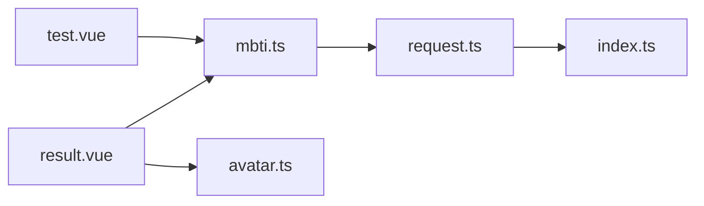

# Scoring Algorithm & Result Calculation

<cite>
**Referenced Files in This Document**
- [mbti.ts](file://src/api/mbti.ts)
- [test.vue](file://src/pages/mbti/test.vue)
- [result.vue](file://src/pages/mbti/result.vue)
- [request.ts](file://src/api/request.ts)
- [index.ts](file://src/config/index.ts)
- [avatar.ts](file://src/utils/avatar.ts)
</cite>

## Table of Contents
1. [Introduction](#introduction)
2. [Project Structure](#project-structure)
3. [Core Components](#core-components)
4. [Architecture Overview](#architecture-overview)
5. [Detailed Component Analysis](#detailed-component-analysis)
6. [Dependency Analysis](#dependency-analysis)
7. [Performance Considerations](#performance-considerations)
8. [Troubleshooting Guide](#troubleshooting-guide)
9. [Conclusion](#conclusion)
10. [Appendices](#appendices)

## Introduction
This document explains the MBTI scoring algorithm and result calculation system implemented in the frontend. It covers the five-factor scoring methodology (Extraversion/Introversion, Sensing/Intuition, Thinking/Feeling, Judging/Perceiving), the answer weighting system, score aggregation, personality type determination, and the API endpoints used for submitting answers and retrieving results. It also documents the result interpretation system, validation logic, edge case handling, and provides guidance for extending the system with custom scoring rules, personality insights, and analytics.

## Project Structure
The MBTI feature is organized around three pages and supporting modules:
- Pages:
  - Introductory page explaining MBTI dimensions
  - Test-taking page with question navigation and answer submission
  - Result page displaying scores, personality type, and insights
- APIs:
  - MBTI API module defining question, answer, result, and report types and endpoints
  - HTTP request wrapper with token refresh and error handling
- Utilities:
  - MBTI avatar configuration for personality type visuals

```mermaid
graph TB
subgraph "Pages"
Intro["Intro Page<br/>src/pages/mbti/intro.vue"]
Test["Test Page<br/>src/pages/mbti/test.vue"]
Result["Result Page<br/>src/pages/mbti/result.vue"]
end
subgraph "API Layer"
MbtiApi["MBTI API Module<br/>src/api/mbti.ts"]
Request["HTTP Request Wrapper<br/>src/api/request.ts"]
end
subgraph "Config"
Config["API Config<br/>src/config/index.ts"]
end
subgraph "Utilities"
Avatars["MBTI Avatars<br/>src/utils/avatar.ts"]
end
Intro --> Test
Test --> MbtiApi
Result --> MbtiApi
MbtiApi --> Request
Request --> Config
Result --> Avatars
```

**Diagram sources**
- [test.vue:1-349](file://src/pages/mbti/test.vue#L1-L349)
- [result.vue:1-483](file://src/pages/mbti/result.vue#L1-L483)
- [mbti.ts:1-84](file://src/api/mbti.ts#L1-L84)
- [request.ts:1-228](file://src/api/request.ts#L1-L228)
- [index.ts:1-11](file://src/config/index.ts#L1-L11)
- [avatar.ts:1-36](file://src/utils/avatar.ts#L1-L36)

**Section sources**
- [mbti.ts:1-84](file://src/api/mbti.ts#L1-L84)
- [test.vue:1-349](file://src/pages/mbti/test.vue#L1-L349)
- [result.vue:1-483](file://src/pages/mbti/result.vue#L1-L483)
- [request.ts:1-228](file://src/api/request.ts#L1-L228)
- [index.ts:1-11](file://src/config/index.ts#L1-L11)
- [avatar.ts:1-36](file://src/utils/avatar.ts#L1-L36)

## Core Components
- MBTI Question model: carries question metadata, dimension, direction, and options.
- MBTI Answer model: captures the selected answer value per question.
- MBTI Result model: holds the five-factor scores and derived personality type.
- MBTI Report model: provides personality insights, characteristics, strengths, weaknesses, careers, relationships, compatibility, avatar URL, and theme color.
- MBTI API client: exposes endpoints for starting tests, submitting answers, submitting tests, retrieving reports, current results, history, and sharing results.

Key endpoint definitions:
- POST /mbti/start: returns a session ID and questions
- POST /mbti/answer: submits a single answer linked to the session
- POST /mbti/submit: finalizes the test and returns the result
- GET /mbti/report: retrieves the personality report for a given type
- GET /mbti/current: retrieves the current test result
- GET /mbti/history: retrieves test history
- POST /mbti/share: shares results to the community square

**Section sources**
- [mbti.ts:3-83](file://src/api/mbti.ts#L3-L83)

## Architecture Overview
The frontend orchestrates the MBTI flow:
- Test page loads a session and questions, collects answers, and streams them to the backend.
- On completion, the test is submitted and the result is fetched.
- The result page displays raw scores, derives the personality type, and renders a detailed report.



**Diagram sources**
- [test.vue:83-191](file://src/pages/mbti/test.vue#L83-L191)
- [mbti.ts:48-67](file://src/api/mbti.ts#L48-L67)
- [request.ts:75-208](file://src/api/request.ts#L75-L208)

## Detailed Component Analysis

### Five-Factor Scoring Methodology
The system tracks four dimensions with numeric scores:
- Extraversion/Introversion (E/I): eiScore
- Sensing/Intuition (S/N): snScore
- Thinking/Feeling (T/F): tfScore
- Judging/Perceiving (J/P): jpScore

Each score is represented as a signed number. Positive values indicate a preference toward the right-side trait of the pair, while negative values indicate the left-side trait. The result page visualizes these scores with a bar centered at zero, filling in the direction of the sign.



**Diagram sources**
- [test.vue:83-191](file://src/pages/mbti/test.vue#L83-L191)
- [result.vue:30-107](file://src/pages/mbti/result.vue#L30-L107)

**Section sources**
- [result.vue:30-107](file://src/pages/mbti/result.vue#L30-L107)

### Answer Weighting System
The frontend defines answer options with integer values:
- Very A: 1
- More A: 2
- Neutral: 3
- More B: 4
- Very B: 5

These values are transmitted to the backend as answerValue for each questionId. The backend aggregates these values by dimension and direction to compute the five-factor scores. The direction field indicates whether the question weights toward E/I, S/N, T/F, or J/P.



**Diagram sources**
- [mbti.ts:3-28](file://src/api/mbti.ts#L3-L28)

**Section sources**
- [test.vue:63-69](file://src/pages/mbti/test.vue#L63-L69)
- [mbti.ts:3-28](file://src/api/mbti.ts#L3-L28)

### Score Aggregation and Personality Type Determination
- Aggregation: The backend sums weighted answers per dimension, applying the question’s direction to bias the score toward the indicated trait.
- Type Determination: The backend derives the personality type from the signs of the four scores (positive/negative per factor), forming a four-letter code (e.g., ENTJ).
- Presentation: The frontend receives the type and scores and renders them on the result page.



**Diagram sources**
- [result.vue:253-292](file://src/pages/mbti/result.vue#L253-L292)

**Section sources**
- [result.vue:253-292](file://src/pages/mbti/result.vue#L253-L292)

### Result Interpretation System
The report model includes:
- mbtiType, typeName
- description
- characteristics, strengths, weaknesses
- careers
- relationships
- compatibility: best, good, challenging matches
- avatarUrl, themeColor

The result page parses JSON-encoded arrays and objects when present and renders personality insights, career suggestions, relationship advice, and compatibility guidance.



**Diagram sources**
- [mbti.ts:30-46](file://src/api/mbti.ts#L30-L46)

**Section sources**
- [mbti.ts:30-46](file://src/api/mbti.ts#L30-L46)
- [result.vue:253-292](file://src/pages/mbti/result.vue#L253-L292)

### API Endpoints and Data Contracts
- POST /mbti/start: returns { sessionId, questions[] }
- POST /mbti/answer: payload { sessionId, questionId, answerValue }
- POST /mbti/submit: payload { sessionId }, returns MbtiResult
- GET /mbti/report?mbtiType=TYPE: returns MbtiReport
- GET /mbti/current: returns MbtiResult
- GET /mbti/history: returns MbtiResult[]
- POST /mbti/share: returns { postId, message }

Base URL is configured via environment variables.

**Section sources**
- [mbti.ts:48-83](file://src/api/mbti.ts#L48-L83)
- [index.ts:1-11](file://src/config/index.ts#L1-L11)

### Test Page Workflow
The test page manages:
- Loading a session and questions
- Maintaining a local answer map keyed by questionId
- Submitting each answer immediately upon selection
- Navigating through questions and disabling the next button until an answer is chosen
- Finalizing the test and redirecting to the result page with the type



**Diagram sources**
- [test.vue:83-191](file://src/pages/mbti/test.vue#L83-L191)
- [mbti.ts:48-67](file://src/api/mbti.ts#L48-L67)

**Section sources**
- [test.vue:83-191](file://src/pages/mbti/test.vue#L83-L191)

### Result Page Rendering
The result page:
- Fetches the report for the type
- Attempts to load the current result if available; otherwise constructs a default with zero scores
- Parses JSON-encoded fields in the report
- Renders scores with directional bars and values
- Displays personality description, characteristics, strengths, weaknesses, careers, relationships, and compatibility



**Diagram sources**
- [result.vue:253-292](file://src/pages/mbti/result.vue#L253-L292)

**Section sources**
- [result.vue:253-292](file://src/pages/mbti/result.vue#L253-L292)

### MBTI Avatars and Themes
The system includes a predefined set of 16 MBTI avatar configurations with associated icons and names. These can be used to enrich the result presentation with visual identity and theme color.

**Section sources**
- [avatar.ts:1-36](file://src/utils/avatar.ts#L1-L36)

## Dependency Analysis
- The test and result pages depend on the MBTI API module.
- The MBTI API module depends on the HTTP request wrapper.
- The HTTP wrapper reads tokens from storage and applies them to requests, refreshing tokens when needed.
- The API base URL is configurable via environment variables.



**Diagram sources**
- [test.vue:52-54](file://src/pages/mbti/test.vue#L52-L54)
- [result.vue:1-40](file://src/pages/mbti/result.vue#L1-L40)
- [mbti.ts:1-1](file://src/api/mbti.ts#L1-L1)
- [request.ts:1-228](file://src/api/request.ts#L1-L228)
- [index.ts:1-11](file://src/config/index.ts#L1-L11)
- [avatar.ts:1-36](file://src/utils/avatar.ts#L1-L36)

**Section sources**
- [test.vue:52-54](file://src/pages/mbti/test.vue#L52-L54)
- [result.vue:1-40](file://src/pages/mbti/result.vue#L1-L40)
- [mbti.ts:1-1](file://src/api/mbti.ts#L1-L1)
- [request.ts:1-228](file://src/api/request.ts#L1-L228)
- [index.ts:1-11](file://src/config/index.ts#L1-L11)
- [avatar.ts:1-36](file://src/utils/avatar.ts#L1-L36)

## Performance Considerations
- Network latency: The HTTP wrapper sets a 30-second timeout; ensure the backend responds promptly to maintain smooth UX.
- Token refresh: Concurrent requests during token refresh are queued to avoid redundant refresh attempts.
- UI rendering: The result page parses JSON fields lazily; avoid unnecessary re-renders by caching parsed data.
- Scrolling and navigation: Minimize heavy computations during route transitions to keep the test flow responsive.

[No sources needed since this section provides general guidance]

## Troubleshooting Guide
Common issues and resolutions:
- Unauthorized or expired token:
  - The HTTP wrapper automatically attempts to refresh the token and retries the original request. If refresh fails, the user is redirected to the login page.
- Network failures:
  - The wrapper shows a toast and rejects the promise; handle errors gracefully in calling components.
- Missing current result:
  - The result page falls back to zero scores when no current result is available.
- JSON parsing errors:
  - The result page checks for string-encoded arrays/objects and parses them safely.

**Section sources**
- [request.ts:100-175](file://src/api/request.ts#L100-L175)
- [result.vue:260-275](file://src/pages/mbti/result.vue#L260-L275)
- [result.vue:277-292](file://src/pages/mbti/result.vue#L277-L292)

## Conclusion
The MBTI scoring system integrates a clean frontend workflow with a robust API contract. The five-factor scoring methodology is straightforward: collect weighted answers, aggregate by dimension with direction, derive a type, and render rich insights. The architecture supports extensibility for custom scoring rules, enhanced personality insights, and analytics.

[No sources needed since this section summarizes without analyzing specific files]

## Appendices

### Implementing Custom Scoring Rules
- Add a new dimension or modify weights by adjusting the backend scoring logic and updating the MbtiQuestion model accordingly.
- Extend the MbtiResult model to include derived metrics (e.g., cognitive function scores).
- Update the result page to visualize new metrics alongside existing scores.

**Section sources**
- [mbti.ts:3-28](file://src/api/mbti.ts#L3-L28)
- [mbti.ts:17-28](file://src/api/mbti.ts#L17-L28)

### Adding Personality Insights
- Enrich the MbtiReport model with additional fields (e.g., cognitive functions, lifestyle tips).
- Populate these fields in the backend and ensure the result page handles JSON parsing for backward compatibility.

**Section sources**
- [mbti.ts:30-46](file://src/api/mbti.ts#L30-L46)
- [result.vue:277-292](file://src/pages/mbti/result.vue#L277-L292)

### Generating Detailed Reports
- Use the report endpoint to fetch personality insights and present them in cards with lists and tags.
- Integrate avatar and theme color to enhance visual appeal.

**Section sources**
- [mbti.ts:64-67](file://src/api/mbti.ts#L64-L67)
- [result.vue:417-454](file://src/pages/mbti/result.vue#L417-L454)

### Result Accuracy Validation and Transparency
- Validate that each question contributes to the correct dimension and direction.
- Ensure answerValue mapping remains consistent across the frontend and backend.
- Provide a scoring transparency view showing how each answer influenced the final scores.

[No sources needed since this section provides general guidance]

### Personality Type Analytics
- Track distribution of types across users to inform marketing and content strategies.
- Monitor completion rates and time-to-completion to optimize the test experience.

[No sources needed since this section provides general guidance]