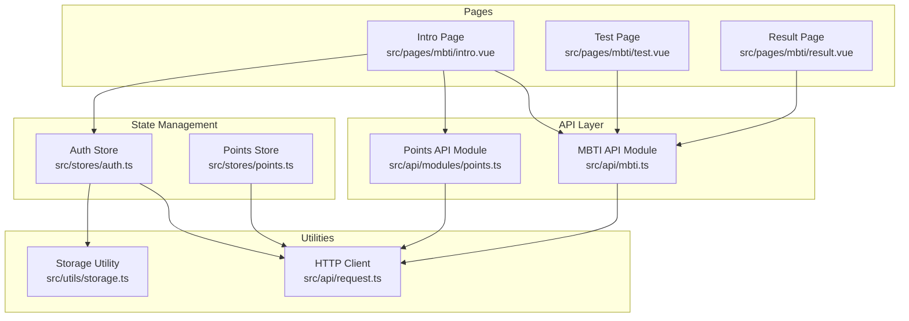
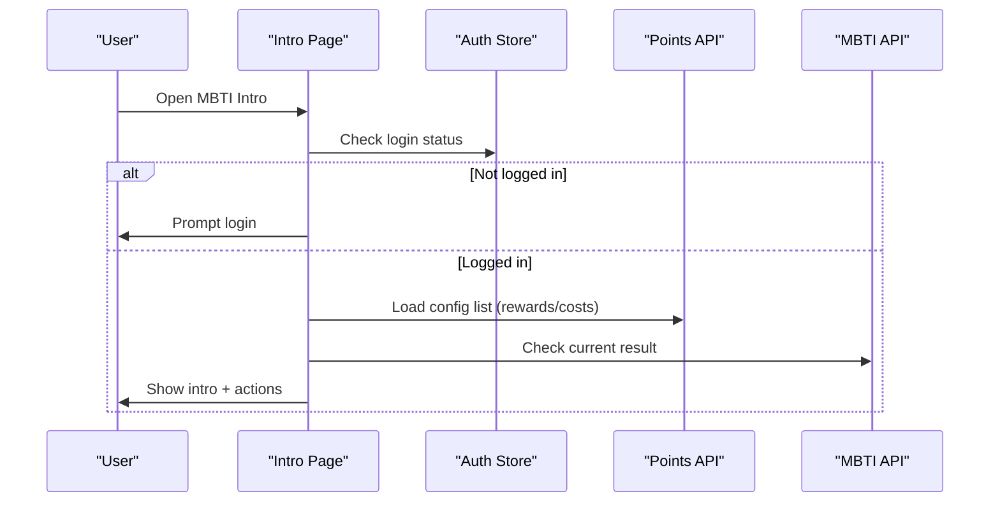
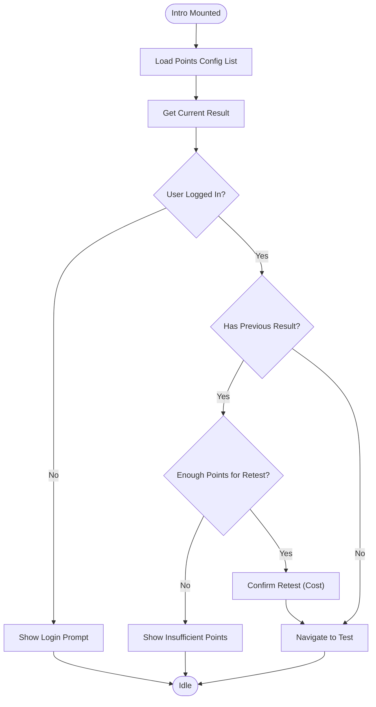
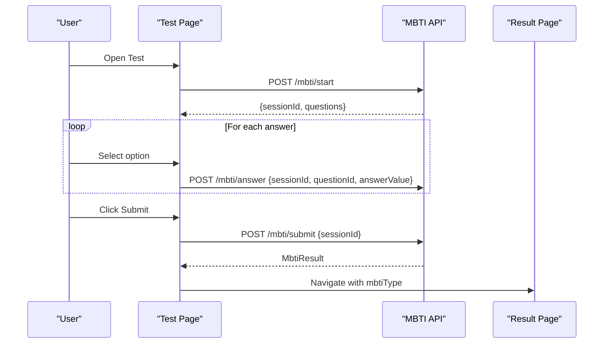
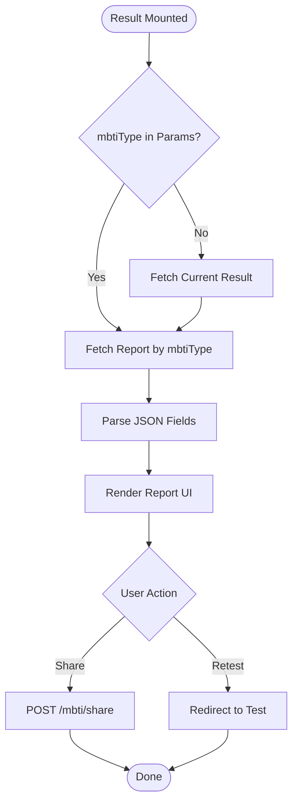
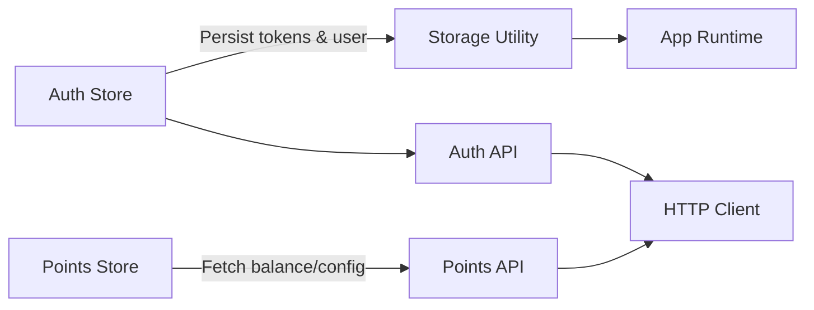
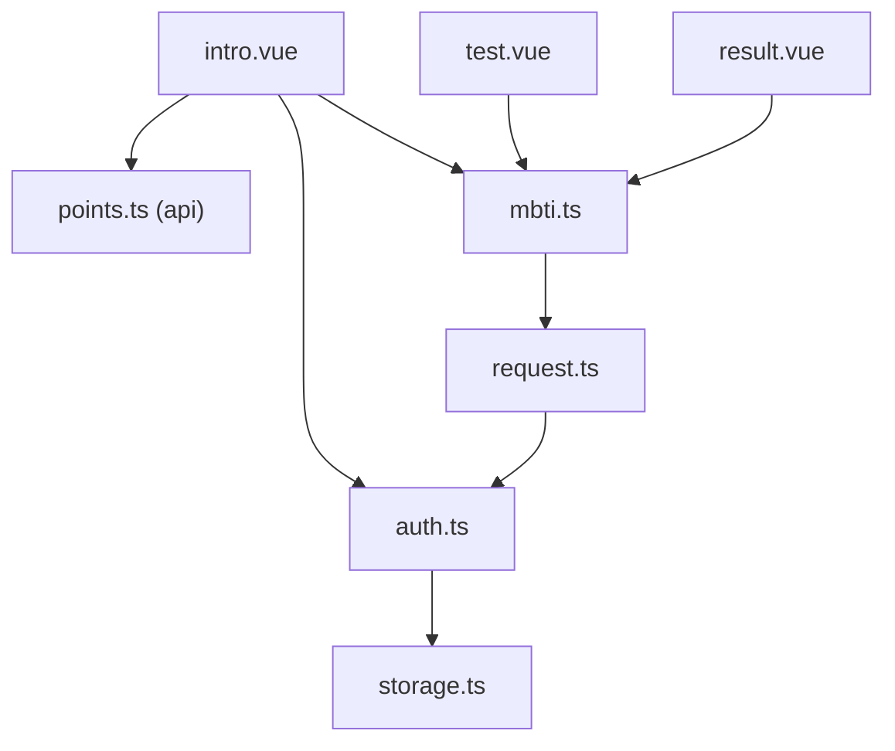

# Test Introduction & Setup

<cite>
**Referenced Files in This Document**
- [intro.vue](file://src/pages/mbti/intro.vue)
- [test.vue](file://src/pages/mbti/test.vue)
- [result.vue](file://src/pages/mbti/result.vue)
- [mbti.ts](file://src/api/mbti.ts)
- [auth.ts](file://src/stores/auth.ts)
- [points.ts](file://src/stores/points.ts)
- [points.ts](file://src/api/modules/points.ts)
- [storage.ts](file://src/utils/storage.ts)
- [backend-types.ts](file://src/types/api/backend-types.ts)
- [request.ts](file://src/api/request.ts)
</cite>

## Table of Contents
1. [Introduction](#introduction)
2. [Project Structure](#project-structure)
3. [Core Components](#core-components)
4. [Architecture Overview](#architecture-overview)
5. [Detailed Component Analysis](#detailed-component-analysis)
6. [Dependency Analysis](#dependency-analysis)
7. [Performance Considerations](#performance-considerations)
8. [Troubleshooting Guide](#troubleshooting-guide)
9. [Conclusion](#conclusion)

## Introduction
This document explains the MBTI test introduction and setup functionality. It covers:
- The introductory page that explains the personality assessment process, test duration, and instructions
- Session management for initiating, maintaining, and tracking test sessions
- API integration for starting tests and validating sessions
- User onboarding flow, prerequisites, and progress tracking
- State management for session data, user consent handling, and test initialization
- Examples for customizing test introductions, adding disclaimers, and integrating with user profiles
- Session timeout handling, test resumption capabilities, and data persistence strategies

## Project Structure
The MBTI feature is organized into three primary pages and supporting modules:
- Introductory page: explains the test, prerequisites, and starts the test
- Test page: renders questions, tracks progress, and submits answers
- Results page: displays the report, scores, and actions
- API module: defines typed endpoints for MBTI operations
- Stores: authentication and points state management
- Request layer: centralized HTTP client with token refresh and error handling



**Diagram sources**
- [intro.vue:1-180](file://src/pages/mbti/intro.vue#L1-L180)
- [test.vue:1-192](file://src/pages/mbti/test.vue#L1-L192)
- [result.vue:1-213](file://src/pages/mbti/result.vue#L1-L213)
- [mbti.ts:1-84](file://src/api/mbti.ts#L1-L84)
- [points.ts:1-55](file://src/api/modules/points.ts#L1-L55)
- [auth.ts:1-137](file://src/stores/auth.ts#L1-L137)
- [points.ts:1-72](file://src/stores/points.ts#L1-L72)
- [request.ts:90-157](file://src/api/request.ts#L90-L157)
- [storage.ts:1-26](file://src/utils/storage.ts#L1-L26)

**Section sources**
- [intro.vue:1-180](file://src/pages/mbti/intro.vue#L1-L180)
- [test.vue:1-192](file://src/pages/mbti/test.vue#L1-L192)
- [result.vue:1-213](file://src/pages/mbti/result.vue#L1-L213)
- [mbti.ts:1-84](file://src/api/mbti.ts#L1-L84)
- [points.ts:1-55](file://src/api/modules/points.ts#L1-L55)
- [auth.ts:1-137](file://src/stores/auth.ts#L1-L137)
- [points.ts:1-72](file://src/stores/points.ts#L1-L72)
- [request.ts:90-157](file://src/api/request.ts#L90-L157)
- [storage.ts:1-26](file://src/utils/storage.ts#L1-L26)

## Core Components
- Introductory page
  - Displays test metadata (number of questions, estimated time, reward)
  - Shows MBTI dimensions and tips
  - Handles login prerequisite and retest cost checks
  - Navigates to the test page or result page
- Test page
  - Initializes a session and loads questions
  - Tracks current index, selected answer, and progress
  - Submits individual answers and finalizes the test
- Results page
  - Loads the report and optional current result
  - Parses JSON fields and handles fallbacks
  - Provides sharing and retest actions
- API module
  - Defines typed contracts for MBTI operations
  - Exposes endpoints for starting, answering, submitting, reporting, current result, history, and sharing
- Authentication and points stores
  - Persist tokens and user info
  - Provide balance and configuration retrieval for MBTI rewards and costs

**Section sources**
- [intro.vue:1-180](file://src/pages/mbti/intro.vue#L1-L180)
- [test.vue:1-192](file://src/pages/mbti/test.vue#L1-L192)
- [result.vue:1-213](file://src/pages/mbti/result.vue#L1-L213)
- [mbti.ts:1-84](file://src/api/mbti.ts#L1-L84)
- [auth.ts:1-137](file://src/stores/auth.ts#L1-L137)
- [points.ts:1-72](file://src/stores/points.ts#L1-L72)

## Architecture Overview
The MBTI feature follows a layered architecture:
- UI pages orchestrate user interactions and navigation
- API module encapsulates backend contracts
- HTTP client manages authentication and retries
- Stores manage cross-cutting concerns like auth and points



**Diagram sources**
- [intro.vue:95-127](file://src/pages/mbti/intro.vue#L95-L127)
- [auth.ts:16-29](file://src/stores/auth.ts#L16-L29)
- [points.ts:49-54](file://src/api/modules/points.ts#L49-L54)
- [mbti.ts:69-72](file://src/api/mbti.ts#L69-L72)

## Detailed Component Analysis

### Introductory Page
Responsibilities:
- Present MBTI overview, dimensions, and tips
- Enforce login requirement
- Manage retest cost via points configuration
- Navigate to test or result pages

Key behaviors:
- On mount, fetch points configuration and current result
- Compute retest eligibility based on user points
- Route to test or result depending on state



**Diagram sources**
- [intro.vue:95-173](file://src/pages/mbti/intro.vue#L95-L173)
- [points.ts:49-54](file://src/api/modules/points.ts#L49-L54)
- [mbti.ts:69-72](file://src/api/mbti.ts#L69-L72)

**Section sources**
- [intro.vue:1-180](file://src/pages/mbti/intro.vue#L1-L180)
- [points.ts:49-54](file://src/api/modules/points.ts#L49-L54)
- [mbti.ts:69-72](file://src/api/mbti.ts#L69-L72)

### Test Page
Responsibilities:
- Initialize a session and load questions
- Track current question index and selected answer
- Submit answers per question and finalize the test
- Display progress and navigation controls

Key behaviors:
- On mount, call start endpoint and populate session data
- Save answers locally during navigation
- Submit answer on navigation and submit test on completion
- Redirect to results with type parameter



**Diagram sources**
- [test.vue:83-191](file://src/pages/mbti/test.vue#L83-L191)
- [mbti.ts:48-83](file://src/api/mbti.ts#L48-L83)

**Section sources**
- [test.vue:1-192](file://src/pages/mbti/test.vue#L1-L192)
- [mbti.ts:1-84](file://src/api/mbti.ts#L1-L84)

### Results Page
Responsibilities:
- Load report for a given MBTI type or current result
- Parse JSON-encoded fields and provide defaults
- Offer sharing and retest actions

Key behaviors:
- Accept mbtiType from route params or fetch current result
- Fetch report and merge with optional score data
- Handle image errors gracefully



**Diagram sources**
- [result.vue:225-354](file://src/pages/mbti/result.vue#L225-L354)
- [mbti.ts:64-83](file://src/api/mbti.ts#L64-L83)

**Section sources**
- [result.vue:1-213](file://src/pages/mbti/result.vue#L1-L213)
- [mbti.ts:1-84](file://src/api/mbti.ts#L1-L84)

### API Contracts and Integration
The MBTI API module defines strongly-typed contracts for:
- Starting a test session and retrieving questions
- Submitting single answers
- Finalizing the test and receiving results
- Retrieving reports, current results, history, and sharing

Integration points:
- HTTP client handles token refresh and unauthorized responses
- Backend types define shared structures for responses and configurations

```mermaid
classDiagram
class MbtiApi {
+startTest() ApiResponse~{sessionId, questions}~
+submitAnswer(data) ApiResponse
+submitTest(data) ApiResponse~MbtiResult~
+getReport(mbtiType) ApiResponse~MbtiReport~
+getCurrentResult() ApiResponse~MbtiResult~
+getHistory() ApiResponse~MbtiResult[]~
+shareToSquare() ApiResponse
}
class RequestClient {
+post(url, data) Promise
+get(url, params) Promise
+refreshToken() Promise
+onRefreshed(token) void
}
class BackendTypes {
<<interface>> MbtiResult
<<interface>> MbtiReport
<<interface>> PointsConfig
}
MbtiApi --> RequestClient : "uses"
MbtiApi --> BackendTypes : "returns"
```

**Diagram sources**
- [mbti.ts:1-84](file://src/api/mbti.ts#L1-L84)
- [request.ts:90-157](file://src/api/request.ts#L90-L157)
- [backend-types.ts:342-370](file://src/types/api/backend-types.ts#L342-L370)

**Section sources**
- [mbti.ts:1-84](file://src/api/mbti.ts#L1-L84)
- [request.ts:90-157](file://src/api/request.ts#L90-L157)
- [backend-types.ts:342-370](file://src/types/api/backend-types.ts#L342-L370)

### State Management and Persistence
- Authentication store persists tokens and user info, enabling seamless re-authentication and token refresh
- Points store exposes balance and configuration retrieval for MBTI rewards and retest costs
- Storage utility provides robust JSON serialization/deserialization with error handling



**Diagram sources**
- [auth.ts:73-77](file://src/stores/auth.ts#L73-L77)
- [points.ts:13-20](file://src/stores/points.ts#L13-L20)
- [storage.ts:1-26](file://src/utils/storage.ts#L1-L26)
- [request.ts:90-157](file://src/api/request.ts#L90-L157)

**Section sources**
- [auth.ts:1-137](file://src/stores/auth.ts#L1-L137)
- [points.ts:1-72](file://src/stores/points.ts#L1-L72)
- [storage.ts:1-26](file://src/utils/storage.ts#L1-L26)
- [request.ts:90-157](file://src/api/request.ts#L90-L157)

## Dependency Analysis
- Intro depends on:
  - Auth store for login state
  - Points API for configuration (rewards/costs)
  - MBTI API for current result check
- Test depends on:
  - MBTI API for session lifecycle
- Result depends on:
  - MBTI API for report and current result
- API layer depends on:
  - HTTP client for transport and token refresh
- Stores depend on:
  - Storage utility for persistence



**Diagram sources**
- [intro.vue:82-85](file://src/pages/mbti/intro.vue#L82-L85)
- [test.vue](file://src/pages/mbti/test.vue#L54)
- [result.vue](file://src/pages/mbti/result.vue#L218)
- [mbti.ts](file://src/api/mbti.ts#L1)
- [auth.ts:1-137](file://src/stores/auth.ts#L1-L137)
- [points.ts:1-72](file://src/stores/points.ts#L1-L72)
- [request.ts:90-157](file://src/api/request.ts#L90-L157)
- [storage.ts:1-26](file://src/utils/storage.ts#L1-L26)

**Section sources**
- [intro.vue:82-85](file://src/pages/mbti/intro.vue#L82-L85)
- [test.vue](file://src/pages/mbti/test.vue#L54)
- [result.vue](file://src/pages/mbti/result.vue#L218)
- [mbti.ts:1-84](file://src/api/mbti.ts#L1-L84)
- [auth.ts:1-137](file://src/stores/auth.ts#L1-L137)
- [points.ts:1-72](file://src/stores/points.ts#L1-L72)
- [request.ts:90-157](file://src/api/request.ts#L90-L157)
- [storage.ts:1-26](file://src/utils/storage.ts#L1-L26)

## Performance Considerations
- Minimize network requests by batching where appropriate and caching lightweight UI state
- Debounce or throttle frequent UI updates (e.g., progress rendering)
- Use lazy loading for images in result pages to reduce initial payload
- Avoid unnecessary re-renders by leveraging computed properties and reactive refs
- Cache session data locally during navigation to prevent repeated server fetches

## Troubleshooting Guide
Common issues and resolutions:
- Unauthorized access after token expiration
  - The HTTP client automatically attempts token refresh; if it fails, the app clears stored credentials and redirects to login
- Loading failures during test initiation
  - The test page shows a modal and navigates back on failure; ensure network connectivity and backend availability
- Result loading errors
  - The result page falls back to default scores when current result is unavailable and parses JSON fields safely
- Points configuration not applied
  - Verify points configuration keys and ensure the config list endpoint returns expected values

**Section sources**
- [request.ts:90-157](file://src/api/request.ts#L90-L157)
- [test.vue:99-110](file://src/pages/mbti/test.vue#L99-L110)
- [result.vue:295-306](file://src/pages/mbti/result.vue#L295-L306)

## Conclusion
The MBTI test introduction and setup feature integrates cleanly across UI pages, API contracts, and state management. It enforces prerequisites, manages sessions, and provides a robust user experience with progress tracking, retest capabilities, and result sharing. The architecture supports customization of introductory content, disclaimers, and user profile integration while maintaining reliability through centralized HTTP handling and persistent state.