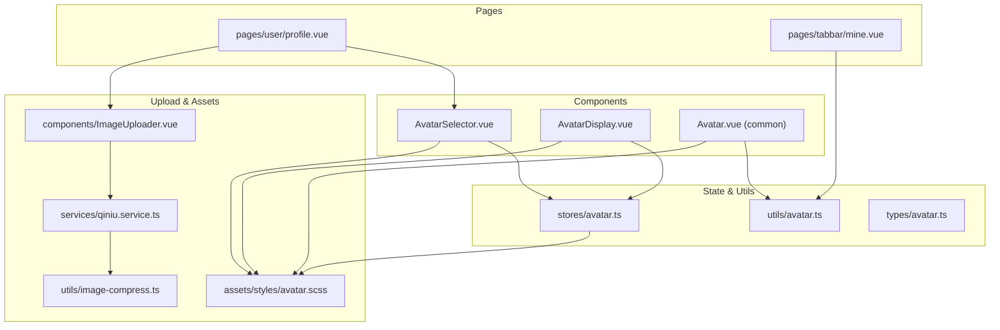
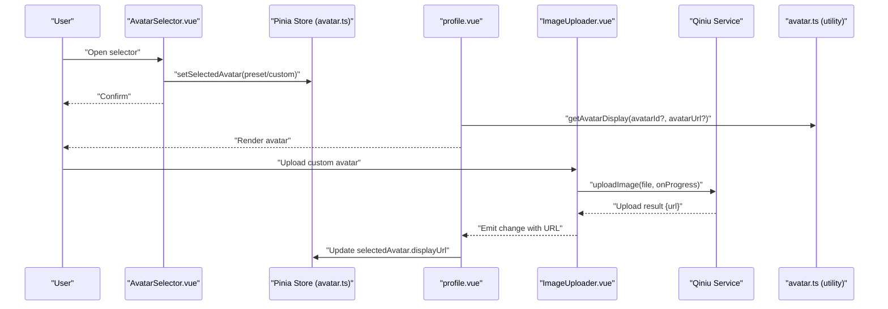
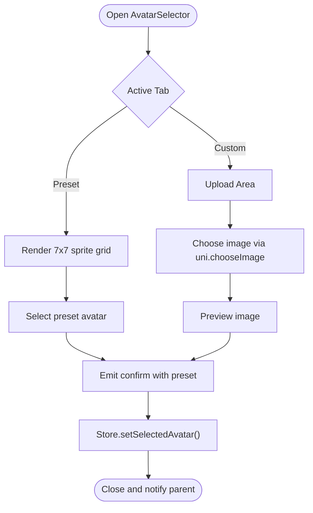
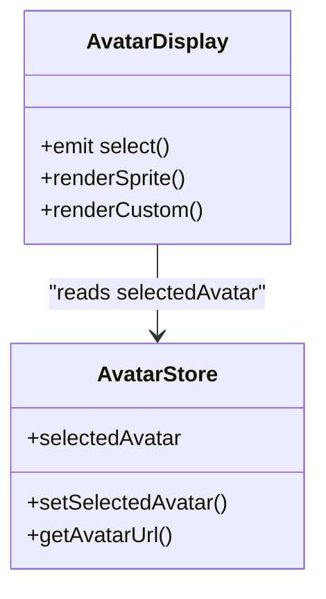
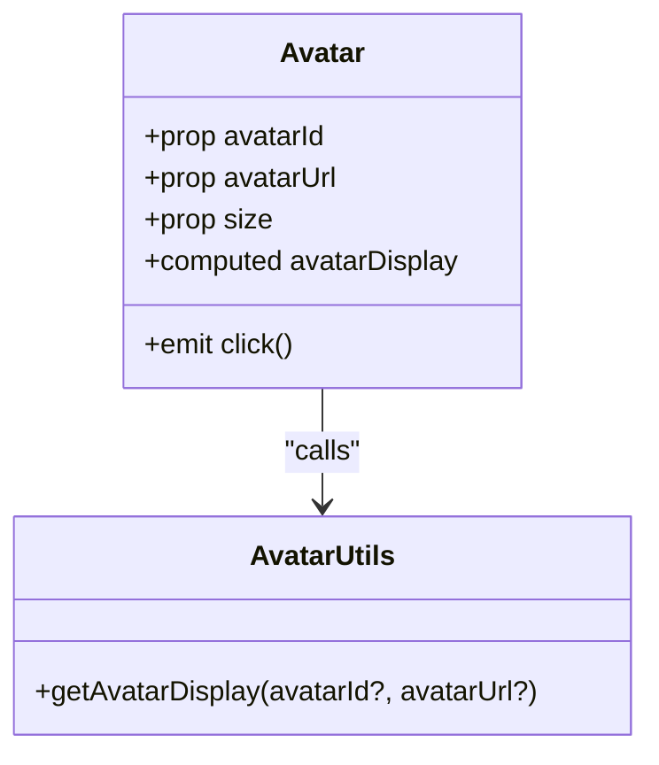
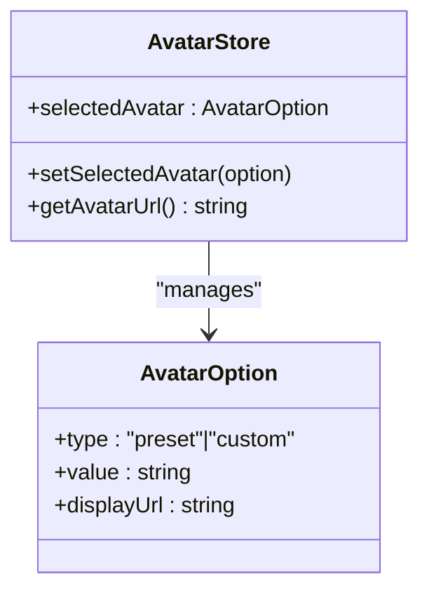
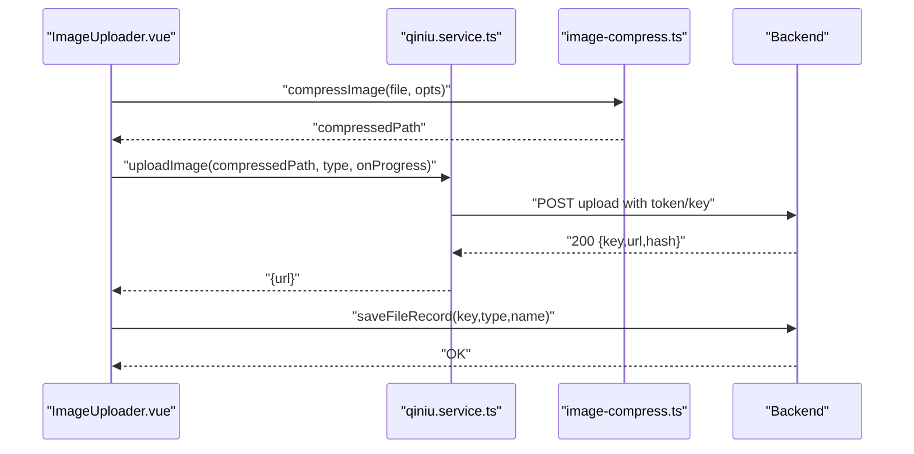
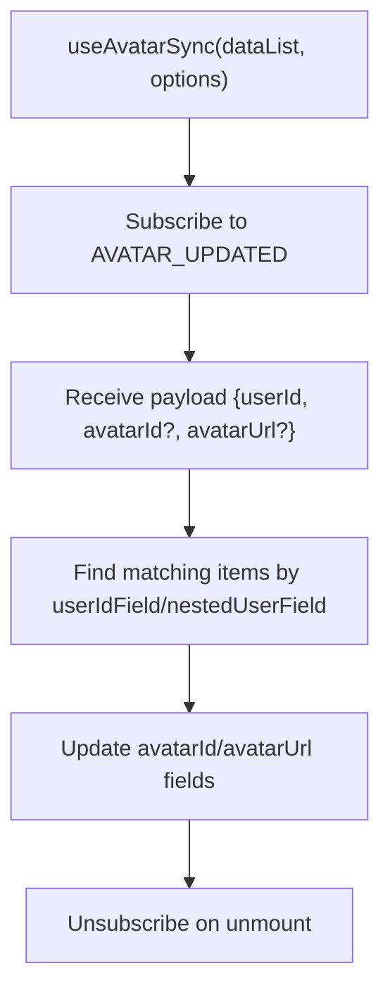
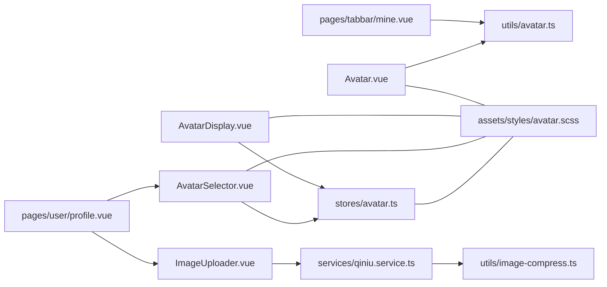

# Avatar Management System

<cite>
**Referenced Files in This Document**
- [AvatarSelector.vue](file://src/components/business/AvatarSelector.vue)
- [AvatarDisplay.vue](file://src/components/business/AvatarDisplay.vue)
- [Avatar.vue](file://src/components/common/Avatar.vue)
- [useAvatarSync.ts](file://src/composables/useAvatarSync.ts)
- [avatar.ts (store)](file://src/stores/avatar.ts)
- [avatar.ts (utility)](file://src/utils/avatar.ts)
- [avatar.scss](file://src/assets/styles/avatar.scss)
- [profile.vue](file://src/pages/user/profile.vue)
- [mine.vue](file://src/pages/tabbar/mine.vue)
- [ImageUploader.vue](file://src/components/ImageUploader.vue)
- [qiniu.service.ts](file://src/services/qiniu.service.ts)
- [image-compress.ts](file://src/utils/image-compress.ts)
- [avatar.ts (types)](file://src/types/avatar.ts)
- [AVATAR_PLAN.md](file://docs/AVATAR_PLAN.md)
</cite>

## Table of Contents
1. [Introduction](#introduction)
2. [Project Structure](#project-structure)
3. [Core Components](#core-components)
4. [Architecture Overview](#architecture-overview)
5. [Detailed Component Analysis](#detailed-component-analysis)
6. [Dependency Analysis](#dependency-analysis)
7. [Performance Considerations](#performance-considerations)
8. [Troubleshooting Guide](#troubleshooting-guide)
9. [Conclusion](#conclusion)
10. [Appendices](#appendices)

## Introduction
This document describes the avatar management system, covering the avatar selection interface, avatar display components, upload workflow, styling system, synchronization across platforms, and customization guidelines. It synthesizes the current implementation present in the repository and provides practical guidance for extending and maintaining the avatar feature.

## Project Structure
The avatar system spans several layers:
- UI components for selection and display
- State management for avatar selection
- Utility functions for avatar resolution and MBTI avatar mapping
- Styling for consistent rendering and responsive behavior
- Page integrations for profile and user home
- Upload service and compression utilities for custom avatar uploads

**Diagram sources**
- [AvatarSelector.vue:1-286](file://src/components/business/AvatarSelector.vue#L1-L286)
- [AvatarDisplay.vue:1-87](file://src/components/business/AvatarDisplay.vue#L1-L87)
- [Avatar.vue:1-95](file://src/components/common/Avatar.vue#L1-L95)
- [avatar.ts (store):1-52](file://src/stores/avatar.ts#L1-L52)
- [avatar.ts (utility):1-93](file://src/utils/avatar.ts#L1-L93)
- [avatar.ts (types):1-34](file://src/types/avatar.ts#L1-L34)
- [profile.vue:1-717](file://src/pages/user/profile.vue#L1-L717)
- [mine.vue:1-697](file://src/pages/tabbar/mine.vue#L1-L697)
- [ImageUploader.vue:1-242](file://src/components/ImageUploader.vue#L1-L242)
- [qiniu.service.ts:1-126](file://src/services/qiniu.service.ts#L1-L126)
- [image-compress.ts:1-87](file://src/utils/image-compress.ts#L1-L87)
- [avatar.scss:1-753](file://src/assets/styles/avatar.scss#L1-L753)

**Section sources**
- [AvatarSelector.vue:1-286](file://src/components/business/AvatarSelector.vue#L1-L286)
- [AvatarDisplay.vue:1-87](file://src/components/business/AvatarDisplay.vue#L1-L87)
- [Avatar.vue:1-95](file://src/components/common/Avatar.vue#L1-L95)
- [avatar.ts (store):1-52](file://src/stores/avatar.ts#L1-L52)
- [avatar.ts (utility):1-93](file://src/utils/avatar.ts#L1-L93)
- [avatar.ts (types):1-34](file://src/types/avatar.ts#L1-L34)
- [profile.vue:1-717](file://src/pages/user/profile.vue#L1-L717)
- [mine.vue:1-697](file://src/pages/tabbar/mine.vue#L1-L697)
- [ImageUploader.vue:1-242](file://src/components/ImageUploader.vue#L1-L242)
- [qiniu.service.ts:1-126](file://src/services/qiniu.service.ts#L1-L126)
- [image-compress.ts:1-87](file://src/utils/image-compress.ts#L1-L87)
- [avatar.scss:1-753](file://src/assets/styles/avatar.scss#L1-L753)

## Core Components
- AvatarSelector: Modal-based selector supporting preset (sprite) and custom upload modes with preview and selection persistence.
- AvatarDisplay: Clickable avatar display with overlay edit affordance, delegating to the global avatar store.
- Avatar (common): Reusable avatar component for various contexts with size variants and MBTI preset support.
- Avatar Store: Centralized selection state persisted locally, exposing getters for display URLs or sprite classes.
- Avatar Utilities: Resolve avatar display info from either preset or custom URL, including MBTI mapping and defaults.
- Upload Pipeline: ImageUploader component integrates with Qiniu service for secure, optimized uploads with compression and progress feedback.
- Synchronization Hook: useAvatarSync listens to global events to update lists when a user’s avatar changes.

**Section sources**
- [AvatarSelector.vue:1-286](file://src/components/business/AvatarSelector.vue#L1-L286)
- [AvatarDisplay.vue:1-87](file://src/components/business/AvatarDisplay.vue#L1-L87)
- [Avatar.vue:1-95](file://src/components/common/Avatar.vue#L1-L95)
- [avatar.ts (store):1-52](file://src/stores/avatar.ts#L1-L52)
- [avatar.ts (utility):1-93](file://src/utils/avatar.ts#L1-L93)
- [ImageUploader.vue:1-242](file://src/components/ImageUploader.vue#L1-L242)
- [qiniu.service.ts:1-126](file://src/services/qiniu.service.ts#L1-L126)
- [useAvatarSync.ts:1-72](file://src/composables/useAvatarSync.ts#L1-L72)

## Architecture Overview
The avatar system follows a unidirectional data flow:
- Users interact with AvatarSelector to pick a preset or upload a custom avatar.
- Selection updates the Pinia store and triggers local persistence.
- AvatarDisplay and Avatar components render the selected avatar consistently across the app.
- For custom uploads, ImageUploader delegates to Qiniu service, which compresses images and validates sizes before upload.
- useAvatarSync listens to global events to refresh avatar displays in lists without manual polling.

**Diagram sources**
- [AvatarSelector.vue:1-286](file://src/components/business/AvatarSelector.vue#L1-L286)
- [avatar.ts (store):1-52](file://src/stores/avatar.ts#L1-L52)
- [profile.vue:1-717](file://src/pages/user/profile.vue#L1-L717)
- [ImageUploader.vue:1-242](file://src/components/ImageUploader.vue#L1-L242)
- [qiniu.service.ts:1-126](file://src/services/qiniu.service.ts#L1-L126)
- [avatar.ts (utility):1-93](file://src/utils/avatar.ts#L1-L93)

## Detailed Component Analysis

### AvatarSelector Component
- Tabs: Preset (sprite grid) and Custom (upload area).
- Preset grid: 7x7 grid of sprite positions mapped via SCSS classes.
- Custom upload: Uses uni.chooseImage, previews the chosen image, and sets a temporary selection.
- Confirmation: Persists selection to the avatar store and emits confirm with the chosen option.
- Styling: SCSS defines modal layout, tabs, grid, upload area, and action buttons.

**Diagram sources**
- [AvatarSelector.vue:1-286](file://src/components/business/AvatarSelector.vue#L1-L286)
- [avatar.scss:27-68](file://src/assets/styles/avatar.scss#L27-L68)

**Section sources**
- [AvatarSelector.vue:1-286](file://src/components/business/AvatarSelector.vue#L1-L286)
- [avatar.scss:27-68](file://src/assets/styles/avatar.scss#L27-L68)

### AvatarDisplay Component
- Renders either a sprite avatar (based on selected preset) or a custom avatar image.
- Overlay edit affordance triggers a select event to open the selector.
- Uses the global avatar store for current selection.

**Diagram sources**
- [AvatarDisplay.vue:1-87](file://src/components/business/AvatarDisplay.vue#L1-L87)
- [avatar.ts (store):1-52](file://src/stores/avatar.ts#L1-L52)

**Section sources**
- [AvatarDisplay.vue:1-87](file://src/components/business/AvatarDisplay.vue#L1-L87)
- [avatar.ts (store):1-52](file://src/stores/avatar.ts#L1-L52)

### Avatar (Common) Component
- Accepts avatarId or avatarUrl and resolves display info via utility.
- Supports small/medium/large sizes with proportional dimensions.
- Renders MBTI preset avatar with gradient background or custom image.

**Diagram sources**
- [Avatar.vue:1-95](file://src/components/common/Avatar.vue#L1-L95)
- [avatar.ts (utility):53-92](file://src/utils/avatar.ts#L53-L92)

**Section sources**
- [Avatar.vue:1-95](file://src/components/common/Avatar.vue#L1-L95)
- [avatar.ts (utility):53-92](file://src/utils/avatar.ts#L53-L92)

### Avatar Store
- Holds the currently selected avatar option.
- Provides a getter to return sprite class names for presets or the display URL for custom avatars.
- Persisted across sessions.

**Diagram sources**
- [avatar.ts (store):1-52](file://src/stores/avatar.ts#L1-L52)
- [avatar.ts (types):9-16](file://src/types/avatar.ts#L9-L16)

**Section sources**
- [avatar.ts (store):1-52](file://src/stores/avatar.ts#L1-L52)
- [avatar.ts (types):9-16](file://src/types/avatar.ts#L9-L16)

### Avatar Utilities and Types
- MBTI avatar configuration and lookup helpers.
- getAvatarDisplay resolves either a preset (with icon and MBTI type) or a custom URL, with a default fallback.

**Section sources**
- [avatar.ts (utility):1-93](file://src/utils/avatar.ts#L1-L93)
- [avatar.ts (types):1-34](file://src/types/avatar.ts#L1-L34)

### Upload Workflow and Storage Optimization
- ImageUploader integrates with Qiniu service:
  - Validates file size and compresses images before upload.
  - Streams progress updates per image.
  - Saves file records after successful upload.
- Compression and validation:
  - compressImage scales to configured max dimensions and applies quality reduction.
  - validateFileSize checks against configured limits.

**Diagram sources**
- [ImageUploader.vue:1-242](file://src/components/ImageUploader.vue#L1-L242)
- [qiniu.service.ts:1-126](file://src/services/qiniu.service.ts#L1-L126)
- [image-compress.ts:1-87](file://src/utils/image-compress.ts#L1-L87)

**Section sources**
- [ImageUploader.vue:1-242](file://src/components/ImageUploader.vue#L1-L242)
- [qiniu.service.ts:1-126](file://src/services/qiniu.service.ts#L1-L126)
- [image-compress.ts:1-87](file://src/utils/image-compress.ts#L1-L87)

### Avatar Synchronization Across Platforms
- useAvatarSync subscribes to a global event to update avatar fields in lists.
- Supports flexible field names and nested user objects.
- Automatically cleans up listeners on component unmount.

**Diagram sources**
- [useAvatarSync.ts:1-72](file://src/composables/useAvatarSync.ts#L1-L72)

**Section sources**
- [useAvatarSync.ts:1-72](file://src/composables/useAvatarSync.ts#L1-L72)

## Dependency Analysis
- Components depend on the avatar store for selection state.
- AvatarDisplay and Avatar rely on avatar utilities for display resolution.
- Profile and Mine pages integrate avatar components and upload flows.
- Upload pipeline depends on Qiniu service and compression utilities.
- Styles are shared via avatar.scss for consistent rendering.

**Diagram sources**
- [AvatarSelector.vue:1-286](file://src/components/business/AvatarSelector.vue#L1-L286)
- [AvatarDisplay.vue:1-87](file://src/components/business/AvatarDisplay.vue#L1-L87)
- [Avatar.vue:1-95](file://src/components/common/Avatar.vue#L1-L95)
- [avatar.ts (store):1-52](file://src/stores/avatar.ts#L1-L52)
- [avatar.ts (utility):1-93](file://src/utils/avatar.ts#L1-L93)
- [profile.vue:1-717](file://src/pages/user/profile.vue#L1-L717)
- [mine.vue:1-697](file://src/pages/tabbar/mine.vue#L1-L697)
- [ImageUploader.vue:1-242](file://src/components/ImageUploader.vue#L1-L242)
- [qiniu.service.ts:1-126](file://src/services/qiniu.service.ts#L1-L126)
- [image-compress.ts:1-87](file://src/utils/image-compress.ts#L1-L87)
- [avatar.scss:1-753](file://src/assets/styles/avatar.scss#L1-L753)

**Section sources**
- [AvatarSelector.vue:1-286](file://src/components/business/AvatarSelector.vue#L1-L286)
- [AvatarDisplay.vue:1-87](file://src/components/business/AvatarDisplay.vue#L1-L87)
- [Avatar.vue:1-95](file://src/components/common/Avatar.vue#L1-L95)
- [avatar.ts (store):1-52](file://src/stores/avatar.ts#L1-L52)
- [avatar.ts (utility):1-93](file://src/utils/avatar.ts#L1-L93)
- [profile.vue:1-717](file://src/pages/user/profile.vue#L1-L717)
- [mine.vue:1-697](file://src/pages/tabbar/mine.vue#L1-L697)
- [ImageUploader.vue:1-242](file://src/components/ImageUploader.vue#L1-L242)
- [qiniu.service.ts:1-126](file://src/services/qiniu.service.ts#L1-L126)
- [image-compress.ts:1-87](file://src/utils/image-compress.ts#L1-L87)
- [avatar.scss:1-753](file://src/assets/styles/avatar.scss#L1-L753)

## Performance Considerations
- Sprite-based preset avatars reduce HTTP requests and improve rendering performance.
- Image compression reduces payload size and speeds up uploads.
- Progress indicators keep users informed during multi-upload scenarios.
- Persistent avatar store avoids redundant computations and network calls.

## Troubleshooting Guide
- Upload fails due to size or unsupported format:
  - Verify validateFileSize and compression thresholds.
  - Ensure the chosen image meets backend constraints.
- Avatar does not update across screens:
  - Confirm useAvatarSync is attached to the list and the global event is emitted with correct payload.
- Preset avatar not visible:
  - Check sprite positioning classes and that the sprite image path is correct.
- Custom avatar not displaying:
  - Ensure displayUrl is set after upload and that the URL is accessible.

**Section sources**
- [image-compress.ts:78-87](file://src/utils/image-compress.ts#L78-L87)
- [qiniu.service.ts:42-87](file://src/services/qiniu.service.ts#L42-L87)
- [useAvatarSync.ts:27-58](file://src/composables/useAvatarSync.ts#L27-L58)
- [avatar.scss:1-25](file://src/assets/styles/avatar.scss#L1-L25)
- [profile.vue:283-294](file://src/pages/user/profile.vue#L283-L294)

## Conclusion
The avatar management system provides a cohesive solution for selecting, uploading, storing, and synchronizing avatars across the platform. It leverages sprite-based rendering for presets, robust upload pipelines for custom avatars, and a centralized store with optional persistence. The styling system ensures consistent visuals, while hooks and utilities enable seamless integration and updates across components.

## Appendices

### Styling System for Avatars
- Sprite-based presets: 7x7 grid with precise background positioning.
- Custom avatar sizing: Consistent border-radius and object-fit behavior.
- Responsive sizing: Component-level size classes and page-level tokens.
- Edit overlays: Subtle hover and active states for interactive feedback.

**Section sources**
- [avatar.scss:1-753](file://src/assets/styles/avatar.scss#L1-L753)
- [Avatar.vue:44-95](file://src/components/common/Avatar.vue#L44-L95)
- [AvatarDisplay.vue:44-87](file://src/components/business/AvatarDisplay.vue#L44-L87)
- [profile.vue:351-717](file://src/pages/user/profile.vue#L351-L717)

### Implementing Custom Avatar Themes
- Extend MBTI presets by adding new entries to the MBTI avatar configuration and ensuring sprite coordinates align with the sprite sheet.
- Customize default avatar fallback by updating the default path in avatar utilities.

**Section sources**
- [avatar.ts (utility):12-29](file://src/utils/avatar.ts#L12-L29)
- [avatar.ts (utility):86-92](file://src/utils/avatar.ts#L86-L92)

### Placeholder Handling
- Default avatar fallback is applied when no custom URL is available.
- Placeholder image path is configurable and used in pages and components.

**Section sources**
- [avatar.ts (utility):86-92](file://src/utils/avatar.ts#L86-L92)
- [profile.vue:16-18](file://src/pages/user/profile.vue#L16-L18)
- [mine.vue:15-17](file://src/pages/tabbar/mine.vue#L15-L17)

### Accessibility Features
- Interactive elements use appropriate focus states and touch targets sized for mobile.
- Visual feedback for selections and actions improves usability.

**Section sources**
- [AvatarSelector.vue:155-286](file://src/components/business/AvatarSelector.vue#L155-L286)
- [AvatarDisplay.vue:44-87](file://src/components/business/AvatarDisplay.vue#L44-L87)
- [Avatar.vue:44-95](file://src/components/common/Avatar.vue#L44-L95)