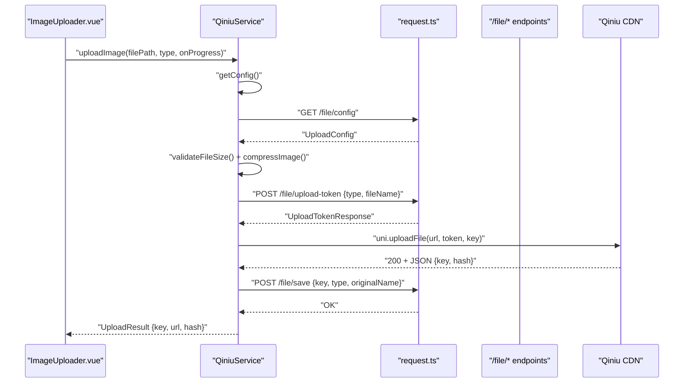
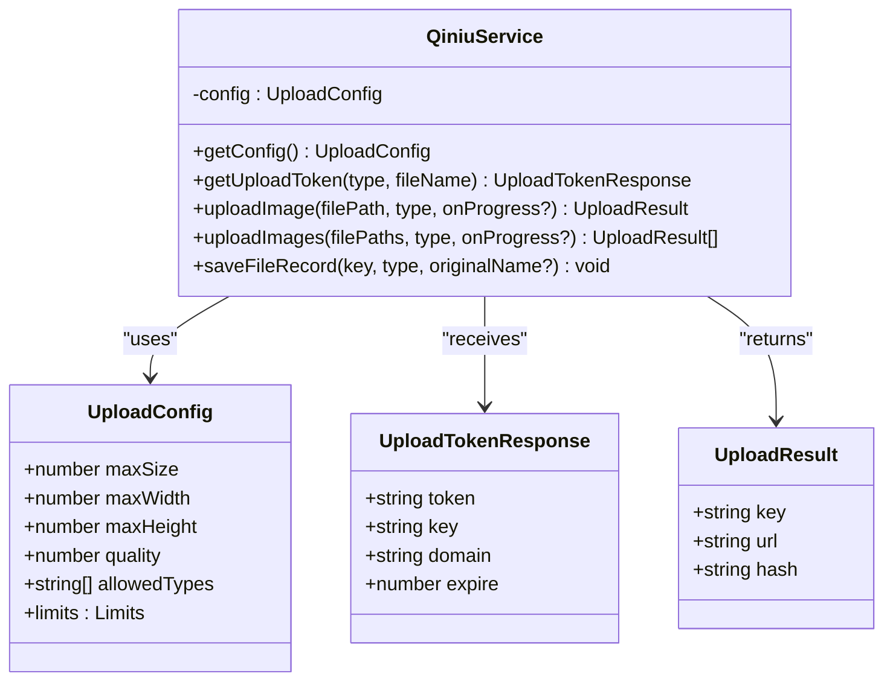
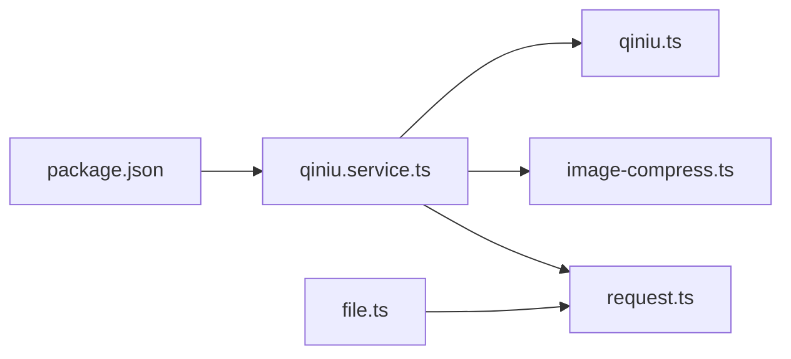

# Cloud Storage Integration

<cite>
**Referenced Files in This Document**
- [qiniu.service.ts](file://src/services/qiniu.service.ts)
- [qiniu.ts](file://src/types/qiniu.ts)
- [image-compress.ts](file://src/utils/image-compress.ts)
- [request.ts](file://src/api/request.ts)
- [file.ts](file://src/api/modules/file.ts)
- [ImageUploader.vue](file://src/components/ImageUploader.vue)
- [upload-demo.vue](file://src/pages/examples/upload-demo.vue)
- [index.ts](file://src/config/index.ts)
- [package.json](file://package.json)
- [test-qiniu-upload.sh](file://test-qiniu-upload.sh)
</cite>

## Table of Contents
1. [Introduction](#introduction)
2. [Project Structure](#project-structure)
3. [Core Components](#core-components)
4. [Architecture Overview](#architecture-overview)
5. [Detailed Component Analysis](#detailed-component-analysis)
6. [Dependency Analysis](#dependency-analysis)
7. [Performance Considerations](#performance-considerations)
8. [Troubleshooting Guide](#troubleshooting-guide)
9. [Conclusion](#conclusion)

## Introduction
This document describes the Qiniu cloud storage integration system used by the application. It focuses on the QiniuService class implementation, including configuration retrieval, upload token generation, and file upload processes. It also documents upload configuration parameters (size limits, dimensions, and quality), the token-based authentication system, security considerations, examples of single and batch uploads, progress tracking callbacks, error handling strategies, and integration with UniApp's uploadFile API across platforms.

## Project Structure
The cloud storage integration spans several modules:
- Services: QiniuService orchestrates configuration retrieval, token acquisition, compression, and upload.
- Utilities: Image compression and file size validation utilities prepare images for upload.
- API Layer: Unified request utility handles authentication, retries, and error feedback.
- Components: ImageUploader.vue provides a UI for selecting, previewing, and uploading images.
- Pages: Example page demonstrates usage scenarios for different upload types.
- Types: Strongly typed interfaces define upload configuration, tokens, progress, and results.
- Config: Environment-driven API base URLs and timeouts.

```mermaid
graph TB
subgraph "Frontend"
UI["ImageUploader.vue"]
Demo["upload-demo.vue"]
end
subgraph "Services"
QService["QiniuService (qiniu.service.ts)"]
end
subgraph "Utilities"
ImgComp["image-compress.ts"]
end
subgraph "API Layer"
Req["request.ts"]
FileAPI["file.ts"]
end
subgraph "Types"
Types["qiniu.ts"]
end
subgraph "Config"
Cfg["config/index.ts"]
end
UI --> QService
Demo --> UI
QService --> ImgComp
QService --> Req
QService --> Types
FileAPI --> Req
Req --> Cfg
```

**Diagram sources**
- [qiniu.service.ts:12-126](file://src/services/qiniu.service.ts#L12-L126)
- [image-compress.ts:1-87](file://src/utils/image-compress.ts#L1-L87)
- [request.ts:1-228](file://src/api/request.ts#L1-L228)
- [file.ts:1-335](file://src/api/modules/file.ts#L1-L335)
- [qiniu.ts:1-38](file://src/types/qiniu.ts#L1-L38)
- [index.ts:1-11](file://src/config/index.ts#L1-L11)

**Section sources**
- [qiniu.service.ts:12-126](file://src/services/qiniu.service.ts#L12-L126)
- [image-compress.ts:1-87](file://src/utils/image-compress.ts#L1-L87)
- [request.ts:1-228](file://src/api/request.ts#L1-L228)
- [file.ts:1-335](file://src/api/modules/file.ts#L1-L335)
- [qiniu.ts:1-38](file://src/types/qiniu.ts#L1-L38)
- [index.ts:1-11](file://src/config/index.ts#L1-L11)

## Core Components
- QiniuService: Central class managing upload lifecycle, including configuration caching, token retrieval, compression, and upload via uni.uploadFile.
- Upload configuration: Defines max size, dimensions, quality, allowed types, and per-type limits.
- Token-based authentication: Backend issues short-lived tokens with keys and domains for direct upload.
- Progress tracking: Callbacks expose upload progress percentages for UI updates.
- Batch uploads: Sequential processing of multiple files with per-file progress reporting.

**Section sources**
- [qiniu.service.ts:12-126](file://src/services/qiniu.service.ts#L12-L126)
- [qiniu.ts:15-37](file://src/types/qiniu.ts#L15-L37)

## Architecture Overview
The upload pipeline integrates frontend services with backend APIs and Qiniu’s CDN. The flow includes retrieving upload configuration, validating and compressing images, obtaining a temporary upload token, uploading via uni.uploadFile, and persisting records on the backend.



**Diagram sources**
- [qiniu.service.ts:42-122](file://src/services/qiniu.service.ts#L42-L122)
- [request.ts:75-208](file://src/api/request.ts#L75-L208)
- [file.ts:259-278](file://src/api/modules/file.ts#L259-L278)

## Detailed Component Analysis

### QiniuService Implementation
QiniuService encapsulates the upload workflow:
- Configuration caching: getConfig caches UploadConfig to avoid repeated network calls.
- Token retrieval: getUploadToken posts type and optional filename to obtain a short-lived token.
- Single upload: uploadImage validates size, compresses image, obtains token, and performs uni.uploadFile. On success, constructs the public URL using domain and returned key.
- Batch upload: uploadImages iterates over file paths, invoking uploadImage for each and aggregating results.
- Record saving: saveFileRecord persists metadata after successful upload.



**Diagram sources**
- [qiniu.service.ts:12-126](file://src/services/qiniu.service.ts#L12-L126)
- [qiniu.ts:15-37](file://src/types/qiniu.ts#L15-L37)

**Section sources**
- [qiniu.service.ts:12-126](file://src/services/qiniu.service.ts#L12-L126)
- [qiniu.ts:1-38](file://src/types/qiniu.ts#L1-L38)

### Upload Configuration Parameters
Upload configuration defines client-side constraints and limits:
- maxSize: Maximum allowed file size in bytes.
- maxWidth/maxHeight: Target dimensions for resized images.
- quality: Compression quality factor applied during resizing.
- allowedTypes: MIME/type whitelist enforced by the backend.
- limits.square/album: Per-type upload quantity limits.

These values are fetched via getConfig and influence both validation and compression behavior.

**Section sources**
- [qiniu.ts:15-25](file://src/types/qiniu.ts#L15-L25)
- [qiniu.service.ts:47-58](file://src/services/qiniu.service.ts#L47-L58)

### Token-Based Authentication and Security
- Tokens are obtained via POST /file/upload-token with type and filename.
- Each token includes token, key, domain, and expiration.
- The upload proceeds directly to Qiniu using uni.uploadFile with token and key in formData.
- After successful upload, the backend is notified via /file/save to persist metadata.

Security considerations:
- Tokens are short-lived and bound to a specific key and domain.
- Never expose tokens in logs or client-side state unnecessarily.
- Validate and compress images client-side to reduce payload and potential abuse.
- Enforce allowedTypes and maxSize on both client and server.

**Section sources**
- [qiniu.service.ts:29-40](file://src/services/qiniu.service.ts#L29-L40)
- [qiniu.service.ts:63-86](file://src/services/qiniu.service.ts#L63-L86)
- [file.ts:259-262](file://src/api/modules/file.ts#L259-L262)

### Integration with UniApp's uploadFile API
- QiniuService uses uni.uploadFile to upload compressed images directly to Qiniu.
- FormData includes token and key; name is set to "file".
- The service parses the 200 OK response to extract key and hash, then constructs the public URL using domain and key.
- saveFileRecord is called afterward to persist metadata on the backend.

Cross-platform compatibility:
- The codebase also includes a parallel implementation in file.ts that supports H5 and Mini Program environments differently. This demonstrates how uni.uploadFile is adapted across platforms.

**Section sources**
- [qiniu.service.ts:63-86](file://src/services/qiniu.service.ts#L63-L86)
- [file.ts:164-229](file://src/api/modules/file.ts#L164-L229)

### Examples: Single and Batch Uploads
- Single upload: ImageUploader.vue triggers QiniuService.uploadImage, updates progress, and saves the file record.
- Batch upload: uploadImages loops through file paths, invoking uploadImage for each and aggregating results.

Progress tracking:
- onProgress callback receives UploadProgress with percent, loaded, and total bytes.
- ImageUploader.vue binds progress to UI overlays for visual feedback.

**Section sources**
- [ImageUploader.vue:78-131](file://src/components/ImageUploader.vue#L78-L131)
- [qiniu.service.ts:89-110](file://src/services/qiniu.service.ts#L89-L110)
- [qiniu.ts:27-31](file://src/types/qiniu.ts#L27-L31)

### Error Handling Strategies
- Network and HTTP errors: request.ts centralizes toast notifications and rejection of failed requests.
- Token refresh: request.ts intercepts 401 responses, refreshes tokens, and retries original requests transparently.
- Upload failures: QiniuService rejects on non-200 responses or on uni.uploadFile failure; ImageUploader.vue displays a toast and removes failed items from the UI.

**Section sources**
- [request.ts:75-208](file://src/api/request.ts#L75-L208)
- [qiniu.service.ts:72-84](file://src/services/qiniu.service.ts#L72-L84)
- [ImageUploader.vue:116-127](file://src/components/ImageUploader.vue#L116-L127)

## Dependency Analysis
The system relies on:
- qiniu-js library for CDN operations (referenced in package.json).
- UniApp APIs for file selection, compression, and upload.
- Backend endpoints for configuration, token issuance, and record persistence.



**Diagram sources**
- [package.json:73-73](file://package.json#L73-L73)
- [qiniu.service.ts:1-10](file://src/services/qiniu.service.ts#L1-L10)
- [request.ts:1-24](file://src/api/request.ts#L1-L24)
- [image-compress.ts:1-5](file://src/utils/image-compress.ts#L1-L5)
- [qiniu.ts:1-10](file://src/types/qiniu.ts#L1-L10)
- [file.ts:1-2](file://src/api/modules/file.ts#L1-L2)

**Section sources**
- [package.json:73-73](file://package.json#L73-L73)
- [qiniu.service.ts:1-10](file://src/services/qiniu.service.ts#L1-L10)
- [request.ts:1-24](file://src/api/request.ts#L1-L24)
- [image-compress.ts:1-5](file://src/utils/image-compress.ts#L1-L5)
- [qiniu.ts:1-10](file://src/types/qiniu.ts#L1-L10)
- [file.ts:1-2](file://src/api/modules/file.ts#L1-L2)

## Performance Considerations
- Client-side compression reduces payload size and upload time while respecting configured maxWidth, maxHeight, and quality.
- Configuration caching avoids redundant network calls to /file/config.
- Batch uploads process sequentially; consider parallelizing with concurrency limits if needed.
- Use appropriate timeouts and retry strategies via the unified request utility.

## Troubleshooting Guide
Common upload failures and resolutions:
- File too large: Ensure validateFileSize passes before upload; adjust maxSize in configuration if needed.
- Compression issues: Verify maxWidth, maxHeight, and quality settings; confirm uni.compressImage succeeds.
- Token invalid/expired: Re-fetch token via getUploadToken; ensure backend returns valid token and key.
- Upload fails (non-200): Inspect uni.uploadFile response; check domain and key correctness.
- Network errors: request.ts displays generic network failure toast; verify API base URL and connectivity.
- Token refresh failures: request.ts clears stored tokens and navigates to login; re-authenticate and retry.

Test script guidance:
- The shell script demonstrates the end-to-end flow: login, obtain upload token, save file record, and construct public URL.

**Section sources**
- [image-compress.ts:77-87](file://src/utils/image-compress.ts#L77-L87)
- [qiniu.service.ts:49-52](file://src/services/qiniu.service.ts#L49-L52)
- [request.ts:175-181](file://src/api/request.ts#L175-L181)
- [test-qiniu-upload.sh:1-84](file://test-qiniu-upload.sh#L1-L84)

## Conclusion
The Qiniu cloud storage integration leverages a robust, token-based upload flow with client-side validation and compression. QiniuService centralizes the upload lifecycle, while the unified request utility manages authentication and error handling. The system supports single and batch uploads, provides progress tracking, and integrates seamlessly with UniApp across platforms. Following the documented configuration parameters, security practices, and troubleshooting steps ensures reliable and efficient file uploads.