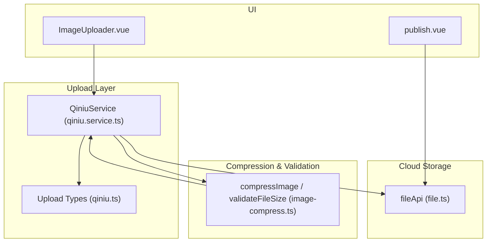
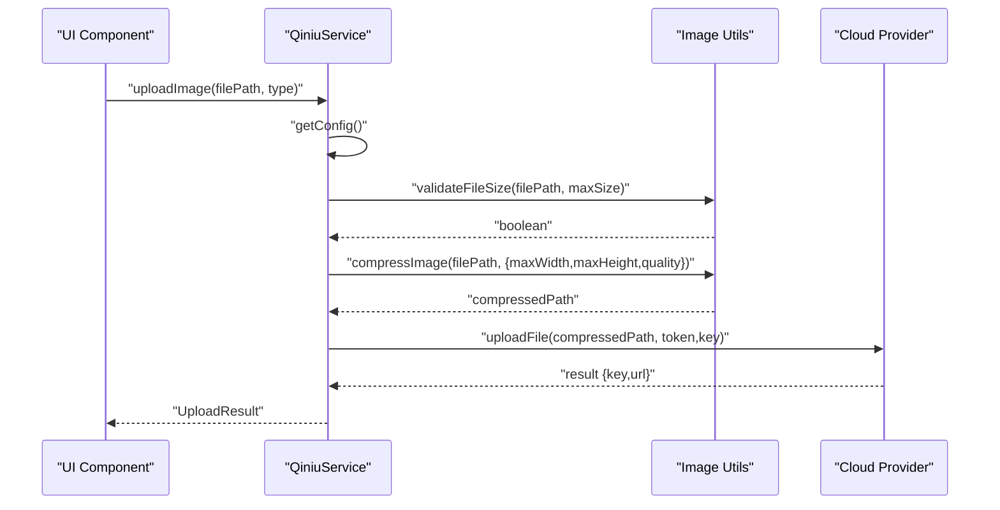
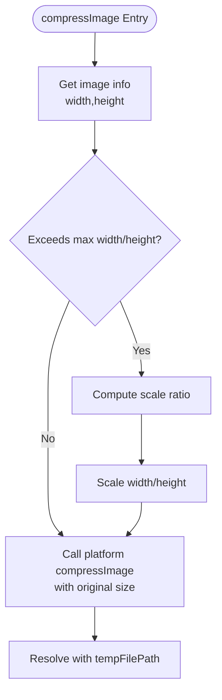
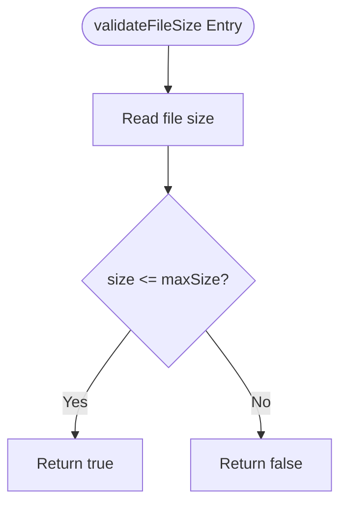
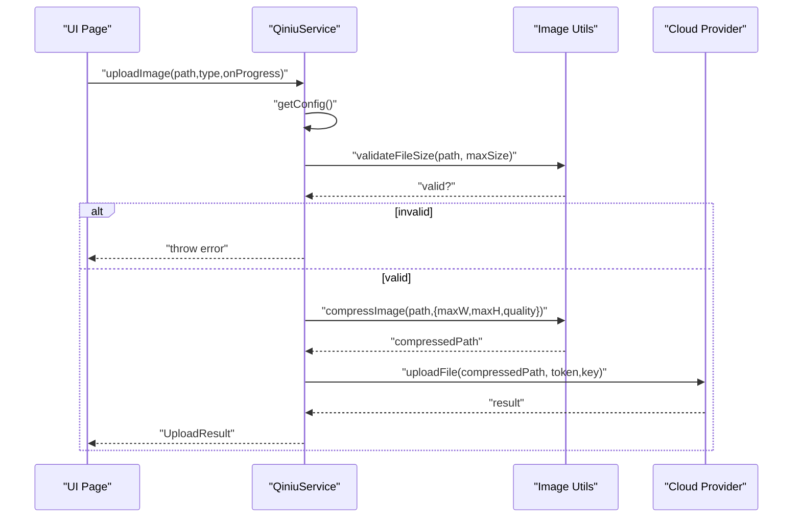
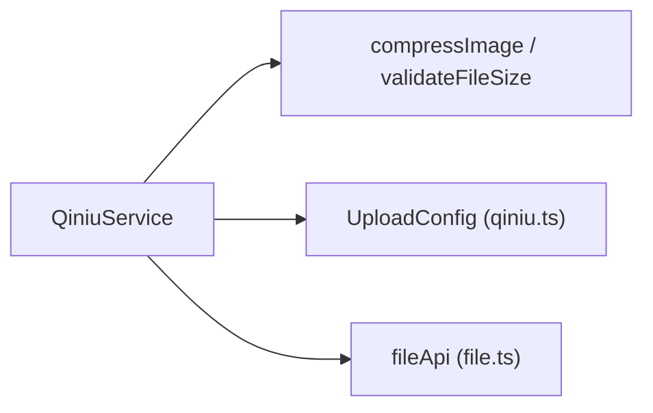

# Image Processing & Compression

<cite>
**Referenced Files in This Document**
- [image-compress.ts](file://src/utils/image-compress.ts)
- [qiniu.service.ts](file://src/services/qiniu.service.ts)
- [qiniu.ts](file://src/types/qiniu.ts)
- [file.ts](file://src/api/modules/file.ts)
- [ImageUploader.vue](file://src/components/ImageUploader.vue)
- [publish.vue](file://src/pages/square/publish.vue)
- [imageLoader.ts](file://src/utils/imageLoader.ts)
</cite>

## Table of Contents
1. [Introduction](#introduction)
2. [Project Structure](#project-structure)
3. [Core Components](#core-components)
4. [Architecture Overview](#architecture-overview)
5. [Detailed Component Analysis](#detailed-component-analysis)
6. [Dependency Analysis](#dependency-analysis)
7. [Performance Considerations](#performance-considerations)
8. [Troubleshooting Guide](#troubleshooting-guide)
9. [Conclusion](#conclusion)
10. [Appendices](#appendices)

## Introduction
This document explains the image processing and compression system used in the application. It covers how images are validated, resized, and compressed prior to upload, how file size limits are enforced, and how the workflow integrates with the upload service. It also provides practical guidance for configuring compression parameters for different use cases (profile pictures, post images, thumbnails), discusses performance and memory considerations, and outlines cross-platform handling differences.

## Project Structure
The image compression and validation logic is encapsulated in utility functions and integrated by the upload service. The upload service retrieves server-side configuration (including size and dimension limits) and applies client-side compression and validation before sending files to the cloud storage provider.

**Diagram sources**
- [ImageUploader.vue:78-131](file://src/components/ImageUploader.vue#L78-L131)
- [publish.vue:55-134](file://src/pages/square/publish.vue#L55-L134)
- [qiniu.service.ts:42-87](file://src/services/qiniu.service.ts#L42-L87)
- [image-compress.ts:10-86](file://src/utils/image-compress.ts#L10-L86)
- [file.ts:90-230](file://src/api/modules/file.ts#L90-L230)
- [qiniu.ts:15-25](file://src/types/qiniu.ts#L15-L25)

**Section sources**
- [ImageUploader.vue:78-131](file://src/components/ImageUploader.vue#L78-L131)
- [publish.vue:55-134](file://src/pages/square/publish.vue#L55-L134)
- [qiniu.service.ts:42-87](file://src/services/qiniu.service.ts#L42-L87)
- [image-compress.ts:10-86](file://src/utils/image-compress.ts#L10-L86)
- [file.ts:90-230](file://src/api/modules/file.ts#L90-L230)
- [qiniu.ts:15-25](file://src/types/qiniu.ts#L15-L25)

## Core Components
- Compression utilities:
  - Dimension reduction based on configured max width/height
  - Quality adjustment via a configurable factor
  - Batch compression support
- Validation utilities:
  - File size retrieval
  - Size validation against configured limits
- Upload service:
  - Fetches server-side configuration
  - Validates size and compresses images before upload
  - Integrates with cloud storage provider

**Section sources**
- [image-compress.ts:10-86](file://src/utils/image-compress.ts#L10-L86)
- [qiniu.service.ts:42-87](file://src/services/qiniu.service.ts#L42-L87)
- [qiniu.ts:15-25](file://src/types/qiniu.ts#L15-L25)

## Architecture Overview
The compression and validation pipeline runs client-side before upload. The upload service obtains configuration from the backend, validates file size, compresses images to meet configured constraints, and then uploads to the cloud storage provider.

**Diagram sources**
- [qiniu.service.ts:42-87](file://src/services/qiniu.service.ts#L42-L87)
- [image-compress.ts:10-86](file://src/utils/image-compress.ts#L10-L86)

## Detailed Component Analysis

### Compression Algorithm Implementation
The compression algorithm performs:
- Dimension reduction: scales down images proportionally to fit within configured max width and height
- Quality adjustment: applies a configurable quality factor during compression
- Batch processing: supports parallel compression of multiple images

**Diagram sources**
- [image-compress.ts:10-49](file://src/utils/image-compress.ts#L10-L49)

**Section sources**
- [image-compress.ts:10-49](file://src/utils/image-compress.ts#L10-L49)

### Validation System: File Size Limits
The validation system:
- Retrieves file size using platform APIs
- Compares against a configured maximum
- Throws an error if the file exceeds the limit

**Diagram sources**
- [image-compress.ts:65-86](file://src/utils/image-compress.ts#L65-L86)

**Section sources**
- [image-compress.ts:65-86](file://src/utils/image-compress.ts#L65-L86)

### Compression Workflow: From Input to Optimized Output
The workflow integrates compression and validation into the upload process:
- Obtain configuration from backend
- Validate file size
- Compress image to configured dimensions and quality
- Upload compressed file and persist metadata

**Diagram sources**
- [qiniu.service.ts:42-87](file://src/services/qiniu.service.ts#L42-L87)
- [image-compress.ts:10-86](file://src/utils/image-compress.ts#L10-L86)

**Section sources**
- [qiniu.service.ts:42-87](file://src/services/qiniu.service.ts#L42-L87)

### Cross-Platform Image Handling Differences
- Platform-specific APIs:
  - Uses platform-native image info and compression APIs
  - Handles different input formats (paths, data URLs, blob URLs) depending on runtime
- Environment detection:
  - Detects H5 vs UniApp environments
  - Adapts file reading and upload mechanisms accordingly

**Section sources**
- [file.ts:111-159](file://src/api/modules/file.ts#L111-L159)
- [publish.vue:55-78](file://src/pages/square/publish.vue#L55-L78)

### UI Integration Examples
- Image uploader component:
  - Allows selecting images with pre-compression enabled
  - Streams upload progress and updates UI state
- Post publishing page:
  - Chooses images from device or camera
  - Supports H5 compatibility for temporary files and data URLs

**Section sources**
- [ImageUploader.vue:78-131](file://src/components/ImageUploader.vue#L78-L131)
- [publish.vue:55-134](file://src/pages/square/publish.vue#L55-L134)

## Dependency Analysis
The upload service depends on:
- Configuration types for upload parameters
- Compression and validation utilities
- Cloud storage upload API

**Diagram sources**
- [qiniu.service.ts:3-10](file://src/services/qiniu.service.ts#L3-L10)
- [qiniu.ts:15-25](file://src/types/qiniu.ts#L15-L25)
- [file.ts:90-230](file://src/api/modules/file.ts#L90-L230)

**Section sources**
- [qiniu.service.ts:3-10](file://src/services/qiniu.service.ts#L3-L10)
- [qiniu.ts:15-25](file://src/types/qiniu.ts#L15-L25)
- [file.ts:90-230](file://src/api/modules/file.ts#L90-L230)

## Performance Considerations
- Dimension reduction:
  - Reduces pixel count and thus memory footprint and upload time
- Quality adjustment:
  - Lower quality reduces file size but may degrade perceived quality
- Batch compression:
  - Parallel compression can improve throughput but increases CPU and memory usage
- Preload and lazy loading:
  - Separate image loader utilities help manage memory and network resources for display

[No sources needed since this section provides general guidance]

## Troubleshooting Guide
Common issues and remedies:
- Exceeded file size limit:
  - Reduce quality or dimensions in configuration
  - Ensure validation occurs before compression
- Compression failures:
  - Verify platform APIs are available and input paths are valid
- Upload errors:
  - Confirm token and key are correctly obtained
  - Check network connectivity and cloud provider status

**Section sources**
- [qiniu.service.ts:49-52](file://src/services/qiniu.service.ts#L49-L52)
- [image-compress.ts:21-47](file://src/utils/image-compress.ts#L21-L47)
- [file.ts:164-229](file://src/api/modules/file.ts#L164-L229)

## Conclusion
The system provides a robust, configurable pipeline for image compression and validation prior to upload. By centralizing configuration on the backend and applying client-side compression and validation, it balances quality, performance, and storage efficiency across platforms.

[No sources needed since this section summarizes without analyzing specific files]

## Appendices

### Configuration Parameters and Use Cases
- Profile picture:
  - Target: smaller dimensions and moderate quality
  - Example: narrower max width/height and balanced quality
- Post images:
  - Target: larger dimensions with higher quality for visual fidelity
  - Example: increased max width/height and higher quality
- Thumbnails:
  - Target: compact dimensions and lower quality
  - Example: small max width/height and reduced quality

These are illustrative configurations derived from the shared compression options and validation utilities.

**Section sources**
- [image-compress.ts:14-18](file://src/utils/image-compress.ts#L14-L18)
- [qiniu.ts:15-25](file://src/types/qiniu.ts#L15-L25)