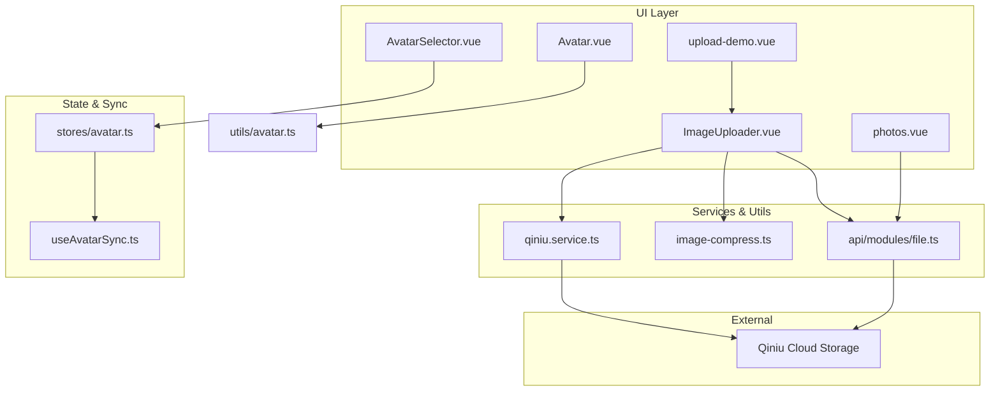
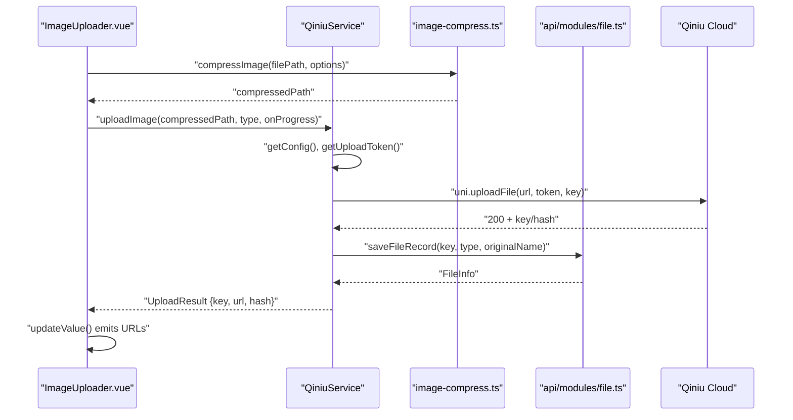
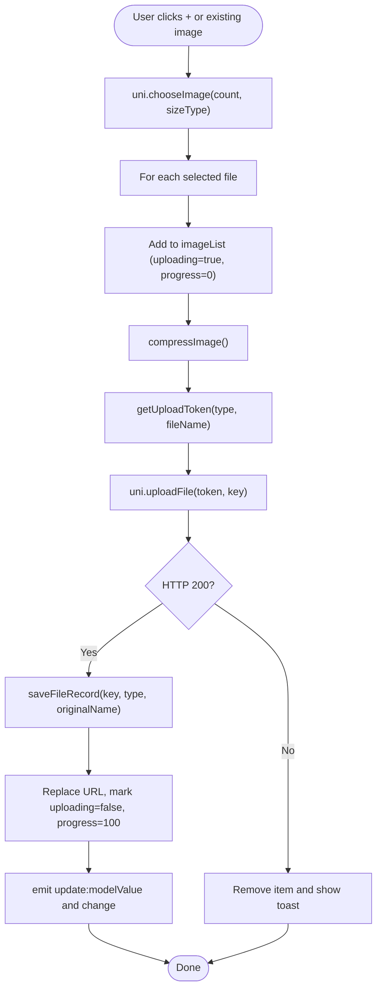
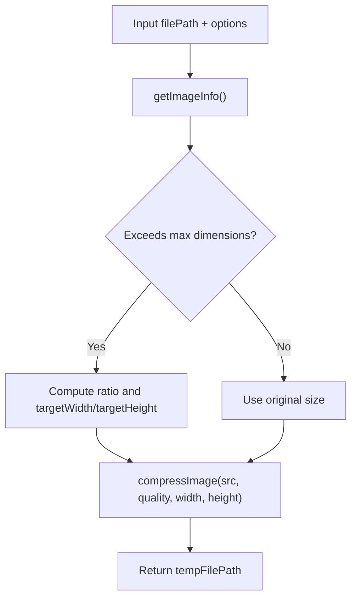
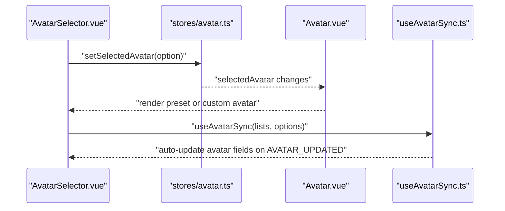
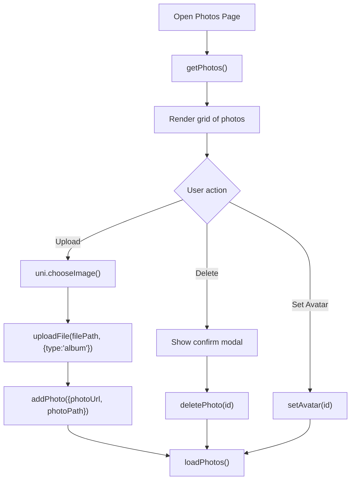
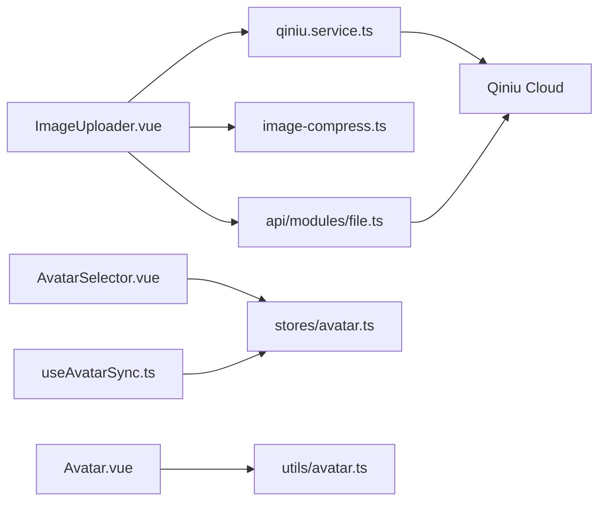

# Media Management

<cite>
**Referenced Files in This Document**
- [ImageUploader.vue](file://src/components/ImageUploader.vue)
- [qiniu.service.ts](file://src/services/qiniu.service.ts)
- [image-compress.ts](file://src/utils/image-compress.ts)
- [file.ts](file://src/api/modules/file.ts)
- [AvatarSelector.vue](file://src/components/business/AvatarSelector.vue)
- [Avatar.vue](file://src/components/common/Avatar.vue)
- [avatar.ts](file://src/utils/avatar.ts)
- [avatar.ts](file://src/stores/avatar.ts)
- [useAvatarSync.ts](file://src/composables/useAvatarSync.ts)
- [photos.vue](file://src/pages/profile/photos.vue)
- [upload-demo.vue](file://src/pages/examples/upload-demo.vue)
- [qiniu.ts](file://src/types/qiniu.ts)
- [avatar-sync-solution.md](file://docs/fix-deploy/avatar-sync-solution.md)
- [AVATAR_PLAN.md](file://docs/AVATAR_PLAN.md)
</cite>

## Table of Contents
1. [Introduction](#introduction)
2. [Project Structure](#project-structure)
3. [Core Components](#core-components)
4. [Architecture Overview](#architecture-overview)
5. [Detailed Component Analysis](#detailed-component-analysis)
6. [Dependency Analysis](#dependency-analysis)
7. [Performance Considerations](#performance-considerations)
8. [Troubleshooting Guide](#troubleshooting-guide)
9. [Security Considerations](#security-considerations)
10. [Conclusion](#conclusion)
11. [Appendices](#appendices)

## Introduction
This document describes the media management system for the WeTogether platform with a focus on Qiniu Cloud Storage integration. It covers image upload, compression, optimization, and thumbnail generation; avatar selection, upload, and cross-platform synchronization; the media processing pipeline; storage optimization and CDN integration; the ImageUploader component with drag-and-drop-like interactions and progress tracking; practical examples for validation, batch uploads, and media gallery management; and security considerations for file uploads, media access control, and storage cost optimization.

## Project Structure
The media management system spans several layers:
- UI components for uploads and avatar selection
- Services for Qiniu integration and compression
- Utilities for image processing and validation
- APIs for file operations and avatar updates
- Stores and composables for state and global synchronization
- Pages demonstrating usage and gallery management



**Diagram sources**
- [ImageUploader.vue:1-242](file://src/components/ImageUploader.vue#L1-L242)
- [qiniu.service.ts:1-126](file://src/services/qiniu.service.ts#L1-L126)
- [image-compress.ts:1-87](file://src/utils/image-compress.ts#L1-L87)
- [file.ts:1-335](file://src/api/modules/file.ts#L1-L335)
- [AvatarSelector.vue:1-286](file://src/components/business/AvatarSelector.vue#L1-L286)
- [Avatar.vue:1-95](file://src/components/common/Avatar.vue#L1-L95)
- [avatar.ts:1-52](file://src/stores/avatar.ts#L1-L52)
- [useAvatarSync.ts:1-72](file://src/composables/useAvatarSync.ts#L1-L72)

**Section sources**
- [ImageUploader.vue:1-242](file://src/components/ImageUploader.vue#L1-L242)
- [qiniu.service.ts:1-126](file://src/services/qiniu.service.ts#L1-L126)
- [image-compress.ts:1-87](file://src/utils/image-compress.ts#L1-L87)
- [file.ts:1-335](file://src/api/modules/file.ts#L1-L335)
- [AvatarSelector.vue:1-286](file://src/components/business/AvatarSelector.vue#L1-L286)
- [Avatar.vue:1-95](file://src/components/common/Avatar.vue#L1-L95)
- [avatar.ts:1-52](file://src/stores/avatar.ts#L1-L52)
- [useAvatarSync.ts:1-72](file://src/composables/useAvatarSync.ts#L1-L72)

## Core Components
- ImageUploader: A reusable component that supports selecting images from album/camera, optional compression, progress tracking, and saving records via Qiniu service.
- QiniuService: Centralized service to fetch upload configuration, obtain tokens, upload files, and save records.
- Image Compression Utilities: Provides compression, batch compression, file size validation, and size checks.
- File API: Higher-level file operations including upload, token retrieval, and gallery management.
- Avatar System: AvatarSelector for choosing presets or custom images, Avatar display component, Pinia store for selection, and global synchronization hook.
- Gallery Page: Photos page for managing albums with upload, deletion, and setting avatar actions.

**Section sources**
- [ImageUploader.vue:32-153](file://src/components/ImageUploader.vue#L32-L153)
- [qiniu.service.ts:12-126](file://src/services/qiniu.service.ts#L12-L126)
- [image-compress.ts:10-87](file://src/utils/image-compress.ts#L10-L87)
- [file.ts:90-335](file://src/api/modules/file.ts#L90-L335)
- [AvatarSelector.vue:59-153](file://src/components/business/AvatarSelector.vue#L59-L153)
- [Avatar.vue:17-42](file://src/components/common/Avatar.vue#L17-L42)
- [avatar.ts:9-52](file://src/stores/avatar.ts#L9-L52)
- [photos.vue:99-251](file://src/pages/profile/photos.vue#L99-L251)

## Architecture Overview
The media pipeline integrates client-side compression and validation with server-provided upload tokens and Qiniu Cloud Storage. After successful upload, the system saves file metadata and returns a CDN-accessible URL.



**Diagram sources**
- [ImageUploader.vue:78-131](file://src/components/ImageUploader.vue#L78-L131)
- [qiniu.service.ts:42-87](file://src/services/qiniu.service.ts#L42-L87)
- [image-compress.ts:10-49](file://src/utils/image-compress.ts#L10-L49)
- [file.ts:280-322](file://src/api/modules/file.ts#L280-L322)

## Detailed Component Analysis

### ImageUploader Component
- Purpose: Unified image selection, compression, upload, progress tracking, and record saving.
- Key behaviors:
  - Choose images from album/camera with compression enabled.
  - Per-file progress via callbacks and visual overlay.
  - Save file records after successful upload.
  - Emit updates to parent components via v-model and change events.
- Upload flow:
  - Validates against max count.
  - Calls uni.chooseImage, pushes temporary items, then uploads each file.
  - On success, replaces temp URL with CDN URL and saves record.
  - On failure, removes the item and shows toast.



**Diagram sources**
- [ImageUploader.vue:78-152](file://src/components/ImageUploader.vue#L78-L152)
- [qiniu.service.ts:112-122](file://src/services/qiniu.service.ts#L112-L122)

**Section sources**
- [ImageUploader.vue:32-153](file://src/components/ImageUploader.vue#L32-L153)
- [qiniu.service.ts:42-122](file://src/services/qiniu.service.ts#L42-L122)
- [image-compress.ts:10-49](file://src/utils/image-compress.ts#L10-L49)

### QiniuService and File API
- QiniuService responsibilities:
  - Fetches upload configuration (max size, dimensions, quality).
  - Validates file size before upload.
  - Compresses images according to config.
  - Obtains upload tokens and keys.
  - Performs uni.uploadFile and returns structured results.
  - Saves file records to backend.
- File API (higher-level):
  - Provides uploadFile, uploadAvatar, token retrieval, and gallery operations.
  - Handles environment detection (H5 vs UniApp) and file reading.
  - Returns full URLs and metadata.

```mermaid
classDiagram
class QiniuService {
-config : UploadConfig
+getConfig() UploadConfig
+getUploadToken(type, fileName) UploadTokenResponse
+uploadImage(filePath, type, onProgress) UploadResult
+uploadImages(filePaths, type, onProgress) UploadResult[]
+saveFileRecord(key, type, originalName) void
}
class FileAPI {
+uploadFile(filePath, options) UploadResult
+uploadAvatar(filePath) {filePath, url}
+getUploadToken(data) TokenResponse
+saveFileRecord(data) FileInfo
+getMyFiles(page, pageSize, type) List+Total
+deleteFile(fileId) void
}
QiniuService --> FileAPI : "uses for saveFileRecord"
```

**Diagram sources**
- [qiniu.service.ts:12-126](file://src/services/qiniu.service.ts#L12-L126)
- [file.ts:90-335](file://src/api/modules/file.ts#L90-L335)

**Section sources**
- [qiniu.service.ts:12-126](file://src/services/qiniu.service.ts#L12-L126)
- [file.ts:90-335](file://src/api/modules/file.ts#L90-L335)

### Image Compression and Validation
- Compression:
  - Uses uni.getImageInfo to compute target dimensions based on maxWidth/maxHeight.
  - Applies uni.compressImage with quality and target size.
- Batch compression:
  - Parallelizes compression across multiple files.
- Validation:
  - getFileSize and validateFileSize enforce configured max size.



**Diagram sources**
- [image-compress.ts:10-49](file://src/utils/image-compress.ts#L10-L49)

**Section sources**
- [image-compress.ts:10-87](file://src/utils/image-compress.ts#L10-L87)

### Avatar Management System
- AvatarSelector:
  - Tabs for preset (49 icons) and custom upload.
  - Preview of selected custom image.
  - Emits confirm/cancel events.
- Avatar Store:
  - Holds selected avatar option (preset/custom).
  - Exposes getAvatarUrl for rendering.
- Avatar Display:
  - Renders MBTI preset or custom image with size variants.
- Global Synchronization:
  - useAvatarSync listens to AVATAR_UPDATED events and updates lists in-place.



**Diagram sources**
- [AvatarSelector.vue:59-153](file://src/components/business/AvatarSelector.vue#L59-L153)
- [avatar.ts:9-52](file://src/stores/avatar.ts#L9-L52)
- [Avatar.vue:17-42](file://src/components/common/Avatar.vue#L17-L42)
- [useAvatarSync.ts:9-71](file://src/composables/useAvatarSync.ts#L9-L71)

**Section sources**
- [AvatarSelector.vue:59-153](file://src/components/business/AvatarSelector.vue#L59-L153)
- [avatar.ts:9-52](file://src/stores/avatar.ts#L9-L52)
- [Avatar.vue:17-42](file://src/components/common/Avatar.vue#L17-L42)
- [useAvatarSync.ts:9-71](file://src/composables/useAvatarSync.ts#L9-L71)

### Media Gallery Management
- Photos page:
  - Grid layout for uploaded photos.
  - Edit mode to delete photos.
  - Set avatar action from detail modal.
  - Upload via uni.chooseImage and uploadFile with album type.
  - Load, add, delete, and set avatar operations.



**Diagram sources**
- [photos.vue:115-251](file://src/pages/profile/photos.vue#L115-L251)
- [file.ts:242-257](file://src/api/modules/file.ts#L242-L257)

**Section sources**
- [photos.vue:99-251](file://src/pages/profile/photos.vue#L99-L251)
- [file.ts:242-257](file://src/api/modules/file.ts#L242-L257)

### Examples and Patterns
- Drag-and-drop-like interactions:
  - The upload area triggers uni.chooseImage with album/camera options.
- Progress tracking:
  - ImageUploader displays per-item progress during upload.
- Batch uploads:
  - QiniuService.uploadImages iterates sequentially; file.ts.uploadFile handles individual uploads.
- Media validation:
  - validateFileSize and compression ensure acceptable sizes and dimensions.
- Media gallery management:
  - Photos page demonstrates CRUD operations and avatar assignment.

**Section sources**
- [ImageUploader.vue:78-131](file://src/components/ImageUploader.vue#L78-L131)
- [qiniu.service.ts:89-110](file://src/services/qiniu.service.ts#L89-L110)
- [file.ts:90-230](file://src/api/modules/file.ts#L90-L230)
- [image-compress.ts:77-87](file://src/utils/image-compress.ts#L77-L87)
- [photos.vue:134-179](file://src/pages/profile/photos.vue#L134-L179)

## Dependency Analysis
- Component-to-service coupling:
  - ImageUploader depends on QiniuService and compression utilities.
  - AvatarSelector depends on Avatar store.
- Service-to-external coupling:
  - QiniuService and File API depend on Qiniu endpoints and token-based upload.
- State and synchronization:
  - useAvatarSync relies on event bus and auth store updates.



**Diagram sources**
- [ImageUploader.vue:34-35](file://src/components/ImageUploader.vue#L34-L35)
- [qiniu.service.ts:1-10](file://src/services/qiniu.service.ts#L1-L10)
- [file.ts:1-12](file://src/api/modules/file.ts#L1-L12)
- [AvatarSelector.vue:61-62](file://src/components/business/AvatarSelector.vue#L61-L62)
- [avatar.ts:1-3](file://src/stores/avatar.ts#L1-L3)
- [Avatar.vue:19](file://src/components/common/Avatar.vue#L19)
- [avatar.ts:1-3](file://src/utils/avatar.ts#L1-L3)
- [useAvatarSync.ts:1-3](file://src/composables/useAvatarSync.ts#L1-L3)

**Section sources**
- [ImageUploader.vue:32-54](file://src/components/ImageUploader.vue#L32-L54)
- [qiniu.service.ts:12-27](file://src/services/qiniu.service.ts#L12-L27)
- [file.ts:38-41](file://src/api/modules/file.ts#L38-L41)
- [AvatarSelector.vue:61-62](file://src/components/business/AvatarSelector.vue#L61-L62)
- [avatar.ts:9-20](file://src/stores/avatar.ts#L9-L20)
- [Avatar.vue:19](file://src/components/common/Avatar.vue#L19)
- [avatar.ts:1-3](file://src/utils/avatar.ts#L1-L3)
- [useAvatarSync.ts:1-3](file://src/composables/useAvatarSync.ts#L1-L3)

## Performance Considerations
- Compression defaults:
  - Default max dimensions and quality reduce payload size and improve CDN delivery.
- Sequential vs parallel uploads:
  - Current implementation uploads sequentially; consider parallelizing with concurrency limits for batch uploads.
- Thumbnail generation:
  - Implement server-side or CDN transformations for thumbnails to avoid client recompression.
- Caching and CDN:
  - Use Qiniu CDN domains and leverage browser caching headers for static assets.
- Memory and UX:
  - Limit maxCount and provide progress feedback to keep UI responsive.

[No sources needed since this section provides general guidance]

## Troubleshooting Guide
- Upload fails with HTTP 200 but invalid response:
  - Verify token validity and key generation; check QiniuService upload success handling.
- File size validation errors:
  - Ensure validateFileSize is called before compression and upload.
- Progress not updating:
  - Confirm onProgress callback is passed through to QiniuService and ImageUploader updates item.progress.
- Avatar not syncing across pages:
  - Ensure authStore emits AVATAR_UPDATED and useAvatarSync is attached to lists.

**Section sources**
- [qiniu.service.ts:63-86](file://src/services/qiniu.service.ts#L63-L86)
- [image-compress.ts:77-87](file://src/utils/image-compress.ts#L77-L87)
- [ImageUploader.vue:96-128](file://src/components/ImageUploader.vue#L96-L128)
- [useAvatarSync.ts:60-66](file://src/composables/useAvatarSync.ts#L60-L66)

## Security Considerations
- Token-based uploads:
  - Backend generates short-lived tokens with explicit keys and domains; never expose secret credentials in the client.
- File validation:
  - Validate file size and optionally MIME types before upload.
- Access control:
  - Enforce user ownership on delete/set-avatar operations; restrict access to authorized users only.
- Storage cost optimization:
  - Use compression and appropriate dimensions; enable CDN caching; periodically audit unused files.

[No sources needed since this section provides general guidance]

## Conclusion
The WeTogether media management system integrates Qiniu Cloud Storage with robust client-side compression, validation, and progress tracking. The avatar system provides flexible selection and global synchronization across platforms. The gallery and uploader components demonstrate practical patterns for batch uploads, validation, and media management, while the architecture supports scalability and CDN optimization.

[No sources needed since this section summarizes without analyzing specific files]

## Appendices

### Upload Types and Limits
- UploadType enum defines categories for uploads.
- UploadConfig specifies max size, dimensions, quality, allowed types, and per-type limits.

**Section sources**
- [qiniu.ts:1-38](file://src/types/qiniu.ts#L1-L38)

### Demo Usage
- upload-demo.vue showcases ImageUploader with different upload types and counts.

**Section sources**
- [upload-demo.vue:4-46](file://src/pages/examples/upload-demo.vue#L4-L46)

### Avatar Implementation Plan
- AVATAR_PLAN.md outlines the avatar feature architecture, including types, store, selector, and integration steps.

**Section sources**
- [AVATAR_PLAN.md:14-66](file://docs/AVATAR_PLAN.md#L14-L66)

### Avatar Synchronization Solution
- avatar-sync-solution.md documents the event-driven synchronization approach across pages.

**Section sources**
- [avatar-sync-solution.md:1-159](file://docs/fix-deploy/avatar-sync-solution.md#L1-L159)