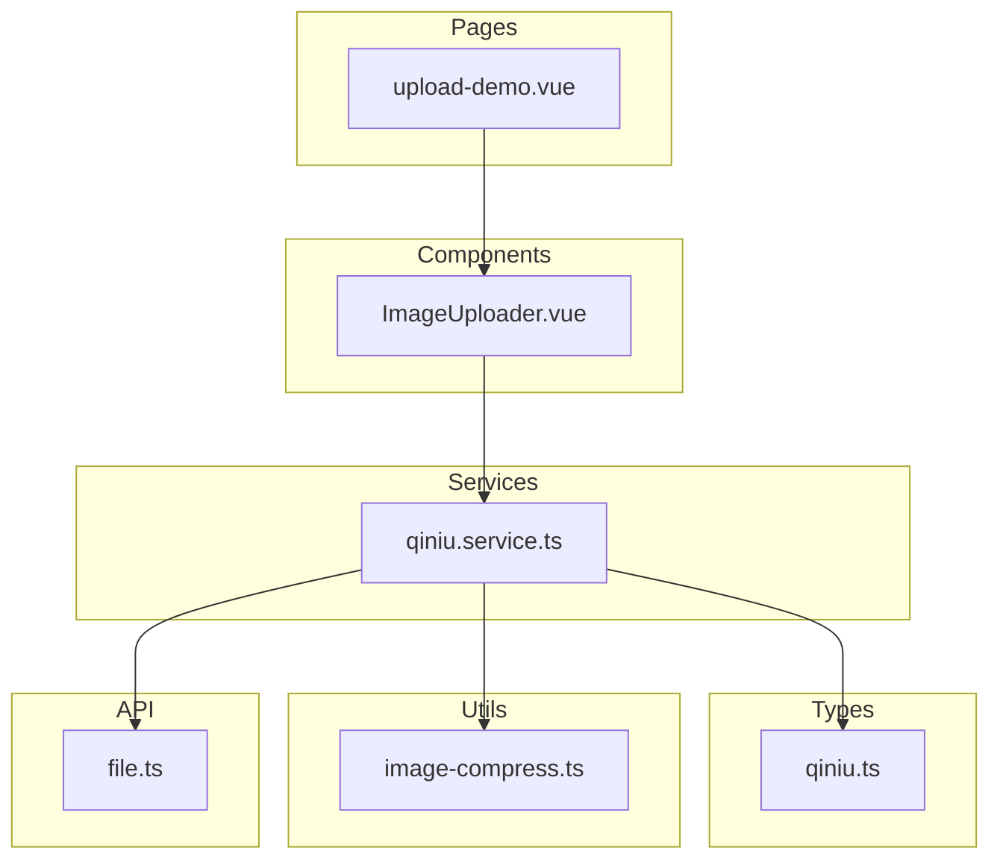
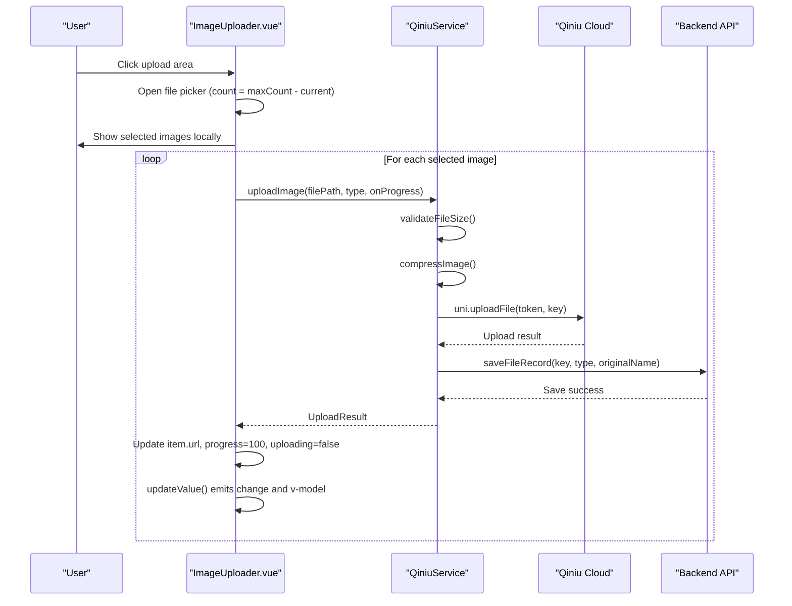
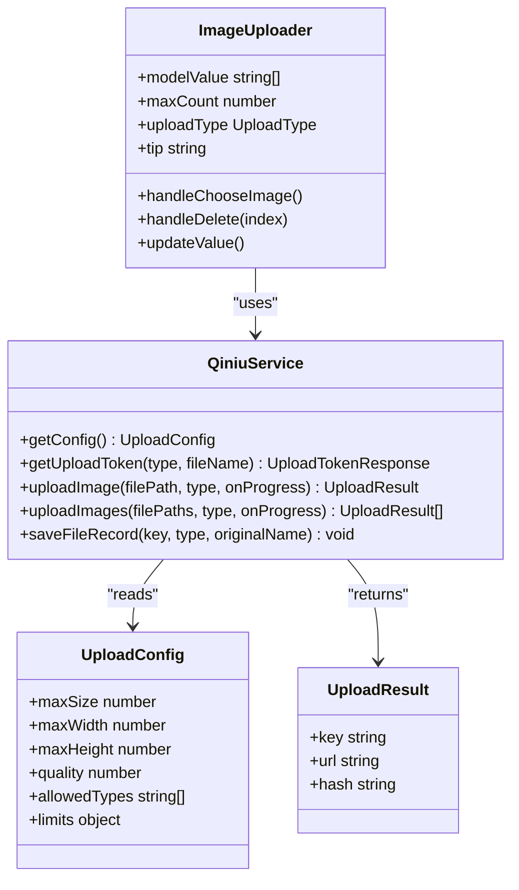
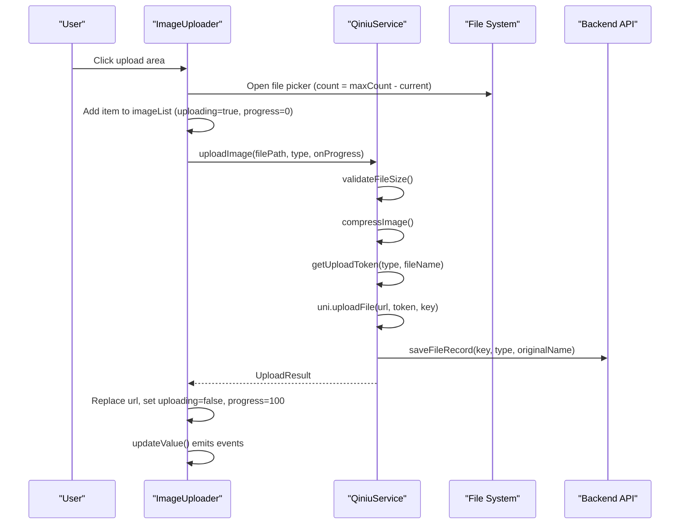
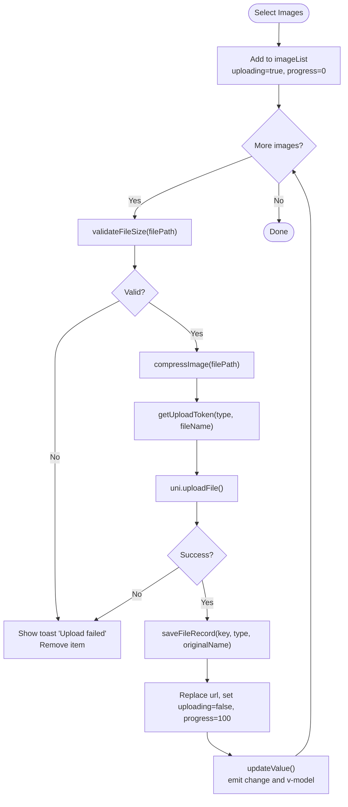
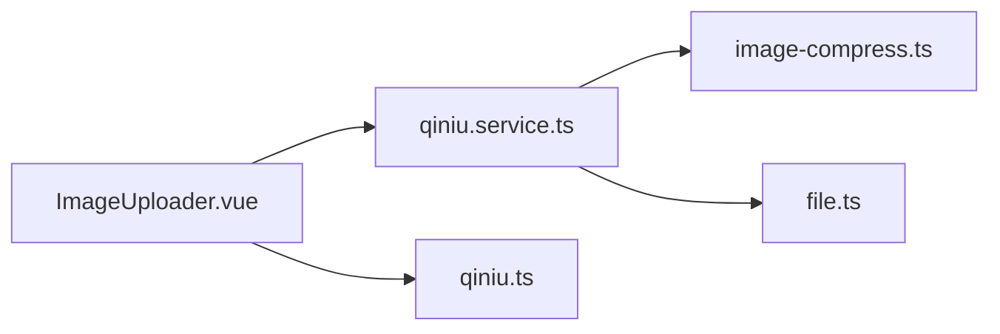

# Media Uploader Component

<cite>
**Referenced Files in This Document**
- [ImageUploader.vue](file://src/components/ImageUploader.vue)
- [qiniu.service.ts](file://src/services/qiniu.service.ts)
- [upload-demo.vue](file://src/pages/examples/upload-demo.vue)
- [qiniu.ts](file://src/types/qiniu.ts)
- [image-compress.ts](file://src/utils/image-compress.ts)
- [file.ts](file://src/api/modules/file.ts)
</cite>

## Table of Contents
1. [Introduction](#introduction)
2. [Project Structure](#project-structure)
3. [Core Components](#core-components)
4. [Architecture Overview](#architecture-overview)
5. [Detailed Component Analysis](#detailed-component-analysis)
6. [Dependency Analysis](#dependency-analysis)
7. [Performance Considerations](#performance-considerations)
8. [Troubleshooting Guide](#troubleshooting-guide)
9. [Conclusion](#conclusion)
10. [Appendices](#appendices)

## Introduction
This document provides comprehensive documentation for the ImageUploader component, focusing on its architecture, drag-and-drop file selection, queue management for multiple uploads, progress visualization, and integration with the QiniuService for actual file upload processing. It also details component props, events, and customization options, along with practical examples for validation, error handling, and user feedback. Finally, it outlines reuse patterns across different contexts such as profile photo upload, post image attachment, and gallery management, and provides guidelines for styling customization and responsive design adaptation.

## Project Structure
The ImageUploader component resides under the components directory and integrates with the QiniuService for cloud storage uploads. The demo page demonstrates usage across multiple scenarios.

**Diagram sources**
- [ImageUploader.vue:1-242](file://src/components/ImageUploader.vue#L1-L242)
- [qiniu.service.ts:1-126](file://src/services/qiniu.service.ts#L1-L126)
- [upload-demo.vue:1-100](file://src/pages/examples/upload-demo.vue#L1-L100)
- [qiniu.ts:1-38](file://src/types/qiniu.ts#L1-L38)
- [image-compress.ts:1-87](file://src/utils/image-compress.ts#L1-L87)
- [file.ts:1-335](file://src/api/modules/file.ts#L1-L335)

**Section sources**
- [ImageUploader.vue:1-242](file://src/components/ImageUploader.vue#L1-L242)
- [qiniu.service.ts:1-126](file://src/services/qiniu.service.ts#L1-L126)
- [upload-demo.vue:1-100](file://src/pages/examples/upload-demo.vue#L1-L100)
- [qiniu.ts:1-38](file://src/types/qiniu.ts#L1-L38)
- [image-compress.ts:1-87](file://src/utils/image-compress.ts#L1-L87)
- [file.ts:1-335](file://src/api/modules/file.ts#L1-L335)

## Core Components
- ImageUploader.vue: Implements drag-and-drop-like selection via click-to-open system, manages a local image list with upload state and progress, emits updates to parent components, and integrates with QiniuService for upload processing.
- QiniuService: Provides upload configuration retrieval, token acquisition, image compression and upload, batch upload orchestration, and saving file records to the backend.
- upload-demo.vue: Demonstrates usage of ImageUploader across different contexts (square posts, albums, avatars, certificates) with varying max counts and tips.
- qiniu.ts: Defines upload types, configuration, progress, and result interfaces used by the service and component.
- image-compress.ts: Offers image compression utilities and file size validation used by QiniuService.
- file.ts: Alternative file upload module with comprehensive platform detection and upload logic for H5 and UniApp environments.

**Section sources**
- [ImageUploader.vue:32-152](file://src/components/ImageUploader.vue#L32-L152)
- [qiniu.service.ts:12-126](file://src/services/qiniu.service.ts#L12-L126)
- [upload-demo.vue:49-70](file://src/pages/examples/upload-demo.vue#L49-L70)
- [qiniu.ts:1-38](file://src/types/qiniu.ts#L1-L38)
- [image-compress.ts:10-86](file://src/utils/image-compress.ts#L10-L86)
- [file.ts:90-230](file://src/api/modules/file.ts#L90-L230)

## Architecture Overview
The ImageUploader component orchestrates user interactions and delegates upload tasks to QiniuService. The service handles configuration retrieval, token generation, compression, and upload to Qiniu, then persists file metadata via the backend.

**Diagram sources**
- [ImageUploader.vue:78-131](file://src/components/ImageUploader.vue#L78-L131)
- [qiniu.service.ts:42-87](file://src/services/qiniu.service.ts#L42-L87)
- [qiniu.service.ts:112-122](file://src/services/qiniu.service.ts#L112-L122)
- [file.ts:164-230](file://src/api/modules/file.ts#L164-L230)

## Detailed Component Analysis

### Component Props
- modelValue: Array of image URLs representing uploaded images.
- maxCount: Maximum number of images allowed (default 9).
- uploadType: Enum indicating the upload context (square, avatar, certificate, album).
- tip: Optional hint text displayed below the uploader.

**Section sources**
- [ImageUploader.vue:37-52](file://src/components/ImageUploader.vue#L37-L52)
- [qiniu.ts:1-6](file://src/types/qiniu.ts#L1-L6)

### Component Events
- update:modelValue: Emitted when the internal image list changes, reflecting only finalized URLs.
- change: Emitted alongside update:modelValue to notify consumers of changes.

**Section sources**
- [ImageUploader.vue:44-47](file://src/components/ImageUploader.vue#L44-L47)
- [ImageUploader.vue:146-152](file://src/components/ImageUploader.vue#L146-L152)

### Component Slots
- No named slots are defined in the component. The component renders a default layout for image previews, delete buttons, progress overlays, and the upload area.

**Section sources**
- [ImageUploader.vue:1-30](file://src/components/ImageUploader.vue#L1-L30)

### Drag-and-Drop File Selection
- The component does not implement native drag-and-drop. Instead, it triggers the device’s file picker via a click action on the upload area. The click handler calculates the remaining count based on maxCount and opens the picker accordingly.

**Section sources**
- [ImageUploader.vue:78-131](file://src/components/ImageUploader.vue#L78-L131)

### Queue Management for Multiple Uploads
- The component maintains a local imageList with items containing url, uploading flag, and progress percentage. Each selected image is pushed to the list immediately and uploaded sequentially. Progress callbacks update the item’s progress, and upon completion, the item’s URL is replaced with the uploaded URL and uploading is set to false. The component updates v-model and change events after each successful upload.

**Section sources**
- [ImageUploader.vue:56-71](file://src/components/ImageUploader.vue#L56-L71)
- [ImageUploader.vue:88-128](file://src/components/ImageUploader.vue#L88-L128)
- [ImageUploader.vue:146-152](file://src/components/ImageUploader.vue#L146-L152)

### Progress Visualization
- While the component does not expose a dedicated progress prop, it renders a semi-transparent overlay with a centered percentage indicator during uploads. The progress value is updated via the QiniuService callback.

**Section sources**
- [ImageUploader.vue:13-15](file://src/components/ImageUploader.vue#L13-L15)
- [ImageUploader.vue:100-102](file://src/components/ImageUploader.vue#L100-L102)

### Integration with QiniuService
- QiniuService handles:
  - Retrieving upload configuration (max size, dimensions, quality).
  - Validating file size against configuration.
  - Compressing images to configured dimensions and quality.
  - Acquiring upload tokens and keys.
  - Performing uni.uploadFile to Qiniu endpoints.
  - Saving file records to the backend with key, type, and original name.
- The service exposes both single and batch upload methods, enabling sequential processing for the component.

**Section sources**
- [qiniu.service.ts:15-27](file://src/services/qiniu.service.ts#L15-L27)
- [qiniu.service.ts:42-87](file://src/services/qiniu.service.ts#L42-L87)
- [qiniu.service.ts:89-110](file://src/services/qiniu.service.ts#L89-L110)
- [qiniu.service.ts:112-122](file://src/services/qiniu.service.ts#L112-L122)
- [image-compress.ts:10-49](file://src/utils/image-compress.ts#L10-L49)
- [image-compress.ts:80-86](file://src/utils/image-compress.ts#L80-L86)

### Example Usage Scenarios
- Square posts: maxCount 1, tip indicating single image limit.
- Albums: maxCount 9, tip for up to nine images.
- Avatar: maxCount 1, tip for avatar-specific constraints.
- Certificates: maxCount 2, tip for identity documents.

These scenarios demonstrate the component’s flexibility across contexts.

**Section sources**
- [upload-demo.vue:4-41](file://src/pages/examples/upload-demo.vue#L4-L41)

### Implementation Patterns
- Reactive initialization: The component initializes its internal image list from modelValue and watches for changes to keep the UI synchronized.
- Sequential upload loop: Selected images are processed one by one to simplify error handling and progress reporting.
- Local state management: The component tracks upload status and progress per item, updating v-model and emitting change events.

**Section sources**
- [ImageUploader.vue:65-76](file://src/components/ImageUploader.vue#L65-L76)
- [ImageUploader.vue:88-128](file://src/components/ImageUploader.vue#L88-L128)
- [ImageUploader.vue:146-152](file://src/components/ImageUploader.vue#L146-L152)

### Class Diagram

**Diagram sources**
- [ImageUploader.vue:37-52](file://src/components/ImageUploader.vue#L37-L52)
- [qiniu.service.ts:12-126](file://src/services/qiniu.service.ts#L12-L126)
- [qiniu.ts:15-37](file://src/types/qiniu.ts#L15-L37)

### Sequence Diagram: Single Upload Flow

**Diagram sources**
- [ImageUploader.vue:78-131](file://src/components/ImageUploader.vue#L78-L131)
- [qiniu.service.ts:42-87](file://src/services/qiniu.service.ts#L42-L87)
- [qiniu.service.ts:112-122](file://src/services/qiniu.service.ts#L112-L122)

### Flowchart: Validation and Error Handling

**Diagram sources**
- [ImageUploader.vue:88-128](file://src/components/ImageUploader.vue#L88-L128)
- [qiniu.service.ts:49-52](file://src/services/qiniu.service.ts#L49-L52)
- [qiniu.service.ts:63-86](file://src/services/qiniu.service.ts#L63-L86)
- [qiniu.service.ts:117-122](file://src/services/qiniu.service.ts#L117-L122)

## Dependency Analysis
- ImageUploader depends on QiniuService for upload operations and on UploadType for categorizing uploads.
- QiniuService depends on:
  - Request utilities for backend communication.
  - Image compression utilities for file size and dimension constraints.
  - Types for upload configuration, progress, and results.
- The component’s template relies on scoped styles for layout and responsiveness.

**Diagram sources**
- [ImageUploader.vue:34-35](file://src/components/ImageUploader.vue#L34-L35)
- [qiniu.service.ts:1-10](file://src/services/qiniu.service.ts#L1-L10)
- [qiniu.ts:1-10](file://src/types/qiniu.ts#L1-L10)
- [image-compress.ts:1-3](file://src/utils/image-compress.ts#L1-L3)
- [file.ts:1-2](file://src/api/modules/file.ts#L1-L2)

**Section sources**
- [ImageUploader.vue:34-35](file://src/components/ImageUploader.vue#L34-L35)
- [qiniu.service.ts:1-10](file://src/services/qiniu.service.ts#L1-L10)
- [qiniu.ts:1-10](file://src/types/qiniu.ts#L1-L10)
- [image-compress.ts:1-3](file://src/utils/image-compress.ts#L1-L3)
- [file.ts:1-2](file://src/api/modules/file.ts#L1-L2)

## Performance Considerations
- Sequential uploads: The component processes images one by one, which simplifies error handling and reduces concurrent network load. For large batches, consider batching with parallelism while limiting concurrency to avoid overwhelming the device or network.
- Compression: QiniuService compresses images to configured dimensions and quality. Tune maxSize, maxWidth, maxHeight, and quality to balance image fidelity and upload speed.
- Progress updates: The component updates progress per item. For many simultaneous uploads, consider debouncing progress updates to reduce UI churn.
- Memory usage: Large images consume memory during compression and upload. Ensure the device has sufficient resources and consider pre-validating file sizes.

[No sources needed since this section provides general guidance]

## Troubleshooting Guide
Common issues and resolutions:
- Upload fails due to size limit:
  - Cause: validateFileSize returns false.
  - Resolution: Inform users about the maximum allowed size and guide them to select smaller images.
- Upload fails due to network or server errors:
  - Cause: uni.uploadFile or saveFileRecord failures.
  - Resolution: Show a toast notification, remove the problematic item, and allow retry.
- Progress not updating:
  - Cause: Missing or ignored progress callback.
  - Resolution: Verify the onProgress callback is passed to QiniuService.uploadImage and that the component updates item.progress.
- Deleting images:
  - Behavior: A confirmation modal is shown before deletion; confirm removes the item and updates v-model and change events.

**Section sources**
- [qiniu.service.ts:49-52](file://src/services/qiniu.service.ts#L49-L52)
- [ImageUploader.vue:116-127](file://src/components/ImageUploader.vue#L116-L127)
- [ImageUploader.vue:100-102](file://src/components/ImageUploader.vue#L100-L102)
- [ImageUploader.vue:133-144](file://src/components/ImageUploader.vue#L133-L144)

## Conclusion
The ImageUploader component provides a robust, reusable solution for image selection and upload across diverse contexts. Its integration with QiniuService ensures reliable cloud uploads with compression and validation, while its event-driven design enables seamless parent component updates. The component’s simplicity and clear separation of concerns make it adaptable to various UI scenarios, from single-avatar uploads to multi-image galleries.

[No sources needed since this section summarizes without analyzing specific files]

## Appendices

### Props Reference
- modelValue: string[] — Initial list of uploaded image URLs.
- maxCount: number — Maximum number of images allowed (default 9).
- uploadType: UploadType — Category of upload (square, avatar, certificate, album).
- tip: string — Optional hint text displayed beneath the uploader.

**Section sources**
- [ImageUploader.vue:37-52](file://src/components/ImageUploader.vue#L37-L52)
- [qiniu.ts:1-6](file://src/types/qiniu.ts#L1-L6)

### Events Reference
- update:modelValue: Emitted with the current list of finalized URLs.
- change: Emitted alongside update:modelValue to notify consumers of changes.

**Section sources**
- [ImageUploader.vue:44-47](file://src/components/ImageUploader.vue#L44-L47)
- [ImageUploader.vue:146-152](file://src/components/ImageUploader.vue#L146-L152)

### Slots Reference
- None defined. The component renders a default layout for previews, delete actions, progress overlays, and the upload area.

**Section sources**
- [ImageUploader.vue:1-30](file://src/components/ImageUploader.vue#L1-L30)

### Styling Customization Guidelines
- Container sizing: Adjust the width and height of image items and the upload area to fit your design system. The component uses fixed dimensions in rpx units for preview tiles and the upload button.
- Spacing: Modify gap and margins to achieve desired spacing between items.
- Colors and typography: Customize colors, fonts, and sizes for the upload button, icons, and tips.
- Responsive adaptation: Use SCSS variables and media queries to adapt sizes and layouts for different screen widths. Consider switching from a grid layout to a vertical stack on small screens.

**Section sources**
- [ImageUploader.vue:155-241](file://src/components/ImageUploader.vue#L155-L241)

### Reusability Across Contexts
- Profile photo upload: Set maxCount to 1 and uploadType to avatar. Provide a concise tip about avatar size and format.
- Post image attachment: Set maxCount to 1 or higher depending on post policy and uploadType to square. Offer clear guidance on image dimensions and file size.
- Gallery management: Set maxCount to 9 and uploadType to album. Allow users to add and remove images freely.
- Certificate/document upload: Set maxCount to 2 and uploadType to certificate. Provide instructions for scanning and file size limits.

**Section sources**
- [upload-demo.vue:4-41](file://src/pages/examples/upload-demo.vue#L4-L41)

### File Validation and Error Handling Examples
- File size validation: QiniuService.validateFileSize checks against configuration limits before upload.
- Compression: QiniuService.compressImage reduces dimensions and quality to meet constraints.
- Error handling: On upload failure, the component shows a toast and removes the problematic item from the list.
- User feedback: Progress overlays show upload percentages; tips inform users about constraints.

**Section sources**
- [qiniu.service.ts:49-52](file://src/services/qiniu.service.ts#L49-L52)
- [qiniu.service.ts:54-58](file://src/services/qiniu.service.ts#L54-L58)
- [ImageUploader.vue:116-127](file://src/components/ImageUploader.vue#L116-L127)
- [ImageUploader.vue:13-15](file://src/components/ImageUploader.vue#L13-L15)
- [ImageUploader.vue:28](file://src/components/ImageUploader.vue#L28)

### Alternative Upload Module
- file.ts provides a comprehensive upload module with platform detection for H5 and UniApp, supporting blob/data URLs and file paths. It includes token acquisition, upload to Qiniu, and saving file records to the backend.

**Section sources**
- [file.ts:90-230](file://src/api/modules/file.ts#L90-L230)