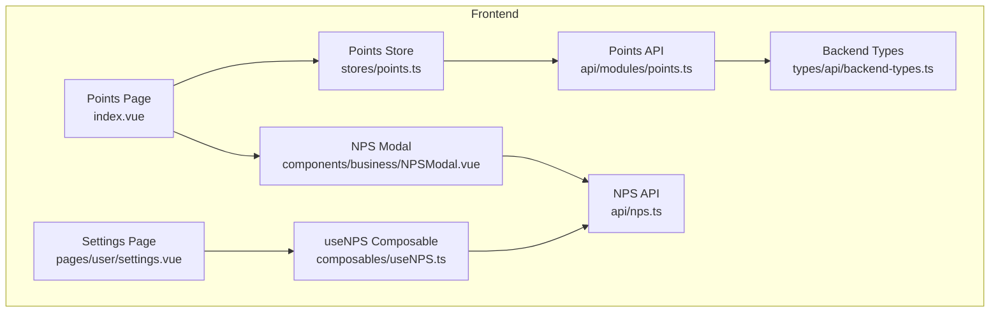
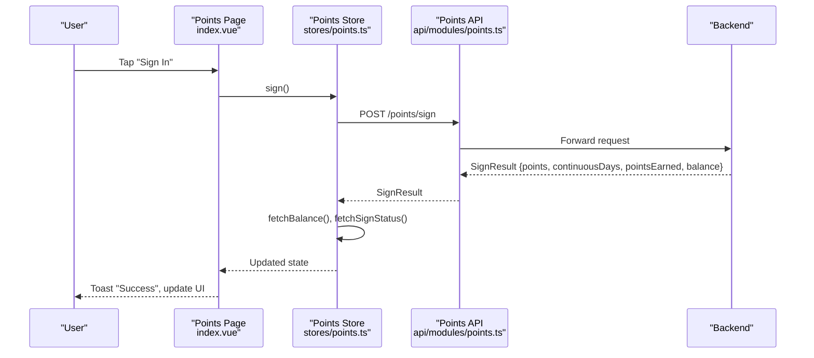
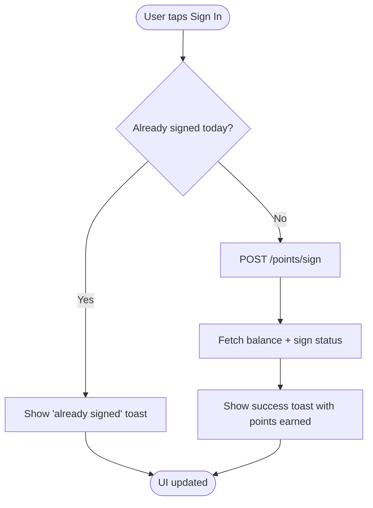
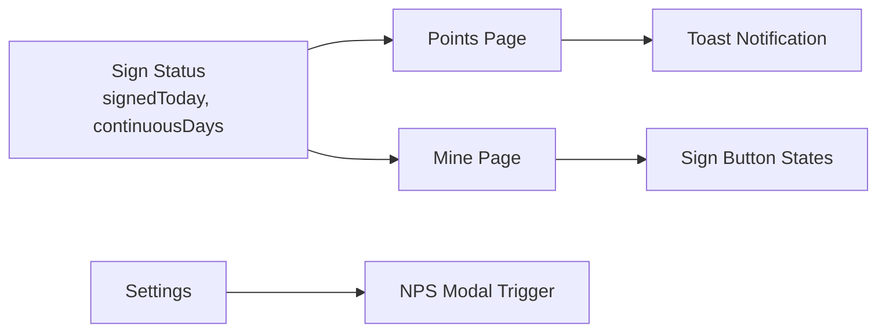
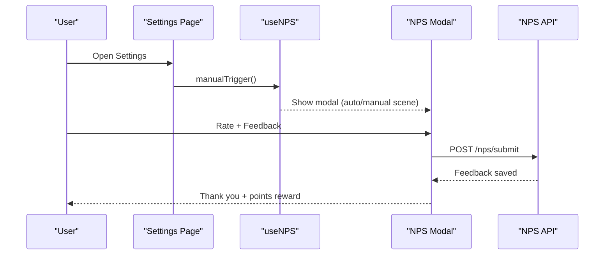
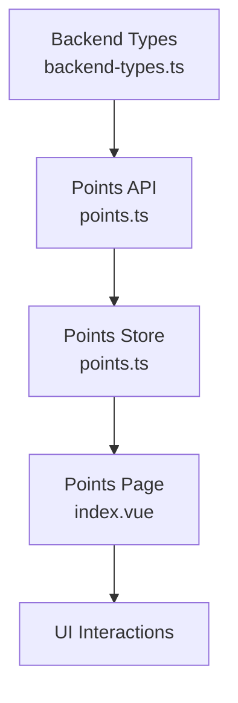

# Daily Sign-In & Streaks

<cite>
**Referenced Files in This Document**
- [points.ts](file://src/api/modules/points.ts)
- [points.ts](file://src/stores/points.ts)
- [index.vue](file://src/pages/points/index.vue)
- [backend-types.ts](file://src/types/api/backend-types.ts)
- [nps.ts](file://src/api/nps.ts)
- [useNPS.ts](file://src/composables/useNPS.ts)
- [NPSModal.vue](file://src/components/business/NPSModal.vue)
- [settings.vue](file://src/pages/user/settings.vue)
- [mine.vue](file://src/pages/tabbar/mine.vue)
- [points-balance-fix.md](file://docs/points-balance-fix.md)
- [points-list-pagination.md](file://docs/fix-deploy/points-list-pagination.md)
- [nps-final-report.md](file://docs/nps-final-report.md)
</cite>

## Table of Contents
1. [Introduction](#introduction)
2. [Project Structure](#project-structure)
3. [Core Components](#core-components)
4. [Architecture Overview](#architecture-overview)
5. [Detailed Component Analysis](#detailed-component-analysis)
6. [Dependency Analysis](#dependency-analysis)
7. [Performance Considerations](#performance-considerations)
8. [Troubleshooting Guide](#troubleshooting-guide)
9. [Conclusion](#conclusion)
10. [Appendices](#appendices)

## Introduction
This document describes the daily sign-in and streak tracking system, including the SignStatus interface, the sign() API endpoint, and the SignResult structure. It explains how continuous day counts are calculated, how bonus points are applied for consecutive sign-ins, and how the system integrates with the Net Promoter Score (NPS) system for user engagement. It also covers UI components for sign-in, streak visualization, notifications, edge cases (missed days, account recovery, validation), and best practices for robust operation.

## Project Structure
The sign-in and streak system spans three layers:
- API module: defines typed interfaces and HTTP endpoints for points operations
- Store: orchestrates state and async operations for sign-in, balance, logs, and status
- Pages and components: present sign-in UI, streak stats, and integrate with NPS

**Diagram sources**
- [index.vue:1-142](file://src/pages/points/index.vue#L1-L142)
- [points.ts:1-45](file://src/stores/points.ts#L1-L45)
- [points.ts:1-54](file://src/api/modules/points.ts#L1-L54)
- [backend-types.ts:342-359](file://src/types/api/backend-types.ts#L342-L359)
- [nps.ts:1-43](file://src/api/nps.ts#L1-L43)
- [NPSModal.vue:1-107](file://src/components/business/NPSModal.vue#L1-L107)
- [useNPS.ts:1-77](file://src/composables/useNPS.ts#L1-L77)
- [settings.vue:1-97](file://src/pages/user/settings.vue#L1-L97)

**Section sources**
- [points.ts:1-54](file://src/api/modules/points.ts#L1-L54)
- [points.ts:1-45](file://src/stores/points.ts#L1-L45)
- [index.vue:1-142](file://src/pages/points/index.vue#L1-L142)
- [backend-types.ts:342-359](file://src/types/api/backend-types.ts#L342-L359)
- [nps.ts:1-43](file://src/api/nps.ts#L1-L43)
- [useNPS.ts:1-77](file://src/composables/useNPS.ts#L1-L77)
- [NPSModal.vue:1-107](file://src/components/business/NPSModal.vue#L1-L107)
- [settings.vue:1-97](file://src/pages/user/settings.vue#L1-L97)

## Core Components
- SignStatus interface: carries whether the user signed today and the current streak count
- SignResult structure: returned after a successful sign-in, including points awarded and updated balance
- Points API: exposes endpoints for balance, sign-in, sign status, logs, and configuration
- Points Store: manages state and async flows for sign-in, balance, and logs
- Points Page: renders sign-in UI, streak stats, and logs with pagination
- NPS integration: triggers NPS modal based on user activity and rewards points upon submission

**Section sources**
- [points.ts:10-20](file://src/api/modules/points.ts#L10-L20)
- [points.ts:32-54](file://src/api/modules/points.ts#L32-L54)
- [points.ts:5-41](file://src/stores/points.ts#L5-L41)
- [index.vue:18-68](file://src/pages/points/index.vue#L18-L68)
- [nps.ts:1-43](file://src/api/nps.ts#L1-L43)
- [useNPS.ts:1-77](file://src/composables/useNPS.ts#L1-L77)
- [NPSModal.vue:1-107](file://src/components/business/NPSModal.vue#L1-L107)

## Architecture Overview
The sign-in flow is a client-driven process that calls the backend via typed APIs, updates local state, and notifies the user.

**Diagram sources**
- [index.vue:127-136](file://src/pages/points/index.vue#L127-L136)
- [points.ts:31-41](file://src/stores/points.ts#L31-L41)
- [points.ts:36-37](file://src/api/modules/points.ts#L36-L37)

## Detailed Component Analysis

### SignStatus and SignResult Interfaces
- SignStatus
  - signedToday: boolean indicating if the user has signed in today
  - continuousDays: number representing the current streak
- SignResult
  - points: total points credited in this sign-in cycle
  - continuousDays: updated streak count after sign-in
  - pointsEarned: optional field indicating points earned in this action
  - balance: optional field reflecting the updated account balance

These interfaces are defined in the points API module and consumed by the store and page.

**Section sources**
- [points.ts:10-20](file://src/api/modules/points.ts#L10-L20)

### Sign Endpoint and Result Handling
- Endpoint: POST /points/sign
- Returns: SignResult
- Store behavior:
  - Calls sign(), awaits response
  - Immediately refreshes balance and sign status
  - Returns the result for UI consumption
- Page behavior:
  - Disables the button when signed today
  - Shows toast with points earned upon success

**Diagram sources**
- [index.vue:127-136](file://src/pages/points/index.vue#L127-L136)
- [points.ts:31-41](file://src/stores/points.ts#L31-L41)

**Section sources**
- [points.ts:36-37](file://src/api/modules/points.ts#L36-L37)
- [points.ts:31-41](file://src/stores/points.ts#L31-L41)
- [index.vue:127-136](file://src/pages/points/index.vue#L127-L136)

### Streak Calculation and Bonus Systems
- Streak definition: continuousDays increments when a sign-in occurs on the day immediately following the previous sign-in
- Missed days reset the streak to zero for the next cycle
- Bonus points:
  - The backend determines bonus thresholds based on continuousDays
  - The frontend receives pointsEarned and balance in SignResult for display
- Configuration:
  - PointsConfig keys and values are exposed via GET /points/config and /points-configs for dynamic tuning

Note: The exact bonus algorithm (e.g., tiered multipliers or flat bonuses) is configured server-side and surfaced through PointsConfig. The frontend consumes the result without implementing the algorithm itself.

**Section sources**
- [points.ts:10-20](file://src/api/modules/points.ts#L10-L20)
- [points.ts:49-54](file://src/api/modules/points.ts#L49-L54)
- [backend-types.ts:342-359](file://src/types/api/backend-types.ts#L342-L359)

### Streak Visualization and Notifications
- Points Page displays:
  - Today’s sign status (signed vs unsign)
  - Continuous days count
  - Toast notification on successful sign-in
- Mine Page (profile tab) includes a compact sign-in CTA with visual states for signed and signing animations
- Settings Page integrates NPS modal for feedback, which can be triggered manually

**Diagram sources**
- [index.vue:18-27](file://src/pages/points/index.vue#L18-L27)
- [mine.vue:461-484](file://src/pages/tabbar/mine.vue#L461-L484)
- [settings.vue:20-81](file://src/pages/user/settings.vue#L20-L81)

**Section sources**
- [index.vue:18-27](file://src/pages/points/index.vue#L18-L27)
- [mine.vue:461-484](file://src/pages/tabbar/mine.vue#L461-L484)
- [settings.vue:20-81](file://src/pages/user/settings.vue#L20-L81)

### NPS Integration for Engagement Tracking
- NPS Modal presents a 3-step flow: score selection, feedback, and thank-you with reward
- useNPS composable checks eligibility via canTriggerNPS and supports manual triggering
- On successful submission, the modal shows a points reward and closes automatically
- Scenarios:
  - Auto-trigger after registration, first post, adding friends, or weekly activity
  - Manual trigger from Settings

**Diagram sources**
- [settings.vue:79-81](file://src/pages/user/settings.vue#L79-L81)
- [useNPS.ts:43-47](file://src/composables/useNPS.ts#L43-L47)
- [NPSModal.vue:244-294](file://src/components/business/NPSModal.vue#L244-L294)
- [nps.ts:40-42](file://src/api/nps.ts#L40-L42)

**Section sources**
- [nps.ts:25-42](file://src/api/nps.ts#L25-L42)
- [useNPS.ts:18-47](file://src/composables/useNPS.ts#L18-L47)
- [NPSModal.vue:1-107](file://src/components/business/NPSModal.vue#L1-L107)
- [settings.vue:1-97](file://src/pages/user/settings.vue#L1-L97)
- [nps-final-report.md:215-250](file://docs/nps-final-report.md#L215-L250)

### Edge Cases and Validation
- Duplicate sign-ins:
  - UI disables the button and shows a toast when already signed today
- Missed days:
  - Streak resets on the first sign-in after a gap
- Account recovery:
  - Balance is recalculated from logs to ensure consistency; see fix notes
- Validation:
  - Frontend validates presence of pointsEarned and balance in SignResult before rendering
  - Logs are paginated and filtered by type (income/expenses)

**Section sources**
- [index.vue:127-136](file://src/pages/points/index.vue#L127-L136)
- [points.ts:31-41](file://src/stores/points.ts#L31-L41)
- [points-list-pagination.md:83-141](file://docs/fix-deploy/points-list-pagination.md#L83-L141)
- [points-balance-fix.md:70-98](file://docs/points-balance-fix.md#L70-L98)

## Dependency Analysis
The sign-in system depends on:
- Typed backend responses (PointsBalance, SignStatus, SignResult, PointsConfig)
- API module for HTTP requests
- Store for state orchestration
- UI pages for rendering and user interaction

**Diagram sources**
- [backend-types.ts:342-359](file://src/types/api/backend-types.ts#L342-L359)
- [points.ts:1-54](file://src/api/modules/points.ts#L1-L54)
- [points.ts:1-45](file://src/stores/points.ts#L1-L45)
- [index.vue:1-142](file://src/pages/points/index.vue#L1-L142)

**Section sources**
- [backend-types.ts:342-359](file://src/types/api/backend-types.ts#L342-L359)
- [points.ts:1-54](file://src/api/modules/points.ts#L1-L54)
- [points.ts:1-45](file://src/stores/points.ts#L1-L45)
- [index.vue:1-142](file://src/pages/points/index.vue#L1-L142)

## Performance Considerations
- Balance computation:
  - Prefer computing balance from logs to avoid inconsistencies caused by direct user points reads
- Pagination:
  - Use scroll-to-load and type filters to reduce payload sizes and improve responsiveness
- Toasts and UI updates:
  - Debounce repeated actions and avoid redundant network calls

[No sources needed since this section provides general guidance]

## Troubleshooting Guide
- Balance mismatch:
  - Recompute balance from logs to ensure correctness
- Infinite loading or empty logs:
  - Verify pagination logic and type filtering
- NPS modal not appearing:
  - Confirm canTriggerNPS conditions and that the modal is mounted in Settings

**Section sources**
- [points-balance-fix.md:70-98](file://docs/points-balance-fix.md#L70-L98)
- [points-list-pagination.md:83-141](file://docs/fix-deploy/points-list-pagination.md#L83-L141)
- [useNPS.ts:18-38](file://src/composables/useNPS.ts#L18-L38)

## Conclusion
The sign-in and streak system is a cohesive client-side implementation backed by typed backend contracts. It provides immediate feedback, maintains accurate balances, and integrates with NPS to enhance user engagement. By following the documented patterns for UI, state management, and edge-case handling, teams can maintain reliability and scalability.

[No sources needed since this section summarizes without analyzing specific files]

## Appendices

### Implementation Examples

- Sign-in UI component (Points Page)
  - Renders sign status and continuous days
  - Disables button when signed today
  - Shows success toast with points earned
  - Reference: [index.vue:18-27](file://src/pages/points/index.vue#L18-L27), [index.vue:127-136](file://src/pages/points/index.vue#L127-L136)

- Streak visualization (Mine Page)
  - Compact sign-in CTA with visual states
  - Reference: [mine.vue:461-484](file://src/pages/tabbar/mine.vue#L461-L484)

- Notification system
  - Toasts for success and duplicate sign attempts
  - Reference: [index.vue:127-136](file://src/pages/points/index.vue#L127-L136)

- NPS integration
  - Manual trigger from Settings
  - Auto-trigger scenarios via useNPS
  - Reference: [settings.vue:79-81](file://src/pages/user/settings.vue#L79-L81), [useNPS.ts:18-47](file://src/composables/useNPS.ts#L18-L47), [NPSModal.vue:244-294](file://src/components/business/NPSModal.vue#L244-L294)

- Backend types and configuration
  - PointsConfig for bonus rules
  - Reference: [backend-types.ts:342-359](file://src/types/api/backend-types.ts#L342-L359)