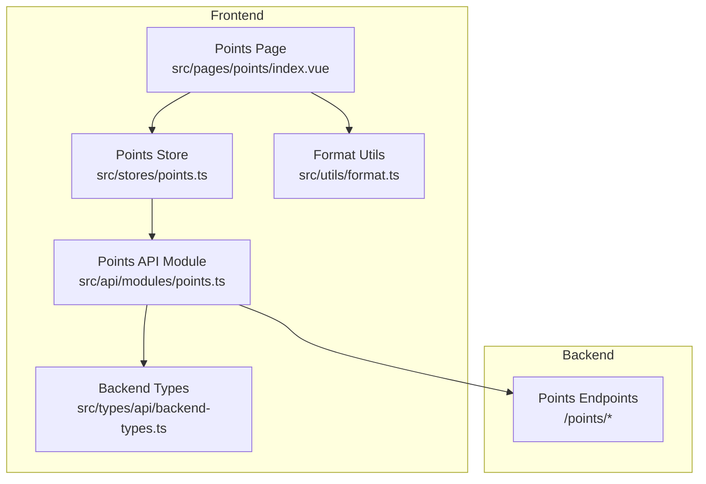
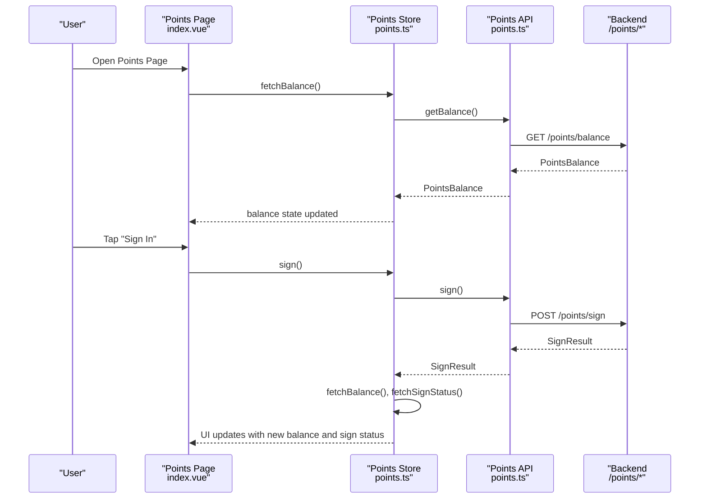
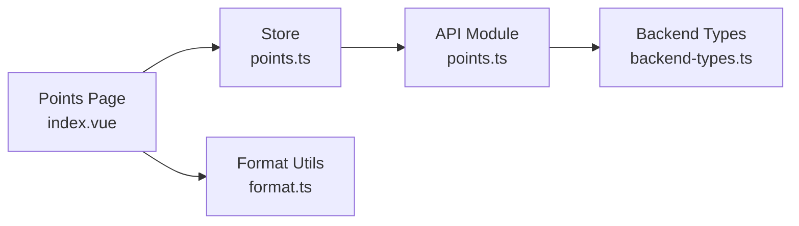

# Points & Rewards System

<cite>
**Referenced Files in This Document**
- [points.ts](file://src/api/modules/points.ts)
- [points.ts](file://src/stores/points.ts)
- [index.vue](file://src/pages/points/index.vue)
- [backend-types.ts](file://src/types/api/backend-types.ts)
- [format.ts](file://src/utils/format.ts)
- [API_ANALYSIS.md](file://API_ANALYSIS.md)
- [API_FIX_REPORT.md](file://API_FIX_REPORT.md)
- [points-balance-fix.md](file://docs/points-balance-fix.md)
- [points-list-pagination.md](file://docs/fix-deploy/points-list-pagination.md)
</cite>

## Table of Contents
1. [Introduction](#introduction)
2. [Project Structure](#project-structure)
3. [Core Components](#core-components)
4. [Architecture Overview](#architecture-overview)
5. [Detailed Component Analysis](#detailed-component-analysis)
6. [Dependency Analysis](#dependency-analysis)
7. [Performance Considerations](#performance-considerations)
8. [Troubleshooting Guide](#troubleshooting-guide)
9. [Conclusion](#conclusion)
10. [Appendices](#appendices)

## Introduction
This document describes the Points & Rewards system for the WeTogether platform. It covers the gamification mechanics centered around points accumulation, daily sign-in bonuses, transaction history, and the state management model used by the frontend. It also outlines the API surface for points operations, highlights current limitations and fixes, and provides guidance for extending the system with reward redemptions, tiers, expiration policies, fraud prevention, and analytics.

## Project Structure
The points system spans three layers:
- API module: Defines typed requests and response shapes for points operations.
- Store: Centralizes reactive state and orchestrates asynchronous data fetching.
- Page: Renders the points dashboard, including balance, sign-in, tabs, and transaction logs.

**Diagram sources**
- [index.vue:1-347](file://src/pages/points/index.vue#L1-L347)
- [points.ts:1-72](file://src/stores/points.ts#L1-L72)
- [points.ts:1-55](file://src/api/modules/points.ts#L1-L55)
- [backend-types.ts:344-359](file://src/types/api/backend-types.ts#L344-L359)
- [format.ts:1-38](file://src/utils/format.ts#L1-L38)

**Section sources**
- [points.ts:1-55](file://src/api/modules/points.ts#L1-L55)
- [points.ts:1-72](file://src/stores/points.ts#L1-L72)
- [index.vue:1-347](file://src/pages/points/index.vue#L1-L347)
- [backend-types.ts:344-359](file://src/types/api/backend-types.ts#L344-L359)
- [format.ts:1-38](file://src/utils/format.ts#L1-L38)

## Core Components
- Points API module
  - Provides typed functions for balance retrieval, sign-in, sign-in status, transaction logs, and configuration endpoints.
  - Exposes PointsConfig, PointsBalance, SignStatus, SignResult, and PointsLog interfaces.
- Points Store
  - Reactive state for balance, sign-in status, logs, and total logs count.
  - Async actions to fetch balance, sign-in status, perform sign-in, and paginated logs retrieval.
- Points Page
  - Displays current balance, cumulative earned/consumed totals, sign-in status, and a filtered, paginated transaction log list.
  - Implements tabbed filtering (all/income/expense) and infinite scroll loading.

**Section sources**
- [points.ts:4-54](file://src/api/modules/points.ts#L4-L54)
- [points.ts:5-71](file://src/stores/points.ts#L5-L71)
- [index.vue:1-142](file://src/pages/points/index.vue#L1-L142)

## Architecture Overview
The frontend interacts with backend endpoints via the Points API module. The store encapsulates state and async flows, while the page renders UI and handles pagination and filtering.

**Diagram sources**
- [index.vue:84-136](file://src/pages/points/index.vue#L84-L136)
- [points.ts:13-41](file://src/stores/points.ts#L13-L41)
- [points.ts:33-37](file://src/api/modules/points.ts#L33-L37)

**Section sources**
- [index.vue:84-136](file://src/pages/points/index.vue#L84-L136)
- [points.ts:13-41](file://src/stores/points.ts#L13-L41)
- [points.ts:33-37](file://src/api/modules/points.ts#L33-L37)

## Detailed Component Analysis

### Points API Module
- Endpoints
  - GET /points/balance -> PointsBalance
  - POST /points/sign -> SignResult
  - GET /points/sign/status -> SignStatus
  - GET /points/logs?page&pageSize&type -> { list: PointsLog[], total: number }
  - GET /points/config -> PointsConfig[]
  - GET /points-configs -> PointsConfig[]
- Data Models
  - PointsBalance: balance, totalEarned, totalConsumed
  - SignStatus: signedToday, continuousDays
  - SignResult: points, continuousDays, pointsEarned, balance
  - PointsLog: id, type (1|2), source, amount, balance, remark, createdAt
  - PointsConfig: id, key, value, description, isEnabled, timestamps

**Section sources**
- [points.ts:4-54](file://src/api/modules/points.ts#L4-L54)
- [backend-types.ts:344-359](file://src/types/api/backend-types.ts#L344-L359)

### Points Store
- State
  - balance: PointsBalance
  - signStatus: SignStatus
  - logs: PointsLog[]
  - totalLogs: number
- Actions
  - fetchBalance(): hydrates balance
  - fetchSignStatus(): hydrates sign status
  - sign(): performs sign-in and refreshes balance and sign status
  - fetchLogs(page, pageSize, type?): paginates logs; replaces on page 1, appends otherwise

**Section sources**
- [points.ts:5-71](file://src/stores/points.ts#L5-L71)

### Points Page (Dashboard)
- UI Elements
  - Header: current balance, cumulative earned, cumulative consumed
  - Sign-in section: today’s signed status and continuous days, sign-in button
  - Tabs: filter by all/income/expense
  - Scrollable logs list with pagination and loading indicators
- Behavior
  - On mount: checks login, loads balance, sign status, and logs
  - Tab change resets pagination and reloads
  - Infinite scroll increments page and appends logs
  - Sign-in flow shows toast with points earned

**Section sources**
- [index.vue:1-142](file://src/pages/points/index.vue#L1-L142)

### Transaction History Rendering
- Filtering
  - Active tab maps to type: undefined | 1 | 2
- Pagination
  - First page replaces logs; subsequent pages append
  - hasMore computed from logs length vs total
- Formatting
  - Relative time formatting via formatTime utility

**Section sources**
- [index.vue:95-125](file://src/pages/points/index.vue#L95-L125)
- [format.ts:8-23](file://src/utils/format.ts#L8-L23)

### Points Calculation and Balance Model
- Current frontend behavior
  - The store displays whatever the backend returns for balance, totalEarned, and totalConsumed.
- Backend balance computation
  - Historical note indicates a fix to compute balance as totalEarned minus totalConsumed from logs, rather than relying solely on the users.points field.
  - This ensures auditability and consistency across data sources.

**Section sources**
- [points.ts:13-20](file://src/stores/points.ts#L13-L20)
- [points-balance-fix.md:100-127](file://docs/points-balance-fix.md#L100-L127)

### Reward Inventory and Redemption
- Current state
  - The frontend exposes PointsConfig and configuration endpoints, but there is no visible reward shop or redemption flow in the points page.
- Implementation guidance
  - Add a “Reward Shop” route/page that lists PointsConfig entries and allows users to redeem items if they meet the cost threshold.
  - Integrate with backend endpoints for reward inventory and redemption (to be defined).
  - Maintain a separate redemption log similar to PointsLog for auditability.

[No sources needed since this section provides implementation guidance]

### Points Expiration Policies
- Current state
  - No expiration logic is present in the frontend or backend types shown.
- Implementation guidance
  - Extend PointsLog with optional expiryAt and add a background job to mark expired points.
  - Provide a UI toggle or filter to show non-expired balances.

[No sources needed since this section provides implementation guidance]

### Fraud Prevention
- Current state
  - No explicit fraud detection is evident in the frontend code.
- Implementation guidance
  - Enforce rate limits on sign-in and other points-generating actions.
  - Add anomaly detection (e.g., suspicious spikes) and require manual review for large redemptions.

[No sources needed since this section provides implementation guidance]

### Analytics
- Current state
  - No analytics endpoints are exposed in the points API module.
- Implementation guidance
  - Add endpoints for points trends, top earners, and activity summaries.
  - Track sign-in streaks and popular activities to inform gamification tuning.

[No sources needed since this section provides implementation guidance]

## Dependency Analysis
- API module depends on backend types for PointsConfig and PointsLog.
- Store depends on API module for network calls.
- Page depends on Store for state and on format utilities for time rendering.

**Diagram sources**
- [points.ts:1-55](file://src/api/modules/points.ts#L1-L55)
- [backend-types.ts:344-359](file://src/types/api/backend-types.ts#L344-L359)
- [points.ts:1-72](file://src/stores/points.ts#L1-L72)
- [index.vue:1-347](file://src/pages/points/index.vue#L1-L347)
- [format.ts:1-38](file://src/utils/format.ts#L1-L38)

**Section sources**
- [points.ts:1-55](file://src/api/modules/points.ts#L1-L55)
- [points.ts:1-72](file://src/stores/points.ts#L1-L72)
- [index.vue:1-347](file://src/pages/points/index.vue#L1-L347)
- [backend-types.ts:344-359](file://src/types/api/backend-types.ts#L344-L359)
- [format.ts:1-38](file://src/utils/format.ts#L1-L38)

## Performance Considerations
- Logging pagination
  - Frontend supports incremental loading; ensure backend enforces reasonable pageSize limits.
- Balance computation
  - The historical fix recommends computing balance from logs to avoid inconsistencies, which may increase query cost—consider caching or materialized aggregates.

**Section sources**
- [points-list-pagination.md:83-141](file://docs/fix-deploy/points-list-pagination.md#L83-L141)
- [points-balance-fix.md:70-82](file://docs/points-balance-fix.md#L70-L82)

## Troubleshooting Guide
- Balance mismatch
  - Symptom: totalEarned - totalConsumed does not equal current balance.
  - Cause: divergence between users.points and points_logs statistics.
  - Fix: compute balance as totalEarned - totalConsumed from logs (as recommended).
- API path prefix
  - Issue: endpoints lack /api/v1 prefix.
  - Fix: update request paths to include /api/v1 or configure baseURL accordingly.
- Parameter wrapping
  - Issue: points logs endpoint wraps query params in a params object.
  - Fix: pass page, pageSize, type directly as query parameters.

**Section sources**
- [points-balance-fix.md:50-98](file://docs/points-balance-fix.md#L50-L98)
- [API_ANALYSIS.md:60-64](file://API_ANALYSIS.md#L60-L64)
- [API_FIX_REPORT.md:80-84](file://API_FIX_REPORT.md#L80-L84)
- [API_FIX_REPORT.md:175-189](file://API_FIX_REPORT.md#L175-L189)

## Conclusion
The WeTogether Points & Rewards system currently provides a robust foundation for balance display, sign-in mechanics, and transaction logging. The frontend integrates cleanly with typed backend endpoints, and recent fixes improve balance consistency. To evolve into a full gamification platform, extend the system with reward inventory and redemption, introduce expiration and fraud controls, and add analytics capabilities.

## Appendices

### API Endpoints Summary
- GET /points/balance -> PointsBalance
- POST /points/sign -> SignResult
- GET /points/sign/status -> SignStatus
- GET /points/logs?page&pageSize&type -> { list: PointsLog[], total: number }
- GET /points/config -> PointsConfig[]
- GET /points-configs -> PointsConfig[]

**Section sources**
- [points.ts:32-54](file://src/api/modules/points.ts#L32-L54)

### Data Models Summary
- PointsBalance: balance, totalEarned, totalConsumed
- SignStatus: signedToday, continuousDays
- SignResult: points, continuousDays, pointsEarned, balance
- PointsLog: id, type (1|2), source, amount, balance, remark, createdAt
- PointsConfig: id, key, value, description, isEnabled, timestamps

**Section sources**
- [points.ts:4-30](file://src/api/modules/points.ts#L4-L30)
- [backend-types.ts:344-359](file://src/types/api/backend-types.ts#L344-L359)