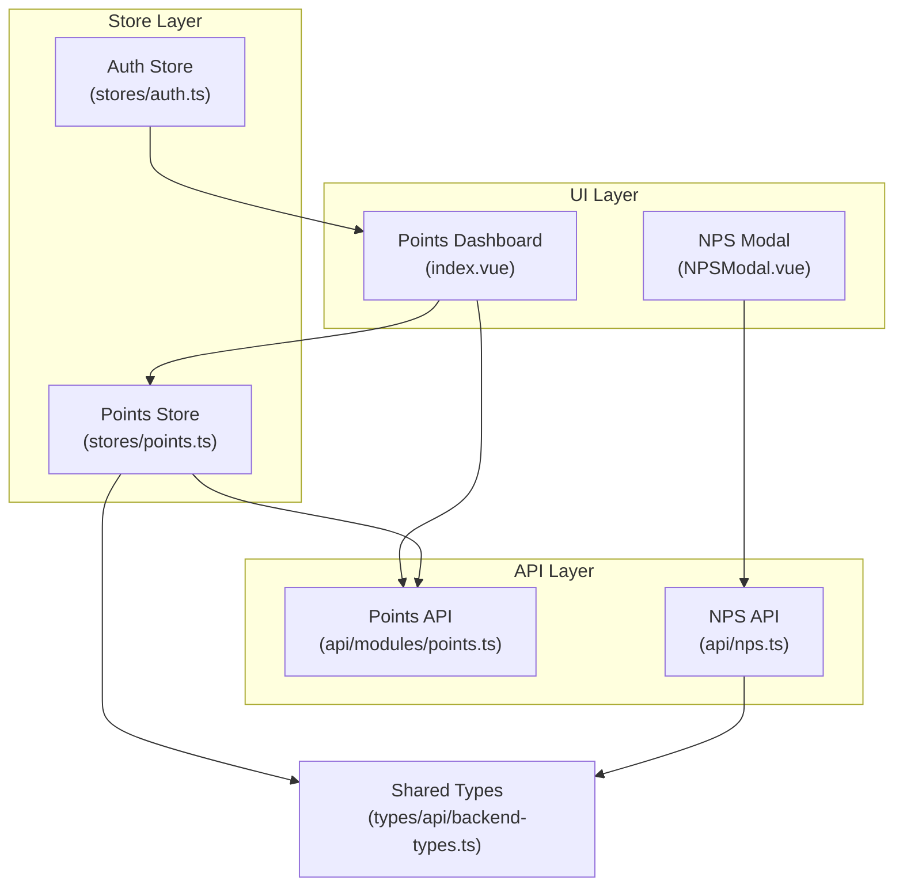
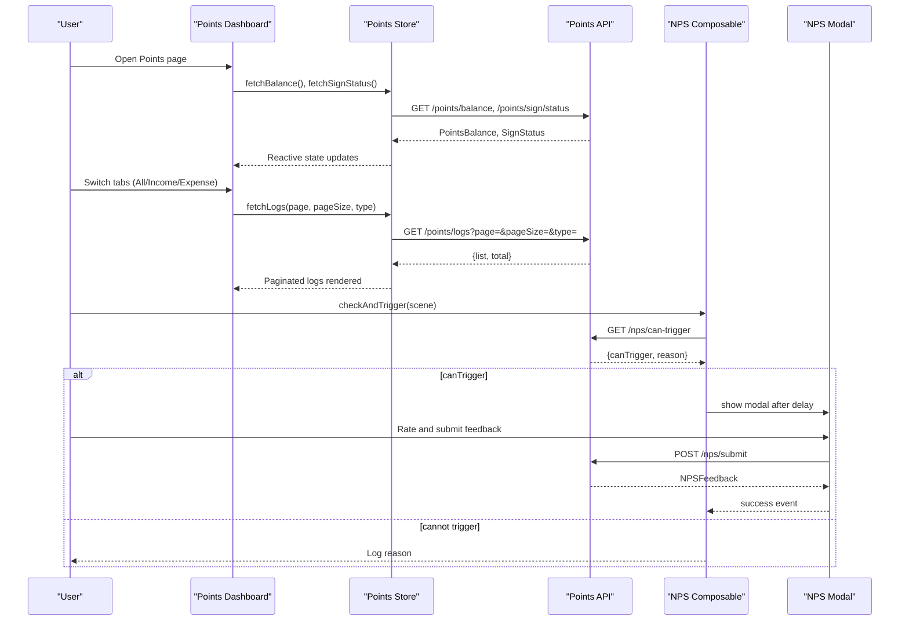
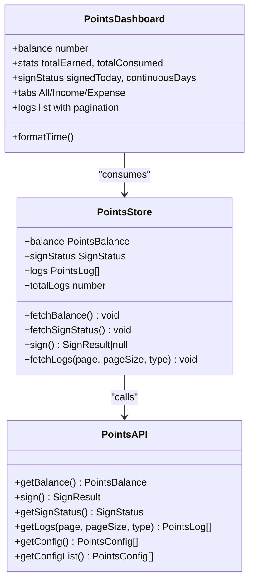
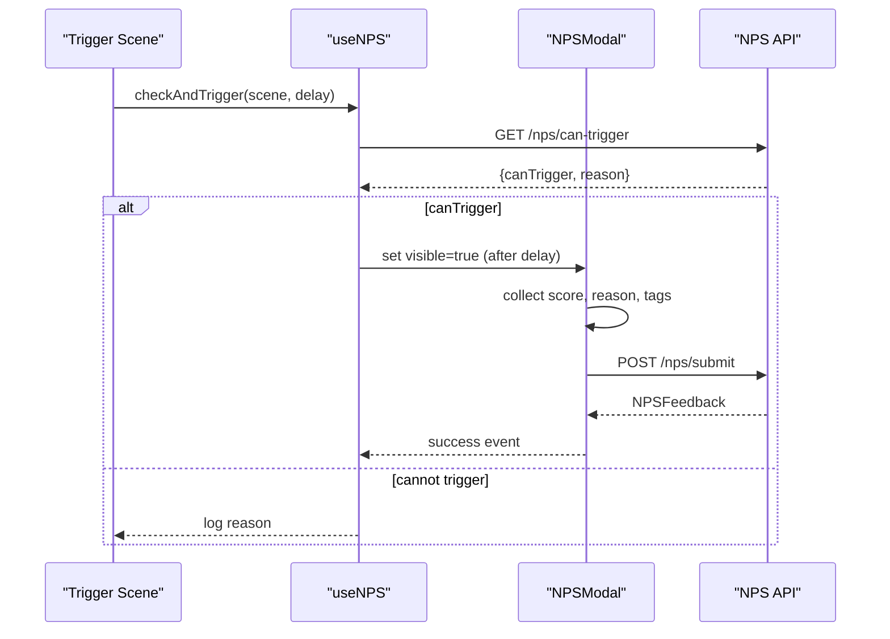
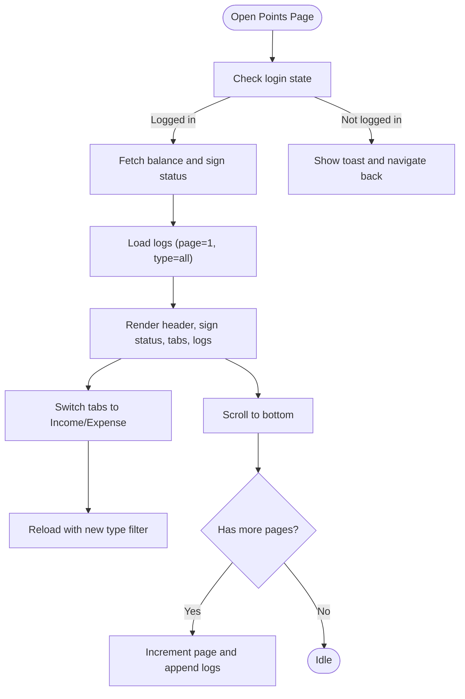
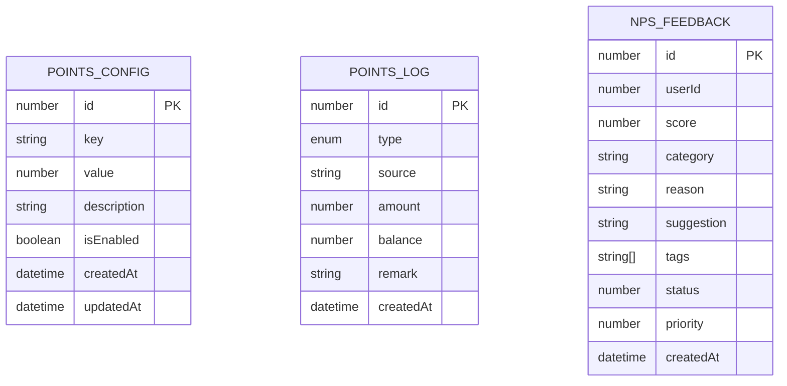
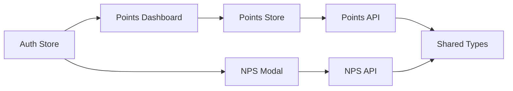

# Points Analytics & Tracking

<cite>
**Referenced Files in This Document**
- [points.ts](file://src/api/modules/points.ts)
- [points.ts](file://src/stores/points.ts)
- [index.vue](file://src/pages/points/index.vue)
- [nps.ts](file://src/api/nps.ts)
- [useNPS.ts](file://src/composables/useNPS.ts)
- [NPSModal.vue](file://src/components/business/NPSModal.vue)
- [nps-frontend-guide.md](file://docs/nps-frontend-guide.md)
- [nps-implementation.md](file://docs/nps-implementation.md)
- [points-balance-fix.md](file://docs/points-balance-fix.md)
- [backend-types.ts](file://src/types/api/backend-types.ts)
- [auth.ts](file://src/stores/auth.ts)
</cite>

## Table of Contents
1. [Introduction](#introduction)
2. [Project Structure](#project-structure)
3. [Core Components](#core-components)
4. [Architecture Overview](#architecture-overview)
5. [Detailed Component Analysis](#detailed-component-analysis)
6. [Dependency Analysis](#dependency-analysis)
7. [Performance Considerations](#performance-considerations)
8. [Troubleshooting Guide](#troubleshooting-guide)
9. [Conclusion](#conclusion)
10. [Appendices](#appendices)

## Introduction
This document explains the points analytics and tracking capabilities implemented in the frontend, focusing on:
- Data collection for points balance, earnings, spending, and retention
- Integration with NPS tracking for user engagement analysis
- Reporting features such as points distribution, user behavior patterns, and reward redemption analytics
- Examples of dashboard components, trend analysis, and performance monitoring
- Privacy considerations, analytics compliance, and real-time tracking capabilities
- Points leaderboard and social comparison features

The system combines a points module (balance, logs, sign-in streaks) with NPS feedback collection and scoring, enabling both quantitative tracking and qualitative insights into user engagement.

## Project Structure
The points analytics and NPS tracking span three layers:
- API layer: typed endpoints for points and NPS
- Store layer: reactive state and pagination for points logs
- UI layer: points dashboard and NPS modal with guided feedback flow

**Diagram sources**
- [index.vue:1-347](file://src/pages/points/index.vue#L1-L347)
- [points.ts:1-72](file://src/stores/points.ts#L1-L72)
- [points.ts:32-54](file://src/api/modules/points.ts#L32-L54)
- [nps.ts:1-43](file://src/api/nps.ts#L1-L43)
- [NPSModal.vue:1-550](file://src/components/business/NPSModal.vue#L1-L550)
- [backend-types.ts:344-359](file://src/types/api/backend-types.ts#L344-L359)

**Section sources**
- [points.ts:32-54](file://src/api/modules/points.ts#L32-L54)
- [points.ts:1-72](file://src/stores/points.ts#L1-L72)
- [index.vue:1-347](file://src/pages/points/index.vue#L1-L347)
- [nps.ts:1-43](file://src/api/nps.ts#L1-L43)
- [useNPS.ts:13-77](file://src/composables/useNPS.ts#L13-L77)
- [NPSModal.vue:109-314](file://src/components/business/NPSModal.vue#L109-L314)
- [backend-types.ts:344-359](file://src/types/api/backend-types.ts#L344-L359)

## Core Components
- Points API: exposes endpoints for balance, sign-in, logs, and configuration.
- Points Store: manages reactive state for balance, sign status, logs, and pagination.
- Points Dashboard: renders balance, stats, sign-in status, and paginated logs with filtering by type.
- NPS API: exposes endpoints for trigger checks and feedback submission.
- NPS Composable: orchestrates automatic/manual triggers and global visibility.
- NPS Modal: guided 3-step feedback flow with dynamic prompts and rewards.

Key data models:
- PointsBalance: current balance and totals for earnings/consumption
- PointsLog: per-transaction record with type, source, amount, and timestamp
- SignStatus: daily sign-in state and streak
- NPSFeedback: scored feedback with categorization and metadata

**Section sources**
- [points.ts:4-30](file://src/api/modules/points.ts#L4-L30)
- [points.ts:13-20](file://src/stores/points.ts#L13-L20)
- [index.vue:72-142](file://src/pages/points/index.vue#L72-L142)
- [nps.ts:3-28](file://src/api/nps.ts#L3-L28)
- [useNPS.ts:13-77](file://src/composables/useNPS.ts#L13-L77)
- [NPSModal.vue:109-314](file://src/components/business/NPSModal.vue#L109-L314)

## Architecture Overview
The analytics pipeline integrates points and NPS as follows:
- Points data is fetched and cached in the store, with pagination and filtering.
- NPS is triggered automatically or manually, collects feedback, and emits success events.
- Both systems rely on shared typed models and centralized stores for consistency.

**Diagram sources**
- [index.vue:84-125](file://src/pages/points/index.vue#L84-L125)
- [points.ts:13-58](file://src/stores/points.ts#L13-L58)
- [points.ts:32-54](file://src/api/modules/points.ts#L32-L54)
- [useNPS.ts:18-38](file://src/composables/useNPS.ts#L18-L38)
- [nps.ts:33-42](file://src/api/nps.ts#L33-L42)
- [NPSModal.vue:244-294](file://src/components/business/NPSModal.vue#L244-L294)

## Detailed Component Analysis

### Points Module
The points module provides:
- Balance retrieval with totals for earnings and consumption
- Daily sign-in with streak tracking
- Paginated logs with optional type filter
- Configuration endpoints for points-related settings

**Diagram sources**
- [points.ts:32-54](file://src/api/modules/points.ts#L32-L54)
- [points.ts:5-71](file://src/stores/points.ts#L5-L71)
- [index.vue:1-142](file://src/pages/points/index.vue#L1-L142)

**Section sources**
- [points.ts:32-54](file://src/api/modules/points.ts#L32-L54)
- [points.ts:5-71](file://src/stores/points.ts#L5-L71)
- [index.vue:1-142](file://src/pages/points/index.vue#L1-L142)

### NPS Integration
The NPS system comprises:
- Trigger logic with anti-disturbance rules (frequency caps, user conditions)
- Dynamic modal with 3-step flow (rating, feedback, thank-you)
- Automatic/manual triggering from multiple scenes
- Feedback submission with scoring and categorization

**Diagram sources**
- [useNPS.ts:18-38](file://src/composables/useNPS.ts#L18-L38)
- [NPSModal.vue:244-294](file://src/components/business/NPSModal.vue#L244-L294)
- [nps.ts:33-42](file://src/api/nps.ts#L33-L42)

**Section sources**
- [useNPS.ts:13-77](file://src/composables/useNPS.ts#L13-L77)
- [NPSModal.vue:109-314](file://src/components/business/NPSModal.vue#L109-L314)
- [nps.ts:1-43](file://src/api/nps.ts#L1-L43)
- [nps-frontend-guide.md:108-119](file://docs/nps-frontend-guide.md#L108-L119)
- [nps-implementation.md:69-87](file://docs/nps-implementation.md#L69-L87)

### Points Dashboard UI
The dashboard presents:
- Current balance and cumulative stats
- Sign-in status and streak
- Tabbed logs filtered by type (all/income/expense)
- Infinite scroll with pagination and empty/loading states

**Diagram sources**
- [index.vue:84-125](file://src/pages/points/index.vue#L84-L125)

**Section sources**
- [index.vue:1-142](file://src/pages/points/index.vue#L1-L142)

### Data Models and Types
Shared types define the shape of analytics data:
- PointsConfig: configuration entries for points behavior
- PointsLog: transaction records with type, amount, and timestamps
- NPSFeedback: scored feedback with category and metadata

**Diagram sources**
- [backend-types.ts:344-359](file://src/types/api/backend-types.ts#L344-L359)
- [points.ts:22-30](file://src/api/modules/points.ts#L22-L30)
- [nps.ts:12-23](file://src/api/nps.ts#L12-L23)

**Section sources**
- [backend-types.ts:344-359](file://src/types/api/backend-types.ts#L344-L359)
- [points.ts:22-30](file://src/api/modules/points.ts#L22-L30)
- [nps.ts:12-23](file://src/api/nps.ts#L12-L23)

## Dependency Analysis
- Points Dashboard depends on Points Store for reactive state and on Points API for data fetching.
- NPS Modal depends on NPS API for trigger checks and submissions.
- Auth Store ensures user context for both points and NPS flows.
- Shared types unify data contracts across modules.

**Diagram sources**
- [auth.ts:1-137](file://src/stores/auth.ts#L1-L137)
- [index.vue:72-78](file://src/pages/points/index.vue#L72-L78)
- [points.ts:1-3](file://src/stores/points.ts#L1-L3)
- [points.ts:32-54](file://src/api/modules/points.ts#L32-L54)
- [nps.ts:1-43](file://src/api/nps.ts#L1-L43)

**Section sources**
- [auth.ts:1-137](file://src/stores/auth.ts#L1-L137)
- [index.vue:72-78](file://src/pages/points/index.vue#L72-L78)
- [points.ts:1-3](file://src/stores/points.ts#L1-L3)
- [points.ts:32-54](file://src/api/modules/points.ts#L32-L54)
- [nps.ts:1-43](file://src/api/nps.ts#L1-L43)

## Performance Considerations
- Pagination: Points logs are fetched in pages to avoid large payloads.
- Reactive caching: Points Store caches balance and logs to minimize redundant network calls.
- Debounced UI updates: Tabs switch and infinite scroll are throttled via state transitions.
- Anti-disturbance: NPS checks prevent frequent or inappropriate triggers.

[No sources needed since this section provides general guidance]

## Troubleshooting Guide
Common issues and resolutions:
- Points balance mismatch: The system now calculates balance from logs to ensure consistency between earnings and consumption.
- NPS not triggering: Verify trigger rules (frequency caps, user conditions) and network connectivity.
- Logs not loading: Confirm pagination parameters and type filters; ensure the user is logged in.

**Section sources**
- [points-balance-fix.md:70-128](file://docs/points-balance-fix.md#L70-L128)
- [useNPS.ts:18-38](file://src/composables/useNPS.ts#L18-L38)
- [index.vue:95-121](file://src/pages/points/index.vue#L95-L121)

## Conclusion
The points analytics and NPS tracking system provides:
- Reliable points accounting with consistent balance calculation
- Comprehensive logging for earnings, spending, and retention
- Structured NPS feedback collection integrated across multiple user journeys
- Scalable UI components with pagination and responsive design
- Practical privacy and anti-disturbance safeguards

Future enhancements could include:
- Leaderboard and social comparison features
- Advanced reporting dashboards with charts and trends
- Real-time analytics and notifications
- Enhanced data export and admin tools

[No sources needed since this section summarizes without analyzing specific files]

## Appendices

### Reporting Features and Examples
- Points distribution charts: Aggregate PointsLog by source/type and render bar/column charts.
- User behavior patterns: Group logs by day/week to identify activity spikes and recurring actions.
- Reward redemption analytics: Track consumption logs with redemption categories and correlate with NPS scores.

[No sources needed since this section provides general guidance]

### Privacy and Compliance
- Anti-disturbance rules: Respect user preferences and timing constraints.
- Minimal data exposure: Only collect necessary feedback fields and timestamps.
- Access controls: Ensure endpoints require authenticated sessions.

[No sources needed since this section provides general guidance]

### Real-Time Tracking Capabilities
- Immediate balance updates: After sign-in or transactions, refresh balance and logs.
- Live feedback: On NPS success, display reward increment and close modal automatically.

[No sources needed since this section provides general guidance]

### Points Leaderboard and Social Comparison
- Leaderboard concept: Rank users by total points or recent activity.
- Social comparison: Show relative positions and streaks to encourage engagement.
- Implementation note: Integrate with backend ranking APIs and periodic leaderboards.

[No sources needed since this section provides general guidance]