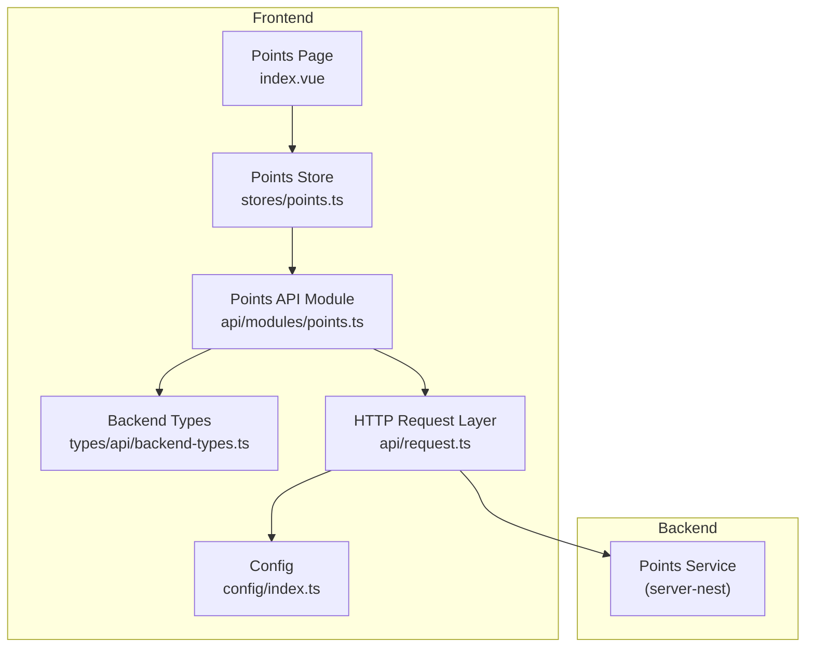
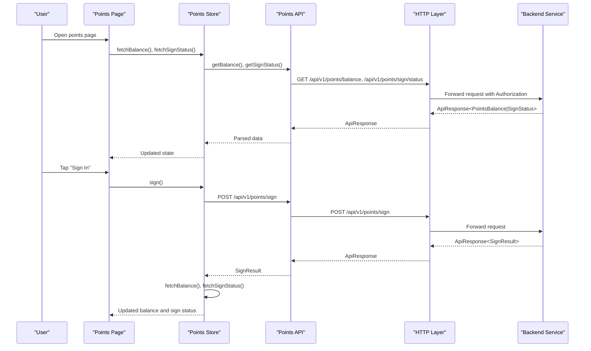
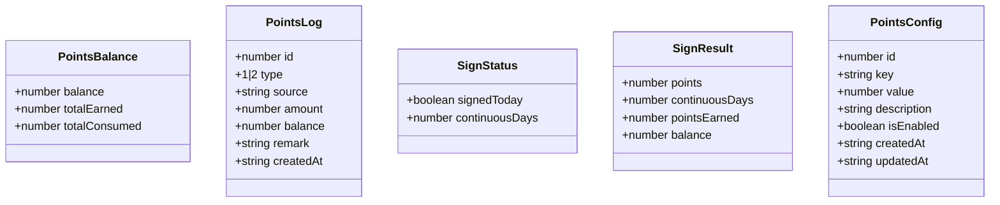
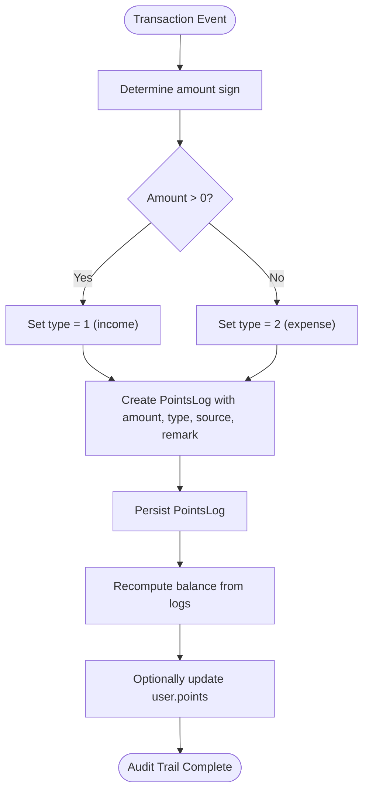
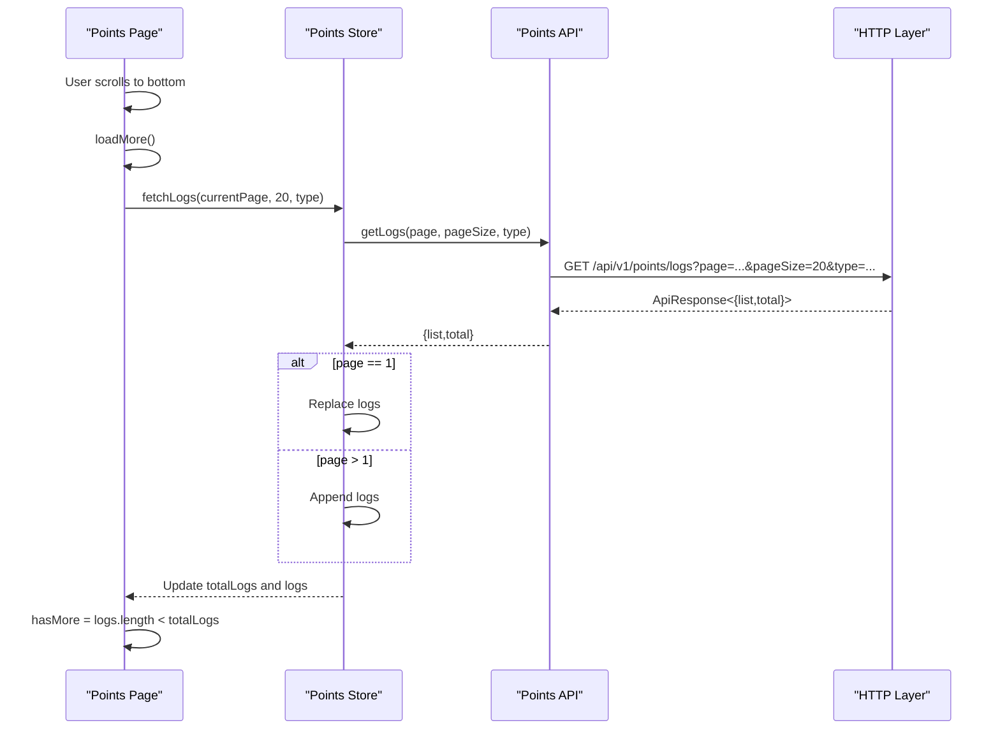
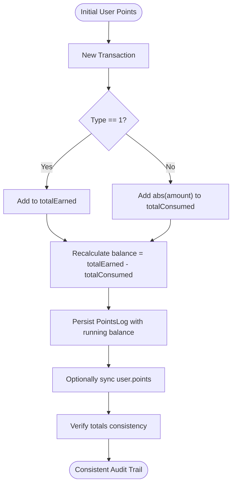
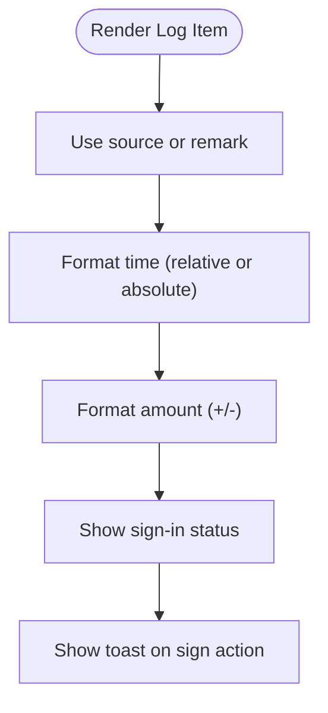
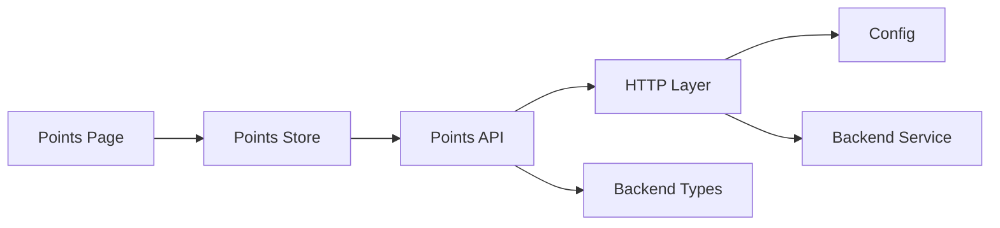

# Points Balance & Transactions

<cite>
**Referenced Files in This Document**
- [points.ts](file://src/api/modules/points.ts)
- [points.ts](file://src/stores/points.ts)
- [index.vue](file://src/pages/points/index.vue)
- [backend-types.ts](file://src/types/api/backend-types.ts)
- [request.ts](file://src/api/request.ts)
- [index.ts](file://src/config/index.ts)
- [points-balance-fix.md](file://docs/points-balance-fix.md)
- [points-list-pagination.md](file://docs/fix-deploy/points-list-pagination.md)
- [API_FIX_REPORT.md](file://API_FIX_REPORT.md)
- [format.ts](file://src/utils/format.ts)
</cite>

## Table of Contents
1. [Introduction](#introduction)
2. [Project Structure](#project-structure)
3. [Core Components](#core-components)
4. [Architecture Overview](#architecture-overview)
5. [Detailed Component Analysis](#detailed-component-analysis)
6. [Dependency Analysis](#dependency-analysis)
7. [Performance Considerations](#performance-considerations)
8. [Troubleshooting Guide](#troubleshooting-guide)
9. [Conclusion](#conclusion)
10. [Appendices](#appendices)

## Introduction
This document explains the points balance and transaction management system, covering the PointsBalance interface, transaction logging, API endpoints, pagination, filtering, and audit trail mechanics. It also documents how balances are computed, how transactions are recorded, and how the frontend displays points, logs, and sign-in status. Guidance is included for formatting, currency display, and status tracking.

## Project Structure
The points system spans three layers:
- Frontend API module: defines typed interfaces and HTTP endpoints for points operations
- Frontend store: manages state for balance, sign-in status, logs, and pagination
- Frontend page: renders UI, handles pagination, filtering, and user interactions

**Diagram sources**
- [index.vue:1-347](file://src/pages/points/index.vue#L1-L347)
- [points.ts:1-72](file://src/stores/points.ts#L1-L72)
- [points.ts:1-55](file://src/api/modules/points.ts#L1-L55)
- [backend-types.ts:344-359](file://src/types/api/backend-types.ts#L344-L359)
- [request.ts:1-228](file://src/api/request.ts#L1-L228)
- [index.ts:1-11](file://src/config/index.ts#L1-L11)

**Section sources**
- [points.ts:1-55](file://src/api/modules/points.ts#L1-L55)
- [points.ts:1-72](file://src/stores/points.ts#L1-L72)
- [index.vue:1-347](file://src/pages/points/index.vue#L1-L347)
- [backend-types.ts:344-359](file://src/types/api/backend-types.ts#L344-L359)
- [request.ts:1-228](file://src/api/request.ts#L1-L228)
- [index.ts:1-11](file://src/config/index.ts#L1-L11)

## Core Components
- PointsBalance: balance snapshot with total earned and total consumed
- PointsLog: transaction record with type categorization (1|2), source, amount, running balance, remark, and timestamp
- SignStatus and SignResult: daily sign-in state and reward result
- PointsConfig: backend configuration entries for points behavior
- API surface: balance, sign-in, sign-in status, logs, and configuration endpoints
- Store: state management for balance, sign-in, logs, pagination, and fetching helpers
- Page: UI rendering, pagination, filtering, and user actions

**Section sources**
- [points.ts:4-30](file://src/api/modules/points.ts#L4-L30)
- [backend-types.ts:344-359](file://src/types/api/backend-types.ts#L344-L359)
- [points.ts:8-11](file://src/stores/points.ts#L8-L11)
- [index.vue:1-347](file://src/pages/points/index.vue#L1-L347)

## Architecture Overview
The system follows a layered architecture:
- UI triggers actions (fetch balance, sign-in, load logs)
- Store orchestrates data fetching and state updates
- API module encapsulates endpoint definitions and request parameters
- HTTP layer handles auth headers, retries, and error feedback
- Backend computes balances and logs, ensuring auditability

**Diagram sources**
- [index.vue:84-136](file://src/pages/points/index.vue#L84-L136)
- [points.ts:13-41](file://src/stores/points.ts#L13-L41)
- [points.ts:33-40](file://src/api/modules/points.ts#L33-L40)
- [request.ts:75-208](file://src/api/request.ts#L75-L208)
- [API_FIX_REPORT.md:75-84](file://API_FIX_REPORT.md#L75-L84)

## Detailed Component Analysis

### PointsBalance and PointsLog Interfaces
- PointsBalance: exposes current balance and totals for auditing
- PointsLog: standardized transaction record with:
  - type: 1 for income, 2 for expenses
  - source: human-readable origin (fallback to remark)
  - amount: raw numeric change (positive for income, negative for expenses)
  - balance: running balance after the transaction
  - createdAt: ISO timestamp for ordering and display

**Diagram sources**
- [points.ts:4-30](file://src/api/modules/points.ts#L4-L30)
- [backend-types.ts:344-359](file://src/types/api/backend-types.ts#L344-L359)

**Section sources**
- [points.ts:4-30](file://src/api/modules/points.ts#L4-L30)
- [backend-types.ts:344-359](file://src/types/api/backend-types.ts#L344-L359)

### Transaction Logging Mechanisms
- Logging model supports auditability with explicit type categorization and running balance
- Amount semantics:
  - Income records: positive amount
  - Expense records: negative amount
- Backend balance computation:
  - Balance derived from logs (total income minus absolute value of expenses) to ensure consistency
  - Totals computed via SUM over logs grouped by type

**Diagram sources**
- [points-balance-fix.md:153-177](file://docs/points-balance-fix.md#L153-L177)
- [points-balance-fix.md:102-127](file://docs/points-balance-fix.md#L102-L127)

**Section sources**
- [points-balance-fix.md:1-264](file://docs/points-balance-fix.md#L1-L264)

### API Endpoints
- Balance retrieval: GET /api/v1/points/balance
- Sign-in: POST /api/v1/points/sign
- Sign-in status: GET /api/v1/points/sign/status
- Transaction logs: GET /api/v1/points/logs?page&pageSize&type
- Points configuration: GET /api/v1/points/config and GET /api/v1/points-configs

Notes:
- All endpoints are prefixed with /api/v1 per the API standardization report
- Logs endpoint supports pagination and optional type filter (1|2)

**Section sources**
- [points.ts:33-54](file://src/api/modules/points.ts#L33-L54)
- [API_FIX_REPORT.md:75-84](file://API_FIX_REPORT.md#L75-L84)

### Transaction Pagination and Filtering
- Frontend pagination:
  - Scroll container with @scrolltolower triggers loadMore
  - Page state managed with currentPage, hasMore, and loading flags
  - First page replaces list; subsequent pages append to preserve continuity
- Filtering:
  - Tabs map to type filter: 0=all, 1=income, 2=expenses
  - Watch on activeTab resets pagination and reloads

**Diagram sources**
- [index.vue:95-121](file://src/pages/points/index.vue#L95-L121)
- [points.ts:43-58](file://src/stores/points.ts#L43-L58)
- [points.ts:42-47](file://src/api/modules/points.ts#L42-L47)

**Section sources**
- [index.vue:95-121](file://src/pages/points/index.vue#L95-L121)
- [points.ts:43-58](file://src/stores/points.ts#L43-L58)
- [points.ts:42-47](file://src/api/modules/points.ts#L42-L47)
- [points-list-pagination.md:1-346](file://docs/fix-deploy/points-list-pagination.md#L1-L346)

### Balance Updates and Audit Trails
- Balance calculation:
  - totalEarned = SUM(income amounts)
  - totalConsumed = SUM(absolute expense amounts)
  - balance = totalEarned - totalConsumed
- Audit trail:
  - Every change creates a PointsLog with precise amount, type, source, and timestamp
  - Running balance stored per log for verification

**Diagram sources**
- [points-balance-fix.md:102-127](file://docs/points-balance-fix.md#L102-L127)
- [points-balance-fix.md:190-195](file://docs/points-balance-fix.md#L190-L195)

**Section sources**
- [points-balance-fix.md:1-264](file://docs/points-balance-fix.md#L1-L264)

### Points Formatting, Currency Display, and Status Tracking
- Time formatting:
  - Relative time for today/yesterday/days ago
  - Absolute date fallback for older entries
- Amount display:
  - Income shown with leading "+"
  - Expenses shown with leading "-"
- Status tracking:
  - Sign-in status indicates whether signed in today and continuous streak
  - Toast notifications confirm sign-in rewards

**Diagram sources**
- [index.vue:47-68](file://src/pages/points/index.vue#L47-L68)
- [index.vue:138-141](file://src/pages/points/index.vue#L138-L141)
- [format.ts:8-23](file://src/utils/format.ts#L8-L23)

**Section sources**
- [index.vue:138-141](file://src/pages/points/index.vue#L138-L141)
- [format.ts:8-23](file://src/utils/format.ts#L8-L23)

## Dependency Analysis
- Frontend depends on:
  - API module for endpoint definitions and typed responses
  - Store for state orchestration and pagination logic
  - HTTP layer for auth headers, token refresh, and error handling
  - Config for base URLs and timeouts
- Backend depends on:
  - Points service for balance computation and log aggregation
  - Database for persisted logs and user points

**Diagram sources**
- [index.vue:72-142](file://src/pages/points/index.vue#L72-L142)
- [points.ts:1-72](file://src/stores/points.ts#L1-L72)
- [points.ts:1-55](file://src/api/modules/points.ts#L1-L55)
- [request.ts:1-228](file://src/api/request.ts#L1-L228)
- [index.ts:1-11](file://src/config/index.ts#L1-L11)

**Section sources**
- [points.ts:1-55](file://src/api/modules/points.ts#L1-L55)
- [points.ts:1-72](file://src/stores/points.ts#L1-L72)
- [request.ts:1-228](file://src/api/request.ts#L1-L228)
- [index.ts:1-11](file://src/config/index.ts#L1-L11)

## Performance Considerations
- Pagination:
  - Load only 20 items per page; append subsequent pages to avoid re-fetching
  - Stop loading when local count equals total
- Rendering:
  - For very large histories, consider virtualized lists to reduce DOM nodes
- Caching:
  - Cache recent pages locally to minimize network requests
- Backend:
  - Balance recomputation from logs ensures correctness; consider caching totals for frequently accessed users

[No sources needed since this section provides general guidance]

## Troubleshooting Guide
Common issues and resolutions:
- Balance mismatch between totalEarned - totalConsumed and current balance:
  - Ensure backend computes balance from logs and not solely from user.points
  - Verify amount signs: income positive, expenses negative
- Logs not appearing in full history:
  - Confirm pagination is enabled and loadMore is triggered on scroll
  - Ensure first page replaces while later pages append
- API path errors:
  - Verify endpoints are prefixed with /api/v1
  - Check baseURL configuration and environment variables

**Section sources**
- [points-balance-fix.md:1-264](file://docs/points-balance-fix.md#L1-L264)
- [points-list-pagination.md:1-346](file://docs/fix-deploy/points-list-pagination.md#L1-L346)
- [API_FIX_REPORT.md:75-84](file://API_FIX_REPORT.md#L75-L84)
- [index.ts:1-11](file://src/config/index.ts#L1-L11)

## Conclusion
The points system integrates typed interfaces, robust transaction logging, pagination, and clear UI feedback. By computing balances from logs and persisting every change, it maintains a reliable audit trail. The frontend’s pagination and filtering enable users to explore their complete history, while formatting utilities enhance readability.

[No sources needed since this section summarizes without analyzing specific files]

## Appendices

### API Endpoint Reference
- GET /api/v1/points/balance → PointsBalance
- POST /api/v1/points/sign → SignResult
- GET /api/v1/points/sign/status → SignStatus
- GET /api/v1/points/logs?page&pageSize&type → { list: PointsLog[], total: number }
- GET /api/v1/points/config → PointsConfig[]
- GET /api/v1/points-configs → PointsConfig[]

**Section sources**
- [points.ts:33-54](file://src/api/modules/points.ts#L33-L54)
- [API_FIX_REPORT.md:75-84](file://API_FIX_REPORT.md#L75-L84)