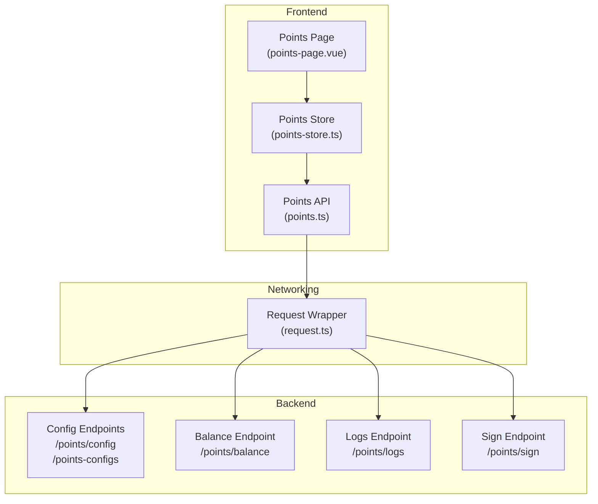
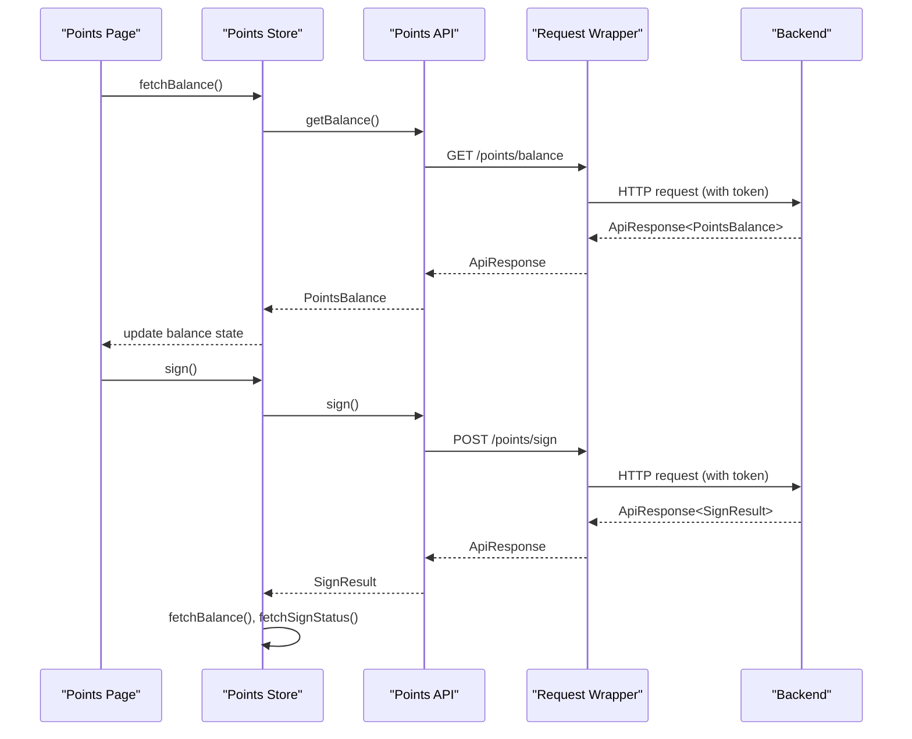
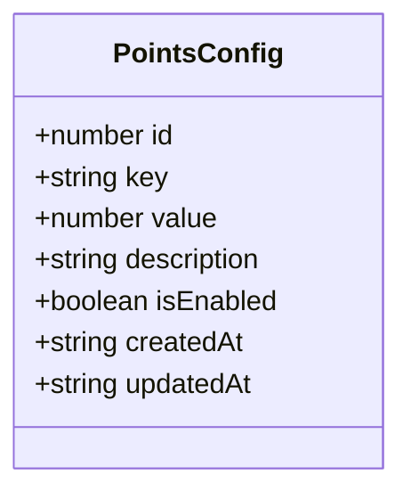
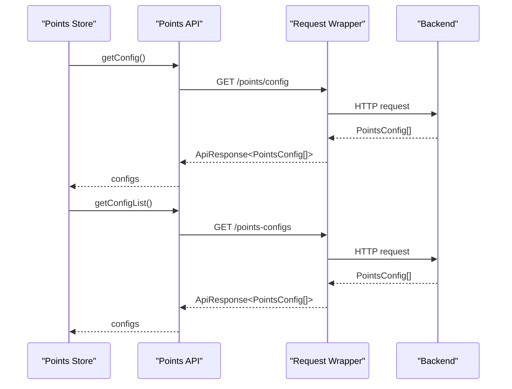
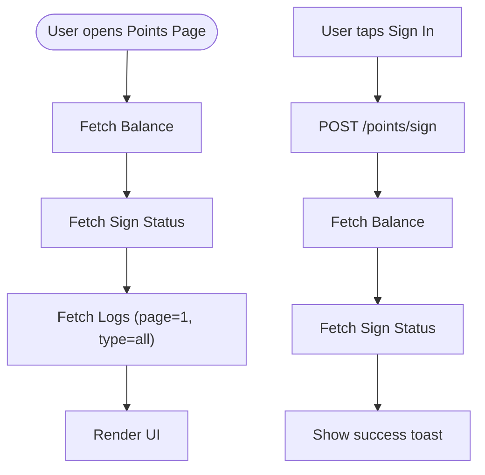
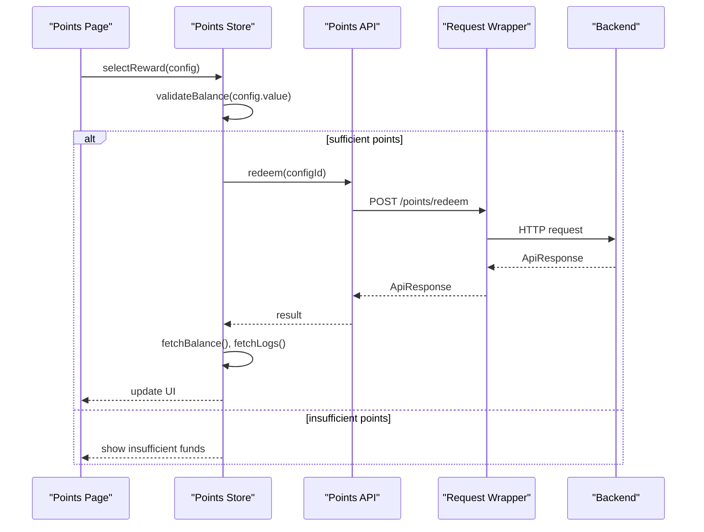
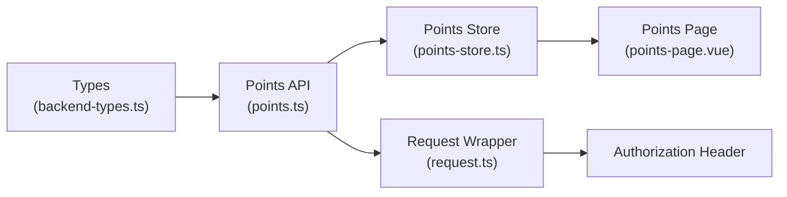

# Points Configuration & Rewards

<cite>
**Referenced Files in This Document**
- [points.ts](file://src/api/modules/points.ts)
- [backend-types.ts](file://src/types/api/backend-types.ts)
- [points-store.ts](file://src/stores/points.ts)
- [points-page.vue](file://src/pages/points/index.vue)
- [request.ts](file://src/api/request.ts)
- [config.ts](file://src/api/modules/config.ts)
- [points-balance-fix.md](file://docs/points-balance-fix.md)
</cite>

## Table of Contents
1. [Introduction](#introduction)
2. [Project Structure](#project-structure)
3. [Core Components](#core-components)
4. [Architecture Overview](#architecture-overview)
5. [Detailed Component Analysis](#detailed-component-analysis)
6. [Dependency Analysis](#dependency-analysis)
7. [Performance Considerations](#performance-considerations)
8. [Troubleshooting Guide](#troubleshooting-guide)
9. [Conclusion](#conclusion)

## Introduction
This document explains the points configuration and reward management system, focusing on:
- Points configuration model and retrieval APIs
- Reward catalog retrieval via configuration endpoints
- Point balance, logs, and sign-in mechanics
- Inventory and availability considerations for rewards
- Redemption workflows, point deduction, and expiration/priority handling
- Integration with external reward providers and loyalty programs

The system exposes configuration-driven reward tiers and supports dynamic catalogs through `/points/config` and `/points-configs`.

## Project Structure
The points and rewards subsystem spans three layers:
- API module: client-side HTTP endpoints for points and configuration
- Store: reactive state management for balances, logs, and sign-in status
- Page: UI for viewing balance, logs, and signing in

**Diagram sources**
- [points-page.vue:1-347](file://src/pages/points/index.vue#L1-L347)
- [points-store.ts:1-72](file://src/stores/points.ts#L1-L72)
- [points.ts:32-54](file://src/api/modules/points.ts#L32-L54)
- [request.ts:4-228](file://src/api/request.ts#L4-L228)

**Section sources**
- [points.ts:32-54](file://src/api/modules/points.ts#L32-L54)
- [points-store.ts:1-72](file://src/stores/points.ts#L1-L72)
- [points-page.vue:1-347](file://src/pages/points/index.vue#L1-L347)
- [request.ts:4-228](file://src/api/request.ts#L4-L228)

## Core Components
- Points configuration model: key-value numeric configuration with enablement flag
- Reward catalog retrieval: two endpoints returning lists of configuration entries
- Balance and logs: current points, total earned/consumed, and transaction history
- Sign-in flow: daily sign-in with streak tracking and point crediting

Key types and endpoints:
- PointsConfig: configuration entries for reward tiers and settings
- getConfig(): returns active reward configuration list
- getConfigList(): returns all configuration entries (admin/internal)
- getBalance(), getLogs(), sign(), getSignStatus()

**Section sources**
- [backend-types.ts:341-369](file://src/types/api/backend-types.ts#L341-L369)
- [points.ts:32-54](file://src/api/modules/points.ts#L32-L54)

## Architecture Overview
The frontend integrates with backend endpoints through a typed API module and a Pinia store. Authentication tokens are attached automatically by the request wrapper.

**Diagram sources**
- [points-page.vue:84-136](file://src/pages/points/index.vue#L84-L136)
- [points-store.ts:13-41](file://src/stores/points.ts#L13-L41)
- [points.ts:33-37](file://src/api/modules/points.ts#L33-L37)
- [request.ts:15-24](file://src/api/request.ts#L15-L24)

## Detailed Component Analysis

### Points Configuration Model
PointsConfig defines the reward configuration structure:
- id: unique identifier
- key: configuration key (used for reward identifiers)
- value: numeric value (e.g., point cost, tier threshold)
- description: human-readable label
- isEnabled: enable/disable flag
- createdAt/updatedAt: timestamps

Reward tiers and catalogs are driven by these configurations. The frontend retrieves them via getConfig() and getConfigList().

**Diagram sources**
- [backend-types.ts:344-359](file://src/types/api/backend-types.ts#L344-L359)

**Section sources**
- [backend-types.ts:341-369](file://src/types/api/backend-types.ts#L341-L369)

### Reward Catalog Retrieval APIs
Two endpoints expose configuration-driven reward catalogs:
- GET /points/config → PointsConfig[]
- GET /points-configs → PointsConfig[]

These endpoints return lists of configurations suitable for building reward catalogs. The difference between them is typically administrative vs. public exposure.

**Diagram sources**
- [points.ts:49-53](file://src/api/modules/points.ts#L49-L53)
- [request.ts:210-216](file://src/api/request.ts#L210-L216)

**Section sources**
- [points.ts:49-53](file://src/api/modules/points.ts#L49-L53)

### Balance, Logs, and Sign-In
The store manages:
- Current balance and totals (earned/consumed)
- Sign-in status (today’s status and streak)
- Points logs with pagination and filtering by type

Endpoints:
- GET /points/balance
- GET /points/logs?page&pageSize&type
- GET /points/sign/status
- POST /points/sign

**Diagram sources**
- [points-page.vue:84-136](file://src/pages/points/index.vue#L84-L136)
- [points-store.ts:13-41](file://src/stores/points.ts#L13-L41)
- [points.ts:33-47](file://src/api/modules/points.ts#L33-L47)

**Section sources**
- [points-store.ts:13-41](file://src/stores/points.ts#L13-L41)
- [points.ts:33-47](file://src/api/modules/points.ts#L33-L47)
- [points-page.vue:18-68](file://src/pages/points/index.vue#L18-L68)

### Reward Categories, Requirements, and Availability
- Categories: derived from PointsConfig.key and description; use these to group rewards (e.g., “Tier 1”, “Subscription Vouchers”)
- Point requirements: use PointsConfig.value as the cost or threshold for each reward
- Availability: use PointsConfig.isEnabled to hide inactive rewards
- Priority: order configurations by createdAt or a dedicated sort field if present; otherwise rely on backend ordering

Operational guidance:
- Build reward cards from PointsConfig entries returned by getConfig()/getConfigList()
- Filter by isEnabled for visibility
- Sort by createdAt or a custom field to establish priority
- Enforce point requirement checks before allowing redemption

[No sources needed since this section synthesizes behavior from existing types and endpoints]

### Redemption Workflow, Inventory, and Point Deduction
End-to-end redemption flow:
1. Fetch current balance to validate sufficient points
2. Present reward selection (from getConfig()/getConfigList())
3. On confirm:
   - Deduct points (via a backend redemption endpoint)
   - Persist transaction in logs
   - Update local balance and logs
4. Handle inventory:
   - Backend tracks reward stock and availability
   - Frontend should disable redeemed items and refresh catalog after purchase

Note: The frontend currently exposes balance and logs but does not implement a redemption endpoint in the shown files. Integrate with a backend redemption endpoint and update the store accordingly.

**Diagram sources**
- [points-store.ts:13-41](file://src/stores/points.ts#L13-L41)
- [points.ts:33-47](file://src/api/modules/points.ts#L33-L47)
- [request.ts:210-216](file://src/api/request.ts#L210-L216)

**Section sources**
- [points-store.ts:13-41](file://src/stores/points.ts#L13-L41)
- [points.ts:33-47](file://src/api/modules/points.ts#L33-L47)

### Expiration Policies, Priority Systems, and Custom Rewards
- Expiration: if rewards require expiration, include an expiration timestamp in PointsConfig or extend the model with an expiry field; enforce checks before allowing redemption
- Priority: order configurations by createdAt or a dedicated priority field; display higher-priority items first
- Custom rewards: introduce new keys in PointsConfig for custom reward types; ensure backend validates and applies appropriate business rules

[No sources needed since this section proposes extension points based on existing configuration model]

### Integration with External Providers and Loyalty Programs
- External provider integration: map external reward SKUs to PointsConfig.key and value; maintain a mapping table in backend for provider-specific attributes
- Loyalty program partnerships: expose partner tiers via PointsConfig; use isEnabled to toggle promotional periods; sync provider inventory via scheduled jobs

[No sources needed since this section outlines integration patterns]

## Dependency Analysis
The points system depends on:
- Types for PointsConfig and PointsLog
- API module for HTTP endpoints
- Store for state management
- Request wrapper for authentication and retries

**Diagram sources**
- [backend-types.ts:341-369](file://src/types/api/backend-types.ts#L341-L369)
- [points.ts:32-54](file://src/api/modules/points.ts#L32-L54)
- [points-store.ts:1-72](file://src/stores/points.ts#L1-72)
- [points-page.vue:1-347](file://src/pages/points/index.vue#L1-L347)
- [request.ts:15-24](file://src/api/request.ts#L15-L24)

**Section sources**
- [backend-types.ts:341-369](file://src/types/api/backend-types.ts#L341-L369)
- [points.ts:32-54](file://src/api/modules/points.ts#L32-L54)
- [points-store.ts:1-72](file://src/stores/points.ts#L1-72)
- [points-page.vue:1-347](file://src/pages/points/index.vue#L1-L347)
- [request.ts:15-24](file://src/api/request.ts#L15-L24)

## Performance Considerations
- Balance calculation: the current frontend displays raw balance and computed totals; see the balance fix document for reconciling discrepancies by computing balance from logs
- Pagination: logs support pagination; avoid loading large datasets at once
- Token refresh: the request wrapper handles token refresh automatically; ensure endpoints are idempotent where possible

[No sources needed since this section provides general guidance]

## Troubleshooting Guide
Common issues and resolutions:
- Balance mismatch: if totalEarned - totalConsumed differs from balance, compute balance from logs as recommended in the balance fix document
- Token expiration: the request wrapper refreshes tokens automatically; unauthorized errors trigger re-login flow
- Network failures: the request wrapper shows toast messages for network errors

**Section sources**
- [points-balance-fix.md:100-128](file://docs/points-balance-fix.md#L100-L128)
- [request.ts:100-147](file://src/api/request.ts#L100-L147)

## Conclusion
The points configuration and reward system is configuration-driven via PointsConfig, exposing reward catalogs through dedicated endpoints. The frontend integrates balance, logs, and sign-in flows, while redemption and inventory controls should be wired to backend endpoints. Extend the model with expiration, priority, and provider-specific fields to support advanced reward management and external integrations.