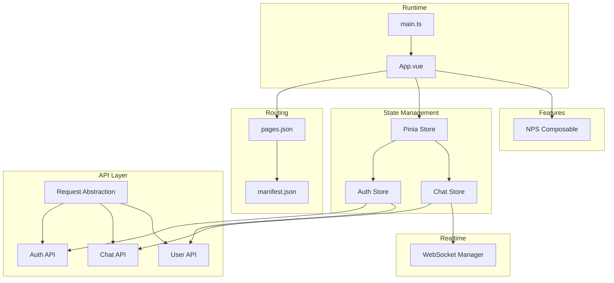
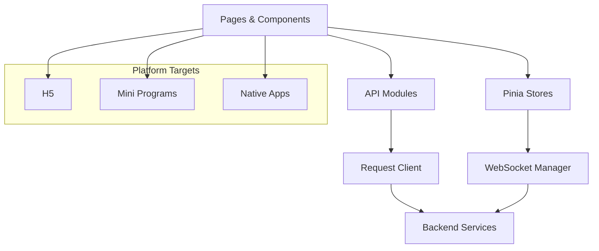
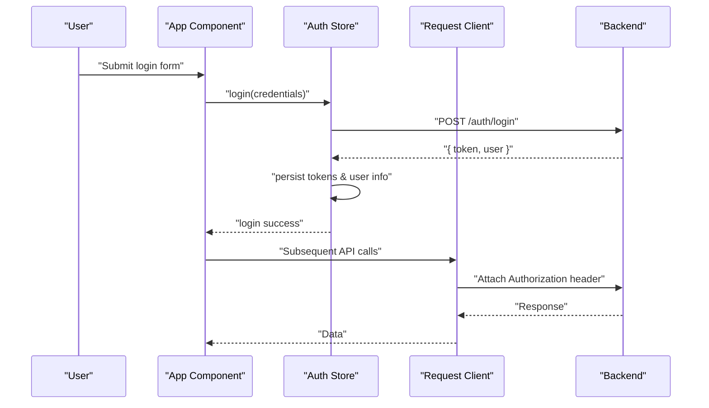
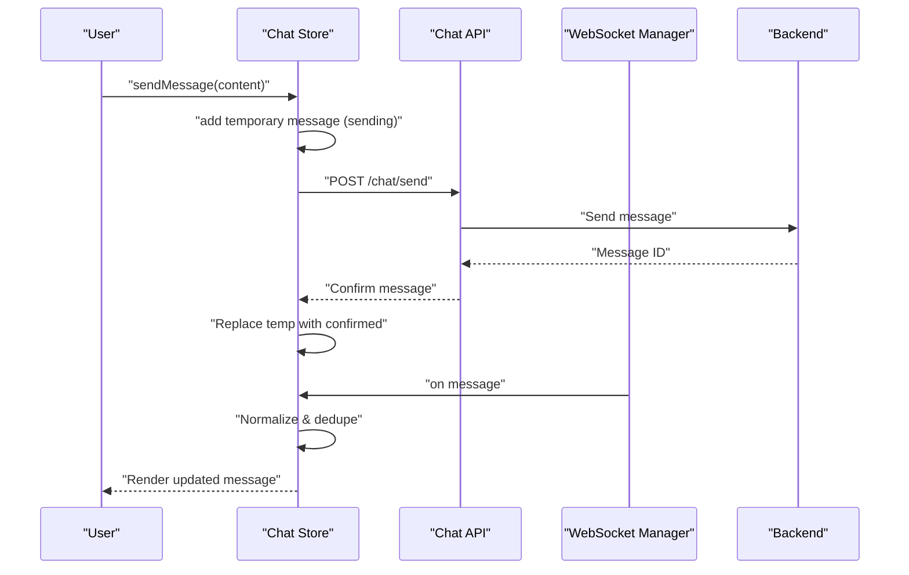
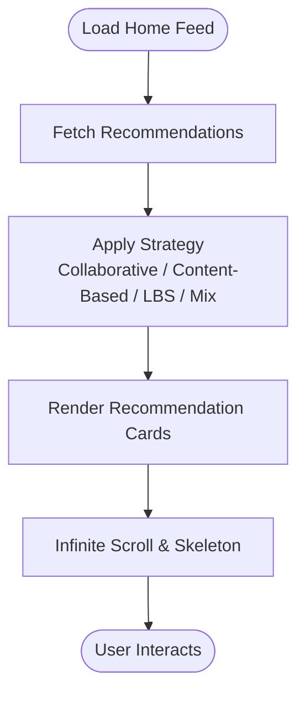
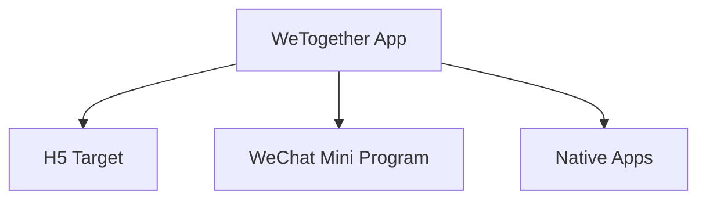
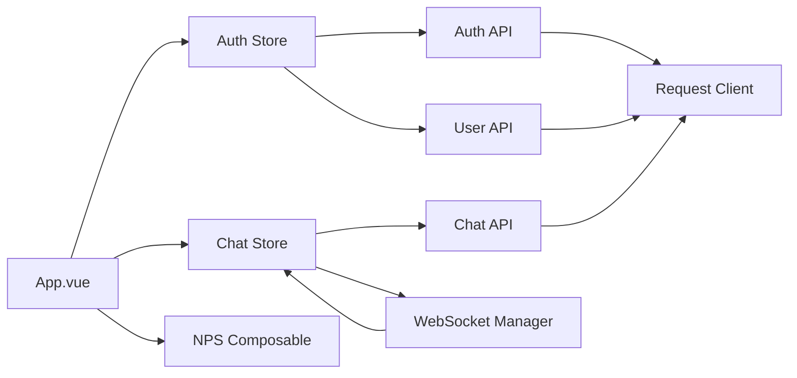

# Project Overview

<cite>
**Referenced Files in This Document**
- [package.json](file://package.json)
- [src/main.ts](file://src/main.ts)
- [src/App.vue](file://src/App.vue)
- [src/pages.json](file://src/pages.json)
- [src/manifest.json](file://src/manifest.json)
- [src/api/request.ts](file://src/api/request.ts)
- [src/api/modules/auth.ts](file://src/api/modules/auth.ts)
- [src/api/modules/chat.ts](file://src/api/modules/chat.ts)
- [src/api/modules/user.ts](file://src/api/modules/user.ts)
- [src/stores/auth.ts](file://src/stores/auth.ts)
- [src/stores/chat.ts](file://src/stores/chat.ts)
- [src/utils/websocket.ts](file://src/utils/websocket.ts)
- [src/composables/useNPS.ts](file://src/composables/useNPS.ts)
</cite>

## Table of Contents
1. [Introduction](#introduction)
2. [Project Structure](#project-structure)
3. [Core Components](#core-components)
4. [Architecture Overview](#architecture-overview)
5. [Detailed Component Analysis](#detailed-component-analysis)
6. [Dependency Analysis](#dependency-analysis)
7. [Performance Considerations](#performance-considerations)
8. [Troubleshooting Guide](#troubleshooting-guide)
9. [Conclusion](#conclusion)

## Introduction
WeTogether is a cross-platform social networking application designed to bring people together through shared interests and meaningful interactions. Built with UniApp and TypeScript, the platform targets a broad audience seeking genuine connections across H5, WeChat Mini Program, and native mobile environments. Its core value proposition lies in enabling real-time communication, personalized recommendations, and a robust social graph, while maintaining a consistent user experience across platforms.

Key capabilities include:
- Real-time messaging with optimistic updates and server acknowledgments
- Recommendation engine integrated into the home feed (collaborative filtering, content-based strategies, LBS, and hybrid ranking)
- Social networking features such as friend lists, profiles, posts, and nearby discovery
- Authentication and user management with secure token handling and refresh flows
- Event-driven feedback collection via an embedded NPS module

## Project Structure
The project follows a modular, feature-oriented structure aligned with UniApp conventions:
- Application bootstrap and global initialization in the main entry
- Page routing and tabbar configuration for navigation
- API abstraction layer with typed requests and interceptors
- Pinia stores for centralized state management (authentication, chat, friends, square, points)
- Real-time communication via WebSocket manager
- Business components and composables for reusable logic

**Diagram sources**
- [src/main.ts:1-18](file://src/main.ts#L1-L18)
- [src/App.vue:1-103](file://src/App.vue#L1-L103)
- [src/pages.json:1-253](file://src/pages.json#L1-L253)
- [src/manifest.json:1-48](file://src/manifest.json#L1-L48)
- [src/api/request.ts:1-228](file://src/api/request.ts#L1-L228)
- [src/api/modules/auth.ts:1-57](file://src/api/modules/auth.ts#L1-L57)
- [src/api/modules/chat.ts:1-42](file://src/api/modules/chat.ts#L1-L42)
- [src/api/modules/user.ts:1-97](file://src/api/modules/user.ts#L1-L97)
- [src/stores/auth.ts:1-137](file://src/stores/auth.ts#L1-L137)
- [src/stores/chat.ts:1-234](file://src/stores/chat.ts#L1-L234)
- [src/utils/websocket.ts:1-171](file://src/utils/websocket.ts#L1-L171)
- [src/composables/useNPS.ts:1-145](file://src/composables/useNPS.ts#L1-L145)

**Section sources**
- [src/main.ts:1-18](file://src/main.ts#L1-L18)
- [src/App.vue:1-103](file://src/App.vue#L1-L103)
- [src/pages.json:1-253](file://src/pages.json#L1-L253)
- [src/manifest.json:1-48](file://src/manifest.json#L1-L48)

## Core Components
- Application bootstrap and state initialization:
  - Global app lifecycle hooks initialize authentication state and render a global NPS modal.
  - Pinia is configured with persisted state support for seamless UX across sessions.
- Routing and platform configuration:
  - pages.json defines pages, tabbar, and global styles.
  - manifest.json configures platform-specific settings for H5 and mini-program targets.
- API abstraction and authentication:
  - Centralized request client handles base URLs, timeouts, headers, and token refresh logic.
  - Auth API supports SMS, registration, login, password reset, and token refresh.
- Real-time messaging:
  - WebSocket manager connects with authentication, handles heartbeats, and dispatches incoming messages to the chat store.
- State management:
  - Auth store manages tokens, user info, and profile updates with persistence.
  - Chat store orchestrates conversations, message history, optimistic sends, and real-time sync.
- Feature composables:
  - NPS composable encapsulates trigger logic, visibility, and success callbacks.

**Section sources**
- [src/App.vue:1-103](file://src/App.vue#L1-L103)
- [src/main.ts:1-18](file://src/main.ts#L1-L18)
- [src/pages.json:1-253](file://src/pages.json#L1-L253)
- [src/manifest.json:1-48](file://src/manifest.json#L1-L48)
- [src/api/request.ts:1-228](file://src/api/request.ts#L1-L228)
- [src/api/modules/auth.ts:1-57](file://src/api/modules/auth.ts#L1-L57)
- [src/stores/auth.ts:1-137](file://src/stores/auth.ts#L1-L137)
- [src/stores/chat.ts:1-234](file://src/stores/chat.ts#L1-L234)
- [src/utils/websocket.ts:1-171](file://src/utils/websocket.ts#L1-L171)
- [src/composables/useNPS.ts:1-145](file://src/composables/useNPS.ts#L1-L145)

## Architecture Overview
WeTogether adopts a layered architecture:
- Presentation layer: UniApp pages and components organized by feature and tabbar.
- Domain services: API modules encapsulate backend contracts and typed DTOs.
- Infrastructure: Request client with interceptor logic for token refresh and unified error handling.
- State management: Pinia stores for auth and chat with persistence.
- Real-time layer: WebSocket manager for live messaging with heartbeat and reconnection.
- Cross-platform runtime: UniApp’s platform abstraction enables deployment to H5, WeChat Mini Program, and native apps.

**Diagram sources**
- [src/api/request.ts:1-228](file://src/api/request.ts#L1-L228)
- [src/stores/auth.ts:1-137](file://src/stores/auth.ts#L1-L137)
- [src/stores/chat.ts:1-234](file://src/stores/chat.ts#L1-L234)
- [src/utils/websocket.ts:1-171](file://src/utils/websocket.ts#L1-L171)
- [src/pages.json:1-253](file://src/pages.json#L1-L253)
- [src/manifest.json:1-48](file://src/manifest.json#L1-L48)

## Detailed Component Analysis

### Authentication and Session Management
The authentication subsystem integrates tightly with the API layer and state store:
- Token lifecycle: login/register returns tokens; refresh endpoint extends sessions; logout clears storage.
- Persisted state: Pinia persisted state ensures login continuity across sessions.
- Header injection: Request client automatically attaches Authorization headers and retries on token refresh.

**Diagram sources**
- [src/stores/auth.ts:18-42](file://src/stores/auth.ts#L18-L42)
- [src/api/modules/auth.ts:33-49](file://src/api/modules/auth.ts#L33-L49)
- [src/api/request.ts:15-24](file://src/api/request.ts#L15-L24)

**Section sources**
- [src/stores/auth.ts:1-137](file://src/stores/auth.ts#L1-L137)
- [src/api/modules/auth.ts:1-57](file://src/api/modules/auth.ts#L1-L57)
- [src/api/request.ts:1-228](file://src/api/request.ts#L1-L228)

### Real-Time Messaging Flow
The messaging system combines optimistic UI updates with server acknowledgments and WebSocket synchronization:
- Optimistic send: immediately append a temporary message with sending status.
- Backend confirmation: replace temporary message with server-provided data.
- WebSocket ingestion: incoming messages are normalized, deduplicated, and appended to the current chat.
- Heartbeat and reconnection: periodic ping/pong and exponential backoff for resilience.

**Diagram sources**
- [src/stores/chat.ts:50-90](file://src/stores/chat.ts#L50-L90)
- [src/stores/chat.ts:100-210](file://src/stores/chat.ts#L100-L210)
- [src/api/modules/chat.ts:18-26](file://src/api/modules/chat.ts#L18-L26)
- [src/utils/websocket.ts:93-111](file://src/utils/websocket.ts#L93-L111)

**Section sources**
- [src/stores/chat.ts:1-234](file://src/stores/chat.ts#L1-L234)
- [src/api/modules/chat.ts:1-42](file://src/api/modules/chat.ts#L1-L42)
- [src/utils/websocket.ts:1-171](file://src/utils/websocket.ts#L1-L171)

### Recommendation Engine Integration
The home feed incorporates recommendation strategies:
- Collaborative filtering, content-based filtering, hot ranking, and LBS-based suggestions.
- Hybrid strategy composes multiple signals for diverse and relevant suggestions.
- UI cards adapt to skeleton loading and infinite scroll for smooth UX.

**Diagram sources**
- [src/pages/tabbar/home/algorithms/collaborative.ts](file://src/pages/tabbar/home/algorithms/collaborative.ts)
- [src/pages/tabbar/home/algorithms/contentBased.ts](file://src/pages/tabbar/home/algorithms/contentBased.ts)
- [src/pages/tabbar/home/algorithms/hotRanking.ts](file://src/pages/tabbar/home/algorithms/hotRanking.ts)
- [src/pages/tabbar/home/algorithms/lbs.ts](file://src/pages/tabbar/home/algorithms/lbs.ts)
- [src/pages/tabbar/home/algorithms/mixStrategy.ts](file://src/pages/tabbar/home/algorithms/mixStrategy.ts)
- [src/pages/tabbar/home/components/RecommendationCard.vue](file://src/pages/tabbar/home/components/RecommendationCard.vue)
- [src/pages/tabbar/home/composables/useRecommendation.ts](file://src/pages/tabbar/home/composables/useRecommendation.ts)

**Section sources**
- [src/pages/tabbar/home/algorithms/collaborative.ts](file://src/pages/tabbar/home/algorithms/collaborative.ts)
- [src/pages/tabbar/home/algorithms/contentBased.ts](file://src/pages/tabbar/home/algorithms/contentBased.ts)
- [src/pages/tabbar/home/algorithms/hotRanking.ts](file://src/pages/tabbar/home/algorithms/hotRanking.ts)
- [src/pages/tabbar/home/algorithms/lbs.ts](file://src/pages/tabbar/home/algorithms/lbs.ts)
- [src/pages/tabbar/home/algorithms/mixStrategy.ts](file://src/pages/tabbar/home/algorithms/mixStrategy.ts)
- [src/pages/tabbar/home/components/RecommendationCard.vue](file://src/pages/tabbar/home/components/RecommendationCard.vue)
- [src/pages/tabbar/home/composables/useRecommendation.ts](file://src/pages/tabbar/home/composables/useRecommendation.ts)

### Cross-Platform Deployment Targets
WeTogether leverages UniApp’s platform abstraction to deliver a consistent experience:
- H5: Web browser deployment with SSR mode support.
- Mini Programs: WeChat Mini Program and others via platform-specific manifests.
- Native Apps: Android/iOS builds through UniApp Plus runtime.

**Diagram sources**
- [package.json:4-43](file://package.json#L4-L43)
- [src/manifest.json:28-43](file://src/manifest.json#L28-L43)

**Section sources**
- [package.json:1-100](file://package.json#L1-L100)
- [src/manifest.json:1-48](file://src/manifest.json#L1-L48)

## Dependency Analysis
The application exhibits clear separation of concerns:
- UI depends on Pinia stores for state and on API modules for data.
- API modules depend on the request client for transport and token handling.
- WebSocket manager depends on auth store and chat store for message routing.
- App lifecycle initializes stores and renders global modals.

**Diagram sources**
- [src/App.vue:1-103](file://src/App.vue#L1-L103)
- [src/stores/auth.ts:1-137](file://src/stores/auth.ts#L1-L137)
- [src/stores/chat.ts:1-234](file://src/stores/chat.ts#L1-L234)
- [src/api/request.ts:1-228](file://src/api/request.ts#L1-L228)
- [src/api/modules/auth.ts:1-57](file://src/api/modules/auth.ts#L1-L57)
- [src/api/modules/chat.ts:1-42](file://src/api/modules/chat.ts#L1-L42)
- [src/api/modules/user.ts:1-97](file://src/api/modules/user.ts#L1-L97)
- [src/utils/websocket.ts:1-171](file://src/utils/websocket.ts#L1-L171)
- [src/composables/useNPS.ts:1-145](file://src/composables/useNPS.ts#L1-L145)

**Section sources**
- [src/App.vue:1-103](file://src/App.vue#L1-L103)
- [src/stores/auth.ts:1-137](file://src/stores/auth.ts#L1-L137)
- [src/stores/chat.ts:1-234](file://src/stores/chat.ts#L1-L234)
- [src/api/request.ts:1-228](file://src/api/request.ts#L1-L228)
- [src/api/modules/auth.ts:1-57](file://src/api/modules/auth.ts#L1-L57)
- [src/api/modules/chat.ts:1-42](file://src/api/modules/chat.ts#L1-L42)
- [src/api/modules/user.ts:1-97](file://src/api/modules/user.ts#L1-L97)
- [src/utils/websocket.ts:1-171](file://src/utils/websocket.ts#L1-L171)
- [src/composables/useNPS.ts:1-145](file://src/composables/useNPS.ts#L1-L145)

## Performance Considerations
- Network efficiency: Centralized request client reduces duplication and standardizes retry and refresh logic.
- State locality: Pinia stores keep frequently accessed data close to components, minimizing prop drilling.
- Real-time reliability: WebSocket heartbeats and bounded reconnection attempts improve resilience under network variability.
- Rendering scalability: Infinite scroll and skeleton loaders enhance perceived performance on the home feed and chat history.

## Troubleshooting Guide
Common scenarios and remedies:
- Authentication failures:
  - Symptom: Unauthorized errors after token expiration.
  - Action: The request client automatically refreshes tokens; if refresh fails, the app clears stored credentials and navigates to the login page.
- Real-time disconnections:
  - Symptom: Messages not updating or delayed delivery.
  - Action: Verify WebSocket connectivity, review heartbeat logs, and confirm token presence for authentication.
- Chat message duplication:
  - Symptom: Duplicate messages appear after reconnect or multi-device sync.
  - Action: The chat store deduplicates by message ID and normalizes sender/receiver IDs; ensure IDs are unique and consistent.
- Platform-specific issues:
  - Symptom: Differences in behavior across H5, WeChat Mini Program, and native apps.
  - Action: Review platform-specific configurations in the manifest and ensure APIs are adapted to each environment.

**Section sources**
- [src/api/request.ts:100-147](file://src/api/request.ts#L100-L147)
- [src/utils/websocket.ts:128-141](file://src/utils/websocket.ts#L128-L141)
- [src/stores/chat.ts:123-128](file://src/stores/chat.ts#L123-L128)
- [src/manifest.json:1-48](file://src/manifest.json#L1-L48)

## Conclusion
WeTogether delivers a cohesive, cross-platform social networking experience powered by UniApp and TypeScript. Its architecture emphasizes real-time communication, personalized recommendations, and persistent state management, enabling users to discover meaningful connections across H5, WeChat Mini Program, and native applications. By leveraging a modular API layer, resilient WebSocket integration, and thoughtful state orchestration, the platform scales toward a rich, interactive ecosystem for shared interests and authentic interactions.